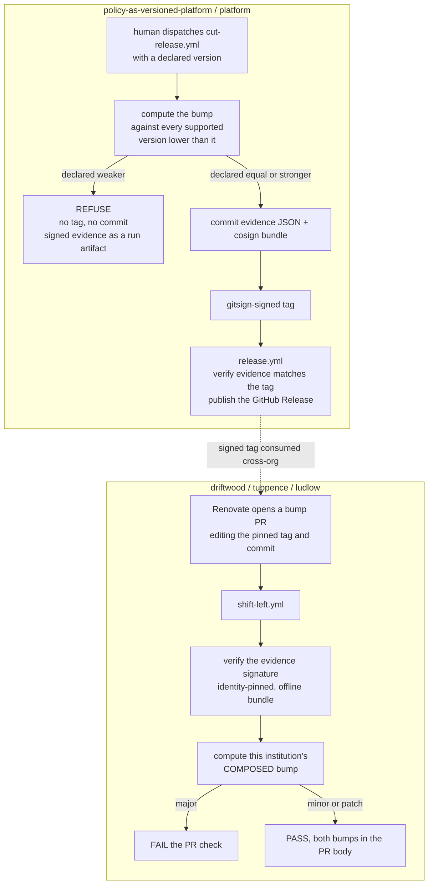

# 05 — Where the gate runs, and what happens when it disagrees with the human

Type: grilling
Status: resolved
Blocked by: 02, 03

## Question

The mechanism exists (`kyverno apply` offline, as `verify-shift-left.sh` proves). This ticket decides
what it *is* once wired into releasing.

**Decide:**

1. **Refuse, warn, or correct.** A release declares `2.1.0`; the evidence says the change can fail a
   currently-compliant workload, so the bump is major. Does the gate (a) fail the release, (b) warn
   and proceed, or (c) rewrite the tag to `3.0.0`? (c) is seductive and probably wrong — ADR-0002
   makes the *reviewed* upgrade non-negotiable, and a gate that silently renames the thing under
   review erodes exactly that. But a gate that only warns is a gate that gets ignored.
2. **The override path.** There will be a legitimate case where the human is right and the corpus is
   misleading. Is there an override, what evidence must it carry, and is it logged the way this
   estate logs every other constraint removal?
3. **When it runs.** Pre-tag in CI, at release, or as a check on the Renovate bump PR at the
   consuming end? These are different audiences: the publisher deciding what to call the release, and
   the adopter deciding whether to take it. Possibly both, with different consequences.
4. **What it costs.** Evaluating a corpus against two versions on every release must be fast enough
   not to be routed around.

Note the interaction recorded in the map's fog: after the six-org split the publisher and the adopter
are different repos in different organisations, so "where it runs" may have two answers.

## Answer

Resolved by grilling, 2026-08-22, over six rounds and twenty-four decisions. Five environment facts
drove the shape. One recommendation was corrected by the semver specification itself, and one by the
owner on release-lifecycle grounds. Both corrections are recorded below, not smoothed over.

### The five facts

1. **`cut-release.yml` starts every release.** A human types the version into a `workflow_dispatch`
   input. That workflow also refuses to move a tag that exists. So a refusal after tagging burns a
   version number for ever.
2. **Exemptions are banned at any scope, under any name.** `CONTEXT.md` says so, and the estate
   deleted its own ledger on 2026-08-20. This decides the override question on principle.
3. **Cost is not a constraint.** Measured with `kyverno` 1.18.2 on the owner's machine. One process
   costs about 0.3 seconds to start. Three policies against 200 pods cost 2.15 seconds in one
   invocation. That is 600 evaluations at about 3.5 milliseconds each. The full ticket 01 rederive
   suite runs in 9.4 seconds.
4. **`driftwood/.github/workflows/shift-left.yml` checks out platform with no `ref`.** It evaluates
   platform's default branch, not the version the institution pins. This is a live bug, found here.
5. **The semver specification is silent on gaps.** It mandates reset on bump. It says nothing about
   contiguity, and nothing about maintenance lines or backporting.

### 1. Refuse, warn, or correct

**Refuse, and never rewrite.** Rewriting the tag renames the thing under review, which is the one
thing ADR-0002 protects. A gate that only warns gets ignored.

The rule splits on an asymmetry the ticket did not name. Under-declaring surprises adopters. A
reviewer sees `2.1.0` and expects no break. Over-declaring costs review effort and surprises nobody.

- **Refuse when the declared bump is weaker than the computed bump.**
- **Permit a stronger declared bump, and print the discrepancy in the evidence.**

The refusal still emits and signs evidence, as ticket 04 settled.

### 2. The override path: there is none

An override carrying evidence, a signature and an expiry is exactly what `exemptions.yaml` carried.
That argument lost on 2026-08-20. `CONTEXT.md` says disagreement is resolved by a pull request to the
policy, never by an out-of-band request.

Over-declaration from section 1 is the only relief valve. It is one-directional and it is safe.

Instead of an escape hatch, **the refusal is made actionable**. The gate names the corpus entries that
moved and the expression that moved them. A human who believes the corpus misleads then has a target
for a reviewed PR to the generator or to the policy.

### 3. Where it runs: two gates asking two different questions

The declared bump is read from **`cut-release.yml`'s `version` input**, and the gate runs **before
`git tag`**. A gate in `release.yml` runs after the tag is immutable, so its only remedy is to burn
the number. `release.yml` keeps a cheaper check that the signed evidence matches the tag, which
catches a tag pushed by any other route.

The publisher and the adopter ask different questions. The adopter does **not** recompute the
publisher's bump, because a second answer to the same question has no tie-breaker. The adopter
computes its own **composed** bump across the parties it consumes, which is the mechanism the
`policy-composition` map describes.

Other decisions on where it runs:

- **No schedule, anywhere.** Every trigger is a pull request or a release dispatch. ADR-0002 makes
  the reviewed PR the unit of adoption, and a scheduled finding has no PR to carry the debate. The
  retired-element case still arrives as a PR, because the retirement lands in a release and Renovate
  bumps the pin.
- **The adopter's composition inputs are the pinned versions in its own repo at the PR head.** That is
  two files on `driftwood` today, `gitops/platform/platform-pin.yaml` and
  `gitops/flux-system/gotk-sync-nist.yaml`. There is no discovery endpoint. `ico` is not a Renovate
  surface, because it is consumed as a signed penalty feed.
- **A composed bump weaker than the publisher's tag never lowers anything.** It prints.
- **`verify-computed-semver.sh` runs the same code path locally**, so a publisher sees the computed
  bump before dispatching. CI stays the authority, because only CI holds the signing identity. Every
  comparable check in this estate already has an offline twin.

### 4. What it costs

**Publish the wall-clock. Never enforce a ceiling.** Fact 3 shows a full corpus run costs seconds, so
a ceiling protects against nothing today. A ceiling is also a threshold, and ticket 04 banned
thresholds because they invite tuning. The published field makes any future growth visible in a diff
without a rule.

### 5. Version legality follows the specification and adds nothing

The first recommendation here was **wrong twice**, and both corrections came from outside.

- The owner rejected "strictly greater than every existing tag". Patching a still-supported older
  line is a normal version lifecycle. That rule forbids a legitimate backport.
- The replacement, "exactly one increment with no gaps", was stricter than the specification. Semver
  2.0.0 mandates reset on bump and says nothing about contiguity.

**The rule that survives:**

1. The **base** is the highest existing tag lower than the declared version.
2. Find the leftmost component that increased against that base.
3. Every component to the right of it MUST be zero.
4. The declared version MUST NOT already exist.
5. A gap is legal.

This closes the reset-on-bump gap ticket 01 named. The historical `2.1.1` fails, correctly. Its base
is `2.0.1`, the minor increased, so the patch component had to be `0`.

`CONTEXT.md` gains **one sentence** defining reset on bump. That is a semver rule the thesis is silent
on, not gate jargon, so ticket 04's reason to leave `CONTEXT.md` alone does not apply here.

Backports need maintenance branches. See section 8.

### 6. What the gate compares against

**Every supported version lower than the declared version. The strictest result wins.**

- For a head release that is the whole supported window. Comparing only against N-1 hides a break for
  a cluster on N-2, which multi-version coexistence guarantees exists.
- For a backport it narrows to the line below it. A cluster on `3.0.0` never adopts `2.0.1`, so
  comparing against `3.0.0` measures nothing.
- The base for the version check in section 5 is the same tag. Two rules, one comparison base.
- **The window is the one that stood before this release.** Those are the clusters actually running.
  This also makes a retirement classify as major without a special case, because the retired version
  sits in the old array and its consumers lose their pin.
- **An array-only release is gated.** Retiring an element of `distribution/versions.yaml` changes no
  policy body and still breaks every cluster pinned to it. A body-diff gate would wave it through,
  which is this map's signature bug. The trigger and the retirement rule belong here. Ticket 07 keeps
  only the platform's own version numbering.

### 7. Evidence, signing and verification

**Drop the `feeds/sign.sh` shape for this artefact.** It signs with a repo-local ed25519 PEM key, and
its own comment names `cosign sign-blob` as the upgrade path. The institutions already run
`cosign sign-blob --yes --bundle` keyless. This ticket therefore removes a signing mechanism rather
than adding one.

- **Sign every evidence file with `cosign sign-blob` keyless**, for both outcomes.
- **On success, commit the evidence JSON and its bundle in the release commit**, before the tag. One
  tag reaches both, for ever, from any clone. Verification is offline by construction, because the
  bundle carries the certificate, the signature and the Rekor inclusion proof. There is no fail-open
  case to decide.
- **On refusal there is no commit and no tag**, so the signed file and its bundle go out as run
  artifacts and a job summary.
- Keep the PR-comment rendering as a convenience view, never as the record.
- **The adopter's `shift-left.yml` verifies it identity-pinned** against platform's `cut-release.yml`,
  reusing the offline pattern `release.yml` already runs. A failed verification refuses the bump
  check.
- **Each institution holds its own expected-identity constant**, changed only by a reviewed PR. Never
  fetch it from platform. An identity you trust must not be supplied by the party you are checking. A
  break caused by platform renaming a workflow is the correct outcome, because it forces a human to
  re-decide who they trust.

**Evidence is pinned to its generator version and never recomputed.** The tag is immutable, so there
is nothing to repair mechanically. One honesty check replaces recomputation. A PR that changes the
generator reruns the **previous** release under the new generator, and prints a line if the
classification would differ. It does not fail. A reviewer decides whether a past release was
mislabelled.

### 8. Edge cases and prerequisites

- **The first release has no predecessor.** The gate records `no predecessor` and permits any declared
  version. A comparison against nothing must not be dressed up as a computed patch. The coverage
  checks still run in full, because an unreached predicate is a generator defect and needs no
  predecessor. Ticket mo-09 records that several units carry no signed tag, so this path runs first.
- **The five unversioned Kyverno policies block every release from day one.** Ticket 03 makes the gate
  fail when movement traces to a policy carrying no version. Five of the eight live policies carry
  none. **Ship the gate hard and version the five first**, under ticket 07. A grace mode is a
  threshold wearing a different coat, and it never gets removed.
- **Backports need maintenance branches, and they break the identity pin.** `cut-release.yml` tags
  whatever HEAD it runs on, so a backport is dispatched from `release/<major>.<minor>.x`. Its gitsign
  certificate identity then ends `@refs/heads/release/2.0.x`, and every `release.yml` pins
  `EXPECTED_IDENTITY` to `@refs/heads/main`. Verification fails everywhere, including at the three
  institutions. **Pin with an anchored `--certificate-identity-regexp`** allowing `refs/heads/main`
  and that one branch shape. The flag exists on `gitsign verify-tag`, checked against the local
  binary. The regexp still pins the organisation, the repository and the workflow path, so it loosens
  only the ref. Cutting from a maintenance branch already needs write access, exactly as main does.

### 9. Two live bugs found while grilling

1. **`shift-left.yml` on the three institutions checks out platform's default branch.** It must check
   out **the tag under review at the PR head**, read from `gitops/platform/platform-pin.yaml`, and
   **verify the resolved commit against the pinned `commit` field**. A gate that evaluates code the
   institution has not adopted answers a question nobody asked. This also makes the `{tag, commit}`
   pair ADR-0001 requires load-bearing rather than decorative.
2. **`cut-release.yml` does not check version ordering.** It refuses a tag that exists and nothing
   else. Section 5's rule closes this in the same step, for the same reason.

### What this ticket hands on

- **Ticket 07** takes the five unversioned policies and the platform's own version numbering. It is
  unblocked by this ticket.
- **New ADR-0011** records the gate. It computes the bump, refuses a weaker declaration, permits a
  stronger one, and has no override. Cross-reference ADR-0002, so a reader reaching the
  reviewed-upgrade rule finds the gate that now guards it.
- **`CONTEXT.md`** gains one sentence on reset on bump, and nothing else.
- **All six repos** need the `--certificate-identity-regexp` change in `release.yml`.
- **The three institutions** need the `shift-left.yml` checkout fix and their own expected-identity
  constant.

### What this ticket did not decide

- **How the platform's own version line is numbered.** Ticket 07 owns it. This ticket only settled
  that an array-only release is gated and that a retirement is major.
- **Whether `distribution/policies/` and `policy/policies/` are one version line.** Ticket 03 makes
  the gate refuse a same-version-different-content collision, which surfaces the answer rather than
  deciding it.
- **The declared-hole file's ceremony.** Ticket 04 settled that a human may declare a hole and may not
  promote one to proved, and that every hole prints for ever. Nothing here needed more than that.

## Comments

Finding raised 2026-08-22 from [ticket 07](07-platform-version-under-the-same-rule.md)'s grilling.
**This ticket and cs-03 both assume the installed set comes from the version array. For four of the
eight live policies it does not.**

All three institutions pin `path: ./distribution` and nothing else. No Flux Kustomization anywhere
targets `./graded` or `./posture`. Those four policies reach a cluster only through `graded/up.sh` and
`posture/up.sh` running `kubectl apply -f`, not even `-k`, so their `kustomization.yaml` files are dead.
`policy/policies/v1.0.0/` is absent from the array too, so nothing renders a Kustomization for it.

This affects section 8's finding, not just ticket 07's scope. "The five unversioned Kyverno policies
block every release from day one" is true, and the reason is stronger than stated: the gate cannot see
them at all, because it assembles the installed set from the array they are not in. A gate that
measures a set the clusters do not run answers a question nobody asked, which is the same defect
section 9's first live bug describes at the institution end.

Ticket 07 takes the repair. It brings `./graded` and `./posture` into the pinned path as part of the
same fix that versions them, on the grounds that a version number on a file that nothing pins is
decoration. No change is needed to this ticket's decisions. The assumption just needs to stop being
silent.

One consequence lands here directly: **`cut-release.yml` takes a single `version` input, and ticket 07's
repair release carries three tags on one commit** (platform `1.0.0`, policy `1.0.2`, policy `2.0.1`).
That needs a named change to the workflow. See
[ticket 09](09-repair-release-and-pinned-delivery.md).
