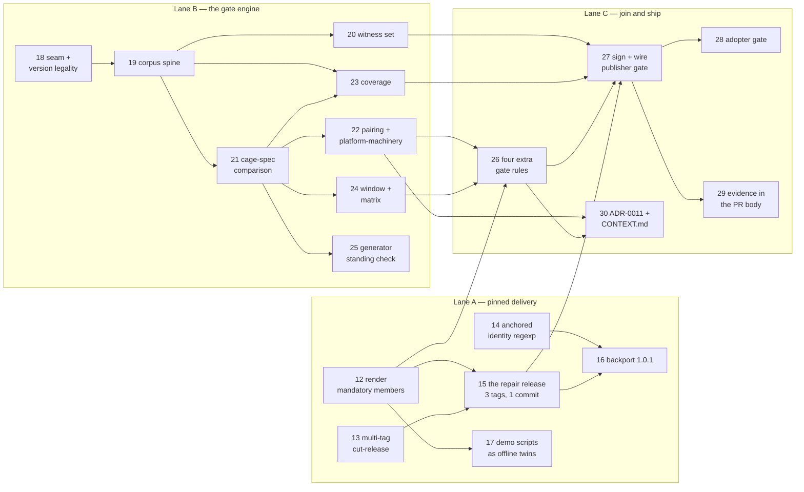

# Map — the version number computes itself

Label: `wayfinder:map`. Charted 2026-08-20.

**Spec: [`spec.md`](spec.md)** — written 2026-08-22 from the seven resolved tickets. It carries the
whole gate.

**Implementation: tickets 12 to 30**, cut from the spec on 2026-08-22. Tickets
[09](issues/09-repair-release-and-pinned-delivery.md), [10](issues/10-render-mandatory-members.md) and
[11](issues/11-gate-rules-from-cs-07.md) are marked `split`. They hold the reasoning, and the newer
tickets hold the work.

Three lanes run in parallel. Lane A repairs pinned delivery. Lane B builds the gate engine against the
read-only faithful-floor line, so it needs nothing from Lane A. Lane C joins them and ships.

## Destination

**A policy release states its bump and is refused if the evidence disagrees.** The release gate
evaluates the candidate version and its predecessor against a corpus, observes how verdicts move on
currently-compliant workloads, derives **major / minor / patch** from `CONTEXT.md`'s existing
definition, and fails the release when the declared bump contradicts what was measured.

The same rule binds the **platform's own version**, not just the policy body — a platform bump
changes the version array, which changes which policies run, which changes verdicts. The distribution
layer does not get to exempt itself from the rule it distributes.

## Notes

**Why this is worth doing.** `CONTEXT.md` already defines semver by **verdict impact on
currently-compliant workloads** rather than author intent — the hard half, and it is done. But the
bump is still an editorial judgement: faithful-floor's *Cut 2.0.0 + 2.1.1 releases exercising semver
meaning* asserted each bump and then authored a fixture proving it. The proof is post-hoc
justification, not derivation. That same ticket records version-mechanics gaps found "by review, not
by CI", twice. This map inverts the flow.

**Domain.** Read `CONTEXT.md`'s *Policy version* entry (the rule), `docs/adr/0002` (pinned + reviewed
Renovate PR — the review gate is non-negotiable and this must not weaken it), and
`estate/platform/shift-left/` (the offline evaluation primitive already exists:
`verify-shift-left.sh` runs one workload against two versions via `kyverno apply`).

**Standing preferences.**
- **Inheritance is not the destination.** Policies-that-`extends`-policies is a real DRY win and a
  separate idea. It enters this map only if the rule-set delta proves unreadable without it — see the
  ticket that tests exactly that. Do not let a refactor of every policy file hostage the release gate.
- **Build in the new `estate/`; mine the old faithful-floor estate for test material.** Its
  1.0.0 / 2.0.0 / 2.0.1 / 2.1.1 line is signed, live-proved, and is the validation set.
- **The engine must reproduce a human's correct answer before it is trusted to give its own.**
- Honesty over green — a gate that passes because the corpus missed the case is this estate's
  favourite bug, and it has three already. Coverage must be stated, not implied.
- Skills each session should consult: `/grilling`, `/domain-modeling`.

## Decisions so far

<!-- index of closed tickets; one line each, linking the ticket that holds the detail -->

- [What counts as a "verdict", given Audit is not a pass](issues/02-what-counts-as-a-verdict.md) —
  compliant means *admitted*; refusal is not a class but the **bottom rung** of the cage ladder; and
  **every workload is always caged — the cage *spec* is what changes**, so the engine compares specs,
  not verdict enums. The bump is institution-relative (the rung is picked against the consuming org's
  band), so **tag the strictest band and publish the per-institution matrix as evidence**. Two things
  fell out: the code contradicts always-caged, and COTS/unversioned workloads are a permanent
  population needing their own effort.
- [What represents "currently-compliant workloads"](issues/03-what-is-the-corpus.md) — the corpus is a
  **generated** population of plain pods owned by `platform`, enumerated **per CEL expression**
  (satisfied/violated/absent) across two more axes: the **version pin** (in/out of the version array)
  and the **tier label** (absent/baseline/restricted/quarantine). A second **witness** set of real
  workloads proves the generator, and **a witness shape the generator missed fails the build** — the
  repair is always the generator, never the fixture. That is what stops curation toward a wanted bump.
  Generated from **both** subjects and unioned, so a retirement is visible. The corpus is not signed:
  it is regenerated and diffed in CI, and the **evidence output** is what gets signed. Three findings
  fell out: `cage-tier` is label-driven so **no residual is ever invented**; the subject is **every**
  Kyverno policy that reaches a pod, so **five of the eight live policies carry no version and the
  gate must fail when movement traces to one**; and deny is unobservable at admission, so the bottom
  rung is proved by function test and said so.

- [How is incomplete coverage stated rather than implied](issues/04-coverage-stated-not-implied.md) —
  **no coverage percentage at all**: a percentage invites a threshold, and a threshold invites tuning
  the corpus until it passes. The gate publishes counts plus a **not-looked-at list**, and every entry
  on it carries a **stable id** (hash of the normalised expression text) so the reviewer sees which
  holes are *new*. Three binary gates replace the threshold: an unreached predicate, a missing witness
  shape, movement on an unversioned policy. The whole-space ratio is never printed, because the space
  is over four million and the built set is tens; the pairwise gap is one sentence and two counts
  instead. **Ticket 03's "per CEL expression" wording is corrected**: coverage is over *predicate*
  expressions only, and a variable counts as covered only when an axis spans its values. The gate
  **always emits and signs the evidence, including when it refuses**. Limits are **derived by the
  check that would remove them** and print as *closed* rather than vanishing.
- [Does inheritance earn its place](issues/06-does-inheritance-earn-its-place.md) — **answers a
  narrower question than the map meant; see the
  [`policy-composition` map](../policy-composition/map.md).** For
  a policy version extending *its own predecessor*: **no, a rendered diff is enough.** Not because
  the diff is clean, but because **the
  gate never classifies from the delta**: major/patch come from verdict movement, minor from presence
  plus `validationActions`, and cs-03's generator wants the *list* of CEL expressions, not a
  comparison. The delta is only evidence prose for the reviewer. Four findings the gate must carry:
  parse the YAML (19 of the 30 changed lines in the named pair are comments); **the identity label is
  a family name, not a unique key** — `graded-enforcement` and `posture` each group different
  unversioned policies, so pair on `(identity, name-with-version-stripped)` and **fail** on an
  unversioned member; compare rules as a set; and treat a version-literal difference as unproven.
  Prototype: `spikes/cs-06-inheritance-vs-diff/`. The claim "inheritance leaves this map" is
  **withdrawn** — that was the narrow reading.
- [Where the gate runs, and what happens when it disagrees](issues/05-the-gate-and-disagreement.md) —
  **two gates asking two different questions, and no override at all.** The publisher gate runs inside
  `cut-release.yml`, reads the declared bump from the `version` input, and runs **before `git tag`**,
  because that workflow refuses to move a tag and a late refusal burns a version number. It
  **refuses a declared bump weaker than the computed one, permits a stronger one, and never rewrites**.
  The adopter gate runs in each institution's `shift-left.yml` and computes that institution's own
  **composed** bump rather than recomputing the publisher's. There is **no override**: over-declaring
  is the only relief valve, and disagreement goes through a reviewed PR to the generator or the policy,
  exactly as `CONTEXT.md` requires. Comparison is against **every supported version lower than the
  declared version, in the window as it stood before this release**, so backports narrow correctly and
  a retirement classifies as major with no policy diff. Version legality follows semver 2.0.0 and adds
  nothing: reset on bump is enforced, gaps are legal. **Cost is settled by measurement**, roughly
  3.5 milliseconds per evaluation, so the wall-clock is published and never enforced. Evidence is
  signed with `cosign sign-blob` keyless and committed in the release commit, which **removes the
  `feeds/sign.sh` shape ticket 04 chose**. Two live bugs fell out: `shift-left.yml` checks out
  platform's default branch instead of the pinned tag, and backports break the `@refs/heads/main`
  identity pin on all six repos. Hands ADR-0011, one `CONTEXT.md` sentence, and the five unversioned
  policies to ticket 07.
- [What in `platform` carries a version, and what numbers it](issues/07-platform-version-under-the-same-rule.md) —
  **"unversioned" was the symptom; the disease is unpinned delivery.** No Flux Kustomization targets
  `./graded` or `./posture`, so four of the five reach a cluster by `kubectl apply -f` in `up.sh`, and
  `policy/policies/v1.0.0/` is not in the array at all. cs-03 and cs-05 both assume the installed set
  comes from the array, and for half the policies it does not. The owner's second reframe: **there is no
  content gate any more, only cages** — both remaining `Deny` policies are structural, so cage severity
  *is* the enforcement and it ratchets one way. Settled: **one version mechanism**, so every claim-wide
  policy becomes a per-version copy self-scoped on the claim, **rendered not hand-written**, with the
  PriorityClasses included because they are the enforcement dial. The orphan guard is the one member
  that cannot join and takes the identity **`platform-machinery`**, which settles the ADR-0002 tension:
  the platform tag numbers both the array and the guard's template. `may-run-root-if-attested` folds
  into the distribution line at **`1.0.1`**, a widening, so the two-`v1.0.0` question is closed. The
  repair is **one hand-classified release**: platform `1.0.0` (leaving `0.x`, where the gate has nothing
  to refuse), plus `1.0.2` and `2.0.1` re-cut with the full set, because cut tags cannot gain files and
  deleting the shared copies would uncage every pinned pod. **Major is restated at spec level**: the new
  cage spec must be at least as permissive as the old one, and the gate never estimates viability. Four
  gate rules fell out, and two limits stayed open: the cage ratchets with no counter-pressure, and the
  rule can only see the workload's side, so removing enforcement scores as a patch. Implementation in
  tickets [09](issues/09-repair-release-and-pinned-delivery.md),
  [10](issues/10-render-mandatory-members.md) and [11](issues/11-gate-rules-from-cs-07.md).
- **The bump is a property of a composition, not of a file** — from the cross-party composition work,
  which is now its own map: [`policy-composition`](../policy-composition/map.md). An adopter's
  effective rule set is inherited from several parties, so **the gate computes the bump after
  composition**. A regulator's *addition* is a downstream build break. A **retired array element is a
  downstream major with no policy diff at all**. cs-01's method is **extended, not unchanged**: its
  verdict-movement half works as-is on composed sets, but a composition also refuses on **coverage**
  with zero verdict movement, a second structural axis just as cs-01's minor finding was a first. The
  publisher still tags **one** bump at the strictest band with the per-institution matrix as evidence,
  exactly as cs-02 settled; composition is the mechanism behind that matrix. Everything else that came
  out of that work — baselines, OSCAL coverage, caging economics, feed parents, signing — is on the
  other map, because this map's own preference says a refactor must not take the gate hostage.

- **Shipped.** Tickets 12–30 are all `done`, real and independently reviewed, across `platform` and five
  downstream repos (`driftwood`, `tuppence`, `ludlow`, `nist`, `ico`), plus this hub's own ADR-0011 and
  `CONTEXT.md` edits (ticket 30). Two real releases prove the gate live: the **repair release**
  (ticket 15) — `v1.0.0`, `policy/v2.0.0`, `policy/v3.0.0`, signed and gitsign-verified, renumbered from
  the originally planned 1.0.2/2.0.1 to an honest major bump after the gate itself proved the smaller
  numbers would have under-declared a real break — and the **backport** (ticket 16) — `policy/v2.0.1`,
  cut from a maintenance branch and gated by the publisher gate (ticket 27) for the first time, live.
  Proving the backport out for real surfaced and fixed **two foundational gate-engine bugs**: a wrong
  backport-predecessor-selection bug in `gate_one()` (compared against the wrong, higher line instead of
  the true lower neighbor), and a self-scoped-policy classification bug in `cage_engine.py` that had been
  silently reading **every** version bump on a self-scoped policy as major regardless of content — both
  fixed generally, not just for the one case, and independently re-verified. One disclosed gap survives
  shipment: the six real infrastructure COTS witnesses (SPIRE, Istio, OpenBao, Pomerium, Dex, git-server)
  were never available as real committed data, per spec.md's own Out-of-Scope section — the missing-shape
  gate mechanism itself is real and proven regardless.

## Not yet specified

- **Whether the cage gets a counter-pressure.** Cage severity is now the only enforcement, and it
  ratchets one way. Each tightening is correctly labelled major, and many correct majors still end at a
  platform too expensive to run. `verify/proportionality/render.py` prices a control against a risk
  band and is the only candidate. Nothing wires it in.
  [Ticket 07](issues/07-platform-version-under-the-same-rule.md) names this as a standing limit.
- **Where a priced residual for a real workload comes from.** The tier axis is synthetic by design
  (ticket 03), and the estate holds two FAIR scenarios in total, both driftwood's. Nothing maps a pod
  to a scenario. Not blocking this map, but the cage half of the model is proved on synthetic input
  until it exists. [Ticket 04](issues/04-coverage-stated-not-implied.md) makes this print as a derived
  limit on every release, with its own count, so it cannot rot quietly.

*Settled since charting: whether `distribution/policies/` and `policy/policies/` are one version line —
yes, one line, and `may-run-root-if-attested` folds in at `1.0.1` as a widening, in
[ticket 07](issues/07-platform-version-under-the-same-rule.md). How the COTS/unversioned shim changes the corpus, and whether the corpus
needs versioning and signing — both in [ticket 03](issues/03-what-is-the-corpus.md). Whether the
Renovate bump PR carries the computed evidence — yes, and its body is the view that gets the design
effort, in [ticket 04](issues/04-coverage-stated-not-implied.md). Where the gate runs after the
six-org split, and where the declared bump is read from — both in
[ticket 05](issues/05-the-gate-and-disagreement.md).*

## Out of scope

- **Rewriting the old faithful-floor estate.** It is being archived by the other effort. Read-only
  source of validation fixtures here.
- **Policy inheritance, of either kind.** Shipping `extends` across every policy file for DRY reasons
  is its own effort. Cross-party composition is a different thing again and has its own map:
  [`policy-composition`](../policy-composition/map.md). This map takes one fact from it and no more.
