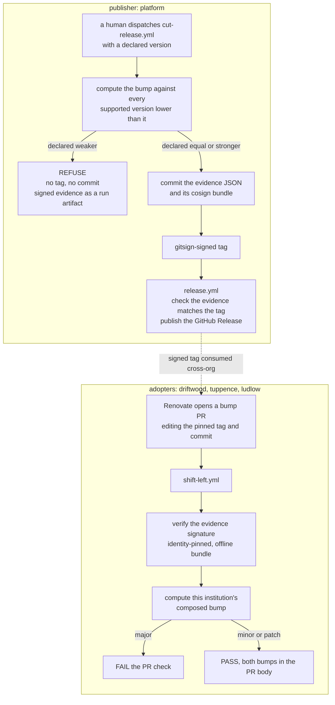

# Spec — the release gate computes the version bump

Status: ready-for-agent
Source: `.scratch/computed-semver/map.md` (`wayfinder:map`, charted 2026-08-20) and its seven resolved
tickets. Implementation is tickets 12 to 30, cut from this spec on 2026-08-22. See the map for the
dependency graph. Tickets 09, 10 and 11 are marked `split` and hold the reasoning only.
Scope: **the whole release gate**, on the publisher side and on the adopter side.

---

## Problem Statement

A policy version number is a promise to every cluster that pins it. `CONTEXT.md` already defines the
promise well. Major means a change can turn a pass into a fail. Minor means an addition cannot fail a
compliant workload. Patch means the passing set only grows.

Nothing checks the promise. A human types the number into a release workflow. The human then writes a
fixture that agrees with the number. That is post-hoc justification, not derivation. The faithful-floor
release line recorded version-mechanics gaps found by review twice, and CI found neither.

Three parties carry the cost.

**The publisher cannot be wrong in public.** The release workflow refuses to move a tag. A mistake in
the number is therefore permanent. The publisher has no way to test the number before the tag exists.

**The reviewer approves a number with no evidence.** ADR-0002 makes the reviewed pull request the only
way a new version lands. The reviewer sees a version string and a diff. The reviewer cannot see which
workloads change verdict, and cannot see which rules nobody tested.

**The adopter discovers a break at admission time.** Three institutions pin the platform. A minor bump
that was really a major bump reaches them as a refused pod, not as a failed check.

The estate also makes the number describe less than a cluster runs. Five of the eight live Kyverno
policies carry no version at all. Four of those five never travel the pinned path. They reach a cluster
through `kubectl apply -f` in a shell script. A version number cannot describe a policy that no
version delivers.

## Solution

A release states its bump. The gate measures the bump. The gate refuses the release when the two
disagree in the unsafe direction.

The gate is two gates, and they ask two different questions.

The **publisher gate** runs inside `cut-release.yml`, before `git tag`. It reads the declared bump from
the workflow input. It evaluates the candidate policy set and every supported lower version against a
generated corpus of pods. It observes how the cage spec each pod receives moves between versions. It
derives major, minor or patch from that movement. It refuses a declared bump weaker than the computed
bump. It permits a stronger one and prints the discrepancy. It never rewrites the number.

The **adopter gate** runs inside each institution's `shift-left.yml`, on the Renovate bump pull
request. It does not recompute the publisher's answer, because a second answer to the same question has
no tie-breaker. It verifies the publisher's signed evidence against an identity the institution holds
itself. It then computes that institution's own composed bump across the parties it consumes.

Both gates emit one signed evidence document. The gate emits and signs the evidence when it refuses,
not only when it passes. A refusal is the most valuable output the gate produces.

There is no override. `CONTEXT.md` bans exemptions at any scope and under any name. An override
carrying evidence, a signature and an expiry is the exemption ledger this estate already deleted.
Over-declaring the bump is the only relief valve, and it is safe in one direction. A publisher who
believes the corpus misleads raises a reviewed pull request against the generator or against the
policy.

## User Stories

**The publisher**

1. As a policy publisher, I want the gate to compute the bump before the tag exists, so that a refusal
   does not burn a version number for ever.
2. As a policy publisher, I want to run the same gate on my own machine, so that I see the computed
   bump before I dispatch the release.
3. As a policy publisher, I want the gate to refuse a bump weaker than the measured one, so that I
   cannot under-promise a break to three institutions.
4. As a policy publisher, I want the gate to permit a stronger bump, so that caution costs me review
   effort and never costs me a release.
5. As a policy publisher, I want the refusal to name the corpus entries that moved, so that I have a
   target for a reviewed pull request.
6. As a policy publisher, I want the refusal to name the CEL expression that moved them, so that I can
   read the rule that caused the classification.
7. As a policy publisher, I want the gate to refuse a version that breaks reset on bump, so that the
   `2.1.1` mistake in the historical line cannot recur.
8. As a policy publisher, I want a version gap to stay legal, so that the rule adds nothing to the
   semver specification.
9. As a policy publisher, I want to cut a backport from a maintenance branch, so that I can patch a
   still-supported older line.
10. As a policy publisher, I want the gate to compare a backport against the line below it only, so
    that a version nobody adopts does not decide my number.
11. As a policy publisher, I want the first release to record `no predecessor`, so that a comparison
    against nothing is not dressed up as a computed patch.
12. As a policy publisher, I want the wall-clock published and never enforced, so that growth is
    visible in a diff without a threshold.
13. As a policy publisher, I want one release to carry more than one tag, so that the repair release can
    publish three tags in one commit.

**The reviewer**

14. As a release reviewer, I want the evidence rendered into the Renovate pull request body, so that I
    read it at the moment ADR-0002 makes non-negotiable.
15. As a release reviewer, I want the declared bump and the computed bump side by side, so that I see
    the discrepancy the publisher accepted.
16. As a release reviewer, I want per-policy verdict movement, so that I see which rule caused the
    class.
17. As a release reviewer, I want counts and a not-looked-at list, so that I know what the gate did not
    test.
18. As a release reviewer, I want no coverage percentage anywhere, so that nobody can tune the corpus
    until it crosses a threshold.
19. As a release reviewer, I want every hole to carry a stable id, so that I can tell a new hole from a
    carried-over one.
20. As a release reviewer, I want a hole marked new, carried over, or closed, so that a new hole in a
    patch release stands out.
21. As a release reviewer, I want the stated limits emitted by the check that would remove them, so
    that a limit cannot rot after its condition ends.
22. As a release reviewer, I want a closed limit to print as closed with its count, so that the output
    stays diffable.
23. As a release reviewer, I want the per-institution matrix, so that I see where one version lands each
    band.
24. As a release reviewer, I want the evidence signed on refusal too, so that a failed run still leaves
    a record I can verify.
25. As a release reviewer, I want the corpus checksum and the generator version named, so that I can
    reproduce the run.

**The adopter**

26. As an institution engineer, I want my shift-left check to evaluate the tag I pin, so that the check
    answers the question I asked.
27. As an institution engineer, I want the resolved commit checked against my pinned `commit` field, so
    that the pin ADR-0001 requires is load-bearing.
28. As an institution engineer, I want my check to verify the publisher's evidence signature, so that I
    trust the artefact rather than a green badge.
29. As an institution engineer, I want to hold my own expected-identity constant, so that the party I
    check does not supply the identity I trust it by.
30. As an institution engineer, I want a platform workflow rename to break my verification, so that a
    human re-decides who they trust.
31. As an institution engineer, I want my own composed bump computed across every party I consume, so
    that a regulator's addition reaches me as a build break.
32. As an institution engineer, I want a composed major to fail my bump pull request, so that I do not
    adopt a break by merging a routine dependency update.
33. As an institution engineer, I want a composed bump weaker than the publisher's tag to print and
    never lower anything, so that my local view cannot weaken a published promise.
34. As an institution engineer, I want a retired version to reach me as a major, so that losing my pin
    is not silent.

**The platform, under its own rule**

35. As a platform operator, I want the platform's own version bound by the same gate, so that the
    distribution layer does not exempt itself.
36. As a platform operator, I want an array-only release gated, so that retiring an element cannot pass
    a body-diff check that sees no change.
37. As a platform operator, I want every policy delivered by the pinned path, so that a version number
    describes everything a cluster runs.
38. As a platform operator, I want the mandatory members rendered, not hand-written, so that a human
    cannot omit one from a version.
39. As a platform operator, I want a release refused when it removes an enforcement surface from a
    version, so that the number stays honest.
40. As a platform operator, I want an array element with an empty `commit` refused, so that the field
    does not silently empty on the next hand edit.
41. As a platform operator, I want prior versions read from their tags, so that a hand edit at HEAD
    cannot fool the gate about what a released version means.
42. As a platform operator, I want the orphan guard numbered by the platform tag, so that the one member
    that cannot self-scope still has an identity.
43. As a platform operator, I want the demo scripts rewritten as offline twins, so that the demo runs
    without Flux and there is still one truth.

**Honesty**

44. As an auditor, I want the corpus generated and never hand-picked, so that nobody curates toward a
    wanted bump.
45. As an auditor, I want a witness shape missing from the generated spine to fail the build, so that
    the repair is always the generator.
46. As an auditor, I want an unreached predicate to fail the build, so that a gap is treated as a defect
    and not as a statistic.
47. As an auditor, I want movement traced to an unversioned policy to fail the build, so that no change
    hides where no number can carry it.
48. As an auditor, I want a human able to declare a hole and unable to promote one to proved, so that
    the exclusion file does not become an escape hatch.
49. As an auditor, I want a generator change to re-run the three known-good bumps, so that the tool
    reproduces a human's correct answer before I trust its own.
50. As an auditor, I want a generator change to re-run the previous release and print rather than fail,
    so that a human decides whether a past release was mislabelled.
51. As an auditor, I want the gate to say plainly what it cannot see, so that a limit is published
    rather than implied.

## Implementation Decisions

### What the gate measures

- **Compliant means admitted.** An Audit rule that fires reports and does not refuse. The opposite
  reading makes every new Audit policy a major bump. That collapses the lane-keeping half of the
  thesis into the gate. Record this in `CONTEXT.md`, because today it is only inferable.
- **There is no separate refused verdict class.** Refusal is the bottom rung of the cage ladder. The
  ladder is a pure function of residual and band.
- **Every workload is always caged, and the cage spec is what changes.** The engine therefore compares
  **cage specs**, not verdict enums. There is no uncaged state. `deny` is the degenerate case where no
  satisfiable spec exists.
- **Major is stated at spec level, not at dial level.** The rule is that the new cage spec must be at
  least as permissive as the old one. An enumerated list of surfaces rots on the next mutation added.
  The tier policy changes more than dials. It appends a sidecar container, sets a priority class,
  flips two security-context fields, and drops capabilities when the tier hardens.
- **The bump is institution-relative and is tagged at worst case.** Semver is a property of the
  artefact, not of the consumer. Compute against the strictest band in the estate and tag that.
  Publish the per-institution matrix as the supporting evidence.
- **The gate never estimates viability.** It prints one sentence instead. The ceiling moved down, and
  the gate does not know whose workload dies at the new number. A viability rule needs a threshold.

### The corpus

- **Two populations.** A **generated spine** decides bumps. A **witness set** proves the generator.
- **The generator enumerates per predicate expression**, across satisfied, violated and absent. The
  field space is infinite. The expression space is finite and grows with the policy body.
- **Second axis: the version pin**, inside and outside the platform version array, so the orphan guard
  is exercised.
- **Third axis: the tier label**, across absent, `baseline`, `restricted` and `quarantine`. Absent is a
  real case, because the tier policy defaults it rather than skipping it.
- **Combine the axes pairwise, not fully.**
- **Generate from both subjects and union the result.** A rule only the old policy can distinguish does
  not exist in a corpus generated from the new one. A retirement is exactly the case a release must
  see. State the old count, the new count and the union count.
- **An entry is a plain pod carrying a version pin.** It carries no band and no residual. A residual
  for an infrastructure workload would manufacture the assertion the corpus exists to prevent.
- **The witness set** is the five rederive fixtures plus the six real unlabelled infrastructure
  workloads the COTS effort named. Witness entries test shape, never residual.
- **A shape** is the tuple of outcomes each subject expression gives on a pod, plus whether its pin is
  inside the array. This is the coverage vocabulary.
- **The platform owns one corpus and one generator.** No institution owns a corpus. No institution's
  workloads can move the published tag.
- **The corpus is not signed.** It is generated deterministically. CI regenerates it and fails on any
  diff. That proves the same property more cheaply than a signature. The evidence output is what gets
  signed.
- **The generator is versioned and is not part of the subject**, so it cannot bump the policy version.
- **No size ceiling.** Publish the entry count and the wall-clock instead. A ceiling truncates
  silently.
- **Read per-policy outcomes, never a pooled CLI exit code.** Ticket 01 proved that trap empirically. A
  pooled exit code disagrees with the real admission outcome when the only failure is on an Audit
  policy.

### The subject

- **The subject is every Kyverno policy that can reach a pod, plus the version array.** The array
  decides which bodies run, so a release that only retires a version changes no CEL at all.
- **The dial map inside the tier policy is a policy body.** Tightening a `baseline` limit downward is
  major, because a pod that cannot schedule under the new limit is refused.
- **Movement traced to an unversioned policy fails the gate and names the file.**
- **Two versioned trees declaring the same version with different content fails the gate.**

### Coverage and evidence

- **No coverage percentage at all.** A percentage invites a threshold. A threshold invites tuning the
  corpus until it passes.
- **Coverage is defined over predicate expressions only**, which means `matchConditions` and
  `validations`. Several live expressions are variables returning strings or objects, and "satisfied"
  is meaningless for them.
- **A variable counts as covered when an enumerated axis spans its value space.** Add no new axis. Name
  the rest in the not-looked-at list.
- **Two measurements, two jobs.** **Cells** are each predicate expression against satisfied, violated
  and absent. **Pairs** are the axis combinations actually built.
- **The pairwise gap is one sentence and two counts.** The sentence is that axes were combined
  pairwise, so no three-way interaction was built. Never print a whole-space ratio. The space is over
  four million and the built set is tens.
- **Three binary gates replace the threshold.** An unreached predicate fails. A missing witness shape
  fails. Movement on an unversioned policy fails. The pairwise gap never blocks a release.
- **Unreachable expressions get a declared exclusion in two tiers.** A **proved exclusion** is one the
  gate can prove nothing reaches. A **declared hole** is one it cannot prove, and it prints for ever. A
  human may declare a hole. A human may not promote one to proved.
- **A hole carries a stable id**, derived from a hash of the normalised expression text. Scope the id by
  the identity family and by the policy name with its version stripped. Normalising removes the
  version literal. An unchanged rule therefore keeps its id across versions.
- **The limits are derived, not written.** Each limit is emitted by the check that would remove it,
  with its current count. A limit never vanishes. At zero it prints as closed with the count that
  closed it.

The evidence document carries these fields, and none of them is optional:

| Field | Content |
| --- | --- |
| `outcome` | `passed` or `refused`, and the reason on refusal |
| `bump.declared` / `bump.computed` | the stated class and the measured class |
| `movement[]` | per-policy verdict movement, naming entries and expressions |
| `counts` | old subject, new subject, union |
| `generator_version` | the generator's own version |
| `corpus_checksum` | the checksum of the generated spine |
| `wall_clock` | measured, published, never enforced |
| `not_looked_at[]` | holes and proved exclusions, each with a stable id |
| `limits[]` | derived limits with counts, open and closed |
| `matrix` | the per-institution result |

### Where the gate runs, and what it compares

- **The declared bump is read from the release workflow's `version` input.** The gate runs before
  `git tag`. A gate after the tag can only burn the number.
- **The release workflow keeps a cheaper check** that the signed evidence matches the tag. That catches
  a tag pushed by any other route.
- **The adopter computes its own composed bump** and does not recompute the publisher's.
- **The adopter's composition inputs are the pinned versions in its own repo at the pull request head.**
  There is no discovery endpoint.
- **No schedule anywhere.** Every trigger is a pull request or a release dispatch. A scheduled finding
  has no pull request to carry the debate.
- **Compare against every supported version lower than the declared version. The strictest result
  wins.** Comparing only against N-1 hides a break for a cluster on N-2, and multi-version coexistence
  guarantees that cluster exists.
- **Use the window as it stood before this release.** Those are the clusters actually running. This
  also makes a retirement classify as major with no special case.
- **An array-only release is gated.** Retiring an element changes no policy body and still breaks every
  cluster pinned to it.

### Version legality

The rule follows semver 2.0.0 and adds nothing:

1. The **base** is the highest existing tag lower than the declared version.
2. Find the leftmost component that increased against that base.
3. Every component to the right of it must be zero.
4. The declared version must not already exist.
5. A gap is legal.

The historical `2.1.1` fails this rule, correctly. Its base is `2.0.1`, the minor increased, so the
patch component had to be `0`. `CONTEXT.md` gains one sentence defining reset on bump.

### Signing and verification

- **Sign every evidence file with `cosign sign-blob` keyless**, for both outcomes. This removes the
  repo-local ed25519 signing shape rather than adding a mechanism.
- **On success, commit the evidence and its bundle in the release commit, before the tag.** One tag
  then reaches both, for ever, from any clone. Verification is offline, because the bundle carries the
  certificate, the signature and the Rekor inclusion proof.
- **On refusal there is no commit and no tag.** The signed file and its bundle go out as run artifacts
  and a job summary.
- **The adopter verifies identity-pinned**, reusing the offline pattern the release workflow already
  runs.
- **Backports break the identity pin.** A backport is dispatched from a maintenance branch, so its
  certificate identity ends with that branch ref. Pin with an anchored `--certificate-identity-regexp`
  allowing `main` and that one branch shape. The regexp still pins the organisation, the repository
  and the workflow path.
- **Evidence is pinned to its generator version and never recomputed.** A pull request that changes the
  generator re-runs the previous release under the new generator and prints a line if the
  classification would differ. It does not fail.

### Pairing and structural rules

- **The gate never classifies from the delta.** Major and patch come from verdict movement. Minor comes
  from presence plus `validationActions`. A rendered diff is enough as evidence prose for a reviewer.
- **Parse the YAML.** In the named historical pair, 19 of the 30 changed lines are comments.
- **The identity label is a family name, not a unique key.** Pair on the tuple of identity and the
  policy name with its version stripped. Fail on an unversioned member.
- **Compare rules as a set.**
- **Treat a version-literal difference as unproven.**
- **`platform-machinery` is a class, not a by-name exclusion.** The orphan guard is legitimately
  unversioned, because the platform tag numbers it. Give it that identity and teach the pairing rule
  that this family is numbered by the platform tag. A by-name exclusion lets the next machinery object
  slip through.

### Pinned delivery and rendering

- **One version mechanism.** Every claim-wide policy becomes a per-version copy, self-scoped on the
  claim value.
- **A renderer writes the per-version copies, and the emitted copies are committed.** Git and the gate
  both read real files, because the gate parses the YAML.
- **A version is four coordinated edits, not a directory.** Emit the directory, the `metadata.name`,
  the `policy-version` label and the `matchConditions` self-scope.
- **Put the self-scope in `matchConditions` and never in `matchConstraints.objectSelector`.** Kyverno
  flattens `objectSelector` into one shared webhook configuration, and last-reconciled-wins silently
  breaks multi-version coexistence.
- **Render only the tree being cut.** Re-rendering every tree and failing on any diff would freeze the
  dial table for ever.
- **The mandatory members** are the two cage policies, the two posture policies, and the three priority
  classes with versioned names. The priority classes are included because they are the enforcement
  dial.
- **The orphan guard is out of scope for the renderer.** It is the aggregate over the array and cannot
  self-scope to one claim.
- **Keep the one truth the graded verify beat protects.** The authoring copy stays the subject of the
  dial-table cross-check.

### The repair release

The repair is **one hand-classified release, one commit, three tags**. It is hand-classified because the
five unversioned policies are repaired before the gate ships. There is no grace mode. A grace mode is a
threshold in a different coat, and it never gets removed.

The release does eight things:

1. Bring the graded and posture trees into the pinned path.
2. Publish `1.0.2` and `2.0.1` with the full policy set, and swap the array elements.
3. Fold the second `v1.0.0` tree into the distribution line at `1.0.1`, as a widening.
4. Fill the empty `commit` fields.
5. Delete the array's `action` field, which nothing reads.
6. Cut platform `1.0.0`, so the gate has something to refuse.
7. Rewrite the two demo scripts as offline twins.
8. Change the release workflow to carry more than one tag, by a named change.

**Warning before step 2.** Three institutions pin the platform and adopt by reviewed pull request.
Do not delete a shared policy in the commit that publishes its replacement version, unless the array
swap lands with it. Deleting the shared copies without replacements uncages every pinned pod on the
same day.

### The four extra gate rules

1. **Read prior versions from their tags, never from HEAD.** Add a frozen-tree check that fails when a
   HEAD copy of a released tree differs from its tag.
2. **Re-render only the tree being cut.** Regenerate, diff, fail.
3. **Refuse a release that removes an enforcement surface from a version.** The mandatory-member list
   is the enforcement-surface list, so the rule is a set comparison.
4. **Refuse an array element with an empty `commit`.**

### Module shape

- The gate lives beside the existing rederive work, in the platform repo.
- The corpus directory holds generated pods as plain YAML, one file per entry, plus a manifest carrying
  the checksum, the entry count and per-witness provenance.
- The subject directory holds the policy bodies and the version array. This splits the two meanings the
  current corpus directory conflates.
- Claim source lives in the manifest, not on the entry, so the entry stays a plain pod the Kyverno CLI
  reads unchanged. It is printed and never down-weighted. Discounting a workload for a weak claim is an
  exemption wearing another name.
- An offline twin runs the same code path locally. CI stays the authority, because only CI holds the
  signing identity. Every comparable check in this estate already has an offline twin.

## Testing Decisions

**A good test here asserts on the evidence document and on nothing else.** The document is the gate's
external behaviour. It is what a reviewer reads, what CI signs, and what an adopter verifies. A test
that reaches past it into the corpus generator, the pairing helper or the renderer is asserting on an
implementation detail that the next ticket will move.

**One seam.** A single entry point takes a repository state and a declared version. It returns the
evidence document as a dictionary. Everything reports through it:

- the computed bump and the declared bump,
- per-policy verdict movement,
- coverage counts and the not-looked-at list with stable ids,
- the derived limits, open and closed,
- the per-institution matrix,
- every refusal reason.

The command-line interface is a thin wrapper. It prints the document and exits non-zero on refusal.
Signing happens outside the seam, because signing needs an identity CI holds and a test does not.

**The renderer surfaces through the same seam.** Gate rule 2 regenerates the tree being cut and fails on
a diff. A renderer defect therefore appears as a refusal in the document. This is why the renderer does
not get a second seam.

**What gets tested through the seam:**

- the three known-good bumps from the historical release line rederive exactly,
- a declared bump weaker than the computed one refuses, and names the entries and the expression,
- a stronger declared bump passes and prints the discrepancy,
- an illegal version refuses under the reset-on-bump rule, and a gap does not,
- a first release records `no predecessor` and still runs the coverage checks in full,
- an array-only retirement classifies as major with no policy diff,
- a backport compares against the line below it only,
- movement traced to an unversioned policy refuses and names the file,
- a witness shape missing from the generated spine fails,
- an unreached predicate fails and the document names the expression,
- an unchanged rule keeps its hole id across two versions, and a changed rule gets a new one,
- a limit at zero prints as closed rather than vanishing,
- a refusal still populates every field the run reached,
- a release that removes an enforcement surface refuses,
- an array element with an empty `commit` refuses,
- a hand-edited HEAD copy of a released tree refuses under the frozen-tree check.

**Prior art in this estate:**

- `rederive_bumps.py` with `verify-rederive-bumps.sh` is the closest match. It runs the real Kyverno
  CLI offline and SKIPs with exit 0 when the CLI is absent. Keep that convention.
- `render-orphan-guard.py` carries a `--selfcheck` of runnable asserts, and an offline twin that the
  verify beats run. The renderer follows this pattern.
- The per-policy Kyverno test directories under the distribution, graded and posture trees are the
  fixture prior art for policy behaviour itself.
- `ci-check.py` shows how the adopter side imports the one version array rather than keeping a second
  copy.

**The generator gets one standing check, not a test suite.** A change to the generator re-runs the three
known-good bumps and is refused if any stops re-deriving. That is the map's own rule applied to the
tool.

## Out of Scope

- **Cross-party composition.** An adopter's effective rule set is inherited from several parties, and
  that has its own map at `.scratch/policy-composition/`. This spec takes one fact from it. The bump is
  a property of a composition, so the adopter gate computes after composition.
- **Policy inheritance for DRY reasons.** Shipping `extends` across every policy file is a separate
  effort. Ticket 06 settled that the gate does not need it, because the gate never classifies from the
  delta.
- **Rewriting the old faithful-floor estate.** It is read-only here, and it is the validation set.
- **Repairing the four gaps the composition prototype found.** They are defects in the platform repo,
  found from the hub. That map names them and that repo fixes them.
- **The COTS and unversioned workload population.** The owner spun this out as its own effort. It
  changes what a verdict means for that population.
- **A viability rule.** The gate prints that the ceiling moved and does not estimate whose workload
  dies.
- **A counter-pressure on the cage.** See Further Notes.
- **Editing `CONTEXT.md` with gate jargon.** *Hole*, *proved exclusion* and *predicate expression*
  belong to one gate. `CONTEXT.md` is the thesis glossary.

## Further Notes

**Order the work: 10, then 09, then 11.** Ticket 10 renders the mandatory members. Ticket 09 publishes
the trees that renderer emits, so it is blocked. Ticket 11 needs the mandatory-member list, so it is
blocked too.

**The gate cannot ship before the repair.** Five of the eight live policies carry no version. The gate
fails when movement traces to one. So the gate would refuse every release from day one for a reason
unrelated to the release. That is the finding, not a defect. It is why ticket 09 exists.

**Two live bugs are already found and still open.**

1. The three institutions' shift-left workflows check out the platform's default branch. They must
   check out the tag under review at the pull request head, and verify the resolved commit against the
   pinned `commit` field.
2. The release workflow does not check version ordering. The version-legality rule closes this.

**Two limits stay open, by decision.**

1. The cage ratchets one way and has no counter-pressure. Each tightening is correctly labelled major.
   Many correct majors still end at a platform too expensive to run. The proportionality renderer is
   the only candidate, and nothing wires it in.
2. The rule sees only the workload's side. Removing enforcement therefore scores as a patch.

**Two documents are owed.**

1. **ADR-0011** records the gate. It computes the bump, refuses a weaker declaration, permits a stronger
   one, and has no override. Cross-reference ADR-0002.
2. **`CONTEXT.md`** gains two things and nothing else. One sentence defines reset on bump. One entry
   names the `platform-machinery` class, so a reader knows which policies the platform tag numbers.

**One cross-repo change.** All six repos need the anchored `--certificate-identity-regexp` in their
release workflow. The three institutions also need the shift-left checkout fix and their own
expected-identity constant.

**Cost is settled by measurement and is not a constraint.** One CLI process costs about 0.3 seconds to
start. Three policies against 200 pods cost 2.15 seconds in one invocation. That is about 3.5
milliseconds per evaluation. The full rederive suite runs in 9.4 seconds.
