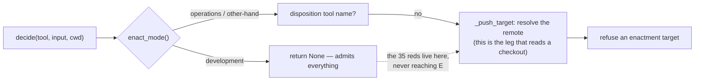

# CI repair, 2026-09-04 — the hub's own tests run on the runner again

Branch `ci-2026-09-04-the-hub-tests-itself`, from `origin/main` (`13234b5`). The `twin` workflow was
red on `main` in three of its four jobs. This file records what each red actually was, the
experiment that settled the interesting one, and every decision with its reason.

Labels are ADR-0025's: **delegated** where the assistant decided and recorded, **owner-instructed**
where the owner had already decided and this build only read the decision.

## What the runner reported (run 33893872728, head 89a2de9)

| job | reported | real cause |
| --- | --- | --- |
| `tests` | 36 failed, 1682 passed, **25 errors** | two unrelated defects, below |
| `typecheck` | 1 error | an ignore that stopped being needed |
| `invariants` | 71 passed, 1 failed, 3 skipped | the standing red; left alone |
| `demo` | — | not touched |

## 1. The 25 errors — a missing pin, and only that

Every one of them was `verify/feed-contract/feed_contract.py:26: ModuleNotFoundError: No module
named 'jsonschema'`. `tests/test_every_green.py` loads `feed_contract.py` as a module directly, and
`tests/test_untagged_pin.py` loads `untagged_pin.py`, which imports it in turn. Ticket 69 (PR 18,
merge `7c019a8`, 08:08Z) added the `jsonschema` import to `feed_contract.py`; the run before that
merge had zero errors. `.github/workflows/twin.yml`'s `tests` job never installed it.

**Decision (delegated).** Widen that job's `pip install` by `'jsonschema==4.23.0'` — the pin
`truth.yml` line 140 already carries for the same scripts. Not added to `typecheck`, `invariants` or
`demo`: `mypy` runs with `--ignore-missing-imports`, and the other two were green without it, so
adding it there would be a change with nothing behind it. The hub's dependency floor is unchanged:
the build brief allows pyyaml and jsonschema, and `jsonschema` was already in the venv and already
in `truth.yml`. This was a workflow that had fallen behind a merge, not a new dependency.

## 2. The 35 `assert None is not None` — not `.estate-clone`, and not a defect in the guard

The hypothesis handed to this build was that the runner has no `.estate-clone`, so
`twin/enact_guard.py` could not resolve a remote and returned `None`. **That is not what happened,
and the reasoning behind it does not hold either way:** the `tests` job runs `bash clone-estate.sh`
before pytest, so the runner *does* have `.estate-clone`.

The cause is one word in one checked-in file. `twin/ENACT_MODE` reads `development`, written by
commit `f959187`, *"ENACT_MODE is development, standing, by the owner's instruction of 2026-09-04"*.
`decide()` returns `None` for everything under `development`, before it looks at a command, a
remote, or the estate at all:



### The experiment

One worktree, one variable. `.estate-clone` absent throughout, which is the harsher of the two
runner conditions:

| `twin/ENACT_MODE` | `.estate-clone` | `pytest tests/test_enact.py -n0 -q` |
| --- | --- | --- |
| `development` (as on `main`) | absent | **36 failed, 25 passed** |
| `other-hand` | absent | **1 failed, 60 passed** |

Flipping the word alone moves 35 tests. The estate never moved. The one residual failure in the
second row is `test_the_dependency_pins_are_real_and_report_what_they_do_not_establish`, which reads
`enact.ESTATE_DIR` and genuinely needs the clone — it passes on the runner, which clones, and passes
here once `.estate-clone` is symlinked in as the build brief says. It is the only test in that file
that ever depended on the estate, and it was never one of the 35.

Confirmed directly against the guard as shipped on `main`, with the estate present:

```
enact_mode() = development
decide("Bash", {"command": "git push origin main"}, cwd=.estate-clone/platform)  -> None
decide("mcp__github__merge_pull_request", {"pullNumber": 42})                    -> None
_push_target("git push origin main", cwd=.estate-clone/platform)  -> 'policy-as-versioned-platform'
```

### Was the guard failing open? No.

`_push_target` resolves `policy-as-versioned-platform` correctly, on a machine with the estate and
on one without it — the resolution machinery ticket 65 hardened this morning is intact and is not
implicated in a single one of the 35. What returns `None` is the mode gate above it, and it returns
`None` because the owner told it to, in a dated commit, one word, visible in a diff and a
`git blame`. **The guard is open by instruction, not failing open.** The distinction is the whole
point: a guard fails open when it admits a call it meant to refuse; this one admits a call the owner
said to admit, and today's build brief relies on exactly that (`twin/ENACT_MODE` reads `development`,
*"so you may push"*).

That said, the cost is real and worth naming: while the window is open, an enactment push from the
hub is admitted, and that is the price of the window, not a bug in the file that implements it.

### The fix — a capability test, and one test that states the deployment state

Nothing in `twin/enact_guard.py` was touched. No refusal was weakened, removed, or narrowed; the
file is byte-identical to `main`. `twin/ENACT_MODE` was **not** flipped back either.

**Decision 2a (owner-instructed, read not made).** `twin/ENACT_MODE` stays `development`. It is a
standing authorisation the owner gave on 2026-09-04 and ADR-0025 keeps authorisations with the
owner. Reverting it to make a test pass would have been the assistant quietly withdrawing the
owner's own instruction — and it would have broken this build's own push.

**Decision 2b (delegated).** The guard's mode is a **deployment state**; the 35 tests are about a
**capability**. A capability test that reads the ambient deployment state reports *"the code is
broken"* when the truth is *"the switch is off"* — which is precisely what the runner reported. So
`tests/test_enact.py`'s autouse fixture now arms the guard at a mode the module names (`other-hand`,
the strictest mode that still admits the one shape the estate needs) by repointing
`enact_guard.ENACT_MODE_FILE` at a temp file, and asks what the code does.

This is not a new idea and not a loosening: it is the answer the project already settled on for the
same tension one layer up. The harness invariant `enactment_is_propose_only_at_both_layers` forces
`operations` for its own run, and `enact_guard.py`'s docstring says why — *"the capability stays
tested even while the day-to-day default is permissive."* The unit tests were simply left behind by
that decision. They have now caught up with it.

`TWIN_ENACT_MODE` is deliberately **not** exported to do this. The env var wins over the file inside
`enact_mode()`, so exporting it would have silently defeated every test below that sets its own mode
through `_set_mode` — including the ones asserting that `operations` refuses and that `development`
is still the escape hatch. Repointing the file leaves those overrides working.

**Decision 2c (delegated), the counterweight.** The 2026-08-29 objection to a fixture like this was
sound and is answered rather than ignored: *a fixture that forces a mode asserts a guard nobody
ships.* Two tests now hold the shipped state, and between them nothing is asserted by nothing:

- `test_the_shipped_default_refuses` (unchanged) asserts `DEFAULT_MODE` refuses when nobody has said
  anything — an absent file, a typo in it.
- `test_the_checked_in_mode_is_other_hand_and_still_refuses_pushes_and_bare_merges` is **replaced**
  by `test_the_checked_in_mode_is_read_off_disk_and_the_suite_states_what_it_admits`. It reads the
  real `twin/ENACT_MODE` (captured at import, before the fixture repoints the handle), asserts the
  word is a known mode, and then asserts *what that mode actually does* with a bare merge and an
  enactment push. Under `development` it asserts, in as many words, that **both are admitted**.

The old test hard-coded `other-hand` and its docstring promised that a flip to `development` "is a
red test". That promise was kept and it did not work: the red fired, stayed on, and took the
jsonschema breakage and the unused ignore down with it into the same illegible wall of 36. A signal
that cannot be distinguished from the noise beside it is not a signal. The weakening is now written
down as a passing assertion that says the twin may merge and may push — one test, named for it,
which changes which branch it asserts when the word changes. That is more legible than 35 failures,
and it is strictly more honest than the old test, which asserted a mode the repository had stopped
shipping.

## 3. The typecheck error

`twin/feed_signal.py:239: Unused "type: ignore" comment [unused-ignore]`. Both mappings in that loop
are `dict[str, str]` and `signal_for` takes `tag: str, commit: str`, so the unpack checks and the
ignore had become dead. Removed, with a comment saying why it is absent — the bare `mypy twin` a
builder runs does not carry `--warn-unused-ignores`, so the next person to add an ignore here will
not see the error locally either.

**Decision (delegated).** Delete the ignore rather than relax the job's flags.
`--warn-unused-ignores` is what caught a stale suppression sitting over a call that no longer needs
one, which is the job doing its work.

## 4. Left red, on purpose

`tests/test_invariant_suite.py::test_the_suite_is_green` still fails, and the `invariants` job still
reports one failure. It is the standing red the project has carried for weeks:
**`flux_coverage_floor_is_still_reachable` (invariant 45)** — *"the pre-registered coverage floor is
unreachable ... it goes green only if the floor is actually reached"* (build ticket 70, finding 1).
The owner chose on 2026-08-16 to record it rather than restart the probe. Untouched here.

One correction for the record: the brief called this "invariant 43". 43 is the **line number** in
`tests/test_invariant_suite.py` that carries the assertion; the invariant is number 45.

## Before and after

| | before (`main`, `13234b5`) | after |
| --- | --- | --- |
| `pytest tests/test_enact.py tests/test_every_green.py tests/test_untagged_pin.py -n0 -q` | 36 failed, 25 errors | **108 passed** |
| full `pytest -q` (what the `tests` job runs) | 36 failed, 1682 passed, 25 errors | **1 failed, 1764 passed** |
| `mypy twin tests conftest.py --ignore-missing-imports --warn-unused-ignores` | 1 error | **clean, 169 files** |
| `mypy twin` | clean | **clean, 77 files** |
| `twin verify --only enactment_is_propose_only_at_both_layers` | PASS | **PASS** |

The one remaining failure is item 4, and it is the same one the `invariants` job reports.

## Files changed

- `.github/workflows/twin.yml` — `jsonschema==4.23.0` on the `tests` job, with the reason.
- `tests/test_enact.py` — the autouse fixture arms the guard; the shipped-mode test is rewritten.
- `twin/feed_signal.py` — one dead `type: ignore` removed.
- `.scratch/ecosystem/CI-2026-09-04.md` — this file.

`twin/enact_guard.py` and `twin/ENACT_MODE` are untouched, deliberately, and that is the load-bearing
fact of this repair.

## Waits on the owner

Nothing blocks. One thing to know rather than to do: while `twin/ENACT_MODE` reads `development`,
the enactment-push refusal is off, and the suite now says so in a passing test instead of a red
wall. Closing the window is one word — write `other-hand` into `twin/ENACT_MODE` — and the suite
follows it without further edits.
