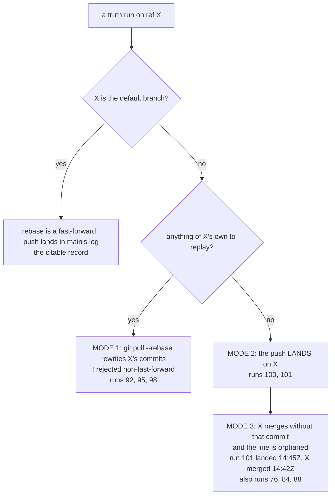

# 100 — A branch run records nothing, and nothing says so

Type: task (AFK)
Status: resolved
Blocked by: none

## Question

`truth.yml` runs on every push to every branch. On a ticket branch its TRUTH line is produced,
committed, and then thrown away, and nothing anywhere says this happens. Builders have spent real
effort chasing lost observations they did not cause and cannot prevent.

Make the clock honest about which runs can record. Done = a run that cannot land its line says so
in its own log before it takes the measurement, `talk/truth.log` is written only by runs that can
record, and a check grades the rule so it cannot rot.

## The mechanism, established 2026-09-05

`.github/workflows/truth.yml` writes the line, commits it, then:

    git pull --rebase --autostash origin main     # line 252
    git ... push origin HEAD:"${GITHUB_REF_NAME}"  # line 256

On `main` the rebase is a no-op and the push fast-forwards. On a ticket branch the rebase replays
the branch's own commits onto `origin/main`, giving every one of them a new SHA, so `HEAD` is no
longer a descendant of `origin/<branch>` and the push is refused non-fast-forward. The line lands
only in the narrow case where the branch is already on top of `origin/main` with nothing to replay.

**Proved by a controlled case, not by inference.** Run 98 on `ticket-89-deny-is-not-a-rung`: nobody
pushing, the remote tip unmoved, `Rebasing (12/12)`, `Successfully rebased`, then
`! [rejected] (non-fast-forward)`.

**A merge commit guarantees it.** Merging `origin/main` INTO a ticket branch is exactly what forces
the rebase to rewrite history. Rebasing the branch onto `origin/main` is the shape that does not.
The build brief briefly carried the opposite advice; the builder who wrote it caught it and
corrected it in the same session.

## What this cost, and why it is worth a ticket rather than a note

Three lines were lost on one branch in one day (runs 92, 95 and 98), one of them the best figure
that branch had produced. Two builders and the integrator each spent time attributing them to a
push, to `origin/main` moving, and to each other. Only one of the three was anyone's doing. The
integrator's own memory of the estate recorded the wrong cause and had to be corrected.

The deeper reason: **the clock is the estate's one instrument for recording what was true, and it
was silently failing on most of the branches it ran on.** A clock that cannot record should say so
before it measures, exactly as every check in this estate says what it could not look at.

## What to build

1. **Say it before measuring.** The run establishes whether it can land its line — is
   `GITHUB_REF_NAME` the default branch, or is the branch already on `origin/main` — and prints
   that in as many words at the top of its own log. A run that cannot record still MEASURES and
   still prints its TRUTH line to the log for a reader to quote; it just does not pretend the line
   will be recorded.
2. **Do not commit a line that cannot be pushed.** A commit that is created and then discarded is
   noise in every builder's `git log` and is what made the loss look like a builder's fault.
3. **Grade the rule.** A check in the gate asserts that every TRUTH line in `talk/truth.log` came
   from a run that could record, and that the workflow's push shape still matches what this ticket
   decides. Ticket 83's manifest rules apply: declare what it cannot look at.

**Do not "fix" this by force-pushing the clock's commit to the branch.** A clock that rewrites a
builder's branch is worse than one that records nothing, and force-pushing over an observation is
the thing this estate refuses.

**An open question for whoever builds it:** should a branch run take the measurement at all? It
costs a full gate run per push. The argument for keeping it is that the run's log is where a
builder reads what their branch does to the gate, and three tickets today quoted exactly that. The
argument against is that it is a measurement nobody can cite. Decide it, record the reason.

## Notes

Charted 2026-09-05 from ticket 89's round-2 build, which established the mechanism, and ticket 91's,
which hit the same wall. Related: [96](96-the-citable-line-says-whether-the-twin-may-write.md)
carries the enact mode on the TRUTH line and touches the same producer.

The rule a builder needs until this lands: **rebase onto `origin/main`, never merge it in; and
never push while a `truth` run is `in_progress` on your branch.** Both are in the build brief.

## Answer

Resolved 2026-09-05. **The clock records on the default branch and nowhere else, and every run
says which it is before it measures.**

### What forced the decision: a third failure mode, found while this was being built

The ticket named two. A third arrived the same day and it is the one that settles the design.



Mode 3, in full: run 101 landed on `ticket-89-deny-is-not-a-rung` at 14:45Z on 2026-09-05, three
minutes after the integrator merged that branch to main at 14:42Z. Main's log went from run 100
straight past it. The tree run 101 measured (`6bca5a3`) was already on main, so the observation was
perfectly citable -- only the LINE was stranded. The integrator rescued it by hand (PR 37, the
clock's own commit cherry-picked, author preserved, line byte-identical).

**Mode 2 is therefore not a success. It is the precondition for mode 3.** And no rule checked at
merge time could have saved run 101, because the line landed AFTER the merge. That kills both of
the repairs the coordinator's note put on the table (a post-hoc check that every branch line
reached main, or an integrator rule against merging over an unmerged clock commit) as the PRIMARY
fix: the first only notices a loss that has already happened and cannot see a branch that has been
deleted, and the second cannot see a commit that does not exist yet. The only repair that removes
the class is to stop landing lines anywhere but the citable log.

### The decisions

1. **A run records if and only if `GITHUB_REF_NAME` is the repository's default branch**
   (delegated, ADR-0025). Reason: `talk/truth.log` on the default branch is the citable record
   (NORTH-STAR S5); a line anywhere else is a line waiting to be lost, by mode 1 or by mode 3, and
   in mode 2 it is also a commit nobody reviewed pushed onto a builder's branch. The name comes
   from `github.event.repository.default_branch`, not a literal `main`, so a rename cannot silently
   stop the clock recording. An empty value is a red, not a guess.
2. **THE OPEN QUESTION -- should a branch run take the measurement at all? YES, keep it**
   (delegated, ADR-0025). Reasons, in order. (a) The run's log is where a builder reads what their
   branch does to the gate, and three tickets on 2026-09-05 quoted exactly that. (b) The cost is
   already bounded by a filter nobody had counted: `truth.yml`'s `push:` trigger carries
   `paths: ['talk/verify-all.sh', 'talk/verify-exclusions.txt', 'clone-estate.sh', 'verify/**',
   '.github/workflows/truth.yml']`, so a branch run happens only on a push that changes the gate
   itself -- which is exactly when a builder needs to see it. It is not a gate run per push. (c)
   The coordinator's argument on the against side -- branch runs keep producing lines that need
   somewhere to go -- was an argument against branch runs that RECORD, and decision 1 removes the
   line. What is left is a measurement with no artefact and no cost beyond a run that only fires
   when the gate changed. The run still prints its TRUTH line in full, for a reader to quote.
3. **A run that cannot record makes no commit at all** (the ticket's item 2). The cage still
   resets, stages `OBSERVATION_LANE` and judges the staged set and the tree, so a verify script
   that leaves a declaration behind still fails a branch run; then it prints what it would have
   committed, `git reset -q`s and exits 0. A commit made and thrown away is noise in every
   builder's `git log`, and it is what made two days of losses look like a builder's fault.
4. **The mode 3 detector is built anyway, as a second net, not as the fix** (delegated). It reads
   every clock commit in the checkout that is not on the default branch, and grades the LINE, not
   the commit: a line whose `hub=` tree is reachable from the default branch was a citable
   observation and its absence from that log is a FAIL; a line whose measured tree never reached
   the default branch describes a state the citable history never had, so its absence is correct
   and it is a note; a line present byte-for-byte is a note (a rescue, or a branch that merged with
   it). Reason for keeping it: decision 1 stops new ones, and the four existing ones prove the
   estate cannot see this class without an instrument.
5. **`fetch-depth: 0` on the gate's checkout** (delegated). Three things a depth-1, single-ref
   checkout cannot do: count what the rebase would replay (the sentence a builder reads),
   `git blame` `talk/truth.log` (part 1 of the check), and see the other branches at all (part 1b).
   The guard REFUSES to run in a shallow checkout rather than guessing.
6. **No could-not-look in the new check** (delegated). Everything it reads is in this repository
   and everything it runs is git and python. The three states it could have shrugged in -- no
   python3, no git, a shallow checkout -- are red, each with its own sentence, the same call
   `verify-branch-refs.sh` already records for its wrapper. The manifest row is `meta | -` and
   names them, plus the one real limit: a line stranded on a branch that has since been DELETED is
   unrecoverable and invisible, so the PASS line names the ref count it examined rather than
   claiming the estate has none.
7. **Not rescued here: runs 76, 84 and 88** (delegated). The check found three more stranded
   citable observations nobody had noticed. The repair is the same cherry-pick the integrator did
   for run 101, and it is not folded into this ticket: those lines predate run 101, so a
   cherry-pick appends them out of order at the end of a log whose LAST line several checks and
   `talk/build_deck.py` read as "the latest run". That is a records repair with its own blast
   radius, and it belongs to whoever holds the merge. **The gate is red until they do it, by
   design: the whole point of this ticket is that lost observations stop being invisible.**

### What was built

- `.github/workflows/truth.yml`. A new step, `does this run record? -- the clock says so before it
  measures`, immediately after checkout and before every install and the gate. It refuses a shallow
  checkout and an empty `DEFAULT_BRANCH`; otherwise it writes `CAN_RECORD` and `CANNOT_REASON` to
  `$GITHUB_ENV` and prints, at the top of the log, either "THIS RUN CAN RECORD..." or "THIS RUN
  CANNOT RECORD ITS TRUTH LINE, and will not pretend to" with the count of commits the rebase would
  have replayed and both hazards named. `record the TRUTH line` now prints the line always and
  appends only when `CAN_RECORD=yes`. The cage stages and judges the lane always and commits only
  when `CAN_RECORD=yes`. The push gained a failure message (a refusal now means origin moved after
  the guard looked) and no force push, which the check refuses in any form including a `+` refspec.
- `verify/can-record/can_record.py`, the pure half: the shape of the workflow, the blame grading of
  `talk/truth.log`, the stranded-line grading, and the step extractor.
- `verify/can-record/verify-can-record.sh`, in the gate, discovered by `talk/verify-all.sh`.
- `tests/test_can_record.py`, 26 tests at the pure seam.
- `talk/verify-manifest.txt`, one row.

### The instrument, and why it is not a reading of the YAML

Ticket 98's rule is that a claim names the SERVED artefact and the OPERATION that reaches it. Here
the served artefact is the remote branch ref and the operation is the push, so the check does not
read the workflow and reason about it. It **lifts the workflow's own shell out of `truth.yml`** --
the guard, the record step and the cage, verbatim, with two substitutions it prints on every run
(`commit.gpgsign true -> false`, because a fixture that planted a stub signer would be faking a
signature inside a check about not faking observations; `base64 -w0 -> base64 | tr -d '\n'`,
because `-w` is GNU-only) -- and runs it over two throwaway git repositories in five states. In
each state it runs the cage TWICE: once with `CAN_RECORD` forced to `yes`, to observe what the
push does to the remote ref, and once for real. Recorded on this build:

```
  main-at-tip        guard=yes  forced-push-landed=yes  real: pushed=yes appended=yes head-moved=yes
  main-behind        guard=yes  forced-push-landed=yes  real: pushed=yes appended=yes head-moved=yes
  branch-rebased     guard=no   forced-push-landed=yes  real: pushed=no appended=no head-moved=no
  branch-with-merge  guard=no   forced-push-landed=no   real: pushed=no appended=no head-moved=no
  branch-behind      guard=no   forced-push-landed=no   real: pushed=no appended=no head-moved=no
```

All three modes are reproduced by the fixture rather than quoted from memory: modes 1 (`! [rejected]
(non-fast-forward)` after `Successfully rebased`) and 2 on the forced runs, and mode 3 by then
merging the tip the integrator would have reviewed -- the tip BEFORE the clock's commit -- into
main and reading main's `talk/truth.log`, which does not carry the line.

### Tests at the seam, red before green

| command | red | green |
| --- | --- | --- |
| `.venv/bin/python -m pytest tests/test_can_record.py -n0 -q` | `FileNotFoundError: .../verify/can-record/can_record.py` — `1 error in 0.10s` | — |
| same, after the module existed and before `truth.yml` changed | `7 failed, 13 passed in 0.20s`, e.g. `AssertionError: ["the gate's checkout does not set fetch-depth: 0 ...", "the gate job has no step named 'does this run record'"]` | `26 passed in 0.84s` |
| `bash verify/can-record/verify-can-record.sh` with `truth.yml` restored to `e83c254` | `!! the gate job has no step named 'does this run record'` / `FAIL: the steps could not be lifted out of truth.yml, so the mechanism could not be measured` | passes parts 0, 2, 3 and 4; part 1b stays red on runs 76, 84 and 88 by decision 7 |

### Verify commands run

- `bash talk/verify-all.sh --selfcheck` — PASS
- `bash verify/truth-line/verify-truth-line.sh` — PASS, 107 scripts placed, manifest covers both ways
- `bash verify/every-green/verify-every-green.sh` — PASS, 107 discovered scripts
- `bash verify/schedules/verify-schedules.sh` — unchanged: `hub/truth.yml job gate: caged` still
  passes with the new steps; its 3 FAILs (insurer/fetch.yml, ludlow, tuppence) are not this ticket's
- `bash verify/can-record/verify-can-record.sh` — FAIL, by decision 7, naming runs 76, 84 and 88
- `.venv/bin/python -m pytest tests/ -n0 -q` and `mypy twin tests conftest.py` — in the report

## Waits on the owner

Nothing. Everything here is architecture and is decided under ADR-0025.

**For the integrator, not the owner:** runs 76, 84 and 88 are stranded citable observations on
`origin/ticket-56-and-85-the-clocks-are-graded` (`7335de8`),
`origin/ticket-62-and-77-pins-are-checked-for-content` (`fd0722f`) and
`origin/ticket-64-the-twin-is-three-adopters` (`2545d1a`). The repair is PR 37's: cherry-pick the
clock's own commit, author preserved, line byte-identical, inserted in date order rather than
appended, so that the log's last line stays the newest run. `verify-can-record.sh` part 1b turns
green when all three are in main's log. **The window closes when the branch is deleted**: the check
can only see the refs the checkout carries, so deleting any of those three branches destroys the
commit, turns this red green with the lines still lost, and leaves nothing to rescue. That is the
one hole this ticket does not close, and it is the reason the fix is to stop the landing rather
than to detect the loss. Also worth folding into `BUILD-BRIEF`: "never push while a
`truth` run is `in_progress` on your branch" is no longer needed for the branch case, because a
branch run now pushes nothing at all.

Map line: `- [100 — A branch run records nothing, and nothing says so](issues/100-a-branch-run-records-nothing-and-says-so.md) — the clock now records on the default branch and nowhere else, and every run prints whether it can record before it measures. Three failure modes, not one: the push refused non-fast-forward after the rebase rewrote the branch (runs 92, 95, 98); the push landing on a branch that had been rebased rather than merged (runs 100, 101); and that landed line orphaned three minutes later when the branch merged without it (run 101, and runs 76, 84 and 88 before it, which nobody had noticed). Mode 3 is what settles it — mode 2 is not a success but the precondition for mode 3, and no check made at merge time could have saved run 101 because the line landed after the merge — so the fix removes the landing rather than policing the merge. A branch run still measures and still prints its TRUTH line, because the paths: filter means it only fires when the push changed the gate itself and that log is where a builder reads what their branch does (the open question, decided, kept). It commits nothing: the cage still stages and judges the observation lane on a branch, then resets rather than making a commit that the push would throw away. verify/can-record/verify-can-record.sh grades all of it by lifting truth.yml's own guard, record and cage shell out of the file, with two declared substitutions, and running it over two throwaway repositories in five states, twice each — once with the guard forced to yes to observe what the push does to the remote ref — so the claim is measured against the served ref and the operation that reaches it, not read off the YAML; it also blames every line of talk/truth.log to the clock commit naming the same run, and grades a stranded line by whether the tree it measured is on main. It has no could-not-look by decision, and it is RED on arrival naming runs 76, 84 and 88, whose repair is the integrator's cherry-pick, not a line typed by hand.`

## Round 2, 2026-09-05 — the review, and a false red on main this check would have raised

**The instrument was wrong about main, and the integrator's repair was right.** The rescue of
runs 76, 84 and 88 was first hand-authored, which part 1 correctly faulted; it was then reverted
and redone as cherry-picks of the clock's own commits (PR 41). Graded on that branch it was
clean. Graded on `main` after the merge it was **three faults** — measured, not argued:

```
main: recorded lines = 39  faults = 3
  - run=76 ... the commit that wrote it (a769e06) is by chris@cns.me.uk, not the clock
```

`git blame` answers "which commit does git attribute this line to", and at a merge it prefers
the parent where identical content already existed — so after a revert and a re-add of the same
bytes it still named the hand's commit. The rule wants a different question: **which commit put
the line where it now is.** `git log --full-history -S<line>` answers that, newest first,
including both sides of a merge that history simplification otherwise hides; the newest commit
in which the line is present is the one that added it. Under that, main is clean:

```
main: recorded lines = 39  faults = 0
  rescued: 54522c7 truth@users.noreply.github.com :: truth: record run 76 [skip ci]
  rescued: 7ea0b59 truth@users.noreply.github.com :: truth: record run 84 [skip ci]
  rescued: 3c28612 truth@users.noreply.github.com :: truth: record run 88 [skip ci]
```

Two tests hold it: a hand-authored line still faults, and a reverted-then-clock-re-added line
attributes to the clock. `blame_rows` keeps its name for its callers and no longer uses blame.

**This is the fifth instance of the estate's proxy pattern** (ticket 89's round-4 answer): I
reasoned from `git blame`'s attribution as a proxy for authorship, and the two differ exactly
where a legitimate repair happened. It would have put a false red on the citable branch, and
grading the branch rather than main is what hid it — the proxy again, one level up.

**F2. Rename-safety existed in only half the path.** The guard takes `DEFAULT_BRANCH` from the
event; the cage still ran `git pull --rebase --autostash origin main`, and `stranded_entries`
picked `origin/main` else a literal. On a rename the guard says can=yes, the commit is made, the
pull fails, the push never runs — loudly lost is still lost. The cage now pulls
`"${DEFAULT_BRANCH}"` and refuses to guess when it is empty, `default_ref()` derives the ref from
`origin/HEAD` and raises rather than guessing, and a **sixth fixture state** runs the whole path
with the default branch called `trunk`. It is not a state that passes by doing nothing: with the
literal `main` restored the fixture reports four faults — "the guard promised a record and a
forced push was refused", "the push did not move origin/trunk", "origin/trunk does not carry the
recorded line". A shape fault catches the literal in the workflow text as well, and it is red on
the old line and green on the new.

**F3. The guard did network work before the measurement, on the recording path.** The `git fetch`
and two `rev-list --count` ran unconditionally under `set -euo pipefail`, feeding only the prose
of the cannot-record message and a parenthetical, while the verdict itself is a string
comparison. A transient failure to reach origin would have killed the daily citable observation
before it measured — and this ticket would have introduced that, since before it the first
network operation on the recording path was the post-gate `git pull`. Both moved into the `else`
branch; the can=yes parenthetical is `git rev-parse HEAD`. The recording path now needs no
network to answer a question about two strings.

**F4. Part 1b degraded to comfortable notes in a check that declares no could-not-look.** `_git`
discarded every exit status and stderr, `main_ref` fell back to a literal and was never asserted
to resolve, and zero other refs printed "ok ... among the 0 other ref(s)". A `git clone -s` with
a stale `origin/main` was enough to make it report runs 100 and 101 as correctly absent when both
were present. There is a `_git_checked` now, an unresolvable default ref raises with its own
sentence, and a checkout carrying no other ref is a fault — part 2 asserts `fetch-depth: 0`, so a
zero-ref checkout contradicts the shape the same script just passed.

**F5, F6, F8.** The force-push detector allows an optional quote before the `+`, so
`push origin "+HEAD:main"` is caught; the docstring no longer claims comments are read when the
code skips them, and says why skipping is right. An empty `talk/truth.log` is a fault in the gate
script, not just in the pytest. The manifest row states that `meta` is a decision and names the
tension with `simulation`, and what would move it.

**F7. The measured cost of decision 1, and it is larger than the review's figure.** Of **38**
clock commits reachable from `main`, **29** are on main's first-parent chain and **9** are not:
runs 17, 76, 79, 80, 84, 86, 88, 100 and 101. The review counted 35 and 6; the difference is the
three rescued lines themselves, which arrived as cherry-picks after that count was taken and are
by construction off the first-parent chain. So about one recorded line in four came from a branch
run that merged cleanly, not one in six. Every one measured a tree that later reached main, so
nothing about the estate's state is lost — but the record's density changed on 2026-09-05, and a
reader comparing run numbers to first-parent history should know why.
