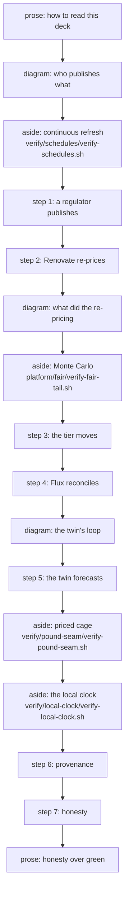

# 48 — The demo's remaining beats

Type: grilling (HITL)
Status: resolved
Blocked by: 10, 11, 18, 20

## Question

Video by-product (screen recording versus optional local TTS/puppeteer pipeline); Monte Carlo beat placement (step 2 reading `fair.py` or its own beat); continuous-refresh beat placement and what it reads; scope of "gate" on slides beyond the four refused phrases; which adopter twin the twin beat runs on and how a priced cage is shown while `ENACT_MODE` is development.

## Notes

Graduated 2026-08-28 from ticket 20's resolution. Definition of done includes wiring its check into `talk/verify-all.sh`.

## Facts checked before deciding (2026-09-09)

Every claim below was measured in this worktree, not carried from the record.

- **The 2026-08-31 comment above is itself stale.** `git show origin/main:twin/ENACT_MODE` reads
  `development`. 916c40b (2026-08-31, "twin: back to operations") was superseded three days later
  by f959187 (2026-09-04, "ENACT_MODE is development, standing, by the owner's instruction of
  2026-09-04"). Of the 52 TRUTH lines in `talk/truth.log`, the 10 that carry an `enact=` field at
  all (the field is ticket 96's, added 2026-09-06) all read `enact=development`; the other 42
  predate the field and say nothing. So the Question's "while `ENACT_MODE` is development" framing
  stands and the comment striking it does not.
- **Blocked by 10, 11, 18, 20 — all four read `Status: resolved`.** Checked in the four files.
- **The capture's last line is not the run's grade.** `talk/captures/_grades.tsv` (ticket 59)
  records what the gate graded each script from its EXIT CODE. The Monte Carlo capture
  `.estate-clone_platform_fair_verify-fair-tail.out` ends in the second line of a two-line `PASS:`
  sentence, so the last-line reading says FAIL for a script that exited 0. Measured on both runs
  this build read: 29 of run 184's 121 captures and 30 of run 186's 120 have that shape. This
  decided where a slide's status comes from (below).
- **The four captures this ticket's beats need are in the recording commit of both runs**
  (184 at 6772a7a, 186 at 9517d98): fair-tail, schedules, pound-seam, local-clock.
- **The hub has no releases at all** (`gh release list` prints nothing), so ticket 20 item 5's
  release asset does not exist yet. See Waits on the owner.

## Answer

Resolved 2026-09-09. Four decisions, each **delegated** ([ADR-0025](../../../docs/adr/0025-the-assistant-decides-architecture-and-records-it.md)),
with its reason. Graded by `verify/demo/verify-demo.sh` (`talk/verify-demo.sh` through the symlink),
which is the check ticket 20 graduated this ticket with and which this ticket extends.

### 1. The video by-product — decided elsewhere, recorded here, not re-decided

**Delegated; nothing is decided here because ticket 20 already decided it.** Ticket 20's Answer
item 5 (2026-08-28) reads: `pitch-v6.mp4` becomes a GitHub release asset on the hub, the audio is
not kept, and the by-product video is a screen recording of a human drive. `map.md` line 52 carries
the same sentence. **Reason for not re-opening it:** the later round listed "screen recording versus
optional local TTS/puppeteer pipeline" as still open, but item 5 disposed of both halves — the
audio is the only input to the TTS/puppeteer pipeline and it is not kept, so keeping the pipeline as
an option was already answered by dropping its input. Re-deciding a settled item is how the record
drifts.

What this ticket does instead is make the artefacts say it. `talk/narration.json`'s closing slide
now reads that the recording is a screen recording of a human driving the slides, published as a
release asset, with no audio track kept and no synthetic narration in the pipeline;
`talk/RUNBOOK.md` §2 carries the same as a dated note naming ticket 20 item 5 as the decision and
`.scratch/talk-spec/pitch-v6/` as the committed record of what was rendered on 2026-08-25 and is
not run again.

### 2. Where the Monte Carlo and continuous-refresh beats sit, and what they read

**Delegated.** Both become **asides**: a new slide kind that reads a capture the way a beat does
but is not one of the seven NORTH-STAR §4 steps. **Reason:** the check's own rule is that the beats
are the seven steps in order (`build_deck.py` refuses any other set), and both of these reads are
real and neither is a step — the Monte Carlo is what step 2's pound rests on and the refresh is
what makes step 1 happen at all. Folding either into a step would have meant one slide quoting two
captures, and the figure check binds one capture per slide. An aside carries the run's grade for
its script, is figure-checked against its own capture, and is outside the step ordering.

| aside | where it sits | the capture it reads | what it says when the capture is absent |
|---|---|---|---|
| continuous refresh | after the estate diagram, before step 1 | `talk/captures/verify_schedules_verify-schedules.out` | names the file, then: which clocks this eco-system runs and when each last fired is a fact only this check gathers, so nothing is put there — not a blank pretending to be a pass, and not the number from the last run that did look |
| Monte Carlo | after the compose diagram, before step 3 | `talk/captures/.estate-clone_platform_fair_verify-fair-tail.out` | names the file, then: the engine's own assertions are the only place these amounts exist and this deck will not retype them from a previous run |
| priced cage | after step 5 | `talk/captures/verify_pound-seam_verify-pound-seam.out` | names the file, then: an unpriced picture of a priced cage is the exact claim this estate refuses to make |
| the local clock | after the priced cage | `talk/captures/verify_local-clock_verify-local-clock.out` | names the file, then: whether the clock has run on this machine is a fact about one laptop, and with no capture the slide says nothing rather than implying a run nobody observed |

**Placement reasons.** Continuous refresh sits *before* step 1 because it is what makes step 1
happen — the capture is the register of every party's clock and the last time each fired, including
the clock that produced the deck's own run. The Monte Carlo sits *after* step 2 and before step 3
because step 2 is where a price first moves and step 3 is where a price crosses a band: the
simulation belongs between the number moving and the number being acted on.

**What a beat reads when its capture is absent, and what the check then says.** The slide renders
`status=ABSENT cited=no capture=-`, names the file it wanted in the visible text, carries no figure
and claims no grade; `verify-demo.sh` **exits 3, a could-not-look, and never 0**. It is not red:
an extra read a run did not produce is not a fault in the deck and not a fault in the estate. The
seven steps keep the stricter, older rule — a step check on disk with no capture is a missing
observation and red — because those seven are what the estate promises and an aside is not. The
manifest row declares both new could-not-looks.

**One correction this forced.** A slide's status is now read from `talk/captures/_grades.tsv`, the
per-script table the run wrote from the exit codes it saw, and from a capture's last line only for
a run recorded before that table existed. The two are compared whenever the last line carries a
verdict of its own, and disagreement is a failure. **Reason:** the last-line reading is a proxy for
the exit code and it is wrong for the Monte Carlo capture itself — a script that exited 0 reads
back FAIL. Deriving a slide's grade from a proxy for the graded thing is the defect class this
estate keeps finding, and it would have shipped on the first aside.

### 3. The scope of the word "gate" on slides

**Delegated, executing the owner's Q5.** The lint refuses **five** phrases, and **the list is read
out of `CONTEXT.md`'s new `## Words a slide may not use` table**, not typed into any script:

| refused | say instead | refused by |
|---|---|---|
| `exemption` | a priced hole, or a declared inability that is caged and priced | CONTEXT.md's **Exemption** entry: a banned concept, there are none, ever |
| `hourglass` | the compose graph, `talk/diagrams/compose.png` | reversal 1 of the 2026-08-27 drift review removed the neck |
| `admission gate` | the mutating admission controller, and the cage it writes | CONTEXT.md's **Cage** entry, in the owner's words (ticket 75 Q5) |
| `deny gate` | the bottom rung of the cage ladder, `isolated` | the **Cage** entry: nothing is denied (ticket 89) |
| `deny is the bottom rung` | `isolated` is the bottom rung, reached by the pound and never by a refusal | ticket 89, *deny is not a rung*; the **Isolated** entry names the bottom rung |

**Where the list comes from, and why that matters.** From ticket 47 until now the four phrases were
a python literal in `talk/build_deck.py` — derived from nothing a reader could check and answerable
to no decision, which is the one defect class every review of this estate has found. The vocabulary
record already carried the reason for each: the **Exemption** entry, and the **Cage** entry which
quotes the owner's Q5 answer verbatim and carries ticket 89's one sentence. So the record now
carries the list, each row beside the entry that refuses it, and the checker reads the record.
Adding a word to the lint is an edit to `CONTEXT.md`.

**What the slides say instead** is the table's second column, and the check prints it beside the
refusal, so a red tells the author what to write rather than only what not to.

**What is NOT refused, and why the answer is not "refuse the word".** Ticket 75 Q5 refused the
**admission** sense — the estate is a mutating admission controller, so no slide may name an
approving or refusing one. It did not refuse the word. The truth surface keeps the name *the gate*
(ticket 03), ADR-0011 keeps *release gate*, and the adopters keep *adopter gate*; a word lint
cannot tell which sense a line means, so every other use is printed as a human review item and is
never a failure. That is unchanged from ticket 20 Q4(a) and is now stated in the record rather than
only in a script comment.

**One thing the old list could not catch.** Matching is now done with markdown emphasis stripped
and whitespace collapsed, because the phrase this lint exists for last shipped as
`Deny is the *bottom* rung` (`talk/deck-2026-07-31-superseded.md`) and a literal substring list
would have walked straight past it — as would any phrase the wrapper broke over two lines.

### 4. Which adopter's twin the twin beat runs on, and how a priced cage is shown

**Delegated.** **driftwood**, and not as a preference: step 5's own capture is where the other two
adopters say why not, in their own words — ludlow's and tuppence's emitters both refuse with
`CANNOT LOOK`, naming the instrument each is missing (`party.yaml` publishes no signed `size:` for
an amount to derive from, and the one causal edge into each perspective's cash flow is graded
outside the ladder's admission threshold) rather than defaulting a figure. driftwood is the only
adopter whose overlay can price a forward-intel payload today. Step 5's narration now says so and
points at the capture that says it.

**The priced cage** is the `priced-cage` aside, reading `verify/pound-seam/verify-pound-seam.out`:
driftwood's signed appetite, the reduction set its residuals came from, and the line that matters —
platform's tier table and driftwood's own graded curve are two independent implementations that
pick the same rung as cheapest on the same shock while disagreeing about what the other rungs cost.
**Reason for reading that capture and not a cage manifest:** a served cage is a rung selected under
a perspective, and `verify-pound-seam` is the check that derives the selection from driftwood's own
signed numbers; a file on disk under `platform/graded/` is an authoring artefact no Kustomization
applies and proves nothing about what runs.

**The model call is a recorded local clock, never a schedule.** Since ticket 92 the call runs from
`talk/local-clock.sh` on the owner's machine under the enact guard; no twin pod runs on any cluster
and no schedule makes the call. So the `local-clock` aside reads
`verify/local-clock/verify-local-clock.out`, which on runs 184 and 186 alike is a
**could-not-look** in the
check's own words (`no .local-clock/last-run.json on this machine`) beside the offline fixture
passing. That is the honest state and the slide says it: the machine that grades the deck is not
the machine the clock runs on.

**Follow-on, named rather than built.** Ticket 93 (a derived probability, hub PR 54) is open and
unmerged. If it lands, the twin beat gains a recorded *derived* probability instead of a recorded
belief read from YAML, and the aside that would read it is a fifth aside on
`talk/captures/verify_derived-probability_verify-derived-probability.out` — the capture of whichever
`verify-*.sh` ticket 93 lands, named on its manifest row. Nothing is built against it here, because
building a slide against a check that does not exist is the shape this deck refuses.

### What was built

- `CONTEXT.md` — new section `## Words a slide may not use`: the refused-phrase table, what to say
  instead, and the entry or dated decision that refuses each row.
- `talk/build_deck.py` — the `aside` slide kind (render, status, marker, parse, check);
  `refused_phrases()` reading the record and `flatten()` stripping emphasis; `grades_table()`,
  `verdict()` and `resolved_grade()` so a slide's status is the run's exit-code grade and the whole
  verdict sentence reaches the slide; `select()` drops the whole verdict block rather than one line
  of it; `check()` returns a could-not-look list; four new seam tests in `--selfcheck`.
- `talk/narration.json` — the four asides, step 5's narration naming driftwood and why, and the
  closing slide's video sentence.
- `talk/verify-demo.sh` — grades the asides, exits 3 with the aside's own reason when a capture is
  absent, compares aside markers as well as beat markers against the rebuild, and says all of this
  on its PASS line.
- `talk/verify-manifest.txt` — the demo row's declared could-not-looks: the two new ones plus two
  that the script could already print and nobody had declared. `no python3` and `not inside a git
  work tree` are deliberately left undeclared (recorded on the row): both are the runner missing
  something the gate itself needs, so either should be a red, not a shrug declared in advance.
- `talk/RUNBOOK.md` — the four asides and the video decision, as dated notes under the existing
  superseded banner. Never a rewrite.
- `talk/deck.md` — regenerated. It now describes run 186 (it described run 22) and carries sixteen
  slides: seven beats, four asides, three diagrams, two prose. Its four asides carry run 186's own
  grades: continuous refresh observed false, Monte Carlo observed true, priced cage observed true,
  the local clock could-not-look.

### Red first

Measured against the deck as it then stood, describing run 184; the branch was then rebased onto
`origin/main`, the deck rebuilt onto run 186 and the same battery re-run green. Each seam was made
to fail before it passed, twice: once as a permanent test in
`build_deck.py --selfcheck` (proved by mutating the implementation and watching the assertion go
red), and once end to end through `verify/demo/verify-demo.sh` over a planted `talk/deck.md`.

- **(a) a figure no capture carries.** Planted `the residual is 1,234,567.89 GBP.` on the priced-cage
  slide. Red: `bad  aside priced-cage: figure '1,234,567.89' is on the slide but not in its capture`
  then `FAIL: the committed talk/deck.md does not survive its own checks against run 184`. Restored:
  exit 0.
- **(b) a slide whose capture the run never wrote.** Pointed the local-clock aside at a script with
  no capture. The slide read `**could not look** — this run wrote no
  `talk/captures/verify_never-run_verify-never-run.out`, so this slide has nothing to show and
  shows nothing.` and the check said `SKIP: a deck of this run's captures names a read this run
  wrote no capture for, so it could not be graded whole: aside local-clock: this run wrote no
  talk/captures/verify_never-run_verify-never-run.out` — **exit code 3**, not 0. Restored: exit 0.
- **(c) the decided phrase list.** Planted `Deny is the *bottom* rung, behind the admission gate.`
  Red on both, each naming the phrase and what to say instead:
  `bad  phrase lint: 'admission gate' is refused vocabulary — say instead: the mutating admission
  controller, and the cage it writes` and `bad  phrase lint: 'deny is the bottom rung' is refused
  vocabulary — say instead: `isolated` is the bottom rung, reached by the pound and never by a
  refusal`. Then the admitted phrases on the same slide — `The release gate, the adopter gate and
  the honesty gate keep their names; the truth surface is still called the gate.` — produced
  `review, not a lint failure: the word gate appears on 1 lines` and **exit 0**.

Map line: `- [48 — The demo's remaining beats](issues/48-the-demo-s-remaining-beats.md) — the video by-product is not re-decided (ticket 20 item 5: a screen recording of a human drive, the mp4 a hub release asset, the audio dropped, so the TTS/puppeteer pipeline is not the route) and the deck and RUNBOOK now say so; the Monte Carlo and continuous-refresh beats become ASIDES, a capture-reading slide that is not one of the seven §4 steps, reading `.estate-clone/platform/fair/verify-fair-tail.sh` before step 3 and `verify/schedules/verify-schedules.sh` before step 1, each carrying the run's own grade and, when the run wrote no capture, naming the file it wanted while `verify-demo.sh` exits 3 rather than passing; the refused-phrase list moves out of `talk/build_deck.py` into CONTEXT.md's `## Words a slide may not use` table with what to say instead beside each row, gains `deny is the bottom rung` and matches with markdown emphasis stripped, while `the gate`, `release gate` and `adopter gate` stay human review items because ticket 75 Q5 refused the admission sense and not the word; the twin beat runs on driftwood because step 5's capture is where the other two adopters say they cannot price, its priced cage is an aside on `verify/pound-seam/` and its model call an aside on `verify/local-clock/` reading a recorded local clock and never a schedule, with ticket 93's derived probability named as the follow-on; and a slide's status is now the run's own `talk/captures/_grades.tsv` grade, not a capture's last line, which reads back FAIL off the Monte Carlo capture's own script that exited zero.`

## Waits on the owner

1. **The hub release asset.** Ticket 20 item 5 (2026-08-28) decided `pitch-v6.mp4` becomes a
   GitHub release asset on the hub. `gh release list` prints nothing: the hub has no releases at
   all, so the decision's mechanical half has never been executed and the 42 MB mp4 still exists
   only under `.scratch/talk-spec/pitch-v6/` on one machine. Publishing it needs a tag, and this
   build cuts none. Money, dates, identities and authorisations are the owner's (ADR-0025), and
   publishing an artefact under the org's name is an authorisation.

## Comments

- 2026-08-31 (ambition review): Strike the "while ENACT_MODE is development" framing — the mode returned to operations (916c40b). Blockers 10/11/18/20 are all resolved; the ticket is ready to run.
- 2026-09-09 (ticket 48 build): the 2026-08-31 comment above is superseded and left in place, not
  rewritten. `twin/ENACT_MODE` on `origin/main` reads `development` (f959187, 2026-09-04, standing
  by the owner's instruction), which is later than the 916c40b the comment cites, and every TRUTH
  line that carries the field reads `enact=development`.
