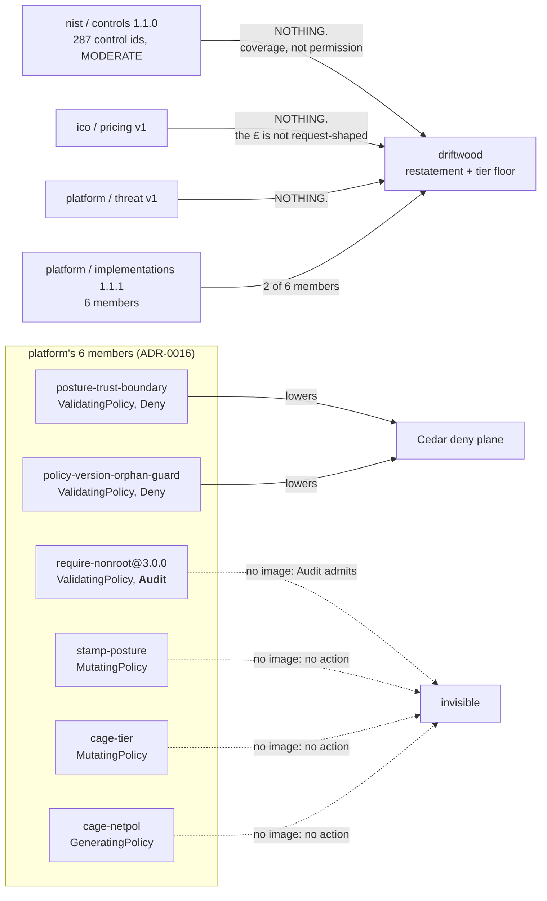

# 05 — Cedar for composition

Research note for [issues/05-research-cedar-for-composition.md](../issues/05-research-cedar-for-composition.md).
Written 2026-08-28. Prior art: twin build ticket [27](../../twin/build/27-the-constraint-set-and-published-scope-exclusion.md)
(the Cedar-not-Dogwood note), [66](../../twin/build/66-propose-only-enactment-prs-and-policy-as-a-signe.md),
[ADR-0016](../../../docs/adr/0016-a-subclass-never-restates-a-mutate.md).

**Everything below marked "ran" was executed on this machine on 2026-08-28**, not read about.
Toolchain, exact versions, and the commands are in [Reproducing this](#reproducing-this) at the end.

---

## Verdict

**No-go as anything composition depends on. A conditional, later go for one check, and the
condition is a ticket-09 design choice, not a Cedar fact.**

- Cedar's `symcc implies` **does** decide "is set A at least as strict as set B", soundly and
  completely, in milliseconds, with a concrete counterexample. That part of the ticket-27 claim
  holds up and I verified it end to end rather than citing it.
- It decides it over **2 of the 6 members** of the real composed set. Three of six carry no
  action at all (two `MutatingPolicy`, one `GeneratingPolicy`) and have no image in Cedar
  whatsoever; a fourth is `Audit`, which also has no image. The lowering does not lose detail
  around the edges — it loses two thirds of the artefact.
- On the cage spec specifically, Cedar reproduces `cage_engine.py` Track 2's answer **exactly**,
  because the encoding makes each dial an independent conjunct and Cedar's allow-set inclusion
  then *is* Track 2's componentwise order. Same verdict, plus a Rust toolchain, a cvc5 binary,
  an experimental feature flag, a hand-written schema and a hand-written lowering.
- The tooling is **not GA and does not claim to be**: `analyze` is an opt-in feature outside the
  default *and* the `experimental` bundle, the crate is 0.6.0, AWS calls the CLI a *"reference
  implementation"* for *"proof-of-concept work"*, and docs.cedarpolicy.com documents none of it.
  Fine for a spike; not something a release gate should depend on this year.
- The one thing Cedar can do that Track 2 provably cannot: catch a **conditional** widening
  disguised as a tightening. I built that case and Cedar named the exact counterexample; Track 2
  has no condition axis and would call it a tightening. **That is the whole of the case for
  Cedar, and it is unreachable today** because ticket 09's tier floor is one value per party.

So the recommendation is a question back to ticket 09, not a build:

> If the adopter's tier floor is ever allowed to be **conditional** — per namespace, per
> workload, per label — then per-field comparison is the wrong shape and Cedar is the right
> tool. If the floor stays one value per party, Track 2 already decides it in 40 lines and
> Cedar is pure cost.

---

## 1. What Cedar's analysis can decide

The analysis is real, shipped, and **not on by default**. `cedar-policy-cli` 4.12.0 (Cedar
language version 4.5) lists a `symcc` subcommand, and running it on a stock install prints:

```
Error: subcommand `symcc` is experimental, but this executable was not built with
`analyze` experimental feature enabled
```

`analyze` is neither in `default` nor in the `experimental` feature bundle in the crate's own
`Cargo.toml` — it is its own opt-in, pulling `cedar-policy-symcc` 0.6.0. Rebuilt with
`--features analyze`, the surface is:

| subcommand | decides |
|---|---|
| `never-errors` | a policy never produces a runtime error |
| `always-matches` / `never-matches` | one policy's condition is a tautology / unsatisfiable |
| `matches-equivalent` / `matches-implies` / `matches-disjoint` | two **policies'** match conditions |
| `always-allows` / `always-denies` | the **set** allows / denies every well-formed request |
| **`equivalent`** | two **policy sets** are logically equivalent |
| **`implies`** | **set 1 subsumes set 2 — "everything set 1 allows, set 2 allows"** |
| `disjoint` | two sets share no permission |

`implies` is the ticket's question. `A implies B` = everything A allows, B allows — i.e. A is at
least as strict as B. **The argument-order convention is ambiguous in the published README wording
and I fixed it empirically**, by the runs in §2: the direction above is the one the tool means.
Running it both ways separates "at least as strict" from "strictly stricter": A⟹B verified and
B⟹A refuted is exactly *strictly stricter*, with the refutation carrying a witness.

**There is a second, better-fitting tool, and it is further from production.** The ticket's
own vocabulary — "more-permissive / less-permissive" — is not the Rust CLI's; it belongs to
`cedar-lean-cli` in [cedar-spec](https://github.com/cedar-policy/cedar-spec/tree/main/cedar-lean-cli),
whose `analyze compare` *"takes two policysets and determines for each 'type' of request if the
first policyset is equivalent, less permissive, more permissive, or incomparable to the second"*.
That is the exact four-way verdict, **Incomparable included** — the same word ticket 27 used when
it rejected Dogwood for producing spurious ones. It exists only there; the Rust `symcc` API has no
`compare`, so from Rust you run `implies` twice and combine, as §2 does.

**Status: reference implementation, not GA, on both surfaces.** The AWS launch post
([2025-06-16](https://aws.amazon.com/blogs/opensource/introducing-cedar-analysis-open-source-tools-for-verifying-authorization-policies/))
says the CLI *"serves as a reference implementation to demonstrate possible analysis approaches"*
and recommends it *"for hands-on learning, exploration, and proof-of-concept work"*. The
`cedar-policy-cli` README warns that `analyze` ships only in a parallel experimental release
archive and *"surface area of these features can change between releases; use the regular flavor
if stability matters."* The crate is 0.6.0 — pre-1.0, no semver promise. And
**docs.cedarpolicy.com documents none of this**: there is no analysis page on the site at all, so
the ticket's "primary sources on docs.cedarpolicy.com" instruction has nothing to point at. The
real primary sources are the two repo READMEs, the two papers, and that blog post.

**Soundness and completeness.** The `cedar-policy-symcc` README (the crate on disk, the primary
source) states: *"Our symbolic compiler and verifiers have been formally modeled and verified in
Lean … to guarantee trustworthy verification results."* The OOPSLA'24 paper is stronger and more
precise: *"We designed Cedar specifically to support an SMT encoding that is sound, decidable,
and complete; no prior authorization language enjoys such an encoding. To achieve it, we use a
novel type-based translation that employs only decidable theories, and finite sets of ground
well-formedness constraints (e.g., to ensure entity graphs are acyclic) rather than quantified
constraints."* ([arXiv:2403.04651](https://arxiv.org/abs/2403.04651) §2, §4.)

The paper hedged (*"proofs of soundness and completeness using the Lean encoder are underway"*);
that gap has since closed — cedar-spec's
[cedar-lean README](https://github.com/cedar-policy/cedar-spec/blob/main/cedar-lean/README.md) now
lists under **Verified properties** both *"Sound and complete symbolic compilation"* and *"Sound
and complete verification — Verification checks (such as equivalence, implication, etc.) … are
sound (no false negatives) and complete (no false positives)."* The follow-up SymCert paper
(FMCAD 2026, Torlak) contrasts this with AWS IAM's Zelkova, which *"is sound but not complete"*.

**Decidable is not the same as always-answers.** `Error::SolverUnknown` — *"solver returned
`unknown`"* — is a live variant in the crate's `err.rs`. Nothing documents when it fires.

That guarantee is bought with a real price, which §5 is about: **Cedar rejects
every feature that would break it.** RFC 0021, which proposed `.any?`/`.all?` set quantifiers,
was merged and then [explicitly rejected](https://github.com/cedar-policy/rfcs/pull/65) with the
author's reason: *"we've found that even the simplified proposal for `.any? / .all?` is not
amenable to automated reasoning."* This matters below, because the estate's policy bodies are
CEL and CEL's `.all()` is everywhere.

**The decision procedure is cvc5, out of process.** `--cvc5-path` is a required-in-practice flag;
there is no bundled solver and no Z3 path. cvc5 is not in Homebrew — the release binary from
`github.com/cvc5/cvc5` is the route (the symcc README pins 1.3.1; 1.3.4 worked).

**One request environment per invocation.** The CLI signature is
`--principal-type P --action 'Action::"a"' --resource-type R`. The symcc README's own Rust example
loops: *"Iterate through all request environments and check the property."* The CLI does not loop
for you. A composed set with several actions needs a driver that enumerates the triples and ANDs
the results; a forgotten triple is a silent hole. Worth knowing before anyone calls this "one
command".

---

## 2. Minimal lowering: nist → platform → driftwood

The real edge set, from `.estate-clone/driftwood/party.yaml`:

```yaml
inherits:
  - { party: platform, kind: implementations, version: "1.1.1" }
  - { party: nist,     kind: controls,        version: "1.1.0" }
  - { party: ico,      kind: pricing,         version: "v1" }
  - { party: platform, kind: threat,          version: "v1" }
```

What each edge contributes to a Cedar lowering:



**Schema.** Cedar schemas are types-only — the paper's §3.4 formalisation makes a schema a pair
(entity schema, action schema) of *types*, and there is no value constraint anywhere in it. So
every physical fact about a pod is a `Long`/`Bool`/`String` attribute and every *constraint* on it
is a policy body:

```cedar
entity Party;
entity Pod = {
  "policyVersion": String,
  "posture": String,
  "runAsNonRoot": Bool,
  "allContainersReadOnlyRootFs": Bool,   // <-- the CEL all() hoisted out. See §5.
  "cpuMilli": Long,
  "memMi": Long,
  "wafRank": Long,                       // 0 none, 1 light, 2 heavy
  "netpolEgressLocked": Bool,
};
action "admit" appliesTo { principal: Party, resource: Pod };
```

**Publisher set** — platform 1.1.1, deny plane, plus its `baseline` cage floor (cpu 500m,
mem 256Mi, waf none, netpol not required):

```cedar
permit(principal, action == Action::"admit", resource);

// posture-trust-boundary (validationActions: [Deny])
forbid(principal, action == Action::"admit", resource)
when { resource.posture != resource.policyVersion };

// cage floor = baseline
forbid(principal, action == Action::"admit", resource) when { resource.cpuMilli > 500 };
forbid(principal, action == Action::"admit", resource) when { resource.memMi > 256 };
```

**Adopter set** — driftwood: the inherited rule, one restatement (`require-nonroot@3.0.0`,
Audit → Deny, stricter so accepted), and a tier floor of `restricted` (cpu 250m, mem 128Mi,
waf ≥ light, netpol locked):

```cedar
permit(principal, action == Action::"admit", resource);

forbid(principal, action == Action::"admit", resource)
when { resource.posture != resource.policyVersion };

// RESTATEMENT: require-nonroot@3.0.0, Audit -> Deny
forbid(principal, action == Action::"admit", resource)
when { resource.policyVersion == "3.0.0" &&
       !(resource.runAsNonRoot && resource.allContainersReadOnlyRootFs) };

// TIER FLOOR 'restricted'
forbid(principal, action == Action::"admit", resource) when { resource.cpuMilli > 250 };
forbid(principal, action == Action::"admit", resource) when { resource.memMi > 128 };
forbid(principal, action == Action::"admit", resource) when { resource.wafRank < 1 };
forbid(principal, action == Action::"admit", resource) when { !resource.netpolEgressLocked };
```

**Ran, both directions:**

```
A) implies --policies1 driftwood --policies2 platform
   ✓ Policy set 1 implies policy set 2: VERIFIED

B) implies --policies1 platform --policies2 driftwood
   ✗ Policy set 1 implies policy set 2: DOES NOT HOLD
     Counterexample: Pod { cpuMilli: -1, memMi: -1, netpolEgressLocked: false,
                           policyVersion: "", posture: "", runAsNonRoot: true,
                           allContainersReadOnlyRootFs: true, wafRank: -1 }
```

A verified + B refuted = **driftwood's composed set is strictly stricter than platform's, decided,
not asserted.** Whole run: 19ms wall including solver spawn.

**Ran, the widening case.** Same file with the floor loosened to cpu 1000m:

```
C) implies --policies1 driftwood-widened --policies2 platform
   ✗ DOES NOT HOLD.  Counterexample: Pod { cpuMilli: 1000, ... }
```

It names the exact dial and the exact value. That is a better refusal message than anything the
estate emits today.

**The counterexamples are physically impossible.** `cpuMilli: -1`, `wafRank: 9223372036854775807`.
A Cedar schema types an attribute and cannot constrain its value, so every well-formedness fact
(`cpuMilli >= 0`, `wafRank in 0..2`) has to be hand-written as extra `forbid`s into **both** sets
or the witnesses are junk. Cheap to fix, easy to forget, and forgetting it is silent.

---

## 3. Can a cage spec sit on the same lattice?

**Yes for cpu, memory, waf and netpol — the four the ticket names — and it is the easy part.**
The encoding above is the whole trick: represent a cage spec by the set of pods whose own
requests already fit inside it, so *tighter cage* = *smaller allow-set* = Cedar's `implies`.
Each dial becomes an independent `forbid` conjunct, and set inclusion is then exactly
componentwise ordering.

Three qualifications, in descending order of how much they matter.

**a) A mutate is not a forbid, and lowering it as one overstates strictness.** `cage-tier` is a
`MutatingPolicy`. It *stamps the dials onto the pod* — it always admits, and its own header says
so: *"this policy never denies."* The Cedar encoding refuses the pod instead. Ticket 27 already
found this asymmetry pointing the other way (*"a `forbid` would be strictly weaker: it lets the
field exist and refuses the request"*); here it points the other way and is worse, because a
refusal reads as *stricter* than a mutation that silently fixes the pod and lets it run. Cedar
will happily tell you the adopter is stricter when in truth it is more brittle. **The comparison
is only honest between two cage specs, never between a cage spec and an admission rule.**

**b) netpol is not on the lattice, and is not a dial.** `cage_engine.py`'s `CageSpec` has six
fields — `cpu, mem, pc, drop_all, read_only_root_fs, waf` — and netpol is not among them.
`cage-netpol` is a `GeneratingPolicy` that fires off the `posture.acme.io/caged` label
`cage-tier` stamps, and it emits one fixed NetworkPolicy (egress DNS only). It is a boolean
function of "is this pod caged at all", already implied by the tier. Putting it on the lattice as
a fifth axis, as the ticket's framing does, adds an axis that can never move independently. Not
wrong, just not load-bearing.

**c) priorityClass is the field that would actually cost something.** Track 2 ranks it on the
*real* `value:` read out of the committed `graded/policies/priorityclasses.yaml`, deliberately —
its docstring records that a rank keyed off the tier label instead *"can never move even when the
tier's `pc` field is repointed at a genuinely different, more-or-less-privileged PriorityClass"*,
and there is a named regression guard for exactly that. Cedar has no route to a value in another
YAML file. The lowering would have to inline the numbers, which reintroduces the bug the
regression guard exists to prevent, one release after someone edits `priorityclasses.yaml`.

---

## 4. What the lowering loses

Ordered by size of loss.

1. **Four of six members, and the two biggest ideas in the model.** No mutation, no generation.
   `stamp-posture` writes the label `posture-trust-boundary` reads; `cage-tier` writes the label
   `cage-netpol` generates from. Cedar has no dataflow between policies and no ordering — the
   paper is explicit that *"decisions are indifferent to the order that policies are considered"*
   — so the mechanism that makes the composed set work in-cluster (Kyverno runs the mutating
   webhook before the validating one, which ADR-0016 records as inherited, not declared) is
   invisible. Cedar could pronounce two sets equivalent that behave differently on a real cluster.

2. **`Audit` has no image, so the ladder collapses.** Cedar has permit and forbid, nothing else.
   `Audit` means *record and admit*, so it lowers to nothing on the deny plane. Ran the estate's
   real case — `require-nonroot` 2.0.0 → 3.0.0 tightened the body (it added the
   `readOnlyRootFilesystem` check) while staying `Audit`:

   ```
   D) equivalent --policies1 audit-v2 --policies2 audit-v3
      ✓ Policy sets are equivalent: VERIFIED
   ```

   Cedar declares a genuine tightening to be no change. The `STRICTNESS = {"Audit": 0, "Deny": 1}`
   ladder in `composition.py` is two points; Cedar's is *one*. **Mitigation, and it is a good
   one:** lower each set twice — an *audit plane* and a *deny plane* — and order the pair
   componentwise. Two `implies` runs instead of one, and the ladder survives. Worth writing down
   whoever builds this.

3. **CEL's `.all()` has no image, and never will.** `require-nonroot@3.0.0`'s second validation is
   `object.spec.containers.all(c, c.?securityContext.?readOnlyRootFilesystem.orValue(false) == true)`.
   Ran it:

   ```
   × invalid variable: c
     help: the valid Cedar variables are `principal`, `action`, `resource`, and `context`
   ```

   Cedar has no bound variable of any kind. And this is not a gap awaiting a release — RFC 0021
   was rejected *because* quantifiers break the analysis. The only lowering is to hoist the
   quantifier into a precomputed `Bool` attribute, as §2 does with
   `allContainersReadOnlyRootFs`. **That is structurally the same failure ticket 27 used to
   reject Dogwood**: hoisting a condition into an uninterpreted boolean keyed on the rule makes
   two syntactically different guards two independent free booleans, and equivalence goes blind
   between them. Cedar earns its analysis on the fragment it keeps; on the fragment the estate
   actually writes, it degrades to the same opacity. Whoever quotes ticket 27's Cedar verdict
   should quote this beside it.

   *(One consolation: the orphan guard's `variables.allowed.exists(v, v == variables.claimed)`
   quantifies over a **literal list**, so it lowers exactly as
   `["2.0.1","3.0.0"].contains(resource.policyVersion)`. Ran it — adding a version to the live
   list is refuted as a widening with the added version as the witness. That one is clean.)*

4. **The `.orValue('')` idiom does not survive strict typing.** Cedar's validator refuses
   `!(resource has x) || resource.x != "3.0.0"` — *"unable to guarantee safety of access to
   optional attribute"* — and demands the `has &&` form. Each CEL optional-chain has to be
   rewritten by hand into a conjunction, and the rewrite changes which way an absent label falls.
   Get the direction wrong and the analysis is confidently wrong. Every `matchConditions` block
   in the estate uses this idiom.

5. **Everything the nist, ico and threat edges carry.** Control-id coverage, holes, baseline
   widening, dangling claims, the £, the appetite band, the priced residual. None of it is
   request-shaped. Cedar answers "would this pod be admitted"; composition's hardest questions
   are about the *artefact* — which controls are claimed, which hole is new since the last signed
   composition, which parent re-priced. Ticket 27 already found this shape of limit
   (*"Cedar decides one request; ticket 28's guarantee is about a choice set and an artefact
   body"*) and it is the same limit here.

6. **A tier floor cannot be a template, twice over.** The obvious shape for a reusable floor is a
   Cedar template parameterised by a number. Two independent blockers: Cedar templates have only
   `?principal` and `?resource` slots, scope-position only — there is no `?limit` — and the
   symbolic compiler refuses slots outright (`CompileError::UnsupportedFeature`,
   *"templates/slots are not supported"*). Every party's floor is a separately generated,
   separately linked, fully-written-out policy set.

7. **`Long` only, and no division.** Millicores and bytes are fine as integers. Decimal exists
   but is comparison-only — no arithmetic on it at all — and there is no `/` or `%` operator in
   the language. Any ratio the cage ladder might want (utilisation, a percentage of a band) has
   to be precomputed outside. Also: the validator does *not* catch integer overflow, by the docs'
   own admission.

---

## 5. Against `cage_engine.py` Track 2

| | Track 2 (`at_least_as_permissive`) | Cedar `symcc implies` |
|---|---|---|
| what it compares | two `CageSpec` 6-tuples | two policy **sets**, over all well-formed requests |
| order | componentwise partial order; *"one field improving never excuses another regressing"* | allow-set inclusion |
| fields | cpu, mem, priorityClass, dropAll, readOnlyRootFs, waf | whatever the schema declares |
| conditions | **none — there is no condition axis** | arbitrary, and this is the whole point |
| overlapping rules | not modelled; one dial table per version | native (forbid-overrides-permit over the union) |
| priorityClass value | read from the real committed `priorityclasses.yaml` | would have to be inlined |
| `Audit` vs `Deny` | out of scope (Track 1 owns it, on the 2-point ladder) | invisible without the two-plane trick |
| mutate / generate | modelled as what they are — the dials they stamp | no image |
| dependency | stdlib Python, ~40 lines, plus a self-check that already runs | Rust toolchain, cvc5 binary, non-default feature flag, hand-written schema, hand-written lowering, a driver to loop request envs |
| failure output | names which fields regressed | a concrete counterexample request |
| speed | instant | 19ms on 8 policies. **Every published benchmark is ≤15 policies**; no primary source gives timings at hundreds |

**On the shared question, they agree, and Cedar adds nothing.** Encode each dial as its own
conjunct and Cedar's inclusion *is* Track 2's componentwise order. Same verdict, more machinery.
Cedar's counterexample is a nicer error message than Track 2's field list; that is the honest
extent of the win.

**On one question they disagree, and Cedar is right.** Track 2 has no condition axis. Ran this:
an adopter "tightens" cpu to 250m in `payments` and loosens to 750m everywhere else. Track 2
compares one dial table and would see 250 < 500 — a tightening. Cedar:

```
E) implies --policies1 adopter-conditional --policies2 publisher
   ✗ DOES NOT HOLD.  Counterexample: Pod { cpuMilli: 750, ns: "" }
```

**That is the entire case for Cedar in this system**, and it is unreachable today: ticket 09's
tier floor is one value per party, so there is no condition to hide a widening behind. It becomes
reachable the moment the floor is allowed to be scoped.

A second, smaller thing Cedar could do that nothing here does: `composition.py`'s restatement
check is **per rule**, on a 2-point ladder. There is no check that the adopter's composed set as
a *whole* is stricter than its publisher's. That question is vacuous today because every member
self-scopes on `policy-version` and the members are pairwise disjoint by construction — but
ADR-0016's own consequences note the estate pins exactly one `implementations` publisher and
*"no restatement fires"* yet. A second publisher with overlapping match sets is precisely when
per-rule comparison stops being sound and set-level inclusion becomes the only right question.

---

## 6. Recommendation

**No-go, now.** Do not put Cedar under composition, the strictness ladder, or the cage ladder.
The reasons, shortest first:

1. It decides a question that is currently **vacuous** (members are disjoint by construction, no
   restatement fires, one publisher).
2. Where the question is live — the tier floor — **Track 2 already decides it**, on the real six
   fields, with the priorityClass indirection Cedar cannot reproduce, in stdlib Python that is
   already committed and already self-checked.
3. It sees 2 of 6 members and cannot see the two mechanisms (mutation, the £) the model is
   actually built on.
4. The lowering of the estate's real CEL bodies reintroduces the exact uninterpreted-boolean
   opacity ticket 27 used to reject Dogwood.
5. The dependency is a pre-1.0, explicitly-unstable, explicitly-reference-implementation surface,
   plus an out-of-process SMT solver that Homebrew does not carry.

**Conditional go, and the condition belongs to ticket 09, not to this note.** Revisit when
**either** trigger fires:

- **T1 — the tier floor becomes conditional.** If ticket 09 lets an adopter scope its
  tighten-only floor by namespace, workload or label, componentwise comparison is provably blind
  to a conditional widening and Cedar is the correct instrument. Case E above is the proof.
- **T2 — a second `implementations` publisher lands** with rules that overlap an existing
  publisher's match set. Per-rule restatement stops being sound; set-level `implies` is the right
  question.

If either fires, the build is small and bounded, and this note has already done the design:
lower **only the deny plane of the `ValidatingPolicy` members plus the tier floor**, keep the
audit plane as a second `implies` run, hand-write the well-formedness `forbid`s, and treat the
result as a **second opinion that can only refuse** — never as the thing that decides. Track 2
and `composition.py` stay the authority. Estimate: a day, most of it on the schema and the
request-env driver, not on Cedar.

**One thing worth stealing now, for free.** Cedar's refusals name a witness — *"cpuMilli: 1000"*,
*"policyVersion: 1.0.0"*. Track 2's name a field list. Making `at_least_as_permissive` return the
offending value alongside the field name is a one-line change and most of the readable half of
what Cedar offers.

**Correction to carry forward.** Ticket 27 says Cedar *"has a symbolic compiler proven in Lean,
giving sound and complete SMT analysis"*. True, and now verified by running it. What that ticket
does not say, and what anyone quoting it should: the guarantee holds over Cedar's deliberately
small fragment, the estate does not write in that fragment, and the lowering that bridges the gap
costs the same completeness the citation was reaching for.

---

## Reproducing this

```sh
# analysis is NOT in the default build, and NOT in the `experimental` bundle
cargo install cedar-policy-cli --root ./cedar-analyze --features analyze --locked
# cvc5 is not in Homebrew; take the release binary (symcc README pins 1.3.1, 1.3.4 works)
curl -sL -O https://github.com/cvc5/cvc5/releases/download/cvc5-1.3.4/cvc5-macOS-arm64-static.zip

cedar symcc --cvc5-path .../cvc5 \
  --principal-type Party --action 'Action::"admit"' --resource-type Pod \
  --schema estate.cedarschema --counterexample \
  implies --policies1 driftwood.cedar --policies2 platform.cedar
```

Versions as run: `cedar-policy-cli` 4.12.0, Cedar language version 4.5, `cedar-policy-symcc`
0.6.0, cvc5 1.3.4, macOS arm64.

**Sources.** Primary throughout. On disk: the `cedar-policy-symcc` 0.6.0 crate README and
`Cargo.toml`, and the estate's own
`platform/computed-semver/cage_engine.py`, `platform/compose/composition.py`,
`platform/graded/{cage.py,policies/*.yaml}`, `platform/distribution/policies/v3.0.0/*.yaml`,
`platform/distribution/render-orphan-guard.py`, `driftwood/party.yaml`.
Published:
[docs.cedarpolicy.com — data types](https://docs.cedarpolicy.com/policies/syntax-datatypes.html),
[operators](https://docs.cedarpolicy.com/policies/syntax-operators.html),
[schema](https://docs.cedarpolicy.com/schema/schema.html),
[validation](https://docs.cedarpolicy.com/policies/validation.html),
[authorization](https://docs.cedarpolicy.com/auth/authorization.html),
[templates](https://docs.cedarpolicy.com/policies/templates.html);
[Cedar OOPSLA'24 paper, arXiv:2403.04651](https://arxiv.org/abs/2403.04651);
[RFC 0021 `any?`/`all?` rejection](https://github.com/cedar-policy/rfcs/pull/65);
[RFC 0057 general multiplication](https://github.com/cedar-policy/rfcs/blob/main/text/0057-general-multiplication.md);
[cedar-policy CHANGELOG](https://github.com/cedar-policy/cedar/blob/main/cedar-policy/CHANGELOG.md);
[cedar-policy-symcc README](https://github.com/cedar-policy/cedar/blob/main/cedar-policy-symcc/README.md);
[cedar-lean-cli (the four-way `analyze compare`)](https://github.com/cedar-policy/cedar-spec/tree/main/cedar-lean-cli);
[cedar-lean verified properties](https://github.com/cedar-policy/cedar-spec/blob/main/cedar-lean/README.md);
[AWS: Introducing Cedar analysis (2025-06-16)](https://aws.amazon.com/blogs/opensource/introducing-cedar-analysis-open-source-tools-for-verifying-authorization-policies/);
[SymCert, FMCAD 2026](https://www.amazon.science/publications/symcert-verifying-smt-based-policy-analyses).
**Note:** docs.cedarpolicy.com carries no analysis documentation whatsoever — checked.

**Not verified.** I did not read `cedar-policy/cedar-spec`'s Lean sources; the
formal-verification claim is the crate's, the spec repo's and the papers', taken as stated. I did
not build `cedar-lean-cli`, so its four-way `analyze compare` verdict is reported from its README
and the AWS post, not run — everything I ran went through the Rust `symcc implies`. I did not build a
request-env driver, so every run above fixes one `(Party, admit, Pod)` triple. No lowering of the
estate's real policy files was generated mechanically — the example sets are hand-written from
the real bodies, which is the point of calling it minimal.
