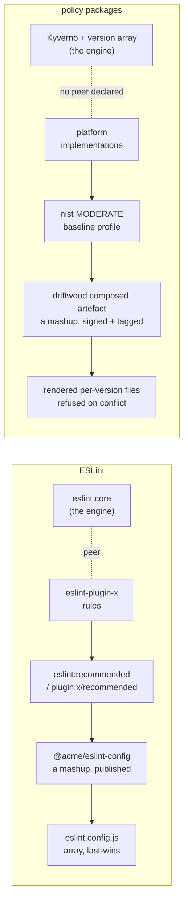

# Research — ESLint versioning semantics, and what the estate must copy

Ticket: [`06`](../issues/06-research-eslint-versioning-semantics.md). Written 2026-08-28.
Owner's instruction, verbatim (re-grill 2, P022): *"copy the behaviour of how say eslint linting packs
are versioned, and how you can supersede, mashup, join them, republish, inner source etc"*.

Primary sources only: eslint.org docs, the ESLint repo's own README and `lib/`, node-semver's README,
docs.npmjs.com, GitHub Packages docs, Verdaccio docs. Every claim below carries its link. Where a
source is silent, that is recorded as a finding rather than filled in.

---

## Part 1 — What ESLint actually does

### 1.1 The package is the unit, and every pack carries its own semver

A shareable config is nothing more than an npm package that exports a config value: *"Shareable configs
are simply npm packages that export a configuration object or array."*
([shareable-configs](https://eslint.org/docs/latest/extend/shareable-configs)). A plugin is a plain
object exposing `meta`, `configs`, `rules`, `processors`, and *"the `meta.name` property should match
the npm package name for your plugin and the `meta.version` property should match the npm package
version"* ([plugins](https://eslint.org/docs/latest/extend/plugins)).

So there is no global version. `eslint`, `eslint-plugin-jsdoc`, `@acme/eslint-config` each version
themselves, on their own clock, and a consumer's lockfile is the only place they meet.

### 1.2 Composition is an ordered array and precedence is purely positional

*"When more than one configuration object matches a given filename, the configuration objects are
merged with later objects overriding previous objects when there is a conflict."*
([configuration-files](https://eslint.org/docs/latest/use/configure/configuration-files)).

There is no priority field, no weight, no explicit conflict resolution. Array order decides, silently.
The combine-configs page teaches the same shape: apply `js/recommended` first, *"and then adds the
desired configuration for `no-unused-vars`"*
([combine-configs](https://eslint.org/docs/latest/use/configure/combine-configs)).

### 1.3 The merge is granular, not a whole-object clobber

Nested keys merge rather than replace — two matching objects both setting `languageOptions.globals`
produce *"`languageOptions.globals` are merged to create a final result"* (configuration-files). ESLint's
own merge implementation (`lib/config/flat-config-schema.js`, `main`) makes the granularity exact:

- `rules` merges **per rule entry**, and within an entry **per options slot**.
- `plugins` does **not** merge. Same namespace key bound to two different object references throws:
  ```js
  if (key in first && key in second && first[key] !== second[key]) {
      throw new TypeError(`Cannot redefine plugin "${key}".`);
  }
  ```
  The check is **reference identity**, not name or version equality — two installed versions of the
  same plugin under one namespace key is a hard error. eslint.org's own docs are **silent** on this;
  it surfaces only through the repo and its issue tracker
  ([eslint#16277](https://github.com/eslint/eslint/issues/16277),
  [eslint#19722](https://github.com/eslint/eslint/issues/19722)).

### 1.4 A severity-only override keeps the inherited options

*"Here, the second configuration object only overrides the severity, so the final configuration for
`semi` is `["warn", "never"]`."* ([rules](https://eslint.org/docs/latest/use/configure/rules)). The
implementation is the `secondRuleOptions.length === 1` branch in `flat-config-schema.js`: take the new
severity, keep `firstRuleOptions.slice(1)`.

This is the single most transferable behaviour in the whole model. **Changing how strict a rule is, and
changing what the rule says, are two different acts, and the first must not silently perform the
second.**

Severities, verbatim: *"'off' or 0 — turn the rule off. 'warn' or 1 — turn the rule on as a warning
(doesn't affect exit code). 'error' or 2 — turn the rule on as an error (exit code is 1 when
triggered)."* (rules).

### 1.5 There is no floor. A shareable config cannot protect anything

The shareable-configs page documents the override direction only: *"You can override settings from the
shareable config by adding them directly into your `eslint.config.js` file after importing the shareable
config"*, with the worked example commented *"anything from here will override myconfig"*.

There is **no `final`, no sealed rule, no minimum severity, no protected key**. Every source consulted
is silent on any such construct. A consumer may always set an inherited rule to `"off"`. This is a
documentation silence with a clear reading: ESLint's model has no concept of a publisher constraining a
consumer, because ESLint's publishers are not regulators.

### 1.6 `extends` inside a flat config object (ESLint ≥ 9.6)

*"The `extends` key is an array of values indicating which configurations to extend from. The elements
of the `extends` array can be one of three values: a string that specifies the name of a configuration
in a plugin, a configuration object, a configuration array."* (configuration-files).

Scoping guidance: *"It's recommended to always use a `files` key when you use the `extends` key to ensure
that your configuration applies to the correct files."* This is a **recommendation, not a stated
enforcement**, and the docs are **silent** on whether the parent's `files` intersects with or overrides
`files` already inside the extended objects.

Global vs local ignores are stated exactly: *"When `ignores` is used without any other keys (besides
`name`) in the configuration object, then the patterns act as global ignores... If `ignores` is used
with other properties in the same configuration object, then the patterns act as non-global ignores."*

### 1.7 Namespacing

*"To configure plugins inside of a configuration file, use the `plugins` key, which contains an object
with properties representing plugin namespaces"*, and *"The prefix `jsdoc/` in each rule name indicates
that the rule is coming from the plugin with that name rather than from ESLint itself"*
([plugins config](https://eslint.org/docs/latest/use/configure/plugins)). The convention is the npm
package name minus `eslint-plugin-`, but *"you don't need to use the same name that the plugin
prescribes. You can specify any prefix that you'd like."*

Identity is therefore **local to the consuming config**, and the rule id is `namespace/rule`.

### 1.8 Mashup and republish

There is **no dedicated documented recipe** for publishing a config that extends other published
configs. It falls out of the definition: a shareable config is an npm package exporting a config array,
`extends` composes arrays, therefore a mashup is just a package whose export is an `extends` array.
combine-configs teaches the mechanics but frames them for the consumer's own `eslint.config.js`. This
silence is itself the finding: **republishing a composed set is so obviously the same act as publishing
a leaf that ESLint never wrote it down.**

### 1.9 ESLint's semver policy, and the promise it deliberately does not make

The canonical statement lives only in the repo README's *Semantic Versioning Policy* section
([eslint/README.md](https://github.com/eslint/eslint/blob/main/README.md#semantic-versioning-policy)).
`eslint.org/docs/latest/contribute/` carries **no** semver page — do not cite one.

The policy opens by conceding the problem: *"due to the nature of ESLint as a code quality tool, it's
not always clear when a minor or major version bump occurs."*

| Class | Stated meaning | Selected bullets, verbatim |
| --- | --- | --- |
| Patch | *"intended to not break your lint build"* | *"A bug fix in a rule that results in ESLint reporting fewer linting errors."* |
| Minor | *"might break your lint build"* | *"A bug fix that results in ESLint reporting more linting errors."* · *"A new rule is created."* · *"An existing rule is deprecated."* · *"`eslint:recommended` is updated and will result in strictly fewer linting errors."* |
| Major | *"likely to break your lint build"* | *"`eslint:recommended` is updated and may result in new linting errors (e.g., rule additions, most rule option updates)."* · *"A new option to an existing rule that results in ESLint reporting more linting errors by default."* · *"Part of the public API is removed or changed in an incompatible way."* |

Three consequences matter here.

**(a) ESLint's minor is explicitly allowed to break you, and the mitigation is pushed onto the
consumer.** Verbatim: *"any minor update may report more linting errors than the previous release (ex:
from a bug fix). As such, we recommend using the tilde (`~`) in `package.json` e.g. `"eslint":
"~3.1.0"` to guarantee the results of your builds."* ESLint does not promise a non-breaking minor. It
tells you to pin.

**(b) A new rule is a minor; adding that rule to `eslint:recommended` is a major.** Publishing a
capability and requiring it are separately versioned acts, and only the second is breaking.

**(c) Deprecation is a minor and removal is barely specified.** *"An existing rule is deprecated"* is
minor. There is **no bullet at all** for removing a deprecated rule; the nearest is the major-class
*"part of the public API is removed"*. The
[rule-deprecation policy](https://eslint.org/docs/latest/use/rule-deprecation) fills the gap only
qualitatively: *"Rules will never be removed from ESLint unless one of the following is true: The rule
has been replaced by another core rule. A plugin exists with a functionally equivalent rule."* and
*"You can continue to use deprecated rules indefinitely if they are working for you."*

Support windows are a separate axis: *"The ESLint team provides ongoing support for the current version
and six months of limited support for the previous version"*
([version-support](https://eslint.org/version-support/)).

### 1.10 npm ranges, and why prereleases are excluded

From [node-semver's README](https://github.com/npm/node-semver#readme):

- `~1.2.3` := `>=1.2.3 <1.3.0-0` — *"Allows patch-level changes if a minor version is specified."*
- `^1.2.3` := `>=1.2.3 <2.0.0-0` — *"Allows changes that do not modify the left-most non-zero element."*
- `^0.2.3` := `>=0.2.3 <0.3.0-0`, and `^0.0.3` := `>=0.0.3 <0.0.4-0`. *"Many authors treat a `0.x`
  version as if the `x` were the major 'breaking-change' indicator."* docs.npmjs.com's
  [semver primer](https://docs.npmjs.com/about-semantic-versioning) is **silent** on the `0.x` case.
- Prereleases: *"If a version has a prerelease tag... then it will only be allowed to satisfy comparator
  sets if at least one comparator with the same `[major, minor, patch]` tuple also has a prerelease
  tag."* Rationale, verbatim: *"they are excluded from range-matching semantics"* because *"a user who
  has opted into using a prerelease version has indicated the intent to use that specific set."*

**A prerelease is therefore a published, resolvable, signed version that no ordinary range picks up.**
That is precisely the shape re-grill 11 asks for on the publisher side.

### 1.11 peerDependencies — declaring compatibility with a host you do not own

*"In some cases, you want to express the compatibility of your package with a host tool or library,
while not necessarily doing a `require` of this host."*
([package.json](https://docs.npmjs.com/cli/v10/configuring-npm/package-json#peerdependencies)). This is
why every ESLint plugin and shareable config lists `eslint` as a peer, not a dependency: they extend one
host instance and must not fragment it.

- npm 7+: *"`peerDependencies` are installed by default."*
- Conflict: *"Trying to install another plugin with a conflicting requirement may cause an error if the
  tree cannot be resolved correctly."*
- The escape hatch is explicitly a downgrade, not a fix: `--legacy-peer-deps` *"causes npm to completely
  ignore `peerDependencies` when building a package tree, as in npm versions 3 through 6"*
  ([config](https://docs.npmjs.com/cli/v10/using-npm/config#legacy-peer-deps)).
- `peerDependenciesMeta.optional` marks a peer the host need not have.

The load-bearing point: **the incompatibility is declared by the publisher, in the publisher's own
package, and detected at resolution time — not discovered by the consumer after the fact.**

### 1.12 Scopes, private registries, inner source

- *"A scope allows you to create a package with the same name as a package created by another user or
  organization without conflict."* · *"Unscoped packages are always public."* · *"Private packages are
  always scoped."* ([about-scopes](https://docs.npmjs.com/about-scopes),
  [about-private-packages](https://docs.npmjs.com/about-private-packages))
- A scope binds to a registry per-client:
  `npm config set @myco:registry=http://reg.example.com`
  ([scope](https://docs.npmjs.com/cli/v10/using-npm/scope)). One client routes different scopes to
  different registries at once.
- GitHub Packages binds the scope to the account: `@NAMESPACE:registry=https://npm.pkg.github.com`, and
  *"You need an access token to publish, install, and delete private, internal, and public packages"*
  ([GitHub Packages npm](https://docs.github.com/en/packages/working-with-a-github-packages-registry/working-with-the-npm-registry)).
- Verdaccio governs a package pattern with three directives — `access`, `publish`, `proxy` — matched by
  minmatch glob where *"the order of your packages definitions is important"*
  ([packages](https://verdaccio.org/docs/packages)); an uplink is *"a link with an external registry
  that provides access to external packages"* ([uplinks](https://verdaccio.org/docs/uplinks)).

Verdaccio documents **two** inner-source fork modes explicitly
([best practices](https://verdaccio.org/docs/best)):

1. **Permanent fork** — *"you should modify your configuration file so Verdaccio won't make requests
   regarding this package to npmjs anymore"*. You own the name from now on.
2. **Temporary carry** — *"You want to temporarily use your version, but return to the public one as
   soon as it's updated... you should use a custom pre-release suffix of the next patch version. For
   example, if a public package has version 0.1.2, you can upload `0.1.3-my-temp-fix`... This way your
   package will be used until its original maintainer updates his public package to `0.1.3`."*

Mode 2 is the whole of inner source in one sentence: **a fork announces, in its version string, that it
is temporary and what it is waiting for.**

### 1.13 dist-tags and `npm deprecate`

- *"By default, the `latest` tag is used by npm to identify the current version of a package, and `npm
  install <pkg>` (without any `@<version>` or `@<tag>` specifier) installs the `latest` tag"*
  ([npm-dist-tag](https://docs.npmjs.com/cli/v10/commands/npm-dist-tag)). A dist-tag is a **named
  pointer set independently of version ordering** — `latest` need not be the highest number.
- `npm deprecate`: *"update the npm registry entry for a package, providing a deprecation warning to
  all who attempt to install it"*
  ([npm-deprecate](https://docs.npmjs.com/cli/v10/commands/npm-deprecate)). It removes nothing, blocks
  nothing, and changes no dist-tag. **A supersede is a signal that travels with the package, published
  by the publisher, that leaves every existing consumer working.**

---

## Part 2 — Mapping ESLint to policy packages



| ESLint concept | Policy-package concept | Notes and where they part |
| --- | --- | --- |
| npm package, its own semver | **A party's published artefact** at its own gitsign tag — `nist`, `platform`, an adopter's composed set | Same. Re-grill 2 ratifies it. |
| `eslint` core, declared as a **peerDependency** | **Kyverno + the fleet version array** — the host every policy runs inside | **No estate equivalent exists.** Nobody declares which engine or which catalogue version they compose against. |
| `eslint-plugin-x` shipping `rules` | **`platform` as an `implementations` parent** shipping `ValidatingPolicy` / `MutatingPolicy` / `GeneratingPolicy` bodies | Same. |
| `eslint:recommended` / `plugin:x/recommended` — a *selected subset* of the available rules | **A regulator's named baseline** (`nist` LOW/MODERATE/HIGH, an OSCAL profile) | Same shape. ESLint's rule that *adding to `recommended` is major* has no estate counterpart. |
| A consumer's `eslint.config.js` array | **The adopter's party artefact** — parents, selected baseline, overlay | Same role. ESLint resolves by order; the estate refuses on conflict. |
| The resolved, merged config the linter actually runs | **The composed artefact** — flat per-version files, signed, parent SHAs in the header | The estate signs and publishes this; ESLint never materialises it as an artefact. Estate is stronger. |
| Rule severity `off < warn < error` | **`Audit < Deny` on a `ValidatingPolicy`** | Estate's ladder has two rungs and no `off`. |
| Severity-only override preserving options | **A restatement naming only an action, leaving the rule body inherited** | **Already correct** in `compose/composition.py`'s `apply_restatements` — it rewrites `action` and nothing else. |
| *(absent — ESLint has no floor)* | **Tier floor** — an adopter constraining what its own subordinates may loosen | **ESLint gives nothing here. This must be invented, and re-grill 23 / reversal 13 say to invent it.** |
| Publishing a package that `extends` others | **Republishing a composed artefact as a parent another party pins** | ADR-0017 permits it; no live edge exists, and the estate's evidence already prints this as an open limit. |
| A scope bound to a private registry; a Verdaccio permanent fork | **Inner source** — a party forks a publisher's repo into its own org and publishes under its own tag | **Word absent from the entire estate.** No mechanism declares a fork's upstream. |
| A `0.1.3-my-temp-fix` prerelease carry | **A temporary fork that names the upstream version it is waiting for**, and that no ordinary consumer picks up | No estate equivalent. Also the exact shape re-grill 11's quarantined publish needs. |
| Prerelease excluded from range matching | **A degraded / quarantined publish** — signed, resolvable, adopted only deliberately | Re-grill 11 asks for this; the gate currently refuses instead. |
| dist-tag `latest` | **The fleet's version array** — the set a cluster will actually accept | Close analogue. The array is a set, not a single pointer, which is the multi-version-coexistence thesis. |
| `npm deprecate` — a warning that travels, removes nothing | **Supersede** | ADR-0010's `sunset:` is **consumer-side and opt-in per fleet**. A publisher cannot mark its own version superseded. |
| *"Rules will never be removed unless replaced"* | **Refuse a release that removes an enforcement surface** (computed-semver gate rule 3; re-grill 16) | **Already agrees**, and the estate is stricter. |
| `Cannot redefine plugin` — reference-identity collision | **Split-diamond refusal + cross-party content conflict refusal** | **Already agrees**, and the estate is stronger: it compares content, not object identity. |

---

## Part 3 — The rule set the computed-semver gate and composition must follow

Twelve rules. Each is either lifted from ESLint, or is a named, reasoned departure.

**Packaging**

1. **Every party versions itself, on its own clock.** There is no global estate version. Ratified by
   re-grill 2; already true.
2. **A composed set is a new package with its own version, and is pinnable as a parent.** Publishing a
   mashup is the same act as publishing a leaf — ESLint never wrote this down because it is obvious
   there, and it must be written down here because the estate has no live edge proving it.
3. **A restatement changes strictness and nothing else.** ESLint's severity-only merge is the model.
   A restatement carrying a rule body is refused. Already implemented; keep it, and write it down as
   the rule it is.

**Bump classification**

4. **Keep the estate's stricter definition of minor. Do not copy ESLint's.** ESLint's minor *"might
   break your lint build"* and its answer is *"use the tilde"*. The estate already forces the tilde —
   every consumer pins exactly (ADR-0002) — so it can afford the stronger promise `CONTEXT.md` already
   makes: a minor cannot fail a currently-compliant workload. **Copying ESLint literally here would
   weaken the estate's contract for no gain.** This is the one place the owner's instruction must be
   read as "copy the packaging model", not "copy the bump table".
5. **Shipping a capability and requiring it are separately versioned acts.** ESLint: a new rule is
   minor; the same rule added to `eslint:recommended` is major. Estate: a publisher shipping a new
   policy nobody's baseline selects is a **minor**; a regulator adding a control to a published
   baseline is a **major on the regulator's own version**, because every adopter selecting that
   baseline by name gains a hole the moment it lands.
6. **Deprecation is a minor. Removal of an enforcement surface is refused outright.** ESLint deprecates
   at minor and *"rules will never be removed unless replaced"*. The estate already refuses removal
   (gate rule 3, re-grill 16) and is right to be stricter. What it lacks is the minor-class deprecation
   in between.
7. **A re-price is a release.** Re-grill 8 already settled this. It follows from rule 1: the pricing
   parent is a package, its bump is that package's own bump, and the composed set that consumes it is a
   different package whose bump is computed independently.
8. **Reset-on-bump and version legality follow semver 2.0.0 and add nothing.** Unchanged from the
   computed-semver spec. A gap stays legal, exactly as npm allows.

**Composition**

9. **Conflict is refused, never resolved by order.** This is the estate's deliberate departure from
   ESLint's last-wins array. ESLint can afford silence because a wrong lint rule costs a developer an
   afternoon; a wrong admission policy costs an institution its cage. Keep the refusal, and record in
   the evidence that the departure is deliberate.
10. **Compatibility is declared by the publisher, not discovered by the consumer.** npm's
    peerDependency model. A publisher declares the parent version range it composes against; the split
    diamond then surfaces as a resolution error at the publisher's own gate, instead of at every
    adopter that happens to pin both edges.
11. **A floor is tighten-only and must be invented.** ESLint has none. Re-grill 23 and reversal 13
    give the shape: the overlay carries a tier floor the adopter sets, the tier is declared in the
    signed composed artefact and rendered down to the label, and the floor may only tighten.

**Distribution**

12. **Publish, do not refuse — and say so in the version string.** npm's prerelease exclusion and
    Verdaccio's `0.1.3-my-temp-fix` are the same mechanism: a real, signed, resolvable version that no
    ordinary consumer adopts by accident. Re-grill 11 asks for exactly this on the publisher side, and
    it is also the right form for an inner-source temporary fork. Instrument faults still refuse,
    because a version whose evidence could not be computed is not a version.

---

## Part 4 — Current vs required

Every place the estate disagrees today. `[agrees]` rows are included so the table is honest about what
already holds.

| # | Place | Current behaviour | Required behaviour | Source of the requirement | Owner |
| --- | --- | --- | --- | --- | --- |
| 1 | Where the declared bump lives | Read from the tag(s) the dispatch names — `platform/.github/workflows/cut-release.yml` L34, `cut-release-gate.py` | A versioned file in the repo, reviewed in the PR; the workflow reads it | Re-grill 13 (P079) | [ticket 18](../issues/18-the-publisher-release-under-cages.md) |
| 2 | What a failing gate does | Refuses: no commit, no tag, ever, for any input (ADR-0011 "No override"; `cut-release-gate.py`) | Publish at a degraded (quarantined) tier — the prerelease shape of §1.10. Instrument faults still refuse | Re-grill 11 (P070) | ticket 18 |
| 3 | Adopter re-derivation | ADR-0011: *"The adopter gate does not recompute the publisher's answer"* | Both hold: the gate still does not recompute, **and** the tool and corpus are published so any org can re-run against its own workloads. The ADR text does not draw that distinction | Re-grill 5 (P049) | ticket 18 |
| 4 | Corpus combination | `computed-semver/spec.md`: *"Combine the axes pairwise, not fully"* | Run the full combination set; accept the runtime cost. Enumerate the cage dial's value space; add the cage tier to the witness shape | Re-grills 6, 7, 12 | ticket 18 |
| 5 | Tier floor | Does not exist, and is actively asserted absent — `compose/composition.py` L1966-1989 prints *"OK no tier and no tier floor appears anywhere"*; ADR-0016 §3 | The overlay carries a tighten-only tier floor the adopter sets; the tier is declared in the signed composed artefact and rendered down to `posture.acme.io/tier`; the proposer edits the declaration | Re-grill 23 (P144), reversal 13 (P134) | [ticket 09](../issues/09-the-cage-ladder-v2.md). **ADR-0016 §3 must be superseded, not quietly edited** |
| 6 | A re-price | `policy-composition/spec.md`: *"A pricing or threat parent bump re-prices and never applies"* — prints a proposed tier, opens a proposer PR, produces no bump and no tag | A re-price is a policy release: appetite bands and tier mapping are in the versioned subject, a feed that moves cages yields a computed bump, a signed tag and a Renovate PR | Re-grill 8 (P060) | **unowned** — sits between tickets 08, 09 and 18 |
| 7 | The meaning of minor | `CONTEXT.md`: a minor *"cannot fail an existing compliant workload"* | **Unchanged.** Record explicitly that this is stricter than ESLint's minor, that ESLint's answer to its own weaker promise is *"use the tilde"*, and that ADR-0002's pin-everywhere rule already buys the estate the tilde | §1.9(a) of this note | **unowned** — one paragraph in `CONTEXT.md` under "Policy version" |
| 8 | A regulator adding a control to a published baseline | Nothing classifies it. It reaches the adopter as a new hole, which the composition refuses (`policy-composition/spec.md`, holes) | A **major on the regulator's own version**, by ESLint's `eslint:recommended`-addition rule. The refusal downstream is then a consequence of a correctly-declared major, not a surprise | §1.9(b), rule 5 | **unowned** — needs an owning ticket |
| 9 | Publisher-declared compatibility | None. `platform` states no compatible-`nist` range. The split diamond is caught only at the adopter, by `check_diamond` in `compose/composition.py` | A publisher declares the parent version range it composes against — npm's peerDependency. The conflict surfaces at the publisher's own gate | §1.11, rule 10 | **unowned** |
| 10 | Supersede | ADR-0010's `sunset:` is a **consumer-side, opt-in, per-fleet** array field. A publisher cannot mark its own version superseded | A publisher-side supersede marker that travels with the tag, warns every consumer, removes nothing and blocks nothing — `npm deprecate`. Deprecation is a **minor** | §1.13, rule 6 | **unowned**. This is the owner's literal verb "supersede" and the estate has no form of it |
| 11 | Inner source | The word appears **nowhere** in `CONTEXT.md`, any ADR, or either spec. No mechanism declares that a party's artefact is a fork, or of what | Two modes, both from Verdaccio: a **permanent fork** republished under the forking org's own name, and a **temporary carry** whose version string names the upstream version it is waiting for | §1.12, rule 12 | **unowned**. This is the owner's literal verb "inner source" |
| 12 | Republishing a composed set | ADR-0017 permits it in principle: an adopter *"becomes an implementations publisher only when another party pins its composed artefact as a parent"*. No such edge exists; `composition.py` prints the two-publisher conflict path as an open limit with a count | One live edge — an adopter's composed artefact pinned as another party's `implementations` parent — so the cross-party conflict path is proved rather than declared | Rule 2; the limit the evidence already prints | partly owned by the evidence `limits[]` mechanism; the edge itself is **unowned** |
| 13 | Refusal as the composition's answer | The composition refuses on six conditions (split diamond, cross-party conflict, restatement of a non-`ValidatingPolicy`, unknown control id, new hole, new ungoverned namespace) | Reconcile with the map's own vocabulary — *"there is no gate... everything is caged... Price and cage; never count, refuse or file."* Six refusals in the composition is six gates. Either the vocabulary admits composition-time refusal as structural (not a verdict), or the refusals become priced cages | The map's vocabulary vs `policy-composition/spec.md` | **unowned**. Named here as a contradiction, not resolved |
| 14 | `[agrees]` Restatement granularity | `apply_restatements` rewrites `action` only; the rule body stays inherited | Unchanged. This is exactly ESLint's severity-only merge | §1.4, rule 3 | — |
| 15 | `[agrees]` Conflict handling | Two sources for one rule with different content is refused, never merged, never last-wins | Unchanged, and stronger than ESLint's reference-identity throw | §1.3, rule 9 | — |
| 16 | `[agrees]` Removal of an enforcement surface | Gate rule 3 refuses a release that removes an enforcement surface | Unchanged, and stronger than ESLint's *"never removed unless replaced"* | §1.9(c), rule 6 | — |
| 17 | `[agrees]` Pin, never range | ADR-0002: live semver ranges are rejected; Renovate writes tag and commit | Unchanged. ESLint's own advice under a weaker promise is *"use the tilde to guarantee the results of your builds"*; the estate already goes further | §1.9(a), §1.10 | — |

---

## Part 5 — What must not be copied

Three ESLint behaviours are wrong for this estate, and the reason is the same each time: ESLint's
consumers carry their own risk, and this estate's consumers carry each other's.

1. **Last-wins array order.** Silent resolution is acceptable when the cost of a wrong answer is a
   developer's afternoon. It is not acceptable when the cost is an institution's cage.
2. **A minor that may break the build.** ESLint offloads this to the consumer's `~`. The estate has
   already paid that cost by pinning everywhere, so it should keep the stronger promise rather than
   trade it away.
3. **No floor.** ESLint's consumers may always set a rule to `"off"`. A regulator's adopter may not.
   The floor is the one thing this model needs that ESLint has never had to build, and it is why
   re-grill 23 exists.

The verbs the owner named map cleanly onto ESLint's model — **supersede** = `npm deprecate`, **mashup**
and **join** = `extends` and a published config array, **republish** = a mashup package, **inner
source** = a scoped fork or a prerelease-suffixed temporary carry. Three of the five have no estate
form at all today (rows 10, 11, 12).
