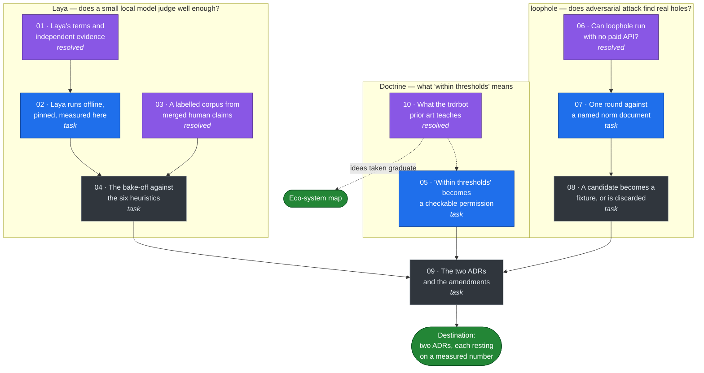

# Map — Laya, loophole and the trdrbot prior art, measured then decided

Label: `wayfinder:map`. Charted 2026-09-21.

Subordinate to [the eco-system map](../ecosystem/map.md). That map stays the one route to the
north star. This map answers one question that arrived beside it. Its output graduates as tickets
on the eco-system map, or lands in that map's Out of scope. It never becomes a second route.

## Destination

One ADR per tool. Each ADR rests on a number this map measured, not on a vendor claim. Each says
whether the tool enters the estate, and on what terms.

A third input joined on 2026-09-21: the trdrbot prior art. It gets no ADR, because it is not a
tool this estate would run. It gets a take-or-leave verdict per idea, and each idea taken
graduates as a ticket on the eco-system map.

This map measures and decides. It does not adopt anything into production.

## Notes

### What the tools are

- **Laya** is a 421M decision model on a ModernBERT-large backbone, Apache 2.0, with an ONNX
  runtime and a PyPI package. It runs on CPU and needs no API token.
- **loophole** is an adversarial agent loop. It attacks a norm stated in prose. It finds scenarios
  that are legal but immoral, and scenarios that are illegal but moral. It carries **no licence**,
  and it was last pushed on 2026-06-03.
- **trdrbot** is a live options-trading agent, MIT licensed, 296 commits. It is not a tool to run.
  It is prior art: a working implementation of scored forecasts, earned permission tiers and
  luck-versus-skill attribution. See ticket 10. It does have a Monte Carlo block bootstrap,
  `agent/src/trdrbot/experiments.py:213`. An earlier line here said it had none, taken from a
  fetched page summary rather than the source, and that was wrong.

### Facts measured on 2026-09-21, before charting

- The six twin skills hold 42 labelled items in total. The largest corpus is 23 items.
  `signal-classify` holds 23, `ethics-gate` 5, `evolution-judge` 4, `causal-claims` 4,
  `gameplay-lens` 3, `substrate-generator` 3.
- **The merged human claims give one labelled item, not a corpus.** Confirmed by ticket 03
  against `origin/main` on all three adopters. `classify-and-judge` has never produced a merged
  pull request. The estate holds exactly one claim file, written by eco-system ticket 51.
- **A bound row in `twin/signals.yaml` labels none of the six skills.** The three adopters hold 13
  bound rows. A row binds a pinned version to a scenario. A grep for `steep` across all three
  adopter repositories returns nothing, so no row can supply a `signal-classify` label.
- **The three adopters hold 9 edges and not one carries a `causal:` block.** So `causal-claims`
  gets zero items from the estate, not a small number.
- **A per-skill corpus needs 326 items, derived from ticket 04's own target.** That is the
  charitable whole-set route. The per-bin route over 10 calibration bins gives 3,260. Laya's own
  published recipe uses 300 per question schema, which is the same order by an independent route.
- **Five of the six skill thresholds are unfalsifiable on their own corpora.** By the rule of
  three, a perfect score on 3 items is consistent with a true accuracy of zero. Only
  `signal-classify`, at 23 items, bounds its own 0.8 threshold. Measured by ticket 03.
- **The first label the world writes arrives on 2027-08-28**, which is 341 days after today. The
  three adopters hold 18 scenarios, and that is the earliest horizon among them.
- `twin/skills.py` `evaluate()` takes a bare callable and a corpus. A second model needs no
  harness change.
- `twin/skill-scores.jsonl` already records a `model_version` field. Every row today reads
  `heuristic-0.1.0`.
- Laya scores 0.362 on zero-shot typed decisions. Its own model card calls it "a fast base to
  specialise, not a zero-shot decision engine". Confirmed exactly by ticket 01.
- **No independent evaluation of Laya exists.** Ticket 01 checked all three candidate benchmarks.
  Every quality number this estate holds is Convai measuring Convai.
- **The headline comparison is disavowed in advance by the benchmark's own author.** The dataset
  `LocalLLaMA/typed-decisions` is not Convai's. Its card warns in writing that a specialist fitted
  on the train split must not be placed beside a generalist, and that a score much above 0.75
  means the model learned the teacher's quirks rather than the task. Laya's 0.766 against Jev's
  0.727 does both, and presents it as a merit.
- **The documented fine-tune recipe uses 6,000 labelled decisions over 1,200 cases**, which is 300
  items for each of 20 question schemas. This estate holds 42 labelled items in total.
- **Training data provenance: nothing published.** No corpus, size, method or licence. Convai's own
  raw file admits AG News and boolq were in the training mix.
- **The shipped typed-decisions checkpoint has a calibration defect.** Its `temperature_by_options`
  map is byte-identical to the base checkpoint's, verified at revision `1c5edc17`, and
  `rl_agent_api.py` reads that map first. The refitted per-type temperatures are dead code.
  Anyone wiring the checkpoint in inherits temperatures fitted for a different model.
- The weights repository carries **no LICENSE file**. The Apache 2.0 grant rests on the model
  card's YAML tag and a footer line. The inference code on GitHub does carry a full Apache LICENSE.
- The weights repository is **three days old**, created 2026-09-18, and `main` moved ten times in
  two days.
- The twin has **no** luck-versus-skill separation. A grep for luck, spurious and "right for the
  wrong reason" across `twin/*.py` and `twin/README.md` returns nothing.
- `twin/skill-thresholds.yaml` states **no** minimum corpus size. `twin/skills.py` refuses only an
  empty corpus, so a one-item corpus passes today.
- The twin is **ahead** of the trdrbot prior art on baselines. It already compares against
  `contemporaneous-consensus`, `twin/forecast_book.py:71`, and names the coin flip,
  `twin/README.md:998`. An earlier suspicion that the twin stated no baseline was wrong, and is
  recorded here because it was checked before it was asserted.
- Laya's calibration error of 0.466 falling to 0.081 is a mean over 49 suites, 42 of them
  multilingual. **For typed decisions alone the same file records 0.207 falling to 0.129.** A refit
  on twin-like decisions should expect about 0.13, not 0.081. Corrected by ticket 01.
- The 32.8 ms latency belongs to the **multilingual** checkpoint. The 421M English checkpoint is
  **39.5 ms**, p95 44.8. Corrected by ticket 01.

### The owner's answers, 2026-09-21, binding

1. **Destination is (b): measure, then decide.** Owner-instructed. The map builds the measurement.
   It does not build the adoption.
2. **A model may judge on a GitHub clock, within thresholds.** Owner-instructed. This amends
   ticket 75 Q10 and ADR-0024. The condition is the versioned threshold in
   `twin/skill-thresholds.yaml`. Ticket 05 turns the condition into a check.
3. **loophole runs inside the Claude Code harness, so it is free.** Owner-instructed. No paid
   Anthropic API spend. Ticket 06 finds the mechanism.

### Calls recorded as the assistant's, under ADR-0025

1. `twin/pert.py` stays the only propagation engine. Laya is a classifier and does no Monte Carlo
   sampling. The user's premise that Laya could do Monte Carlo in CI is wrong.
2. Neither tool ever becomes a gate check. Both produce non-deterministic output, and a
   non-deterministic instrument cannot grade the truth surface. Both land as generators behind a
   reviewed PR.
3. Laya enters through `twin/skills.py` as a callable with `model_version: laya-<v>`. No new
   harness, and no change to `evaluate()`.
4. This is a separate map, not fog on the eco-system map. Its destination is a decision, and the
   eco-system map's destination is the NORTH-STAR §4 joints. Mixing them hides the route.
5. **loophole may be run locally for evaluation, and never vendored.** Added 2026-09-21 after
   ticket 06. Running a clone on the owner's machine is not distribution. Committing its source,
   its prompts or a close reimplementation into the estate is distribution, and no licence permits
   it. The clone stays in the scratchpad, outside the project tree. This narrows ticket 09 before
   any measurement: the only adoption available is an external tool a human runs.
   The residual risk is stated, not hidden. GitHub's terms grant viewing and forking within
   GitHub, and a local clone sits outside that grant. The call is to evaluate and never
   distribute, because evaluation is the whole purpose of this map.
8. **A permission the caller may decline to consult is not a permission.** Added 2026-09-21 after
   ticket 10. This is now ticket 05 item 6. It came from a working system's own measured failure
   rather than from reasoning, which is the whole return on reading prior art.
7. **Ticket 04 is now the evidence, not a confirmation of it.** Added 2026-09-21 after ticket 01.
   No independent measurement of Laya exists, so the bake-off would be the first. That raises its
   value and lowers the weight of every vendor number in ticket 09's ADR to zero.
9. **A merged claim is not a human label. Authorship is the test, not merging.** Added
   2026-09-21 after ticket 03. `twin/schema.py` demands `claimed_by` against `twin/roles.yaml` for
   an `override` and for no other claim kind. So an override at grade 4 is a human's attributable
   judgement, and a `binding` or `position` at grade 5 is the heuristic's own output that somebody
   reviewed. Grading the candidate model against the second group measures agreement with the
   incumbent heuristic, not accuracy. Ticket 03's builder counts that group and excludes it. The
   count is zero today, so the exclusion changes no number yet. It becomes the whole answer the
   first time `classify-and-judge` runs.

6. **A tool that cannot report its own failure is not measured, it is trusted.** Added 2026-09-21.
   loophole's `_parse_scenarios` returns an empty list on malformed output, and the caller prints
   that the code appears robust. Ticket 07 must tell zero candidates apart from a failed parse.
   This is the estate's own defect class, eco-system ticket 98, found in somebody else's code.

### The sentence this map changes

`CONTEXT.md` defines the twin this way today: "A subscribed feed version becomes a sensed signal by
lookup, with no judgement; anything needing judgement is a skill a human runs."

The owner's second answer amends that sentence. Ticket 09 rewrites it. No ticket may assume the new
wording before ticket 09 lands.

### Standing rules

- Derive what you assert. A vendor number is not a measurement. A loophole candidate is a
  hypothesis, never a finding.
- Skills to consult: `/mattpocock-skills:grilling` and `domain-modeling` for grilling tickets,
  `/mattpocock-skills:research` for research tickets. Read `CONTEXT.md` and `docs/adr/` first.
- Process rules inherit from the eco-system map. The assistant decides architecture and records
  each decision with its reason. Only purpose, dates, identities, money, authorisations and
  anything naming a real person go to the owner.

## The route

Blue is the frontier. Purple is resolved. Grey waits on a blocker. Redrawn 2026-09-21 after tickets 01, 03, 06 and 10.

## Decisions so far

<!-- one line per closed ticket -->

- [10 — What the trdrbot prior art teaches](issues/10-what-the-trdrbot-prior-art-teaches.md):
  Three ideas taken, four left. **Taken:** luck-versus-skill attribution, graduated as eco-system
  ticket 111; a derived minimum corpus size, graduated as eco-system ticket 112; automatic
  pre-registration, folded into 111. **Left:** the size ladder, the scoring rule, refuse-what-you-
  cannot-price, and the defect ledger, each for a stated reason. The ladder's **failure** is taken
  instead and is now ticket 05 item 6: its own open defect I-68 records the whole sizing apparatus
  as consulted in 2 of 89 decide cycles, because "the refusals that matter happen upstream in
  prose". The "~50 forecasts" bar is chosen, not derived, and importing it would put all six
  skills below the bar at once.

- [01 — Laya's terms and independent evidence](issues/01-laya-s-terms-and-independent-evidence.md):
  Apache 2.0, but the weights repository ships no LICENSE file and the grant rests on a card tag.
  **No independent evaluation of Laya exists anywhere.** The headline 0.766 against Jev's 0.727 is
  a specialist fitted on the train split placed beside a cold generalist, which the benchmark
  author's own card forbids in writing. The fine-tune recipe uses 6,000 labelled decisions against
  this estate's 42. Training data provenance is unpublished. The shipped typed-decisions checkpoint
  ships the base checkpoint's temperature map, so its refitted temperatures are dead code. Two
  numbers this map held were misattributed and are corrected above. 14 claims have no primary
  source.

- [06 — Can loophole run with no paid API?](issues/06-can-loophole-run-with-no-paid-api.md):
  Yes, through a custom provider that shells out to `claude -p`. The seam is `create_provider()`
  at `loophole/llm.py:119`, and per-role provider substitution is already wired, so no fork is
  needed. One round costs 14 model calls, each a long stateless call, which is the shape
  `claude -p` serves well. **loophole carries no licence at all**, verified four ways, so it is
  all rights reserved. Ollama is rejected: a model too weak to hold the XML format makes
  `_parse_scenarios` return an empty list, and the caller then prints that the code appears
  robust. That is a false green.

- [03 — A labelled corpus from merged human claims](issues/03-a-labelled-corpus-from-merged-human-claims.md):
  **Not measurable on this corpus**, which the ticket named as the expected answer. The builder is
  `.scratch/laya-loophole/corpus/build_corpus.py` and it reads `origin/main`, because every clone
  was stale. It returns **one** item, for `evolution-judge`, citing driftwood pull request 34.
  Every other skill gets zero. `classify-and-judge` has never produced a merged pull request; a
  bound `signals.yaml` row carries a scenario and no STEEP tag; no adopter edge carries a causal
  block. A temperature fit needs **326 items per skill**, derived from ticket 04's own 0.048 gap,
  or 3,260 per bin, against Laya's published 300 per schema. The estate is 326 times short. Four
  sources of more labels were checked and none reaches the number; the local clock structurally
  cannot write one, because it refuses an override. Side finding: **five of six skill thresholds
  cannot be cleared at 95% confidence even by a perfect score**, which is a measured number for
  eco-system ticket 112.

## Not yet specified

- Whether any of the six heuristics is actually replaced. Waits on ticket 04's number.
- Whether this estate pays for a corpus that could support a specialised fit. Ticket 03 priced the
  only route with real supply at roughly 57 backtest organisations for one skill, against the four
  it has. That is a large build, and it is only worth charting if ticket 04's zero-shot number is
  good enough to make a specialised number interesting. Waits on ticket 04.
- Whether the `derive-probability` skill, eco-system ticket 93, could take a Laya input. Waits on
  ticket 04.
- Named firms and named executives in loophole output. Waits on eco-system ticket 82.
- Whether this estate may credit the trdrbot author in public. A named-individual question for
  eco-system ticket 82.
- Whether a Convai corporate record exists. Ticket 01 found an organisation, a site, a named
  founder and two real arXiv papers, but no corporate record, and no paper describing Laya by
  anyone. A question about a real firm goes to the owner.
- Whether to ask loophole's author for a licence. That contacts a third party, so it is the
  owner's call, not the assistant's. It is not needed to reach this map's destination.

## Out of scope

- Laya as a propagation engine. `twin/pert.py` stays. See call 1.
- Either tool as a gate check. See call 2.
- loophole against Kyverno CEL. loophole attacks prose. A CEL expression is checked by
  compose-check and the adopter gate, which are deterministic and already exist.
- Production adoption of either tool inside this map. The destination is a decision.
- Laya's multilingual checkpoint. The estate publishes in English.
- Paid Anthropic API spend for loophole. The owner ruled on 2026-09-21.
- Vendoring loophole, forking it into the estate, or reimplementing its prompts. No licence
  permits any of the three. See call 5.
- Trading, options pricing, and any financial instrument. The trdrbot prior art is read for its
  attribution and permission machinery only. This estate prices cages, never positions.
