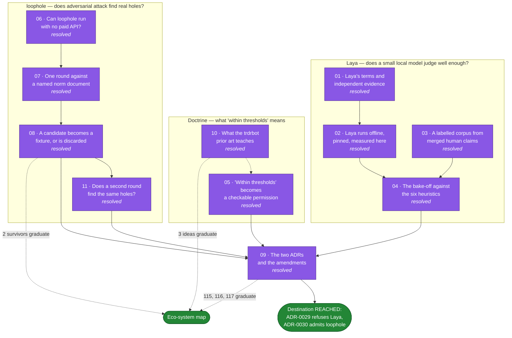

# Map — Laya, loophole and the trdrbot prior art, measured then decided

Label: `wayfinder:map`. Charted 2026-09-21. **Closed 2026-09-22: every ticket is resolved and the
destination is reached.** Laya is refused by
[ADR-0029](../../docs/adr/0029-a-candidate-model-enters-on-a-measured-permission-and-laya-does-not-hold-one.md);
loophole enters as an external tool run in rounds by
[ADR-0030](../../docs/adr/0030-loophole-runs-as-an-external-tool-in-rounds-and-the-estate-keeps-the-pointer.md).
Seven tickets graduated to the eco-system map: 111, 112, 113, 114, 115, 116 and 117.

Subordinate to [the eco-system map](../ecosystem/map.md). That map stays the one route to the
north star. This map answers one question that arrived beside it. Its output graduates as tickets
on the eco-system map, or lands in that map's Out of scope. It never becomes a second route.

## Destination

One ADR per tool. Each ADR rests on a number this map measured, not on a vendor claim. Each says
whether the tool enters the estate, and on what terms.

A third input joined on 2026-09-21: the trdrbot prior art. It gets no ADR, because it is not a
tool this estate would run. It gets a take-or-leave verdict per idea, and each idea taken
graduates as a ticket on the eco-system map.

This map measures and decides. It does not adopt anything into production.

## Notes

### What the tools are

- **Laya** is a 421M decision model on a ModernBERT-large backbone, Apache 2.0, with an ONNX
  runtime and a PyPI package. It runs on CPU and needs no API token.
- **loophole** is an adversarial agent loop. It attacks a norm stated in prose. It finds scenarios
  that are legal but immoral, and scenarios that are illegal but moral. It carries **no licence**,
  and it was last pushed on 2026-06-03.
- **trdrbot** is a live options-trading agent, MIT licensed, 296 commits. It is not a tool to run.
  It is prior art: a working implementation of scored forecasts, earned permission tiers and
  luck-versus-skill attribution. See ticket 10. It does have a Monte Carlo block bootstrap,
  `agent/src/trdrbot/experiments.py:213`. An earlier line here said it had none, taken from a
  fetched page summary rather than the source, and that was wrong.

### Facts measured on 2026-09-21, before charting

- The six twin skills hold 42 labelled items in total. The largest corpus is 23 items.
  `signal-classify` holds 23, `ethics-gate` 5, `evolution-judge` 4, `causal-claims` 4,
  `gameplay-lens` 3, `substrate-generator` 3.
- **The merged human claims give one labelled item, not a corpus.** Confirmed by ticket 03
  against `origin/main` on all three adopters. `classify-and-judge` has never produced a merged
  pull request. The estate holds exactly one claim file, written by eco-system ticket 51.
- **A bound row in `twin/signals.yaml` labels none of the six skills.** The three adopters hold 13
  bound rows. A row binds a pinned version to a scenario. A grep for `steep` across all three
  adopter repositories returns nothing, so no row can supply a `signal-classify` label.
- **The three adopters hold 9 edges and not one carries a `causal:` block.** So `causal-claims`
  gets zero items from the estate, not a small number.
- **A per-skill corpus needs 326 items, derived from ticket 04's own target.** That is the
  charitable whole-set route. The per-bin route over 10 calibration bins gives 3,260. Laya's own
  published recipe uses 300 per question schema, which is the same order by an independent route.
- **Five of the six skill thresholds are unfalsifiable on their own corpora.** By the rule of
  three, a perfect score on 3 items is consistent with a true accuracy of zero. Only
  `signal-classify`, at 23 items, bounds its own 0.8 threshold. Measured by ticket 03.
- **The first label the world writes arrives on 2027-08-28**, which is 341 days after today. The
  three adopters hold 18 scenarios, and that is the earliest horizon among them.
- `twin/skills.py` `evaluate()` takes a bare callable and a corpus. A second model needs no
  harness change.
- `twin/skill-scores.jsonl` already records a `model_version` field. Every row today reads
  `heuristic-0.1.0`.
- Laya scores 0.362 on zero-shot typed decisions. Its own model card calls it "a fast base to
  specialise, not a zero-shot decision engine". Confirmed exactly by ticket 01.
- **No independent evaluation of Laya exists.** Ticket 01 checked all three candidate benchmarks.
  Every quality number this estate holds is Convai measuring Convai.
- **The headline comparison is disavowed in advance by the benchmark's own author.** The dataset
  `LocalLLaMA/typed-decisions` is not Convai's. Its card warns in writing that a specialist fitted
  on the train split must not be placed beside a generalist, and that a score much above 0.75
  means the model learned the teacher's quirks rather than the task. Laya's 0.766 against Jev's
  0.727 does both, and presents it as a merit.
- **The documented fine-tune recipe uses 6,000 labelled decisions over 1,200 cases**, which is 300
  items for each of 20 question schemas. This estate holds 42 labelled items in total.
- **Training data provenance: nothing published.** No corpus, size, method or licence. Convai's own
  raw file admits AG News and boolq were in the training mix.
- **The shipped typed-decisions checkpoint has a calibration defect.** Its `temperature_by_options`
  map is byte-identical to the base checkpoint's, verified at revision `1c5edc17`, and
  `rl_agent_api.py` reads that map first. The refitted per-type temperatures are dead code.
  Anyone wiring the checkpoint in inherits temperatures fitted for a different model.
- The weights repository carries **no LICENSE file**. The Apache 2.0 grant rests on the model
  card's YAML tag and a footer line. The inference code on GitHub does carry a full Apache LICENSE.
- The weights repository is **three days old**, created 2026-09-18, and `main` moved ten times in
  two days.
- The twin has **no** luck-versus-skill separation. A grep for luck, spurious and "right for the
  wrong reason" across `twin/*.py` and `twin/README.md` returns nothing.
- `twin/skill-thresholds.yaml` states **no** minimum corpus size. `twin/skills.py` refuses only an
  empty corpus, so a one-item corpus passes today.
- The twin is **ahead** of the trdrbot prior art on baselines. It already compares against
  `contemporaneous-consensus`, `twin/forecast_book.py:71`, and names the coin flip,
  `twin/README.md:998`. An earlier suspicion that the twin stated no baseline was wrong, and is
  recorded here because it was checked before it was asserted.
- Laya's calibration error of 0.466 falling to 0.081 is a mean over 49 suites, 42 of them
  multilingual. **For typed decisions alone the same file records 0.207 falling to 0.129.** A refit
  on twin-like decisions should expect about 0.13, not 0.081. Corrected by ticket 01.
- The 32.8 ms latency belongs to the **multilingual** checkpoint. The 421M English checkpoint is
  **39.5 ms**, p95 44.8. Corrected by ticket 01. **That is a T4 GPU number, and this estate has no
  GPU.** Ticket 02 measured the English checkpoint on this CPU at **169.74 ms p50, 203.67 ms p99**
  for one question, 470.8 ms for five, at 4 threads over 120 timed passes. 169.7 ms is the number
  later tickets use. Corrected by ticket 02.
- **Convai's own published CPU artefact is three times slower than this hardware.**
  `research/results/cpu_51_language_sweep.json`, `part_b.by_model.english`, records 1392.5 ms per
  5-question case at `device: cpu`, `threads: 4`. The same shape here costs 470.8 ms. The card's
  unsourced "CPU latency 193-464 ms" is roughly right for an Apple-silicon laptop while the
  vendor's own measurement is three times worse than both. Measured by ticket 02.
- **The vendor's package cannot pin a revision.** `laya.Agent.__init__` (0.3.4,
  `laya/agent.py:122-128`) calls `snapshot_download` with no `revision`, so it can only fetch
  whatever `main` points at. Anyone who adopts Laya by following its README runs an unpinned model
  on a repository whose `main` moved ten times in two days. `Agent` does accept a local directory,
  so the pin has to be done outside it. Found by ticket 02.
- **`act_probability` read exactly 1.000000 on all 16 calls ticket 02 made**, across 8 states
  including an empty string and a destructive instruction. The head that says "escalate" said the
  same thing every time. n is 16, so this is a hypothesis for ticket 04, not a finding. It is
  enough to stop ticket 05 reaching for the head as an escalate signal.
- **One loophole round against ADR-0022 costs 8 model calls here, 185.8 s and 0.4150 USD at list
  price**, which the subscription absorbs. The published loop costs 14. The 6 extra calls are the
  Legislator rewriting the norm document, and this estate does not make them. Measured by ticket 07.
- **It produced 6 candidates, 3 loophole and 3 overreach, with 0 parse failures.** The zero is
  falsifiable: a negative control fires on a truncated tag and on wrong inner tags. Measured by
  ticket 07.
- **The `<scenario>` tag counter alone cannot catch a total format collapse.** A model that
  abandons the format opens no tag, so the parse-failure count reads 0 and the candidate count
  reads 0. A second counter, under-production, catches it. A clean run needs both at zero. Found by
  ticket 07.
- **`claude -p --bare` breaks the run silently.** It never reads OAuth, so with no
  `ANTHROPIC_API_KEY` the call fails with exit code 0, `subtype: "success"`, `is_error: true` and
  `result: "Not logged in · Please run /login"`. The obvious adapter returns that sentence, the
  parser finds no tags, and loophole prints that the legal code appears robust. Ticket 06 named
  `--bare` in the invocation. Found and guarded by ticket 07.
- **The estate may keep loophole's output, never its input.** Every system prompt and user
  message in a run is loophole's own prompt text verbatim, and loophole carries no licence. The
  committed log holds the responses and a sha256 of each prompt. A check confirms that no sentence
  of 8 words or more from `loophole/prompts.py` reaches the tree. Found by ticket 07, and ticket
  09's ADR inherits it.
- **loophole's judge carries the same silent-failure defect in a second place.**
  `agents/judge.py:62-63` reads a missing `<verdict>` tag as the literal verdict "unresolvable".
  Found by ticket 07. The tag was present on all 6 judge calls.
- **Two of ticket 07's six candidates survived a deterministic check: a survival rate of 2/6.**
  Both needed their stated mechanism thrown away and rebuilt from measurement. Three of the four
  discards are false against the code, not merely unproven. Measured by ticket 08.
- **`infra` is read by no served `cage-tier` body**, with comments stripped: not the hub's v4.0.0
  or v5.0.0, not `graded/`, not any adopter's composed copy. A pod claiming a policy version in
  the platform's three `infra` Namespaces renders `baseline`, the LOOSEST rung, under the body all
  three adopters serve, because those Namespaces carry no `governed` label by design. An unclaimed
  pod is skipped with the declaration and without it, so pulling the declaration changes nothing
  for CoreDNS, which is the hazard `verify-infra-declaration.sh` says its proof 3 is the tripwire
  for. Measured by ticket 08 under kyverno 1.18.2, the pinned version.
- **A party can make the hub's tier-binding walk stop observing it, at exit 0.** Two governed
  Namespace documents make `tier_binding.check()` return 3, and
  `verify/tier-binding/tier_binding_estate.py` prints the SKIP, continues, and returns
  `1 if failed else 0`. `talk/verify-all.sh` grades by exit code alone, so the gate reads PASS.
  The adopter's own `shift-left.yml` does turn that 3 into a failed pull request, so the hole is
  in the hub's observation, not in the cage. Measured by ticket 08.
- **kyverno 1.19.1 cannot compile the served `cage-tier` body** (`expected type 'string' but found
  'dyn'`). The release workflows pin 1.18.2; `graded/verify-graded.sh` calls a bare `kyverno` and
  asserts no version. It fails loudly rather than quietly. Found by ticket 08.
- **`.scratch/ecosystem/issues/` holds two tickets numbered 111**, and `twin/misuse.py`
  `ecosystem_ticket_status()` takes `sorted(glob(...))[0]`, so a `waits_on` row reads whichever
  sorts first, silently. Found by ticket 08; unfixed.
- **loophole numbers both finders' cases identically in every round.** Both run before any case is
  appended to `state.cases`, so a round holds two cases numbered 1, two numbered 2 and two numbered
  3. The case log, the HTML report and the judge's prior-case text all address cases by that
  number. Found by ticket 07.

- **Three rounds against the same document at the same pin overlap by 1 to 3 candidates of 6.**
  Measured by ticket 11, which ran a second and a third round. By reason the pairwise overlap is
  2, 1 and 3 of 6; by clause it is 2, 2 and 3. All three rounds share exactly one reason and two
  clauses. No two of the 18 candidates share a run of 8 consecutive words, across all 153 pairs,
  so a word test reports zero.
- **The tool repeats its target and never its mechanism.** The `infra` declaration is attacked in
  every round, by four candidates, and no two give the same reason. The place repeats, the
  mechanism never does. That is map call 12 measured rather than asserted. Measured by ticket 11.
- **One round reads about 23% of what the tool has to say about a document.** Three rounds gave 13
  distinct reasons from 18 candidates; Chao1 on the frequencies estimates the population at 26.5.
  That is a lower bound from three samples of six, with a wide interval, and the population is the
  tool's output rather than the document's real defect set. Derived by ticket 11.
- **The overlap number is itself a draw.** An independent reader, asked the same question three
  times with the candidates anonymised and shuffled, named no pair in all three repeats for rounds
  one and two. Its mean unanimous overlap is 1 of 6 against the assistant's 2 of 6. The overlap
  depends on the resolution the reader chooses, and the tool supplies no resolution. Measured by
  ticket 11.
- **loophole's judge called 17 of 18 candidates resolvable across three rounds.** Ticket 08 then
  found 3 of round one's 5 resolvable candidates false against the code, and the single
  unresolvable one false too. The verdict is near-constant, so it is not a filter. This is the same
  shape ticket 02 measured in Laya, where `act_probability` read 1.000000 on all 16 calls. Measured
  by ticket 11.
- **A round costs 8 calls, about 180 s and about 0.41 USD at list price, stable to 3%.** Ticket 07
  0.4150, ticket 11 round two 0.4069 and round three 0.4197. Three rounds cost 1.2416 USD, absorbed
  by the subscription. Measured by ticket 11.
- **No loophole prompt text reaches the tree, and a reusable check now proves it.**
  `.scratch/laya-loophole/bench/check_no_prompt_leak.py` finds 1,287 distinct 8-word runs in
  `loophole/prompts.py`, fires on all 1,287 against the source as a negative control, and finds 0
  in all six committed files across the three rounds. Built by ticket 11.

- **Five of the seven skill thresholds sit at or below the best constant answer their own corpus
  admits.** Ticket 04 found this for `signal-classify` (0.80 against 0.913). Ticket 05 derived the
  baseline for all seven and extended it: `evolution-judge` 0.75 against 0.750, `causal-claims`
  0.80 against 1.000, `substrate-generator` 0.80 against 1.000, `ethics-gate` 0.80 against 0.800.
  Only `causal-claims-grade-accuracy` (0.80 against 0.750) and `gameplay-lens` (0.65 against
  0.333) clear their own corpus. Measured by ticket 05.
- **`substrate-generator`'s corpus does not grade channel content at all.** Its scorer checks that
  a channel is non-empty and never what is in it, so a model that always emits the same events
  channel scores 1.000 while everything else is granted. Found by ticket 05.
- **The frozen-field baseline reproduces ticket 04's two hand-measured numbers by an independent
  route.** `twin/model_permission.frozen_field_baseline()` perturbs each leaf of the answer to
  find which fields the scorer reads, then freezes one at a candidate and grants the rest. It
  gives `signal-classify` 0.913 on `steep` and `causal-claims` 1.000 on `edge.elasticity.mode`,
  with no skill named in it. The gate asserts the agreement on every run. Measured by ticket 05.
- **The estate's own incumbent holds no permission either.** The first run of ticket 05's nine
  conditions granted `heuristic-0.1.0` five of seven metrics. It is graded on the corpus it was
  fitted on, which `twin/evolution_judge.py`'s own `CORPUS_KIND` already calls
  `harness-mechanism`. A tenth condition refuses it. **0 of 14 (metric, model version) pairs hold
  a permission on 2026-09-21.** Measured by ticket 05.
- **The seam the permission binds at already existed.** `talk/local-clock.sh` copies the twin
  package and the skill to a judge tree before the child model starts and runs the claim
  validator over every committed claim file; a refusal fails the step and the branch is never
  pushed. Ticket 05 put the permission inside that validator and made the clock **derived** from
  `GITHUB_ACTIONS`, `GITHUB_RUN_ID` and `GITHUB_WORKFLOW` rather than read off the file. Built by
  ticket 05.
- **There were two paths to a model-made artefact, not one.** The clock's steps table names
  `validate_claim.py` for the `classify` row and `validate_forecast.py` for the `derive` row.
  Ticket 05 found the second by breaking it: the flag reached a validator that did not accept
  it, and `verify-derived-forecast.sh` went red on the gate. Both now take it, and the check
  asserts that every validator the table names does, so a third skill cannot skip the seam.
  Found and closed by ticket 05.

- **transformers 4.x loads this checkpoint and silently gives different numbers.**
  `encoder/config.json` at the pin declares `transformers_version: 5.0.0` and carries
  `rope_parameters` and `layer_types`, which 4.x `ModernBertConfig` does not read. `laya` 0.3.4
  declares only `transformers>=4.45.0`, so its own metadata permits the wrong build. Found by
  ticket 02.

- **Laya loses five of six metrics to the heuristics, ties the sixth, and beats a constant answer
  on one.** Measured by ticket 04, the first independent evaluation of this model on anything.
  `signal-classify` 0.870, `evolution-judge` 0.500, `causal-claims` 0.000,
  `causal-claims-grade-accuracy` 1.000, `gameplay-lens` 0.333, `ethics-gate` 0.200, against 1.000
  for the heuristic on every one. All six corpus digests match the digests `heuristic-0.1.0` was
  scored on.
- **Five of the six Laya scores are at or below the best constant answer their own corpus admits.**
  The one exception, `causal-claims-grade-accuracy` at 1.000 against a 0.750 constant, bounds at
  0.473 on 4 items against a 0.800 threshold. So no metric is measurable in Laya's favour.
  Measured by ticket 04.
- **`signal-classify`'s threshold is 0.80 and its own majority-class baseline is 0.913.** The
  corpus is 21 economic items and 2 political ones. Laya caught 0 of the 2 political items, scored
  0.870, and the log records `"passed": true`. The threshold cannot detect a classifier that has
  learned nothing. Measured by ticket 04.
- **`causal-claims`' elasticity leg cannot fail on its own corpus.** `twin/causal_claims.py`
  `_BASE_MODE` is 0.375, which is exactly the mean of that corpus's four elasticity labels, and the
  tolerance is 0.15. The heuristic's 1.000 on that metric is the fit, not the judgement. Laya's
  0.000 is one leg too: sign is 3 of 4 and lag is 3 of 4, and elasticity 0 of 4 sinks every item.
  Measured by ticket 04.
- **`act_probability` read exactly 1.000000 on all 279 calls across three runs.** Ticket 02's
  hypothesis at n=16 is now a finding at n=279 on the estate's own corpora. Ticket 05 may not use
  it as the escalate signal. Measured by ticket 04.
- **Two more near-constant heads, in the same run.** Laya answered "admit" on all five
  `ethics-gate` sensors at 0.630 to 0.674, and "product" on all four `evolution-judge`
  organisations at 0.338 to 0.426. Map call 14 measured three more times. Measured by ticket 04.
- **The pooled raw calibration error is 0.1338 over 85 questions.** Item 8 of ticket 04 predicted
  about 0.13 from ticket 01's correction. It is raw and uncalibrated on a different question
  distribution from the vendor's, so the agreement is suggestive, not like-for-like. 0.081 stays
  the wrong number. Measured by ticket 04.
- **`substrate-generator` is not measurable against Laya at all.** That skill must generate a
  multi-channel message schedule, and Laya emits `output_tokens: 0` on every call. No row was
  written, because a 0.000 would read as a quality measurement. Recorded by ticket 04.
- **Laya's continuous head carries signal where its band classifier does not.** On
  `evolution-judge` the declared primary route scores 0.500 and the declared sensitivity route,
  the bare `noul`, scores 4 of 4 with the rank order of all four organisations correct. Both routes
  were fixed in code before the run. Only the primary is recorded. On 4 items the two cannot be
  told apart at 95%. Measured by ticket 04.
- **The bake-off needed no change to `twin/skills.py`, as map call 3 predicted.** 39 model calls,
  three scripts outside `twin/`, and a replay closure `evaluate()` cannot tell from the heuristic.
  The predictions digest is identical across three processes at two thread counts. Measured by
  ticket 04.
- **`verify/twin-evals/verify-twin-evals.sh` grades the incumbent against the last recorded row of
  any model version.** Recording Laya changed what the heuristic is graded against on the next run.
  It is harmless only while the incumbent scores 1.000. Found by ticket 04; unfixed.

### The owner's answers, 2026-09-21, binding

1. **Destination is (b): measure, then decide.** Owner-instructed. The map builds the measurement.
   It does not build the adoption.
2. **A model may judge on a GitHub clock, within thresholds.** Owner-instructed. This amends
   ticket 75 Q10 and ADR-0024. The condition is the versioned threshold in
   `twin/skill-thresholds.yaml`. Ticket 05 turns the condition into a check.
3. **loophole runs inside the Claude Code harness, so it is free.** Owner-instructed. No paid
   Anthropic API spend. Ticket 06 finds the mechanism.

### Calls recorded as the assistant's, under ADR-0025

1. `twin/pert.py` stays the only propagation engine. Laya is a classifier and does no Monte Carlo
   sampling. The user's premise that Laya could do Monte Carlo in CI is wrong.
2. Neither tool ever becomes a gate check. Both produce non-deterministic output, and a
   non-deterministic instrument cannot grade the truth surface. Both land as generators behind a
   reviewed PR.
3. Laya enters through `twin/skills.py` as a callable with `model_version: laya-<v>`. No new
   harness, and no change to `evaluate()`.
4. This is a separate map, not fog on the eco-system map. Its destination is a decision, and the
   eco-system map's destination is the NORTH-STAR §4 joints. Mixing them hides the route.
5. **loophole may be run locally for evaluation, and never vendored.** Added 2026-09-21 after
   ticket 06. Running a clone on the owner's machine is not distribution. Committing its source,
   its prompts or a close reimplementation into the estate is distribution, and no licence permits
   it. The clone stays in the scratchpad, outside the project tree. This narrows ticket 09 before
   any measurement: the only adoption available is an external tool a human runs.
   The residual risk is stated, not hidden. GitHub's terms grant viewing and forking within
   GitHub, and a local clone sits outside that grant. The call is to evaluate and never
   distribute, because evaluation is the whole purpose of this map.
8. **A permission the caller may decline to consult is not a permission.** Added 2026-09-21 after
   ticket 10. This is now ticket 05 item 6. It came from a working system's own measured failure
   rather than from reasoning, which is the whole return on reading prior art.
7. **Ticket 04 is now the evidence, not a confirmation of it.** Added 2026-09-21 after ticket 01.
   No independent measurement of Laya exists, so the bake-off would be the first. That raises its
   value and lowers the weight of every vendor number in ticket 09's ADR to zero.
9. **A merged claim is not a human label. Authorship is the test, not merging.** Added
   2026-09-21 after ticket 03. `twin/schema.py` demands `claimed_by` against `twin/roles.yaml` for
   an `override` and for no other claim kind. So an override at grade 4 is a human's attributable
   judgement, and a `binding` or `position` at grade 5 is the heuristic's own output that somebody
   reviewed. Grading the candidate model against the second group measures agreement with the
   incumbent heuristic, not accuracy. Ticket 03's builder counts that group and excludes it. The
   count is zero today, so the exclusion changes no number yet. It becomes the whole answer the
   first time `classify-and-judge` runs.

6. **A tool that cannot report its own failure is not measured, it is trusted.** Added 2026-09-21.
   loophole's `_parse_scenarios` returns an empty list on malformed output, and the caller prints
   that the code appears robust. Ticket 07 must tell zero candidates apart from a failed parse.
   This is the estate's own defect class, eco-system ticket 98, found in somebody else's code.

10. **The pin is taken outside the vendor's package, and any adoption inherits that.** Added
    2026-09-21 after ticket 02. `laya.Agent` passes no `revision` to `snapshot_download`, so the
    documented entry point cannot pin. Every path this estate takes into Laya resolves the digest
    itself and hands `Agent` a local directory. Ticket 09's ADR states this as a condition of
    entry, not as a footnote, because a reader who follows Convai's README gets an unpinned model
    and no error.

11. **The Legislator never runs, so no model rewrites a norm document.** Added 2026-09-21 after
    ticket 07. loophole's published loop drafts the legal code and then revises it after every
    resolved case, so cases 2 to 6 are judged against text a model wrote. This estate supplies its
    real ADR and holds it fixed for the whole round. Two reasons: the target stays the estate's own
    document, and the six verdicts stay comparable. It also costs 6 fewer calls. Ticket 09's ADR
    states this as the shape of adoption, not as a tuning choice.

12. **A survivor is what the check found, not what the model wrote.** Added 2026-09-21 after
    ticket 08. Both survivors kept the place the candidate pointed at and lost the mechanism it
    named. Neither would have graded as real if ticket 08 had asked "is this scenario true as
    written", and neither would have been found if the pointer had been thrown away for being
    wrong. So the rule for ticket 11 and for any later round: test the place, never the sentence,
    and count the survival rate on the candidates as stated so the tool is not flattered by the
    measurement's own work.

13. **The tool is a pointer generator, and a round is a sample, so adoption is stated in rounds.**
    Added 2026-09-21 after ticket 11. Three rounds against one document overlap by 1 to 3 of 6,
    the `infra` declaration is attacked in every round by a different mechanism each time, and one
    round reads about 23% of the tool's population. So the unit of adoption is not "run loophole",
    it is "run N rounds and read the places that recur". Ticket 09's ADR states the number of
    rounds and states that the human keeps the pointer and throws the sentence away.

14. **A near-constant head is not a signal, in anyone's tool or in this estate's.** Added
    2026-09-21 after ticket 11. loophole's judge called 17 of 18 candidates resolvable, and ticket
    08 showed the verdict does not separate real from unreal. Laya's `act_probability` read
    1.000000 on all 16 calls ticket 02 made. Two unrelated tools, one defect. Ticket 09's ADR
    refuses both heads as filters, and ticket 05 takes the rule: a permission that always says yes
    is not a permission, which is the same sentence as call 8 from the other side.

15. **A threshold below its own corpus's majority-class baseline is not a threshold.** Added
    2026-09-21 after ticket 04. `signal-classify` grades at 0.80 on a corpus a constant answer
    scores 0.913 on. Every score this map reports from here carries the best constant answer its
    corpus admits beside it. Ticket 09's ADR states a corpus baseline as a condition of entry, and
    eco-system ticket 112 sizes a minimum corpus against the baseline rather than against zero.

16. **A model that cannot produce a skill's output shape is not measured at zero.** Added
    2026-09-21 after ticket 04. `substrate-generator` needs generated text and Laya emits none. No
    score row was written, because a 0.000 in the log reads as a quality measurement and is not
    one. "Not measurable" and "bad" are different answers and the record keeps them apart.

17. **The route is declared before the run, and the other route is reported anyway.** Added
    2026-09-21 after ticket 04. Laya can answer a continuous question two ways, and the two
    disagree: 0.500 against 4 of 4. Both were fixed in code before any result was seen. The
    declared route is recorded; the other is reported and not recorded. Choosing the winner
    afterwards would be fitting the instrument to a four-item corpus, which map call 12 refuses.

18. **A model graded on the corpus it was fitted on has earned nothing, and that is a condition,
    not a footnote.** Added 2026-09-21 after ticket 05. The nine conditions the owner's answer and
    the earlier tickets produced granted the incumbent heuristic five of seven metrics on their
    first run. The estate had already said why that is wrong, in `twin/evolution_judge.py`'s own
    `CORPUS_KIND`. So the permission carries ten conditions, not nine. A rule that cleared the
    incumbent and refused the candidate would be a rule fitted to the answer, which is the same
    defect as calls 15 and 16 one level up.

19. **The permission governs the GitHub clock alone, and the clock is derived.** Added 2026-09-21
    after ticket 05. The owner's words were "on a GitHub clock", and ADR-0024 forbade exactly that
    before 2026-09-21. A `human` run and a local-clock run keep their own terms, so nothing
    working changed. The route around a per-clock rule is to declare the wrong clock, and that is
    closed by deriving the clock from the environment and by asserting that no workflow in the
    tree sets or clears a marker.

### The sentence this map changes

`CONTEXT.md` defines the twin this way today: "A subscribed feed version becomes a sensed signal by
lookup, with no judgement; anything needing judgement is a skill a human runs."

The owner's second answer amends that sentence. Ticket 09 rewrites it. No ticket may assume the new
wording before ticket 09 lands.

### Standing rules

- Derive what you assert. A vendor number is not a measurement. A loophole candidate is a
  hypothesis, never a finding.
- Skills to consult: `/mattpocock-skills:grilling` and `domain-modeling` for grilling tickets,
  `/mattpocock-skills:research` for research tickets. Read `CONTEXT.md` and `docs/adr/` first.
- Process rules inherit from the eco-system map. The assistant decides architecture and records
  each decision with its reason. Only purpose, dates, identities, money, authorisations and
  anything naming a real person go to the owner.

## The route

Purple is resolved. Redrawn 2026-09-22 after ticket 09. **Every ticket on this map is resolved
and the frontier is empty.** The map is closed: both ADRs are written, the three amendments
landed, and what remains lives on the eco-system map as tickets 115, 116 and 117 or in its Out of
scope.

## Decisions so far

<!-- one line per closed ticket -->

- [09 — The two ADRs and the amendments](issues/09-the-two-adrs-and-the-amendments.md):
  **The destination is reached. Laya is refused; loophole enters as an external tool run in
  rounds.**
  [ADR-0029](../../docs/adr/0029-a-candidate-model-enters-on-a-measured-permission-and-laya-does-not-hold-one.md)
  refuses Laya by the estate's own rule rather than by a bad score alone: 0 of 14 (metric, model
  version) pairs hold a permission, Laya is refused on items 1, 2, 5, 8 and 9, and **the incumbent
  heuristic is refused too**, on item 10. Eleven points, every score tabled beside the best
  constant answer its corpus admits, `substrate-generator` recorded as not measurable rather than
  0.000, and six stated terms a candidate may re-enter on.
  [ADR-0030](../../docs/adr/0030-loophole-runs-as-an-external-tool-in-rounds-and-the-estate-keeps-the-pointer.md)
  admits loophole in the only shape its licence permits, in **three rounds per document**, with
  the model budget (about 1.24 USD, 24 calls, 9 minutes) and the real budget (roughly three times
  ticket 08, for checking about 18 candidates) both stated. Three amendments landed: `CONTEXT.md`'s
  Twin sentence now reads "unless a model holds a measured permission", ADR-0024 point 6 gains a
  dated note, and `classify-and-judge` cites both ADRs. Eco-system ticket 75 Q10 gains a dated
  amendment section, with item 10 left as it stands. **The twin-evals baseline defect is fixed,
  not recorded**: the incumbent was being graded against Laya's rows, so five of seven regression
  comparisons were dead and the incumbent could have fallen from 1.000 to 0.600 and read `pass`.
  Three tickets graduated (115, 116, 117) and four lines went to the eco-system map's Out of
  scope. Four checks named and run locally: twin-evals, model-permission, map-surface,
  cited-truth and derived-status all PASS.

- [05 — "Within thresholds" becomes a checkable permission](issues/05-within-thresholds-becomes-a-checkable-permission.md):
  **Built, and it grants nothing: 0 of 14 (metric, model version) pairs hold a permission.** Ten
  conditions in `twin/model_permission.py`, the seam inside the claim validator the local clock
  already runs out of a tree the model cannot write to, and
  `verify/model-permission/verify-model-permission.sh` on the truth surface. Every condition
  carries a negative control and the rule carries a **positive** one, because nothing holds a
  permission today and a stuck "no" passes every refusal test there is. **A tenth condition was
  forced by the first run of the nine**: it granted the incumbent heuristic five of seven metrics
  on a score the estate's own `CORPUS_KIND` already calls `harness-mechanism`. The clock is
  **derived** from `GITHUB_ACTIONS`, `GITHUB_RUN_ID` and `GITHUB_WORKFLOW`, never read off the
  file, and no workflow in the tree may set or clear one. Item 9's bar is derived by perturbation
  and **reproduces ticket 04's two hand-measured numbers**, 0.913 on `steep` and 1.000 on
  `edge.elasticity.mode`. New finding: **five of the seven thresholds sit at or below the best
  constant answer their own corpus admits**, reported and not graded, because ticket 03 measured
  the corpus is 326 items short and eco-system ticket 112 owns the sizing. Side finding:
  `substrate-generator`'s scorer never grades channel content. Two holes were found while
  building and closed: item 1 read the threshold the row was recorded against rather than the
  one the tree sets today, and the seam covered only one of the clock's two validators.
  `CONTEXT.md` is untouched, which ticket 09 owns. Citable run:
  `TRUTH 2026-09-21T20:50Z run=local hub=10d3b7b ... pass=70 fail=17 skip=29 total=124`, on
  which the new check reads PASS. That is a local run on a moved estate clone, so its counts do
  not compare to run 254; the ticket says so and names what was checked directly instead.

- [04 — The bake-off: Laya against the six heuristics](issues/04-the-bake-off-laya-against-the-six-heuristics.md):
  **Laya loses five of six metrics, ties the sixth, and on five of six does not beat a constant
  answer.** 0.870, 0.500, 0.000, 1.000, 0.333 and 0.200 against 1.000 for the heuristic on every
  one, on the same six corpus digests, with `twin/skills.py` untouched. The one tie,
  `causal-claims-grade-accuracy`, bounds at 0.473 on 4 items against a 0.800 threshold, so it is
  not measurable either. `substrate-generator` is **not measurable at all**: Laya emits no tokens.
  Six rows recorded at `model_version: laya-1c5edc17`, and the gate stays green. **Two ways the
  incumbent cannot fail, found while measuring it**: `signal-classify`'s 0.80 threshold sits below
  its own 0.913 majority-class baseline, and `causal-claims`' elasticity constant is exactly the
  mean of its own four labels inside a tolerance that covers all four. **`act_probability` read
  1.000000 on all 279 calls**, so ticket 02's hypothesis is now a finding and ticket 05 may not use
  it. Two more near-constant heads found in the same run. Pooled raw calibration error 0.1338 over
  85 questions, against item 8's predicted 0.13. One route disagreement reported and not recorded:
  the declared `noul` sensitivity route scores 4 of 4 on `evolution-judge` where the declared
  primary route scores 0.500, and 4 items cannot tell them apart. Side finding: the twin-evals gate
  grades the incumbent against the last row of **any** model version, so recording a candidate
  moves the incumbent's baseline.

- [11 — Does a second round find the same holes?](issues/11-does-a-second-round-find-the-same-holes.md):
  **Two more rounds ran, and the overlap between any two is 1 to 3 candidates of 6.** Same harness
  by sha256, same inputs, same clone commit, same served model, 0 parse failures and 0
  under-production in both. By reason the pairwise overlap is 2, 1 and 3 of 6; by clause 2, 2 and
  3. All three rounds share one reason and two clauses. **The tool repeats its target and never its
  mechanism**: the `infra` declaration is attacked in every round by four candidates and no two
  give the same reason, which is map call 12 measured. One round reads about 23% of the tool's
  population, by Chao1 on 13 distinct reasons from 18 candidates. **The overlap number is itself a
  draw**: a blind reader asked three times named no pair in all three repeats for rounds one and
  two. Cost is stable at 8 calls, about 180 s and about 0.41 USD per round. Three side findings:
  **the judge called 17 of 18 candidates resolvable**, so its verdict is not a filter and echoes
  Laya's constant `act_probability`; round three's `loophole-1` is false as written but points at
  the served-body fact eco-system ticket 113 already holds; and the harness writes `"ticket": "07"`
  into both new summaries because it was not edited. 12 candidates stay unchecked.

- [10 — What the trdrbot prior art teaches](issues/10-what-the-trdrbot-prior-art-teaches.md):
  Three ideas taken, four left. **Taken:** luck-versus-skill attribution, graduated as eco-system
  ticket 111; a derived minimum corpus size, graduated as eco-system ticket 112; automatic
  pre-registration, folded into 111. **Left:** the size ladder, the scoring rule, refuse-what-you-
  cannot-price, and the defect ledger, each for a stated reason. The ladder's **failure** is taken
  instead and is now ticket 05 item 6: its own open defect I-68 records the whole sizing apparatus
  as consulted in 2 of 89 decide cycles, because "the refusals that matter happen upstream in
  prose". The "~50 forecasts" bar is chosen, not derived, and importing it would put all six
  skills below the bar at once.

- [08 — A loophole candidate becomes a fixture, or is discarded](issues/08-a-loophole-candidate-becomes-a-fixture-or-is-discarded.md):
  **2 of 6 survived, a survival rate of 33%**, and both survivors lost the mechanism the model
  named and kept only the place it pointed at. **Survivor 1:** `infra` is read by no served
  `cage-tier` body, so a claiming pod in the platform's three `infra` Namespaces lands on
  `baseline`, the loosest rung, and pulling the declaration changes nothing for CoreDNS, which is
  the hazard `verify-infra-declaration.sh`'s proof 3 claims to guard. **Survivor 2:** two governed
  Namespace documents make the hub's tier-binding walk skip that party and still exit 0, and the
  gate grades by exit code alone. Both are held by `tests/test_cage_ladder_holes.py`, nine legs,
  measured under the pinned kyverno 1.18.2 and skipping by name on any other engine, and both
  entered `twin/ecosystem-misuse-catalogue.yaml` at version 4 waiting on eco-system tickets 113
  and 114. The four discards: `loophole-1` names a per-workload price line the schema does not
  have; `overreach-4` and `overreach-5` restate decisions ADR-0022 records with their reasons, and
  `overreach-5` does not reproduce on any served tree; `overreach-6`'s render is the entitlement
  rule working and the declaration is named in the check's output on every run. Four side
  findings, including a duplicate eco-system ticket number 111 that `waits_on` resolves silently.

- [01 — Laya's terms and independent evidence](issues/01-laya-s-terms-and-independent-evidence.md):
  Apache 2.0, but the weights repository ships no LICENSE file and the grant rests on a card tag.
  **No independent evaluation of Laya exists anywhere.** The headline 0.766 against Jev's 0.727 is
  a specialist fitted on the train split placed beside a cold generalist, which the benchmark
  author's own card forbids in writing. The fine-tune recipe uses 6,000 labelled decisions against
  this estate's 42. Training data provenance is unpublished. The shipped typed-decisions checkpoint
  ships the base checkpoint's temperature map, so its refitted temperatures are dead code. Two
  numbers this map held were misattributed and are corrected above. 14 claims have no primary
  source.

- [06 — Can loophole run with no paid API?](issues/06-can-loophole-run-with-no-paid-api.md):
  Yes, through a custom provider that shells out to `claude -p`. The seam is `create_provider()`
  at `loophole/llm.py:119`, and per-role provider substitution is already wired, so no fork is
  needed. One round costs 14 model calls, each a long stateless call, which is the shape
  `claude -p` serves well. **loophole carries no licence at all**, verified four ways, so it is
  all rights reserved. Ollama is rejected: a model too weak to hold the XML format makes
  `_parse_scenarios` return an empty list, and the caller then prints that the code appears
  robust. That is a false green.

- [03 — A labelled corpus from merged human claims](issues/03-a-labelled-corpus-from-merged-human-claims.md):
  **Not measurable on this corpus**, which the ticket named as the expected answer. The builder is
  `.scratch/laya-loophole/corpus/build_corpus.py` and it reads `origin/main`, because every clone
  was stale. It returns **one** item, for `evolution-judge`, citing driftwood pull request 34.
  Every other skill gets zero. `classify-and-judge` has never produced a merged pull request; a
  bound `signals.yaml` row carries a scenario and no STEEP tag; no adopter edge carries a causal
  block. A temperature fit needs **326 items per skill**, derived from ticket 04's own 0.048 gap,
  or 3,260 per bin, against Laya's published 300 per schema. The estate is 326 times short. Four
  sources of more labels were checked and none reaches the number; the local clock structurally
  cannot write one, because it refuses an override. Side finding: **five of six skill thresholds
  cannot be cleared at 95% confidence even by a perfect score**, which is a measured number for
  eco-system ticket 112.

- [02 — Laya runs offline, pinned, and measured here](issues/02-laya-runs-offline-pinned-and-measured-here.md):
  **It runs, at the pin, on CPU, with the network closed, and it costs 169.7 ms per question, not
  39.5 ms.** The 39.5 ms was a T4 GPU figure. Measured here: p50 169.74 ms and p99 203.67 ms for
  one question, 470.8 ms for five, over 120 timed passes at 4 threads, swept across 1 to 10
  threads to show the setting is not doing the work. Against the only like-for-like vendor
  artefact, `cpu_51_language_sweep.json` at 1392.5 ms per 5-question case on the same device and
  thread count, this hardware is 3.0x faster. The pin reproduces: one `answers_sha256` across
  three processes and two thread counts. The instrument is
  `.scratch/laya-loophole/bench/measure_laya.py`, which blocks `socket.connect` for the whole
  measured run rather than trusting an environment variable. Three side findings: the vendor's own
  package **cannot pin a revision**; `act_probability` read 1.000000 on all 16 calls; transformers
  4.x would load this checkpoint and give different numbers without raising.

- [07 — One loophole round against a named norm document](issues/07-one-loophole-round-against-a-named-norm-document.md):
  **The round ran against ADR-0022 and produced 6 candidates, 3 loophole and 3 overreach, from 8
  model calls, 185.8 s and 0.4150 USD at list price, with 0 parse failures.** The zero is
  falsifiable: a negative control fires the detector on a truncated tag and on wrong inner tags,
  and **misses** a total format collapse, which a second counter catches. So a clean run needs two
  counters at zero. The harness is `.scratch/laya-loophole/bench/loophole_round.py`; it holds no
  loophole source and no loophole prompt, and imports the scratchpad clone through `LOOPHOLE_SRC`.
  Three side findings: **`--bare`, which ticket 06 named, breaks the run silently** and turns a
  broken login into "the legal code appears robust"; the judge reads a missing `<verdict>` tag as
  the verdict "unresolvable"; and both finders number their cases identically in every round.
  A fourth finding is about the estate, not the tool: **the log ticket 07 demanded holds
  loophole's prompts verbatim**, so the committed log keeps the responses and a digest of each
  prompt, and the unredacted copy stays in the scratchpad.
  Nothing is asserted about the six candidates. Five read resolvable and one unresolvable. Ticket
  08 decides what survives. Ticket 11 is new: one round is one draw, and the tool's repeatability
  is unmeasured.

## Not yet specified

**Cleared 2026-09-22 by ticket 09. Three of the seven patches below graduated or evaporated, and
the map is closed.** What is left here is what a later effort inherits, not a frontier.

- ~~What Laya costs on the hardware this estate would actually run it on.~~ **Evaporated.**
  Ticket 09 refused Laya, so nothing in this estate runs it on any clock and the number does not
  need measuring. It returns with ADR-0029 point 10's terms, as a fresh effort. Recorded on the
  eco-system map's Out of scope.
- ~~Whether the 12 candidates from ticket 11's rounds two and three earn a ticket-08 style
  deterministic check.~~ **Graduated** as
  [eco-system ticket 116](../ecosystem/issues/116-the-twelve-unchecked-loophole-candidates.md).
  ADR-0030 fixed the unit of adoption at three rounds, which turns 12 unread candidates from a
  curiosity into a gap: at the measured survival rate the eight new ones hold about two or three
  real defects.
- **New, and graduated with it:** making a loophole round a procedure anyone can re-run, which is
  the adoption work ADR-0030 creates.
  [Eco-system ticket 115](../ecosystem/issues/115-a-loophole-round-is-a-procedure-this-estate-can-re-run.md).
- Whether the `derive-probability` skill, eco-system ticket 93, could take a Laya input. **Ticket
  04 sharpened this and did not answer it.** Laya's classification routes went near-constant on
  three of the six skills, but its `noul` head placed all four `evolution-judge` organisations in
  the right rank order, every one inside 0.095 of its label, and its pooled raw calibration error
  is 0.1338. So the continuous head is the interesting one and the choice head is not. The precise
  question is whether that head produces a calibrated probability on the estate's own forecasts.
  **Nothing can measure it today**: ticket 03 measured that the first label the world writes
  arrives on 2027-08-28, so there is no labelled probability corpus to calibrate against. It stays
  fog rather than a ticket because a ticket nobody can resolve for 341 days is not a frontier.
- Whether a model on a GitHub clock ever presents itself honestly in a real Actions run. Ticket
  05 built the derivation and exercised it with a synthetic environment; the only remaining lie,
  a workflow unsetting a marker, is asserted against the workflow files rather than observed at
  run time. Nothing can measure the real thing until a model holds a permission, and none does.
  **Ticket 09 did not close it and could not**: ADR-0029 refused the only candidate, so 0 of 14
  pairs hold a permission. Moved to the eco-system map's own fog, because this map is closed.

- Named firms and named executives in loophole output. Waits on eco-system ticket 82.
  Ticket 07's round produced none: the only proper nouns in the six candidates are `CoreDNS`
  and Kubernetes terms. One round is not a guarantee, so this stays fog.
- Whether this estate may credit the trdrbot author in public. A named-individual question for
  eco-system ticket 82.
- Whether a Convai corporate record exists. Ticket 01 found an organisation, a site, a named
  founder and two real arXiv papers, but no corporate record, and no paper describing Laya by
  anyone. A question about a real firm goes to the owner.
- Whether to ask loophole's author for a licence. That contacts a third party, so it is the
  owner's call, not the assistant's. It is not needed to reach this map's destination.

## Out of scope

- **Laya, and any adoption of it.** Refused 2026-09-22 by
  [ADR-0029](../../docs/adr/0029-a-candidate-model-enters-on-a-measured-permission-and-laya-does-not-hold-one.md).
  It holds no permission on any of the seven metrics, and neither does the incumbent heuristic.
  Point 10 states the six terms a candidate may re-enter on, and that is a fresh effort rather
  than a resumption of this one.
- **Paying for a corpus that could support a specialised fit.** Ticket 03 priced the only route
  with real supply at roughly 57 backtest organisations for one skill, against the four the estate
  has. [Ticket 04](issues/04-the-bake-off-laya-against-the-six-heuristics.md) then measured the
  zero-shot number as at or below a constant answer on five of six metrics, so a specialised fit
  has nothing to improve on here. It is also a build, and this map measures and decides. Out of
  scope for that second reason whatever a later number says.

- Laya as a propagation engine. `twin/pert.py` stays. See call 1.
- Either tool as a gate check. See call 2.
- loophole against Kyverno CEL. loophole attacks prose. A CEL expression is checked by
  compose-check and the adopter gate, which are deterministic and already exist.
- Production adoption of either tool inside this map. The destination is a decision, and ticket
  09 made it. What follows lives on the eco-system map as tickets 115, 116 and 117.
- Laya's multilingual checkpoint. The estate publishes in English.
- Paid Anthropic API spend for loophole. The owner ruled on 2026-09-21.
- Vendoring loophole, forking it into the estate, or reimplementing its prompts. No licence
  permits any of the three. See call 5.
- Trading, options pricing, and any financial instrument. The trdrbot prior art is read for its
  attribution and permission machinery only. This estate prices cages, never positions.
