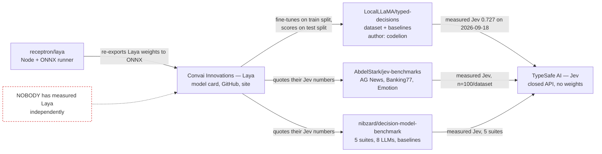

# 01 — Laya's terms and independent evidence

Research note for [ticket 01](../issues/01-laya-s-terms-and-independent-evidence.md), under
[the Laya and loophole map](../map.md). Researched 2026-09-21. No weights were downloaded;
everything below comes from repository metadata, raw text files, HTTP headers and the Hugging Face
datasets server.

**Rule this note follows.** Every claim carries the URL of the party that owns it. A vendor
repeating its own number in a second place is still one source. The last section lists every claim
for which no primary source exists; that section is the point of the note.

**Labels used throughout**

- **V** — the vendor asserts it (Convai Innovations, in any of its own artefacts).
- **I** — an independent party measured it and published the run.
- **X** — no primary source found.

---

## 0. Evidence chain



Every party that has measured anything here measured **Jev**. Nobody has measured **Laya**.

---

## 1. Licences and training-data provenance

### Weights — Apache 2.0 asserted, but only as metadata (V)

`convaiinnovations/laya` declares `license: apache-2.0` in the model-card YAML front matter and in
the Hub's `cardData`, and the card's last line reads "Apache 2.0 · Convai Innovations".

- https://huggingface.co/convaiinnovations/laya/raw/main/README.md
- https://huggingface.co/api/models/convaiinnovations/laya (field `cardData.license`)

**There is no `LICENSE` file in the weights repository.** The full file listing at
`https://huggingface.co/api/models/convaiinnovations/laya?blobs=true` contains `README.md`,
`.gitattributes`, weights, tokenizers, four `.py` files and images — no licence text, no `NOTICE`.
The same is true of `convaiinnovations/laya-typed-decisions` and `convaiinnovations/laya-multilingual`.
The three `.py` files shipped beside the weights (`rl_agent_api.py`, `rl_common.py`,
`email_utils.py`) carry docstrings but no licence header.

So the Apache 2.0 grant over the weights rests on a card tag and a prose sentence, not on a licence
file in the artefact. That is normal practice on the Hub and is probably fine, but it is weaker than
the inference code's position and an ADR should say so explicitly rather than record "Apache 2.0" flat.

### Inference code — Apache 2.0, properly (V)

- GitHub `NandhaKishorM/laya` carries a full stock Apache License 2.0 text (10,173 bytes);
  the GitHub API reports `spdx_id: Apache-2.0`. https://github.com/NandhaKishorM/laya/blob/main/LICENSE
- `pyproject.toml` declares `license = { text = "Apache-2.0" }` and the OSI classifier.
  https://github.com/NandhaKishorM/laya/blob/main/pyproject.toml
- PyPI `laya` 0.3.4 reports `License: Apache-2.0`, author "Convai Innovations".
  https://pypi.org/pypi/laya/json

Note the LICENSE file's appendix has no copyright holder line filled in. Immaterial, but it means
no copyright notice names the licensor anywhere in the code repo.

### Third-party runner — MIT over Apache weights (I)

`receptron/laya` (the Node/ONNX runner) is MIT, and states: "MIT. The Laya model weights are
published by Convai Innovations under Apache 2.0."
https://github.com/receptron/laya/blob/main/LICENSE and
https://github.com/receptron/laya/blob/main/README.md

A second third-party port exists, `flowgrammer/laya` (Apache-2.0, created 2026-09-20, an
HF-`transformers`-native alignment publishing `hf-laya` / `hf-decisions` / `hf-decisions-schema`).
https://github.com/flowgrammer/laya

### Base encoders

- English checkpoint: `answerdotai/ModernBERT-large`, licence `apache-2.0`.
  https://huggingface.co/api/models/answerdotai/ModernBERT-large
  Confirmed as the backbone by `rl_agent_config.json` (`"encoder": "answerdotai/ModernBERT-large"`)
  and `encoder/config.json` (`ModernBertForMaskedLM`, hidden 1024, 28 layers, vocab 50368).
- Multilingual checkpoint: `jhu-clsp/mmBERT-base`, licence **MIT** — a different licence from the
  root checkpoint's. Out of this map's scope, but worth knowing before anyone reaches for it.
  https://huggingface.co/api/models/jhu-clsp/mmBERT-base

### Training data — **no provenance published at all (X)**

This is the largest single gap in the whole enquiry.

- The Hub metadata has no `datasets:` field. https://huggingface.co/api/models/convaiinnovations/laya
- The model card's "Training" section describes only the *algorithm* (RLCD, REINFORCE with a
  group-mean baseline, TD(λ=1.0) over prefix slices). It names no corpus, no size, no licence, no
  collection method. https://huggingface.co/convaiinnovations/laya/raw/main/README.md
- `eval/results.md` and `eval/results.json` name thirteen *task families* used for evaluation
  (conversation outcomes, email triage, emotion and tone, inference and fact checking,
  instruction-following, intent and routing, moderation and safety, reading comprehension, response
  quality scoring, robustness checks, search relevance, sentiment and rating, topic classification),
  over 23,024 in-task and 2,400 zero-shot questions. It does not say what those families were built
  from. https://huggingface.co/convaiinnovations/laya/raw/main/eval/results.json
- The only positive statement about training content anywhere is a caveat inside the vendor's own
  raw result file: `"training_overlap": "ag_news and boolq were in Laya's training mix (retention,
  not generalisation). sst5, emotion, prompt_injections, banking77 were held out. Neither checkpoint
  trained on typed-decisions, MASSIVE or XNLI."`
  https://github.com/NandhaKishorM/laya/blob/main/research/results/t4_colab_benchmark.json (key `caveats`)

That caveat is useful and honest, and it also means the headline AG News comparison is a
retention number, not a generalisation number (see §3).

**Position for the ADR:** Apache 2.0 over weights and code is asserted consistently and is almost
certainly usable. The training corpus is entirely undocumented, so no statement can be made about
whether the weights embed anything the estate would not want to ship. Ticket 02 is unblocked on the
licence; it is *not* unblocked on provenance, and provenance cannot be unblocked by any amount of
further reading — it isn't published.

---

## 2. Who Convai Innovations is, and whether anyone independent has evaluated Laya

### The vendor (V)

- Hugging Face org `convaiinnovations`, 39 public models, first dated 2024-06-22. Laya was created
  **2026-09-18** and last modified 2026-09-20 — it is three days old.
  https://huggingface.co/api/models?author=convaiinnovations
- The project site is authored in the first person by "Nandakishor Mukkunnoth · Founder & CEO,
  ConvAI Innovations". https://laya.convaiinnovations.com/
- Two arXiv papers are cited there as prior art, and both are real, both single-authored by
  "Nandakishor M":
  - arXiv:2503.23303, *SalesRLAgent: A Reinforcement Learning Approach for Real-Time Sales
    Conversion Prediction and Optimization*, 2025-03-30. http://arxiv.org/abs/2503.23303
  - arXiv:2510.01237, *Confidence-Aware Routing for Large Language Model Reliability Enhancement*,
    2025-09-23. http://arxiv.org/abs/2510.01237
  - **Neither paper is about Laya.** There is no paper describing Laya, RLCD as implemented here, or
    the decision head. The site describes 2510.01237 as "formalizing the framework for schema-based
    decisions guided by reinforcement learning"; the paper's own abstract is about pre-generation
    hallucination mitigation by routing. The description does not match the source it cites.

### Independent evaluation of Laya: **none exists (X)**

Three candidate sources, all checked, none of them evaluates Laya:

1. **AbdelStark/jev-benchmarks** — https://github.com/AbdelStark/jev-benchmarks. Adapters directory
   contains exactly two model adapters, `jev.py` and `gliner.py`. Its one published report measures
   Jev against GLiNER2.5. No Laya.
2. **nibzard/decision-model-benchmark** — https://github.com/nibzard/decision-model-benchmark.
   Contenders are Jev, eight constrained LLMs and three deterministic baselines. The string "laya"
   does not appear in its README or its v2 report. No Laya.
3. **multimodalart/jev-reproductions-tracker** — https://huggingface.co/spaces/multimodalart/jev-reproductions-tracker.
   A community *directory* of Jev reproductions that lists Laya with its links and its star/like
   counts. It is a catalogue, not a measurement. Its own text is explicit: "Descriptions paraphrase
   each project's own README and launch post."

`flowgrammer/laya`'s `BENCHMARKS.md` looks at first glance like a second opinion, but its own header
says: "measurements below are from Convai Innovations' upstream Laya checkpoints … numbers
reproduce." It republishes the vendor's table without a run of its own — and, tellingly, with
*different* values (AG News 0.953 and Emotion 0.600 where the upstream card says 0.950 and 0.595).
https://github.com/flowgrammer/laya/blob/main/BENCHMARKS.md

**Every number the estate holds on Laya's quality is Convai's own.** The map's standing rule
("a vendor number is not a measurement") applies to all of them without exception. Ticket 04 is the
only route to a number this estate can rely on.

One adoption signal, for what it is worth: the Hub API reports `"downloads": 0` against
`"likes": 1300` for `convaiinnovations/laya`. Hub download counters lag and this may simply be the
counter not having run; it is not evidence of anything, but it is not evidence of adoption either.

---

## 3. What "Jev" is, and whether the comparison is fair

### Jev (V, by TypeSafe)

Jev is the closed "System One" model from **TypeSafe AI**, a San Francisco company. Their site
states the product claims directly: typed decisions with calibrated confidence, "Zero
Hallucinations", and **"Jev.Cost $42 Per Billion input tokens"** — i.e. the $0.042/1M figure Laya
quotes is TypeSafe's own published price. https://typesafe.ai/

There are no Jev weights and no Jev paper. The reproductions tracker's own summary of the field:
"TypeSafe's Jev weights … The RLCD algorithm, loss or data … described only at blog-post level; no
public implementation."

### Who chose the benchmark: **not Convai (I)**

The typed-decisions benchmark is `LocalLLaMA/typed-decisions`, published under the community
`LocalLLaMA` Hub org. Every commit on it is authored by the Hub user **`codelion`**, who also wrote
`adaptive-classifier`, the library used for its specialist baselines.

- https://huggingface.co/datasets/LocalLLaMA/typed-decisions
- https://huggingface.co/api/datasets/LocalLLaMA/typed-decisions/commits/main
- Dataset card: "This benchmark is independent. It is not affiliated with TypeSafe and it does not
  reproduce their Jev model."

The Jev 0.727 row is that author's **own measurement**, not a TypeSafe publication and not Convai's:
"**TypeSafe Jev 1.13.0** is a measurement, taken on 2026-09-18 through the TypeSafe API
(`POST /v1/systemone`, `model: jev-latest`, which reported itself as `jev-1.13.0`). All 400 cases,
all 2,000 decisions, zero errors, p50 710ms per case, $0.016 total at the published $0.042/1M input
rate. Earlier revisions of this card carried an estimated range here instead; that estimate is gone."
That is the strongest single piece of evidence in this whole enquiry, and it is about Jev.

### Is the comparison fair? **No — and the benchmark's author says so in advance (I)**

The dataset card contains, in its own words, a section headed "Two ways to be scored, and why the
difference matters":

> Train a specialist on these four workflows, score it on them, and you have measured architecture …
> It is not a comparison against a general System One model, which has never seen these workflows.
> … A specialist number sitting next to a generalist number, unlabelled, misleads the reader.

and

> A score much above 0.75 means a model has learned the teacher's quirks rather than the task.

Laya's headline row is exactly the thing that card warns against: `laya-typed-decisions` (a
specialist fitted on the train split) at 0.766, set beside Jev (a generalist that has never seen the
workflows) at 0.727, in a row labelled only "Laya (routed)". And Convai presents clearing the 0.735
teacher ceiling as a merit — "**+3.9 points over Jev's published 0.727, above the 0.735 teacher
ceiling**" — where the benchmark's author defines exceeding it as the signature of having learned
the teacher rather than the task.

Convai is not hiding the structure: the model card's "Honest Limits" says "The 0.766 belongs to the
checkpoint fine-tuned on that benchmark's own training split. Laya is a fast base to specialise, not
a zero-shot decision engine." Both statements are in the same document. The headline and the
footnote disagree about what the number means.

Three further fairness problems, all from primary sources:

1. **The gold is synthetic and is an LLM teacher.** The dataset is tagged `synthetic`; gold is "the
   mean of three samples from a teacher endpoint of roughly 4B-class capability … A score measures
   agreement with that teacher. It does not measure correctness."
2. **AG News was in Laya's training mix.** Card row: "AG News, 4 labels | 0.910 | **0.950**". The
   vendor's own raw file says ag_news was in the training mix (retention, not generalisation), while
   AbdelStark measured Jev on it cold. Retention vs zero-shot, presented as a win.
3. **The ECE row reverses direction depending on which table you read.** The headline comparison
   says "ECE (lower better) | 0.246 | **0.081** | 3× better". The typed-decisions table three
   paragraphs later says Laya 0.213 against Jev 0.144 — Jev better by half. They are different
   quantities (a 49-suite mean of refitted ECE vs a single-suite shipped ECE) placed in the same
   document without the difference being stated.

### Jev's independently measured numbers (I) — these are real

| Claim | Measured by | Value | Source |
|---|---|---|---|
| AG News accuracy | AbdelStark, n=100 | 0.910 | https://github.com/AbdelStark/jev-benchmarks/blob/main/results/reports/btzsc-pilot-v1.md |
| Banking77/BTZSC accuracy (72 candidates) | AbdelStark, n=100 | 0.870 | same |
| DAIR Emotion accuracy | AbdelStark, n=100 | 0.480 | same |
| DAIR Emotion: zero probability on the true label | AbdelStark | 16% of examples | same |
| p50 latency, hosted, single question | AbdelStark | 236.3 – 255.9 ms | same |
| S5 confidence-honesty ECE | nibzard | 0.246 | https://github.com/nibzard/decision-model-benchmark/blob/main/results/v2/v2.md |
| Banking77-style 77-way accuracy | nibzard | 76.3% | same |
| Option-order flip rate | nibzard | 13.0% | same |
| p50 latency across five suites | nibzard | 264 – 276 ms | same |
| typed-decisions accuracy, 2,000 decisions | codelion | 0.727 | https://huggingface.co/datasets/LocalLLaMA/typed-decisions |
| typed-decisions, ms per 5-question case | codelion | 710 ms | same |

Laya's card cites "236–276 ms" for Jev, which correctly spans both studies. Note that Convai's own
marketing site contradicts its own model card here, describing Jev as having "typical response times
around 150 ms" (https://laya.convaiinnovations.com/) — no source is given for the 150 ms.

Note also that nibzard's repository carries a `CORRECTIONS.md` revising its own v1 numbers after
finding a prior-table collision and a macro-F1 definition error. That is what a benchmark that can
be trusted looks like, and it is the standard the Laya numbers have not been held to.

---

## 4. What "specialise" means, and the documented fine-tune recipe

"Specialise" means: take the base checkpoint, fine-tune it with RLCD plus soft cross-entropy against
the teacher's distributions on the **training split of the benchmark you will then be scored on**,
refit calibration temperatures, evaluate on the test split.

Documented recipe:
https://github.com/NandhaKishorM/laya/blob/main/notebooks/laya_finetune_typed_decisions_2xT4_kaggle.ipynb

### Labelled-item counts — counted directly, not quoted

Counted by paging the Hugging Face datasets server over every row of `LocalLLaMA/typed-decisions`,
config `all`, and tallying each question's `type` field
(`https://datasets-server.huggingface.co/rows?dataset=LocalLLaMA%2Ftyped-decisions&config=all&split=train`):

| Split | Cases | Decisions | `choice` | `noul` | `score` |
|---|---|---|---|---|---|
| train (the fine-tune input) | 1,200 | **6,000** | **1,800** | **1,800** | **2,400** |
| test (the benchmark) | 400 | 2,000 | 600 | 600 | 800 |

Structure: four workflows × 300 train cases × 5 questions. There are exactly **20 distinct question
schemas**, each with **300 labelled training items** and 100 test items. Every workflow contributes
5 questions; the type mix per workflow varies (e.g. `invoice_processing` is 1 choice / 2 noul /
2 score, `agent_trace_observability` is 2 choice / 1 noul / 2 score).

The vendor's own per-primitive table independently corroborates the *test* counts —
`noul` n=600, `choice` n=600, `score` n=800
(https://huggingface.co/convaiinnovations/laya-typed-decisions/raw/main/README.md), which matches the
count above exactly. That is a genuine cross-check that Convai evaluated on the whole official test
split and did not sub-sample.

**The number that matters to this map: 300 labelled items per question schema.** The map records
that the six twin skills hold 42 labelled items in total, the largest single corpus being 23. The
documented recipe uses ~13× the estate's entire labelled stock on *each one* of twenty questions.
Ticket 03's count and ticket 04's number both have to be read against that.

### Three irreconcilable accounts of the fine-tune run (V)

| Source | Claim |
|---|---|
| Notebook, section 5 heading | "Runs on both T4 GPUs in parallel (**~4 to 6 minutes** total)" |
| `laya-typed-decisions` model card | "about **4–5 hours** on Kaggle's free 2xT4" |
| GitHub README | "roughly **4-5 hours for 4 epochs over ~30k questions**" |
| The shipped checkpoint's own config | `"updates": 7313, "epochs_completed": 1, "hours": 1.96` |

The config block in `typed-decisions/rl_agent_config.json` is byte-identical to the base checkpoint's
`training` block, so it records the *base* run and not the fine-tune at all. And 4 epochs over a
6,000-decision train split is 24,000 questions, not ~30k. No run log is published. Nobody can say
from primary sources how long the published checkpoint was actually trained for, or on how many
passes.

### A defect visible in the shipped config (verified)

`typed-decisions/rl_agent_config.json` carries `"temperature": [1.0148, 1.0374, 1.0575]` — plausibly
refitted — but its `temperature_by_options` map is **byte-identical to the base checkpoint's**
(`choice:11+` = 0.1006, `noul:2` = 1.9834, and so on). `rl_agent_api.py` looks up
`temperature_by_options` *first* and only falls back to `temperature`
(`z = logits[r,:k] / self.temperature_by_options.get(temp_bucket(qt,k), self.temperature[qt])`), so
the stale per-cardinality temperatures win and the fitted ones are dead code for every question type
that has a bucket. Convai document this themselves: "Its `temperature_by_options` was inherited from
the base checkpoint and overrides the per-type temperatures fitted for this model — refit on your own
held-out data before relying on the probabilities."

Anyone wiring Laya into `twin/skills.py` inherits that. Probabilities out of the shipped
typed-decisions checkpoint are temperature-scaled by constants fitted for a different model.

---

## 5. Does the ONNX export match PyTorch?

**Partially evidenced, never published as an artefact.**

The ONNX path is third-party, not Convai's: `receptron/laya` (MIT) exports the Hub checkpoint to a
single ONNX graph and publishes the bundle at `receptron/laya-onnx` on the Hub.
There is **no** ONNX file in any `convaiinnovations/*` repo.

What evidence exists:

1. `export/export_onnx.py` ends with a parity check that runs the PyTorch wrapper and the ONNX
   session on the same input and prints `max |dlogits|` and `max |dact|`.
   https://github.com/receptron/laya/blob/main/export/export_onnx.py
   The input is `torch.randint(5, 1000, (2, 40))` — **random token ids at one fixed shape**
   (batch 2, sequence 40, 4 option markers), not real text and not a corpus. It is a smoke test for
   a broken export, not an equivalence measurement.
2. The "≈1e-5" figure is **asserted in prose**, in the runner's README and the ONNX bundle's card
   ("max logit difference vs. the PyTorch reference ≈ 1e-5"). The script prints it at export time;
   no run output is committed anywhere.
   https://github.com/receptron/laya/blob/main/README.md ·
   https://huggingface.co/receptron/laya-onnx/raw/main/README.md
3. The strongest evidence is `test/test_model.ts`, which asserts the TypeScript/ONNX path reproduces
   the Python reference to four decimal places on one real ticket — exact equality on
   `input_tokens: 267`, `probabilities {billing: 0.9415, support: 0.031, sales: 0.0275}`,
   `confidence 0.7603`, `score 1.3886`, `noul 0.0988`.
   https://github.com/receptron/laya/blob/main/test/test_model.ts
   **It skips unless an ONNX bundle is on disk** (`skip: !available && "no ONNX bundle on disk"`),
   and the CI workflow's own comment confirms this never happens in CI: "unit tests only; the
   model-backed test skips itself when the weights are not on disk".
   https://github.com/receptron/laya/blob/main/.github/workflows/ci.yml

So: one real example, hand-checked once, asserted at 4 dp, never run in CI; plus a random-input smoke
check whose output is not stored. That is one data point, not parity evidence. If the estate ever
depends on the ONNX path, running that comparison over a real corpus is a ticket, not a citation.

Note also that the ONNX bundle covers only the **English** checkpoint — the bundle card lists
`laya.onnx` as "English checkpoint, 421M parameters", and the runner's `subfolder: "multilingual"`
option points at a variant that is not published in `receptron/laya-onnx` today (its file list is
seven files, all root-level).

---

## 6. The typed-decisions API: exact shape

Authoritative source is the Python reference shipped beside the weights,
https://huggingface.co/convaiinnovations/laya/raw/main/rl_agent_api.py, whose docstring is explicit
that this is a clone of someone else's interface: *"Jev-compatible inference for a saved RL Agent
model"*, and *"questions: {id: {...}} (Jev request shape)"*. The third-party TypeScript port states
the same: "They follow TypeSafe Jev's `system_one` API, which Laya reproduces."
https://github.com/receptron/laya/blob/main/src/types.ts

**Request** — `system_one(state, questions)` (the pip package exposes the same call as
`Agent.predict`; `laya/agent.py` defines `system_one` at line 241):

- `state`: `str | dict | list`. A dict is serialised with `json.dumps(ensure_ascii=False)`.
- `questions`: `{question_id: {...}}`, each with `type` ∈ `{"choice", "score", "noul"}`,
  `instructions` (string or object), and `criteria`:
  - `choice` — `{option_key: description | null}`, or a bare list of option names.
  - `score` — an **ordered** list of level descriptions, index 0 lowest.
  - `noul` — optional `{true?: str, false?: str}`.

**Response**

```
{
  "model": "rl-agent",                     # literal string from the config's model_name
  "answers": { <question_id>: <Answer> },
  "usage": { "input_tokens": <int>, "output_tokens": 0 }
}
```

with three answer shapes, every float rounded to 4 dp:

| type | fields |
|---|---|
| `choice` | `type`, `choice` (the winning key), `probabilities` {option → p}, `confidence`, `rl_agent.act_probability` |
| `score` | `type`, `score` (expected level, Σ i·p — may fall between levels), `legend` {index → criterion}, `probabilities` {index → p}, `confidence`, `rl_agent.act_probability` |
| `noul` | `type`, `noul` (P(true)), `rl_agent.act_probability` |

`confidence` is 1 − normalised entropy of the answer distribution (per `src/types.ts`), **not** the
top probability — they differ, e.g. probabilities 0.9415 / 0.031 / 0.0275 give confidence 0.7603.
`act_probability` is the act-vs-escalate head; the config prices `escalate` at 0.5 and a wrong act at
3.0 (`"act_costs": {"escalate": 0.5}, "cost_wrong_act": 3.0`). In the base checkpoint's own
evaluation the act policy never escalated at all: `"automation_rate": 1.0`,
`"accuracy_when_escalating": null`
(https://huggingface.co/convaiinnovations/laya/raw/main/eval/results.json).

**Failure mode worth knowing.** If a question's rendered options do not fit `head_max_len`
(192 tokens on the English checkpoint, 256 on the other two), `system_one` raises
`ValueError("question %r: options do not fit in head_max_len=%d tokens")`. It does not degrade; it
throws. Any `twin/skills.py` callable must handle that.

**Determinism.** Nothing in the API takes a seed. The forward pass is deterministic for a fixed
input, dtype and device, but the card documents a dtype switch on pre-Ampere GPUs
(`bf16` → `fp16` on a T4) inside `RLAgent.__init__`, so the same weights give different low-order
digits on different hardware. The map's call 2 — neither tool becomes a gate check — holds.

---

## 7. Pinnable artefact digests — yes

All values read from HTTP headers on `https://huggingface.co/convaiinnovations/laya/resolve/main/...`
(`x-repo-commit`, `x-linked-etag`, `x-linked-size`), 2026-09-21.

**Repository revision:** `1c5edc17a7acd8701df6fc341c0d179f1c62c982`
(the Hub API reports the same as `sha`, so `revision=` pinning works in `huggingface_hub`).

| Artefact | SHA-256 | Bytes |
|---|---|---|
| `model.safetensors` (English, root) | `891102d372688fc2a094dac56a384bc537b87c63f21f9f3dac0be2b7cbc8d86c` | 842,609,210 |
| `typed-decisions/model.safetensors` | `4fa56de72383a9d3efa9cfa78955733c81b9fc8067a587ca4beb82c78107a24e` | 842,609,220 |
| `multilingual/model.safetensors` | `9d628fd971b700382ac6f65920a86f149777b2e748e0c955fb3b19695aa8f204` | 643,835,514 |

Useful cross-check: `convaiinnovations/laya-typed-decisions` (repo revision
`f9ab0b228f0fc0f14d873dbc99038f135c2da1b2`) serves a `model.safetensors` with the **same** SHA-256,
`4fa56de7…`. The standalone repo and the bundled subfolder are the same bytes.

Other pinnable things:

- PyPI `laya` 0.3.4 — wheel `8bf1c5cc5cbf6abebf63a6346b4babedd5692f88a75aa9e0cc01ed4145a9a14b`,
  sdist `e0da594d77d2c491aedd3381757052b251a953fc27f03733dcb1c8e761246f3e`, uploaded 2026-09-20.
- npm `@receptron/laya` 0.1.1 — `sha512-f1KuunCKTQGhJtuEZTqb/OLSqc68Sh9aJWO/OCrPLC/JLU3R/FCmAd2b/QUO63kO6u5hJMcOODLfEJ8KzqWPVg==`.
- `receptron/laya-onnx` repo revision `68f27dfe5a27a54fb2b1fefc432f43f972e90868`.
- Benchmark dataset `LocalLLaMA/typed-decisions` revision `ea9306458d6e9563628369a3d1e72e362fb381d2`.

**Caveat that matters for pinning policy.** The repo is three days old and has been re-pushed
repeatedly — ten commits to the model card between 2026-09-19 and 2026-09-20, including "docs: Laya
(routed) vs Jev as the headline comparison" (https://huggingface.co/api/models/convaiinnovations/laya/commits/main).
`main` is a moving target. Any adoption must pin the revision, and the digest, not the tag.

---

## 8. The vendor claims on file, adjudicated

The "vendor claims already on file" in ticket 01, each against a primary source.

| Claim on file | Verdict | Primary source |
|---|---|---|
| 421M parameters | **Confirmed, exactly.** 421,293,830 (421,293,827 F16 + 3 F32) | HF API `safetensors.parameters` |
| ModernBERT-large backbone | **Confirmed** | `rl_agent_config.json` + `encoder/config.json` |
| Apache 2.0 | **Confirmed as asserted metadata**; no LICENSE file in the weights repo | card YAML, HF `cardData` |
| CPU latency 193–464 ms | **No source.** The only published CPU run records **1,392.5 ms per 5-question case** at 4 threads | `research/results/cpu_51_language_sweep.json` |
| GPU p50 32.8 ms | **Misattributed.** 32.8 ms is `laya-multilingual`. The 421M English checkpoint is **39.5 ms** (p95 44.8) | `t4_colab_benchmark.json` key `latency` |
| 0.766 on typed decisions | **No raw artefact.** The string does not appear in either published result file. Belongs to a *different checkpoint*, fine-tuned on the benchmark's own train split | absence in `t4_colab_benchmark.json`, `cpu_51_language_sweep.json` |
| Jev 0.727 | **Confirmed, and independently measured** by the benchmark's author on 2026-09-18 | dataset card |
| 0.362 zero-shot | **Confirmed** for the English checkpoint over n=2,000 | `t4_colab_benchmark.json` `summary.typed_decisions.laya.accuracy = 0.362` |
| Calibration 0.466 → 0.081 | **Confirmed as stated, but badly framed.** It is the mean over **49 suites**, 42 of which are MASSIVE/XNLI multilingual suites with shipped ECE 0.52–0.77. Recomputed from the raw file: mean shipped 0.4656, mean refit 0.0812. For **typed-decisions alone** the same file records **0.2071 → 0.1287** on 1,000 held-out items | `t4_colab_benchmark.json` key `calibration_repair` |

The last row is the one to carry into the ADR. If the estate fine-tunes and refits on twin-like
typed decisions, the calibration error to expect is around **0.13**, not 0.081. The 0.081 is an
average dominated by suites this estate will never run (the map puts the multilingual checkpoint out
of scope).

Two further corrections found while checking:

- The model card's own "Honest Limits" says multilingual zero-shot is **0.352**; its table two
  sections earlier says **0.342**; the raw file says **0.3515**. Same document, two values.
- "Where Jev leads" says "Before temperature scaling, the base checkpoint has higher raw ECE
  (0.213 vs 0.144)" — but 0.213 is the table's figure for `laya-typed-decisions`, and the base
  checkpoint's is 0.175. The sentence attributes the fine-tuned checkpoint's number to the base one.

---

## 9. Claims for which I found NO primary source

Stated plainly. Each of these is asserted somewhere and evidenced nowhere I could reach.

1. **The training data.** No corpus, no list, no size, no collection method, no licence, no
   provenance statement of any kind exists for the base checkpoint's RLCD training. Thirteen task
   *family names* in `eval/results.md`, and one sentence admitting ag_news and boolq were in the mix,
   is the sum total. This cannot be resolved by more reading; it is not published.

2. **Any independent evaluation of Laya.** None. Zero. The two benchmark repos Convai cites measure
   Jev only; the reproductions tracker is a catalogue; `flowgrammer/laya` republishes Convai's table
   without running it. Every quality number this estate holds on Laya is Convai measuring Convai.

3. **0.766 accuracy on typed decisions.** The headline figure has no published raw artefact. It is
   absent from both result JSONs in the `research/` tree. It exists in the model card and in a
   notebook that would, if run, reproduce something.

4. **AG News 0.950 and DAIR Emotion 0.595.** `BENCHMARKS.md` cites
   `research/results/app_benchmark.json` as the source. **That file does not exist in the
   repository.** The one published run gives 0.9467 and 0.5733; a third-party fork of the same
   document says 0.953 and 0.600. Three values per claim, none of them matching the single published
   artefact.

5. **CPU latency 193–464 ms.** No artefact. There is no latency result file in `research/results/`
   at all — `bench_latency.py` exists, its output does not. The only published CPU timing is
   1,392.5 ms per case.

6. **Cold-reload times of 7.4 s (CPU) and 10.3 s (T4).** Same: asserted in the card's deployment
   table, no artefact.

7. **"100+ languages."** The largest published sweep covers **51** languages and finds the
   multilingual checkpoint clears 3× random on 45 of them. The claim of 100+ rests on the base
   encoder's pretraining coverage, not on any measurement of Laya. (Out of scope for this map, but
   it is an unsupported headline.)

8. **How long the published typed-decisions checkpoint was trained.** Four mutually inconsistent
   vendor statements (~4–6 minutes; 4–5 hours; 4 epochs over ~30k questions where the split holds
   6,000 decisions; and a config recording 1.96 h / 1 epoch that is the base run's block copied
   over). No run log.

9. **ONNX ⇄ PyTorch equivalence.** The "≈1e-5" is a prose assertion; the check that produces it uses
   random token ids at one shape and stores nothing. The 4-decimal-place end-to-end test covers one
   example and is skipped in CI. There is no corpus-level comparison anywhere.

10. **Jev's "typical response times around 150 ms"**, claimed on Convai's own site, contradicting
    Convai's own model card (236–276 ms) and every independent measurement (236–276 ms). No source.

11. **That arXiv:2510.01237 "formalis[es] the framework for schema-based decisions guided by
    reinforcement learning."** The paper exists; its abstract is about pre-generation hallucination
    mitigation by confidence-aware routing. The description does not match the cited source. There
    is **no paper describing Laya, its decision head, or its RLCD implementation** — by anyone.

12. **That clearing the 0.735 teacher ceiling is a merit.** The benchmark's own card states the
    opposite in advance: a score much above 0.75 means the model learned the teacher's quirks. This
    is not an unsourced claim so much as a claim contradicted by its own source.

13. **Convai Innovations as a legal entity.** I confirmed a Hugging Face org, a project site, a
    named founder and two real arXiv papers by that author. I did **not** locate a company
    registration, an address, or any corporate record, and I did not search a companies registry.
    If an ADR needs to name a counterparty, that is an open question, and per the map's process
    rules a question about a real person's or firm's identity goes to the owner, not to me.

14. **Anyone actually using it.** `downloads: 0` against `likes: 1300` on the Hub API. Not a claim
    Convai makes, but if adoption is ever cited as evidence, there is none to cite.

---

## What this unblocks, and what it does not

- **Ticket 02 (weights)** — unblocked on licence. Apache 2.0, pin revision
  `1c5edc17a7acd8701df6fc341c0d179f1c62c982` and digest `891102d3…` for the English checkpoint.
  Note the repo ships custom `.py` files; loading through `transformers` needs
  `trust_remote_code=True`, which is a decision in its own right.
- **Ticket 03 (labelled items)** — the target to beat is 300 labelled items per question schema.
  The estate holds 42 in total.
- **Ticket 04 (the number)** — is now the only way this estate learns anything true about Laya's
  quality. Measure the **English 421M** checkpoint at **39.5 ms**, expect zero-shot near
  **0.36**, and expect calibration after refit near **0.13**, not 0.081.
