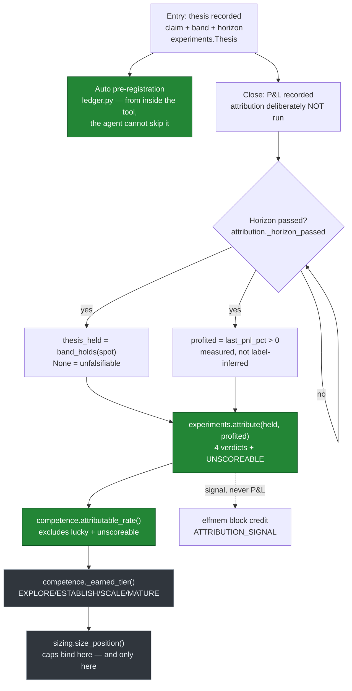

# 10 — What the trdrbot prior art teaches

Research note. Written 2026-09-21. Resolves ticket
[10](../issues/10-what-the-trdrbot-prior-art-teaches.md), under
[the Laya, loophole and trdrbot map](../map.md).

**Primary source throughout.** `emson/trdrbot_hackathon`, default branch `main`, cloned into the
session scratchpad at HEAD `ae922acd31bb1bf9864e5bcb03a93cf6993038c5`, committed
2026-09-04 13:55:33 +0100, 296 commits, MIT © 2026 Ben Emson (`LICENSE`, `README.md:141`). Every
line reference below is from that tree. **deepwiki has no index of this repository**, and a
sibling agent found deepwiki's index of a different repository stale and wrong on a central fact,
so nothing here comes from a summary. Where this note contradicts the ticket's seeded facts, the
contradiction is stated, not smoothed.

**The clone is not vendored.** It sits outside the project tree, in the scratchpad, under map
call 5's rule. Nothing from it is copied into the estate by this note — the take verdicts below
are verdicts on *ideas*, and each taken idea is to be reimplemented against estate vocabulary.

**Not flattered.** Its Brier is 0.2332 over 71 scored forecasts (`agent/data/metrics.jsonl`, last
`snapshot` row: `calibration.n` 71, `calibration.resolved` 95, `calibration.brier` 0.2332). A
constant 0.5 predictor scores exactly 0.25. Its `calibration.n_eff` on the same row is 9.68 —
**14% of face value**, by its own inverse-Herfindahl measure. That row is also the one its own
ledger flags as clock-corrupt (I-127: `ts` reads 2027-10-08 against every neighbour in 2026-08/09).
So: the numbers are young, concentrated, and partly stamped by a broken clock. This note takes its
**mechanisms**.

---

## The shape of the thing

Green is what this note takes. Grey is what it leaves.

---

## 1. The attribution matrix, and how "the thesis held" is decided separately from "it paid"

**The matrix itself is `agent/src/trdrbot/experiments.py:315`**, `attribute(thesis_held, profited)`
— twelve lines, a pure function of two booleans, no I/O and no model call. It returns one of five
string verdicts declared at `experiments.py:308-312`:

| `thesis_held` | `profited` | verdict | what it means |
|---|---|---|---|
| `None` | any | `unscoreable` | no checkable band — assert nothing |
| `True` | `True` | `thesis_right_expression_right` | reinforce view and structure |
| `True` | `False` | `thesis_right_expression_wrong` | view held, structure lost — do not weaken the view |
| `False` | `False` | `thesis_wrong_expression_faithful` | view wrong, structure honest — correct the view |
| `False` | `True` | `thesis_wrong_profited_anyway` | **the lucky win** |

**The driver is `agent/src/trdrbot/attribution.py`**, whose `run()` computes both inputs
independently, at `attribution.py:160` and `attribution.py:173`:

- **Did the thesis hold** — `experiments.Thesis(...).holds_at(spot)`
  (`experiments.py:62`), which delegates to `optmath.band_holds(price, low, high)`
  (`optmath.py:145`). It is an inclusive interval test against a band **written at entry**, before
  the outcome existed. With no band it returns `None` — unfalsifiable, and deliberately not
  guessed. `optmath.band_holds` exists because two modules had implemented the same rule and
  *disagreed on the empty case*, one returning `None` and the other `True` (vacuously holds); the
  divergence was held off only by an unrelated function refusing band-less rows.
- **Did it pay** — `profited = pos.last_pnl_pct > 0`, a measured number.
  `close_reason` is only a fallback. The comment at `attribution.py:167-172` records why: a real
  NVDA spread made +$1,290, was closed outside the agent's own exit rules, and would have been
  attributed a losing thesis, "teaching the loop the exact opposite of what happened" (D-056).

Three design choices around it are the transferable part, more than the matrix:

1. **Attribution runs at the horizon, not at close** (`attribution.py` module docstring,
   `_horizon_passed` at line 32). A stop firing on day 2 of a 10-day thesis "says nothing about
   whether the thesis was right — the horizon has not arrived." Scoring at close records "thesis
   wrong" for a view not yet tested.
2. **The learning signal follows the verdict, never the money** —
   `ATTRIBUTION_SIGNAL` at `experiments.py:366`: 0.9 / 0.65 / 0.1 / `None` / `None`. A lucky win
   and an unscoreable thesis carry `None`, and the caller **skips the update entirely**. The
   comment records the measured reason this is `None` and not 0.5: their memory layer's update is
   a Beta posterior mean, so a 0.5 "learn nothing" signal was in fact a force dragging every block
   toward 0.5 — measured live, a lucky win moved the constitution −0.250 and moved a prediction
   that had already *missed* +0.018.
3. **Unjudgeable is answered, not left silent** (`unscoreable_reason`, `attribution.py:41`;
   `pending`, line 57). A position that can never be attributed is given the `unscoreable` verdict
   once and drains from the queue. Before that, a permanently stuck item and a permanently empty
   queue were the same observation.

**What it produced live.** Across its 13 position pages
(`agent/data/wiki/positions/*.md`): 8 unattributed, 1 `thesis_right_expression_right`,
1 `thesis_wrong_expression_faithful`, **2 `thesis_wrong_profited_anyway`**, 1 `unscoreable`. Two
of its five reached verdicts are lucky wins. The mechanism is not decorative — on its own record
it scores 2 useful out of 5, a 40% attributable rate, which is below its own SCALE bar of 0.6.

---

## 2. The tier mechanism, precisely

`agent/src/trdrbot/competence.py`. Four tiers, declared as one table at `competence.py:124`:

| tier | `min_n` resolved | `min_attr` | `max_rel` | `strict_attr` | book cap | Kelly |
|---|---|---|---|---|---|---|
| `explore` | 0 | — | — | no | 10% | 0.00 |
| `establish` | 5 | — | — | no | 15% | 0.10 |
| `scale` | 15 | 0.6 | — | no | 20% | 0.18 |
| `mature` | 40 | 0.7 | 0.04 | **yes** | 25% | 0.25 |

- **The promoting quantity is `resolved` — the count of resolved theses** (`_earned_tier`,
  `competence.py:352`), with two further conditions above ESTABLISH: the **attributable rate**
  (`attributable_rate`, line 303) and, at MATURE only, **Murphy reliability** from the Brier
  decomposition (`calibration.py`). `_earned_tier` walks the ladder and keeps the highest rung
  every condition clears.
- **The attributable rate is where the lucky win bites.** `attributable_rate` at
  `competence.py:303` counts verdicts that are *not* `UNSCOREABLE` and *not*
  `THESIS_WRONG_PROFITED_ANYWAY`, over all verdicts. A profitable trade on a wrong thesis
  therefore **lowers the denominator's numerator** — it is counted, and counted as teaching
  nothing. Promotion past ESTABLISH requires ≥60% of resolved theses to be explicable.
- **What each tier permits** is one earned risk budget applied at four scopes, all derived from
  `cap` so they cannot desynchronise: book cap = `cap`; position cap =
  `cap × POSITION_SHARE_OF_BOOK` (0.5, line 176); per-name cap = `cap × 0.8` (line 187); and the
  exploration floor = `cap × SEED_SHARE` (0.15, line 105). Kelly's multiplier rises with the tier
  and ramps continuously *within* a tier (`RAMP_K = 6.0`, line 194) so a rung boundary is not a
  cliff.
- **Demotion is asymmetric and immediate** (`_demote`, line 367): 5% drawdown from the equity
  high-water mark drops one tier, 10% drops straight to EXPLORE. Promotion needs a sustained
  record; demotion needs one drawdown. Stated reason: a losing streak is evidence the regime
  changed out from under the record.
- **There is no manual approval gate.** Confirmed: the only call sites of `competence.assess` are
  `tick.py:870` (the live loop) and `cli.py:800` (a read-only report). Nothing waits for a human.
- **"Not yet measurable" is a third state, not zero.** `MIN_ATTR_VERDICTS = 5` (line 156) and
  `_attr_ok` (line 330): below five verdicts the attributable rate does not block — *except* at
  MATURE, where `strict_attr` makes silence itself disqualifying. `attributable_rate` returns
  `None`, never `0.0`, for an empty book. The measured reason is recorded: attribution returned
  zero for **172 consecutive runs** with positions open whose horizons had not arrived, and
  scoring that as 0% "gave a book with nothing resolved the identical grade as a book of pure
  luck".
- **Reliability gates MATURE only, and the reason is a power argument they ran** (comment at
  `competence.py:133`, decision D-050): at n=15–20 a perfectly calibrated agent and a badly
  overconfident one score 0.022 vs 0.038 — overlapping distributions. At n≈40 the perfect agent is
  blocked 2% of the time and the bad one 92%. "Gating on a statistic before it can discriminate is
  theatre that costs real size."

**The defect that matters more than the design.** `specs/issues.md` I-68, open: the whole sizing
apparatus — Kelly, the shrink, every tier cap — "was called **twice in 89 decide cycles** that
reached a verdict (2.2%)". The refusals that actually happen occur upstream, in the model's prose.
And I-70, open: the exploration *floor* binds at every rung for the trades this book actually
makes, so "the whole Kelly apparatus is decorative for the trades that happen" — all four
positions ever opened were floor-sized. **An earned-permission ladder binds only at the seam the
actor is obliged to pass through.** That is the single most useful thing in this repository for
estate ticket 05, and it is a finding against the source, not for it.

---

## 3. Where the ~50-forecast bar comes from: **chosen, imported, not derived**

Traced to its origin. The bar appears in code at `agent/src/trdrbot/ledger.py:16` and
`agent/src/trdrbot/local_tools.py:1267`, in prose at `README.md:133` and `agent/README.md:387`,
and in `specs/decisions.md:1015`, `:1820`, `:4834`. Every one of those is downstream of a single
document: **`docs/sources/trading_techniques_review.md`**, a consolidation of two web research
sweeps run 2026-08-27 (`:3-5`). It appears there twice:

- `:83-84` — "the honest thresholds are brutal — ~50 resolved forecasts before calibration is
  *measured* rather than guessed, 152 to distinguish a 60% hit rate from a coin flip."
- `:241` — a table, "Observations to be meaningful": execution cost ~5, process compliance ~10,
  **calibration measured rather than guessed ~50**, hit rate 60% vs 50% **152**, per-trade
  Sharpe > 0 **64–371**.

**The 152 is derived and the ~50 is not.** 152 is a two-proportion power calculation for 0.60 vs
0.50 — reproducible arithmetic, and the same document cites a matching literature figure of ~350
resolved binary forecasts at 80% power for a forecasting-edge test (`specs/notes/023:227`, citing
Foresight Arena, arXiv). The ~50 carries **no derivation anywhere in the repository**: no formula,
no simulation, no citation of its own. It is a rule of thumb, adopted from a research sweep and
then quoted internally as though it were measured. The repository is scrupulous about this
elsewhere — `SEED_SHARE` is labelled "has never been fitted to anything (I-70)", and D-050's
reliability threshold *is* backed by a simulation they ran on their own scorer — which makes the
~50's unexamined status a real inconsistency rather than an oversight I am inventing.

The tier ladder does **not** use 50. Its rungs are 5 / 15 / 40, and 40 is the one number with a
measured basis (D-050's discrimination simulation). The ~50 lives only in prose and in the
argument for logging forecasts on trades it declines.

---

## 4. The defect ledger, and what enforces it

`specs/issues.md` opens with the rule (`:3-5`): "a bug found is recorded here the moment it is
found, and removed only by a commit that fixes it (link the D-number). Health
(`trdrbot health`) detects; this ledger remembers." It currently runs to I-127, with fixed entries
kept in place as struck-through text carrying their fixing D-number, never deleted.
`specs/decisions.md` is its 5,813-line sibling: one D-number per decision, with the measurement
that drove it.

**Enforced by nothing mechanical. I checked four ways:**

1. **CI** (`.github/workflows/agent-tests.yml`) runs exactly three steps: `uv sync --locked`,
   `uv run pytest -q`, `uvx ruff check .`. No ledger check. (It does not even run the `mypy` that
   `docs/principles_coding.md:273`'s own Mechanical-enforcement table names — `mypy` is configured
   in `agent/pyproject.toml:89` and never invoked by CI.)
2. **No hook, no script.** `scripts/` holds `publish.sh` and `release.sh` only; neither reads
   `issues.md`.
3. **The one test that touches it is not a gate.** `test_chassis.py:461` pins
   `site_export.issue_counts()` — a parser separating "highest id ever assigned" from "entries
   currently listed", written because a slide once said "125 numbered issues" with two possible
   readings. It counts; it never fails a build.
4. **`trdrbot health`** (`agent/src/trdrbot/health.py`) is a genuinely strong runtime probe — its
   `heartbeat()` at line 265 *raises* if a subsystem omits a declared field, so "ran and silently
   did nothing" is loud. But it probes the running system, not the ledger file.

So the ledger is enforced by **discipline plus publication**: `site_export.py:1489` renders the
open issues onto the public website, which makes forgetting an entry visible to strangers. That is
social pressure, not a gate. The repository's own principles document states the cost of this in
its own words (`docs/principles_README.md:38-42`): *"Tools enforce, prose guides. Prose rules get
roughly 25–40% compliance; the same rules as lint/type/CI gates get ~95%."* Its defect ledger is
in the 25–40% column, and its authors wrote the sentence that says so.

---

## 5. What it does not do — every limit its own documentation states

The ticket's premise is right about backtesting and **wrong about Monte Carlo**, and the
correction matters because the estate's ticket 10 notes would otherwise carry it forward:

- **No backtesting engine.** Out of charter by name (`specs/charter.md:53`), and deferred with a
  reason at `specs/decisions.md:136` — "LLM training-data overlap with historical prices can make
  backtests look good via memorization, not skill".
- **Monte Carlo is present.** `market_stats.bootstrap_factors` drives a block bootstrap resampled
  from each name's own demeaned returns, consumed by `experiments.simulate`
  (`experiments.py:193-219`, producing `pop_bootstrap`) and by `discovery.bootstrap_block`
  (`discovery.py:52`). It is a bootstrap MC, not a parametric one. The "no Monte Carlo" line in
  the ticket should be struck.
- **Live paper data only** — Alpaca paper account, IEX feed because the free tier 403s on recent
  SIP data (`attribution.py:95-104`). That constant exists because without it "every spot lookup
  failed… attribution silently never ran — the self-improving loop's most important step dead
  while every log line still read healthy."

Its own stated limits, from `agent/README.md:383-406`, `README.md:129-137`, `SUBMISSION.md:73-78`
and `specs/charter.md:48-56`:

- **Calendars and diagonals are refused, never approximated** — `optmath.MultiExpiryError`
  (`optmath.py:31`) and `require_single_expiry` (line 123), which also refuses a *partially* dated
  leg set rather than assuming a shared expiry. "A confident wrong payoff is worse than a refusal."
- **Calibration is young.** Stated as n=1 in `agent/README.md:387`.
- **The first position can never be attributed** — no thesis was recorded at entry, and
  "fabricating one retroactively would be worse than the gap".
- **A skewed board is evaluated at one vol, not a smile** — refused for the same reason calendars
  are.
- **No guardrail or risk-policy layer, by choice** (D-009) — no VaR, no portfolio hedging, no
  multi-agent risk review. The deterministic sizing math is the only guardrail.
- **The playbook's menu is indicative**, priced when the opportunity is admitted, possibly hours
  before the decision.
- Out of scope by charter: live money, multi-broker, WebSocket/streaming (polling only, D-003).
- **Anthropic's Consumer Terms restrict relying on Claude to buy/sell securities** — recorded as a
  "known, accepted risk, not resolved" (`specs/charter.md:71-73`).
- Its open ledger names, among others: **I-68** (the sizer consulted in 2 of 89 cycles),
  **I-70** (the floor binds everywhere, the Kelly apparatus decorative), **I-69**
  (`shrink_probability` shrinks toward 0.5, not the base rate its own docstring and three
  decisions promise — sign-inverting below 50%), **I-67** (the ladder counts 29 raw forecasts
  where its own calibration layer says 11.8 independent), **I-127** (a metrics row stamped a year
  ahead, writer unidentified).

---

## 6. Take-or-leave verdict, per idea

**Not everything transfers. Two of the six are refused outright and one is taken in an inverted
form.**

### TAKE — the attribution matrix, as a luck/skill separation on merged human claims

The estate has no equivalent. A grep for luck, spurious and "right for the wrong reason" across
`twin/*.py` and `twin/README.md` returns nothing, so a skill item that scored well for the wrong
reason is indistinguishable from one that scored well for the right reason. The mechanism costs
almost nothing to port: `experiments.attribute` is a pure function of two booleans, and the estate
already holds both halves separately — `twin/skills.py:163` computes `scorer(skill_fn(input),
expected)`, the "did it pay" half, and the estate's corpora carry the reasoning a "did the claim
hold" half would test.

**But port the timing rule and the `None`, not the table.** The two things that make it work are
(a) scoring at the horizon rather than at close, and (b) a lucky verdict contributing **no**
update rather than a neutral one. Estate translation: a corpus item whose *label* a skill got right
via reasoning the fixture contradicts must contribute to neither the numerator nor the pass
fraction — it must be a third outcome beside pass and fail. The estate's `EvalResult.items` is
`ItemResult(item_id, passed: bool)` — a two-state field where a three-state one is needed. That is
the shape of the work.

**Graduates as eco-system ticket 100** (next free number; highest present is 99):
*"A skill that was right for the wrong reason is not a pass."* Three states in `ItemResult`, a
`right_for_the_wrong_reason` outcome excluded from the scored denominator, and a per-skill
explicable rate recorded beside the score in `twin/skill-scores.jsonl`.

### TAKE — a minimum corpus size in `twin/skill-thresholds.yaml`, **but derived, never ~50**

The gap is real: the file states no minimum, and `twin/skills.py:154` refuses only an empty
corpus, so a one-item corpus passes at 0.8 today. That is worse than trdrbot's position, because
a one-item corpus at a 0.8 threshold is a threshold that cannot fail on anything but a miss.

**Take the principle, refuse the number.** The principle is D-050's, and it is the good one: *a
gate that cannot discriminate at the available n must not be allowed to decide.* The estate's
largest corpus is 23 items (`signal-classify`) and its smallest is 3; importing ~50 would put
every one of the six skills permanently below the bar, converting six passing gates into six
unmeasurable ones overnight — the exact "theatre that costs real size" D-050 warns against, run in
reverse. And the ~50 is an unsourced rule of thumb anyway (§3).

The honest estate version is a **derived** floor: for a threshold `t`, the minimum n at which a
skill scoring truly at `t` can be distinguished from one scoring at chance, at a stated power. At
`t = 0.8` against a 0.5 null that is a small number — on the order of 10–15 for a binary label —
which the 23-item corpus clears and the 3-item ones do not. Compute it; do not quote it.

**Graduates as eco-system ticket 101:** *"A threshold states the corpus size it can discriminate
at."* Each entry in `twin/skill-thresholds.yaml` gains a `min_corpus` derived from its own
threshold by a recorded calculation, `twin/skills.py` refuses below it, and a skill below its floor
reports **unmeasured** — never a pass and never a fail. Both this and ticket 100 must honour the
estate's own standing rule: derive what you assert.

### TAKE — automatic pre-registration, the idea the ticket did not list

`agent/src/trdrbot/ledger.py:24-30` is the strongest untaken idea in the repository and it is not
in the ticket's five: **pre-registration is automatic** — every thesis is registered *from inside
the tool that uses it*, so "the agent cannot forget, cannot skip it under pressure, and pays no
extra prompt burden". Same principle as the estate's own `derive what you assert`, applied to a
record rather than a number. The estate's corpora are hand-authored from merged human claims,
which is exactly the process where a claim that looked wrong afterwards quietly fails to become a
corpus item. Fold this into ticket 100 rather than opening a third: a corpus item's expected label
must be recorded at merge time, not at eval-authoring time.

### LEAVE — the earned size ladder as a mechanism

The ladder's *conclusion* is already the estate's: the owner's answer of 2026-09-21 permits a model
to judge on a GitHub clock within a versioned threshold, and ticket 05 turns that into a check.
The estate does not need a four-rung ladder to express it. What the estate should take is the
**failure**, not the design: I-68 and I-70 together say the ladder was routed around 97.8% of the
time and that its binding constraint turned out to be a constant nobody fitted. **Ticket 05 must
therefore make the permission bind at a seam the actor cannot avoid** — a gate check or a harness
refusal — not at an advisory function the actor may decline to call. Map call 2 already forbids
either tool becoming a gate check because both are non-deterministic; a *threshold on a recorded
score* is deterministic and is a different thing, which is precisely the distinction ticket 05
exists to draw. Recorded here as a constraint on ticket 05, not as a new ticket.

### LEAVE — the scoring rule itself

The estate is ahead, and the ticket says so. `twin/scoring.py` already computes Brier and log loss;
`twin/forecast_book.py` already scores against an external adversarial baseline
(`contemporaneous-consensus`) with pre-registration, blindness enforced by construction, and
co-registration that makes a same-id stand-in impossible. trdrbot names a coin flip in prose; the
estate refuses an emission timed at or after its question's resolution window. There is nothing to
take.

### LEAVE — "refuse what you cannot price"

A good rule, and the estate already holds it in stronger form. trdrbot's version is one guard
raising `MultiExpiryError`. The estate's equivalents are structural: `forecast_book.py`'s
`CLAIM_SCOPE`, which travels *in the body of every artefact* stating what a clean score does not
evidence; the harness guard `forecast_book_is_blind_by_construction_and_observe_only`, which
asserts the module's whole public surface as an allow-list so a differently-named position-placing
function is still caught; and `prefilter_precedes_pricing` on `twin/options.py`. Adopting
trdrbot's phrasing would add a slogan to something already enforced by allow-list. There is one
narrow lesson worth carrying without a ticket: their guard refuses a *partially* specified input
rather than assuming the unspecified half matches — the estate's own defect class (eco-system
ticket 98, "a refusal by another name is graded by nothing").

### LEAVE — the defect ledger as a transferable mechanism

The estate already keeps the record, and already keeps it better. trdrbot's ledger is enforced by
prose and by publication (§4), which its own principles document rates at 25–40% compliance. The
estate's equivalent surfaces — the TRUTH line, `twin/invariants/manifest.yaml`'s
`hash_changes_are_authorised`, `skill_thresholds_lowered_only_with_citation`, and
`skill_score_log_is_append_only` asserted against git history — are *mechanical*: lowering a
threshold without a decision-ticket citation is refused, not noticed. Importing a prose rule into
an estate that already has the CI gate would be a downgrade dressed as an adoption.

---

## Deferred, deliberately: the map edits

Ticket 10's Done clause says a taken idea graduates as a ticket on the eco-system map. Two
graduations are specified above (100 and 101), written to be pasted verbatim. **They are not
written into `.scratch/ecosystem/map.md` by this note**, because another agent is editing that file
in this working tree concurrently (it is modified and uncommitted), and a second writer would
either lose their edit or collide with it. Whoever next holds that map adds the two lines; the
research obligation is discharged here.

## Licence and attribution

MIT, `LICENSE`, © 2026 Ben Emson. No code is lifted by this note. Two of the three taken ideas are
reimplementations against estate vocabulary and the third is a principle. Whether the estate may
credit the author in public names a real individual, so it stays with eco-system ticket 82 and is
not decided here.
