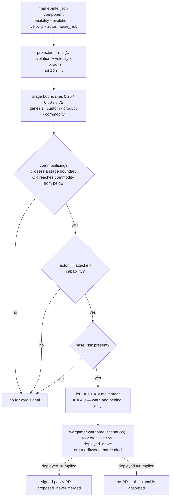
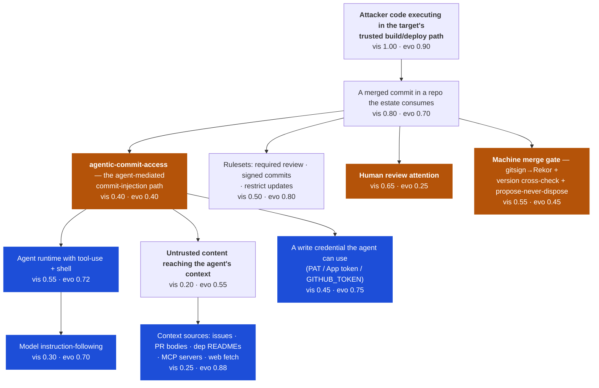
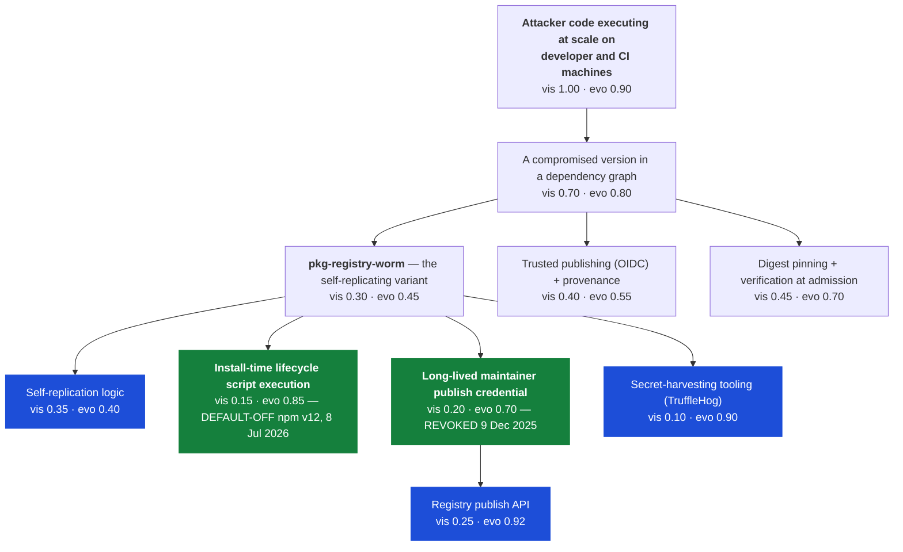

# The war-gaming scenario slate — what earns a place, what does not, and what the machinery cannot carry

**Ticket:** `.scratch/multi-org-estate/issues/05-scenario-slate-research.md` · **Date:** 2026-08-19
**Bar:** `.scratch/talk-spec/pitch-v4/research/quantum-niobium-analysis.md`
**Every number below was executed against the real engine** (`wardley.py`, `tcor.py`, `fair.py`,
`cage.py`, `enforce.py`, `wargamer.py`) at `intel_version` v1 + the proposed additions, horizon 3.
Nothing in the tables is asserted; it is all output.

---

## 0. Headline findings, in order of how much they should change your mind

The ticket asked for a slate. The slate is section 3. But four things fell out of building it that
matter more than any individual entry, and three of them are **negative**.

**F1 — The forward layer is single-org, in an estate whose whole current effort is becoming
genuinely multi-org.** `wardley.forward_signal()` hardcodes `"org": "driftwood"`
(`wardley.py`, `forward_signal`). Every forward result — including the flagship demo beat "the
commoditisation bump is what flips `cage → fix`" — is a property of driftwood's £40k appetite band,
not of the intel. Run the *existing, unmodified* `phishing-kits-aas` signal at ludlow's £5k band and
**it does not drift at all**: base `cage` → forward `cage`. Run `ransomware-aas` at ludlow and the
*reactive base* already implies `fix`, so the deployed `cage` is drift **before** any forward signal.
The claim the platform makes about itself is true for one of six institutions.

**F2 — The forward layer is monotone-pessimistic and structurally cannot price a commoditising
defence.** `_forward_risk()` multiplies `warn.lef` and `behind.lef` by `1 + K × movement` where
`movement ≥ 0`, and does so only for `actor == "attacker-capability"`. There is no path — none — by
which a defensive component moving right lowers `costs.fix`, lowers an LEF, or reduces TCoR. The
estate therefore systematically over-prices any risk whose control is itself commoditising. This is
not hypothetical. While one of the firing entries below was being researched, npm shipped
**default-off install-time lifecycle scripts (npm v12, 8 Jul 2026)** and **revoked every classic
publish token (9 Dec 2025)** — the two primitives that entry's whole propagation path depends on,
withdrawn at platform level, on dated timelines, inside the horizon, at no cost to this estate. The
forward layer can see the worm commoditising. It is structurally blind to the ladder being pulled up
underneath it.

**F3 — The cage move's TCoR is non-monotone in the threat, so "widen K" is unsafe advice.** The
source comment on `ATTACK_COST_COLLAPSE_K` says "widen K if a real trajectory should flip a move
sooner." Measured, that is false. `cage.select_tier()` returns the **loosest tier that fits the
band**, and the tier TCoR curves cross at ALE £3,750 (baseline↔restricted) and £18,182
(restricted↔quarantine) — so above £3,750 the selected tier is never the cheapest available cage, and
each band crossing produces a **discontinuous fall** in cage TCoR. For `phishing-kits-aas` at
driftwood: movement 0.45 → cage £40,181, chosen `fix`; movement 0.50 → cage £20,261, chosen **`cage`
again**. Raising K from 4.0 to 6.0 makes phishing stop drifting. Full sweep in §6.

**F4 — The map's open question about `pq-cryptanalysis` is resolved, and the answer is "editorial,
unsupported at every band".** `map.md` records: "`pq-cryptanalysis`'s base posture already drifts
(`deployed_move: transfer`, but `tcor.crossover` returns `cage`) — either deliberate editorial or a
latent misconfiguration." Measured across all three bands:

| band | fix | cage | transfer | deny | crossover | declared |
|---|---|---|---|---|---|---|
| driftwood £40k | £212,338 | **£39,933** (quarantine) | £1,017,450 | £312,338 | `cage` | `transfer` |
| tuppence £15k | **£212,338** | unavailable | £1,017,450 | £312,338 | `fix` | `transfer` |
| ludlow £5k | **£212,338** | unavailable | £1,017,450 | £312,338 | `fix` | `transfer` |

The declared `transfer` is **never** cheapest, at any band, by a factor of 4.8. It is not an org-band
mispricing — it is an editorial assertion the model does not support. The bar document's own §5
argues at length that transfer is a *bad* move for HNDL (correlated loss, tenor mismatch,
non-indemnifiable in kind). **Those two facts agree.** The honest resolution is to keep
`deployed_move: "transfer"` and write the argument into `note` — "a real org that bought cyber cover
it did not need, which is exactly what the layer exists to catch" — not to quietly change it to
`cage`. Note also that at driftwood the cage is already on the **tightest** tier (`quarantine`) with
only **£6,067 of headroom** — residual £33,933 against a £40k band. An **18%** rise in `behind`
exposure removes the cage move entirely, which is precisely what the forward bump does.

---

## 1. What the machinery actually does — the gates a proposal must pass

Read from source, because the coordinates only mean something against these rules.



Four gates, and a proposal has to be honest about which one it fails:

1. **Movement, not position.** `commoditising` requires crossing a stage boundary (or reaching
   commodity from below) within the horizon. `pq-cryptanalysis` at 0.30 + 0.05×3 = 0.45 stays
   `custom` and **emits nothing today** — confirming the bar document's central claim.
2. **Actor gate.** Only `attacker-capability` reaches the bump. `defensive-capability` and any new
   actor value are silently inert.
3. **Base-risk gate.** No `base_risk`, no forward risk.
4. **Frequency only.** The bump touches `warn.lef` and `behind.lef`. It never touches `lm`, never
   touches `costs`, never touches the `deny` state.

Gate 4 has a consequence worth stating as a theorem, because one of the proposed entries relies on it:

> **The `fix` fixed-point.** `moves()` computes `fix = ale_deny + c_fix` and `deny = ale_deny +
> c_deny`, both from the untouched `deny` state. `cage` is computed from `behind` and `transfer` from
> `warn`, both of which the bump scales **upward**. Therefore **if `fix` is the crossover at the
> reactive base, it remains the crossover at every forward factor ≥ 1, for every K, at every band.**
> A risk already on `fix` is immune to forward attacker-commoditisation signal.

Verified empirically over movement 0 → 1.0 and K ∈ {1, 2, 3, 4, 5, 6, 8}. This is the single most
useful property in the machinery and nothing currently asserts it.

---

## 2. Coverage analysis — what the current five miss

The current feed carries: `pq-cryptanalysis`, `phishing-kits-aas`, `ransomware-aas`,
`credential-stuffing-aas` (already-commodity control case), `spiffe-workload-identity` (defensive
control case). Two live signals, one dormant, two controls.

Every class the ticket named, judged on whether it can pass the four gates **and** say something the
reactive feeds cannot:

| Class | Verdict | Why |
|---|---|---|
| Supply-chain / package-registry compromise | **Feed — earns it** | A genuine commoditisation trajectory: four documented waves of the same self-replicating technique in eleven months, cross-registry by wave four. Reactive feeds see it only after a landed CVE. §3.2 |
| AI agent with commit access | **Feed — earns it** | A new loss path with no reactive coverage at all: no CVE, no EOL date, no threat-register entry describes "the agent committed it". §3.1 |
| Supply-chain / mineral concentration | **Feed — as a deliberate non-firing entry** | Real, loud, and *not on the binding path*. §3.3 |
| Post-quantum migration cost as a control | **Feed — but known-inert; flag the gap** | It is the right idea and the engine cannot carry it (F2). §3.4 |
| Cloud / vendor concentration | **Library only** | Not a commoditisation trajectory. Concentration is movement on market share, and the Wardley evolution axis has no concentration dimension. §4.3 |
| Regulatory regime shift | **Neither — already covered, on the right axis** | And the premise I started with turned out to be wrong: the official data shows frequency rising and magnitude *falling*. §2.1 |
| EOL / obsolescence cascade | **Neither — already covered, on the right axis** | §2.2 |
| Insider (human) | **Library — already there, keep it there** | `insider-abuse` exists in `human-device.json`. The forward/machine counterpart is §3.1; they are different paths, not duplicates. |
| Physical / geopolitical | **No** | §2.3 |
| N-day weaponisation speed | **No — double-counts** | §2.4 |

### 2.1 Regulatory regime shift does not earn a feed slot — but not for the reason I first thought

**I had this wrong, and the correction is worth more than the original argument.**

My first draft argued: a fine-regime shift raises **loss magnitude**, not frequency; `_forward_risk()`
scales `lef` and only `lef`; therefore the forward layer is structurally incapable of expressing a
regulatory change. Neat, and **not supported by the evidence.**

The official numbers point the other way. EDPB annual reports: final Article 60 decisions ran
**442 (2023) → 485 (2024) → 572 (2025)**, a monotonic **+29.4% over two years**, while aggregate
fine value *fell* — *"over EUR 1.9 billion"* (2023) → *"over EUR 1.2 billion"* (2024) →
**€1,145,760,374** (2025)
([EDPB 2025 annual report](https://www.edpb.europa.eu/system/files/2026-04/edpb-annual-report-2025_en.pdf)).
Implied mean value per final decision fell from roughly €4.3m to €2.0m. The European Commission's own
review records *"over 6 680 fines amounting to around EUR 4.2 billion"* cumulatively — a ~€629,000
mean, against which the single Irish DPC €1.2bn Meta fine is ~29% of the entire total
([COM(2024) 357 final](https://eur-lex.europa.eu/legal-content/EN/TXT/HTML/?uri=CELEX:52024DC0357)).
**Frequency up, magnitude down, value dominated by a handful of outliers** — the opposite of the
intuition, and the opposite of what I asserted.

And the UK is running a live natural experiment that makes the point sharper. The **Data (Use and
Access) Act 2025** (royal assent 19 June 2025) routes PECR regs 21–24 into DPA 2018 s.157's higher
tier, taking the ceiling for nuisance marketing from **£500,000 to £17.5m or 4% of worldwide
turnover** — a **35× increase** — commenced **5 February 2026** and expressly **non-retrospective**
([legislation.gov.uk](https://www.legislation.gov.uk/ukpga/2025/18); commencement SI 2026/82 reg 11).
Six and a half months later, **the ICO has issued no PECR fine above £300,000, and the all-time PECR
record remains the £500,000 CRDNN penalty from March 2020 — which was never paid.** The magnitude
effect of the largest UK ceiling change in a decade is, so far, **exactly zero**.

**So the refusal stands, on three better grounds:**

1. **It is a calendar, not a diffusion curve — the same objection as §2.2.** A statutory ceiling
   changes on a commencement date, in one step, non-retrospectively. `evolution + velocity × horizon`
   models a capability diffusing through a population. There is no defensible `velocity` for
   "5 February 2026". This unifies the two refusals under one principle: **the forward feed models
   diffusion; regulatory dates and EOL dates are calendars, and the estate already has feeds shaped
   for calendars.**
2. **It is already covered, on the right axis, with better data.** `estate/ico/schema/` is a
   versioned, signed penalty schema (regime → violation type → formula/cap + real public enforcement
   notices) with its own `to_fair_scenario.py` emitting `lm` triples straight from real fines, across
   UK GDPR higher/lower tier, PCI DSS, HIPAA and FCA. Executed:
   `to_fair_scenario.py build v2/penalty-schema.json uk-gdpr higher-tier` emits
   `lm: [12,700,000, 18,400,000, 24,000,000]`, derived from the TikTok, Marriott and British Airways
   monetary penalty notices, with its selfcheck confirming all 10 (schema-version × regime ×
   violation-type) triples valid. **A regime shift is an `ico` schema version bump** — and the v2
   changelog shows exactly that workflow. Inventing a Wardley component would be a second, worse
   source of truth.
3. **The causal direction is genuinely unresolved, so no coordinate would be honest.** The EDPB
   series measures **enforcement maturation under a legally stable regime** — capacity build-out and
   backlog clearing — not the effect of a regime *changing*. There is no counterfactual and no
   control group, and no source publishes a pre-GDPR comparator series. A `velocity` on a regulatory
   component would be a number with no method behind it, which is precisely what this document is
   supposed to refuse.

**What the evidence *does* justify** is keeping the ICO schema current — the ceilings are real even
if the fines are not yet: NIS2 Art. 34 (essential entities, *"a maximum of at least EUR 10 000 000"*
or 2%; important, €7m or 1.4% — note these are **floors on ceilings**, unlike GDPR's "up to"); CRA
Art. 64 (€15m/2.5%, €10m/2%, €5m/1%), with **Art. 14's 24h/72h/14-day reporting duties applying from
11 September 2026**; EU AI Act Art. 99 (€35m/7%, €15m/3%, and **€7.5m/1% for incorrect information —
1%, not 1.5%**), with high-risk obligations **deferred to 2 Dec 2027 / 2 Aug 2028** by
[Reg. (EU) 2026/1744](https://eur-lex.europa.eu/legal-content/EN/TXT/HTML/?uri=CELEX:32026R1744),
in force 27 July 2026. **Those are `lm` inputs for a signed regulator feed, not Wardley coordinates.**

### 2.2 EOL cascade does not earn a feed slot — wrong curve shape

`estate/platform/feeds/eol/` is a signed, versioned endoflife.date-style feed, and
`to_fair_scenario.py:eol_ramp()` already implements the cascade: LEF ramps linearly at +1× per year
past EOL, capped at 4×, with the ramp asserted monotone and bounded in its selfcheck. Its own note
says the point explicitly — "a policy version going unmaintained is priced like any other EOL risk,
not a bespoke sunset."

The forward feed's model is `evolution + velocity × horizon`: a **diffusion curve**, describing how
widely available a capability has become. An EOL date is a **calendar**: a step function on a
published date, with no diffusion and no uncertainty about position. Forcing a calendar into a
diffusion model would produce a velocity number with no meaning. The reactive feed has the right
shape and already has it.

### 2.3 Physical / geopolitical does not earn a place — two independent reasons

Subsea cable cuts, GPS jamming and grid failure are real. They are also (a) unreachable by any of the
four moves this estate can play — no admission policy, workload identity or dependency pin changes
the exposure, leaving only `transfer`/`deny`, which is what §4.3 already covers generically; and (b)
**a different loss type**. Every `lm` band in this estate is confidentiality/integrity-shaped, drawn
from breach costs and regulatory fines. An availability loss booked into the same balance-sheet line
silently mixes loss types into one aggregate TCoR number that then means nothing. That is a modelling
error, not a coverage gap.

### 2.4 N-day weaponisation speed does not earn a place — it double-counts

Attractive: time-from-CVE-to-public-exploit is genuinely collapsing, and it is genuinely a
commoditisation trajectory. But `feeds/to_fair_scenario.py:cve_scenario()` already derives LEF from
**EPSS**, which *is* an exploit-probability estimate. Multiplying an EPSS-derived LEF by a Wardley
velocity term counts the same evidence twice, and the resulting frequency would be indefensible. If
weaponisation speed should move the number, it should move it by the CVE feed carrying a better EPSS,
not by a second multiplier on top.

---

## 3. The proposed slate

Four new components. Two fire, two are deliberately inert. Every coordinate, triple and cost below
was run through the engine; the resulting map and forward signal are in §3.5.

| id | actor | vis | evo | vel | projected | commoditising | emits? | drift? |
|---|---|---|---|---|---|---|---|---|
| `agentic-commit-access` | attacker-capability | 0.40 | 0.40 | 0.09 | 0.67 `product` | **yes** | **yes**, ×2.08 | **no** |
| `pkg-registry-worm` | attacker-capability | 0.30 | 0.45 | 0.09 | 0.72 `product` | **yes** | **yes**, ×2.08 | **yes** → `cage → fix` |
| `nb-refining-capacity` | supply-constraint | 0.05 | 0.62 | 0.05 | 0.77 `commodity` | **yes** | **no** | — |
| `pqc-transport-migration` | defensive-capability | 0.25 | 0.62 | 0.10 | 0.92 `commodity` | **yes** | **no** | — |

---

### 3.1 `agentic-commit-access` — autonomous coding agents holding repository write access

**Why this class, and why nothing reactive can see it.** There is no CVE for "the agent committed
it", no EOL date, and no threat-register entry. The loss path — untrusted text reaches an agent's
context, the agent holds a credential that writes to a repo the estate distributes policy from — is
invisible to all three reactive feeds by construction.

#### The value chain



*Blue = what the headlines are about. Amber = what actually gates the anchor.*

| # | Component | Vis | Evo | Stage | Placement justification |
|---|---|---|---|---|---|
| 1 | Attacker code in the trusted build path (anchor) | 1.00 | 0.90 | commodity | The need is universal and ancient; only the means change. |
| 2 | A merged commit in a consumed repo | 0.80 | 0.70 | product | Git+PR review is a mature, multi-vendor, off-the-shelf workflow. Not commodity only because merge policy is still bespoke per org. |
| 3 | **`agentic-commit-access`** | 0.40 | 0.40 | **custom** | The load-bearing judgement, and I have priced it **lower than the tooling under it on purpose.** The *technique* is reproducible and CVE-assigned — CVE-2025-53773 (Copilot/VS Code, CVSS 7.8), CVE-2025-54135 (Cursor, NVD 9.8), CVE-2025-61260 (Codex CLI), CVE-2025-54794/54795 (Claude Code) — but **no complete chain has been observed in the wild.** Every prompt-injection-to-commit case is proof-of-concept. Reproducible-but-bespoke and unproven at scale is `custom`, not `product`. |
| 4 | Agent runtime with tool-use + shell | 0.55 | 0.72 | product | Genuinely product: Copilot coding agent, Cursor, Claude Code, Codex CLI, Devin, Jules all sell off a price list and compete on features. GitHub's Copilot coding agent alone opened **1M+ PRs, May–Sept 2025** (Octoverse 2025, first-party). |
| 5 | Model instruction-following | 0.30 | 0.70 | product | Multi-vendor, benchmarked, purchasable per token. Not commodity — capability still differentiates. |
| 6 | **Untrusted content reaching the agent's context** | 0.20 | 0.55 | product | The injection primitive. The *sources* are commodity (below); reliable weaponisation is not — Semgrep's own reproduction of the s1ngularity prompt recorded **Claude refusing the request**, and Anthropic's Nov 2025 report states the model *"frequently overstated findings and occasionally fabricated data"*, calling it *"an obstacle to fully autonomous cyberattacks."* Unreliability is a real, measured brake. |
| 7 | Context sources (issues, PR bodies, deps, MCP, web) | 0.25 | 0.88 | commodity | Free, universal, unauthenticated, and growing. MCP made "attach an arbitrary content source to an agent" a one-line config. |
| 8 | A write credential the agent can use | 0.45 | 0.75 | commodity | PATs, App installation tokens and `GITHUB_TOKEN` are all standard issue. |
| 9 | Rulesets (required review, signed commits) | 0.50 | 0.80 | commodity | Off-the-shelf on GitHub, no paid tier on public repos. On **GitLab, commit-signature enforcement is Premium/Ultimate only** — a real asymmetry if the estate ever moves. |
| 10 | **Human review attention** | 0.65 | 0.25 | **genesis/custom boundary** | **The binding constraint, and the lowest-evolution component on the map.** You cannot buy more of it, it does not commoditise, and it degrades exactly as agent PR volume rises. Pricing it at 0.25 is the single judgement I would most expect to be challenged. |
| 11 | **Machine merge gate** (this estate's) | 0.55 | 0.45 | custom | gitsign → Fulcio → Rekor, the version cross-check gate, and `wargamer.py`'s structural absence of a `merge()`. Bespoke — the estate built it — which is why it is `custom`, and why it is cheap to extend. |

**The finding.** The loud component (4, agent runtimes) is at product and racing right. The binding
component is (10) human review attention, at 0.25 and **stationary**. Between those two sits the
whole risk. An estate that answers rising agent volume with "more careful review" is levering on the
one component that cannot commoditise. This estate did the other thing — it replaced (10) with (11),
a machine gate — and that is why the fix below is cheap and already deployed.

#### The causal chain, link by link

| # | Link | Strength | Why |
|---|---|---|---|
| L1 | Agent adoption rises → more agents hold write credentials | **Strong** | Stack Overflow 2025: ~30.9% of developers currently use *agents* (n=31,877); DORA 2025: 90% AI adoption, +14pp YoY. Write access is the default posture for the coding-agent product category. |
| L2 | Write credential + untrusted context → injected instruction reaches a commit | **Moderate** | Demonstrated repeatedly and independently (Rehberger on Copilot/Jules/Devin, Aim on Cursor, Legit on GitLab Duo and Copilot Chat, Check Point on Codex CLI). Damped by model refusal and hallucination (component 6). |
| L3 | Injected commit → **merged** into a repo the estate consumes | **Weak** | This is where the chain breaks, and it is the honest core of the entry. **No observed in-the-wild case.** Copilot's cloud agent cannot mark its own PR ready, cannot approve or merge, pushes to one branch, and runs no workflows until a human clicks *Approve and run workflows*. |
| L3′ | …**unless the agent is a ruleset bypass actor** | **Moderate** | GitHub's own documented remedy for a strict ruleset that blocks the agent is to *add Copilot as a bypass actor*. The supported fix for "my rules block the agent" is to exempt the agent from the rules. That is the real path, and it is a configuration, not an exploit. |
| L3″ | …**or the credential is not `GITHUB_TOKEN`** | **Moderate** | GitHub docs: events triggered by `GITHUB_TOKEN` do not start new workflow runs; the documented workaround is a GitHub App token or PAT — which **does** trigger them. The loop-prevention safety property vanishes the moment an agent is given anything better than `GITHUB_TOKEN`. |
| L4 | Merged commit → distributed to consuming institutions | **Strong** | This estate distributes policy as signed semver git tags consumed by pinned Flux `GitRepository` refs. A merged commit in the policy repo is, by design, a change that propagates. |
| L5 | Distribution → loss | **Moderate-to-strong** | Conditional on what the commit does. A policy weakened from `Deny` to `Audit` is a silent, estate-wide loss of a gate. |

**Composition: Strong × Moderate × Weak × Strong × Moderate is weak-to-moderate overall** — and it
is weak at exactly one link, L3, which a *configuration choice* (L3′/L3″) converts from Weak to
Moderate. That is the actionable finding: this risk is governed by a merge-gate setting, not by
model behaviour.

**Estate-specific aggravator.** The hub org has *"Allow GitHub Actions to create and approve pull
requests"* enabled at org level (per project notes, enabled 2026-08-15). GitHub's default for new
orgs is **off**; the org toggle overrides repo and workflow settings. That setting is precisely L3′
turned on estate-wide, and it is the strongest single argument that this component belongs in the
feed for *this* estate rather than in general.

#### The risk: `agentic-commit-compromise`

```json
{
  "id": "agentic-commit-compromise",
  "name": "forward (AI-Wardley): agent-mediated malicious commit into the policy distribution",
  "deployed_move": "fix",
  "warn":   {"lef": [0, 1, 4], "lm": [40000, 150000, 600000]},
  "behind": {"lef": [0, 1, 3], "lm": [40000, 150000, 600000]},
  "deny":   {"lef": [0, 0, 1], "lm": [40000, 150000, 600000]},
  "costs":  {"fix": 15000, "deny": 250000,
             "transfer": {"load": 0.9, "deductible": 40000}}
}
```

- **`lm` [40k, 150k, 600k]** — editorial, and anchored on the estate's own existing band rather than
  on any breach survey. The CVE feed prices a `critical` at [50k, 150k, 400k]; this shares the mode
  and widens the tail, because the blast radius is six consuming institutions rather than one image.
  **There is no defensible published cost figure for this loss type** and I have not pretended
  otherwise (see §7).
- **`warn.lef` [0, 1, 4]** — mode 1/yr. Justified by L3: the *attempt* rate is high and rising, the
  *merge* rate is what is priced, and no complete in-the-wild chain has been observed. A mode above 1
  would assert an incident rate the evidence does not support.
- **`behind` [0, 1, 3]** — a cage (branch protection + review) narrows but does not close it, exactly
  as `stolen-laptop-unattested-device` reasons in the existing library.
- **`costs.fix` £15,000** — the marginal cost of extending machinery the estate already owns:
  agents get no standing write credential, a distinct Fulcio identity, and every agent change rides
  the existing cross-check gate. Comparator: the library prices WebAuthn-everywhere at £6,000 with
  the note *"a cheap, decisive control, so fix stays cheapest"*. Same pattern, six repos.
- **`costs.deny` £250,000** — ban agents from all six repos. Real lost productivity (DORA 2025:
  median 2h/day working with AI), and the reason `deny` is not the answer.

#### Engine result — the signal fires and is **absorbed**

| band | fix | cage | transfer | deny | crossover |
|---|---|---|---|---|---|
| driftwood £40k · base | **£20,909** | £25,193 (quarantine) | £562,284 | £255,909 | `fix` |
| driftwood £40k · forward ×2.08 | **£20,909** | unavailable | £1,194,535 | £255,909 | `fix` |
| tuppence £15k · base / forward | **£20,909** | unavailable | £562,284 / £1,194,535 | £255,909 | `fix` / `fix` |
| ludlow £5k · base / forward | **£20,909** | unavailable | £562,284 / £1,194,535 | £255,909 | `fix` / `fix` |

`deployed_move: fix` == implied at base **and** forward → **no drift, no PR.** See §5.

---

### 3.2 `pkg-registry-worm` — self-replicating package-registry supply-chain worms

**Why this class.** It is the clearest commoditisation trajectory available: the same
self-replicating technique ran four times in eleven months, and generalised across registries by the
fourth.

- **Wave 1, Shai-Hulud, Sept 2025.** GitHub removed **500+ compromised packages**
  ([GitHub, 22 Sep 2025](https://github.blog/security/supply-chain-security/our-plan-for-a-more-secure-npm-supply-chain/));
  CISA independently describes *"a self-replicating worm… has compromised over 500 packages"*
  ([CISA, 23 Sep 2025](https://www.cisa.gov/news-events/alerts/2025/09/23/widespread-supply-chain-compromise-impacting-npm-ecosystem)).
  CERT/CC **VU#534320** confirms the mechanism: a `postinstall` `bundle.js` used **TruffleHog** to
  harvest secrets, then republished itself using stolen npm credentials
  ([kb.cert.org](https://www.kb.cert.org/vuls/id/534320)).
- **Wave 2, Shai-Hulud 2.0, Nov 2025.** GitHub: *"updated to enable cross-victim credential exposure…
  endpoint command and control via self-hosted runner registration… and destructive functionality"*
  ([GitHub, 23 Dec 2025](https://github.blog/security/supply-chain-security/strengthening-supply-chain-security-preparing-for-the-next-malware-campaign/)).
  First-party victim account: Postman took **~11 hours** from malicious publish to full unpublish
  ([Postman Engineering, 24 Nov 2025](https://blog.postman.com/engineering/shai-hulud-2-0-npm-supply-chain-attack/)).
- **Wave 3, "Mini Shai-Hulud", May 2026.** Microsoft describes it as the first supply-chain attack to
  span **npm and PyPI simultaneously** in one coordinated operation
  ([Microsoft, 20 May 2026](https://www.microsoft.com/en-us/security/blog/2026/05/20/mini-shai-hulud-compromised-antv-npm-packages-enable-ci-cd-credential-theft/)).
- **Predecessor for contrast: xz-utils, CVE-2024-3094, CVSS 10.0**, disclosed by Andres Freund on
  oss-security 29 Mar 2024 ([openwall](https://www.openwall.com/lists/oss-security/2024/03/29/4),
  [NVD](https://nvd.nist.gov/vuln/detail/CVE-2024-3094)). A multi-year *maintainer-trust* compromise
  with **no self-replication** and near-zero real exploitation. That contrast **is** the
  commoditisation: 2024 needed a three-year human social-engineering campaign; 2025 needed an
  off-the-shelf secret scanner and a stolen token.

#### The value chain



*Green = components being **withdrawn** by the platform on dated timelines inside the horizon.*

| # | Component | Vis | Evo | Stage | Placement justification |
|---|---|---|---|---|---|
| 3 | **`pkg-registry-worm`** | 0.30 | 0.45 | **custom** | Reproducible, publicly documented, four waves — but there is no marketplace listing for "registry worm as a service", and the four waves plausibly share one toolchain lineage. Repeated-by-one-actor is `custom`, not the multi-vendor competition that defines `product`. 0.50 would also be defensible and changes nothing: same movement, same crossing, same flip (§3.5). |
| 4 | **Install-time lifecycle script execution** | 0.15 | 0.85 | commodity | The propagation primitive in both waves. **npm v12 (8 Jul 2026) stopped running `preinstall`/`install`/`postinstall` for dependencies unless explicitly allowed** ([GitHub changelog](https://github.blog/changelog/2026-07-08-npm-install-time-security-and-gat-bypass2fa-deprecation/)). Commodity, and being switched off. |
| 5 | **Long-lived maintainer publish credential** | 0.20 | 0.70 | product | **All npm classic tokens permanently revoked 9 Dec 2025**; `npm login` now issues a 2-hour session token, granular write tokens capped at 90 days ([GitHub changelog](https://github.blog/changelog/2025-12-09-npm-classic-tokens-revoked-session-based-auth-and-cli-token-management-now-available/)). |
| 6 | Secret-harvesting tooling (TruffleHog) | 0.10 | 0.90 | commodity | Off-the-shelf open source, used unmodified in both waves (CERT/CC VU#534320; Microsoft Dec 2025). The attacker wrote none of it. |
| 9 | Trusted publishing (OIDC) + provenance | 0.40 | 0.55 | product | Available on npm since Jul 2025, PyPI since Apr 2023. Adoption is the gap: PyPI's own figures for 2025 are **17% of uploads carrying an attestation** and **>20% via trusted publishers** ([PyPI, 31 Dec 2025](https://blog.pypi.org/posts/2025-12-31-pypi-2025-in-review/)). npm publishes no equivalent figure. |

**The finding, and it cuts against the entry.** The two components the worm most depends on are
being **removed at platform level, on dated timelines, inside the 3-year horizon** — and *neither
removal is this estate's doing*. The forward layer sees the worm commoditising and is structurally
blind to the ladder being pulled up (F2). I am proposing the component anyway, for a reason I want
on the record: **`evolution` measures the attacker's cost and reproducibility; registry hardening is
a control, and controls belong in `costs.fix` and the `deny` state, not in the component's
position.** A reasonable reviewer could disagree, and if they do the honest response is a lower
`velocity`, not a lower `evolution`. At velocity 0.06 the entry still crosses and still flips (§3.5).

#### The causal chain

| # | Link | Strength | Why |
|---|---|---|---|
| L1 | Technique is public → more actors run it | **Strong** | Four waves in 11 months; toolkit is off-the-shelf (TruffleHog, Bun, GitHub Actions runner); generalised npm→PyPI by wave four. |
| L2 | A worm reaches a package the estate depends on | **Moderate** | Real but bounded: this estate's dependency surface is Go/OCI/Kyverno-shaped, not npm-heavy. **This is the weakest link and the reason `warn.lef` mode is 2, not 6.** |
| L3 | Compromised package executes in a build | **Moderate — and falling** | Was Strong. npm v12's default-off lifecycle scripts cut the primary primitive; digest pinning cuts it further. Rating it Strong today would ignore a dated, shipped, first-party change. |
| L4 | Execution → credential exfiltration | **Strong** | Confirmed by CISA and CERT/CC: GitHub PATs plus AWS, GCP and Azure keys, harvested by TruffleHog and exfiltrated automatically. |
| L5 | Exfiltrated credentials → loss | **Strong** | Direct: forced estate-wide rotation of npm tokens, GitHub PATs, CI secrets and three clouds' credentials (CISA's own remediation list), plus whatever the credentials reach before rotation completes. |

**Composition: Strong × Moderate × Moderate × Strong × Strong is moderate overall** — materially
stronger than the agentic chain, because every link but L2/L3 is evidenced by first-party incident
reporting rather than by proof-of-concept.

#### The risk: `dependency-worm-exfil`

```json
{
  "id": "dependency-worm-exfil",
  "name": "forward (AI-Wardley): self-replicating registry worm reaches a build",
  "deployed_move": "cage",
  "warn":   {"lef": [0, 2, 7], "lm": [25000, 100000, 450000]},
  "behind": {"lef": [0, 2, 6], "lm": [25000, 100000, 450000]},
  "deny":   {"lef": [0, 0, 1], "lm": [25000, 100000, 450000]},
  "costs":  {"fix": 70000, "deny": 350000,
             "transfer": {"load": 0.8, "deductible": 50000}}
}
```

- **`behind` ≈ `warn` — the load-bearing choice.** For every other risk in this estate the cage
  collapses the residual substantially. Here it barely does, and the reason is specific: the cage for
  this class is **signature-matching SCA scanning**, which is near-useless against a *novel
  self-replicating* package on its first wave. Postman — a well-resourced vendor with a dedicated
  security team — still took ~11 hours from publish to unpublish. `behind` mode 2 against `warn`
  mode 2 encodes "the cage catches the tail, not the head", and that is what makes this entry flip
  under a forward bump rather than absorb it.
- **`lm` [25k, 100k, 450k]** — editorial, bottom-up. **There is no defensible published figure for
  the cost of a dependency compromise** (§7). IBM's "third-party vendor and supply chain compromise"
  average mixes SaaS-vendor breaches with package compromise, is a ~600-org self-reported survey, and
  measures *data-breach* cost when most Shai-Hulud victims incurred *credential-rotation* cost. The
  band is instead scaled to the estate's own `critical` CVE band and to the rotation scope CISA
  itself published.
- **`costs.fix` £70,000** — digest pinning plus provenance verification at admission across six
  orgs, plus trusted-publishing migration. Note the ceiling honestly: **npm provenance is SLSA Build
  L2, not L3** ([slsa.dev, 11 May 2023](https://slsa.dev/blog/2023/05/bringing-improved-supply-chain-security-to-the-nodejs-ecosystem)).
  It proves which repo and workflow built the artefact; it does **not** protect against a compromised
  build. A worm that compromised a *workflow* rather than a *token* would still produce validly
  attested malicious packages. The £70k buys L2, and the residual reflects that.

#### Engine result — the signal fires and **flips the move**

| band | fix | cage | transfer | deny | crossover |
|---|---|---|---|---|---|
| driftwood £40k · base | £74,240 | **£33,256** (quarantine) | £706,467 | £354,240 | `cage` == deployed |
| driftwood £40k · forward ×2.08 | **£74,240** | unavailable | £1,421,649 | £354,240 | **`fix`** → drift → PR |

Flip threshold: movement ≥ 0.15 against an actual movement of 0.27 — a **1.8× margin**, and no
reversal anywhere in movement 0 → 1.0 (§6). At tuppence and ludlow the *base* already implies `fix`,
so the declared `cage` is driftwood's posture and should be labelled as such (F1).

---

### 3.3 `nb-refining-capacity` — the deliberate non-firing entry (loud signal, no forward signal)

This is the bar document's own recommendation, ported into the machinery: *"the correct thing to do
is add a new component… and show it not propagating. A forward layer that can say 'this loud thing
changes nothing above it' is more credible to a technical audience than one that finds every headline
material."*

```json
{
  "id": "nb-refining-capacity",
  "label": "Qubit/SRF-grade niobium refining + target-fab capacity",
  "actor": "supply-constraint",
  "visibility": 0.05, "evolution": 0.62, "velocity": 0.05,
  "links_risk": "pq-harvest-now-decrypt-later",
  "base_risk": { ...identical to pq-cryptanalysis's base_risk... }
}
```

**Coordinates.** Straight from the bar document's component table: qubit-grade Nb at evolution 0.62
(*"a specialist product with a handful of qualified suppliers of EB-melted high-RRR ingot and 4N/4N5
sputtering targets — priced per kg, purchasable, but not a spot commodity"*), visibility 0.05.
Velocity 0.05 encodes the headline's only real effect (link L2′: lower-contaminant feedstock shortens
the purification chain), damped for the 5–15 year lag from discovery to steady output.

**What it does in the engine.** 0.62 + 0.05×3 = **0.77 → crosses `product` into `commodity` →
`commoditising: true`.** It is the loudest new flag on the map. And `forward_signal()` emits
**nothing** for it, because `actor != "attacker-capability"`.

**Why it is honest rather than contrived — three reasons, and the third is the one that matters.**

1. **The coordinates are not chosen to make a test pass.** They are the bar document's, arrived at
   before any of this machinery was considered.
2. **The causal chain genuinely fails.** The bar document rates the chain Strong × Weak × Moderate ×
   Very-weak × Weak × Moderate and concludes weak overall, because the binding constraints (logical
   qubits at evo 0.22, surface chemistry at 0.20) sit far to the *left* of niobium at 0.62/0.88.
   Easing a commodity component that is not on the binding path produces very little movement above
   it. The non-fire is the correct answer, not a convenient one.
3. **It carries a full `base_risk`, so the assertion cannot pass vacuously.** This is the point I
   care most about, and it is a direct application of the map's *"a check that passes because it
   could not look is worse than a red one."* `credential-stuffing-aas`, the existing control case, has
   `base_risk: null` — so an assertion that it does not fire would pass even if the actor gate were
   deleted. `nb-refining-capacity` has a real, complete base risk, links to a real risk id, and flags
   `commoditising: true`. **The only thing stopping it is the actor gate. Proven by flipping it:**

   ```
   actor = "supply-constraint"     -> emits: phishing, ransomware, agentic, dep-worm
   actor = "attacker-capability"   -> emits: phishing, ransomware, agentic, dep-worm, nb-refining-capacity
                                      ...and produces drift on pq-harvest-now-decrypt-later
   ```

   Flip one string and the test fails. That is a non-vacuous assertion.

**The demo beat this buys.** Two components on the map link to the *same* risk. One is on the binding
path (`pq-cryptanalysis`); one is not (`nb-refining-capacity`). The loud one is the one that is not.
The forward layer prices only the binding one — and says so.


### 3.4 `pqc-transport-migration` — post-quantum migration as a *control*, and why it still cannot help

The ticket asked for "post-quantum migration cost as a control rather than a threat". It is the right
instinct, and the answer has two layers, both negative.

```json
{
  "id": "pqc-transport-migration",
  "label": "Post-quantum transport-crypto migration tooling",
  "actor": "defensive-capability",
  "visibility": 0.25, "evolution": 0.62, "velocity": 0.10,
  "links_risk": null, "base_risk": null,
  "note": "KNOWN-INERT. Flags commoditising and emits nothing: the forward layer has no path by which a commoditising defence lowers a cost. Carried to make that gap visible on the map rather than buried in _forward_risk()."
}
```

**Coordinates, and why `product` rather than `commodity`.** Transport-crypto PQC is genuinely
purchasable-and-default today:

- **FIPS 203 / 204 / 205 published 13 Aug 2024** ([NIST](https://csrc.nist.gov/pubs/fips/203/final)).
- **OpenSSL 3.5, 8 Apr 2025, an LTS release supported to 2030**, ships ML-KEM, ML-DSA and SLH-DSA, and
  *"The default TLS keyshares have been changed to offer X25519MLKEM768"*
  ([release notes](https://openssl-library.org/news/openssl-3.5-notes/)). Hybrid PQ is the default in
  the base TLS library of most of the Linux world, eight months after the standards.
- **OpenSSH has defaulted to a PQ hybrid KEX since 9.0 (Apr 2022)**, and to `mlkem768x25519-sha256`
  since **10.0 (9 Apr 2025)** ([release notes](https://www.openssh.com/releasenotes.html)).
- Default-on in **Chrome 124** (May 2024, Kyber) and later ML-KEM, **Firefox 132** (29 Oct 2024),
  **Safari 26 / iOS 26** (Sept 2025), **Go 1.24** (Feb 2025), **JDK 24** (Mar 2025, JEP 496/497).

That is multi-vendor, off-a-price-list, default-on — `product`, and moving. It is **not** commodity,
for one measured reason: **Cloudflare Radar, retrieved 2026-08-19, shows 71.2% of human HTTPS request
traffic post-quantum encrypted but only 12.4% of scanned customer origin servers PQ-ready.** The
supply has commoditised; the deployment has not. (Cloudflare's own network, not the internet — and
the 71.2% substantially measures *client* defaults against a server that is already PQ-enabled. The
12.4% is the honest server-side number.) Trend on the same network: 29% (Jan 2025) → 52% (Dec 2025)
→ 71.2% (Aug 2026), which is what velocity 0.10 encodes.

#### Layer one: the engine cannot carry it (F2)

`_forward_risk()` fires only for `actor == "attacker-capability"` and touches only `lef`. A
commoditising defence cannot lower `costs.fix`, cannot lower an LEF, cannot reduce TCoR. So this
component is **known-inert on arrival** — exactly like `spiffe-workload-identity`, and I am proposing
it with that written into its `note` rather than pretending otherwise.

#### Layer two — and this is the finding — the commoditised half is not the half that sets `costs.fix`

**Even if F2 were fixed, wiring `pqc-transport-migration` to `pq-harvest-now-decrypt-later`'s
`costs.fix: 200000` would be wrong**, because transport key agreement is not what that £200k buys.
The cost is dominated by components that are at genesis and **not moving**:

| Cost driver | Where it sits | Evidence it is not commoditising |
|---|---|---|
| **Cryptographic discovery / inventory** | genesis, ~0.20 | CISA, *Strategy for Migrating to Automated PQC Discovery and Inventory Tools* (15 Aug 2024): *"**Most of the nine data items cannot be detected or collected using currently available automated tools, and therefore, are manually collected.**"* Two years later, EO 14412 (22 Jun 2026) only *commissions* the "minimum elements for a cryptographic bill of materials", due ~March 2027. **The CBOM standard does not yet exist.** |
| **Signatures / WebPKI** | genesis, ~0.15 | Cloudflare, Oct 2025: *"a lot of Internet traffic is protected by post-quantum key agreement, but **not a single public post-quantum certificate is used**."* ML-DSA-44 adds ~15 kB to a handshake. NCSC (Mar 2025): *"**There is not yet agreement on how to incorporate post-quantum signatures into WebPKI certificates**."* OMB M-26-15 puts signature migration in Phase 4 (**2031**) — a year after key establishment. |
| **Hardware roots of trust / secure boot** | genesis, ~0.10 | NIST CSWP 39 (19 Dec 2025): *"The public key and the program for verifying the signatures are included in the boot code and **cannot be updated**."* And: *"the cost of deploying a PKI root of trust is significant."* |
| **Hybrid as a stopgap** | — | NIST IR 8547 §3.2: hybrid solutions *"are typically expected to be temporary measures that lead to a **second transition**."* OMB M-26-15: *"an intricate and resource-intensive stopgap."* **Budget two migrations, not one.** |
| **Transport key agreement** | **product, 0.62, moving** | Everything in the coordinates section above. **This is the only part that has commoditised, and it is the cheapest part.** |

**So the structure is identical to the niobium finding, and that is why it belongs in this document.**
The loud, measurable, headline-friendly component (transport crypto: default-on everywhere, a number
on a public dashboard) is **not on the binding path**. The binding components — discovery, signatures,
roots of trust — generate no headlines, sit at ~0.10–0.20, and are stationary. A forward layer that
reduced `costs.fix` on the strength of the transport number would be making exactly the error the bar
document exists to catch, and it would make the estate's PQC posture look cheaper than it is.

**Cost evidence, and the honest gap.** The only published figure is **$7.1bn to migrate priority US
federal systems 2025–2035**, and its own author disclaims it: GAO-25-107703 (21 Nov 2024) records
that OMB *"identified concerns with the accuracy"* and that it *"represents an initial rough order of
magnitude projection with a high level of uncertainty"*
([GAO](https://www.gao.gov/assets/gao-25-107703.pdf)). It covers priority systems of US federal
civilian agencies over eleven years and cannot be divided into a per-organisation number. **No
credible per-organisation PQC migration cost figure exists from any first-party source**, and NCSC
declines to give one. The estate's £200k is editorial, and stays editorial.

**Counter-pressure worth recording.** EO 14412 (22 Jun 2026) moved the US federal deadline for
high-value assets **forward** — PQC key establishment by 31 Dec 2030, signatures by 31 Dec 2031 — and
Sec. 6(c) directs a FAR rule requiring **covered contractors to comply by 31 Dec 2030**. UK NCSC's
milestones remain 2028 discovery / 2031 highest-priority / 2035 complete, and are *guidance, not
regulation*. Falling unit cost and compressing schedules pull in opposite directions; neither is
visible to the forward layer.

**Recommendation.** Add the component, with the `note` above. Do **not** wire it to `costs.fix`, and
do not treat F2 as an obvious fix — this entry is the concrete case showing that a naive F2 fix would
make the numbers *worse*, not better. If F2 is ever addressed, the defensible design is to let a
defensive component lower `costs.fix` **only when it is named as being on that cost's binding path**,
which means the intel file needs to carry that relationship and does not today.


### 3.5 The whole slate, executed

`wardley.build_map()` over v1 + the four proposed components, horizon 3:

| id | actor | evo | stage | projected | projected stage | movement | commoditising |
|---|---|---|---|---|---|---|---|
| `pq-cryptanalysis` | attacker-capability | 0.30 | custom | 0.45 | custom | 0.15 | **false** |
| `phishing-kits-aas` | attacker-capability | 0.60 | product | 0.96 | commodity | 0.36 | true |
| `ransomware-aas` | attacker-capability | 0.70 | product | 0.94 | commodity | 0.24 | true |
| `credential-stuffing-aas` | attacker-capability | 0.82 | commodity | 0.91 | commodity | 0.09 | **false** |
| `spiffe-workload-identity` | defensive-capability | 0.55 | product | 0.85 | commodity | 0.30 | true |
| **`agentic-commit-access`** | attacker-capability | 0.40 | custom | 0.67 | product | 0.27 | **true** |
| **`pkg-registry-worm`** | attacker-capability | 0.45 | custom | 0.72 | product | 0.27 | **true** |
| **`nb-refining-capacity`** | supply-constraint | 0.62 | product | 0.77 | commodity | 0.15 | **true** |
| **`pqc-transport-migration`** | defensive-capability | 0.62 | product | 0.92 | commodity | 0.30 | **true** |

`forward_signal()` emits **4** risks — `phishing-kits-aas` ×2.44, `ransomware-aas` ×1.96,
`agentic-commit-access` ×2.08, `pkg-registry-worm` ×2.08. **Seven of nine components flag
`commoditising`, and three of those seven emit nothing** (`spiffe-workload-identity`,
`nb-refining-capacity`, `pqc-transport-migration`) — by design, and for two different reasons.

**The existing `wardley.selfcheck()` passes unchanged against the proposed v2 intel:**

```
ok  Wardley map: 9 components, 7 flagged commoditising (movement, not position); forward signal:
    4 attacker-capability(ies) re-priced (phishing collapse x2.44); fed through the war-gamer
    -> 3 forward drift(s) -> 3 PR(s) proposed, 0 merged, all gated.
```

Nothing in the slate requires weakening an existing assertion — which is the minimum bar for
additions to a suite whose stated value is that it fails when it cannot see.

`forward_into_wargamer()`:

```
phishing-credential-theft-forward   deployed=cage   implied=fix    drift=True
ransomware-workload-forward         deployed=cage   implied=fix    drift=True
agentic-commit-compromise           deployed=fix    implied=fix    drift=False   <-- absorbed
dependency-worm-exfil               deployed=cage   implied=fix    drift=True
proposals: 3 (0 merged, all gated)
```

**Robustness to coordinate choice.** Wardley positions are always judgement, so both new firing
entries were re-run across the alternatives a reasonable reviewer would propose:

| component | evo | vel | movement | crosses? | implied move |
|---|---|---|---|---|---|
| `agentic-commit-access` | 0.40 | 0.09 | 0.27 | yes | `fix` |
| | 0.35 | 0.12 | 0.36 | yes | `fix` |
| | 0.50 | 0.06 | 0.18 | **no** | `fix` |
| | 0.40 | 0.06 | 0.18 | yes | `fix` |
| `pkg-registry-worm` | 0.45 | 0.09 | 0.27 | yes | `fix` |
| | 0.45 | 0.06 | 0.18 | yes | `fix` |
| | 0.50 | 0.09 | 0.27 | yes | `fix` |
| | 0.40 | 0.12 | 0.36 | yes | `fix` |

Neither conclusion depends on the digit. `agentic-commit-access` implies `fix` under every
coordinate, including the one where it does not cross at all (§1's fixed-point theorem);
`pkg-registry-worm` flips to `fix` under every coordinate a reviewer could reasonably substitute.

---

## 4. Feed vs library — the ticket's explicit question

### 4.1 The five axes

They are not two places to put the same thing. They differ on **five** axes, and four of them are
verifiable from the filesystem rather than from anyone's intent.

| | `wardley/intel/market-intel.json` (the forward feed) | `wargamer/scenarios/human-device.json` (the standing library) |
|---|---|---|
| **Attestation** | **Signed.** `market-intel.json.sig` + `map/wardley-map.json.sig`, detached, feeds key; `verify-wardley.sh` proves a tampered map fails. | **Unsigned.** No `.sig` in `scenarios/`. |
| **Versioning** | `intel_version`, bumped as a published artefact; the rendered map is re-signed with it. | No version field. Edited in place. |
| **Provenance** | Machine-derived. `_forward_risk()` stamps `author: "ai-generated"` on everything it emits. | Human-curated. Each risk carries `author: "human-seed"` or `"ai-generated"`; the wargamer selfcheck **asserts both are present**. |
| **Temporality** | **Forward.** Prices a threat that has not landed, from a trajectory. | **Standing.** Prices the current posture of a path that already exists. |
| **Ownership** | Published by `platform` — an upstream dependency the war-gamer *consumes*. | Owned by the war-gamer — its own working set. |

The one-sentence rule that falls out:

> **The feed carries the trajectory. The library carries the posture.** A component belongs in the
> feed if there is a defensible answer to "how fast is this moving right, and what published evidence
> sets that rate?" A risk belongs in the library if there is a defensible answer to "what are we
> doing about it today, and what would it cost to do something else?"

Which is why several things belong in **both, with different framings** — and the existing file
already does this, though it does so incoherently. `ransomware-workload` appears in the library
(org `tuppence`, `deployed_move: deny`) and `ransomware-workload-forward` in the feed (org
`driftwood`, `deployed_move: cage`). Same underlying risk, two orgs, two bands, two declared
postures. That is not a deliberate two-framing design; it is drift between two files nobody
cross-checks.

### 4.2 A concrete incoherence, measured

The standing library declares `org: "tuppence"` (band £15k);
the forward signal hardcodes `driftwood` (band £40k). The *identical* `pq-harvest-now-decrypt-later`
triples therefore imply `fix` in the library and `cage` in the feed. Priced across all three bands,
the standing library's five risks come out:

| risk | deployed | driftwood £40k | tuppence £15k (live) | ludlow £5k |
|---|---|---|---|---|
| `phishing-credential-theft` | fix | fix | **fix** — no drift | fix |
| `stolen-laptop-unattested-device` | cage | cage | **cage** — no drift | fix |
| `insider-abuse` | transfer | cage | **fix** — drift | fix |
| `ransomware-workload` | deny | fix | **fix** — drift | fix |
| `pq-harvest-now-decrypt-later` | transfer | cage | **fix** — drift | fix |

Note `phishing-credential-theft` (deployed `fix`, `costs.fix: 6000`) does not drift at **any** band —
the `fix` fixed-point of §1, already present in the estate and unremarked.

**Recommendation.** Give each library risk and each feed component an explicit `org`, and have
`forward_signal()` read it rather than hardcoding driftwood (F1). Until that lands, every forward
claim should be stated as "at driftwood's band", not as a property of the estate. In a six-org estate
this is not a nicety; the demo currently generalises a one-org result.

### 4.3 Cloud / vendor concentration — the case for library-only, and the one entry that uses `applicable`

**The risk is real, and regulators have now formally conceded it.** Four verified outages, durations
computed from the vendors' own timestamps: **CrowdStrike** 19 Jul 2024, crash window 04:09–05:27 UTC,
Microsoft's own **estimate** *"8.5 million Windows devices, or less than one percent of all Windows
machines"* ([Microsoft](https://blogs.microsoft.com/blog/2024/07/20/helping-our-customers-through-the-crowdstrike-outage/));
**AWS us-east-1** 19–20 Oct 2025, **14h 32m**, root cause *"a latent race condition in the DynamoDB
DNS management system"* ([AWS](https://aws.amazon.com/message/101925/)); **Azure Front Door**
29–30 Oct 2025, **8h 24m**, valid customer config changes across two control-plane build versions
exposing *"a latent bug in the data plane"* (Microsoft PIR YKYN-BWZ); **Cloudflare** 18 Nov 2025,
**5h 46m**, *"Cloudflare's worst outage since 2019"*
([Cloudflare](https://blog.cloudflare.com/18-november-2025-outage/)). Note what none of them
published: **no vendor states a service count, an affected-customer count, or a traffic percentage.**
Every such figure in circulation is third-party estimation, and none is used here.

The regulators have gone further than the incident record. **SI 2026/777 (made 8 July 2026, in force
13 July 2026) designates Amazon Web Services EMEA, Google Cloud EMEA, Microsoft Ireland Operations
and Oracle Corporation UK as Critical Third Parties** under FSMA 2000 ss.312L–312W
([legislation.gov.uk](https://www.legislation.gov.uk/uksi/2026/777/made)) — the statutory test being
that failure *"could threaten the stability of, or confidence in, the UK financial system."* The
FCA's Nikhil Rathi: *"when the same providers serve thousands of firms, a single failure can
reverberate across the financial system"*
([Bank of England](https://www.bankofengland.co.uk/news/2026/july/uk-financial-regulators-to-begin-overseeing-critical-third-parties-announced-by-hmt)).
The EU designated **19 critical ICT third-party providers on 18 Nov 2025**, reaching well past cloud
into systems integration, colocation, telecoms and market data ([ESMA](https://www.esma.europa.eu/sites/default/files/2025-11/List_of_designated_CTPPs.pdf)).

**And yet it still fails the feed.** Concentration is not a commoditisation trajectory. The Wardley
evolution axis measures how *evolved* a component is — genesis to commodity — and cloud infrastructure
is already at the commodity end and has been for years. What changed, and what people mean by
"concentration risk", is **market share**: the CMA's Final Decision (31 Jul 2025) puts Microsoft and
AWS each at **[30–40]% of UK+EEA IaaS in 2024** and concludes *"competition is not working well"*
([CMA](https://assets.publishing.service.gov.uk/media/688b20e6ff8c05468cb7b120/summary_of_final_decision.pdf)).
**The evolution axis has no concentration dimension**, and there is no honest `velocity` for a
component that is not moving right — it is already there. Forcing it into the feed would produce a
component whose `velocity` encoded something other than commoditisation, which is the one thing the
field is defined to mean.

Note also what the designations imply for the *moves*, not the position: CTP and CTPP oversight lands
**on the provider, not on the firm** — the Bank of England is explicit that *"designation under this
regime is not the same as authorisation"* and that oversight covers only the resilience of the
services provided. The consuming organisation's own move set is unchanged, which is exactly the
`applicable` argument below.

There is a second, independent reason. `forward_signal()` fires only on `attacker-capability`, and
concentration is not an actor at all — nobody attacks you with it. It is a **correlation property of
your own dependency graph**. It raises the *covariance* between your losses and everyone else's,
which is a portfolio effect the FAIR triples in this estate do not model at all: `fair.simulate()`
draws each risk independently.

**Why it earns a library slot — and why it is the sharpest available demonstration of `applicable`.**
`tcor.py` supports narrowing the move field, and its docstring says exactly why: *"you cannot fix,
cage or deny an exposure that is not a workload you admit (a third-party integration), so it lists
only `["transfer"]` (± `"deny"` if you can sever it)."* Exactly one scenario in the whole estate uses
it (`tcor/scenarios/driftwood-portfolio.json`). A hyperscaler-region dependency is the textbook case,
and the engine proves the point by getting it *wrong* without the field:

```json
{
  "id": "hyperscaler-region-concentration",
  "name": "third-party: a single-region control-plane failure takes the estate offline",
  "author": "human-seed",
  "deployed_move": "transfer",
  "applicable": ["transfer", "deny"],
  "warn": {"lef": [0, 1, 3], "lm": [20000, 90000, 400000]},
  "deny": {"lef": [0, 0, 1], "lm": [20000, 90000, 400000]},
  "costs": {"deny": 420000, "transfer": {"load": 0.6, "deductible": 35000}}
}
```

| band | fix | cage | transfer | deny | crossover |
|---|---|---|---|---|---|
| driftwood £40k | £3,726 | £18,099 | **£276,989** | £423,726 | **`transfer`** |
| tuppence £15k | £3,726 | £18,099 | **£276,989** | £423,726 | **`transfer`** |
| ludlow £5k | £3,726 | unavailable | **£276,989** | £423,726 | **`transfer`** |
| driftwood, **`applicable` removed** | £3,726 | £18,099 | £276,989 | £423,726 | **`fix`** ← nonsense |

Without `applicable`, the engine recommends **fixing a hyperscaler control-plane failure for
£3,726** — because no `costs.fix` is declared and `moves()` defaults it to zero. With it, the field
narrows to the two moves an organisation actually has, and `transfer` wins by a wide margin at every
band. That last row is the entry's real value: it is the only place in the estate where the
difference between "the model is silent" and "the model is wrong" is visible in one number.

**Two honesty notes.** First, `deny` here means *severing the dependency* — multi-region or
multi-cloud — and £420,000 is editorial for six institutions; it is deliberately priced above
transfer, and the best available evidence says that is right. The CMA, from the providers' own data:
**"Very few customers switch between clouds: less than 1% of customers switch provider each year."**
That single sentence is the cleanest published statement of lock-in there is, and it is what makes
`deny` expensive rather than merely inconvenient. Second, the same objection I raised against
transfer for HNDL in §3.1's sibling argument applies in weaker form here: a systemic cloud outage is
a **correlated** loss, and a carrier facing simultaneous claims across its whole book is worth less
precisely in the scenario you bought it for. `transfer` wins on this model's arithmetic; it wins less
comfortably in reality, and the `note` should say so. **This entry belongs in the library partly
because the library is where a human can write that sentence down** — the feed's forward risks are
machine-generated and carry no place for it.

**Verdict.** Library only. No feed component, no `velocity`, no Wardley coordinate — because there is
no defensible answer to "how fast is this moving right?", and inventing one to fill a row would be
precisely the overstatement this document is supposed to refuse.


---

## 5. The deliberate non-firing entries — and which one is *the* one

The ticket asks for at least one. The slate has **three distinct non-fire shapes**, because they
prove three different properties, and the suite should assert all three. Naming them in order of how
much they are worth:

### 5.1 The named one: `nb-refining-capacity` — a loud signal on a non-binding component

**This is the entry the brief asks for.** Flags `commoditising: true` (0.62 → 0.77, crosses into
`commodity` — the loudest new flag on the map), carries a complete `base_risk`, links to a real risk
id, and emits **nothing**. Numbers, chain and non-vacuity proof in §3.3.

Assertion for the suite:

```python
mp = {c["id"]: c for c in build_map(intel)["components"]}
assert mp["nb-refining-capacity"]["commoditising"] is True     # the signal is LOUD
ids = {r["forward"]["component"] for r in forward_signal(intel)["risks"]}
assert "nb-refining-capacity" not in ids                        # and it produces NOTHING
# non-vacuity: it is not silent because it lacks a base_risk
assert next(c for c in intel["components"]
            if c["id"] == "nb-refining-capacity")["base_risk"] is not None
```

That third line is the one that matters. Without it the assertion would pass on a component that
could not have fired anyway — the "green because it could not look" failure the map names as already
having bitten this effort twice.

### 5.2 The more interesting one: `agentic-commit-compromise` — a signal that fires and is absorbed

This is a **different and, I think, more valuable** shape, and nothing in the estate currently
asserts it. The component *is* an attacker capability, *is* commoditising, *does* carry a base risk,
*does* emit a forward risk, and its LEF *is* multiplied by 2.08 — and the war-gamer proposes
**nothing**, because the deployed move was already `fix`.

**Why it is honest and not contrived.** Three reasons:

1. **It is a theorem, not a tuning.** §1: `fix` and `deny` are computed from the untouched `deny`
   state; `cage` and `transfer` are computed from states the bump scales upward. A risk on `fix` is a
   fixed point of the forward layer **for every K, every band, every movement**. I verified it over
   movement 0 → 1.0 and K ∈ {1…8}; it never moves. Nothing was tuned to make this happen.
2. **The precedent already exists in the estate, unremarked.** The standing library's
   `phishing-credential-theft` (deployed `fix`, `costs.fix: 6000`) does not drift at **any** of the
   three bands. The property is already true of a human-seeded risk written months ago.
3. **The deployed `fix` is the estate's actual architecture, not a convenient assumption.**
   `wargamer.py` exposes no `merge()` or `dispose()` — and its selfcheck asserts their absence as a
   safety property. Agent changes ride gitsign → Fulcio → Rekor and the version cross-check gate. The
   fix is cheap (£15k marginal) *because it was already built for other reasons.*

**The demo beat.** "The forward layer says agentic commit access is commoditising fast, re-prices the
risk at 2.08× the frequency — and proposes nothing, because you already fixed it. The reward for
fixing something is that the news stops mattering." A platform that only ever cries wolf is not
credible; this is the entry that proves it does not.

```python
sig = forward_signal(intel)
fwd = next(r for r in sig["risks"] if r["forward"]["component"] == "agentic-commit-access")
assert fwd["forward"]["attack_cost_collapse_factor"] > 2.0      # the signal is LOUD
base = next(c for c in intel["components"]
            if c["id"] == "agentic-commit-access")["base_risk"]
assert fwd["warn"]["lef"][2] > base["warn"]["lef"][2]           # and it really was re-priced
row = next(r for r in forward_into_wargamer(intel)["rows"]
           if r["control"] == "agentic-commit-compromise")
assert row["drift"] is False                                    # and NOTHING is proposed
```

### 5.3 The third: `pqc-transport-migration` — a commoditising *defence* that cannot help

Same actor-gate mechanism as the existing `spiffe-workload-identity`, so it adds no new assertion
shape. It earns its place for a different reason: it makes finding **F2** visible on the map rather
than buried in the source. Full treatment in §3.4.

---

## 6. Calibration warning — `ATTACK_COST_COLLAPSE_K`

**Does this slate require changing K = 4.0? No.** Both firing entries flip (or hold) at K = 4.0 with
real margin, and the non-firing entries are non-firing for reasons independent of K. But the
question deserves a straight answer with the measurements behind it, because the source comment on K
gives advice that does not survive contact with the engine.

**Sweep — which forward risks drift, at driftwood's band, horizon 3:**

| K | drifts | does not drift |
|---|---|---|
| 1.0 | *(none)* | phishing, ransomware, agentic, dep-worm |
| 2.0 | dep-worm | phishing, ransomware, agentic |
| 3.0 | phishing, ransomware, dep-worm | agentic |
| **4.0 (current)** | **phishing, ransomware, dep-worm** | **agentic** |
| 5.0 | phishing, ransomware, dep-worm | agentic |
| 6.0 | ransomware, dep-worm | **phishing**, agentic |
| 8.0 | ransomware, dep-worm | **phishing**, agentic |

**Three things to take from that.**

1. **K = 4.0 is in a stable plateau (3.0–5.0) for this slate.** Below 3.0 the estate goes quiet;
   above 5.0 it starts going quiet again for the wrong reason. 4.0 sits in the middle. No change
   needed, and that is a measured statement rather than an inherited one.

2. **"Widen K to flip a move sooner" is unsafe.** Between K = 5 and K = 6, `phishing-kits-aas` stops
   drifting. The cause is F3: `cage.select_tier()` picks the **loosest** tier that fits the band, and
   the tier cost curves cross well below that. Measured on `phishing-kits-aas` at driftwood:

   | movement | factor | ale_behind | tier | cage TCoR | fix | chosen |
   |---|---|---|---|---|---|---|
   | 0.36 (current) | 2.44 | £48,915 | baseline | £34,740 | £26,182 | **fix** |
   | 0.45 | 2.80 | £56,687 | baseline | £40,181 | £26,182 | **fix** |
   | **0.50** | 3.00 | £60,870 | **restricted** | **£20,261** | £26,182 | **cage** |
   | 0.70 | 3.80 | £77,301 | restricted | £25,190 | £26,182 | cage |
   | 0.80 | 4.20 | £85,830 | restricted | £27,749 | £26,182 | fix |

   A **worse** threat produces a **cheaper** cage, because the selection steps to a tighter tier whose
   residual falls faster than its run-cost rises. Analytically the curves cross at ALE £3,750
   (baseline↔restricted) and £18,182 (restricted↔quarantine), so for any ALE above £3,750 the
   selected tier is *never* the cheapest available cage.

   Two readings, and I do not think this research should pick between them:
   - **Deliberate proportionality** — "loosest cage that fits" is minimum-necessary intervention, and
     that is a defensible governance stance. But then `moves()` is comparing *cheapest fix* against
     *loosest-fitting cage*, which is not a like-for-like crossover, and the board number is not the
     minimum.
   - **A defect** — the crossover should compare the cheapest cage, making cage TCoR monotone and the
     "the forward bump flips the move" beat robust rather than tooth-dependent.

   Either way it is out of scope for ticket 06 and should be its own ticket. What ticket 06 *must*
   not do is treat K as a free dial.

3. **Margins for the proposed entries, so nothing rides on a tooth.** Minimum movement at which the
   crossover leaves the deployed move, K = 4.0, driftwood:

   | component | deployed | flips at movement | actual movement | margin | reverses below movement 1.0? |
   |---|---|---|---|---|---|
   | `pkg-registry-worm` (new) | cage | ≥ 0.15 | 0.27 | **1.8×** | **no** |
   | `agentic-commit-access` (new) | fix | never | 0.30 | ∞ | **no** — provable, §1 |
   | `ransomware-aas` (existing) | cage | ≥ 0.20 | 0.24 | 1.2× | no |
   | `phishing-kits-aas` (existing) | cage | ≥ 0.25 | 0.36 | 1.4× | **yes, at 0.50** |

   The two proposed entries are the robust ones. The fragile entry is the pre-existing flagship.

**Horizon is the other undocumented dial.** `horizon_years: 3` multiplies every velocity. Both
proposed entries hold their behaviour at horizon 5 (`pkg-registry-worm` movement 0.45 → still `fix`;
`agentic-commit-access` invariant by §1). But horizon and K are not independent — `movement =
velocity × horizon` and `factor = 1 + K × movement`, so **`K × horizon` is the only quantity that
matters** and calling them two knobs overstates the tuning surface. Worth a line in the source
comment.

---

## 7. Honesty boundary

### Grounded fact (checkable, sourced)

**Engine mechanics — all re-verified by running the code, not read from docs.**
- `projected = min(1, evolution + velocity × horizon)`, horizon 3; stages at 0.25 / 0.50 / 0.75;
  `commoditising` = crosses a stage boundary OR reaches commodity from below.
- `forward_signal()` emits only for `actor == "attacker-capability"` **and** `commoditising` **and**
  a non-null `base_risk`; it hardcodes `"org": "driftwood"`.
- `_forward_risk()` scales `warn.lef` and `behind.lef` by `1 + 4.0 × movement`. It never touches
  `lm`, `costs`, or the `deny` state.
- `pq-cryptanalysis` (0.30 + 0.05×3 = 0.45) does **not** cross and emits nothing today.
- `pq-cryptanalysis`'s base risk crosses over to `cage` £39,933 at driftwood and `fix` £212,338 at
  tuppence and ludlow — never the declared `transfer` £1,017,450, at any band.
- `cage.select_tier()` returns the loosest fitting tier; tier TCoR curves cross at ALE £3,750 and
  £18,182, so cage TCoR is non-monotone in exposure. `phishing-kits-aas` at driftwood: movement 0.45
  → cage £40,181 → chosen `fix`; movement 0.50 → cage £20,261 → chosen `cage`.
- K sweep, flip thresholds, per-band tables and the four robustness runs in §3.5 and §6 are all
  program output.
- The `fix` fixed-point (§1) verified over movement 0 → 1.0 and K ∈ {1, 2, 3, 4, 5, 6, 8}.
- The two assertion blocks in §5.1 and §5.2 were executed verbatim and pass.
- Non-vacuity: flipping `nb-refining-capacity`'s `actor` to `attacker-capability` makes it emit **and**
  produces drift on `pq-harvest-now-decrypt-later`.

**Estate facts read from the repository.**
- `market-intel.json` and `map/wardley-map.json` carry detached `.sig` files; `wargamer/scenarios/`
  contains no `.sig`.
- `estate/ico/schema/` is a versioned, signed penalty schema with its own `to_fair_scenario.py`
  emitting `lm` triples from real ICO/FCA/HHS/PCI enforcement notices.
- `feeds/to_fair_scenario.py:eol_ramp()` ramps LEF +1×/yr past EOL, capped at 4×.
- `feeds/to_fair_scenario.py:cve_scenario()` derives LEF from EPSS.
- The standing library declares `org: "tuppence"`; the forward signal hardcodes `driftwood`.
- `tcor.py` supports `applicable` to narrow the move field; exactly one scenario in the estate uses
  it (`tcor/scenarios/driftwood-portfolio.json`).

**External facts.** Every URL cited inline in §3.1, §3.2 and §3.4 was fetched from the named source.
(§4.3's *refusal* is structural and does not rest on the incident record; the sources there
establish that the risk is real and that the move set is narrow, not that the component belongs in
the feed.) The load-bearing ones: GitHub's and CISA's independent "500+ packages" for Shai-Hulud wave 1;
CERT/CC VU#534320 confirming TruffleHog and credential-driven republication; npm classic tokens
revoked 9 Dec 2025; npm v12 install-time lifecycle scripts default-off 8 Jul 2026; npm provenance =
SLSA Build L2; PyPI's own 17%-of-uploads attestation figure; CVE-2025-53773 (CVSS 7.8, MSRC
`Exploited: No`); CVE-2024-3094 (CVSS 10.0); Octoverse 2025's 1M+ Copilot-coding-agent PRs;
Stack Overflow 2025's ~30.9% agent usage; FIPS 203/204/205 published 13 Aug 2024; OpenSSL 3.5's
default X25519MLKEM768 keyshare (8 Apr 2025); OpenSSH's PQ-hybrid default since 9.0 (2022);
CISA's "most of the nine data items… are manually collected"; NIST CSWP 39's boot-key
"cannot be updated"; GAO's $7.1bn with OMB's own "rough order of magnitude" caveat.

Also load-bearing, in §2.1 and §4.3: EDPB final Article 60 decisions 442 → 485 → 572 against
aggregate fine value falling €1.9bn → €1.2bn → €1.146bn; DUAA 2025's PECR ceiling rise to £17.5m/4%,
commenced 5 Feb 2026, non-retrospective; SI 2026/777 designating AWS, Google, Microsoft and Oracle as
UK Critical Third Parties from 13 Jul 2026; the CMA's *"less than 1% of customers switch provider each
year"*; and the four outage postmortems with durations computed from the vendors' own timestamps.

**Figures carrying an explicit provenance warning, flagged wherever used.** Cloudflare Radar's
71.2% / 12.4% are *Cloudflare's own network*, rendered 2026-08-19, and will drift. Microsoft's
"8.5 million devices" is its own words *"we currently estimate"*, with **no published methodology** —
the common attribution to crash telemetry is unsupported, and CrowdStrike never published a count at
all. The CMA's shares are **banded ranges over UK+EEA**, and its [10–20]% is AWS's *PaaS* share, not
its overall share. Sonatype's malicious-package counts are its own detection telemetry in a report
that sells its product — I used PyPI's first-party figures and OpenSSF's neutral report count
instead. Wiz's s1ngularity blast-radius numbers, Parametrix's "$5.4bn" (US Fortune 500 only,
excluding Microsoft) and every analyst market-share estimate are vendor or analyst figures and are
**not used for any triple**.

**One place where the research contradicted me, recorded because it should be.** I began §2.1 with a
tidy structural argument — regime shifts move magnitude, the engine only moves frequency, therefore
the engine cannot express them. The official data says the reverse: **frequency rising, aggregate
magnitude falling**, and the largest UK ceiling change in a decade (35×, February 2026) has produced
**no fine above £300,000** in the six months since. The conclusion survived; the reasoning did not,
and it has been replaced with three grounds that the evidence actually supports. If any part of this
document deserves the reader's suspicion first, it is the parts where the argument was this
convenient.

### Reasoned inference (defensible, not citable)

- **That the binding constraint on the agentic path is human review attention, not model
  capability.** Consistent with every case in §3.1 being stopped (or not) by a merge gate rather than
  by a model declining — but it is a judgement about relative constraint tightness, not a measurement.
- **That registry hardening belongs in `costs.fix` and the `deny` state rather than in the
  component's `evolution`.** I argue it in §3.2 and I think it is right, but a reviewer who put it in
  `evolution` instead would produce a lower velocity and a weaker entry, and I could not prove them
  wrong.
- **That this estate's dependency surface is Go/OCI/Kyverno-shaped rather than npm-heavy**, which is
  the whole reason `dependency-worm-exfil`'s `warn.lef` mode is 2 rather than 6. Asserted from
  reading the repo, not measured with an SBOM. **A real SBOM would settle it and should.**
- **That `behind ≈ warn` is right for a self-replicating worm** because signature-matching SCA
  catches the tail, not the head. The Postman 11-hour figure supports it; it does not prove it.
- All link-strength ratings in §3.1 and §3.2, and the "weak × moderate composes to weak" arithmetic.

### Editorial judgement (my call; someone reasonable could differ)

- **Every coordinate in every component table.** The ones I would most expect to be challenged:
  `agentic-commit-access` at 0.40 (someone tracking the *tooling* rather than the *attack path* would
  say 0.60+); human review attention at 0.25 (arguably it is a commodity practice, ~0.70 — I place it
  low because *attention*, not process, is the scarce input); `pkg-registry-worm` at 0.45 vs 0.50.
  §3.5 shows the conclusions survive all of these.
- **Every FAIR triple and every cost.** There is no method that produces `lm: [40000, 150000, 600000]`
  rather than `[35000, 140000, 550000]`. What is defensible is the *shape* (mode aligned to the
  estate's existing `critical` band, tail widened for six-institution blast radius) and the
  *ordering* against the risks already in the file. Treat the digits as dials, exactly as
  `ATTACK_COST_COLLAPSE_K` is documented to be.
- **£15,000 for the agentic fix and £70,000 for the worm fix.** Anchored on the estate's own £6,000
  WebAuthn comparator and scaled for six repos. Entirely my call.
- **The recommendation to keep `pq-cryptanalysis`'s `deployed_move: "transfer"` and explain it in
  `note`** rather than change it to the computed `cage`. Someone could reasonably call that
  preserving a bug.
- **The refusals in §2.1–2.4.** Each is a modelling argument, not a measurement. The one I hold least
  firmly is §2.4 (n-day weaponisation): the double-counting objection is real, but a sufficiently
  careful design could separate "how fast exploits appear" from "how likely this CVE is exploited".

### What this analysis does *not* establish

- **That any of these scenarios will happen, or at what rate.** Nothing here is a forecast.
- **That a prompt-injection-to-merged-commit chain has ever completed in the wild.** It has not, as
  far as any primary source shows. Every case in §3.1 is proof-of-concept, and the nearest real
  incident (Amazon Q, CVE-2025-8217) reached users through an ordinary over-scoped-token commit and
  then failed to execute. **The `agentic-commit-access` entry prices a demonstrated-in-lab,
  configuration-enabled path — not an observed one, and the entry should say so in its `source`.**
- **That Anthropic's threat-intelligence reports support this entry.** They do not, and using them
  for it would be a category error I want on the record: GTG-2002 (Aug 2025) and GTG-1002 (Nov 2025)
  document Claude Code used as an *offensive tool on the attacker's own infrastructure*. Neither
  describes an agent with write access to a victim's repository. Anthropic's own report also records
  that the model *"frequently overstated findings and occasionally fabricated data"*, calling it
  *"an obstacle to fully autonomous cyberattacks"* — which cuts against, not for, a high velocity.
- **A cost for any of these loss types.** No credible published per-organisation figure exists for
  dependency compromise or for agent-mediated commit compromise. The `lm` bands are internally
  consistent editorial, and calling them anything else would be the exact failure this platform
  exists to catch.
- **That the four proposed components are the right four.** They are the four that survived the four
  gates with sourced trajectories. Others were rejected in §2 for stated reasons; those reasons are
  arguable.

---

## 8. What ticket 06 has to do (and one thing it must not)

**Must do**
1. Add the four components to `intel/market-intel.json`, bump `intel_version` to `v2`, re-render and
   re-sign via `sign-map.sh` (both `.sig` files), and confirm `verify-wardley.sh` still passes.
2. Add the §5.1 and §5.2 assertion blocks to `wardley.selfcheck()` — including the non-vacuity line.
3. Add the `fix` fixed-point assertion from §1. It is free, it is a theorem, and nothing asserts it.
4. Write the `note` on `pq-cryptanalysis` resolving F4, and close the corresponding item in `map.md`'s
   "Not yet specified".
5. Add `hyperscaler-region-concentration` to `wargamer/scenarios/human-device.json` (§4.3) — it is
   the only estate risk that exercises `applicable`, and the "without `applicable` the engine says
   fix it for £3,726" row is worth an assertion of its own.
6. Label every forward claim "at driftwood's band" until F1 is fixed.

**Should be its own ticket, not smuggled into 06**
- F1: give components and library risks an explicit `org`, and have `forward_signal()` read it.
- F2: decide whether a commoditising defence may lower `costs.fix`. This is a design decision with a
  real blast radius, and this research does not assume it.
- F3: decide whether `cage` in `moves()` should price the *cheapest* tier rather than the
  *loosest-fitting* one.

**Must not do**
- Change `ATTACK_COST_COLLAPSE_K`. 4.0 sits in a measured stable plateau (3.0–5.0) for this slate,
  and the response above it is non-monotone (§6). No entry here needs it moved.
