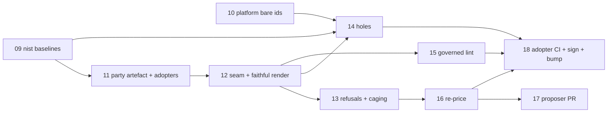

# Map — policy inherits across parties

Label: `wayfinder:map`. Charted 2026-08-21, split out of
[`computed-semver`](../computed-semver/map.md) after its ticket 09 grew a compliance architecture
that had nothing to do with computing a bump.

## Destination

**A party's effective policy set is composed from other parties' signed, versioned artefacts, and the
composition is refused when it does not hold together.** Policy as a dependency you *extend and mash
up*, not only pin. A regulator publishes **controls**; a publisher ships **implementations**; an
adopter inherits both and adds its own. Pricing and threat parents contribute no rules but move the £.

## Notes

**Why this is its own map.** `computed-semver`'s standing preference warns against letting a refactor
take the release gate hostage. Composition earns exactly one line on that map — *the bump is a
property of a composition, so compute it after composition* — and that line stays there. Everything
else (baselines, OSCAL coverage, caging economics, feed parents, signing a composed artefact) is a
different destination and belongs here.

**Domain.** Read `CONTEXT.md`'s *Party*, *Role*, *Policy*, *Exemption* and *Orphan guard* entries,
`docs/adr/0006` and `docs/adr/0010` (nothing timed applies a verdict; scheduled **proposals** only),
and `docs/adr/0007` (the agent layer prompts editorial review, never edits enforcement). The estate's
own `platform/graded/cage.py`, `platform/risk/appetite.json`, `platform/feeds/` and
`ico/schema/to_fair_scenario.py` are the £ machinery and are not to be re-implemented.

**Standing preferences.**
- **Never an exemption.** A subclass that cannot meet an inherited rule is caged, priced against its
  own appetite band. Deny is the bottom rung, reached by the £. There is no override branch.
- **A feed may re-price. It may never apply.** Every resulting change lands as a reviewed PR.
- **Reuse the estate's engines.** No second risk engine, no second appetite store.
- Honesty over green. Say which findings a plain lint would also have found.

## Decisions so far

- [Does composition hold up?](issues/01-does-composition-hold-up.md) — **yes, and it is a real missing
  layer.** Prototype `spikes/cs-06b-cross-party-composition/` composes the estate as it really is and
  renders back down to the committed per-version files, proven by stripping the composition's own
  additions and comparing. **Caging settles a child that cannot meet a parent, and only that**: two
  parents whose rules disagree is now *refused*, not merged, and is untested across parties because
  the estate has one implementations publisher. The pricing and threat parents are wired and the price
  moves; **no real feed bump changes a decision**. Four gaps found, but only one of them needed
  composition to find.
- [What gets signed?](issues/02-what-gets-signed.md) — **the adopter self-signs, no new mechanism.**
  A composed set is a real, published, signed artefact: the adopter gitsign-signs it exactly as it
  signs any artefact today. A parent's "digest" is its resolved commit SHA, the one Renovate already
  pins, recorded once at the top of the file. Verification stays CI/merge-time only, same floor as
  today. Recorded as [ADR-0012](../../docs/adr/0012-composed-artefact-self-signed-pinned-sha.md) and
  a new **Composed artefact** term in `CONTEXT.md`.
- [Who declares the baseline, and against which catalogue ids](issues/03-baseline-and-catalogue-ids.md)
  — **the regulator publishes named baselines, the adopter selects one, and both key on the bare
  catalogue id.** Baselines are OSCAL profiles, the shape NIST already ships. The split keeps a
  regulator's addition a downstream break, which an adopter-enumerated list would hide, and it keeps
  coverage from going tautological, which a publisher-declared baseline would cause. The estate
  selects **MODERATE**: LOW excludes `ac-6`, one of the two controls it implements. That is **285
  holes on day one**, so a composition refuses on a **new** hole only, against the last signed
  composed artefact, and records the rest. `ac-6.10` is **already in real MODERATE**, so ticket `01`'s
  hypothetical `nist` `v2.0.0` is superseded and the hole is live. The id is `ac-6`, never `AC-6` and
  never `nist-800-53:AC-6`; the resolver never case-folds and never strips. Recorded as
  [ADR-0013](../../docs/adr/0013-regulator-publishes-baselines-adopter-selects.md) and new
  **Baseline** and **Control id** terms in `CONTEXT.md`.
- [Whether an unlabelled pod is denied](issues/04-unlabelled-pod-denial.md) — **the committed guard is
  right, and `CONTEXT.md` was wrong about the guard but right that a hole exists.** Absence of the
  claim label covers three situations the guard cannot tell apart, so **absence is never the deny
  trigger**: the guard judges a claim, and only a claim. Two independent facts forbid the prose. The
  guard is cluster-scoped over every `Pod`, so deny-on-absence bricks the cluster. And `currency.py`'s
  de-posture patch, its "ONLY durable re-patch", is an `UPDATE` that names "orphan-guard is out of
  scope" as the reason it works. A de-postured pod is **caged, keeps running, and is priced** — the
  standing preference in miniature. The **locked-door claim was false, not narrow**: omit the label and
  no gate matches you. A sibling `ValidatingPolicy` closes that, scoped by
  `policy-as-versioned.dev/governed: "true"` and matching **`CREATE` only**, so de-posture stays legal.
  **A plain read of the two files finds this. Composition was not needed.** Recorded as
  [ADR-0014](../../docs/adr/0014-unclaimed-is-caged-governed-namespace-requires-claim.md), an amended
  **Orphan guard** entry, and new **Governed namespace** and **De-postured** terms in `CONTEXT.md`.

- [The proposer](issues/05-the-proposer.md) — **a proposer already exists, the adopter runs it, and
  it now opens the PR.** `platform/wargamer/` is already the bounded proposer, and
  `propose-policy-pr.sh` already stops one step short on purpose. The missing pieces were the last
  step and the target line. A cage-tier drift becomes a third drift row on the war-gamer. The
  **adopter** runs it in its own repo, on its own `GITHUB_TOKEN`, calling the war-gamer through its
  pinned `platform` dependency, because a cross-org credential is the one ADR-0007 records the estate
  never built. The PR edits `posture.acme.io/tier` on a workload manifest, which is the label the
  engine reads. A merged Renovate pin bump starts a run, and **no clock ever does**. A **sixth gap**:
  `select_tier` returns `deny`, the label cannot carry it, and the policy coerces it to `baseline`,
  so a merged Deny would invert the proposal in silence. Recorded as
  [ADR-0015](../../docs/adr/0015-adopter-runs-the-proposer-and-it-opens-the-pr.md) and a new
  **Proposer** term in `CONTEXT.md`. **A plain read of three files finds all of it.**

- [Composing the five unversioned live policies](issues/06-composing-the-remaining-policies.md) —
  **it holds up, every kind renders back down faithfully, and four of the five are no longer
  unversioned.** `cs-12`'s renderer now emits `cage-tier`, `cage-netpol`, `stamp-posture` and
  `posture-trust-boundary` into every version tree. The fifth, the orphan guard, **cannot** be
  versioned: it is the aggregate over the array, so composition carries a second numbering axis under
  the `platform-machinery` identity `cs-22` gave it. Three findings. **An action is a
  `ValidatingPolicy` concept**, so the `Audit < Deny` ladder is meaningless for three of the six
  members and **a subclass cannot tighten a mutate** — the tier is the only knob and ADR-0015's
  proposer is the only thing that turns it. **The identity label is a family, not a key**, so the old
  resolver overwrote in silence and had not fired only by luck. **Mutation ordering is inherited, not
  declared**, and is ruled `platform` machinery. Two estate facts: `cs-16` deleted `policy/policies/`,
  so gap 2 **renames rather than shrinks**, and the same-version-two-trees question is **closed**.
  **The spike would not run at all before this ticket** — it had rotted against the estate it reads.
  Recorded as [ADR-0016](../../docs/adr/0016-a-subclass-never-restates-a-mutate.md).

- [What fills a control the adopter adds itself](issues/07-adopter-added-controls.md) — **a signed
  OSCAL control claim from whoever ships the implementation, and an adopter-added hole is an
  ordinary new hole.** The prototype let an adopter add a policy but never claim a control, so an
  added control had no route out. Now any party's claim fills it: an inherited publisher, the
  adopter's own member, or a third pinned publisher. The self-created hole refuses like any new
  hole, ticket `03`'s widening edge at size one, and clears in the same reviewed PR. The claim lives
  in the adopter's own component-definition. Shipping a member adds **no obligation** ADR-0012 did
  not already impose: no separate axis, no separate pin. An adopter may never claim against another
  party's policy and may never remove a control it added. Recorded as
  [ADR-0017](../../docs/adr/0017-a-control-claim-belongs-to-whoever-ships-the-implementation.md)
  and a new **Control claim** term in `CONTEXT.md`.

- [Does a composed artefact declare its governed namespaces](issues/08-composed-artefact-declares-governed-namespaces.md)
  — **no. The `governed: "true"` label on the adopter's own Namespace manifest is the declaration.**
  The manifest already sits in the adopter's signed repo, under the tag ADR-0012 reuses, so a list
  in the composed artefact would be duplicated state, the thing ADR-0013 rejected. The composed
  artefact records the set as advisory metadata only. A composition refuses a **new** ungoverned
  adopter namespace, one with the `institution` label and no `governed` label, and records a
  pre-existing one. The set narrows the `CREATE` claim rule and nothing else. Only the adopter adds
  a namespace, by hand. The proposer never proposes one. Recorded as
  [ADR-0018](../../docs/adr/0018-the-namespace-manifest-is-the-governed-declaration.md) and an
  amended **Governed namespace** entry in `CONTEXT.md`.

- [`nist` publishes named baselines](issues/09-nist-publishes-named-baselines.md) — **built.** LOW,
  MODERATE and HIGH ship beside the catalogue in the `nist` repo as OSCAL profiles (bare ids, one
  `href` each), with a verify beat that resolves every id against the catalogue and a fixture that
  proves an unknown id fails. MODERATE resolves 287 controls and holds `ac-6`, `cm-6` and `ac-6.10`;
  LOW excludes `ac-6`. Verified locally; **not yet released** — the `nist` repo's changes are
  uncommitted there and no gitsign-signed tag has been cut, so the acceptance criterion that
  Renovate can pin the release is still open. No new ADR; implements ADR-0013.
- [`platform`'s control claims use bare ids](issues/10-platform-control-claims-use-bare-ids.md) —
  **built.** `component-definition.json` now writes `ac-6`/`cm-6`, never `nist-800-53:AC-6`, and its
  `source` href names the `nist` party and a catalogue path, not a bare local path with no version.
  A new `lint_claims.py`/`verify-claims.sh` resolves every claim two ways — policy name against the
  shipped version trees, control id against the pinned catalogue — and names the two dangling claims
  (`cm-6`→`require-policy-version`, `ac-6`→`may-run-root-if-attested`) as `EXPECTED-RED` rather than
  silencing them; that gap is a separate `platform` defect, already out of scope above. Verified
  locally; **not yet landed** — same open question as ticket 09, the `platform` repo's changes are
  uncommitted there. No new ADR; implements ADR-0013 and ADR-0017.
- [The party artefact, and the three adopters declare themselves](issues/11-party-artefact-and-adopter-declarations.md)
  — **built.** `platform/party/schema.json` and `party_artefact.py` (new) check a party artefact's
  shape, its declared parent versions against the adopter's own Flux pins, and its baseline against
  the `nist` pin ConfigMap's advisory mirror, naming the two currently-unpinned kinds (`ico/pricing`,
  `platform/threat`) rather than silently skipping them. Each of `driftwood`, `tuppence` and `ludlow`
  gained a `party.yaml` selecting MODERATE, the `governed: "true"` label on its `Namespace`, a
  `baselineName` mirror, and a shift-left step running the check on every pull request. `--selfcheck`
  passes 15 asserts; the real `check` passes end to end against all three adopters' actual files.
  Verified locally; **not yet landed** — same open question as tickets 09 and 10, the `platform` and
  adopter repos' changes are uncommitted there. No new ADR; implements ADR-0012, ADR-0013 and
  ADR-0018.
- [The seam, and a composed artefact that renders back down faithfully](issues/12-the-seam-and-a-faithful-composed-artefact.md)
  — **built.** `platform/compose/composition.py` (new), one entry point: `compose(adopter_dir,
  parent_trees) -> (document, rendered_files)`. Resolves every parent to a commit SHA — the two
  Flux-pinned kinds read `spec.ref.commit` off the adopter's own pin, the two unpinned kinds
  (`pricing`, `threat`) resolve by reading the party directly. Loads every admission member of
  every live policy version keyed on **(identity family, name with its version stripped)** —
  the prototype's real bug was keying on `(family, version)` alone, silently dropping a second
  member of one family (`cage-tier`/`cage-netpol`, both `graded-enforcement`). Renders every
  member back unchanged plus advisory-only additions; `validationActions` now written **only**
  onto a `ValidatingPolicy`, never invented on a mutate or a generate. One separate advisory
  header carries the composed marker, every parent SHA once, the baseline and the governed
  namespace names. `--selfcheck` composes the real `driftwood` against its real pinned parents:
  all 15 live members plus the orphan guard render back byte-identical; a `verify()` mode
  re-renders and diffs byte-for-byte against committed files. No diamond, conflict, restatement,
  hole or namespace refusal yet — those are tickets 13-16's, held out deliberately so their
  future fields don't inherit a differently-shaped placeholder. Verified locally; **not yet
  landed** — same open question as tickets 09-11. No new ADR; implements ADR-0012 and ADR-0016.
- [Structural refusals, restatement, and caging a declared inability](issues/13-structural-refusals-restatement-and-caging.md)
  — **built, inside the same `compose()`.** Three structural refusals: a **split diamond**
  (two of the adopter's own edges reaching one `(party, kind)` at two versions — the real estate
  has no data source for a further-hop diamond, so a fixture proves it), a **cross-party rule
  conflict** (two `implementations` parents supplying one `(family, name, version)` with different
  content — never merged, never last-wins, dropped entirely, proved with a two-publisher fixture),
  and a **restatement of a mutate or a generate** (ADR-0016, proved against the real `cage-tier`).
  Restatement collapses the prototype's two parallel lists into one: `overlay.restate`'s weaker
  action *is* the declared inability. A stricter restatement overwrites the rendered action
  (proved: driftwood's `require-nonroot` Audit→Deny); a weaker one prices instead, through the
  real `cage.py`/`appetite.json`, and the render keeps the inherited action — reproducing the
  prototype's own driftwood/tuppence/ludlow → baseline/baseline/quarantine table exactly, against
  the real `driftwood-root-residual.json` scenario. The composed artefact carries no tier field
  itself; `cage-tier.yaml`'s own inherited CEL body reading `posture.acme.io/tier` off the
  workload is the runtime mechanism, unchanged and distinct from a declared verdict — an
  exact-key check, not a substring one, is what tells the two apart. The two-publisher limit
  prints from `len(implementations_parties)` every run: open at driftwood's real one, closed at
  the fixture's two. No new ADR; implements ADR-0016.

## Spec

[`spec.md`](spec.md), written 2026-08-25 from the eight resolved tickets. Status `ready-for-agent`.
Implementation is tickets `09` to `18`, cut from the spec on 2026-08-25.

## Not yet specified

Nothing.

## Out of scope

- **Computing the version bump.** That is [`computed-semver`](../computed-semver/map.md). This map
  owes it one fact and no more.
- **Repairing the named gaps.** Four from ticket [`01`](issues/01-does-composition-hold-up.md), a
  fifth from ticket [`04`](issues/04-unlabelled-pod-denial.md), and a sixth from ticket
  [`05`](issues/05-the-proposer.md). The fifth is the governed-namespace claim requirement, which
  nothing builds today. The sixth is the `cage-tier` policy coercing an unknown tier label to
  `baseline`, so a merged `deny` label produces the loosest cage instead of the tightest. They are
  defects in the `platform` repo, found from the hub. Naming them, and specifying the fifth, is this
  map's job. Fixing them is that repo's. Ticket [`06`](issues/06-composing-the-remaining-policies.md)
  **renamed the second**: `cs-16` deleted `policy/policies/`, so `ac-6` now claims a policy that
  exists nowhere. The gap did not shrink.
- **Declaring the order the composed members run in.** Ticket
  [`06`](issues/06-composing-the-remaining-policies.md) found that two of the six members mutate:
  `stamp-posture` writes the label `posture-trust-boundary` validates, and `cage-tier` writes the
  label `cage-netpol` generates from. A flat per-version render states neither dependency. Kyverno
  runs the mutating webhook before the validating webhook, which is what makes it work.
  **That is `platform` machinery.** A second implementations publisher is what would expose it, and
  the estate has one. Ruled out of scope, recorded in
  [ADR-0016](../../docs/adr/0016-a-subclass-never-restates-a-mutate.md).
