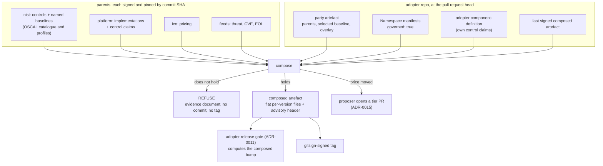

# Spec — a party's policy is composed from its parents, and refused when it does not hold

Status: ready-for-agent
Source: `.scratch/policy-composition/map.md` (`wayfinder:map`, charted 2026-08-21) and its eight
resolved tickets. Prototype: `spikes/cs-06b-cross-party-composition/`. Written 2026-08-25.
Scope: **the composition step on the adopter side**, from the adopter's pinned parents to a signed
composed artefact, plus the inputs the other parties must publish for it to run.

---

## Problem Statement

An institution pins the platform. The platform pins `nist`. The institution pins `nist` too. That is a
diamond, and it is live today. Nothing reads it as one.

Each party signs its own artefact. Nothing signs what an institution actually runs, which is the
**sum** of those artefacts. So four things go wrong, and nothing catches any of them.

**A regulator's addition is invisible.** `nist` ships 1196 controls. The estate implements two. Nothing
declares which controls apply. So a new required control that nothing implements is a build break
upstream and silence downstream. `ac-6.10` is already in the real MODERATE baseline, and nothing
claims it.

**The parents can split.** `nist` bumps and the platform does not. The institution then pins two
versions of the same catalogue through two edges. No diff of any rule shows this.

**A retirement reaches the adopter as a refused pod.** The platform retires a version. For the platform
that is one array element. For the institution whose workload pins that version it is a major. No
policy body changed, so no body diff sees it.

**A control can be claimed by a policy that does not exist.** `cm-6` claims `require-policy-version`.
`ac-6` claims `may-run-root-if-attested`. Neither policy exists anywhere. A plain lint finds both.
Nothing runs that lint.

Behind these sits a fifth problem. A party has no way to say what it cannot meet. The estate bans
exemptions. Without a declared inability there is no route except silence, and silence is the hole the
whole design exists to close.

## Solution

An adopter declares its parents once, in a signed party artefact. A composition reads every parent at
its pinned commit, resolves the rules they supply, checks that the set holds together, and renders it
down to the flat per-version files the engine already reads. The rendered set is a **composed
artefact**. The adopter commits it and signs it with the same gitsign tag it signs everything with.

The composition **refuses** when the set does not hold. It refuses on a split diamond, on two parents
whose rules disagree, on a restatement of a rule that has no strictness ladder, on a control id the
catalogue does not carry, on a **new** hole, and on a **new** ungoverned namespace. It refuses nothing
that was already true in the last signed composed artefact. It records that instead.

There is no override. A subclass that cannot meet an inherited rule declares the inability. The estate's
own cage engine prices the residual against that party's own appetite band and picks the loosest cage
that fits. Deny is the bottom rung, reached by the £.

Pricing and threat parents contribute no rule. They move the price. A price move becomes a **proposed**
tier, raised by the proposer as a reviewed pull request. Nothing timed and nothing composed ever
changes a verdict on its own.

The version bump is a property of the composition. The adopter gate from ADR-0011 computes it **after**
composition. That is the one fact this spec hands back to `computed-semver`.

## User Stories

**The adopter**

1. As an institution engineer, I want to declare my parents once in a signed file, so that what I run is
   the sum of what I pinned and nothing else.
2. As an institution engineer, I want my composed artefact rendered to the same flat per-version files
   the engine reads today, so that composition changes nothing at admission time.
3. As an institution engineer, I want the composed artefact committed and signed with my ordinary
   release tag, so that I learn no second signing mechanism.
4. As an institution engineer, I want each parent's resolved commit SHA recorded once at the top of the
   composed artefact, so that a verifier can re-render it from the pins.
5. As an institution engineer, I want a composition that does not hold to fail my pull request check,
   so that I never merge a set that cannot be run.
6. As an institution engineer, I want a split diamond refused, so that two versions of one catalogue
   cannot reach me through two edges.
7. As an institution engineer, I want two parents that disagree on one rule refused rather than merged,
   so that last-one-wins never decides my policy in silence.
8. As an institution engineer, I want to restate an inherited `ValidatingPolicy` at a stricter action,
   so that I can turn lane-keeping into a gate for my own estate.
9. As an institution engineer, I want a weaker restatement treated as a declared inability, so that I
   have a route that is not an exemption.
10. As an institution engineer, I want a restatement of a mutate or a generate refused, so that a rule
    with no strictness ladder cannot be guessed at.
11. As an institution engineer, I want to add a policy of my own as an overlay member, so that I can
    ship an implementation no parent ships.
12. As an institution engineer, I want my own member versioned with my composed artefact, so that I
    carry no second semver axis and no second pin.
13. As an institution engineer, I want to select a baseline by name in my party artefact, so that my
    risk-bearing act is a signed line I own.
14. As an institution engineer, I want to add a control to my selected baseline, so that I can hold
    myself to more than the regulator asks.
15. As an institution engineer, I want to be unable to remove a control from my baseline, so that no
    one can retire a requirement by editing a list.
16. As an institution engineer, I want a control I add to refuse as an ordinary new hole, so that the
    addition is a real obligation from the moment it lands.
17. As an institution engineer, I want to fill a hole with my own signed control claim, so that an
    added control has a route out.
18. As an institution engineer, I want to be unable to claim a control against a policy another party
    ships, so that my claim cannot break in silence when they change it.
19. As an institution engineer, I want my governed namespaces declared by the label on my own
    `Namespace` manifest, so that the scope of every inherited rule sits in one signed place.
20. As an institution engineer, I want a new ungoverned namespace refused, so that a namespace cannot
    exempt every workload in it by omission.
21. As an institution engineer, I want a workload that pins a retired version reported as a major, so
    that losing my pin is not silent.
22. As an institution engineer, I want the composed bump computed after composition, so that a
    regulator's addition reaches me as a build break and not as a refused pod.
23. As an institution engineer, I want the first composition to record every existing hole and refuse
    on none, so that I can adopt composition on a brownfield estate without a wall.
24. As an institution engineer, I want a baseline widening refused with no override, so that MODERATE
    to HIGH is a reviewed decision and never a quiet edit.

**The regulator and the publisher**

25. As a regulator, I want to publish named baselines as OSCAL profiles, so that an adopter selects a
    name and not a list.
26. As a regulator, I want a control I add to a named baseline to break every adopter that selected it,
    so that my addition is a downstream event and not a suggestion.
27. As an implementations publisher, I want my control claims keyed on the bare catalogue id, so that
    one authority names the control.
28. As an implementations publisher, I want a claim against a policy that does not exist refused, so
    that my component-definition cannot rot past my policy trees.
29. As an implementations publisher, I want the `platform-machinery` members composed under the platform
    tag, so that the orphan guard keeps its identity without being forced onto a claim.
30. As a pricing publisher, I want my penalty schema pinned as a parent of its own kind, so that a
    bump to it moves the price through the estate's own converter.
31. As a feed publisher, I want a threat, CVE or EOL feed pinned as a parent of its own kind, so that it
    can re-price and can never apply.

**The reviewer**

32. As a pull request reviewer, I want a refusal to name the rule, the two sources and the two contents,
    so that I can read the disagreement and not guess it.
33. As a pull request reviewer, I want a refusal to name the control id and which party's claim would
    fill it, so that the fix has a target.
34. As a pull request reviewer, I want every hole and every ungoverned namespace marked new, recorded or
    closed, so that a new one stands out from the 285 the estate starts with.
35. As a pull request reviewer, I want the cage tier and residual priced per party printed, so that I
    can see what a declared inability costs.
36. As a pull request reviewer, I want each refusal marked by whether a plain lint would have found it,
    so that composition claims only what it earns.
37. As a pull request reviewer, I want a price move that changes no tier printed as no change, so that
    the wiring is visible even when the outcome does not move.
38. As a pull request reviewer, I want a proposed tier to arrive as a pull request on the workload
    manifest line the engine reads, so that I merge the exact change and nothing else.
39. As a pull request reviewer, I want a proposed Deny to arrive as an issue and never as a label edit,
    so that a merged `deny` label cannot invert to the loosest cage.

**The verifier and the auditor**

40. As a verifier, I want to re-render a composed artefact from its recorded parent SHAs and compare
    byte-for-byte, so that a signed composed artefact is reproducible and not merely signed.
41. As a verifier, I want the composed artefact to carry an explicit marker that it is composed, so that
    I know to check parent SHAs and not only the tag.
42. As a verifier, I want the advisory header stripped to leave the rendered file unchanged, so that
    the engine never reads any of it.
43. As an auditor, I want the control id resolved exact-string with no case-folding and no
    prefix-stripping, so that the mismatch that stayed latent cannot stay latent again.
44. As an auditor, I want the resolver to walk nested controls, so that an enhancement such as
    `ac-6.10` is not missed by a group-level scan.
45. As an auditor, I want an unknown control id to be a hard failure, so that a typo cannot become a
    recorded hole.
46. As an auditor, I want no exemption branch anywhere in the composition, so that the banned concept
    cannot return under a new name.
47. As an auditor, I want no tier and no tier floor in the composed artefact, so that a verdict is set
    by the £ and never by a declaration.
48. As an auditor, I want no schedule anywhere, so that nothing timed changes a verdict on its own.
49. As an auditor, I want the composition to state what it did not test, so that the untested
    two-publisher conflict path is a published limit and not an implied one.

## Implementation Decisions

### The party artefact

- **One signed file per party declares that party.** It carries the party name, its roles, its parents,
  its selected baseline name, and its overlay. The shape is the one the prototype proposed in its
  per-party material, promoted from prototype to format.
- **A parent is a party, a kind and a version.** The kinds are `controls`, `implementations`, `pricing`
  and `threat`. The version is the tag the adopter already pins. The composition resolves the tag to
  the commit SHA Renovate already records and uses that SHA everywhere after.
- **Parents are not all the same kind.** A `controls` parent supplies a catalogue and named baselines.
  An `implementations` parent supplies policy bodies and control claims. A `pricing` parent supplies a
  penalty schema. A `threat` parent supplies a feed. The last two supply no rule and are never asked
  for one.
- **The baseline name lives in the party artefact and nowhere else.** The adopter's existing pin
  ConfigMap mirrors it as a `baselineName` key for humans and for the OSCAL plumbing. The mirror is
  advisory. The party artefact is the declaration.
- **The overlay has two lists.** `add` names members the adopter ships itself. `restate` names an
  inherited `ValidatingPolicy` and the action the adopter wants for it.
- **The party artefact is signed under the same tag as the composed artefact.** No second mechanism.

### Resolution

- **The resolver keys on the identity family plus the policy name with its version stripped.** The
  `policy-as-versioned.dev/policy` label is a family name. `graded-enforcement` covers five objects and
  `posture` covers two. A key of label plus version overwrites in silence. This is the same key
  ADR-0011's pairing rule already uses.
- **Every kind composes.** `ValidatingPolicy`, `MutatingPolicy` and `GeneratingPolicy` all travel. Only
  a `ValidatingPolicy` carries an action, so only a `ValidatingPolicy` has a strictness ladder.
- **The `platform-machinery` members compose under a second numbering axis.** The orphan guard is the
  aggregate over the version array and cannot self-scope to one claim. It carries the platform tag. The
  composition carries that axis and never forces the guard onto the policy-version axis.
- **The diamond must close.** Every path from the adopter to one parent must resolve to one version.
  Two versions of one parent through two edges is refused.
- **Two sources for one rule with different content is refused.** Never merged, never last-wins. The
  refusal names the rule, both sources and both contents. This path is proved only inside one
  publisher today. The evidence document says so, every run, until a second implementations publisher
  is pinned.
- **Mutation ordering is inherited and never declared.** Kyverno runs the mutating webhook before the
  validating webhook. That is `platform` machinery and the composition does not state it.

### Restatement and caging

- **A restatement applies to a `ValidatingPolicy` and to nothing else.** A restatement of a mutate or a
  generate is refused.
- **A stricter restatement is accepted.** `Audit` to `Deny` is stricter. That is the whole ladder.
- **A weaker restatement is a declared inability.** It is never an override and never an exemption.
  The composition calls the estate's own cage engine with that party's own appetite band. The engine
  prices the residual and picks the loosest cage whose residual fits. Deny is the bottom rung. The band
  is compared against the residual, not against the total cost of risk.
- **The composed artefact carries no tier and no tier floor.** The tier is a priced verdict. Only the
  proposer turns it, by a pull request on the workload manifest. This is the whole path.
- **No second risk engine and no second appetite store.** The composition reads the estate's cage
  engine, appetite bands, feeds and penalty converter as they are.

### Baselines, control ids and holes

- **The regulator publishes named baselines as OSCAL profiles.** NIST already ships LOW, MODERATE and
  HIGH. The `nist` party publishes those files, signed and versioned like its catalogue.
- **The adopter selects one by name.** This estate selects MODERATE. LOW excludes `ac-6`, one of the
  two controls the estate implements.
- **The adopter may add a control and may never remove one.** A removal is refused. The refusal is
  not a lint of the diff. The composition compares the selected set against the last signed composed
  artefact's selected set and refuses on any control that left.
- **A control id is the bare id the catalogue writes.** `ac-6`, never `AC-6`, never `nist-800-53:ac-6`.
  The catalogue is named once, by the `source` or `href` on the enclosing block. Resolution is
  exact-string. There is no case-folding and no prefix-stripping. An id absent from the catalogue is a
  hard failure, not a hole.
- **The resolver walks nested controls.** Enhancements are children of their parent control.
- **Control claims merge over every party that ships a member.** The parents' component-definitions
  and the adopter's own. A claim is a control id plus the policy that evidences it. A claim whose policy
  exists in no composed member is refused, and the refusal is marked as lint-findable.
- **An adopter may never claim against a policy another party ships.** Refused.
- **A baseline control with no claim is a hole.** The composition refuses on a **new** hole and records
  a pre-existing one. The comparison set is the hole list in the last signed composed artefact. There
  is no hole-count threshold.
- **The first composition records every hole and refuses on none.** The prior set is empty. That first
  signed artefact is the comparison point from then on. The estate starts at 285 recorded holes and
  says so.
- **An adopter-added hole is an ordinary new hole.** It refuses. It clears in the same reviewed pull
  request, by a claim or by acceptance onto the recorded list. There is no on-purpose flag.

### Governed namespaces

- **The `governed: "true"` label on the adopter's `Namespace` manifest is the declaration.** The
  composed artefact carries no namespace list. It records the governed set as advisory metadata only.
- **An adopter namespace with the `institution` label and no `governed` label is ungoverned.** The
  composition refuses on a **new** one and records a pre-existing one, against the last signed composed
  artefact. Same rule as a hole.
- **The governed set narrows the `CREATE` claim rule and nothing else.** No inherited member changes
  reach.
- **Only the adopter adds a namespace, by hand.** The proposer never proposes one.

### Pricing, threat and the proposer

- **A pricing or threat parent bump re-prices and never applies.** The composition prints the old
  price, the new price, the old tier and the proposed tier per party. A price move that changes no tier
  prints as no change.
- **A proposed tier is raised by the proposer.** The war-gamer already exists and the adopter already
  runs it. A cage-tier drift is its third drift row. The pull request edits `posture.acme.io/tier` on
  the workload manifest.
- **A proposed Deny opens an issue and never a pull request.** The label cannot carry `deny`, and the
  cage-tier policy coerces an unknown label to `baseline`.
- **A run starts on a merged Renovate pin bump or on a human dispatch.** No schedule anywhere. An EOL
  drift with no push waits. That is a named blind spot.

### The composed artefact

- **The composed artefact is committed files, rendered by the composition and checked in.** Git and
  the release gate both read real files. CI regenerates and fails on any diff, the same pattern the
  release gate uses for the tree being cut.
- **It renders to the flat per-version files the engine reads today.** Four coordinated edits per
  version, exactly as the version-tree renderer does. `matchConditions` self-scope, never
  `objectSelector`.
- **It carries one advisory header at the top.** The header holds a composed marker, each parent's
  resolved SHA once, the selected baseline name, the governed namespace names, the recorded hole ids
  and the recorded ungoverned namespaces. Strip the header and the file underneath is unchanged.
  Kyverno never reads any of it.
- **Per-rule advisory annotations stay.** `composed-for`, `inherited-from` and `source-path` as the
  prototype already adds them.
- **The adopter gitsign-signs the tag.** Verification stays at CI and merge time, the same floor every
  artefact has today.
- **A verifier re-renders from the recorded SHAs and compares byte-for-byte.**

### Where it runs

- **In the adopter's own repo, on the pull request check.** The inputs are the repo state at the pull
  request head. The adopter calls the composition through its pinned `platform` dependency, exactly as
  it calls the proposer. There is no discovery endpoint and no composition service.
- **Every pull request that changes an input recomposes.** A Renovate parent bump, a party artefact
  edit, a namespace manifest edit and a component-definition edit all do.
- **The adopter release gate consumes the composed artefact.** ADR-0011's adopter side computes the
  composed bump from it. A retired pin classifies as major there, with no policy diff.
- **The composition engine lives in the platform repo.** It reuses the cage engine, the appetite
  store, the feeds and the penalty converter that live there. The prototype's structure is the
  starting point, with its named defects closed.

### The evidence document

Every run emits one document. On refusal it is a run artifact and a job summary. On success it is
committed beside the composed artefact. None of these fields is optional.

| Field | Content |
| --- | --- |
| `outcome` | `composed` or `refused`, and every refusal reason |
| `parents[]` | party, kind, declared tag, resolved SHA |
| `refusals[]` | each with kind, subject, detail, and `needs_composition` as `true` or `false` |
| `members[]` | family, name, kind, source party, source SHA, action where it has one |
| `restatements[]` | rule, inherited action, restated action, accepted or caged |
| `cages[]` | party, band, residual, tier, and whether it changed |
| `holes[]` | control id, and `new`, `recorded` or `closed` |
| `ungoverned[]` | namespace, and `new`, `recorded` or `closed` |
| `prices[]` | source parent, old and new price, old and proposed tier |
| `limits[]` | derived limits with counts, open and closed |

**A limit is emitted by the check that would remove it.** The two-publisher conflict path is a limit
with a count of pinned implementations publishers. At two it prints as closed.

**`needs_composition` is honesty, not decoration.** A dangling claim, a prefixed id and a missing
baseline file are lint findings. A new hole, a split diamond and a cross-party conflict need the
composition. The map's standing preference is to say which is which.

### Changes in other repos

Three inputs do not exist yet. The composition cannot run without them.

1. **`nist` publishes the named baselines** it ships none of today, as OSCAL profiles under its tag.
2. **`platform`'s component-definition drops the `nist-800-53:` prefix and the upper case**, and its
   `source` href names the `nist` party and a path. Its two dangling claims are refused by the
   composition, marked lint-findable, and belong to that repo to fix.
3. **Each adopter carries a party artefact, labels its `Namespace` manifest `governed: "true"`, and
   mirrors the baseline name into its pin ConfigMap.** Until the label lands, the first composition
   records three ungoverned namespaces and refuses on none.

## Testing Decisions

**A good test here asserts on the evidence document and on the rendered files, and on nothing else.**
Those two things are the composition's external behaviour. The document is what a reviewer reads. The
rendered files are what Kyverno runs and what a verifier re-renders. A test that reaches into the
resolver, the walker or the pricing call is asserting on a detail the next ticket moves.

**One seam.** A single entry point takes an adopter repo state and the pinned parent trees. It returns
the evidence document as a dictionary and the rendered composed artefact as a mapping of path to
content. Everything reports through it:

- every refusal and its `needs_composition` mark,
- the resolved members and their sources,
- restatements, cages and prices,
- holes and ungoverned namespaces with their status,
- the derived limits.

The command-line interface is a thin wrapper. It writes the files, prints the document and exits
non-zero on refusal. Signing happens outside the seam, because signing needs an identity CI holds and a
test does not. The proposer's pull request happens outside the seam too, because it already has its
own rail and its own bounds.

**Fixtures are party trees on disk.** A test builds a small estate of party directories and points the
seam at it. The real estate clone stays the validation set, read-only, and SKIPs with exit 0 when
absent.

**What gets tested through the seam:**

- the real estate composes, and every member of every kind renders back to its committed file
  byte-for-byte after the header is stripped,
- the orphan guard renders back to the estate's own twin's output,
- a split diamond refuses and names both edges,
- two sources for one rule with different content refuse and name both,
- a stricter restatement is accepted and appears in the rendered action,
- a weaker restatement is caged, priced against that party's band, and the rendered action is the
  inherited one,
- the same weaker restatement lands three parties in the tiers the prototype's table shows,
- a restatement of a mutate refuses,
- an overlay member with a mutate of its own composes,
- two members of one family at one version both survive resolution,
- a bare id resolves, a prefixed id is a hard failure, and an upper-case id is a hard failure,
- `ac-6.10` is found by walking nested controls,
- the first composition records 285 holes and refuses on none,
- a second composition with one new hole refuses and names the id,
- a second composition with a hole filled marks it closed,
- a claim by the adopter's own component-definition fills an adopter-added control,
- an adopter claim against a parent's policy refuses,
- a removed control refuses,
- a baseline widening refuses,
- a claim whose policy exists nowhere refuses with `needs_composition: false`,
- a new ungoverned namespace refuses and a recorded one does not,
- a pricing parent bump moves the price and prints no tier change on the estate's real bands,
- a `deny` selection appears as a proposed issue and never as a proposed label,
- a refusal still populates every field the run reached,
- the two-publisher limit prints open at one publisher and closed at two.

**Prior art in this estate:**

- The prototype's own `--selfcheck` style asserts and its `render_is_faithful` check are the direct
  ancestor. Keep the SKIP-with-exit-0 convention for the estate clone.
- The release gate's evidence-document tests from `computed-semver` are the shape to copy. One seam,
  one dictionary, assert on fields.
- The orphan guard's offline twin and its verify beat show how a rendered file is checked against a
  generator.
- The war-gamer's proposer-bounds tests show how a proposal is asserted without a pull request.
- The per-policy Kyverno test directories are the fixture prior art for policy behaviour itself.

## Out of Scope

- **Computing the version bump.** That is `computed-semver` and ADR-0011. This spec hands it one fact.
  The bump is a property of the composition, so the adopter gate computes after composition.
- **Repairing the six named gaps in `platform`.** The two dangling claims, the id form, the missing
  baseline declaration, the `CREATE`-only governed-namespace policy, and the cage-tier coercion of an
  unknown label to `baseline`. This spec refuses on the ones it can see and names the rest. That repo
  fixes them.
- **Declaring the order composed members run in.** Mutation ordering is `platform` machinery. A second
  implementations publisher would expose it, and the estate has one.
- **A composition service or a shared signing identity.** The adopter self-signs. There is no third
  party in the chain.
- **Cluster-side verification of a composed artefact.** Verification stays at CI and merge time.
  ADR-0001's Flux gap is not reopened.
- **Cluster drift on the `governed` label.** A namespace created by hand is Flux drift, owned by the
  estate's drift tooling.
- **A schedule for EOL drift.** The blind spot is named. Closing it is a standing decision the estate
  has declined.
- **Adopters learning from each other's rejection ledgers.** Nothing did that before either.
- **The COTS and unversioned workload population.** Its own effort.
- **Editing `CONTEXT.md` further.** Every term this spec uses is already there.

## Further Notes

**Order the work: inputs first.** Nothing composes until `nist` publishes a baseline and `platform`'s
component-definition carries bare ids. Cut those two as the first tickets. The three adopter changes
come next. The engine and the seam come after, and the evidence document last, because it reports on
everything before it.

**The prototype is a starting point, not a design.** It had three defects the map found and fixed in
place: it wrote an action onto every kind, it keyed on label plus version, and its case-folding check
was asserted against its own hand-authored baseline. It also modelled `ac-6.10` as a hypothetical
`nist` bump, and that modelling is superseded. Read it for the flow and for `render_is_faithful`.
Rewrite the rest.

**The refusal set is written before the first case.** No party manifest in the estate restates
anything today, so no restatement refusal fires. No second publisher is pinned, so no cross-party
conflict fires. The evidence document prints both as open limits with their counts. That is the
honest state, and it is the state the tests must reproduce.

**Warning before the first adopter tag.** The first composition records 285 holes and three
ungoverned namespaces and refuses on none. That signed artefact is the comparison point for every run
after. Do not hand-edit its hole list. A hole removed by hand becomes a closed hole the next run
cannot tell from a filled one.

**One document is owed.** No new ADR. ADRs 0012 to 0018 already record every decision here. This spec
is the implementation contract that cuts across them.
