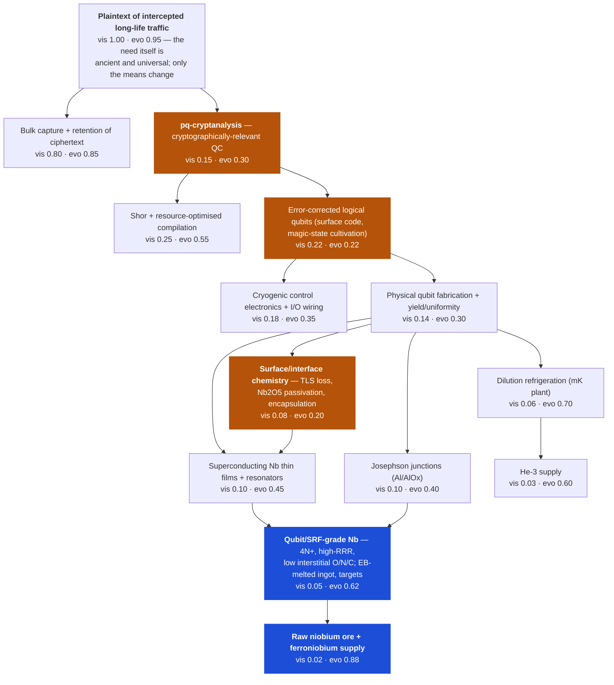

# Niobium → CRQC: a Wardley analysis of a supply-side headline

**Headline under test (mocked):** *"China confirms major discovery of low-contaminant niobium deposit"*
**Question:** what does this do to `pq-cryptanalysis` (evolution 0.30, velocity 0.05) in `estate/platform/wardley/intel/market-intel.json`?
**Date:** 2026-08-19 · **Horizon:** 3 years (engine default)
**Headline verdict:** it moves the map, but **not at the component the intel file prices**. Recommended change is small and **does not** cross a stage boundary on velocity alone. The defensible crossing, if you want one, comes from a *different* fact (algorithmic overhead collapse), not from this ore.

---

## 1. The value chain

**Anchor (user need):** an adversary needs *plaintext of intercepted, long-life confidential traffic* — retrospective decryption of TLS/VPN/archive material captured today. Note the anchor is deliberately the **attacker's** need, because this map feeds an attacker-capability component.

The stack below it is the real dependency chain, not a technology list.



*Blue = components the headline actually touches. Amber = the components that actually gate the anchor.* The point of the map is that those two sets **do not overlap**.

### Component table

| # | Component | Vis | Evo | Stage | Placement justification |
|---|---|---|---|---|---|
| 1 | Plaintext of intercepted long-life traffic (anchor) | 1.00 | 0.95 | commodity | The need is fully understood and universal; SIGINT has wanted this for a century. Only the *means* are unevolved. |
| 2 | Bulk capture + retention of ciphertext | 0.80 | 0.85 | commodity | Tapping and storing at scale is a solved, cheap, multi-vendor-and-state capability. Storage cost per PB keeps falling. This is why HNDL is credible *now*. |
| 3 | **pq-cryptanalysis (CRQC)** | 0.15 | 0.30 | custom | Not genesis: the algorithm is known, the resource estimates are published and converging, several state and corporate programmes are executing against a defined engineering target. Not product: zero working instances, no vendor sells one, outcome still uncertain. Custom-built-and-uncertain is right. |
| 4 | Shor + resource-optimised compilation | 0.25 | 0.55 | product | Genuinely more evolved than the hardware it runs on. Shor is 1994; the 2020s work is *optimisation* — Gidney's 2025 estimate cuts the qubit requirement ~20× vs his own 2019 figure via approximate residue arithmetic, yoked surface codes and magic-state cultivation. Multiple groups produce comparable estimates: that is product-stage behaviour (competition on features, not on existence). |
| 5 | Error-corrected logical qubits | 0.22 | 0.22 | genesis | The binding constraint. Below-threshold surface-code operation has been demonstrated at small distance; a *useful* logical-qubit count at a *useful* logical error rate has not. High failure rate, uncertain path, still R&D. |
| 6 | Cryogenic control electronics + I/O | 0.18 | 0.35 | custom | Wiring/heat-load scaling is a recognised, quantified scaling wall. Cryo-CMOS and photonic-link approaches exist but are bespoke per platform. |
| 7 | Physical qubit fabrication (yield/uniformity) | 0.14 | 0.30 | custom | Every serious player runs its own process. No merchant foundry sells "qubit wafers" as a product. Yield is the differentiator, i.e. bespoke. |
| 8 | Josephson junctions (Al/AlOx) | 0.10 | 0.40 | custom | The junction recipe is well understood and reproducible across labs — more mature than the chip around it — but parameter spread is still the yield limiter, so not product. |
| 9 | **Surface / interface chemistry (TLS loss)** | 0.08 | 0.20 | genesis | The other binding constraint, and the *lowest-evolution component on the map*. There is no settled recipe: the field is actively discovering which capping material and which oxide-removal route works. This is genesis in the strict Wardley sense — high uncertainty, high failure, rapid publication churn. |
| 10 | Superconducting Nb thin films + resonators | 0.10 | 0.45 | custom | Sputtering/HiPIMS deposition of Nb is a mature technique borrowed from SRF; each fab still tunes its own stack. Just short of product. |
| 11 | Dilution refrigeration | 0.06 | 0.70 | product | Genuinely a product: Bluefors, Oxford Instruments, Form Factor and others sell mK platforms off a price list with lead times. Not commodity — lead times and unit counts still constrain build-out. |
| 12 | He-3 supply | 0.03 | 0.60 | product | Traded, priced, sourced from tritium decay; a documented, politically-mediated but functioning market. Tighter than niobium, and a *more* credible constraint than niobium. |
| 13 | **Qubit/SRF-grade Nb (4N+, high-RRR)** | 0.05 | 0.62 | product | A specialist product with a handful of qualified suppliers of EB-melted high-RRR ingot and 4N/4N5 sputtering targets. Priced per kg, purchasable, but not a spot commodity. |
| 14 | **Raw niobium ore / ferroniobium** | 0.02 | 0.88 | commodity | Exchange-adjacent industrial commodity. ~112 kt contained Nb mined in 2025, ~93% from Brazil; ~77–90% of demand is ferroniobium for microalloyed steel. Fully commoditised — with a single-country concentration risk sitting on top. |

Visibility ordering matters more than the absolute numbers: the whole hardware stack is invisible to the "user" (the adversary's tasking authority), which is exactly why a governance platform needs a forward feed to see it at all.

---

## 2. Where niobium actually sits, and the causal chain

### What is solidly true

- **Niobium is the dominant superconductor in this stack.** Transmon capacitor pads, ground planes, coplanar-waveguide resonators and interconnect are overwhelmingly Nb (or NbTiN/TiN); Al is generally reserved for the junction electrodes. Nb's higher Tc and gap give margin the Al-only stacks lack.
- **Purity is a real, documented parameter.** Interstitial O, N, C and H are the scattering centres that set RRR in bulk Nb; SRF practice keeps O/N/C below roughly 10 µg/g and treats high-RRR EB-melted ingot as a distinct, expensive grade. Ta rides along with Nb in the ore at ~500 µg/g and is substitutional, so it is tolerated at that level. Superconducting-electronics-grade sputtering targets are specified at 4N minimum with tight O and N limits, for exactly this reason.
- **Niobium's *surface oxide* is a documented coherence limiter.** Native Nb₂O₅/suboxide is a lossy dielectric hosting two-level-system defects; microwave loss scales roughly linearly with Nb₂O₅ thickness with an extracted loss tangent ~1×10⁻². Surface encapsulation — capping Nb with Ta, Al, TiN or Au to prevent the native oxide forming — gives **2–5× longer T1**, with median transmon lifetimes above 300 µs and maxima to ~600 µs for Ta-capped Nb (Bal et al., *npj Quantum Information* 2024).

### The causal chain, link by link, with honest strength ratings

| # | Link | Strength | Why |
|---|---|---|---|
| L1 | New deposit → more Nb ore available | **Strong** — but irrelevant on volume. Global mine output is ~112 kt/yr against ~125 kt/yr demand, so the ore market is genuinely tight. |
| L2 | More ore → more *qubit-grade* Nb | **Weak.** Grade is made by electron-beam melting and purification, not by mining. The bottleneck is qualified refining and target-fab capacity, not feedstock tonnage. A deposit does not build an EB furnace. |
| L2′ | *Low-contaminant* ore → cheaper/faster qubit-grade Nb | **Moderate, and the only real link.** This is the one word in the headline that isn't decorative. Lower native Ta and lower interstitial burden means fewer EB passes to reach RRR>300 / 4N5, which cuts cost and lead time on the specialist grade. Genuine, but it improves a *supply* term, not a *physics* term. |
| L3 | Cheaper qubit-grade Nb → better qubits | **Very weak.** Bulk feedstock purity is not what limits transmon T1 today. The oxide that dominates TLS loss **forms after deposition, on air exposure**, from the film's own surface. A purer ingot does not prevent Nb₂O₅. The fix is encapsulation/process chemistry (component 9), which the headline does not touch at all. |
| L4 | Better/cheaper qubits → more logical qubits | **Weak-to-moderate.** Real but heavily diluted: logical-qubit count is gated by error rate and code overhead, and coherence is only one input to physical error rate. Cost per physical qubit is not currently the binding constraint on anyone's roadmap. |
| L5 | More logical qubits → CRQC sooner | **Moderate.** Directionally right and quantified by published resource estimates — but the estimates moved 20× on *algorithms*, not on materials. |
| L6 | CRQC exists → HNDL loss realises | **Strong**, conditional on L1–L5. Ciphertext captured today with 25-year confidentiality requirements is already exposed if a CRQC lands within that window. |

**The composition matters.** A chain that is Strong × Weak × Moderate × Very-weak × Weak × Moderate is **weak overall**. Wardley doctrine says a constraint easing on a deep component accelerates everything above it — but that inference is only valid *if the eased component is on the binding path*. Here it is not: components 5 (logical qubits) and 9 (surface chemistry) are the constraints, and both sit at evolution ≈0.20, materially left of niobium at 0.62/0.88. **Easing a commodity component that is not the constraint produces very little movement above it.** That is the analysis, and it is a negative result.

### What the headline *does* legitimately change

1. **Concentration risk.** Brazil is ~93% of world mine output; CBMM alone is ~77% of supply. A second major source materially de-risks a global single-point-of-failure. For a *state-scale* programme, that is a tail-risk reduction, not a median-date shift.
2. **Export-control leverage evaporates.** If allied states were holding qubit-grade Nb feedstock as a potential control lever against a Chinese programme, a domestic Chinese deposit removes it. This does not make the median CRQC date earlier; it **thins the left tail of "delayed by sanctions"** and shifts *who* is likely to get there first.
3. **Steel and superalloy prices**, which is where 77–90% of the tonnage actually goes, and which is not this map.

---

## 3. Playing the headline through the map

| Component | Move | Horizon | Reasoning |
|---|---|---|---|
| 14 Raw Nb ore | 0.88 → **0.92** | 1–3 yr, on production not announcement | An already-commodity component gets more commodity: second source, less concentration premium. Note the lag — a *discovery* is 5–15 years from steady output; only the market's *expectation* moves in-horizon. |
| 13 Qubit-grade Nb | 0.62 → **0.66** | 3–7 yr | The real but modest L2′ effect: lower-contaminant feedstock shortens the purification chain. Constrained by refining/target-fab capacity, which the discovery does not add. |
| 10 Nb thin films | 0.45 → **0.46** | 3–5 yr | A marginal input-cost effect. Deposition process maturity is the driver here, not feedstock price. |
| 8 Josephson junctions | **no move** | — | Al/AlOx. Not a niobium component. |
| 9 Surface chemistry | **no move** | — | The binding constraint, and completely orthogonal: the oxide grows from the film's surface on air contact regardless of ingot purity. This is the single most important "stays put" on the map. |
| 7 Fabrication | **no move** materially | — | Yield and uniformity are process-and-people problems. Feedstock cost is a rounding error against tooling and cycle time. |
| 5 Logical qubits | **no move** | — | Gated by error rates, code distance and magic-state overhead. Nothing in this headline touches any of them. |
| 4 Shor / compilation | **no move** | — | Pure mathematics and software. Immune to ore. |
| 11–12 Refrigeration / He-3 | **no move** | — | He-3 is the *more* plausible materials chokepoint on this map and is unaffected. |
| 3 **pq-cryptanalysis** | 0.30 → **0.30**, velocity 0.05 → **0.06** | 3 yr | See below. Second-order, damped through four weak links, plus a genuine tail-risk reduction on the geopolitical side. |

**Inertia note.** The map has a classic inertia pattern: the *loudest* signal (a mineral discovery, front-page, quantifiable in tonnes) sits on the *least* binding component, while the binding components (9, 5) generate signals that only appear in `npj QI` and never reach a news desk. A governance platform that reprices on headlines rather than on constraints will systematically mis-weight this. That is worth saying out loud in the demo — it is the more interesting finding than any number.

---

## 4. Recommendation for `market-intel.json`

### Primary recommendation — and it is the small one

```
pq-cryptanalysis.velocity: 0.05 → 0.06
```

Verified against the engine: projected = 0.30 + 0.06×3 = **0.48**, still `custom`. **`commoditising` stays `false`. No forward signal is emitted. Nothing downstream changes.**

**That is the honest answer, and it is deliberate.** A +20% velocity bump encodes "a real but heavily damped supply-side improvement plus a meaningful reduction in the probability that an adversary programme is delayed by materials sanctions." It does not encode "the timeline moved," because the evidence does not support that. The boundary at 0.067 is roughly 3× the effect this headline justifies on its own.

If the demo needs a component that crosses on this headline, the correct thing to do is **add a new component** — `nb-supply-concentration`, evolution 0.88 → velocity 0.04, `actor: "supply-constraint"` — and show it *not* propagating. A forward layer that can say "this loud thing changes nothing above it" is more credible to a technical audience than one that finds every headline material.

### The defensible alternative, if a crossing is genuinely wanted

The crossing exists — it is just driven by a different fact that is *already true* and arguably mis-priced in the current intel:

```
pq-cryptanalysis.evolution: 0.30 → 0.34   (Gidney 2025: ~20× qubit-requirement reduction
                                            vs the 2019 estimate — the target moved, and
                                            "evolution" of a capability includes how well
                                            the requirement is understood)
pq-cryptanalysis.velocity: 0.05 → 0.06    (the niobium/supply term, as above)
```

Verified: projected = 0.34 + 0.18 = **0.52 → `product`. `commoditising: true`**, movement 0.18, collapse factor 1.72.

This is defensible because it attributes the crossing to the thing that actually caused it. **State plainly in the demo that the niobium headline contributed the 0.01 on velocity and the algorithmic result contributed the 0.04 on evolution** — otherwise the narrative claims a causal link the physics does not support, which is the exact failure mode this platform exists to catch.

### Two engine observations found while testing

1. **`pq-cryptanalysis`'s reactive base already drifts.** `base_risk.deployed_move` is `"transfer"`, but `tcor.crossover` on the base posture returns **`cage`** (cage £39.9k vs transfer £1.017m vs fix £212k vs deny £312k). Unlike `phishing-kits-aas`, whose selfcheck explicitly asserts the reactive base does *not* drift, this risk drifts before any forward signal is applied. That weakens the "the forward bump is the *only* reason drift appears" claim for this component specifically. Either it is a deliberate editorial choice (a real org that bought cyber cover it did not need) — in which case say so in the note field — or it is a latent misconfiguration. Worth resolving before the demo, since a sharp audience member will price the four moves themselves.
2. **The crossing produces a striking number.** At evolution 0.34 / velocity 0.06 the forward LEF bump takes the transfer premium from **£1.02m to £1.70m**, and `cage` becomes **unavailable** (`select_tier` returns "deny — no tier fits the band"). The computed move goes `cage → fix` at £212k. That is a clean, self-evidencing demo beat: the winner changes *because the loser got expensive*, not because anyone asserted a policy.

---

## 5. Second-order consequences for the governance platform

If the CRQC date pulls in, the HNDL risk changes shape in a way most risk registers handle badly.

**The exposure is already accrued.** Every day of ciphertext captured today against data with a 25-year confidentiality requirement is *already* a booked liability; the only open variable is when it realises. Unlike ransomware, you cannot reduce the exposure by improving detection tomorrow — the loss event is in the past and only the decryption is in the future. A date pulling in does not raise the *probability* so much as it **shortens the discounting period on a loss you have already taken**, and simultaneously widens the population of affected records (everything still in the confidentiality window at the new date).

### The four moves

- **fix** — migrate to PQC/hybrid key exchange, re-key long-life archives, shorten retention. The only move that actually reduces exposure, and the only one whose value *increases* the sooner the date lands. Engine agrees: at the forward posture, fix wins at £212k.
- **cage** — segment and monitor the long-life stores. Useful for *future* capture, useless against ciphertext already on an adversary's disk. Note the engine outcome above: at the forward LEF the caged residual no longer fits the appetite band at any tier, so cage stops being available at all. That is the correct answer and the platform derives it rather than asserting it.
- **transfer** — see below.
- **deny** — stop holding or transmitting long-life confidential data. Real, and under-used, but it costs £312k here in lost-business friction and does nothing about what is already captured.

### Why **transfer** is specifically a bad move here

Four independent reasons, any one of which is disqualifying:

1. **Correlated, systemic loss.** A CRQC does not break one organisation's crypto; it breaks *everyone's*, on the same day. Insurance prices idiosyncratic risk. A carrier facing simultaneous claims across its entire book cannot pay, so the cover is worth less precisely in the scenario you bought it for.
2. **Tenor mismatch.** Cyber policies are annual. The exposure window is 10–25 years. You are buying one year of cover against a loss whose realisation date you cannot bound, and you are re-underwritten every renewal. As the CRQC date becomes more legible, the carrier reprices or adds a quantum/cryptographic-failure exclusion — the cover withdraws exactly as the risk becomes real. This is the "buy an umbrella that dissolves in rain" structure.
3. **The premium tracks the risk, so it never gets cheaper.** The engine shows it directly: the forward bump takes the premium from £1.02m to £1.70m — 8× the cost of just fixing it. Transfer is the *most* price-sensitive of the four moves to a frequency bump, because premium is priced straight off the do-nothing ALE.
4. **The loss is not indemnifiable in kind.** Disclosure of a 25-year secret cannot be restored by a cash payment. Insurance converts a loss into money; some losses have no money-equivalent. Sovereign, medical-genomic and source-protection data are the obvious cases.

**The control move this argues for is `fix`, on a schedule set by the shortest of (a) the CRQC date estimate and (b) the confidentiality lifetime of the data you hold — minus the migration duration.** That last term is the one organisations forget: a five-year PQC migration against a fifteen-year confidentiality requirement means the decision deadline was ten years before the CRQC lands, not on the day it does. A forward layer that flips `transfer → fix` three years early is buying back exactly that margin. That is the whole argument for the fifth feed, stated in one sentence.

---

## 6. Honesty boundary

### Grounded fact (checkable, sourced)

- Nb₂O₅/suboxide is a documented TLS-loss source; loss scales ~linearly with oxide thickness, loss tangent ~1×10⁻²; surface encapsulation gives 2–5× T1 improvement, median >300 µs and max ~600 µs for Ta-capped Nb. (Bal et al., *npj Quantum Information* 10:43, 2024; arXiv:2304.13257.)
- Interstitial O/N/C/H set RRR in bulk Nb; SRF practice targets <10 µg/g for O/N/C; Ta rides along at ~500 µg/g and is substitutional/tolerated; superconducting-electronics-grade Nb targets are specified at 4N+ with tight O/N limits.
- Nb is the dominant superconductor for transmon pads, ground planes and CPW resonators; Al/AlOx dominates the junction itself.
- 2025 niobium: ~112 kt contained mined globally, ~104 kt (≈93%) from Brazil; CBMM ≈77% of supply; ~77–90% of demand is ferroniobium for steel; demand ≈125 kt/yr.
- Gidney (arXiv:2505.15917, May 2025): RSA-2048 in under a week with fewer than 1M noisy qubits — ~20× down on his own 2019 estimate, via approximate residue arithmetic, yoked surface codes and magic-state cultivation.
- Engine mechanics, all re-verified by running `wardley.py` and `tcor.py` directly: `projected = evolution + velocity × 3`; boundary at 0.50; base `pq-cryptanalysis` crossover = `cage` (£39.9k) not the declared `transfer` (£1.017m); at evo 0.34/vel 0.06 → projected 0.52, commoditising true, factor 1.72, premium £1.70m, cage unavailable, chosen move `fix` at £212k.

### Reasoned inference (defensible, not citable)

- That surface chemistry and logical-qubit error rates, not feedstock supply, are the binding constraints on CRQC. Widely held in the field and consistent with where the published effort goes, but it is a judgement about relative constraint tightness, not a measured quantity.
- That bulk ingot purity has little bearing on transmon T1 *because the dominant oxide forms post-deposition from air exposure*. The mechanism is well evidenced; the inference that feedstock purity is therefore near-irrelevant to coherence is mine, and someone could argue that starting purity affects sub-oxide stoichiometry. I have not found evidence either way.
- That a *discovery* is 5–15 years from steady output, so almost none of the supply effect lands inside a 3-year horizon.
- The link-strength ratings in §2 and the whole "weak × moderate composes to weak" argument.

### Editorial judgement (my call; someone reasonable could differ)

- **Every coordinate in the component table.** Wardley positions are always judgement. The ones I would most expect to be challenged: surface chemistry at 0.20 (some would call it custom, ~0.35, since encapsulation now has repeatable recipes), Shor/compilation at 0.55 (arguably higher — the maths is 30 years old), and CRQC itself at 0.30.
- **The velocity 0.05 → 0.06.** There is no method that produces 0.06 rather than 0.055 or 0.07. What is defensible is the *sign* (positive), the *order of magnitude* (a ~20% nudge, not a doubling), and the conclusion that it lands **below** the 0.067 crossing threshold. Treat the specific digit as a dial, exactly as `ATTACK_COST_COLLAPSE_K` is documented to be.
- The 0.30 → 0.34 evolution alternative, and the claim that Gidney 2025 justifies it. The paper is fact; that it is worth 0.04 of evolution is entirely my call.
- The four arguments against transfer. Arguments 1, 2 and 4 are structural and I would defend them hard. Argument 3 is arithmetic from a model with its own editorial constants (`load: 0.9`, `K = 4.0`) — it demonstrates the mechanism, it does not measure the world.

### What this analysis does *not* establish

- Any actual date for a CRQC. Nothing here is a forecast.
- That the mocked headline is real, or that a low-contaminant Chinese niobium deposit exists. It is a test stimulus.
- Whether the target of a CRQC programme would even use superconducting qubits. Trapped-ion, neutral-atom and photonic platforms use **no niobium at all** — and if the winning modality turns out not to be superconducting, this entire chain has a strength of exactly zero. That is a live possibility, not a footnote, and it is the strongest single reason to keep the velocity change small.
