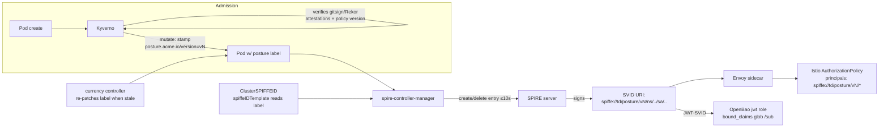

# Projecting Kyverno admission "posture" into a SPIRE workload identity

Research for the governance/security conference demo. Question: can Kyverno's
admission-time *policy posture* (which policy version + attestations a workload
satisfied) become a real, attested property of the workload's SPIRE SVID, so
that Istio `AuthorizationPolicy` and OpenBao gate on it?

Primary sources are official SPIFFE/SPIRE, Istio, Kyverno and OpenBao/Vault
docs and repos. Blogs are cited only to fill gaps and marked `[blog]`.

---

## Feasibility verdict

**Yes — feasible for a KinD demo, natively, with no custom SPIRE plugin.** The
pragmatic wiring is:

> Kyverno **mutate** stamps a posture label on the pod at admission →
> **one `ClusterSPIFFEID`** whose `spiffeIDTemplate` reads that label and bakes
> the posture into the **SPIFFE ID path** → the SVID's URI *is* the posture,
> signed by the SPIRE CA → Istio matches the path prefix in `source.principals`,
> OpenBao (JWT auth) matches it in `bound_claims` (glob).

This makes posture a **real attested SVID property** (a path segment inside the
SPIFFE URI that SPIRE signs), not a soft Kubernetes label. The pod label is only
the *plumbing input* to the template; the attested artifact is the SVID.

The one honest caveat that stops this being a pure "wire it up" story: posture
is an **admission-time snapshot**. Kyverno runs only at admission, so a workload
that later *falls out of currency* keeps its "current" SVID until something
re-evaluates it. Making posture a *live* property needs a small currency
controller that re-patches (or removes) the label; `spire-controller-manager`
then reconciles the entry away within ~10s and the SVID stops renewing within
one (short) SVID TTL. See [Q2](#q2) and [Gaps & risks](#gaps).

Custom claims *per registration entry* are **not** natively supported by SPIRE,
so posture cannot ride as an arbitrary JWT claim without a server-wide
`CredentialComposer` plugin. Putting posture in the **path** sidesteps that
entirely and is the recommended route.

---

## Q1 — How SPIRE assigns identities in Kubernetes {#q1}

**Two-stage attestation.**
- **Node attestation**: the SPIRE agent proves itself to the server, in k8s
  typically via the `k8s_psat` NodeAttestor (projected SA token, validated with
  the TokenReview API). Agent gets an ID like
  `spiffe://<td>/spire/agent/k8s_psat/<cluster>/<node-UID>`.
  Source: SPIRE k8s_psat plugin docs —
  https://github.com/spiffe/spire/blob/main/doc/plugin_server_nodeattestor_k8s_psat.md
- **Workload attestation**: the agent identifies the calling pod via the `k8s`
  WorkloadAttestor (queries the kubelet) and produces **selectors**:
  `k8s:ns:<ns>`, `k8s:sa:<sa>`, `k8s:pod-label:<k>:<v>`, `k8s:pod-name`,
  `k8s:pod-uid`, `k8s:container-image`, `k8s:node-name`, `k8s:pod-owner`, etc.
  Source: SPIRE k8s WorkloadAttestor docs —
  https://github.com/spiffe/spire/blob/main/doc/plugin_agent_workloadattestor_k8s.md

**Registration entries** map a selector set → a SPIFFE ID. Fields:
`parent_id`, `spiffe_id`, `selectors`, `x509_svid_ttl`, `jwt_svid_ttl`,
`dns_names`, `federates_with`, `hint`. SVID form:
- **X.509-SVID**: SPIFFE ID is the URI SAN; extra `dns_names` become DNS SANs.
- **JWT-SVID**: SPIFFE ID is the `sub` claim; plus standard `aud`/`exp`/`iat`/
  `iss`. **A registration entry cannot carry arbitrary custom claims** — the
  only knob is a server-wide `CredentialComposer` plugin (see Q2 option D).
  Source: SPIRE registration / SVID concepts —
  https://spiffe.io/docs/latest/deploying/registering/ ,
  JWT-SVID spec — https://github.com/spiffe/spiffe/blob/main/standards/JWT-SVID.md

**`ClusterSPIFFEID` CRD** (`spire-controller-manager`) is the declarative front
end: you don't hand-write entries, you write a `ClusterSPIFFEID` and the
controller renders entries for every matching pod. Key fields:
- `spiffeIDTemplate` — Go `text/template`, with access to `.TrustDomain`,
  `.ClusterName`, `.ClusterDomain`, `.PodMeta` (incl. `.PodMeta.Labels`),
  `.PodSpec` (incl. `.ServiceAccountName`), `.NodeMeta`, `.NodeSpec`.
  Pod labels are usable, e.g. `{{ index .PodMeta.Labels "posture.acme.io/version" }}`.
- `podSelector` / `namespaceSelector` — standard label selectors that scope which
  pods get an entry.
- `workloadSelectorTemplates`, `dnsNameTemplates`, `autoPopulateDNSNames`,
  `ttl`, `jwtTtl`, `federatesWith`, `hint`.
  Source: CRD reference —
  https://github.com/spiffe/spire-controller-manager/blob/main/docs/clusterspiffeid-crd.md

So an SVID's identity path is **template-derived from pod/ns/SA attributes**,
and crucially **from pod labels** — which is the hook posture rides on.

---

## Q2 — The hand-off (the crux): posture → SVID {#q2}

**Can Kyverno drive this?** Yes. Kyverno `ClusterPolicy` can, at Pod admission:
- **mutate** — add/patch `metadata.labels` on the Pod (or a ServiceAccount),
  static or computed from context (`APICall`, `ConfigMap`, image data).
- **generate** — create arbitrary (incl. cluster-scoped) CRs like a
  `ClusterSPIFFEID`, with `synchronize: true` to keep them live and `clone` to
  copy data.
  Source: Kyverno mutate — https://kyverno.io/docs/writing-policies/mutate/ ;
  generate — https://kyverno.io/docs/writing-policies/generate/ ;
  external context/API calls — https://kyverno.io/docs/writing-policies/external-data-sources/

### Viable options and tradeoffs

| # | Option | How posture reaches the SVID | Native? | Verdict |
|---|--------|------------------------------|---------|---------|
| **A** | **Mutate label → one `ClusterSPIFFEID` templating the path** | Kyverno stamps `posture.acme.io/version=<v>`; a single `ClusterSPIFFEID` reads the label in `spiffeIDTemplate`, baking posture into the SPIFFE URI path | ✅ | **Recommended.** Fewest parts, no plugin, posture is in the signed URI |
| B | **Multiple `ClusterSPIFFEID`s, one per posture tier, selected by `podSelector`** | Each tier renders a different path; the label just picks which one matches | ✅ | Equivalent to A, more declarative but more objects |
| C | **Kyverno `generate` a per-pod `ClusterSPIFFEID`/`ClusterStaticEntry`** | Generate a CR per workload encoding its posture; `synchronize` keeps it live | ✅ | Works, but a CR per pod = more moving parts than A. Skip unless you need per-workload bespoke IDs |
| D | **Server-wide `CredentialComposer` plugin adds a `posture` JWT claim** | Plugin (`ComposeWorkloadJWTSVID`) injects a custom claim | ⚠️ plugin, server-wide | Bleeding-edge, most code, and the plugin has no per-pod posture context without extra lookups. Only if you insist on a clean custom claim vs a path segment |
| E | **Custom node/workload attestor plugin** | New attestor surfaces posture as a selector | ❌ overkill | Not needed — the k8s attestor + pod labels already expose pod attributes |

`CredentialComposer` is real (SPIRE ≥ 1.6.0, `ComposeWorkloadX509SVID` /
`ComposeWorkloadJWTSVID`) but is **server-level, not per-entry**, so it can't
read a given pod's posture cleanly.
Source: plugin SDK — https://pkg.go.dev/github.com/spiffe/spire-plugin-sdk/templates/server/credentialcomposer ;
SPIRE v1.6.0 release — https://github.com/spiffe/spire/releases/tag/v1.6.0

### How dynamic posture changes propagate

`spire-controller-manager` reconciles `ClusterSPIFFEID` → entries continuously:
on Pod/CRD change **and** on a `gcInterval` (default **10s**). If a pod's label
changes so it stops matching (or matches a different tier), the controller
**deletes/updates the entry within ≤ ~10s**.
Source (reconcile + gcInterval): controller-manager config —
https://github.com/spiffe/spire-controller-manager/blob/main/docs/configuration.md

Propagation to the *live SVID* is then bounded by **SVID TTL/rotation**: the
agent re-requests before expiry. SPIRE defaults: `default_x509_svid_ttl = 1h`,
`default_jwt_svid_ttl = 5m` (both settable, and `ClusterSPIFFEID` `ttl`/`jwtTtl`
cap them per-identity).
Source: SPIRE server config reference —
https://spiffe.io/docs/latest/deploying/spire_server/

**Net:** when a workload falls out of currency, *something must flip the label*
(Kyverno only fires at admission — see [Gaps](#gaps)). Once flipped, the entry
is gone in ~10s and the workload stops getting a "current" SVID within one TTL.
**Favor JWT-SVIDs (5m default) for gating** so revocation is snappy.

---

## Q3 — What Istio `AuthorizationPolicy` can match {#q3}

For **mTLS / SPIFFE** callers, the authorization context exposes the peer
**principal** (the SPIFFE ID string), `source.namespace`, and workload
identity — *not* arbitrary claims. `source.principals` matches the SPIFFE URI
with **exact, prefix (`val*`) or suffix (`*val`)** string matching. There is no
arbitrary-regex on `principals` in the public API, and no per-segment claim
object for mTLS peers.
Source: AuthorizationPolicy rule ref —
https://istio.io/latest/docs/reference/config/security/authorization-policy/#Source ;
principals / string-match behaviour — https://istio.io/latest/docs/reference/config/security/conditions/

**Implication:** put posture as a **leading path segment** so a single `*`
prefix wildcard matches it, e.g.
`spiffe://td/posture/current/ns/<ns>/sa/<sa>` matched by
`principals: ["spiffe://td/posture/current/*"]`. This is the reliable expression.

`request.auth.claims[...]` (incl. custom claims, JSON-pointer nested keys) **is**
matchable — but only for **JWT request auth** configured via `RequestAuthentication`
(the `requestPrincipals` path), *not* for mTLS peer SVIDs. So if you want Istio
to read a `posture` *claim* rather than a path segment, the caller must present
a JWT-SVID as a request credential, which is a heavier setup than the path-prefix
approach. Recommendation: **use the path segment for Istio.**
Source: JWT claim conditions — https://istio.io/latest/docs/reference/config/security/conditions/ ;
RequestAuthentication — https://istio.io/latest/docs/reference/config/security/request_authentication/

---

## Q4 — OpenBao / Vault authenticating SPIFFE + gating on posture {#q4}

**No native SPIFFE auth in OpenBao.** HashiCorp Vault *does* have a **SPIFFE**
auth method (accepts X.509- or JWT-SVIDs, maps SPIFFE IDs → policies) but it is
**Enterprise-only, a licensed plugin** — not in OSS Vault or in OpenBao.
Source: Vault SPIFFE auth (Enterprise) —
https://developer.hashicorp.com/vault/docs/auth/spiffe

**OpenBao path = JWT/OIDC auth method** validating SPIRE **JWT-SVIDs** against
SPIRE's **OIDC Discovery Provider** (JWKS). This is the established pattern and
ControlPlane's own getting-started repo uses exactly it (SPIRE JWT-SVID →
OpenBao `jwt` auth; `bound_subject=spiffe://…`, `bound_audiences`, `user_claim=sub`).
Sources: OpenBao JWT/OIDC auth — https://openbao.org/docs/auth/jwt/ ;
API — https://openbao.org/api-docs/auth/jwt/ ;
SPIFFE→Vault OIDC tutorial — https://spiffe.io/docs/latest/keyless/vault/readme/ ;
ControlPlane demo — https://github.com/controlplaneio/getting-started-spire-openbao

**Gating on posture** — two ways, both native to OpenBao's `jwt` role:
- **Posture in the SPIFFE ID path (recommended):** set
  `bound_claims_type = "glob"` and
  `bound_claims = { "/sub": "spiffe://td/posture/current/*" }`. `bound_claims`
  keys support JSON-pointer, values support `*` globs when type is `glob`.
- **Posture as a custom claim** (needs option D CredentialComposer): exact-match
  `bound_claims = { "posture": "current" }`.
- `bound_subject` is **exact-match only** (no glob), so it can't match a posture
  *prefix* — use `bound_claims`/glob instead.
Sources: `bound_claims_type` / `bound_claims` glob — https://openbao.org/api-docs/auth/jwt/ .
Richer claim matching is an open ask (OpenBao #493) but glob is enough today —
https://github.com/openbao/openbao/issues/493

So **secret issuance can be gated on posture** carried in the JWT-SVID's `sub`
path via a glob-matched `bound_claims`. Prefer JWT-SVIDs (5m TTL) so a
fallen-out-of-currency workload loses OpenBao access within minutes.

---

## Q5 — Trodden vs bleeding-edge, and the simplest viable wiring {#q5}

**Trodden ground:**
- SPIRE k8s attestation + `spire-controller-manager` + `ClusterSPIFFEID`
  templating the path from pod attributes — mainstream, documented.
- SPIRE JWT-SVID → Vault/OpenBao JWT/OIDC auth — mainstream (official SPIFFE
  tutorial + ControlPlane's own demo).
- Istio `source.principals` prefix-matching SPIFFE IDs — mainstream.

**Bleeding-edge / not native:**
- Posture as an **arbitrary custom claim** on the SVID (needs a server-wide
  `CredentialComposer` plugin) — avoid for the demo.
- Any *live* "is this still current?" that updates the SVID without a
  re-evaluation step — **you build the currency controller** (see Gaps).
- Vault's native SPIFFE auth — Enterprise, irrelevant to OpenBao.

### Recommended wiring for the KinD demo {#wiring}



Concrete pieces (all Helm-installable on KinD):
1. **SPIRE server + agent + `spire-controller-manager`** (SPIFFE Helm charts).
2. **SPIRE OIDC Discovery Provider** (for OpenBao JWT auth / JWKS).
3. **Kyverno**: your existing verify-images / attestation / policy-version
   policies produce the posture; add a **mutate** rule that stamps
   `posture.acme.io/version: "<vN>"` on pods that satisfy the current versioned
   policy, plus a **validate** rule that *rejects* user-supplied `posture.*`
   labels (so only Kyverno can set them — see risk #2).
4. **One `ClusterSPIFFEID`**:
   ```yaml
   spec:
     spiffeIDTemplate: "spiffe://{{ .TrustDomain }}/posture/{{ index .PodMeta.Labels \"posture.acme.io/version\" }}/ns/{{ .PodMeta.Namespace }}/sa/{{ .PodSpec.ServiceAccountName }}"
     podSelector:
       matchExpressions:
         - { key: "posture.acme.io/version", operator: Exists }
     jwtTtl: 5m   # snappy revocation for the demo
   ```
5. **Istio `AuthorizationPolicy`**: `source.principals: ["spiffe://td/posture/vN/*"]`.
6. **OpenBao `jwt` role**: `bound_audiences=[openbao]`,
   `bound_claims_type=glob`, `bound_claims={"/sub":"spiffe://td/posture/vN/*"}`.
7. **A tiny currency controller** (CronJob or small controller) that recomputes
   currency and re-patches / removes the label when a running workload goes
   stale → controller-manager drops the entry in ~10s → SVID stops renewing
   within the JWT TTL. This is the piece that makes posture *dynamic* rather
   than admission-frozen.

Why this is "real" and not a soft label: the attested artifact the verifiers
trust is the **SVID URI signed by the SPIRE CA**, not the k8s label. The label
is a private input to entry generation; a caller cannot forge the SVID path
without the SPIRE CA. (Provided risk #2 is closed.)

---

## Gaps & risks (honest) {#gaps}

1. **Posture is an admission-time snapshot, not self-updating.** Kyverno fires
   only at admission. A pod that later falls out of currency keeps its
   "current" label — and thus a current SVID — until pod restart *unless* a
   separate **currency controller** re-patches the label. This is the single
   biggest gap; the demo must include that controller (even a 30-line CronJob)
   or explicitly narrate the limitation. Mitigation: short JWT TTL (5m) bounds
   the blast radius once the label does flip.
2. **The pod label is a trust boundary.** The `spiffeIDTemplate` trusts
   `PodMeta.Labels`, so anyone who can set that label can influence the SVID
   path. It must be settable **only** by the trusted Kyverno mutate policy: add
   a Kyverno **validate** rule rejecting user/workload-supplied `posture.*`
   labels, and ensure RBAC prevents workloads self-patching their own pods.
   Security-critical — get this wrong and posture is forgeable.
3. **No native per-entry custom JWT claims.** Posture must live in the SPIFFE ID
   **path** (recommended) or via a server-wide `CredentialComposer` plugin. Not
   a blocker, but rules out "just add a claim" without extra code.
4. **Istio mTLS matching is string prefix/suffix, not regex, and has no claim
   object for peers.** Order the path so posture is a **leading** segment for a
   clean `*` prefix match. Claim-based matching (`request.auth.claims`) needs a
   JWT presented as request auth, which is heavier — avoid for the demo.
5. **OpenBao has no native SPIFFE auth (Enterprise-only in Vault).** OSS route
   is JWT/OIDC only, so **X.509-SVID gating in OpenBao isn't available** — use
   **JWT-SVIDs**. `bound_subject` is exact-only; posture gating must use
   `bound_claims` + `bound_claims_type=glob`.
6. **Revocation latency = reconcile (≤10s) + SVID TTL.** Fine for a demo with
   `jwtTtl: 5m`; call the number out rather than implying instant revocation.
7. **Clock/tuning reality:** OIDC discovery cache/refresh (OpenBao default ~1h
   for remote bundles) and agent rotation timing mean live demos need TTLs and
   refresh intervals dialed down; leave those as tunable knobs, not hardcoded.

---

### Primary sources
- SPIRE k8s WorkloadAttestor — https://github.com/spiffe/spire/blob/main/doc/plugin_agent_workloadattestor_k8s.md
- SPIRE k8s_psat NodeAttestor — https://github.com/spiffe/spire/blob/main/doc/plugin_server_nodeattestor_k8s_psat.md
- SPIRE server config (default TTLs) — https://spiffe.io/docs/latest/deploying/spire_server/
- SPIRE registering workloads — https://spiffe.io/docs/latest/deploying/registering/
- JWT-SVID spec — https://github.com/spiffe/spiffe/blob/main/standards/JWT-SVID.md
- `ClusterSPIFFEID` CRD — https://github.com/spiffe/spire-controller-manager/blob/main/docs/clusterspiffeid-crd.md
- controller-manager config (gcInterval) — https://github.com/spiffe/spire-controller-manager/blob/main/docs/configuration.md
- CredentialComposer SDK — https://pkg.go.dev/github.com/spiffe/spire-plugin-sdk/templates/server/credentialcomposer
- Kyverno mutate — https://kyverno.io/docs/writing-policies/mutate/
- Kyverno generate — https://kyverno.io/docs/writing-policies/generate/
- Istio AuthorizationPolicy Source — https://istio.io/latest/docs/reference/config/security/authorization-policy/#Source
- Istio auth conditions — https://istio.io/latest/docs/reference/config/security/conditions/
- OpenBao JWT/OIDC auth — https://openbao.org/docs/auth/jwt/ , https://openbao.org/api-docs/auth/jwt/
- Vault SPIFFE auth (Enterprise) — https://developer.hashicorp.com/vault/docs/auth/spiffe
- SPIFFE → Vault OIDC tutorial — https://spiffe.io/docs/latest/keyless/vault/readme/
- ControlPlane SPIRE+OpenBao demo — https://github.com/controlplaneio/getting-started-spire-openbao
