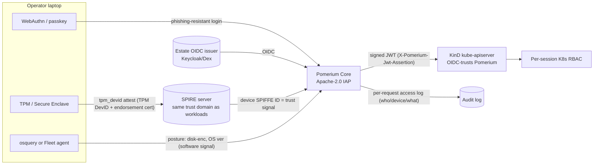

# 18 — Human, device-trusted access to Kubernetes & infra (the "human carrier")

Research for the zero-trust governance conference demo. **All web facts verified 2026-07-31.**
Scope: give *humans* phishing-resistant, device-trusted, per-session-RBAC, audited operational
access (kubectl / dashboards / break-glass) to a KinD-on-a-laptop estate that already runs
SPIFFE/SPIRE (workload id), gitsign keyless (supply-chain human id), Flux, Kyverno.

---

## Verdict (read this first)

**Teleport OSS is the wrong pick for an "open-source, demonstrably *attested* device trust" story — and it fails on a second axis too.**

Two hard licensing walls, both confirmed against Teleport's own docs (2026-07-31):

1. **Device Trust is Teleport Enterprise-only.** The docs say verbatim: *"Device Trust is available only with Teleport Enterprise."* This is exactly the hardware-attested (TPM / Secure Enclave) capability the demo is about. In OSS it does not exist. → the whole "attested EUD" narrative is paywalled.
2. **OIDC/SAML SSO connectors are Teleport Enterprise-only** too. Teleport Community only ships the **GitHub** auth connector. So Teleport OSS cannot even consume the estate's existing OIDC issuer without buying Enterprise — it would be a bolt-on identity island, the opposite of what Q4 asks.

Teleport OSS is still genuinely good at the *other* three requirements — **session recording, per-session MFA, and hardware-key (PIV touch) enforcement are all in Community** — and its k8s access UX is the most polished in the field. If the demo's headline were "recorded, MFA-gated kubectl", Teleport OSS wins. But the headline is *hardware-attested device trust wired into an OIDC/SPIFFE estate*, and on that Teleport OSS is disqualified.

### Recommended stack

> **Pomerium (open-source Core, Apache-2.0) as the identity-aware proxy in front of the KinD API server**, consuming the estate's **OIDC** and enforcing **WebAuthn** (phishing-resistant) + **enclave-bound device identity**, with **attested device trust** supplied by one of:
>
> - **Primary / estate-consistent:** **SPIRE `tpm_devid` node attestor** issues a **TPM-rooted SPIFFE ID to the laptop** (verified against the TPM manufacturer's endorsement cert + a proof-of-residency challenge). This is genuinely hardware-rooted *and* shares the estate's SPIFFE trust root — the "not a bolt-on" answer. Needs a real/virtual TPM (Linux laptop, or a Linux VM with swtpm/vTPM on a Mac).
> - **Cheapest-real / agentless:** **Pomerium's own WebAuthn device identity** — a key bound to the Secure Enclave/TPM, unclonable, in Core. Real hardware-bound key, but privacy-scoped ("browser identity", see caveats) — not a manufacturer-verified device cert.
> - **Rich posture (defense-in-depth, honestly software-only):** **Fleet (fleetdm, MIT) + osquery** feeding disk-encryption / OS-version / screen-lock signals into Pomerium policy. Label it plainly: **spoofable by a local admin**, so it is a *posture* signal, not a *root of trust*.
>
> **Session audit:** Pomerium logs every request (identity + device + context). It does **not** record/replay terminal sessions. If full session recording/replay is a must-have, run **Teleport OSS Community** for the recorded-kubectl path *alongside* Pomerium — you cannot get both device-attestation-over-OIDC *and* terminal session recording from one OSS box today.

Everything above is Apache-2.0 / MIT / CNCF-OSS and runs on KinD on a laptop. The one real
constraint is TPM availability for the strongest attestation tier (see gaps).

---

## Q1 — Teleport: what's OSS-Community vs Enterprise-only?

Teleport = the most mature k8s/infra access proxy, but heavily open-core. Verified against goteleport.com docs & blog, 2026-07-31.

| Capability | Edition | Source (verified 2026-07-31) |
|---|---|---|
| **Device Trust (hardware TPM/Secure Enclave attestation)** | **Enterprise only** — *"Device Trust is available only with Teleport Enterprise."* | https://goteleport.com/docs/zero-trust-access/device-trust/ |
| **OIDC / SAML SSO connectors** | **Enterprise only**; Community ships **GitHub connector only** | https://goteleport.com/docs/zero-trust-access/sso/integrate-idp/github-sso/ ; discussion https://github.com/gravitational/teleport/discussions/39158 |
| Session recording (SSH/k8s, playback) | **Community (Core)** | https://goteleport.com/features/ |
| Per-session MFA (SSH & Kubernetes) | **Community (Core)** — since v6.1 | https://goteleport.com/docs/zero-trust-access/authentication/per-session-mfa/ ; https://goteleport.com/resources/guides/teleport-multi-factor-auth/ |
| Hardware-key (PIV) enforcement — `require_session_mfa: hardware_key_touch` | **Community (Core)** | https://goteleport.com/docs/zero-trust-access/authentication/hardware-key-support/ |
| Kubernetes access mgmt, RBAC, cert auth, audit log | **Community (Core)** | https://goteleport.com/features/ |
| JIT/Access Requests, Moderated Sessions, IP-pinning, FedRAMP | **Enterprise only** | https://goteleport.com/features/ |
| Per-session MFA **for web/TCP *apps*** ("phishing-resistant MFA for applications", v16) | **Enterprise self-hosted only** | https://goteleport.com/blog/teleport-16/ |

**Licensing trap on "Community" itself:** since **Teleport 16 (June 2024)** the prebuilt
*Community Edition binaries* carry a **commercial license, not Apache-2.0**: a company may use
them only if it has **< 100 employees AND < $10M annual revenue**; individuals free for
personal/hobby use. The *source* remains **AGPLv3** (you can compile it yourself under AGPL).
Pre-v16 binaries stay Apache-2.0. → For a conference this is fine (you're an individual /
demoing), but do not tell the audience "Teleport is Apache-2.0 open source" — it isn't anymore.
Sources: https://goteleport.com/blog/teleport-community-license/ ; https://github.com/gravitational/teleport/discussions/39158

**Bottom line for Q1:** the two features that make Teleport *interesting for this specific talk*
(device attestation, OIDC) are both behind Enterprise (median contract ~$90k/yr per third-party
resellers — treat as indicative, not a Teleport price list). Teleport OSS remains excellent for
**recorded, MFA-gated, hardware-key-touch kubectl** — keep it as the fallback if session
recording is the star, not device trust.

---

## Q2 — The current field (maturity, open-core paywall, device posture, k8s, audit)

| Product | License / OSS reality | Device-posture mechanism & how hardware-rooted | k8s access | Audit / recording | OIDC/SPIFFE fit |
|---|---|---|---|---|---|
| **Teleport** | Open-core; Community binaries commercial-restricted, source AGPLv3 | **TPM + Secure Enclave attestation — Enterprise only** | Best-in-class native | **Session recording in Community** | OIDC Enterprise-only |
| **Pomerium** | **Core = Apache-2.0, genuinely OSS**; Enterprise adds console/device mgmt | **WebAuthn enclave-bound key (Core)** + **osquery/FleetDM posture**; enclave key unclonable but privacy-scoped | Native kubectl (signs JWT the API server trusts) | Per-request access log; **no terminal recording** | **Native OIDC** (Keycloak, Dex, Okta…); JWT out |
| **HashiCorp Boundary** | **BSL 1.1** (not OSI-OSS since Aug 2023); free non-production | Posture via external identity/host signals; no built-in hardware attestation | Yes (dynamic/JIT k8s targets) | **Session recording: RDP (1.0) + SSH; k8s/DB "in progress"** | OIDC yes; no SPIFFE emit |
| **Cloudflare Access / Zero Trust** | **Proprietary SaaS** (free ≤50 users); not self-hostable | WARP client posture (OS ver, disk-enc, MDM, EDR score) — signals, not hardware attestation of a device cert | kubectl via WARP tunnel | Cloudflare-side logs | OIDC/SAML IdP-agnostic; cloud-dependent |
| **StrongDM** | **Proprietary** control plane | Posture via IdP/MDM integrations | Strong k8s | Full session logging (vendor) | OIDC; closed |
| **Tailscale** | Client OSS (BSD); **coordination server proprietary** (Headscale is 3rd-party OSS control plane) | **Device posture** (MDM status, CrowdStrike/SentinelOne/Intune/Jamf, OS ver) — reads *external* posture; WireGuard node key is device-bound | Tailscale SSH + ACLs; k8s operator | Tailnet audit logs; SSH session recording (higher tiers) | **`tsidp`** = OSS OIDC IdP from tailnet identity (github.com/tailscale/tsidp) — interesting for OIDC, but posture depends on 3rd-party MDM/EDR |
| **Twingate** | **Proprietary** (free tier); clients partly OSS | Reads Intune/Jamf/CrowdStrike/SentinelOne posture | Yes | Vendor logs | OIDC/SAML; closed core |
| **Pritunl Zero** | **OSS core** (SSO + 2FA, web/SSH zero-trust) | Thin; no hardware attestation | SSH-centric, weak k8s | Basic | OIDC yes; small project |
| **Ory (Oathkeeper/Keto)** | **Apache-2.0** | None built-in — it's an authz decision engine, not a device-posture source | Via reverse-proxy pattern | Decision logs | OIDC/JWT native; you'd bolt posture on yourself |
| **Google BeyondCorp** | **Proprietary** (BeyondCorp Enterprise / Chrome Enterprise); "BeyondCorp" the *model* is public, the product isn't OSS or self-hostable | Endpoint Verification / Chrome posture | GCP-centric | Cloud logs | Google-cloud-bound — not viable for a laptop OSS demo |

**Newer / adjacent 2025–2026 entrants worth a name-check:**
- **OpenZiti** (Apache-2.0, github.com/openziti/ziti) — full OSS zero-trust overlay with
  **built-in posture checks** and community **osquery** posture integration; can front k8s.
  A credible all-OSS alternative to Pomerium if you want the network-overlay flavour rather than
  an HTTP identity-aware proxy. (osquery posture: https://github.com/openziti/ziti/issues/2267)
- **Fleet (fleetdm)** MIT — the osquery fleet manager, now with open-source MDM; the natural
  posture *source* to pair with any proxy (see Q3).

**Verified sources for Q2:**
Pomerium OSS/Apache-2.0 & IdP list — https://github.com/pomerium/pomerium , https://www.pomerium.com/docs/capabilities/kubernetes-access ;
Boundary BSL & session recording — https://www.hashicorp.com/en/blog/boundary-1-releases-with-rdp-session-recording-and-improved-management ;
Cloudflare free tier & WARP posture — https://developers.cloudflare.com/cloudflare-one/team-and-resources/devices/cloudflare-one-client/ ;
Tailscale posture & tsidp — https://tailscale.com/docs/features/device-posture , https://github.com/tailscale/tsidp ;
OpenZiti — https://github.com/openziti/ziti .

---

## Q3 — OSS device-posture / EUD-attestation building blocks: which are *hardware-rooted*?

The crux: which of these give a signal a **local admin cannot forge on their own laptop**?

| Building block | License | Hardware-rooted? | Reality on a laptop demo |
|---|---|---|---|
| **SPIRE `tpm_devid` node attestor** | Apache-2.0 (CNCF) | **YES — strongest.** TPM DevID (IEEE 802.1AR), server verifies endorsement cert chains to a **manufacturer CA** + a **proof-of-residency challenge** proving the key lives in the TPM | Genuinely attested. Needs a TPM (Linux laptop, or Linux VM + swtpm/vTPM). Also issues a SPIFFE ID → estate-consistent. Docs: https://github.com/spiffe/spire/blob/main/doc/plugin_server_nodeattestor_tpm_devid.md ; community plugin https://github.com/spiffe/spire-tpm-plugin |
| **Keylime** | Apache-2.0 (CNCF) | **YES — deepest.** TPM 2.0 + IMA + measured boot; continuous **runtime integrity** attestation, not just "a key exists" | Overkill for kubectl gating and Linux/TPM-only, but it's the honest answer to "prove the *machine state* is trusted". https://keylime.dev/ , https://github.com/keylime/keylime |
| **WebAuthn platform/device attestation** | open standard | **Partly.** With attestation `direct` you get a `tpm`/`apple`/`packed` statement you can verify against **FIDO MDS**; with the default `none` you get an enclave-bound key but no manufacturer proof | The enclave-bound key is unclonable (good). Verifying the *manufacturer* attestation chain is what upgrades it from "unclonable browser key" to "attested device". MDS/attestation refs: https://developers.yubico.com/WebAuthn/WebAuthn_Developer_Guide/Attestation.html ; https://www.corbado.com/glossary/attestation |
| **osquery** | Apache-2.0 | **NO — software signal.** Rich device facts (FileVault, OS ver, patch level) but a **local admin can disable FileVault / kill the agent / edit the config**; must be validated server-side and paired with MDM lock-down | Great for *degrade on stale/non-compliant device* stories, but never call it "attested". |
| **Fleet (fleetdm)** | **MIT** (free core incl. MDM + osquery) | Same as osquery (it *is* osquery mgmt) — software signal, unless combined with MDM-enforced profiles | The practical way to run osquery posture at "fleet" scale; Helm-deployable into KinD. https://github.com/fleetdm/fleet |
| **Kolide** (1Password) | **Proprietary SaaS** (osquery-based) | Software signal | Not OSS — skip for the OSS story. |

**Takeaway:** for a *genuinely hardware-rooted* laptop signal that is OSS, it's **TPM-based**
(SPIRE `tpm_devid` or Keylime) or **verified WebAuthn attestation**. **osquery/Fleet are
software posture** — legitimately useful for "access degrades from a stale/unmanaged device",
but honestly labelled as spoofable, not a root of trust.

---

## Q4 — Keeping it consistent with the estate's SPIFFE/OIDC (not a bolt-on)

Two clean ways to make the human/device layer share the estate's trust roots:

1. **Device identity on the same SPIFFE root.** `spire-server` already runs for workloads. Add the
   **`tpm_devid` node attestor** so a **laptop's TPM earns a SPIFFE ID** from the *same* SPIRE
   trust domain that issues workload SVIDs. The device is now a first-class SPIFFE identity, not a
   parallel system. The proxy (Pomerium) can gate on "request carries a valid device-SVID / device
   is a known SPIFFE ID". This is the strongest "not a bolt-on" story and it's all Apache-2.0.
   (Infracloud has a worked TPM→SPIRE→Envoy example: https://www.infracloud.io/blogs/device-workload-authentication/)

2. **Human identity via the same OIDC issuer, device gate on top.** Pomerium natively consumes
   OIDC (Keycloak/Dex/etc.), so the *human* logs in through the estate's existing issuer — the same
   root the rest of the platform trusts — and Pomerium mints a JWT the KinD API server verifies
   (`--oidc-issuer-url` / structured RBAC). No second user directory. SPIRE also ships an **OIDC
   Discovery Provider** (serves a JWKS/OIDC doc for JWT-SVIDs) if you want workloads and the proxy
   to interoperate over OIDC federation: https://spiffe.io/docs/latest/keyless/vault/readme/

3. **Sigstore/Rekor tie-in (optional flourish):** the human *supply-chain* identity is already
   keyless-OIDC→Rekor (gitsign). The *operational* human identity here is the *same OIDC subject*.
   You can narrate "the human who signed the commit is the same OIDC identity now being device-gated
   for kubectl" — one identity, two planes (provenance + operations). No new trust root needed.

Teleport OSS cannot participate in (2) at all (OIDC = Enterprise). That's the clincher for Q4.

---

## Q5 — Simplest *honest* wiring for the KinD demo (attested, not a soft label)

Fewest moving parts that still delivers **attested device trust + phishing-resistant human auth + audit**:

**Tier the demo so each claim is defensible:**

- **Phishing-resistant human auth** → WebAuthn/passkey login at Pomerium (or via the OIDC issuer). Real, no caveats.
- **Attested device trust (the honest core):**
  - *Strong tier* → **SPIRE `tpm_devid`**: laptop TPM proves residency + chains to manufacturer CA → device SPIFFE ID. Pomerium denies if absent. **This is the "real, not self-asserted" moment.** Run the operator side in a **Linux VM with swtpm/vTPM** if the presenting laptop is an Apple Silicon Mac (no TPM).
  - *Agentless tier* → **Pomerium WebAuthn enclave device key** — unclonable Secure-Enclave/TPM-bound key; weaker than a verified manufacturer cert but still not a soft label.
  - *Posture tier (clearly software)* → **Fleet/osquery** signals for "degrade if FileVault off / OS stale". Say out loud: local-admin-spoofable, defense-in-depth only.
- **Per-session RBAC** → Pomerium forwards a signed JWT; kube-apiserver maps OIDC claims to Roles. Standard, works on KinD.
- **Audit** → Pomerium access log records identity + device + resource per request. (If you want *recorded/replayable* kubectl, add **Teleport OSS Community** on the side — session recording is in Community.)

**Absolute minimum viable (one proxy, still real):** Pomerium Core + WebAuthn enclave device
identity + OIDC + access log, in front of the KinD API server. That alone is phishing-resistant +
hardware-*bound* device key + audited, entirely Apache-2.0. Add SPIRE-TPM to upgrade "bound" →
"attested"; add Fleet to upgrade posture richness.

---

## Gaps, licensing traps & risks (be blunt)

**Licensing traps**
- **Teleport Device Trust = Enterprise-only. Teleport OIDC/SAML SSO = Enterprise-only.** Both are load-bearing for this talk. Do not demo Teleport OSS and imply device attestation or OIDC.
- **Teleport Community binaries are commercially restricted** (< 100 emp / < $10M rev), source AGPLv3. Not Apache-2.0 anymore (since v16, June 2024).
- **HashiCorp Boundary is BSL 1.1**, not OSI-open-source, since Aug 2023 — and its **session recording does not yet cover Kubernetes** (RDP shipped in 1.0, SSH present, k8s/DB "in progress"). Don't promise recorded-kubectl on Boundary today.
- **Cloudflare / Google BeyondCorp / StrongDM / Twingate are proprietary and/or SaaS** — not self-hostable on a laptop; they read *external* MDM/EDR posture, they don't originate a hardware attestation you can show end-to-end. Cloudflare's free tier is real but cloud-dependent.
- **Tailscale's control plane is proprietary** (Headscale is a separate community project); its device *posture* mostly means "reads a 3rd-party MDM/EDR score", not a hardware attestation Tailscale itself performs. `tsidp` (OIDC) is the genuinely interesting OSS bit.

**Technical / "can't fully fake it on a laptop" risks**
1. **TPM availability.** The strong attestation tier (SPIRE `tpm_devid`, Keylime) needs a TPM. **Apple Silicon Macs have no TPM** (Secure Enclave is not DevID-compatible), so on a MacBook you must run the operator side in a **Linux VM with a virtual TPM (swtpm/vTPM)** — which somewhat undercuts "this is my real laptop's hardware". Decide honestly which machine presents. A physical Linux/Windows laptop with a real TPM is the cleanest demo.
2. **WebAuthn ≠ automatic hardware attestation.** Pomerium's WebAuthn device identity is, in its own docs, closer to **"browser identity"** and privacy-scoped; the default WebAuthn attestation conveyance is `none`. To claim "manufacturer-attested device" you must request attestation `direct` and verify the statement against FIDO MDS — check whether Pomerium Core exposes that or whether you're really demoing an *unclonable enclave-bound key* (still honest, but say which).
3. **osquery/Fleet are software posture** — a local admin can disable the very controls being checked. Frame as "access *degrades* from a non-compliant device", never "attested".
4. **No single OSS box gives device-attestation-over-OIDC AND terminal session recording.** Pomerium (attestation + OIDC, request-level audit) vs Teleport OSS (recording, but no OIDC/Device Trust). If both are must-haves, you're running two components — say so rather than implying one tool does everything.
5. **Moving parts.** The estate-consistent SPIRE-TPM path is the most impressive but the most fiddly (TPM provisioning, endorsement-cert trust config). Rehearse it; keep the Pomerium-WebAuthn agentless tier as the reliable fallback if TPM setup misbehaves live.

---

## Primary sources (all verified 2026-07-31)

- Teleport Device Trust (Enterprise-only) — https://goteleport.com/docs/zero-trust-access/device-trust/
- Teleport per-session MFA — https://goteleport.com/docs/zero-trust-access/authentication/per-session-mfa/
- Teleport hardware key support — https://goteleport.com/docs/zero-trust-access/authentication/hardware-key-support/
- Teleport feature matrix (Core vs Enterprise) — https://goteleport.com/features/
- Teleport GitHub SSO (OIDC/SAML Enterprise-only) — https://goteleport.com/docs/zero-trust-access/sso/integrate-idp/github-sso/
- Teleport Community license change (v16, commercial restriction) — https://goteleport.com/blog/teleport-community-license/ ; https://github.com/gravitational/teleport/discussions/39158
- Pomerium Kubernetes/kubectl access — https://www.pomerium.com/docs/capabilities/kubernetes-access
- Pomerium device identity — https://www.pomerium.com/docs/concepts/device-identity ; WebAuthn — https://www.pomerium.com/docs/integrations/device-context/webauthn
- Pomerium ↔ FleetDM integration — https://www.pomerium.com/integrations/fleetdm
- Pomerium source (Apache-2.0) — https://github.com/pomerium/pomerium
- HashiCorp Boundary session recording (RDP 1.0, k8s in progress) — https://www.hashicorp.com/en/blog/boundary-1-releases-with-rdp-session-recording-and-improved-management
- Cloudflare One client / device posture — https://developers.cloudflare.com/cloudflare-one/team-and-resources/devices/cloudflare-one-client/
- Tailscale device posture — https://tailscale.com/docs/features/device-posture ; tsidp — https://github.com/tailscale/tsidp
- OpenZiti — https://github.com/openziti/ziti ; osquery posture request — https://github.com/openziti/ziti/issues/2267
- Fleet (fleetdm, MIT) — https://github.com/fleetdm/fleet
- SPIRE `tpm_devid` node attestor — https://github.com/spiffe/spire/blob/main/doc/plugin_server_nodeattestor_tpm_devid.md ; community plugin https://github.com/spiffe/spire-tpm-plugin
- SPIRE OIDC Discovery Provider — https://spiffe.io/docs/latest/keyless/vault/readme/
- Keylime (CNCF, TPM+IMA remote attestation) — https://keylime.dev/ ; https://github.com/keylime/keylime
- TPM→SPIRE→Envoy device+workload auth (worked example, *vendor blog*) — https://www.infracloud.io/blogs/device-workload-authentication/
- WebAuthn attestation & FIDO MDS — https://developers.yubico.com/WebAuthn/WebAuthn_Developer_Guide/Attestation.html ; https://www.corbado.com/glossary/attestation

*Blogs/third-party marked inline; everything else is official docs/GitHub.*
