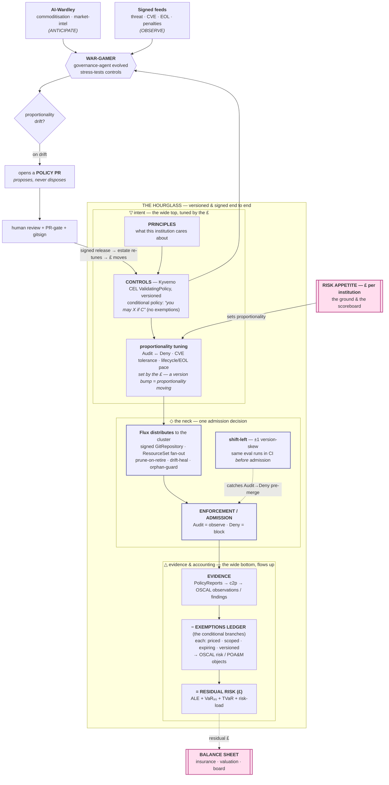
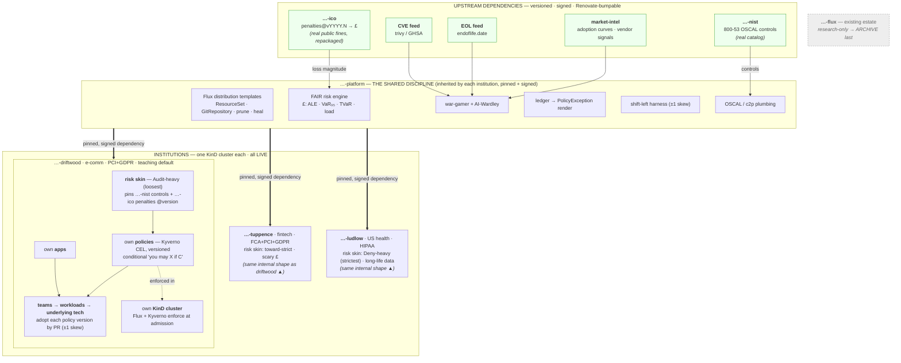

# The whole model — one page

Consolidation of the charting grilling (2026-07-23). The map's tickets hold the detail; this is the
picture they add up to, plus the build order and the talk's spine.

## Thesis (one line)

> Governance is a **proportionate, informed, continuously re-tuned response to quantified risk** —
> and versioning the whole chain from risk-appetite to evidence, with **every actor attestable**, is
> how proportionality stays honest and current as the world moves.

Policy is a **versioned dependency** (a lint/rule pack): pinned, signed, adopted per-team by PR.
That's the *mechanism*. Risk is the *ground*. The hourglass is the *structure*. The living loop is
what keeps it *alive*.

## It's all the policy (2026-07-23)

**What the policy *is*:** not a compliance overlay, not exemptions, not added complexity — it is the
**executable codification of how the organisation operates**, and the **formal record of every
governance decision** taken. Each rule is a documented decision, **grounded in proportionality (£)**
and **stress-tested by wargaming**. We're not carving special cases; we're writing down how the org
runs. That recasts the vocabulary: "exemptions" are just *documented operating decisions* (no
favours); the OSCAL up-flow is the *formal decision record*; provenance is *decision attribution*;
versioning is the *decision history*; the war-gamer is how the decisions get *tested*.

There are no subsystems — there is **one artifact, the policy** (versioned, signed, attestable), and
everything else is either a *projection* of it or a *function around* it.

**The policy@version is a workload's complete governance envelope.** "Which version of the policy do
you satisfy?" is the single fact that determines every surface:
- **admission** — may you run at all;
- **runtime envelope** — how you're caged (resources / WAF / caps) if your posture is behind;
- **identity** — the posture claim baked into your SPIFFE/SPIRE SVID;
- **reach** — who you may call (Istio `AuthorizationPolicy` gates on that claim);
- **entitlement** — what secrets you're issued (OpenBao gates on it).

The graded "self-envelope" and "posture-as-identity" are **not two mechanisms** — they're two
*projections* of the same versioned policy: one onto your own runtime, one onto your identity and
relationships.

**Around that one artifact runs a ring of functions:** *informed* by risk £ + the feeds → *proposed*
by the war-gamer + humans → *distributed* by Flux (signed, pinned, pruned) → *projected/enforced* by
Kyverno across every surface above → *evidenced* up as OSCAL → *priced* as TCoR. The hourglass, the
six-org graph, the living loop — all of it is the **lifecycle of the one policy**.

The thesis at its tightest: **policy is a versioned dependency — and that one dependency is the whole
governance surface.** Every talk beat is the same object seen from a different angle; the build is one
policy artifact with many projections, not N subsystems.

## The integrated picture

> Spanning everything: **every actor &amp; action is attestable** (`gitsign` keyless → Rekor) —
> verify, don't trust. The whole hourglass — appetite, controls, ledger, evidence — is versioned, so
> the £ at the bottom always matches the policy at the top.

## The six-org dependency & provenance graph

> All orgs are `policy-as-versioned-*` (the prefix is the impersonation guardrail). **Every hop is a
> signed, versioned dependency** — Renovate opens the bump PR at every level (regulator → platform →
> institution → team), and `gitsign` → Rekor makes each bump attestable: regulator raises a fine →
> `…-ico` bumps → the institution's £ re-tunes → proportionate controls tighten, all as reviewable PRs.

## What's built (nothing is a "nice-to-have")

- **Distribution** — Flux: `ResourceSet` version fan-out, signed `GitRepository`, prune-on-retire,
  drift-heal, `dependsOn`/health, notification spine.
- **Enforcement** — Kyverno CEL `ValidatingPolicy`; **conditional policy** (exemptions dissolved —
  "you may X if C", uniform, versioned); orphan-guard locked door.
- **Risk engine (actuarially grounded — FAIR *is* frequency×severity)** — `(min,mode,max)` leaves →
  beta-PERT → Monte-Carlo → aggregate loss distribution → **ALE + VaR₉₅ + TVaR** (Expected
  Shortfall — the tail measure Solvency II mandates, not just the percentile). The £ carries a
  **risk load** for volatility, not just the mean.
- **Proportionality = the four risk-financing moves** — for each risk: **avoid · reduce** (a
  control) **· transfer** (insure it — premium £ vs control £; moves the risk off residual onto a
  carrier) **· retain** (conditional policy + priced residual). The war-gamer weighs them and
  proposes whichever is proportionate; *insurance is a control option*. Net £ = risk-removed −
  cost-of-the-chosen-move, judged against tolerance bands.
- **Calibration via credibility theory (Bühlmann)** — the proven actuarial method for blending the
  model estimate with emerging actual losses; how the £ stays falsifiable and audit/insurer-defensible.
- **Feeds (all signed, versioned upstreams)** — institution threat register · CVE (`trivy`/GHSA) ·
  EOL (`endoflife.date`) · regulator penalties (`nist`+`ico`) · market-intel via **AI-Wardley**.
- **Living loop** — **war-gaming agent** (evolved `governance-agent`): collect → war-game → on
  drift open a **policy PR**; propose-never-dispose; the PR-gate + human + versioning are the rails.
- **Provenance** — every actor & action gitsign-signed → Rekor; verifiable feed→scenario→PR→merge.
- **Shift-left** — ±1 version-skew off the `ResourceSet` array; `kyverno apply` runs the target
  version's real action offline (Audit→Deny caught in CI; a deploy-time fail is unheard-of).
- **Evidence up-flow** — `c2p`/OSCAL; exemptions/accepted-risk as OSCAL `risk`/POA&M objects.
- **Balance sheet = economic / risk-based capital** — residual £ (post reduce/transfer/retain),
  framed as Solvency-II-style economic capital held against quantified risk over a horizon → the
  reserving/provisioning line, the insurance-premium input, the diligence number, the board line.
  Validated against real practice: **underwriting warranties ↔ conditional policy**, **cat-modelling
  ↔ the war-gamer**, **IBNR reserving ↔ the provision**, **correlation/diversification ↔ shared-
  platform systemic risk**.
- **Anticipation** — Wardley (AI + market-intel): commoditisation + chains, ahead of the feeds.
- **NEW, folded in 2026-07-23:**
  - **Calibration / back-testing** — log real incidents/near-misses, compare to prediction,
    recalibrate; the number's falsifiability + its audit/insurer defensibility.
  - **Securing the security system** — feed integrity (signed/sourced/bounded) + AI-proposer bounds
    (confidence, rate-limit, learn-from-rejections), gate as hard backstop.
  - **Reflexive self-governance** — the apparatus prices itself (is it proportionate?), and governs
    its own supply chain (platform/Kyverno/Flux under the same risk model). It passes its own test.

## Build order (dependency-driven)

0. **Platform skeleton** — Flux + Kyverno + `ResourceSet`; `driftwood` minimal, one version live.
1. **Risk engine + conditional policy + the £** — FAIR against `driftwood`; `nist` controls feed.
2. **The other two institutions + `ico` penalties + the proportionality *comparison*** (same
   control, Audit in retail / Deny in health, different £) — the thesis's money shot.
3. **Up-flow + balance sheet (TCoR) + shift-left** — OSCAL risk objects; residual → £; CI ±1 check.
4. **Graded enforcement** — Kyverno mutate/generate cages a workload by posture (tiers over dials);
   cage cost feeds TCoR.
5. **Identity plane + workload posture-as-identity** — SPIRE + Istio + OpenBao; Kyverno→SPIRE posture
   projection (SVID path) + currency controller + label trust-boundary; posture-gated reach + secrets
   (workload flagship, `tuppence`).
6. **Human/device plane** — Pomerium Core (OIDC + WebAuthn) + SPIRE `tpm_devid`; Mac Secure-Enclave
   live; posture-gated human access (break-glass); UTM vTPM Windows/Linux EUD VMs (narrated-virtual).
7. **Living loop + honesty** — feeds + war-gamer (wargames human/device paths too) + AI-Wardley +
   provenance-for-every-actor; calibration + feed-integrity + reflexive self-governance.

## The talk's spine (through-line), and demonstrable-core vs narrated-vision

**Locked (2026-07-23):** a **~35–40 min conference talk that tours** — principal-engineers +
leaders. Three beats demoed **live**: *proportionality* (retail-vs-health), the *living loop*
(war-gamer → signed PR → human+gate → £ moves), and *provenance* (verify in Rekor). *Breach-cost*
is the cold open and *balance-sheet* the close — both **narrated**, not demoed. Touring ⇒ two
build requirements: **(a) reproducible on a laptop at a venue** (idempotent bring-up, offline-safe,
resettable between runs); **(b) audience-modular** — re-foreground the institution that matches the
room (`tuppence`/fintech, `ludlow`/health, `driftwood`/general) with zero rebuild.

**Spine:** open on **what a breach costs** (risk, not GitOps) → policy is a **versioned dependency**
(the lint-pack you already trust) → **proportionality** (same control, different verdict per
institution, because the £ differs) → the **living loop** (the estate war-games itself, opens a
*signed* PR, a human + the gate dispose, the £ moves) → **provenance** (verify, don't trust the AI)
→ close on **risk on the balance sheet**.

- **Demonstrable-core — built and shown LIVE:** the six-org estate; coexisting signed versions;
  admission enforcement + conditional policy; the FAIR £ moving when you tighten a control or accept
  a condition; the war-gamer opening a **real signed PR** off a feed change; that PR's provenance in
  Rekor; the **cross-institution comparison** (retail vs health, same control, different £).
- **Narrated-vision — real, grounded, but gestured not fully productionised:** regulator-publishes-
  penalties-as-code as an *industry* norm; the full insurance-underwriting / board-balance-sheet
  consumption; post-quantum + the commodity-attack-cost-collapse as *worked scenarios* the war-gamer
  runs (we did one by hand — ransomware/PQ — live-runnable, not a slide).
