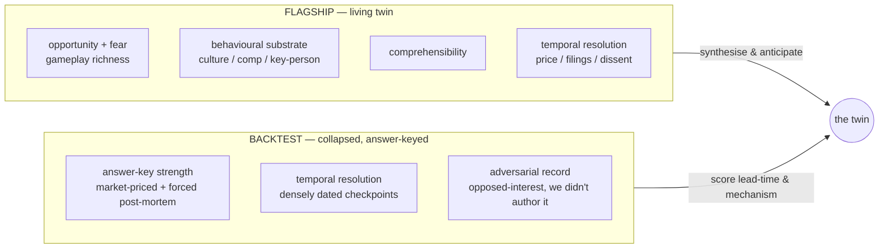

# Flagship OSINT-scoping — Wave 2 (corrected weighting)

## Intro: two jobs, not one

Wave 1 (`flagship-osint-scoping.md`) ran a single beauty contest and let **story depth** win it. That conflated two jobs that pull in opposite directions and must be scored on different rubrics:

- **The FLAGSHIP** is a *living, rich, whole-org* subject the twin inhabits continuously. It has to exercise **both halves of Wardley gameplay — fear AND opportunity** — carry a thick, synthesisable behavioural substrate (culture, comp, key-person, leaks, litigation), be **comprehensible**, and — the axis Wave 1 ignored — have **real temporal resolution** (a public market cadence: price, quarterly filings, analyst dissent, short interest) so the twin has a *WHEN* to hang alerts on. A beloved private company with a great turnaround story is a chapter, not a flagship.
- **The DEDICATED BACKTEST ORG** is a *collapsed* firm whose "would the twin have flagged it early, and *when*?" has an **external, opposed-interest, timestamped answer key we did not author** — a short-seller's dated position, a CDS/ratings curve, a court-forced examiner report, a parliamentary post-mortem. Story richness is almost irrelevant here; what matters is that an adversary with skin in the game already published the answer, dated.

**Corrected weighting.**

- *Backtest org (priority order):* **answer-key strength + temporal resolution + adversarial record** > risk-surface breadth > comprehensibility. We want the cleanest, most-triangulated, most-densely-dated external answer key — not the most colourful collapse.
- *Flagship:* **whole-org opportunity/behavioural richness + comprehensibility + OSINT depth**, with **temporal resolution now a real (no-longer-ignored) factor**. A candidate that fails the market-cadence test cannot be flagship however good the narrative.

---

## Collapsed-firm class — ranked by backtest-suitability

Composite below leans on the priority axes (answer-key strength, temporal resolution, adversarial record); `backtest_suitability` folds in answer-key strength. Composite ≈ mean(temporal, adversarial, backtest_suitability).

| Rank | Firm | Answer key | Temporal res. | Adversarial | Backtest-suit. | Composite | Verdict |
|---|---|---|---|---|---|---|---|
| 1 | **Enron** | strong (Chanos short Nov'00 + McLean Mar'01 + Powers/Batson/Senate/trial) | 9 | **9.5** | 9 | **9.2** | flagship-backtest |
| 2 | **Wirecard** | strong (J Capital'15, Zatarra'16, KPMG audit, Bundestag) | 9 | 9 | 9 | **9.0** | flagship-backtest |
| 3 | **Carillion** | strong (short'15 + S&P PD model + HC 769 + FCA + FRC/KPMG + NAO) | 8 | 9 | 9 | **8.7** | flagship-backtest |
| 3 | **Lehman** | strong (Einhorn Nov'07/May'08 + CDS/ratings + Valukas) | 8 | 9 | 9 | **8.7** | flagship-backtest |
| 5 | **SVB** | strong (short-interest Apr'22 + 10-Q AOCI series + Barr Report) | 8 | 8 | 9 | **8.3** | flagship-backtest |
| 6 | **Kodak** | strong (2003–05 ratings ladder + '11 CDS blowout; no forced post-mortem) | 8 | 7 | 8 | **7.7** | portfolio-backtest |
| 6 | **Northern Rock** | strong (Hempton'05 + ~11 warnings + Treasury Cttee + FSA IAD) | 7 | 8 | 8 | **7.7** | flagship-backtest |
| 8 | **Nortel** | moderate (SEC complaints + restatements; **criminal acquittal**) | 6 | 6 | 5 | **5.7** | portfolio-backtest |
| 9 | **Marconi/GEC** | weak (no forced post-mortem, reactive downgrades) | 5 | 3.5 | 4.5 | **4.3** | portfolio-backtest |

**Reading the top of the table.** Five firms cluster at backtest-suitability 9. What separates them on the corrected weighting is *how settled and how densely dated the external answer key is*:

- **Enron** tops both priority axes: adversarial **9.5** (the single highest score in the whole set — a *triple stack* of profit-motivated short + independent journalist + three subpoena-forced investigations) and temporal **9** (daily equity/bond/CDS + dated press tells + discrete downgrade dates), and its answer key is **fully adjudicated and closed** (Lay/Skilling trial 2006). A twin can be rewound to essentially any week from late-2000 and scored against a real dated observation stream on *three separable questions* — would it short (Chanos), would it flag the cash-vs-earnings gap (McLean), would it name the SPE mechanism (examiner ground truth).
- **Wirecard** is functionally co-equal on scores and arguably has the **longest lead-time ladder** (2015 → 2016 → Feb'19 → Oct'19 → Apr'20 → Jun'20), plus a uniquely valuable twist: the *regulator captured the wrong side* (BaFin banned shorting the stock and referred the journalist for prosecution). Its one deduction against Enron is that the criminal answer key is **still open** (Braun trial unresolved mid-2026), so the finest-grained mechanism claims can't yet be graded against a completed verdict.
- **Carillion / Lehman** trail only on temporal resolution (8 vs 9): Carillion's crash is an abrupt profit-warning discontinuity rather than a smooth glide, and its internal-truth record compresses into the 2018 committee report; Lehman's tick-level CDS/short data sits behind paid terminals, needing a data-acquisition step. Both have *exceptional* forced post-mortems (Carillion four-way: parliamentary + FCA + FRC + NAO; Lehman: Valukas 2,200-page examiner report).
- **Nortel / Marconi** are demoted for the reason the whole exercise exists: their answer keys are *contested or absent*. Nortel's one clean judicial adjudication was an **acquittal** (fraud not proven), and its equity crash was reaffirmed-guidance-then-shock (un-resolved in advance). Marconi has **no forced post-mortem at all** and only reactive, post-warning downgrades — a strategy case study, not an anticipation backtest.

---

## Living re-scores — flagship fit under the corrected weighting

Temporal resolution now counts. This is what re-ranks the Wave 1 leaders.

| Firm | Temporal res. | Adversarial | Opportunity/behavioural richness | Revised flagship fit | Note |
|---|---|---|---|---|---|
| **Netflix** | **9** | 7 | **9** | **8.5** | Public NASDAQ cadence; both fear (DVD→streaming, Qwikster, '22 crash) AND seize (verticalised content, password-sharing monetisation, ad tier, live sports) moves; deep culture/comp/key-person substrate (culture deck, keeper test, Hastings→Sarandos, 2026 litigation). Clears all three axes. |
| **Ferrari** | 8.5 | 5 | 8 | 7 | Genuine public-market twin (NYSE:RACE, quarterly, ~17–26 analysts); rich seize-gameplay (scarcity pricing, first-EV hedge, F1/Le Mans, brand extension). Held back by a **near-unanimous Buy chorus** — little corporate-level dissent to synthesise; sharpest adversarial texture attaches to the Elkann/Agnelli family, not the company. |
| **ARM** | 7 | 6 | 7 | 6.5 | Public since Sept'23 but **~87–90% SoftBank float** thins the price signal; adversarial record concentrated in episodes (Nvidia block, Arm China) not continuous friction; 7 formative years (2016–23) were private. Solid comparator, compromised flagship. |
| **Nintendo** | 8 | 4 | 6 | 5.5 | Real quarterly cadence (TSE:7974), but adversarial record is **thin and self-generated** (Nintendo as plaintiff), and the behavioural substrate is **curated by design** (famously guarded PR, scripted exec messaging). Exercises opportunity gameplay, structurally suppresses the fear/human texture a flagship needs. |
| **LEGO** | 2 | 2 | 5 | 4 | Private (KIRKBI-owned): **no price, no quarterly cadence, no dissent** — at most one curated annual pulse. Great opportunity/culture story (2003 turnaround, media/AFOL/China/sustainability), but a thin *data substrate*. A private-gallery chapter, not a living twin. |

**The re-scoring verdict.** Wave 1's affection for LEGO evaporates the moment temporal resolution is priced in — a private company gives the twin no *WHEN*. Netflix is the only Wave 1 leader that scores top-tier on **all three** corrected axes simultaneously: it is the rare public company with genuinely rich *both-halves* Wardley gameplay, unusually deep behavioural texture (a contested culture deck plus contemporaneous court allegations about the culture in practice), and a near-daily market signal. Ferrari is the credible runner-up but its bull-chorus starves the twin of fear-under-scrutiny.

---

## Recommendation

### FLAGSHIP (living): **Netflix**

Netflix is the flagship because it is the only candidate that does the flagship's *actual* job on every corrected axis:

- **Both halves of Wardley gameplay, richly documented.** Fear/survival: the DVD-mail→streaming self-cannibalisation, the Qwikster reversal, the 2022 subscriber-loss crash and its response. Seize/opportunity: content verticalisation, aggressive international expansion, password-sharing monetisation, the ad-supported tier as deliberate market segmentation, live-sports and gaming pushes. Few living orgs give the twin such a clean set of *both* defensive and offensive plays to synthesise against.
- **Thick behavioural substrate.** The culture deck / keeper-test as a documented and *contested* artifact, the top-of-market no-bonus comp philosophy, the Hastings→Sarandos/Peters succession, and — critically — 2026 litigation (the Baillie wrongful-termination suit) that puts *court-documented* internal culture tension next to the company's own PR framing. This is raw key-person and culture texture, not just an authorised narrative.
- **Real temporal resolution (the Wave 1 blind spot).** NASDAQ:NFLX gives quarterly earnings with subscriber/revenue/margin guidance, continuous price and options/short-interest data, and dense sell-side coverage — a near-daily timestamped signal the twin can hang *WHEN* on.
- **Comprehensible.** Everyone understands what Netflix sells and how it has repeatedly re-based its own business.

*Residual weakness to manage:* the cooperative survivor narrative (Hastings' own *No Rules Rules*, friendly awards-season press) still outweighs the adversarial material, so synthesis must **actively pull the litigation/analyst-dissent thread** rather than default to company-authored framing.

### DEDICATED BACKTEST ORG (collapsed): **Enron**

Enron wins the backtest slot on exactly the priority stack the correction demands — **answer-key strength + temporal resolution + adversarial record** — and it wins on the tie-breaker that matters most for an answer key: **it is closed and settled.**

- **Highest adversarial score in the entire field (9.5).** A genuinely rare triple-stack of *opposed-interest, dated* evidence: (1) Jim Chanos built and held a profit-motivated short from Nov 2000 — ~a year before collapse — and later gave on-record contemporaneous reasoning; (2) Bethany McLean independently reached the same conclusion via cash-flow-vs-earnings analysis and published it (Fortune, 5 Mar 2001), provoking a recorded hostile management reaction; (3) three *separately subpoena-forced* investigations (Powers special committee, Batson court-appointed examiner, Senate PSI) plus the Lay/Skilling criminal trial reconstructed the internal fraud against management's interest.
- **Temporal resolution 9.** Public 10-Qs/10-Ks form the base cadence Chanos used directly; on top sit dated press tells (McLean 5 Mar, Skilling's resignation 14 Aug and earnings-call outburst 17 Aug 2001), daily market data (equity $90→<$1), and discrete downgrade dates (to B- 28 Nov, CC 30 Nov) immediately before the 2 Dec 2001 filing. The twin can be rewound to *any week from late-2000* and scored against a real dated stream.
- **An answer key we did not author, and one that is *finished*.** Unlike Wirecard (criminal trial still open mid-2026), Enron's record is fully adjudicated (2006 verdict). And it enables a rare **three-axis scoring rubric** — did the twin (a) short via public market signal, (b) flag the cash-vs-earnings/related-party disclosure gap, (c) name the SPE mechanism against examiner ground truth — each with its own dated key. The one discipline the harness must enforce is separating *"flagged from public information at time T"* from *"flagged only with the benefit of the 2002–03 examiner hindsight"*; the dossier itself flags this as a feature to build into the rubric, not a defect.

*Why Enron over its co-equal Wirecard:* on scores they are a whisker apart (9.2 vs 9.0), and Wirecard offers a longer lead-time ladder and the captured-regulator twist. But the corrected weighting ranks answer-key strength first, and a *settled* key beats an *open* one for grading a twin's finest-grained mechanism claims. Wirecard is therefore promoted to the portfolio (below) as the second backtest and the signal-suppression exemplar, giving the programme two independent answer keys rather than one.

### Portfolio (breadth) — 2–3 orgs covering orthogonal risk surfaces

Chosen to cover failure modes and risk surfaces that Netflix (living tech gameplay) + Enron (fast accounting fraud, US finance) leave open:

1. **Wirecard** — *captured-regulator / signal-suppression / European fintech fraud, second backtest.* Its distinctive value is that the regulator suppressed the correct signal (BaFin banned shorting, prosecuted the journalist) — a direct test of whether the twin **over-weights institutional legitimacy** (DAX inclusion, buy ratings) and mistakes regulatory silence for reassurance. Pairs thematically with the Wave 1 **Nokia** anticipation-suppression pick, and gives the programme a second, independently-dated answer key with a 5-year lead-time ladder.
2. **Kodak** — *slow-motion tech-disruption / capability rigidity.* A completely different *tempo* from Enron's fast fraud and a different mechanism from Netflix's live gameplay: a decade-long graduated market ladder (negative outlook 2003 → junk 2005 → CDS blowout 2011 → Chapter 11 2012) plus a genuine internal-foresight document (the 1979/1981 Barabba study). Tests whether the twin flags disruption *as early as the firm's own market-intelligence team did* — drift detection, not shock detection. (Caution: the still-trading successor entity must not be conflated with the 2012 collapse dossier.)
3. **Maersk (NotPetya)** — *reused Wave 1 pick for the cyber surface.* Neither the flagship nor any of the top collapsed-firm answer keys exercise `cyber_data` well (only Nortel, partially). Maersk supplies the cyber/operational-resilience risk surface the rest of the set is thin on.

*(Held in reserve: **Carillion** — the richest four-way UK answer key and a superb supply-chain/outsourcing + "adjacent decision system fails to react to a public signal" case; **Nokia** — the Wave 1 anticipation-suppression exemplar. Either can swap into the portfolio if a fourth slot opens or if UK-sector/geographic breadth is prioritised.)*

### How flagship + backtest together satisfy the whole thesis

The thesis needs the twin to do **two provably different things**, and the pair splits them cleanly:

- **Netflix proves the *synthesis / anticipation* half** — that the twin can inhabit a living, adversarially-and-cooperatively-documented whole org, model both fear and opportunity gameplay in flight, and metabolise culture/comp/key-person texture into a coherent forward view, with a market cadence to time its alerts against. It answers *"can the twin think about a going concern?"*
- **Enron proves the *calibration / falsifiability* half** — that when the twin's forward view is graded against an **external, opposed-interest, densely-dated, and closed** answer key, it flags the right danger, for the right reason, early enough to matter. It answers *"is the twin's anticipation real, or post-hoc?"* — the question a living subject can never answer because its future hasn't happened yet.

The portfolio then stress-tests **generality**: Wirecard checks the twin against *suppressed/captured* signal, Kodak against *slow* signal, Maersk against *cyber/operational* signal — so a good score on Enron can't be dismissed as a one-mechanism fluke. Flagship shows the twin can live in the world; backtest + portfolio show its living judgement would have been *right, and timely,* where we can already check.

---

## Honest gaps

**Thin sourcing / single-channel signals to shore up.**
- **Enron's tick-level market data** (CDS-implied default path, day-by-day bond spreads) is only *directionally* present in the dossier via the Longstaff et al. reconstruction; a scoring harness needs the actual dated series, much of which sits in paid terminals (Bloomberg/Markit) rather than free web sources — same caveat flagged for Lehman.
- **Netflix's adversarial thread is under-weight relative to the cooperative narrative.** The synthesis leans on one live suit (Baillie) plus the 2022 crash; a deeper wave should pull the full analyst-dissent archive, short-interest history, and PTAB/patent disputes so the twin isn't fed a company-authored story by default.
- **SVB, Wirecard, Lehman short-interest / CDS series** are named but not confirmed live in several dossiers (SVB FINRA short interest, Wirecard S3 data, Lehman Markit CDS). Verify the actual dated series before any of these anchors a lead-time score.

**Named items to verify.**
- Enron: the exact Chanos position-open date and size (dossier says "Nov 2000, substantial by spring 2001" — the on-record testimony date/detail should be pinned for the "would-it-short" axis).
- Wirecard: Braun criminal trial status **as of the backtest run date** — it was unresolved mid-2026; a settled verdict would upgrade its mechanism-grading value and could revisit the Enron-vs-Wirecard ordering.
- Kodak: keep the **defunct 2012 entity vs still-trading Eastman Kodak (KODK, 2025 going-concern warning)** strictly separated in any harness — a real contamination risk.
- Netflix: confirm the current 2026 litigation docket (Baillie and any class actions) is live and citable rather than settled/sealed.

**Primary pulls a deeper wave should chase.**
- Enron: the **Batson First Interim Report (21 Sep 2002)** and **Powers Report (Feb 2002)** as ground-truth mechanism keys; the Senate PSI board-role report (Jul 2002); the 16 Oct 2001 restatement 8-K as the firm's own dated self-correction.
- Wirecard: the **KPMG Special Audit (28 Apr 2020)** and the **Bundestag Untersuchungsausschuss** report as the two forensic mechanism keys.
- Backtest harness design: an explicit **information-at-time-T gating rule** so the twin is fed only contemporaneously-public data at each rewound timestamp, with the forced post-mortems used *only* to grade whether the flagged *reasoning* matches the real internal mechanism after the fact. Without this discipline, every "flagged early" claim is contaminated by hindsight.
- Netflix flagship: a **standing pull of quarterly earnings + short-interest + analyst-revision cadence** so the living twin has a continuously refreshed WHEN signal rather than a snapshot.

---

## Wave-2 contrarian challenge

Adversarial pass on the Netflix + Enron recommendation. Four questions, hardest first.

### 1. Enron's "answer key" is less contemporaneous than the dossier claims

The 9.5 adversarial score conflates two epistemically different kinds of evidence, and the flagship claim — a *triple-stack contemporaneous* key — only survives for one of the three axes.

- **Genuinely contemporaneous + opposed-interest:** McLean (Fortune, 5 Mar 2001) and — missed by both waves — **Jonathan Weil's WSJ Texas-edition piece, 20 Sep 2000** ("Energy Traders Cite Gains, But Some Math Is Missing"), which *predates* Chanos and is the article that reportedly prompted his look. The dossier's adversarial ladder is under-specified: its earliest dated public tell is actually Weil, not Chanos.
- **Retrospectively reconstructed:** the Chanos leg. There is **no timestamped public short thesis from Nov 2000**. His position-open date, sizing, and reasoning come from his **Feb 2002 House testimony** and later interviews — post-collapse retellings by a man whose trade had already paid off, with every incentive to date his insight early. Contrast Wirecard (Zatarra/J Capital PDFs published and dated *at the time*), Lehman (Einhorn's dated public speeches, Nov 2007/May 2008), and Carillion (statutory FCA short-position disclosures, dated, free). On strictly *published-at-time-T* opposed-interest evidence, Enron's ladder is thinner than three of its rivals.
- **Structurally retrospective:** Powers (Feb 2002), Batson (2002–03), Senate PSI (Jul 2002), and the 2006 verdict are all *post-mortems*. Fine as **mechanism-grading** keys (axis c), but the "closed and adjudicated" tie-breaker that beat Wirecard is a hindsight artifact by construction — verdicts are always retrospective, so "closed key" rewards *elapsed time since collapse*, which correlates exactly with the contamination problem below.
- **Temporal-resolution 9 is partly aspirational.** Single-name CDS barely existed for Enron in 2000–01 (the dossier's own Longstaff caveat), and the fine-grained bond/short series is paywalled. Meanwhile **Carillion's opposed-interest market signal is free, public, statutory FCA disclosure data — it was the most-shorted stock on the LSE for roughly two years before failure**. On *actually-obtainable* dated series, Carillion beats Enron.

### 2. The unaddressed defeater: parametric contamination

The harness's information-at-time-T gate filters the twin's **inputs**. It cannot filter the twin's **priors**. Enron is the single most-written-about corporate collapse in the training corpus of any model the twin will run on: the ending, the cash-vs-earnings tell, and the SPE names (Chewco, LJM, the Raptors) are memorised. A "flag" at rewound-1999 is un-scoreable as anticipation — it is indistinguishable from retrieval. **The more famous and adjudicated the collapse, the worse it is as an LLM backtest**, which inverts the wave-2 tie-breaker. Wirecard (2020) is contaminated too, but less saturated; the cleanest keys are collapses with dated opposed-interest evidence but thin corpus presence — **NMC Health** (Muddy Waters report, dated 17 Dec 2019, published PDF; shares suspended Feb 2020; administration Apr 2020; ADGM judgment against EY 2024) or **Patisserie Valerie / Greensill**. Neither wave considered NMC.

*Constructive flip:* keep Enron, but demote it from primary instrument to **contamination control**: run the identical rubric on Enron and on an obscure key (NMC). If the twin scores materially better on Enron than on NMC at equivalent evidence density, the delta *measures* memorisation leakage, and every other backtest score gets discounted by it. That converts Enron's fatal weakness into the harness's calibration dial. The primary graded backtest should then be **Carillion**: closed-ish key (HC 769; FRC→KPMG fine 2023; directors' disqualification proceedings), four independent forced post-mortems, free dated market data, and — given this programme's UK-government framing — the one collapse the actual audience watched a public-sector supply chain fail to react to. Wave 2 left it "in reserve" for no scored reason.

### 3. Flagship: Netflix is defensible, but the fear-half is museum-grade

Netflix is not dull — but its fear gameplay is **historical** (2011 Qwikster, 2022 crash). In mid-2026 it is a consensus winner: the living twin will inhabit a period of strength and its fear-modelling will never be exercised *in flight*, only re-narrated. It is also the most pre-chewed company in equity coverage; "anticipation" that reproduces the sell-side consensus is cheap. Two unconsidered living candidates carry fear-in-flight *now*:

- **Intel** — existential contest happening live: foundry bet, 2024 CEO defenestration, sovereign/activist stakes, dated dissent on both sides of every earnings call. Both halves of gameplay, currently unresolved, with full market cadence.
- **Boeing** — the only living org with a *court-and-regulator-forced* adversarial record in real time (NTSB/FAA actions, DOJ DPA breach finding, whistleblower testimony). Closest living analogue to a collapsed-firm answer key. But it drags the heaviest ethics load in the field (346 deaths; deceased whistleblowers) — probably disqualifying for a demo-able flagship.

Verdict: **hold Netflix** — comprehensibility and behavioural substrate are real, and Intel's story may resolve mid-programme — but name Intel as the designated successor if the goal shifts from "synthesise a winner" to "model fear in flight", and record that the choice trades away live fear-gameplay deliberately.

### 4. Ethics / impersonation traps — real, and one is already on file

- **Netflix living individuals:** the "behavioural substrate" is largely *named living people* (Sarandos, Peters, Hastings) and a **live lawsuit** (Baillie). Court-documented *allegations* are not findings; a twin that synthesises culture inferences and presents them as the org's internal truth is generating defamation-adjacent content about identifiable individuals. The synthesis rule must be: allegations tagged as allegations, with docket citations, never merged into "the culture is X".
- **Netflix brand:** any published twin UI must not use Netflix marks/trade dress or read as authored by Netflix — the artifact-publishing rules here already prohibit pages imitating a real organisation, and Netflix is aggressively litigious. Analytical framing, no logos, visible "unaffiliated research" labelling.
- **Enron persona risk:** Skilling and Fastow are alive. Grading against the adjudicated record is fine; generating first-person executive personas re-enacting the fraud is not. Keep the twin in analyst voice, never actor voice.
- **Wirecard:** Braun is *on trial* (presumption of innocence — the dossier's own open-key caveat is also an ethics constraint on output phrasing), and Marsalek is a fugitive with reported intelligence links — genuinely sensitive, not just unadjudicated.
- Cross-check all of the above against `insider-risk-and-ethics.md`, which predates this recommendation and should be reconciled with it.

### Challenge verdict

The Netflix pick survives with a recorded trade-off (no live fear) and a named successor (Intel). The Enron pick as *primary* backtest does not survive: its celebrated adversarial ladder is half-retrospective (Chanos leg), its decisive tie-breaker (closed key) selects for exactly the corpus contamination the harness cannot gate, and its fine-grained data is less obtainable than Carillion's free statutory series. Recommended restructure: **Carillion primary backtest, Enron as contamination control, NMC Health replacing or joining Wirecard as the low-contamination second key**, portfolio otherwise unchanged.
