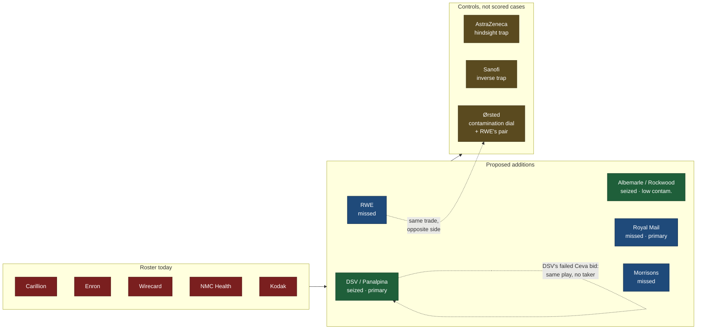

# Opportunity cases for the backtest roster

Ticket: `.scratch/twin/issues/19-research-opportunity-cases.md`
Date: 2026-08-05
Input: 14 researched dossiers (8 seized, 6 missed), open-web sourced.

## The roster gap and the bar

The backtest suite is **Carillion, Enron, Wirecard, NMC Health, Kodak** — five collapses and nothing
else. The engine promises *fear AND opportunity*, and ticket 13's push/pull decision makes opportunity a
first-class capability: threats arrive whether or not you look; opportunities have to be **pulled** out of
the map by sweeping for **play preconditions**. Validating that engine exclusively on catastrophes is a
measurable bias in our own instrumentation, and the substrate work (ticket 12, Q3 note 2) already predicted
the direction of the error: *the twin will be better at fear than opportunity unless explicitly counterweighted.*

The bar the collapse cases set, in this programme's own words, is:

> the "would the twin have flagged it early, and *when*?" question has an **external, opposed-interest,
> timestamped answer key we did not author** — a short-seller's dated position, a CDS/ratings curve, a
> court-forced examiner report, a parliamentary post-mortem.

Applied to opportunity, in the ticket's priority order:

1. **Contemporaneous, opposed-interest, dated evidence** the option was visible before it was taken/missed.
   Retrospective narrative is near-worthless.
2. **Low parametric contamination.** Wave 2's own inversion applies here: *the more famous the story, the
   worse it is as an LLM backtest.* A canonical case an LLM has memorised proves nothing — a "flag" is
   indistinguishable from retrieval.
3. **Temporal resolution** — can we score *when* it should have been flagged, not just whether?
4. **Actionability window** — was there a real period in which acting was possible?
5. **Counterfactual knowability** (missed cases only).

Composite weighting used below: evidence 0.35 / contamination 0.25 / temporal 0.20 / actionability 0.12 /
counterfactual 0.08. Contamination is scored **inverted** (10 = uncontaminated), so all axes point the same
way. Scores are on the dossiers as written; where a dossier says a nominated claim failed verification,
that is scored as failing, not as the nomination claimed.

## Ranked table

| # | Case | Org | Class | Evidence (opposed-interest, dated) | Contamination | Temporal res. | Composite | Verdict |
|---|------|-----|-------|-----------------------------------|---------------|---------------|-----------|---------|
| 1 | Panalpina acquisition after Cevian campaign (2019) | DSV A/S | seized | **8.5** — activist w/ capital at risk, rival shareholder's public letter, independent analysts, wire journalism | medium (7.0) | 7.5 | **7.7** | **ADD — primary seized** |
| 2 | Parcel-automation underinvestment (2013–19) | Royal Mail / IDS | missed | **7.5** — Ofcom statutory volumes, rival hub press releases, CWU agreement, profit-warning RNS, own IPO prospectus | medium (6.0) | 7.5 | **7.3** | **ADD — primary missed** |
| 3 | Absence from online grocery (2007–13) | Wm Morrison | missed | 7.0 — *The Grocer* 2009, named TNS/Verdict analysts, CEO's own dated refusals | medium (6.0) | 6.0 | **6.6** | **ADD** |
| 4 | Lignite/nuclear through the Energiewende (2000–11) | RWE | missed | 7.0 — EEG statute, WWF/SAM 2006-07 report *plus RWE's dated rebuttal*, CEO Oct 2010 quote | medium (5.5) | 6.0 | **6.5** | **ADD — pair with Ørsted** |
| 5 | Rockwood lithium acquisition (2014–15) | Albemarle | seized | 6.5 — Goldman/BofA Feb 2014 demand notes, Dec 2013 Talison 8-K; *price-criticism thesis failed verification* | medium (6.5) | 6.5 | **6.4** | **ADD — second seized** |
| 6 | Clean-sheet NSA abandoned for 737 MAX (2010–11) | Boeing | missed | **8.0** — dated named-executive statements, self-imposed deadline that slipped, AMR 8-K forcing event | **high (2.0)** | 7.0 | **6.0** | reserve / ethics-gated |
| 7 | Blue River Technology acquisition (2017) | Deere & Co | seized | 6.0 — DOJ suit + forced abandonment as the real tell; *patent-trend thesis failed verification* | medium (6.5) | 5.0 | **5.9** | reserve — low-contamination value |
| 8 | Monsanto acquisition vs glyphosate risk (2015–18) | Bayer AG | missed | 7.0 — IARC, federal MDL, Prop 65, Monsanto's own counter-suit | **high (2.5)** | 6.0 | **5.7** | reject — wrong class (see below) |
| 9 | Rejecting Pfizer's £69bn bid (2014) | AstraZeneca | seized | 7.0 — Citi note, Schroders publicly *against* the rejection, market punished it 11–13% | **high (2.5)** | 6.0 | **5.7** | **ADD as hindsight-trap control, not as a scored seize** |
| 10 | Oil & gas exit to offshore wind (2012–17) | Ørsted (DONG) | seized | 6.5 — S&P/Moody's actions, UK CfD auction clearing prices; rest company-sourced | **high (3.0)** | 7.0 | **5.7** | **ADD only as RWE's pair + contamination dial** |
| 11 | Print titles sold to fund digital classifieds (2013) | Axel Springer SE | seized | 5.5 — one Bloomberg feature 3.5mo ahead; rest own segment reporting; REA/Rightmove precedent unevidenced | **high (2.0)** | 6.0 | **4.7** | reject |
| 12 | NYSE Euronext acquisition (Liffe + data) (2012) | Intercontinental Exchange | seized | 5.0 — DOJ/EC blocks are real; **the nominated pre-announcement forecast does not exist** in the open window | **high (3.0)** | 4.0 | **4.5** | reject (revisit only after archive pass) |
| 13 | K9 Thunder export build-out (2014–21) | Hanwha Aerospace | seized | 4.5 — contract wins dated and real; **the "capacity ahead of shock" thesis is a post-2022 overlay** | **high (2.5)** | 6.0 | **4.5** | reject |
| 14 | Diabetes/CV exit forgoing GLP-1 obesity (2019) | Sanofi | missed | **3.0** — no contemporaneous criticism exists; market rose ~5% on the exit | **high (2.0)** | 6.0 | **4.0** | reject — fails the bar outright |

Class averages: **missed 6.02**, **seized 5.64**. A non-decision leaves a longer window with more dated
checkpoints than a transaction does, which slightly offsets the missed cases' harder counterfactual problem.

## Per-case notes

### 1. DSV — Panalpina (2019). Seized. Composite 7.7
The only case in the pack with a genuine **opposed-interest actor with capital at risk publishing dated**:
Cevian holds a stake from 2010 and escalates publicly in **October 2018** (Forberg demands chairman
replacement and deal consideration; chairman Ulber then declines re-election). DSV's own **failed Ceva
Logistics bid in late 2018** is a dated public signal it was actively shopping. First bid **16 Jan 2019**
(Reuters/Business Standard/Euronews same-day); Ernst Göhner Foundation rejects; **Artisan Partners writes
publicly to the board** criticising the Foundation's handling (Feb 2019); Panalpina counter-approaches
Agility (Lloyd's Loading List, Feb 2019); binding terms **1 Apr 2019**; close Aug 2019.
Roughly **2.5 months of dated, back-and-forth public bidding** — unusually well instrumented.
*Caveat faithful to the dossier:* the nomination's claim of Cevian agitation from 2013 was **not**
independently re-verified; the record found is firm at 2010 (stake) and 2018 (escalation), soft in between.
Contamination is medium: the headline outcome is plausibly memorised, but the load-bearing texture (the
Foundation's 46% blocking mechanism, the Ceva failure as leading indicator, the Agility counter-approach) is
specialist trade press.

### 2. Royal Mail — parcel automation (2013–19). Missed. Composite 7.3
Best-instrumented missed case, and the only one whose **counterfactual sits inside the subject's own audited
filings**: GLS, Royal Mail's continental parcels subsidiary, ran a more automated, consistently profitable
model reported line-by-line in the same group's segmental accounts throughout the window. No inference from
an outside rival required.
Dated cadence a twin could be checkpointed against ≥6 times: the **2013 IPO prospectus** (a legally-liable
document in which the company itself forecasts letters −4–6%/yr and B2C parcels +5–6%/yr), **Ofcom's
statutory annual postal monitoring** (parcels +7% 2014-15, +12% 2015-16 — independent regulator), rival hub
openings with hard capacity figures (**DPD Hinckley ~£100m / 720k parcels a day**; **Hermes Rugby £31m /
1m+ a day, Aug 2017**), the **CWU "Four Pillars" agreement endorsed 31 Jan 2018** covering automated hub
deployment, the **Oct 2018 profit warning RNS** cutting the cost-saving target £230m→£100m, and the
**May 2019 ~£1.8bn** investment programme — management's own concession it was behind.
*Caveat faithful to the dossier:* the headline "~12% automation vs rivals' 70–90%" figure could **not** be
verified anywhere and must not be used until traced to a primary source; the attributed Rico Back HY2019
remarks are second-hand only (transcript fetch 403'd).

### 3. Morrisons — online grocery (2007–13). Missed. Composite 6.6
The closest thing in the missed pack to a *dated, self-incriminating refusal*: **The Grocer, 6 June 2009**
reports Morrisons as "the only major UK supermarket yet to launch online shopping", quotes CEO Marc Bolland
from March 2009 and June 2009 ("If it doesn't make money, we are not going to go online" / "You cannot sell
fish over the internet"), and carries a TNS director calling the gap "the obvious elephant in the room" plus
an e-commerce director warning delay would cede customers. Named third parties, no stake in the decision.
Ocado's **July 2010 IPO** put market-share estimates in public circulation (Tesco ~49%, Ocado ~14%) that
implied Morrisons at effectively zero. Late-2012 commentary with a named Verdict analyst attributes weak
sales to the multichannel gap. Board awareness is directly evidenced — Dalton Philips reportedly deliberated
~two years before greenlighting. The **17 May 2013 Ocado deal** (up to £170m upfront plus a long declining
revenue share) prices the cost of delay.
*Caveat:* Tesco.com is a clean counterfactual for *visibility*, but Ocado's own years of marginal
profitability muddy the *size* of the missed payoff — this supports "the option was visible", not "acting
was obviously positive-EV at any given date". Several sources are search-engine paraphrase, not primary
(Computer Weekly returned 403); quotations must be marked as reported.

### 4. RWE — lignite/nuclear through the Energiewende (2000–11). Missed. Composite 6.5
Has the **hardest possible start timestamp**: the EEG feed-in-tariff statute, **1 April 2000**. And it has
the pack's only structural rhyme with the collapse cases' evidence pattern — an *opposed-interest dated
warning met by a documented company rebuttal*: **WWF Germany + Sustainable Asset Management, "Carbonizing
Valuation" (Nov 2006, presented London Jan 2007)** modelled RWE losing up to 17% of net equity value under
business-as-usual carbon exposure, and RWE's Head of Energy/Environmental Policy **publicly contested the
methodology** — which proves awareness and engagement, not obliviousness. Reinforced by RWE's own CR reports
(2005–08) conceding its lignite/nuclear focus was *"kontrovers beurteilt"*, its **April 2009** purchase of
two nuclear sites with stated intent to build 6,000MW, and **Bloomberg, 20 Oct 2010**: CEO Grossmann tells
*Stern* RWE will not raise renewables spending short-term because nuclear fuel-rod levies would eat profits —
five months before Fukushima. Window closes hard **11 Mar 2011**.
*Nuance the dossier insists on:* RWE was **not** asleep — it founded RWE Innogy in 2008 with ~€1bn/yr under
Vahrenholt. The correct framing is "insufficient relative to the statute's scale", not "ignored entirely".
Counterfactual is unusually strong for a missed case: **DONG/Ørsted's 85/15 pivot (2008–09), same sector,
same window, opposite bet, quantified outcome**; E.ON as a second domestic comparator.

### 5. Albemarle — Rockwood (2014–15). Seized. Composite 6.4
Real, dated, **pre-bid** opposed-interest signal exists: **26–28 Feb 2014** BofA and Goldman (Robert Koort)
notes forecasting Tesla's Gigafactory could consume up to 17% of global lithium output, covered same-day by
Bloomberg; **19 Mar 2014** CNBC on the same thesis; and before that, **2 Dec 2013** Rockwood/Tianqi 8-K for
49% of Talison, a public supply-concentration tell. Window Feb → **15 Jul 2014** bid → 12 Jan 2015 close.
*The nominated thesis failed verification and the case must be reframed.* The claim was "contemporaneous
analyst commentary criticised the price paid"; the sharpest overpay criticism found (Joe Lowry, Global
Lithium) is from **3 Dec 2015**, ~11 months after close. Contemporaneous analyst tone was *positive*
(Jefferies' Alexander), and the offer priced **below** at least one pre-deal $93 target. Usable as a
**demand-signal detection** case; unusable as a valuation-dissent case. Kissam's May 2012 courtship of
Rockwood surfaced only via the 2014 proxy and cannot be used for live-detection scoring.
Contamination medium — the deal itself is less over-told than the macro EV-battery land-grab it sits inside.

### 6. Boeing — clean-sheet NSA abandoned for the 737 MAX (2010–11). Missed. Composite 6.0
The **strongest raw contemporaneous evidence in the entire pack**, and the most contaminated. Dated,
named-executive, on-record: **10 Feb 2011** McNerney at a webcast investor conference says Boeing is "going
to do a new airplane" that will "go beyond the capability of the neo"; **29 Apr 2011** Q1 earnings call —
"most of the data and customer feedback is suggesting to us that the new airplane option is the most
favorable"; **18 Jun 2011** Paris Air Show, Piasecki briefs on re-engine economics, showing both options
live; **19–20 Jul 2011** American Airlines' record order and AMR's 8-K disclosing a conditional 100-aircraft
re-engine order, with Boeing reportedly given ~48 hours. A self-imposed "decide by mid-year" deadline that
*visibly slipped* is genuinely valuable timing signal.
Against it: contamination is near-total post-2019 (the "profit over clean sheet" narrative is canonised in
retrospectives, congressional testimony and books); primary Flightglobal/Aviation Week archives were
paywalled so corroboration leans on secondary aggregation; and the **counterfactual is the weakest in the
pack** — no rival built a clean-sheet single-aisle in this window, so we know the cost of *not re-engining*
(Airbus's durable ~57–60% segment share) far better than the cost of *not going clean-sheet*.
**Ethics gate:** this window sits immediately upstream of the MCAS crashes that killed 346 people. Any use
must scope strictly to Dec 2010–Aug 2011 and must not imply the re-engine choice caused the crashes — that
chain runs through later engineering and certification decisions outside this window.

### 7. Deere — Blue River Technology (2017). Seized. Composite 5.9
The real, under-told signal is **not** what was nominated. The nominated "rising searchable patent filings in
agricultural computer vision pre-2017" **could not be verified** — Deere machine-vision patents cluster from
2020 onward. What *is* dated and opposed-interest is the DOJ: Deere signed for Monsanto's Precision Planting
**Nov 2015**, DOJ sued to block **31 Aug 2016**, Deere abandoned **1 May 2017**, Blue River announced
**6 Sep 2017** — and TechCrunch's own headline framed the second as consequent on the first. Blue River's
**Dec 2015 $17m Series B** already had **Monsanto Growth Ventures and Syngenta Ventures** on the cap table,
i.e. two agrochemical majors had signalled interest in the space over a year before Deere moved.
This makes it a **strategic-necessity inference test** over a narrow ~4-month window, not the long-horizon
accumulation test the nomination hoped for. Its distinct value is **lower contamination**: the
Precision-Planting→Blue-River causal link is not commonly retold, even though the $305m headline is.

### 8. Bayer — Monsanto (2015–18). Missed. Composite 5.7. **Reject — wrong class.**
Evidentially respectable: **IARC Group 2A, Mar 2015** (WHO, independent); federal **MDL No. 2741 formed
Oct 2016**; **Prop 65 listing effective 7 Jul 2017**; **Monsanto's own suit against California, 14 Nov 2017**
— the company itself treating carcinogenicity as a live contestable threat before close. Hard bookends
(bid May 2016 / signing Sep 2016 / close **7 Jun 2018**, six weeks before the $289m Johnson verdict).
But it does not belong in an *opportunity* roster. This is a firm failing to avoid a **hazard** — a push/threat
case in opportunity clothing. Adding it deepens the collapse bias rather than correcting it. The dossier is
also candid that it is not a detection-failure case at all: IARC, the courts and California had flagged the
risk *loudly*; Bayer knew and proceeded. It tests risk-weighting, not option-detection. The loudest
shareholder evidence (the **26 Apr 2019** AGM 55.5% no-confidence vote) falls **after** the window and would
leak the answer to any harness that fails to gate hard at 7 Jun 2018.

### 9. AstraZeneca rejects Pfizer (2014). Seized. Composite 5.7. **Add as a hindsight trap, not a scored seize.**
Mechanically excellent: a precisely dated board decision (17–19 May 2014), an **externally imposed statutory
clock** (UK Takeover Code "put up or shut up", **26 May 2014**, Pfizer withdrew ~2 hours before) — the only
case in the pack with a legally forced deadline — and a **falsifiable numeric public commitment** from the
6 May 2014 shareholder presentation (risk-adjusted pipeline peak sales ~$23bn, >$45bn revenue by 2023).
Its real value is inverted. **Schroders (~2% holder) publicly criticised the rejection** around 20 May 2014,
and **AZ shares fell 11–13% on 19–20 May** — the contemporaneous market *punished* the decision now retold as
visionary. The "AZ was right" reading is entirely retrospective, and is currently being re-amplified (a
2 Aug 2026 piece frames the prospective BMS merger as "twelve years after spurning Pfizer"). The realised
pipeline record is also genuinely mixed, not triumphant (olaparib approved Dec 2014; durvalumab approved for
bladder cancer 2017 then **voluntarily withdrawn 2021** for missing its endpoint, with PACIFIC lung the
actual long-run driver) — and flattening that into vindication is exactly the failure mode to test for.
A twin that confidently flags this as a clean seize is reciting the ending. Score it inversely.

### 10. Ørsted / DONG (2012–17). Seized. Composite 5.7. **Add only as RWE's pair and as the contamination dial.**
Genuinely hard external data exists: **S&P CreditWatch Negative Aug 2012**, **Moody's review 2013**, the
**DKK 11bn Goldman/ATP/PFA injection agreed Oct–Nov 2013**, and — the best instrument — the **UK CfD auction
clearing prices** (Round 1 Feb 2015 ~£114–120/MWh; Round 2 **11 Sep 2017 £57.50/MWh**), a regulator-published
dated price series tracking offshore wind's economics independently of anything DONG said. A **26 May 2016**
Bloomberg opinion piece flagged subsidy dependence as the IPO priced.
Against it: most of the narrative is **company-sourced** (orsted.com announcements, annual reports, IPO
circular); the true decision point (2012–13) is far less densely dated than the confirmation events (2016
IPO, **24 May / 29 Sep 2017** INEOS divestment), so a backtest risks rewarding recognition of the famous
ending rather than 2012–13 foresight; contamination is **high** (business-school and ESG-deck canon); and
DONG was **majority state-owned** with a state-brokered recapitalisation, so it is partly industrial policy,
not a clean test of private strategic agency.

### 11. Axel Springer — print sold to fund classifieds (2013). Seized. Composite 4.7. **Reject.**
A real dated M&A sequence exists (StepStone majority **Dec 2009**, SeLoger built through 2010 to a **Jan 2011**
offer at €38.05, TotalJobs and kaufDA **2011**, the General Atlantic JV **2012**, Funke sale **25 Jul 2013**,
€920m) plus own-segment evidence of the margin gap before the disposal. The single genuinely opposed-interest
item is **Bloomberg Businessweek, 4 Apr 2013** — one independent feature 3.5 months ahead.
That is too thin against **high** contamination: this is a flagship business-school exemplar (Stanford GSB
"Axel Springer in 2014", HBS platform case, CJR "Tower of Industries", Digiday). And the nomination's claim
that REA Group/Rightmove made the thesis publicly obvious pre-2010 **found no dated citation** linking it to
the German print decision — it is asserted, not evidenced.

### 12. ICE — NYSE Euronext (2012). Seized. Composite 4.5. **Reject pending an archive pass.**
The nominated claim — that trade press explicitly discussed this before the deal — **does not survive**.
The genuinely dated material is the regulatory frame: the Nasdaq/ICE joint hostile bid structured so ICE
would take Liffe (Apr–**16 May 2011**, DOJ forces withdrawal) and the **EC blocking Deutsche Börse/NYSE
Euronext on 1–2 Feb 2012**, which publicly reopened NYSE Euronext's play status. But across the entire open
window (Feb–Nov 2012) **no dated, named forecast of ICE-for-Liffe was found**; every named analyst quote
(Barish 19 Dec, Lenardos/Perfumo/Perrott 20–21 Dec) is from *after talks had already leaked*. Combined with
high contamination — the "cash equities in decline, derivatives and data ascendant" story is standard
retelling — this is a case where a twin's apparent foresight is most likely recall. The dossier is explicit
that a Factiva/LexisNexis/sell-side archive pass could change the verdict; without one, reject.

### 13. Hanwha — K9 Thunder export build-out (2014–21). Seized. Composite 4.5. **Reject.**
The contract record is clean and verifiable (Poland Dec 2014, Eurosatory 2016 per IHS Jane's, Finland Feb
2017, India/L&T May 2017, Norway Nov 2017, Estonia Jun 2018, Australia **13 Dec 2021** — weeks before the
invasion). But the *thesis under test* — deliberate capacity built in anticipation of a demand shock — is
**not visible in any pre-2022 source**. What the contemporaneous record shows is ordinary defence-export
deal-making won on price, speed and offsets. The "strategic foresight" framing is a post-2022 construction,
and post-2022 K9 coverage saturates the corpus. Testing a twin on this measures memorised narrative.
**Ethics:** the payoff is directly tied to Russia's invasion and NATO emergency rearmament; it cannot be
framed as a tidy "good bet, well played" business case.

### 14. Sanofi — diabetes/CV exit forgoing GLP-1 obesity (2019). Missed. Composite 4.0. **Reject — fails the bar outright.**
The component facts are dated and real (Saxenda US launch **22 Apr 2015** with Citi's $1.0–1.5bn peak
forecast; STEP registrations 2017–18; Lantus erosion 2016–18; Sanofi's own efpeglenatide **Phase II weight-
management data published 2019**; the exit announced at Capital Markets Day **10 Dec 2019**). What does not
exist is **anyone contemporaneously flagging the forfeited option** — no analyst note, no trade-press piece,
no shareholder question. **Sanofi shares rose ~5% on the announcement: the market approved.** Wegovy was not
approved until 2021 and the blockbuster framing only crystallised 2021–23. The "Sanofi missed GLP-1"
narrative is a **2022+ retrospective construction** in a genre (who-missed-the-GLP-1-gold-rush) that
saturates training data. The counterfactual is also weaker than it looks: efpeglenatide was Phase II against
Novo's Phase III STEP readouts, so "Sanofi would have won too" is not established.
Useful only as an **inverse trap** alongside AstraZeneca: two cases where the market's contemporaneous
verdict is the opposite of the canonical retelling.

## Recommendation

### Seized cases to add

**1. DSV — Panalpina (2019). Primary seized case.**
The only candidate with an opposed-interest actor holding capital at risk who published on a date: Cevian's
October 2018 escalation, plus Artisan Partners' public letter attacking the blocking shareholder mid-bid.
Add DSV's own failed Ceva bid weeks earlier and you have a **checkable precondition set** — activist pressure
on an underperforming target, a serial acquirer visibly shopping, a concentrated blocking holder — none of
which requires knowing who won. The 16 Jan → 1 Apr 2019 bidding is the densest actionable window in the pack.
Contamination is the lowest of any well-evidenced seized case.

**2. Albemarle — Rockwood (2014–15). Second seized case, reframed.**
Add it for the **demand-signal detection** thesis (Goldman/BofA Feb 2014, Talison Dec 2013), **not** the
price-criticism thesis, which verification killed. Its value is the contamination profile: dated
opposed-interest sell-side signal in a story less canonised than Ørsted or Springer, with a tight five-month
window and hard bookends.

**3. AstraZeneca — reject Pfizer (2014). Add as a hindsight-resistance control, scored inversely.**
Not as an opportunity the twin should flag, but as a **trap**: the contemporaneous market punished the
decision by 11–13% and a major holder publicly opposed it. A twin that flags it as a clean seize is
retrieving, not reasoning. Pair with Sanofi (+5% on the "missed" decision) as a second inverse.

**4. Ørsted (2012–17). Add *only* as RWE's paired counterpart and as the pull-side contamination dial.**
Standalone it is a weak case dominated by company-sourced narrative and high canonisation. Paired with RWE
it becomes valuable: the same trade, from opposite sides, in overlapping windows, with the UK CfD auction
series as shared external instrumentation. And it plays the opportunity-side role Enron plays on the collapse
side — run the identical rubric on Ørsted (saturated) and Albemarle/Deere (less so) at matched evidence
density; the delta **measures pull-side memorisation leakage** and discounts every other opportunity score.

*Reserve:* **Deere — Blue River**, if a low-contamination slot opens. Its DOJ-forced-pivot inference is the
freshest untold signal in the pack; its weakness is a thin 4-month window and temporal resolution of 5.

### Missed cases to add

**1. Royal Mail — parcel automation (2013–19). Primary missed case.**
Best overall missed candidate and the closest anything here comes to the collapse bar. Independent regulator
data on a fixed annual cadence (Ofcom), dated rival capacity announcements, dated union agreements, a
market-moving profit warning, the company's own **legally-liable IPO prospectus naming the shift it then
underfunded** — and a counterfactual (**GLS**) reported inside the subject's own segmental accounts. Six-plus
scoreable checkpoints across six years. Gate the unverified "12% vs 70–90%" figure out until sourced.

**2. Morrisons — online grocery (2007–13).**
Adds the pack's cleanest *dated, named, third-party* flag ("the obvious elephant in the room", June 2009)
against the CEO's own dated on-record refusal, with Tesco.com as a live comparator throughout. Cheap
temporal anchors, medium contamination, and it tests the exact failure the engine is meant to catch: an
option publicly named by outsiders and consciously declined. Scope the backtest tightly to pre-2010 evidence
so the twin cannot lean on the 2013 Ocado deal.

**3. RWE — Energiewende (2000–11). Add as the pair to Ørsted.**
Brings the hardest start timestamp available (a statute), the only opposed-interest-warning-plus-documented-
company-rebuttal structure in the pack (WWF/SAM 2006-07), a sharp CEO capital-allocation quote five months
before the window slams shut, and the strongest counterfactual of any missed case bar Royal Mail. Framed
honestly as *insufficient reallocation*, not ignorance — RWE Innogy existed.

*Reserve, ethics-gated:* **Boeing NSA** has the best raw contemporaneous evidence in the pack and a uniquely
useful signal (a self-imposed deadline that publicly slipped), but combines maximum contamination with the
weakest counterfactual and sits upstream of 346 deaths. Use only with a hard window gate at Aug 2011 and
explicit framing discipline.

### Rejected

Bayer (wrong class — a hazard case that deepens the collapse bias), Axel Springer (thin opposed-interest
against business-school canon), ICE/NYSE (the nominated pre-announcement forecast does not exist in the
window), Hanwha (thesis is a post-2022 overlay, plus war-profit framing), Sanofi (no contemporaneous
evidence at all — retain only as an inverse trap).

### How this balances the roster

Five collapses become **five collapses + two seized + three missed**, plus three explicit controls. Sector
spread widens from audit-fraud/outsourcing/fintech/health/imaging into logistics M&A, specialty chemicals,
postal/parcels, grocery retail and utilities. Crucially the additions are **not** matched to the collapse
cases on evidential strength — see below — so they must enter the suite with a different job description.

## Can opportunity cases meet the bar?

**No. Not one of them, and the reason is structural rather than a failure of research effort.**

The collapse bar is set by instruments that only exist **because a collapse creates the loss that pays for
them**:

| Collapse instrument | Opportunity equivalent |
|---|---|
| Short-seller's dated, capital-backed published thesis (Muddy Waters on NMC, Zatarra/J Capital on Wirecard) | **None.** There is no short side of an opportunity. Anyone with a dated, capital-backed conviction that a company should buy an asset buys it themselves; publishing destroys their edge. |
| Statutory disclosure of adverse positions (FCA short-position register — free, dated, and why Carillion beats Enron on obtainable data) | **None.** No regulator compels disclosure of "we think this play is available". |
| Court-forced examiner report (Valukas, Batson), parliamentary post-mortem (HC 769), regulator's fine (FRC/KPMG) | **None.** Nobody convenes an inquiry into a success, and nothing at all is convened about a non-event. |
| CDS / ratings deterioration curve | Partial and rare — Ørsted's rating actions and the UK CfD price series are the only genuine external time-series in the whole pack. |

Three partial substitutes exist, and every recommendation above rests on one of them:

1. **Activist investors** — the nearest analogue to a short-seller: money at risk, publicly dated, opposed to
   incumbent management. Cevian at Panalpina, Artisan Partners' letter, Schroders against AZ's rejection.
   But they name a *direction*, never the acquirer, and they are far rarer than shorts.
2. **Regulators as unwilling clock-setters** — DOJ forcing Nasdaq/ICE out (2011) and Deere out of Precision
   Planting (2017), the EC blocking DB/NYSE (Feb 2012), the EEG statute (2000), Ofcom's statutory parcel
   volumes, IARC/Prop 65, the UK Takeover Code's 26 May 2014 deadline. Hard-dated and genuinely
   opposed-or-neutral interest — but they timestamp **situations**, not **plays**.
3. **The subject's own compulsory disclosure used against itself** — Royal Mail's IPO prospectus forecasting
   the very shift it then underfunded; GLS's counterfactual sitting inside the group's own segment accounts;
   RWE's CR reports conceding its strategy was "controversially judged". Legally liable, dated, and
   self-incriminating. **This is the strongest available substitute and it is the most under-exploited.**

Two failure modes make the gap worse than "weaker evidence":

**Inverted selection.** Wave 2 established that on the collapse side, *the more famous and adjudicated the
collapse, the worse it is as an LLM backtest.* On the opportunity side that inversion is **tighter**, because
the only mechanism that produces a rich opportunity record **is** retrospective canonisation. Collapses at
least generate contemporaneous adversarial documents that fame later piles on top of; successes generate
business-school cases *instead of* contemporaneous documents. Hence the pack's shape: the four best-narrated
cases (Ørsted, AstraZeneca, Springer, Boeing) are the four most contaminated, and the least contaminated
(Albemarle, Deere) are least contaminated precisely because nobody wrote much at the time either.

**Nominations that turn out to be hindsight.** Five of fourteen nominations named a contemporaneous signal
that verification could not find: Albemarle's "analysts criticised the price" (actually Dec 2015), ICE's
"trade press discussed it before the deal" (actually day-of), Deere's pre-2017 patent trend (filings cluster
2020+), Hanwha's "capacity ahead of the shock" (post-2022 overlay), Springer's REA/Rightmove precedent
(unevidenced). **A 36% hindsight-contamination rate in the case nominations themselves** is a finding: the
exact mechanism the roster gap warns about was operating on the researchers, before any model saw the cases.

### The weaker-but-still-useful role

Opportunity cases should enter the suite as **instrumentation for a known bias**, not as validation of a
capability. Concretely:

1. **Measure symmetry, not accuracy.** The question these cases can answer is "is the engine's pull-side
   firing rate non-zero and comparably calibrated to its push side?", not "was the engine right". Run the
   identical rubric on a collapse and an opportunity of matched evidence density; the delta quantifies the
   push/pull asymmetry, which is exactly the bias ticket 12 predicted and ticket 13's decision created.
2. **Score preconditions, not outcomes.** The engine finds opportunities by sweeping the map for **play
   preconditions**. Grade whether it *identified the preconditions* from the dated record, not whether it
   *named the winner*. This test survives weak evidence because the preconditions **are** the public record:
   "activist stake + underperforming target + serial acquirer with a recent failed bid" is fully checkable at
   16 Jan 2019 without knowing DSV won, and "regulator has just blocked your stated strategy + the adjacent
   asset has agrochemical VCs on its cap table" is checkable at 1 May 2017 without knowing about Blue River.
   This is the single most important design change — and it makes the weak evidence tolerable rather than
   disqualifying.
3. **Matched pairs, for relative rather than absolute discrimination.** RWE/Ørsted is the same trade from
   both sides in an overlapping window. DSV's own failed Ceva bid is the same opportunity type going to
   nobody, months earlier. Pairs let the engine be scored on discrimination without an absolute answer key.
4. **Hindsight-resistance traps, scored inversely.** AstraZeneca (market punished the "correct" call 11–13%)
   and Sanofi (market rewarded the "wrong" one +5%) are worth more as traps than as cases. A confident flag
   on either is direct evidence of retrieval over reasoning, and gives a cheap, sharp contamination readout.
5. **A pull-side contamination dial.** Ørsted (saturated) against Albemarle/Deere (thin) at matched evidence
   density mirrors the Enron/NMC dial already specified for the collapse side, and discounts every other
   opportunity score by the measured leakage.

Stated honestly in any claim we publish: **a good score on the opportunity cases is evidence that the pull
sweep fires and is not obviously miscalibrated. It is not evidence the twin anticipates opportunity in the
world.** That claim cannot currently be supported by any available evidence base, and saying so is more
defensible than manufacturing parity we do not have.

## Honest gaps

- **No sell-side research notes are in hand for any of the fourteen cases.** Every reference to analyst
  positioning is second-hand, paraphrased or paywalled. This is the single most fixable gap and the one that
  would most raise the pull-side bar. A Factiva / LexisNexis full-text / sell-side archive pass is the
  obvious next step; the ICE dossier says explicitly that its rejection could reverse with one.
- **Named unverified claims that must be gated out until sourced:** Royal Mail's "~12% vs 70–90%" automation
  figure (found nowhere); Rico Back's HY2019 automation remarks (transcript 403, second-hand only); Cevian's
  2013–2017 agitation (only the 2010 stake and Oct 2018 escalation are confirmed); Morrisons' Computer Weekly
  commentary (403, paraphrase only); Boeing's Flightglobal/Aviation Week detail (paywalled, corroborated via
  secondary aggregation, in the most contaminated case in the pack — the worst possible combination).
- **No opportunity case has an answer key we did not author.** On the collapse side the key is external — an
  examiner report, a verdict, a fine. Here the "correct answer" is *our own judgement that the opportunity was
  real*, which is contestable in at least three cases: Ocado's years of marginal profitability undercut
  "Morrisons should obviously have gone online earlier"; Boeing's clean-sheet counterfactual is genuinely
  unknown; Sanofi's efpeglenatide was two phases behind Novo's. **This is a categorical, not incremental,
  weakness relative to the collapse roster.**
- **Contamination is not gateable.** The harness's information-at-time-T gate filters inputs, never priors.
  Nine of fourteen cases are rated high contamination, and the recommended additions still include two
  (AstraZeneca, Ørsted) — accepted only because they are entering as controls rather than as scored cases.
- **Window-close gating is more load-bearing here than on the collapse side.** For Bayer the loudest evidence
  (Apr 2019 AGM) sits after the close; for Sanofi and Hanwha the entire opportunity framing postdates the
  window. A harness that does not hard-gate at window close will silently leak the answer, and the leak will
  look like foresight.
- **Composition and coverage:** the recommended set is heavily UK/European (Royal Mail, Morrisons, RWE, DSV,
  Ørsted) and heavily M&A/capital-allocation shaped. No Asian case survived. No case sits in a domain the
  flagship actually operates in, and no case tests a *non-financial* opportunity type (partnership, standard
  capture, talent, open-sourcing) — the play-precondition sweep will encounter many of those, and none are
  represented here.
- **Missed cases score marginally better than seized (6.02 vs 5.64)** despite the harder counterfactual,
  because a non-decision leaves a longer window with more dated checkpoints. That is worth exploiting — but
  the pool of *missed* candidates surveyed was smaller (6 vs 8) and deserves a second, deliberate sweep.
- **Ethics constraints carried forward:** Boeing (346 deaths downstream of the window — no moralising the
  2011 decision with 2019 information), Hanwha (war profit — rejected partly on this), Bayer (live
  personal-injury litigation; keep framing financial, do not adjudicate medical causation), Ørsted (majority
  state-owned, so not a clean test of private strategic agency).
