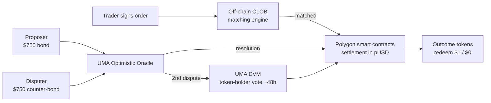
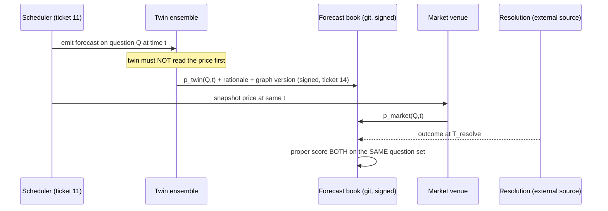

# Prediction markets (Polymarket et al.) — signal source, calibration benchmark, or neither?

Research output for [ticket 17](../issues/17-research-prediction-markets.md). Date: 2026-08-05.

Method note: claims are labelled **[reported]** (sourced to a document, cited) or **[inferred]** (my reasoning
from those facts). Empirical probes I ran directly against public APIs on 2026-08-05 are labelled **[probe]**
and are reproducible.

---

## 1. Executive verdict

| Use | Verdict | Decisive reason |
|---|---|---|
| **Live signal source** | **Yes — narrow, and not for the reason assumed** | Value is not the price level (which is biased and unusable as a probability at the tails). Value is that a *price change* is a **dated, quantified, externally-authored event**. It is a surprise generator we did not write. But coverage restricts this to macro/geopolitics — ~1 of ~9 committed scenario families. |
| **External calibration benchmark (scoreboard)** | **No** | Brier/log scores are **not comparable across different question sets**, and the overlap between the twin's scenario library and any market's question list is near zero. Comparing our Brier to Polymarket's published 0.0627 would be meaningless arithmetic. |
| **External calibration benchmark (co-registered, question-by-question)** | **Yes — genuinely valuable, but it tests a different capability than the one under suspicion** | Posting a dated forecast on *the same question, same resolution criteria, same timestamp* as a liquid market is a real, ungameable, external comparison. But it scores the twin's **general world-forecasting**, not its **org-twin causal machinery**. It does not close the circularity hole it is being recruited to close. |
| **Answer to "is this the EXTERNAL source of surprise we need?"** | **Partially — it is the best available *cadence* source, not the missing ground truth** | It supplies what the project is short of: a continuous stream of dated, scoreable, externally-resolved questions that we did not author, on a schedule. That is real and it is not nothing. It does not supply org-specific ground truth, and it never will. |

**The single most valuable use**, stated precisely: a **co-registered forecast book**. The twin emits a dated
probability on every liquid market question that touches its world layer, on a schedule, *before* seeing the
price; the price is recorded at the same timestamp; both are scored on the same resolution. This gives the
project the one thing it currently cannot manufacture — **an adversarial baseline it cannot grade itself
against**, at volume.

**The single biggest reason for caution**: the favourite–longshot bias is **statistically significant in every
subsample tested, including the highest-volume quintile and the largest-transaction quintile**
([Bürgi, Deng & Whelan 2026](https://www2.gwu.edu/~forcpgm/2026-001.pdf)). "Use only liquid markets" does **not**
fix it. A market price is a *biased* estimator of probability with a known sign, and any pipeline treating
`price == P(event)` is wrong by construction — most severely exactly where the twin cares most: **low-probability,
high-impact tail events**.

---

## 2. Mechanics — what Polymarket actually is (current, 2026)

### 2.1 Market structure: CLOB, not AMM

Polymarket **is not an AMM**. It runs a **hybrid-decentralised central limit order book**: an off-chain matching
engine hosts the book and matches signed orders; settlement executes on-chain on Polygon
([Polymarket docs](https://docs.polymarket.com/trading/overview);
[CLOB V2 developer walkthrough](https://benjamincup.medium.com/how-polymarket-orders-actually-get-executed-a-deep-dive-into-clob-v2-for-developers-fdcd5d395ef5)). **[reported]**
This has changed over the platform's life — early Polymarket used AMM pools; the entire product surface is now
CLOB. Getting this wrong would mis-model slippage and depth, so: **order book, off-chain matching, on-chain
settlement**.

Kalshi is likewise **quote-driven** with an explicit maker/taker split recorded in the data
([Bürgi et al. 2026, §2.2](https://www2.gwu.edu/~forcpgm/2026-001.pdf)). **[reported]**

### 2.2 Collateral and fees

- Collateral: **pUSD** on Polygon; USDC deposit/withdrawal with **no Polymarket fee** to deposit or withdraw
  ([fees docs](https://docs.polymarket.com/trading/fees.md)). **[reported]**
- **Makers are never charged.** Only takers pay. Taker rate varies by category:
  **crypto 0.07, sports/economics/culture/weather 0.05, finance/politics/tech 0.04, geopolitics 0%**.
  Formula: `fee = C × feeRate × p × (1 − p)` — peaks at p = 0.5, vanishes at the tails
  ([fees docs](https://docs.polymarket.com/trading/fees.md)). **[reported]**
- Kalshi's pre-2025 structure was **`$0.07 × P × (1 − P)` charged to takers only**, rounded up to the cent;
  Kalshi began charging makers after April 2025 ([Bürgi et al. 2026, §2.2](https://www2.gwu.edu/~forcpgm/2026-001.pdf)). **[reported]**

**Consequence for reading price-as-probability [inferred]:** the fee is *smallest at the tails*, so fees are
**not** the explanation for tail mispricing — which makes the observed tail bias a behavioural/structural fact,
not a friction artefact. This matters: you cannot "de-fee" a price back to a probability.

### 2.3 Resolution — the UMA optimistic oracle, and its failure modes

Process ([Polymarket resolution docs](https://docs.polymarket.com/concepts/resolution)): **[reported]**

1. Anyone proposes an outcome, posting a **~$750 pUSD bond**.
2. **2-hour challenge window.** Unchallenged → resolves.
3. A disputer posts an equal **$750 counter-bond** → second proposal round.
4. Second dispute → escalation to the **UMA DVM**, where **UMA token holders vote** over ~48 h.
5. Possible outcomes include **"Unknown / 50-50"**, in which *every* token redeems at **$0.50**.

Undisputed resolution ≈ 2 h; disputed ≈ 4–6 days. **[reported]**

Documented failures:

- **>1,150 disputed markets in 2026**, already past the full-year 2025 total. **[reported]**
- A **$60 M+** market ("MicroStrategy sells any Bitcoin by May 31, 2026?") stuck in the DVM queue after two "No"
  proposals were challenged; critics argue "UMA's token-voting model is structurally broken" and that "whales
  weaponize ambiguous rules … to save their own positions"
  ([The Defiant](https://thedefiant.io/news/markets/usd85m-polymarket-dispute-over-strategy-s-may-bitcoin-sale-puts-uma-s-token-voting-oracle-on)). **[reported]**
- A **$16 M** market on UFO-file declassification resolved **YES** with no documents released, after late-session
  buying at 99–99.9¢ and multiple disputes ([Webopedia summary](https://www.webopedia.com/crypto/learn/polymarkets-uma-oracle-controversy/)). **[reported]**
- Voting-power concentration: reportedly **nine wallets** control the UMA vote
  ([Contrary Research](https://research.contrary.com/report/are-prediction-markets-doomed-to-fail)). **[reported]**

**[inferred] Why this bites us specifically.** The twin's whole epistemic pitch is *contemporaneous,
adversarially-produced, timestamped evidence*. A UMA resolution is timestamped and adversarial, but it is
**not a record of the world** — it is a record of a token vote about the world. For a well-specified question
with a public numeric source ("was CPI above X"), those coincide. For anything requiring judgement — precisely the
questions the twin cares about — they can diverge, and the divergence is **economically motivated**. Any use of
market resolutions as an answer key must therefore **filter to questions with an external, non-market
resolution source** and treat UMA-judgement resolutions as grade-4 evidence at best on the project's ladder.

### 2.4 What a price does and does not mean

This is the load-bearing theory and it is genuinely unsettled:

- **Manski (2006)**: observing price `p` with risk-neutral traders who invest all wealth in their preferred
  contract, the population **mean belief can be anywhere in `[p², 2p − p²]`**. At p = 0.10 that is
  **[0.01, 0.19]** — a nearly twentyfold range. **[reported, via Bürgi et al. 2026 §2.1]**
- **Gjerstad (2004); Wolfers & Zitzewitz (2006)**: *if* traders maximise **log utility** *and* the belief
  distribution is **symmetric**, the market-clearing price **equals the mean belief**. **[reported, ibid.]**
- **He & Treich (2017)**: that equality **fails for every other CRRA utility function**. **[reported, ibid.]**

**[inferred]** So "price = probability" holds under one specific utility assumption that nobody has verified
holds for Polymarket's actual population. The honest engineering position: **a price is a bounded, biased,
externally-produced *estimator* of a probability, with a known bias direction (§3.1) and an unknown scale
factor.** Treat it as a signal, never as a ground-truth probability. If the twin ever ingests a price into the
£-pricing chain, it must enter as an evidence-graded quantity with an uncertainty band, not as a scalar.

---

## 3. Calibration evidence

### 3.1 Favourite–longshot bias — the strongest, most damaging finding

**Bürgi, Deng & Whelan (2026), "Makers or Takers: The Economics of the Kalshi Prediction Market"**, GWU CER
Working Paper 2026-001 ([PDF](https://www2.gwu.edu/~forcpgm/2026-001.pdf)) — the first systematic study of a
large modern regulated prediction market. Dataset: **46,282 contracts across 12,403 events, 2021–April 2025;
313,972 contract prices** after including both sides; markets open ≥24 h with ≥$1,000 volume. **[reported]**

Findings **[reported]**:

- Prices are **informative and improve monotonically toward close** (mean absolute error declines each day for
  10 days, with a steep final-day drop).
- But **Mincer–Zarnowitz regressions reject unbiasedness at p < 0.01 in every single subsample tested.**
- **Contracts priced under 10¢ lose over 60% of stake.** Contracts above 50¢ earn small positive returns;
  above 70¢ the positive return is statistically significant.
- **Average return across all contracts ≈ −20%** (pre-fee; the asymmetry, not the fees, produces this).
- **Liquidity does not fix it.** Splitting by total-volume quintile, the null is rejected in **all five**;
  "other than [the lowest quintile having the largest coefficient], there is no evidence of prices in
  higher-volume markets being more efficient predictors."
- **Trade size does not fix it.** By average-transaction-size quintile, the null is rejected in all five, and
  **the quintile with the largest transactions has the largest bias coefficient.**
- Rejected across **all categories** (financials, crypto, climate, weather, politics, entertainment) and
  **all calendar years**, though 2025's coefficient is smaller and less significant — weak evidence the bias
  is decaying.
- Distribution is barbelled: **67.6% of contracts are priced <10¢ or >90¢**; only 2.7% sit in 50–59¢.

Corroboration: the **Vanderbilt study (Clinton & Huang)** — 2,500 markets, $2.5 bn volume across Polymarket,
Kalshi and PredictIt — found outcomes priced **below 10% occurred 14% of the time**; Polymarket got **67% of
markets right** vs Kalshi 78% and PredictIt 93%; 58% of Polymarket presidential markets showed **negative serial
correlation** (spike-then-reverse); and **inefficiency increased in the final two weeks** before Election Day
([DL News summary](https://www.dlnews.com/articles/markets/polymarket-kalshi-prediction-markets-not-so-reliable-says-study/)). **[reported]**

Counterpoint for balance: **Berg & Rietz (2019)** reported **no** favourite–longshot bias in the Iowa Electronic
Markets; **Page & Clemen (2013)** found InTrade longshot overpricing only at horizons >10 days, attributable to
discounting of the future payout, and no significant deviation near close. **[reported, via Bürgi et al. §2.1]**
**[inferred]** The modern-platform result is therefore not universal across all prediction markets ever — it is a
property of the current retail-heavy venues, which are the ones we would actually use.

**[inferred] Direct implication for the twin.** The project's most valuable forecasts are low-probability,
high-£-impact tails. That is exactly the price region where market prices are **most wrong and most
systematically wrong**. Using market prices as either an input probability or a benchmark in that region imports
a known ~2–4× overstatement of tail likelihood. If you use them at all, use them in the **30–70¢ band**, or
apply an explicit debiasing map fitted on resolved history — and then note that you have just introduced a
fitted correction that is itself an unvalidated model.

### 3.2 Manipulation — persists longer than the folklore claims

**Rasooly & Rozzi (2025), "How manipulable are prediction markets?"**
([arXiv:2503.03312](https://arxiv.org/pdf/2503.03312)) — the first large-scale randomised **field experiment**:
**817 markets** on Manifold, each randomly shocked ±5 percentage points, hourly prices collected for 30 days
(600,000 observations) plus a 60-day snapshot. **[reported]**

- **Effects of the manipulation are still visible 60 days later.** **[reported]**
- Reversion happens but is partial and decelerating — fast in week one, slowing after. **[reported]**
- **Markets with more traders, more volume, more comment activity, and an external duplicate market on another
  platform are harder to manipulate.** **[reported]**
- Replicated in a follow-up on Manifold's **cash-redeemable** currency with broadly similar results. **[reported]**

This **contradicts the standard citation** (Wolfers & Zitzewitz 2004; Rhode & Strumpf 2004/2006; Sunstein 2006)
that manipulation is "transparent and short-lived". Rhode & Strumpf's historical evidence
([ResearchGate](https://www.researchgate.net/publication/201169052_Manipulating_Political_Stock_Markets_A_Field_Experiment_and_a_Century_of_Observational_Data))
established that manipulation *attempts* were common and party bosses generally lost money — but as Rasooly &
Rozzi note, observational studies cannot estimate the counterfactual price path. **[reported]**

Real-world case: the 2024 "French whale" (accounts Fredi9999/Theo4/PrincessCaro/Michie, ~$28 M on a Trump win,
~$80 M profit). Polymarket's own investigation found no manipulation and the trader claimed pure profit motive
([CBS](https://www.cbsnews.com/news/french-whale-made-over-80-million-on-polymarket-betting-on-trump-election-win-60-minutes/),
[The Block](https://www.theblock.co/post/324996/french-polymarket-whale-us-election-profit-france-ban)) —
but France's ANJ pressure led Polymarket to geoblock French users in December 2024. **[reported]**

**[inferred] Implication.** A price move is **not** reliably an information event. Some fraction of moves are
one wallet with a thesis or an agenda, and that fraction persists for weeks. Any horizon-scanning rule of the
form "price moved >X ⇒ raise a signal" will fire on manipulation and on noise-trader herding
(Clinton & Huang's negative serial correlation is exactly this). The mitigations are the ones the experiment
itself identified: **require corroboration on a second, independent venue**, and weight by trader count rather
than volume.

### 3.3 The published self-assessments are close to meaningless

Polymarket's own accuracy page ([polymarket.com/accuracy](https://polymarket.com/accuracy)) reports
**Brier 0.0627**, **98.6% accuracy at 4 hours before resolution** and **90.1% at 1 month**. **[reported]**

**[inferred] Why this cannot be used as a benchmark:**

1. **The headline Brier is measured 4 hours before resolution.** Four hours before a football match ends or a
   CPI print lands, the outcome is nearly known. This measures *convergence*, not *foresight*.
2. **"Accuracy" = "did the leading outcome match reality"** — a 51/49 correct call and a 99/1 correct call score
   identically. That is not a proper scoring rule.
3. **The portfolio dominates the score.** With ~68% of contracts priced below 10¢ or above 90¢
   (Bürgi et al. Table 2), a Brier score over the whole book is mostly measuring *how many easy questions the
   venue lists*, not how good it is. Metaculus's ~0.10–0.11 and Polymarket's 0.063 are **not comparable numbers**
   — they are scores on different, self-selected question sets.

**This is the single most important epistemic point in this document, and it kills the naive version of the
calibration-benchmark hypothesis.** Brier scores are only comparable **within a fixed question set**. Any
scoreboard comparing "our Brier" to "their Brier" across different questions is arithmetic without meaning.

### 3.4 Other named pathologies

| Pathology | Evidence | Relevance to us |
|---|---|---|
| **Long-horizon degradation** | Capital opportunity cost reduces liquidity and accuracy at long horizons. Maresca (2026, [arXiv:2602.21091](https://arxiv.org/abs/2602.21091)) LLM-agent simulation finds the pricing bias is **0.72 pp** — "significantly smaller than theoretical and prior empirical estimates" — and interest-bearing positions remove ~83% of the horizon effect, tripling participation (17%→62% of wealth). **[reported]** | Mildly reassuring on *bias*, but the *participation* finding is the real one: long-horizon markets are thin because capital won't sit there. The twin's horizons are years. |
| **Domain-dependent calibration** | Le (2026, [arXiv:2602.19520](https://arxiv.org/abs/2602.19520)): "a price's meaning depends on what, when and how much is traded"; **persistent underconfidence in political markets** (prices compressed toward 50%); ~87% of variance explained by domain-specific patterns in-sample, **dropping to 72% out-of-sample**. **[reported]** | You cannot apply one debiasing map across categories, and a fitted map degrades out-of-sample. |
| **Winner concentration / adverse selection** | Top **0.1% of Kalshi accounts capture 67% of profits**; top **1% on Polymarket capture 76%** ([Contrary Research](https://research.contrary.com/report/are-prediction-markets-doomed-to-fail)). **[reported]** | The "wisdom of crowds" is in practice the wisdom of a handful of accounts. A price is closer to "a few sharp traders' view" than "the crowd's view". |
| **Resolution ambiguity** | §2.3. **[reported]** | Filter to externally-resolvable questions only. |
| **Noise-trader herding** | Clinton & Huang: negative serial correlation in 58% of Polymarket presidential markets; daily moves across platforms barely correlated. **[reported]** | Cross-venue disagreement is itself a usable quality filter. |

---

## 4. Use-case 1 — market prices as a live signal source

### The shape that works

Not "read the price, believe the probability". Instead: **treat a market as an externally-maintained,
timestamped, quantified opinion series, and consume its *derivative and its disagreement*, not its level.**

Three concrete signal types, in descending order of defensibility:

1. **Regime-change detection on the world layer.** A sustained, cross-venue-corroborated move in a liquid
   geopolitical/macro market is a dated event asserting that *the external world's assessment changed on this
   date*. That is a legitimate horizon-scanning trigger and it is genuinely not authored by us. Fires the
   ticket-11 "unbound signals decay unless the graph catches them" mechanism with a real external clock.
2. **Belief-vs-market delta as a contestability artefact.** Ticket 08/13 want rival world models held with
   credences and adjudicated by calibration. A market price is a **free, continuously-updated rival forecaster**.
   Where the twin's ensemble and the market disagree sharply, that is precisely the "something to argue with"
   the map.md unifying principle wants — and the disagreement is with an outsider, not with ourselves.
3. **Lead-time-to-recognition measurement.** map.md wants lead time measurable. A market price series gives an
   independent "when did the world notice" timestamp to measure the twin's lead or lag against, without us
   choosing the date.

### What it proves and does not prove

**Proves:** that the twin ingests at least one signal stream whose content, timing and direction were determined
entirely outside the project, by parties with money at risk. That is a real, if narrow, answer to the
"all loops close through the same mind" critique — for the *sensing* stage only.

**Does not prove:** (a) that the twin's *interpretation* is right — mapping a Polymarket move onto a Wardley
component is our judgement, unvalidated by the market; (b) that the price was informative rather than
manipulated or herd-driven (§3.2, §3.4); (c) anything at all about org-specific risk, because no market prices it.

**[inferred] Honest scoring: worth building, small.** This is a genuine but thin external input. It is not the
sensing breakthrough. It should be one connector among many, and its main virtue is that it is *cheap, dated,
machine-readable and free* — not that it is deep.

---

## 5. Use-case 2 — market prices as an external calibration benchmark

This is the strong hypothesis. It needs splitting into three distinct proposals, because they have wildly
different epistemic value.

### 5.1 Proposal A — compare aggregate Brier scores. **Reject.**

Killed by §3.3. Brier is a property of `(forecaster, question set)`. Different question sets → incomparable.
There is no repair.

### 5.2 Proposal B — score the twin *against* market prices as the answer key. **Reject.**

I.e. treat the market price as the "true" probability and penalise deviation. This fails on three counts:

1. **Circular in a new way.** It defines truth as agreement with a biased estimator, so the twin's ceiling is
   "reproduce the favourite–longshot bias faithfully". Perfect score = perfectly wrong at the tails.
2. **Agreeing with a liquid market proves nothing.** Both parties read the same news. Convergence is the
   expected outcome and carries almost no information about the twin's causal machinery.
3. **Beating a thin market proves nothing either.** With sub-$50k markets — which is what all the
   project-relevant ones are (§6) — you are beating a handful of retail accounts, and the Rasooly–Rozzi result
   says you could *move* such a market yourself. Beating a market you could manipulate is not a test.

### 5.3 Proposal C — co-registered forecasting. **Accept, with a clear statement of its limits.**

The only defensible form:

Design requirements, all non-negotiable:

- **Blind emission.** The twin must not see the price before committing. Otherwise it is anchoring, not
  forecasting. (Mirrors ticket 12's planter/detector/scorer split — the same discipline, externalised.)
- **Pre-registered question set on a schedule**, chosen by a rule, not by hand. Otherwise selection bias
  reappears — and this is the failure mode the project already named.
- **Same resolution source**, external and non-market where possible (§2.3).
- **Signed, timestamped, immutable** — which ticket 14's provenance work already gives for free.
- **Report the full reliability diagram**, not a scalar, and report **both** components of the Murphy
  decomposition (§8).

**What Proposal C genuinely proves:**

- That the twin can produce **calibrated probabilities on externally-resolved questions**, measured against a
  money-backed baseline it cannot influence or grade.
- That the calibration record was produced at **volume**, on a **schedule**, with **no selection** — which is
  exactly what map.md's weather-forecast framing demands and cannot currently evidence.
- If the twin's reliability diagram is closer to the diagonal than the market's on the *same* questions, that is
  a real, publishable, adversarially-checkable claim.

**What Proposal C does NOT prove — and this is the crux:**

1. **It does not test the org twin.** It tests general-purpose world-event forecasting. The suspicion under
   investigation is that the twin's *causal graph, Wardley mapping and £ pricing* are self-confirming. A good
   Brier score on "will the US lift CAATSA sanctions on Turkey" says nothing about whether the causal edge from
   sanctions → Intel's foundry position is real. **The circularity hole is not closed by this.**
2. **It does not defeat parametric contamination.** Ticket 06 correctly worries that an LLM "predicting" a famous
   outcome may be reciting training data. That worry applies here too for any question whose answer post-dates
   nothing — mitigated only because these are *future* questions. This is actually the one contamination-proof
   property of the design and should be stated as such: **forward-dated market questions are, by construction,
   outside the training corpus.** That is a genuine and underrated benefit.
3. **It cannot ever score the £ layer.** No market prices "what did this cost the org in £". The currency
   remains unvalidated externally.
4. **Beating the market slightly is over-interpretable.** Given the known bias, a twin that simply applies a
   fitted longshot correction to the market price would beat the market — while adding zero understanding. The
   scoring design must include that trivial strategy as an explicit **null model** and require the twin to beat
   *it*, not just the raw price.

**[inferred] Net.** Proposal C is worth building and is the best single idea in this research. But it should be
described internally as **"an external honesty gate on the forecaster"**, not as **"validation of the twin"**.
Conflating those would be exactly the kind of overclaim the adversarial critique was designed to catch.

---

## 6. Coverage — the honest, and fairly brutal, arithmetic

### 6.1 What these venues actually price

Category share of Polymarket volume since July 2024: **sports ~39%, politics ~32%, crypto ~20%**
([Pew Research](https://www.pewresearch.org/short-reads/2026/05/27/trading-volume-on-prediction-markets-has-soared-in-recent-months/),
[MetaMask/analyst roundups](https://metamask.io/news/prediction-market-overview-trends-2026)). **[reported]**
That is **~91% in three categories the project does not need.** Contrary Research puts sports at
**85–100% of volume** industry-wide, "where resolution is unambiguous". **[reported]**

**[probe] Kalshi open events, 2,000 sampled via the public API on 2026-08-05:**

| Category | Open events |
|---|---:|
| Elections | 1,291 |
| Sports | 213 |
| Politics | 136 |
| Financials | 118 |
| Entertainment | 81 |
| Economics | 76 |
| **Companies** | **42** |
| **Science and Technology** | **19** |
| Climate and Weather | 13 |
| Health | 4 |
| **World** | **3** |

(Caveat: a 2,000-event cursor sample of an unknown-ordered population, not a census. Directionally clear.)

**Science & Technology is 0.95% of the sample. "World" is 0.15%.**

### 6.2 Direct probe against the project's own subjects

**[probe] Polymarket Gamma `public-search`, 2026-08-05, volume in $:**

Searching **"Intel"** — one of the two co-flagships (ticket 06) — returns, ranked by volume:

| Volume | Market |
|---:|---|
| 318,690 | CS2: **Intel Extreme Masters** Melbourne Winner *(esports)* |
| 128,845 | CS2: **Intel Extreme Masters** Chengdu Winner *(esports)* |
| 110,565 | Counter-Strike — **HyperX & Intel** Nationals Group A *(esports)* |
| 71,795 | Intel × TSMC joint venture announced before July? |
| 53,783 | Will Qualcomm acquire Intel? |
| 33,170 | Intel (INTC) Q2 adjusted gross margin (non-GAAP)? |
| 23,662 | Will Intel CEO Lip-Bu Tan resign by August 31? |
| 4,911 | Intel Q2 Data Center & AI revenue above __? |
| 3,188 | Intel Q2 Foundry revenue above __? |

**The four highest-volume "Intel" markets on Polymarket are Counter-Strike tournaments Intel sponsors.** The
genuinely strategic questions — the TSMC JV, the Qualcomm acquisition, the CEO's tenure — exist but clear
**$20k–$72k**, i.e. below Kalshi's median contract volume of ~$9k only by an order of magnitude, and far below
anything where the liquidity literature's accuracy results apply. All three are also now **closed**.

Searching **"Netflix"** — the other co-flagship — returns only content-chart markets: "top US Netflix show this
week" ($55k), "#2 global Netflix show" ($49k), "top US Netflix movie" ($4.9k). **Zero markets on Netflix as a
firm.** **[probe]**

Searching **"supply chain"** returns nothing on supply chains; the top hits are earnings-call phrase-bingo
markets ("What will AMD say during their next earnings call?", $13k). **[probe]**

Searching **"quantum"** returns quantum questions **only framed as Bitcoin risk**: "Bitcoin quantum-resistant
upgrade implemented in 2026?" ($3.0k), "Quantum breaks Bitcoin by ___?" ($2.4k). The one liquid item
($195k, "Will Bitcoin replace SHA-256 before 2027?") is a crypto market wearing a quantum hat. **[probe]**

By contrast, **geopolitics and macro are genuinely liquid** **[probe]**: "Major cyberattack on Iran in June?"
$17.4 M; "Will Trump impose more sanctions on Russia by September 30?" $8.0 M; "US-Iran nuclear deal by June 30?"
$11.3 M; "US recession by end of 2026?" $1.7 M; "East coast port strike ends by next Friday?" $126k.

### 6.3 Horizon

**[probe]** Of the **top 100 open Polymarket markets by volume** on 2026-08-05:

| Horizon to resolution | Markets | Cumulative volume |
|---|---:|---:|
| < 7 days | 7 | $268 M |
| 7–30 days | 0 | — |
| 1–3 months | 1 | $14 M |
| 3–12 months | 11 | $364 M |
| **1–3 years** | **81** | **$2.28 bn** |
| **> 3 years** | **0** | **$0** |

Better than folklore at the 1–3 year band — but **nothing beyond three years exists at any volume.**
The project's quantum/HNDL scenario has a 5–15 year horizon. **There will never be a market for it.**

### 6.4 Scenario-library coverage scorecard

Against map.md's committed set:

| Scenario family | Market exists? | Liquid? | Verdict |
|---|---|---|---|
| **Sanctions** | Yes, many | **Yes** ($1.7 M–$17 M) | ✅ Usable |
| **Climate event** | Yes (Kalshi weather) | Moderate | 🟡 Usable but city-temperature contracts, not org-relevant hazards |
| **M&A** | Occasionally, per-deal | No ($29k–$54k) | 🟡 Thin, episodic, appears only after a deal is already rumoured — i.e. *after* the anticipation window closed |
| **AI-model access** | Some (model-release races) | Thin | 🟡 Proxy only |
| **Bus-factor / key person** | Only CEO-resignation markets on famous CEOs | No ($23k) | 🟡 Rare, thin, and only for the top 1% of named individuals |
| **Supply shock** | Essentially none | — | ❌ |
| **Quantum / HNDL** | Only as Bitcoin-break framing | Thin | ❌ Horizon alone rules it out |
| **Memory cost** | None found | — | ❌ |
| **Insider / coercion** | None, and could not exist | — | ❌ |
| **Opportunity plays** (Wardley preconditions) | None | — | ❌ |

**Honest headline: ~1 of 10 families is properly covered; ~4 are thin proxies; ~5 cannot be covered even in
principle. And 0% of the per-org private overlay — the actual subject of the twin — is covered by anything.**

**[inferred]** This is decisive for scoping. Prediction markets can only ever touch the **shared world layer**
of the ticket-07 graph, never the overlay. Which — usefully — is exactly the architectural boundary the project
already drew. It is a **world-layer instrument**, and should be wired in as one.

---

## 7. Comparable systems

### 7.1 Metaculus

Community forecasting platform, no money. Published aggregate performance ~**Brier 0.107–0.111** on resolved
questions (2021 cohort: Metaculus Prediction 0.107, Community Prediction 0.108); notably **worse on AI questions**
(~0.2027 in one 2023 analysis) ([Metaculus FAQ](https://www.metaculus.com/faq/),
[EA Forum: Exploring Metaculus's AI Track Record](https://forum.effectivealtruism.org/posts/e9htD7txe8RDdcehm/exploring-metaculus-s-ai-track-record),
[Open Philanthropy on the AI Progress Tournament](https://www.openphilanthropy.org/research/takeaways-from-the-metaculus-ai-progress-tournament/)). **[reported]**

**[inferred] Metaculus is a better fit than Polymarket for this project on two axes and worse on one.** Better:
its question set skews to technology, science, geopolitics and long horizons — the twin's actual territory —
and its scoring machinery (§8) is more sophisticated than anything the markets publish. Worse: it is **not
money-backed**, so it fails the project's "opposed-interest" evidence criterion in its strict form. The
counter-evidence on that (§7.4) is stronger than expected.

### 7.2 Good Judgment Project / Tetlock — the most relevant precedent

The GJP identified ~260 **superforecasters** from >5,000 participants over 4 years of IARPA geopolitical
tournaments; the top cohort beat the average Brier by **~60%**, and "have beaten other benchmarks, competitors,
and prediction markets"
([AI Impacts summary of GJP evidence](https://aiimpacts.org/evidence-on-good-forecasting-practices-from-the-good-judgment-project/)). **[reported]**

**Extremizing**: aggregate then push toward 0/1, with the shove size depending on pool diversity and
sophistication. But: it helps **ordinary** forecasters most, barely helps superforecasters, and "more recent data
suggests the successes of the extremizing algorithm during the forecasting tournament were a fluke". **[reported]**

**[inferred] Lesson.** A well-run, well-scored, *non-market* human forecasting process beat markets. That is a
direct argument that the project's calibration ambitions do **not** require a market — they require **proper
scoring, volume, schedule and feedback**. And it is a caution against adopting extremizing as a default
aggregation step for the ensemble.

### 7.3 Kalshi

CFTC-designated contract market since Nov 2020, no stake limits (unlike PredictIt/IEM). Categories: politics,
economics, weather, company announcements, financial markets, and — since early 2025 — sports.
**[reported, Bürgi et al. §1]** Best-documented calibration evidence of any venue (§3.1), which paradoxically
makes it the venue we know most about *and* the one with the best-established bias. Read-only public API.

### 7.4 Manifold — play money, and it barely matters

Rasooly & Rozzi note Manifold markets are "remarkably well-calibrated and exhibit levels of predictive accuracy
comparable to those of more traditional prediction market platforms". **[reported]** Independent comparisons put
Manifold within **1–5 pp of Polymarket on overlapping binary questions**, consistent with the classic 2004
NewsFutures-vs-TradeSports study across **208 market pairs** that found **no accuracy difference between
real-money and play-money markets**. **[reported, via review aggregators]**

**[inferred] This is important and inconvenient for the strong hypothesis.** If play money forecasts about as
well as real money, then "money-backed" is doing much less epistemic work than the project's evidence ladder
assumes. The property that matters is **skin in *something*** — reputation, leaderboard standing, a public
track record — plus **volume and proper scoring**. That materially weakens the argument that Polymarket is
categorically better evidence than Metaculus, and it *strengthens* the case for the project running its own
scored forecast book.

### 7.5 Augur — the cautionary decentralised case

Permissionless market creation, on-chain. Daily users collapsed from ~270 at launch to **under 30**; killed by
low liquidity, poor settlement UX, high gas fees, and controversy over user-created assassination markets.
The broader pattern: "products built around the permissionless creation vision (Augur, Omen, Zeitgeist…) failed
due to recurring problems with liquidity, resolution, creator incentives, and regulation"
([1kx](https://1kx.capital/writing/prediction-markets-bottlenecks-and-the-next-major-unlocks),
[Contrary Research](https://research.contrary.com/report/are-prediction-markets-doomed-to-fail)). **[reported]**

**[inferred] Lesson for us:** *question supply is not the bottleneck; liquidity per question is.* Anyone can
write a question about Intel's foundry. Nobody will trade it. Which is precisely why §6 looks the way it does.

### 7.6 Internal corporate prediction markets — the most directly relevant literature

**The markets worked. The organisations killed them anyway.** This is the finding, and it is the most
transferable lesson in this entire document.

**Cowgill & Zitzewitz (2015), "Corporate Prediction Markets: Evidence from Google, Ford, and Firm X",
Review of Economic Studies 82(4):1309**
([Oxford Academic](https://academic.oup.com/restud/article-abstract/82/4/1309/2607345),
[Columbia](https://business.columbia.edu/faculty/research/corporate-prediction-markets-evidence-google-ford-and-firm-x)): **[reported]**

- Markets were **relatively efficient**, improving on **expert forecasts at all three firms by up to a 25%
  reduction in mean-squared error**.
- Most notable inefficiency: an **optimism bias** at Google — **newly hired employees sat on the optimistic
  side**, and optimism was **significantly stronger on days when Google stock was appreciating**.
- Inefficiencies **shrank over time**; experienced and high-performing traders traded against them.

**Google's own history** ([Asterisk, "The Death and Life of Prediction Markets at Google"](https://asteriskmag.com/issues/08/the-death-and-life-of-prediction-markets-at-google)): **[reported]**

- **Prophit** (2005–2011): tracked **>60% of Google's quarterly objectives**; ~**20% of the workforce**
  participated at peak. **Gleangen** (2020–): ~8% of a much larger workforce, ~15,000 people, 1,000+ monthly
  traders; staffed under the Behavioral Economics team after 2022.
- Prophit died not from inaccuracy but from **regulatory dead-end + sponsor departure**: the plan was an external
  launch, online gambling law blocked it, Dodd-Frank ended the reform momentum, and the core team dispersed.
  Cowgill: *"I regret that we shut down Prophit. We should have treated the internal instance as a product in its
  own right, not as a stepping stone to going public."*
- **The manager-incentive failure**: on supply-chain forecasting, "Managers were incentivized to improve the
  forecasting process' transparency, adjustability, accountability, and interoperability… They didn't stand to
  benefit much even if Gleangen did improve the final accuracy."
- **The need-to-know conflict** (at Waymo): "the core mechanism of prediction markets — using the wisdom of
  crowds — can be antithetical to the common management desire to control who knows what."
- **The question-selection failure**: Gleangen asked "Will *Google* integrate LLMs into Gmail by Spring 2023?"
  when "what executives would have wanted to know was 'Will *Microsoft* integrate LLMs into Outlook by Spring
  2023?'"
- HP's market ended when the CalTech academic collaboration ended
  ([Sempere](https://nunosempere.com/blog/2021/12/31/prediction-markets-in-the-corporate-setting/)).
  Contributing causes across firms: **thinness, weak incentives, limited entry, difficulty writing good
  questions, and social disruptiveness**. **[reported]**

**[inferred] Four lessons that transfer directly to this project:**

1. **Accuracy was never the failure mode.** All three corporate markets beat their experts and all three died.
   A perfectly calibrated org twin can die the same way. The project's magnum-opus framing optimises for
   *rightness*; this literature says **rightness is necessary and insufficient**, and the binding constraint is
   whether any decision-maker's incentives attach to the output.
2. **The "artefact to argue with" principle (map.md, 2026-08-05) is validated *and* threatened by this
   literature.** Validated: externalising disagreement onto an artefact is exactly what these markets did.
   Threatened: Waymo shows management may actively *not want* the disagreement externalised, because a public
   aggregate destroys information control. The twin's transparency commitment (ticket 10) is the same bet Google
   lost twice. **This deserves an explicit position, not silence.**
3. **Google's question-selection failure independently corroborates ticket 07's architecture.** The valuable
   questions were about **competitors and the outside world**, not about the org itself — i.e. the **shared world
   layer**, not the private overlay. And that is precisely the layer prediction markets *can* cover (§6.4).
   Two independent lines of evidence converging on the same seam is worth recording.
4. **Optimism bias is an org-twin-specific hazard.** If the twin ever elicits internal human forecasts as
   evidence, expect optimism correlated with tenure and with recent good news. Ticket 11 already scores human
   overrides against evidence — this literature says **new joiners and bull-market days are the predictable bias
   axes**, which is a concrete prior worth encoding.

---

## 8. Reusable prior art — scoring, aggregation, incentives

Directly transplantable into the twin's calibration machinery.

### 8.1 Proper scoring rules

- **Brier (quadratic)**: bounded [0,1], strictly proper, the reporting default.
- **Log score**: strictly proper, unbounded penalty for confident error
  ([Metaculus scoring](https://www.metaculus.com/help/scores-faq/), Good 1992). **[reported]**
- **[inferred] Recommendation**: score internally on **log** (it punishes exactly the overconfident tail calls
  the twin is most tempted to make and most rewarded for socially), report externally on **Brier** (bounded and
  legible to a non-specialist audience). Report both; never report only a scalar.

- **The Murphy (1973) decomposition** — `Brier = reliability − resolution + uncertainty` — separates *being
  calibrated* from *being informative*. **[inferred] The project needs this named explicitly.** A forecaster that
  always emits the base rate is **perfectly calibrated and worthless**. map.md's weather-forecast framing
  currently implies calibration is the target; it is half the target. Reliability diagrams alone will let a
  cowardly twin look excellent.

### 8.2 Metaculus's scoring innovations — the most reusable single item

([Metaculus scoring docs](https://www.metaculus.com/help/scores-faq/),
[Metaculus new-scores announcement](https://forum.effectivealtruism.org/posts/FodvZaiKftDCHPTub/metaculus-introduces-new-forecast-scores-new-leaderboard-and)) **[reported]**

- **Baseline score** — vs a fixed uniform-chance baseline. Positive = better than chance.
- **Peer score** — mean difference between your log score and every other forecaster's on that question.
  **Sums to zero across participants by construction.** This is the *relative* measure that survives varying
  question difficulty — i.e. **it is the mechanism that makes cross-forecaster comparison legitimate where raw
  Brier does not.**
- **Coverage** — penalises forecasting only on questions you like, and rewards standing predictions maintained
  over a question's life.

**[inferred] This is the direct answer to the project's stated selection-bias worry.** map.md/ticket 11 solve it
with a *schedule*. Metaculus solves it with a **scoring term** — coverage — which is strictly stronger, because
it prices non-participation rather than merely forbidding it. **Adopt peer score + coverage.** Peer score is also
exactly the right instrument for the Proposal C benchmark: score the twin against the market **as a peer on the
same question**, which is legitimate, rather than comparing portfolio Brier scores, which is not.

### 8.3 Aggregation

- **Extremizing** (Satopää/Mellers/Ungar via GJP): aggregate then shift toward the extremes. **Caveat as
  reported in §7.2: possibly a tournament fluke, minimal benefit for strong forecasters.**
  **[inferred] Do not adopt as default.** Ticket 08's "ensemble spread IS the uncertainty" is in direct tension
  with extremizing, which deliberately shrinks apparent uncertainty. Keep the spread.
- **LMSR** (Hanson 2003) — the de-facto subsidised automated market maker. Guarantees **continuous liquidity**
  and **bounded operator loss of `b·log n`** for n outcomes
  ([overview](https://blog.gensyn.ai/lmsr-logarithmic-market-scoring-rule/),
  [Complexity of Combinatorial Market Makers](https://arxiv.org/pdf/0802.1362)). **[reported]**
  **[inferred] Relevance:** this is the mechanism if the project ever wants an *internal* market over the twin's
  own scenarios — the thinness problem that killed Augur and the corporate markets is exactly what a subsidised
  LMSR is designed for. Given §7.6, **do not build one**; note it as the known solution if the question arises.
- **Market Scoring Rules act as opinion pools for risk-averse agents**
  ([NeurIPS](http://papers.neurips.cc/paper/5840-market-scoring-rules-act-as-opinion-pools-for-risk-averse-agents.pdf))
  — the formal bridge between "market price" and "aggregated belief". Worth reading before writing any
  price→probability adapter.

### 8.4 Incentive design lessons

- **Corroboration beats volume.** Rasooly & Rozzi found the strongest anti-manipulation property was **the
  existence of a duplicate market on another platform**, not volume. **[reported]** → the twin should require
  **two independent venues** before a price move counts as a signal.
- **Trader count > volume** as a quality weight. **[reported, ibid.]**
- **Reputation substitutes for money.** §7.4. → an internal, non-monetary, publicly-scored forecast record is a
  credible instrument, not a poor relation.

---

## 9. Access and legality for a UK-based project

### 9.1 Data access — good, and better than expected

| Source | Auth | Verified 2026-08-05 | Notes |
|---|---|---|---|
| **Polymarket Gamma API** (`gamma-api.polymarket.com`) | **None** | **[probe] Works** | 4,000 req/10 s general; `/events` 500/10 s, `/markets` 300/10 s, `/public-search` 350/10 s. IP-based Cloudflare throttling; over-limit requests are **queued, not rejected** ([rate limits](https://docs.polymarket.com/api-reference/rate-limits.md)). Sends a default UA — non-browser UAs get 403; set one. |
| **Polymarket Data API** (`data-api.polymarket.com`) | None | — | 1,000 req/10 s; `/trades` 200/10 s. |
| **Polymarket history** | None | — | `get-prices-history`, `get-batch-prices-history`, `get-klines` (**max 1,000 entries per request**) ([docs index](https://docs.polymarket.com/llms.txt)). |
| **Kalshi public API** (`api.elections.kalshi.com/trade-api/v2`) | **None for read** | **[probe] HTTP 200** | Market/event listing and categories readable without an account. This is how Bürgi et al. built their dataset (they registered for API access). |
| **Metaculus API** | **`X-API-Key` required** | **[probe] 403 without key** | ToS **prohibits scrapers/bots** but **permits API access**; research partnerships exist ([ToS](https://www.metaculus.com/terms-of-use/)). |
| **Polymarket-v1 dataset** | Public download | — | **1.20 bn trade records, 1.30 mn markets, $61 bn nominal volume, 21 Nov 2022 – 28 Apr 2026**, with **ground-truth taker direction from on-chain settlement**. **CC BY-SA 4.0**, on HuggingFace ([arXiv:2606.04217](https://arxiv.org/html/2606.04217v1)). |

**[inferred] The Polymarket-v1 dataset is the practical unlock.** It solves the historical-series problem in one
step with clean, share-alike licensing, and its ground-truth aggressor direction means you can replicate the
maker/taker analysis rather than trusting Lee–Ready classification — which the same paper shows performs at
**49.83%–50.51%, i.e. coin-flip** on this data. **[reported]** Note the **CC BY-SA** obligation: derived
datasets must be shared alike, which interacts with the project's publication plans.

### 9.2 UK legality

**Reading prices is not gambling. Taking positions is.** That distinction is the whole answer, and it lands
favourably.

- **UKGC, February 2026**: prediction markets offered to British consumers **fall within the Gambling Act 2005**;
  operators would need a licence, most likely as a **Betting Intermediary** (the Betfair category). Unlicensed
  operation "can bring criminal liability"
  ([SCCG](https://sccgmanagement.com/sccg-news/2026/02/05/uk-regulator-states-prediction-markets-qualify-as-gambling-sccg-management/),
  [The Gaming Boardroom](https://thegamingboardroom.com/2026/02/05/ukgc-would-classify-prediction-markets-as-gambling-products/)). **[reported]**
- **Government position, 16 February 2026**: Baroness Twycross, written answer — any prediction market operating
  in Great Britain requires a Gambling Commission licence and would be a Betting Intermediary. **[reported]**
- **FCA**: binary options are **permanently banned** for retail consumers; Polymarket-style $1/$0 contracts fall
  within that framing. Spread betting is the one carve-out, FCA-regulated. **[reported]**
- **Polymarket geoblocks the UK** — no UK account creation, deposit or trading
  ([multiple UK guides](https://www.polyguru.co.uk/blog/is-polymarket-legal-in-uk)). **[reported]**
- **Kalshi** requires US persons with an SSN; restricts ~54 jurisdictions including the UK; **no FCA
  authorisation and no application as of 2026**. **[reported]**
- Polymarket's US position, for completeness: **$1.4 M CFTC penalty in Jan 2022** for an unregistered
  binary-options venue ([CFTC PR 8478-22](https://www.cftc.gov/PressRoom/PressReleases/8478-22)); acquired
  CFTC-licensed **QCX/QC Clearing for $112 M** in July 2025
  ([PR Newswire](https://www.prnewswire.com/news-releases/polymarket-acquires-cftc-licensed-exchange-and-clearinghouse-qcex-for-112-million-302509626.html));
  **CFTC no-action letter 3 Sep 2025**; **Amended Order of Designation 25 Nov 2025**; **US relaunch 3 Dec 2025**. **[reported]**

**[inferred] Practical conclusion for this project:**

- ✅ **Consuming market data as an observer is unproblematic.** Public APIs, no account, no jurisdictional
  barrier, no gambling activity.
- ❌ **The project can never take a position.** Not legally, from the UK, on either major venue.
- ⚠️ **A consequence worth stating explicitly in the honesty framing:** the twin can only ever be an *observer*
  of opposed-interest evidence, never a *participant* in it. Its own forecasts will never carry money. So the
  "money-backed" property the project admires belongs to the *counterparty baseline*, not to the twin. §7.4's
  play-money finding softens this considerably — but it should be written down, not glossed.
- ⚠️ **Do not build anything resembling an internal market with stakes** while UK-based. §7.6 says don't anyway;
  §9.2 says the regulatory framing would be a Betting Intermediary question you do not want.

---

## 10. Honest gaps, and what a deeper pass should chase

1. **No calibration study of Polymarket at matched horizons.** Every rigorous study I found is Kalshi
   (Bürgi et al.), cross-platform election-only (Clinton & Huang), or platform self-report (unusable, §3.3).
   **A deeper pass should compute the reliability diagram directly from the CC BY-SA Polymarket-v1 dataset at
   fixed horizons (7d, 30d, 90d), restricted to non-sports categories.** This is a day of work and would replace
   most of §3 with our own numbers. It is also, notably, the kind of contemporaneous-evidence work the project
   already commits to.
2. **The `[p², 2p−p²]` Manski bound is never applied empirically anywhere I found.** Nobody seems to have
   estimated how wide the belief-set actually is on a modern venue. If the twin is going to ingest prices, the
   width of that band *is* the uncertainty on the input, and it is currently unmeasured.
3. **Full-text of the two 2026 arXiv calibration papers not read** — I have abstracts + metadata for
   Le (2602.19520) and Maresca (2602.21091), not their tables. Both PDFs are downloadable and worth a pass,
   particularly Le's domain-specific decomposition, which would directly inform which categories are safe.
4. **Metaculus's exact formulas not verified from source** — metaculus.com returned 403 to automated fetches
   throughout; §8.2 rests on search-surfaced summaries plus the EA Forum announcement. Verify from the live
   scores FAQ before implementing peer score or coverage.
5. **Kalshi category census is a 2,000-event sample, not a census.** The `Elections` dominance may be a cursor
   artefact. Cheap to redo properly.
6. **Nothing found on prediction markets for technology-evolution questions specifically** — the Wardley
   evolution axis is the twin's spine and no venue prices "will X commoditise". The absence is itself a finding,
   but a targeted search on Metaculus's technology series (which is likelier to have them) is owed.
7. **The opportunity-case gap in map.md is not helped here.** Markets are overwhelmingly negatively framed
   (will X collapse / attack / resign). This *reinforces* ticket 13's finding that opportunities must be pulled
   by scheduled precondition sweeps rather than pushed by signals — market data will not rescue that.
8. **Not investigated: whether any venue would list a question on request.** Polymarket has a market-creation
   path. Whether the project could get a question listed — and whether an unsubsidised question would attract
   any liquidity (§7.5 says no) — is unexplored, and probably not worth exploring.

---

## 11. Recommended position (for the ticket)

**Verdict: signal source — yes, narrowly. Calibration benchmark — yes, but only in co-registered form, and
labelled honestly as testing the forecaster rather than validating the twin.**

Concrete integration shape, smallest thing that earns its keep:

1. **A world-layer connector** reading Polymarket Gamma + Kalshi public APIs (both auth-free, both verified
   working). Ingest **prices only from the 30–70¢ band**, only where **two independent venues** list the same
   question, weighting by **trader count not volume**. Emit **price moves** as dated signals, not price levels
   as probabilities. Grade the evidence by resolution source, not by venue.
2. **A co-registered forecast book** (Proposal C, §5.3): scheduled, blind, signed via ticket 14's provenance
   machinery, scored with **log score + Metaculus-style peer score and coverage**, reported as reliability
   diagrams with the **Murphy decomposition** so that "calibrated" and "informative" are separately visible.
   Include the **"market price + fitted longshot correction"** strategy as an explicit null model the twin must
   beat.
3. **Bulk-load the Polymarket-v1 dataset (CC BY-SA)** to compute our own reliability diagrams rather than citing
   the venues' self-reported numbers.
4. **Write down the two limits in the project's own honesty register**: (a) this tests general world-forecasting,
   not the org-twin causal layer, so the circularity critique remains **open**; (b) the twin observes
   opposed-interest evidence but never participates in it.
5. **Do not build an internal prediction market.** §7.6 shows they work and die anyway; §9.2 shows a UK entity
   would be answering Betting Intermediary questions. The transferable value from that literature is the
   **failure analysis** — organisational incentives, question selection, information-control conflict — and that
   value is captured by reading it, not by rebuilding it.
