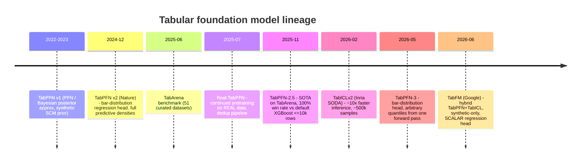
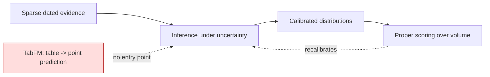

# Research: Google TabFM — real reduction in ML build, or hype?

Ticket: [16-research-tabfm.md](../issues/16-research-tabfm.md)
Date: 2026-08-05
Status: complete

---

## VERDICT: **REJECT** (with one narrow, non-load-bearing exception that is itself dominated by cheaper tools)

**TabFM must not be adopted for any of this project's quantitative needs.** The single
narrow use that survives scrutiny — a zero-effort *baseline forecaster to score against*
in the calibration harness — is a nice-to-have, not a need, and LightGBM or TabPFN-3 do
the same job for roughly 1/40th of the compute cost.

**Strongest argument FOR (and it is a real one):** TabFM is pretrained *entirely on
synthetic datasets generated from structural causal models* — no real-world tabular
corpus at all
([Google Research blog](https://research.google/blog/introducing-tabfm-a-zero-shot-foundation-model-for-tabular-data/),
[model card](https://huggingface.co/google/tabfm-1.0.0-pytorch)).
Of every foundation model this project might touch, it is the one *least* exposed to the
parametric-contamination pillar. It cannot have memorised Enron, Wirecard or Carillion,
because it never saw a real table.

**Strongest argument AGAINST (decisive):** TabFM's regression head is literally
`MLP(d_model, [decoder_hidden], 1)` — a single scalar output
([`pytorch/model.py` L632–643](https://github.com/google-research/tabfm/blob/main/tabfm/src/pytorch/model.py)).
It is **architecturally incapable** of emitting a predictive distribution. Every
quantitative need in this project (PERT triples, lognormal-body/GPD-tail severity, TVaR,
credibility blending) requires a distribution, not a conditional mean. And the shipped
preprocessing pipeline **clips feature values beyond ±4σ** (`OutlierRemover`, threshold
4.0) and **z-scores the regression target** (`StandardScaler`) — i.e. it systematically
destroys exactly the tail the risk engine exists to measure.

A model that cannot represent a tail, applied to a problem that is entirely about tails.

---

## 1. What TabFM actually is

**Released** 30 June 2026 by Google Research (Weihao Kong, Abhimanyu Das et al.).
Repo created 2026-06-16, ~2,350 stars, 33 open issues, last push 2026-07-28.

**Architecture** (from the blog and the released source — there is *no* technical report,
see §1.5):

- **Column embedding** — Set Transformer over columns with Fourier features, capturing
  feature interactions permutation-invariantly.
- **Row compression** — CLS-token row interaction with RoPE, condensing each row to a
  dense vector.
- **ICL predictor** — a 24-block transformer over the compressed row embeddings; context
  rows carry their `y`, query rows do not; a causal-style attention mask separates train
  from test positions.
- **Heads** — classification: `MLP(d_model, [hidden], max_classes)` over one-hot-encoded
  targets, `max_classes = 10`. Regression: `MLP(d_model, [hidden], 1)` over an
  MLP-encoded scalar target.

The blog frames this as synthesising "the strengths of TabPFN and TabICL" — TabPFN-style
row/column attention plus TabICL-style two-stage compression-then-ICL.

**Training data.** "Hundreds of millions of synthetic datasets" generated from structural
causal models with random functions. Google's stated rationale is that "high-quality,
diverse tabular datasets… are critically scarce in the open-source space" — i.e. real
tabular pretraining data at foundation-model scale is unobtainable for privacy and
proprietary-schema reasons. **No real-world data is used at any stage** (no continued
pretraining, unlike Real-TabPFN — see §2).

**What "zero-shot" concretely means.** It does *not* mean "no data needed". It means: no
gradient updates on your dataset. You pass your labelled rows as **context** in the
prompt; the model does a forward pass; predictions for query rows come out. `fit()` in
the sklearn wrapper only fits encoders and scalers — the docstring is explicit: *"The
model itself is not trained on the data; it uses in-context learning at inference time."*
So it still needs labelled examples. It removes hyperparameter search and training, not
supervision.

**Documented limits** (model card + source + README FAQ):

| Limit | Value | Source |
|---|---|---|
| Max output classes | **10** (hard — `max_classes=10` in the model constructor) | model card, `model.py` |
| Max features | 500 (`max_num_features` default, subsamples beyond) | `classifier_and_regressor.py` L1102 |
| Context rows | bounded by memory; `max_num_rows` default is `None` in source | L1103 |
| Ensemble members | `n_estimators=32` **by default** in `TabFMClassifier` | L2256 |
| Compute dtype | **bfloat16** by default | `tabfm_v1_0_0.py` L114 |
| Hardware | datacenter GPU in practice; ~20-min first-run compile | independent benchmark, §3 |

**Doc/source inconsistency worth flagging:** the README FAQ states the defaults are
"500 features and 100 context rows". The source has `max_num_rows: Optional[int] = None`.
For a v1.0.0 release destined for an attestation chain, a README that contradicts its own
source on a load-bearing default is a maturity signal, not a nitpick.

**Availability and licensing — a hard blocker today.**

- Source: **Apache-2.0**.
- **Pretrained weights: `tabfm-non-commercial-v1.0` — "restricted to non-commercial,
  non-production use. Commercial or production use of the default pretrained weights is
  not permitted."** (README, verbatim.)
- The repo also carries *"This is not an officially supported Google product."*
- A BigQuery `AI.PREDICT` route is **in preview**; commercial use would run under Google
  Cloud terms rather than the weight licence. *(Inference: that changes the licence
  problem into a data-residency and vendor-lock problem — you would be shipping the
  twin's evidence corpus into BigQuery to get a prediction. Not obviously better for this
  project.)*

### 1.5 There is no paper

As of 2026-08-05 there is **no technical report, no arXiv preprint, no model-card
methods section** describing the architecture, the synthetic prior, the training
pipeline, the evaluation protocol, or any contamination controls. The README says so
explicitly: *"A technical report is not included in this repository at this time."*

This matters more here than it would elsewhere. This project grades claims by the
evidence behind them. Every factual assertion about TabFM's training data — including the
"entirely synthetic, therefore uncontaminated" claim that is its single best feature —
currently rests on **a corporate blog post and an auto-generated model card**. That is
not evidence you can put on the ladder above grade 4.

---

## 2. Lineage: what is genuinely new

**What TabFM adds:** an engineering synthesis (TabPFN-style row/column attention +
TabICL-style compression + a large ICL stack), trained at Google scale on a much larger
synthetic corpus, released with a working sklearn-compatible library on two backends.
That is a real contribution. It is not a conceptual one — prior-data-fitted networks with
synthetic SCM priors are the 2022 TabPFN idea, scaled.

**What TabFM removes relative to its own lineage — and this is the finding that decides
this assessment:** TabPFN v2 and TabPFN-3 both carry a **bar-distribution regression
head**: the posterior predictive is represented as probabilities over a fixed grid of
target bins, from which arbitrary quantiles are decoded by inverting the predicted CDF,
in one forward pass, with no retraining per quantile
([TabPFN-3 technical report](https://arxiv.org/abs/2605.13986),
[Prior Labs regression docs](https://docs.priorlabs.ai/capabilities/regression) —
`predict(X, output_type="full")` returns `mean`, `median`, `mode`, `quantiles`, `logits`).
**TabFM replaced that with a scalar MLP.** For raw RMSE that is a defensible trade. For
this project it is a regression, in both senses.

**vs gradient-boosted trees.** GBDTs remain the honest baseline. The evidence is mixed
and the direction of travel favours TFMs on small-to-medium data:

- TabPFN-2.5 reports 100% win rate vs default XGBoost on classification ≤10k rows /
  500 features, 87% up to 100k rows
  ([arXiv 2511.08667](https://arxiv.org/abs/2511.08667)).
- But the [Mindful Modeler survey](https://mindfulmodeler.substack.com/p/the-state-of-tabular-foundation-models)
  flags a live conflict of interest: **TabArena's authors overlap with the lab that
  publishes TabPFN.** Their words: *"it's just generally better when such an evaluation
  is done by an independent party."*
- On large numeric datasets, XGBoost still wins — TFM advantage is concentrated in the
  small/medium regime.

**Is TabFM's benchmark improvement real?** Partially, and it is *not* settled:

- Google's claim is superior Elo on TabArena's 38 classification + 13 regression datasets
  (700–150,000 samples).
- **The repo's own `results/` directory contains only TabFM's own rows.** I downloaded and
  inspected all four parquet files: columns are `dataset, fold, method, metric_error,
  metric, problem_type`, and `method` takes exactly one value — `TabFM`. **No baseline
  numbers are shipped.** You cannot reproduce the comparison from the release.
- Metrics shipped: `roc_auc` and `log_loss` for classification (log-loss is at least a
  proper score); **`rmse` and nothing else for regression.** Google's own published
  evaluation contains **zero** distributional or calibration metrics for regression.
- One semi-independent benchmark ([AIMultiple, 19 datasets, 5-fold CV, identical
  splits](https://aimultiple.com/tabular-models)) puts TabFM first on Elo (1,218; 15
  outright wins) — but with three caveats it states itself: TabFM's lead over TabICLv2
  and TabPFN-3 **"stays under the critical difference"** (not statistically settled);
  **no hyperparameter tuning was performed**, which structurally favours zero-tuning
  models over GBDTs whose whole value proposition is tuning; and TabFM consumed
  **~$27 of GPU compute versus TabPFN-3's $0.65** — a ~40× cost gap for a
  statistically-indistinguishable win. *(Flag: AIMultiple is a commercial
  content/vendor-comparison site, not peer-reviewed. Treat as directional.)*

**Does it hold on small/messy/heavy-tailed data?** Unknown for TabFM specifically — no
one has published that. For the TFM class the answer is worse than the headline: see §4.

---

## 3. Per-need assessment

| # | Need | TabFM |
|---|---|---|
| 1 | Evolution positions (genesis→commodity) | **Neutral / unhelpful** |
| 2 | Elasticity for causal edges (PERT triples) | **Actively wrong** |
| 3 | FAIR risk quantification, heavy tails, TVaR | **Actively wrong** |
| 4 | Bühlmann–Straub credibility | **Actively wrong (and unnecessary)** |
| 5 | Calibration + proper scoring | **Neutral** — it is a *thing you score*, not the scorer |
| 6 | Weak-signal / anomaly detection | **Marginally helpful, dominated** |

### Need 1 — Inferring evolution positions — NEUTRAL/UNHELPFUL

Format-wise it fits: four ordinal stages sits comfortably inside the 10-class cap, and
`predict_proba` over stages is a categorical distribution — *not* arithmetic on ordinals,
so it does not directly violate that rejection.

But it does not touch the actual bottleneck. Ticket 11 settled that position is
**inferred from accumulated dated evidence, then correctable, with the twin pushing
back**, and explicitly guards that the axis is *"an interpretive judgement about ubiquity
and certainty, not a measurable quantity"* which *"must not be presented with false
precision"*. TabFM needs a **labelled training table** — components with known, agreed
evolution coordinates. That corpus does not exist; constructing it *is* the problem.
Supplying a model that maps features→stage does not help when the scarce resource is
credible labels and the construct is contested by design.

Two active harms if used anyway:

- **Default `softmax_temperature = 0.9`** — the source docstring is explicit: *"values < 1
  produce a sharper distribution"*. The shipped default deliberately makes probabilities
  **more confident than the raw logits**. Precisely the false precision ticket 11 forbids.
- Everything it produces lands at **grade 5 (model assertion)** and stays there (§4.2).

### Need 2 — Elasticity estimation for causal edges — ACTIVELY WRONG

Two independent disqualifications.

**(a) It cannot express the output type.** A PERT triple needs min/mode/max. TabFM's
regressor returns `np.ndarray` of shape `(n_samples,)` — one number. You could bodge a
spread from the 32 ensemble members, but those members differ by *preprocessing*
(feature subsampling, SVD/cross features, normaliser choice, column shuffling — see
`EnsembleGenerator`), not by posterior sampling. Their spread measures preprocessing
sensitivity. Presenting it as predictive uncertainty would be a category error, and
exactly the kind of thing that gets a CRQ tool rejected.

**(b) It is associational, not causal.** It estimates `E[Y | X, context]`. The project
needs `dY/d do(X)` with a lag structure. Ticket 08 settled that causal claims carry
evidence grades and that **grade 5 is "where contamination hides"**. Feeding a black-box
conditional-mean estimate into an elasticity slot would smuggle a correlational number
into a causal edge, which is the specific failure mode the evidence ladder was built to
stop. It also has no notion of lag — you would have to hand-engineer lagged features,
which is exactly the feature engineering TabFM claims to abolish.

### Need 3 — FAIR risk quantification, heavy-tailed severity, TVaR — ACTIVELY WRONG

The most decisive rejection. Four compounding failures:

1. **No distribution.** TVaR is `E[loss | loss > VaR_α]` — an integral over the tail
   beyond a quantile. A conditional-mean predictor has no tail to integrate. There is
   nothing to compute TVaR *from*.
2. **The target is z-scored.** `TabFMRegressor.fit` applies `StandardScaler` to `y`. For
   a lognormal-body/Pareto-tail severity, the sample mean and SD are unstable estimators
   (for tail index ξ ≥ 0.5 the variance is infinite); z-scoring is a linear transform
   that neither symmetrises nor stabilises it, and the model's synthetic prior was not
   trained on anything shaped like that.
3. **Features are tail-clipped.** `OutlierRemover(threshold=4.0)` computes ±4σ bounds,
   marks exceedances as NaN, **recomputes the statistics without them**, and clips with a
   log-compression. On a heavy-tailed column this is a two-stage tail amputation: the
   first-pass σ is inflated by the tail, the second pass removes it, and the resulting
   bounds sit inside the real support. The genuinely extreme rows — the only ones that
   carry information about ξ — are compressed toward the body. For a project whose GPD
   tail fit *is* the deliverable, this is the single worst preprocessing choice available.
4. **Wrong data shape anyway.** Cyentia IRIS and Verizon DBIR are published as fitted
   parametric distributions and aggregate summaries, not row-level tables with features.
   There is no context table to hand TabFM.

Anchoring a heavy-tailed severity model on TabFM would reintroduce the black-box CRQ tool
the project already rejected — with less transparency than the tools that were rejected,
since at least those documented their distributions.

### Need 4 — Bühlmann–Straub credibility — ACTIVELY WRONG, AND UNNECESSARY

Bühlmann–Straub is a closed-form linear shrinkage estimator: `Z = n / (n + k)`, blend
`Z·own + (1-Z)·prior`. It is roughly twenty lines of numpy. Ladder rung 3 comfortably
beats rung 7 here; there is no ML development to remove.

Worse, TabFM would *invert* the property that makes credibility theory trustworthy.
Bühlmann–Straub's virtue is that **Z is reportable and auditable** — you can state
exactly how much weight your sparse own-data received and defend it. TabFM's ICL does
perform something shrinkage-like (blending your context rows against its synthetic
prior), but the prior is **unspecified, uninspectable, and uncontrollable**, and no
equivalent of Z can be extracted. You would replace an auditable, defensible number with
an unauditable one, at grade 5, to avoid writing twenty lines. That trade is not
available to this project.

Independent evidence points the same way:
[On the Uncertainty Quantification Ability of Tabular Foundation Models](https://arxiv.org/abs/2606.01427)
finds that **Gaussian processes often provide superior predictive accuracy *and* UQ in
data-scarce settings**, with GP performance improving substantially when the kernel
encodes a good prior. That is the same lesson: in tiny-n, an *explicit, chosen* prior
beats an implicit learned one — which is precisely the credibility-theory argument.

### Need 5 — Calibration + proper scoring — NEUTRAL

A category confusion is worth heading off: TabFM would be **a forecaster you score**, not
the scoring machinery. Brier/log scores and reliability diagrams are
`sklearn.metrics.brier_score_loss` and `sklearn.calibration.calibration_curve`. TabFM
removes no work here.

It does ship real calibration machinery for classification — the ensemble preset enables
**Platt scaling (binary) / vector scaling (multiclass)** with L2 regularisation
(`calibration_lambda=1e-2`), fitted on out-of-fold predictions (`predict_oof_proba`).
That is a genuinely respectable design, and better than most.

But the independent evidence says it does not land:
[High Performance, Low Reliability: Uncertainty Benchmarking for Tabular Foundation
Models](https://arxiv.org/html/2605.28554) benchmarked TabPFN, TabICL, PFN-v2 and Mitra
against XGBoost/LightGBM/CatBoost and found **TFMs win on AUC and lose on conditional
coverage**:

| Model | AUC | Size-Stratified Coverage Score |
|---|---|---|
| TabICL | 0.890 ± 0.019 | 0.494 ± 0.076 |
| XGBoost | 0.862 ± 0.023 | **0.540 ± 0.070** |
| TFMs (high-noise synthetic) | — | 0.614 ± 0.081 |
| GBDTs (high-noise synthetic) | — | **0.840 ± 0.020** |

Their diagnosis: TFMs produce *"narrow prediction sets that fail to include the true
label"* — **systematic overconfidence**, worsening sharply as noise rises. Their
conclusion: *"achieving well-calibrated uncertainty remains a major open challenge for
their reliable adoption."*

For a project that describes itself as a weather forecast, adopting a class of model
whose documented failure mode is confident-and-wrong under noise is adopting the one
property you most need to avoid. Note TabFM was not in that benchmark — *inference:* it
shares the architecture family and ships a **sharpening** default temperature, so there
is no basis to assume it is the exception, and Google published no calibration metrics
that would let anyone check.

There is also a structural blind spot the project should note independently of TabFM:
[Distributional Regression with Tabular Foundation Models](https://arxiv.org/html/2603.08206)
observes that **TabArena and TALENT evaluate distributional models using only
point-estimate metrics (RMSE, R²)**, which *"ignores aleatoric uncertainty"*. That is
exactly what TabFM's shipped regression results do. The benchmark TabFM tops does not
measure the property this project cares about.

### Need 6 — Weak-signal / anomaly detection — MARGINALLY HELPFUL, DOMINATED

The best fit of the six, and still not worth it.

For it: ticket 12's substrate has **planted ground truth**, so labels exist by
construction; detection framed as supervised binary classification is genuinely TabFM's
home turf; `predict_proba` output is directly scoreable; no training or tuning to build.

Against it:

- **Not an anomaly detector.** No one-class, density, or reconstruction mode. You must
  frame detection as supervised classification on planted labels — which trains on the
  answer key and measures label-recovery, not detection. Ticket 12 already names this
  trap (*"a planted signal that is trivially findable proves nothing"*).
- **Cost.** ~$27/run GPU, ~20-minute first-run compile, datacenter GPU. LightGBM does the
  same baseline for pennies on a laptop.
- **Suspicious prior alignment.** The substrate is LLM/simulation-generated; TabFM's prior
  is SCM-generated. Strong performance may reflect prior-substrate affinity rather than
  detection ability — and it would not transfer to a real corpus. That would produce a
  *flattering, uninformative* number, which is worse than none.
- **Interpretability tax.** TFMs invert the ML cost structure: training ~free, inference
  expensive. Permutation feature importance needs `1 + repetitions × features` predictions
  — [~104 seconds for a 1,000-row dataset on an M1](https://mindfulmodeler.substack.com/p/tabular-foundation-models-break-the).
  For a detector you must be able to explain per-signal, that scales badly.

**The surviving narrow use:** TabFM as a **null baseline in the scoring harness** — "does
the twin's causal machinery beat a dumb tabular ICL model given the same features?" That
is honest (a baseline never prices a forecast, so grade-5 gating is satisfied trivially),
cheap to wire (sklearn API), and falsifiable. But TabPFN-3 or LightGBM answer the same
question for ~1/40th the cost, and TabPFN-3 additionally gives full predictive
distributions. **The narrow exception is dominated by its own alternatives.**

---

## 4. The acid tests

### 4.1 Uncertainty quantification — **FAIL (regression), PARTIAL-FAIL (classification)**

| | TabFM | TabPFN-3 | What the project needs |
|---|---|---|---|
| Regression output | scalar point estimate | full predictive density, arbitrary quantiles | full density + tail |
| Classification output | `predict_proba` + optional Platt/vector scaling | `predict_proba` | calibrated probabilities |
| Published calibration metrics | none (`rmse`, `roc_auc`, `log_loss` only) | reported | reliability over volume |
| Default behaviour | temperature 0.9 = **sharpening** | — | honest, not sharp |

Regression is an architectural fail, not an API gap — the head emits one number. This is
not patchable by wrapping.

Classification is patchable in principle: conformal prediction over a held-out
calibration split gives distribution-free marginal coverage regardless of the underlying
model. But the same UQ benchmark shows conformal-wrapped TFMs still fail *conditional*
coverage (SSCS 0.494 vs 0.540 for XGBoost) — marginal coverage holds while the errors
concentrate exactly where you would want them not to. And a conformal wrapper is
additional machinery the project would build and maintain, which erases the "removes ML
development" premise entirely.

### 4.2 Explainability / evidence grading — **FAIL (no change to grade, and harder to explain than a GBDT)**

Does TabFM change the grade-5 landing? **No.** A tabular prediction from frozen weights
conditioned on context rows is a model assertion by construction. It may inform and rank;
it may not price a scored forecast. Nothing about TabFM's architecture creates a
mechanism, a document, or an observed co-movement — the things that earn grades 1–2.

It is in fact *worse* than the GBDT baseline on explainability:

- No native feature importances, no split structure, no coefficients.
- Model-agnostic methods (PFI, SHAP) still work — they only need a predict function — but
  under the inverted cost structure above.
- Purpose-built TFM explainers exist ([ShapPFN](https://arxiv.org/html/2603.29946),
  [ExplainerPFN](https://arxiv.org/abs/2601.23068), both 2026) but neither targets TabFM,
  and adopting a research-grade explainer to interpret a research-grade predictor is
  compounding, not reducing, the ML build.
- **No technical report** means you cannot even document what produced the number. For an
  attestation chain, "a Google blog post says it was trained on synthetic SCMs" is the
  ceiling of what you can attest.

### 4.3 Parametric contamination — **PASS, with three material caveats**

This is where the skeptical prior should update *toward* TabFM, so it is worth stating
plainly. TabFM is pretrained **only** on procedurally generated synthetic datasets from
structural causal models. It has never seen Enron's financials, Carillion's accounts, or
any real table. The failure mode the pillar names — *a model trained on public data
"predicting" a famous public event indistinguishably from memorisation* — is **largely
inapplicable to TabFM's weights.** Corroborated independently: the deduplication and
contamination-control literature treats synthetic pretraining as the clean case, which is
precisely why Real-TabPFN needed a *"multi-tiered deduplication and filtering pipeline"*
when it added real data ([Real-TabPFN](https://arxiv.org/html/2507.03971v1),
[TabPFN-2.5](https://arxiv.org/abs/2511.08667)) and TabPFN's synthetic line did not.

Caveats, in descending order of seriousness:

1. **Unverifiable.** No technical report, no data statement, no released generator. The
   contamination claim is grade-4 evidence at best. A project that discounts scores by
   measured memorisation leakage cannot accept "trust the blog" for its own tooling.
2. **Benchmark-directed prior engineering is a soft leakage channel.** The synthetic prior
   is a *design choice*, and its design determines model quality
   ([Shaping the Prior](https://arxiv.org/pdf/2605.18971)). TabFM was developed and
   selected against TabArena. Iterating a synthetic prior until it tops a public benchmark
   suite transfers information from those datasets into the weights without any dataset
   ever being seen — untestable from outside, and not measured by anyone.
3. **It does not solve *this project's* contamination problem.** The project's exposure
   lives in (a) the context rows you supply, which for a Carillion backtest *are* the
   public record, and (b) the LLM that generated the synthetic substrate, which absolutely
   has memorised these events. TabFM neither adds to nor removes either. Ticket 12's
   Enron-vs-NMC contamination control and wave-2's leakage-discount dial remain exactly as
   necessary.

Net: **not a reason to reject, and not a reason to adopt.** It removes one objection that
was never the binding one.

### 4.4 Determinism / reproducibility — **PARTIAL, with unguaranteed risk you would own**

In favour:

- `_DEFAULT_RANDOM_STATE = 42`, threaded consistently, with a deliberate design note that
  column-type detection is seeded *independently* so the feature schema stays stable across
  ensemble seeds. That is careful engineering.
- HF weights loadable at a pinned `revision` — model version is pinnable.
- Activation chunking is documented as *"exact (identical outputs)"*.

Against:

- **Default compute dtype is bfloat16.** Reduced-precision accumulation on GPU/TPU is
  where non-deterministic reduction order bites. The loader offers `dtype=None` for fp32
  (*"provided for float32 debugging… may be removed in a future release"* — so the
  determinism-friendlier path is explicitly unsupported and may be withdrawn).
- **Two backends (JAX, PyTorch) will not agree bitwise.** Your attestation must pin
  backend, device, driver, dtype, revision and seed — a six-dimensional pin against a
  dependency with `torch==2.12.1` / `jax==0.10.1` hard-pinned by the project itself.
- **No published reproducibility guarantee anywhere.** Combined with *"not an officially
  supported Google product"*, 33 open issues, one month of existence, and a README that
  disagrees with its own source on defaults — you would be pinning against a moving,
  unsupported target and owning the entire reproducibility risk yourself.

Achievable with effort. But "we hash the outputs and hope the driver doesn't change" is a
weak link in a chain whose whole point is attestation.

---

## 5. What it would actually replace

Direct answer to the ticket's central question: **nothing this project must build.**

| Project need | Real implementation | ML development TabFM removes |
|---|---|---|
| Elasticity priors | expert elicitation → PERT triples | none — elicitation isn't prediction |
| Propagation | Monte Carlo, numpy | none |
| Severity tail | `scipy.stats.genpareto` fit | none — it destroys the tail |
| Credibility blend | ~20 lines of numpy | none |
| Calibration/scoring | `sklearn.calibration`, `brier_score_loss` | none — TabFM is a scoree |
| Weak-signal detection | LightGBM / IsolationForest baseline | a little, at ~40× cost |

**The real answer is the one the ticket suspected: this project's problems are inference
and calibration problems, not tabular-prediction problems.**

The distinction is sharp. A tabular-prediction problem has (i) a labelled table of
adequate size, (ii) a well-defined target, (iii) an accuracy metric that means something,
and (iv) enough rows that the estimator's variance is not the dominant term. This project
systematically has none of those. It has sparse dated evidence, contested constructs,
heavy-tailed targets where the mean is the least interesting statistic, and n small enough
that the *prior* does most of the work. Those are the conditions under which explicit
priors, credibility weighting, elicitation, and calibration-over-volume beat any
supervised learner — and under which the UQ literature above finds GPs beating TFMs
outright.

TabFM sells the removal of hyperparameter tuning and feature engineering for supervised
tabular prediction. That is a genuine cost, genuinely removed — for teams who have that
problem. This project barely has it, and where it does (need 6), the cost being removed is
an afternoon with LightGBM.

---

## 6. Recommendation

**Reject.** Do not place TabFM anywhere in the analytical path.

If someone still wants an empirical check rather than an argument, the one defensible,
time-boxed experiment is:

> Run TabFM as an **unpriced null baseline** in the calibration harness on need 6 only:
> planted-signal detection over the synthetic substrate, scored by Brier/log score against
> the twin's own machinery. Grade-5 by construction, therefore use-gated by construction,
> therefore safe. Budget: one day. **Run LightGBM and TabPFN-3 as co-baselines in the same
> harness** — if either matches TabFM (likely: the independent benchmark puts the gap under
> the critical difference at 40× the cost), TabFM is closed permanently with evidence
> rather than argument, which is a better artefact than this document.

Revisit only if **all** of these change:

- [ ] A technical report is published (training data, prior design, contamination controls, calibration metrics).
- [ ] A distributional regression head ships (quantiles/CDF, as TabPFN-3 already has).
- [ ] The weights licence permits production use, or the BigQuery route exits preview on acceptable data-handling terms.
- [ ] Independent calibration benchmarking places TabFM on the right side of the performance/reliability trade-off in §4.1.

Until then the honest framing is: **TabFM is a real advance in tabular prediction, and
tabular prediction is not this project's problem.**

---

## Sources

**Primary (Google)**
- [Introducing TabFM (Google Research blog, 30 June 2026)](https://research.google/blog/introducing-tabfm-a-zero-shot-foundation-model-for-tabular-data/)
- [google/tabfm-1.0.0-pytorch model card](https://huggingface.co/google/tabfm-1.0.0-pytorch)
- [google-research/tabfm (GitHub)](https://github.com/google-research/tabfm) — README, `tabfm/src/classifier_and_regressor.py`, `tabfm/src/pytorch/model.py`, `tabfm/src/pytorch/tabfm_v1_0_0.py`, `results/*.parquet` (all inspected directly, 2026-08-05)

**Lineage**
- [TabPFN v2 — Accurate predictions on small data with a tabular foundation model (Nature)](https://www.nature.com/articles/s41586-024-08328-6)
- [TabPFN-2.5 (arXiv 2511.08667)](https://arxiv.org/abs/2511.08667)
- [TabPFN-3 Technical Report (arXiv 2605.13986)](https://arxiv.org/abs/2605.13986)
- [Prior Labs — Regression capabilities docs](https://docs.priorlabs.ai/capabilities/regression)
- [Real-TabPFN (arXiv 2507.03971)](https://arxiv.org/html/2507.03971v1)
- [TabICLv2 (arXiv 2602.11139)](https://arxiv.org/html/2602.11139v1)
- [TabArena: A Living Benchmark (arXiv 2506.16791)](https://arxiv.org/pdf/2506.16791)
- [Shaping the Prior: How Synthetic Task Distributions Determine TFM Quality (arXiv 2605.18971)](https://arxiv.org/pdf/2605.18971)

**Critical / independent**
- [High Performance, Low Reliability: Uncertainty Benchmarking for TFMs (arXiv 2605.28554)](https://arxiv.org/html/2605.28554)
- [On the Uncertainty Quantification Ability of TFMs (arXiv 2606.01427)](https://arxiv.org/abs/2606.01427)
- [Distributional Regression with TFMs: Proper Scoring Rules (arXiv 2603.08206)](https://arxiv.org/html/2603.08206)
- [The state of Tabular Foundation Models 2026 — Mindful Modeler](https://mindfulmodeler.substack.com/p/the-state-of-tabular-foundation-models)
- [The interpretability tax on TFMs — Mindful Modeler](https://mindfulmodeler.substack.com/p/tabular-foundation-models-break-the)
- [Tabular Models Benchmark, 19 datasets — AIMultiple](https://aimultiple.com/tabular-models) *(commercial content site; directional only)*
- [ShapPFN — Real-Time Explanations for TFMs (arXiv 2603.29946)](https://arxiv.org/html/2603.29946)
- [ExplainerPFN (arXiv 2601.23068)](https://arxiv.org/abs/2601.23068)
