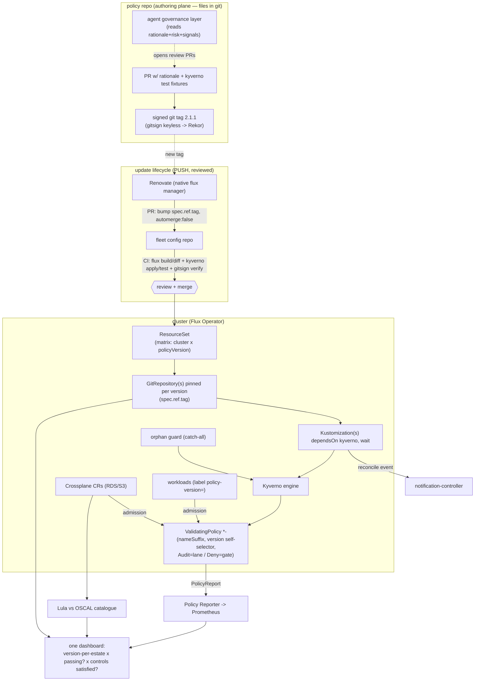

# PRD — Policy as Versioned Code, on Flux

| | |
|---|---|
| **Status** | Draft for review |
| **Author** | Chris Nesbitt-Smith (CNS) with Claude |
| **Posture** | Faithful-to-intent build. A separate [north-star report](north-star-modern-reference.md) documents the fuller modern reference. |
| **Decisions** | [ADR-0001](adr/0001-transport-signed-git-tags-gitsign.md)…[ADR-0008](adr/0008-measurable-layered-ground-truth.md); ubiquitous language in [CONTEXT.md](../CONTEXT.md) |
| **Research** | `research/01`–`03` (original work + thesis), `research/10`–`17` (Flux), `research/20`–`22` (synthesis) |

> **One-line summary.** Re-implement CNS's *Policy as [Versioned] Code* thesis on Flux CD —
> distributing organisational policy as a semantically-versioned, signed dependency, governed by a
> single [Kyverno](https://kyverno.io) engine across both a Kubernetes workload plane and a [Crossplane](https://crossplane.io) cloud plane, with
> reviewed (PR-gated) upgrades, multi-version runtime coexistence, ground-truth compliance, and an
> agent-assisted human-governance layer — proven reproducibly on [KiND](https://kind.sigs.k8s.io).

---

## 1. Background & thesis

Policy in most organisations is emotionally-led, slow to change, hard to communicate, and harder to
measure; it accretes case-by-case exemptions like case law. *Policy as code* tools (Kyverno, OPA,
Checkov, …) help, but most deployments make policy an **opaque deploy-time gate** that engineers
reverse-engineer by hitting "computer says no". The thesis: **treat policy as a versioned software
dependency** — visible, communicable, consumable, testable, usable, updatable, measurable — and let
the risk mitigations move as fast as the risk, **just as features already move as fast as the
opportunity**. Modern delivery lets the product manager chase opportunity risk at deploy cadence —
features ship continuously. Defensive risk should travel at the same speed; today policy is the one
passenger left behind, still moving at memo-and-noticeboard pace while everything around it ships.

The **refined thesis** (the "mea culpa"), which this PRD honours over the original talk:

- **Lane-keeping vs. gate** (after [Gregor Hohpe](https://platformengineering.org/talks-library/the-magic-of-platforms)). Most of the policy surface enterprises struggle
  with — labelling, tagging, configuration standards, operational metadata — should be
  *lane-keeping*: a versioned dependency, adopted gradually, nudging not blocking. A *catastrophic
  minority* — access control, data classification, cryptographic key management; anything governing
  *whether a workload may exist at all* — belongs at the **gate**: "a locked door." **Build both.**
  A gate-only system is the exact mistake the mea-culpa walked back.
- **Carry the "why".** Each policy carries its risk/rationale so disagreement is resolved by a
  **pull request to the policy**, not an out-of-band exemption. "Purposeless policy is potentially
  practically pointless policy."
- **The human-governance layer.** Versioning distributes policy to engineers but does not *govern*
  it. After [GDS Way](https://gds-way.digital.cabinet-office.gov.uk/): every policy is **dated, regularly reviewed, and removed if no longer
  defensible** ("Not archived. Not deprecated. Removed.").
- **The last mile.** Versioning reaches technical consumers but not non-technical ones (the talk's
  "Cleaner"). An explicit, partly-cultural problem — to be *attempted*, not over-claimed.

Lineage credit, per the mea-culpa: the idea traces to **[Michael Brunton-Spall's](https://www.youtube.com/watch?v=txEWO4uyVnY)** 2016 [GOTO
Amsterdam talk](https://www.youtube.com/watch?v=txEWO4uyVnY); this work cites it.

### 1.1 What the 2022 implementation proved, and where it fell short

The reference orgs ([`example-policy-org`](https://github.com/example-policy-org), [`policy-as-versioned-code`](https://github.com/policy-as-versioned-code)) demonstrated: semver policy
in git tags; one string serving as both [Renovate](https://docs.renovatebot.com/modules/manager/flux/) pin and Kyverno selector; multi-version
coexistence on one cluster (`nameSuffix` + version-label self-selector); Renovate auto-PRs; a
`policy-checker` for local/CI shift-left; KiND e2e. Shortfalls this PRD closes or honestly carries:
the bespoke bash/Docker checker and its bugs (hardcoded URL, no caching, `hcl2json` mismatch,
Checkov drift), signing the *checker image* rather than the policy, the cloud/Terraform side being
shift-left-only (admitted on stage), the orphaned-version-label silent gap, compliance measured as
*PR-acceptance* rather than ground truth, and the absence of any governance or last-mile story.

---

## 2. Goals / non-goals

**Goals**

1. Distribute policy as a **semver, signed, versioned dependency** consumed by [Flux](https://fluxcd.io/).
2. Support **multiple policy versions concurrently** in one runtime, with reviewed retirement.
3. Govern **both planes** — Kubernetes workloads and cloud resources — with **one** versioned engine.
4. Make every of the **seven "-ables"** demonstrably true (§4).
5. Deliver the refined thesis: **lane-keeping + gate**, **carry the why**, **human governance**,
   **attempt the last mile**.
6. Be **reproducible for free** (KiND) and **faithful to intent** (no bespoke tooling, deterministic
   policy, vanilla-Flux-expressible).

**Non-goals (this build; see north-star report)**

- OCI artifact transport, [cosign](https://github.com/sigstore/cosign) attestations, SBOM, enforced "why".
- Flux-native keyless-git verification (blocked on upstream [#1068](https://github.com/fluxcd/source-controller/issues/1068)).
- A UK CAF/GovAssure [OSCAL](https://pages.nist.gov/OSCAL) catalogue (NIST 800-53r5 is the worked example).
- Real-cloud fleet e2e at scale; a production-grade risk-intelligence agent.
- Engine-agnosticism (Gatekeeper/Kubewarden); Kyverno-only here.

---

## 3. Principles (binding constraints)

| Principle | Source |
|---|---|
| **Faithful to intent** — reproduce the thesis 1:1; let Flux do natively what 2022 hacked | CONTEXT, Q1 |
| **Deterministic policy** — no time-conditional logic in policy bodies | ADR-0006 |
| **Reviewed upgrades** — pinned everywhere; new versions only via a reviewed Renovate PR | ADR-0002 |
| **Two axes are independent** — adoption cadence (pin/range) ≠ enforcement action (Audit/Deny) | ADR-0002/0003 |
| **One engine, both planes** — same versioned Kyverno governs workloads and cloud | ADR-0004 |
| **Thesis stays vanilla-Flux-expressible** — the Operator is install/fleet sugar, not the mechanism | ADR-0005 |
| **No bespoke tooling** — native CLIs for shift-left; the bash checker is deleted, not ported | CONTEXT |
| **Carry, don't (yet) enforce, the why**; the engine never consumes advisory metadata | ADR-0007 |
| **Proportionality** — lane-keeping for the ~80%, a hard gate only for catastrophic boundaries | thesis |

---

## 4. The seven "-ables" as acceptance criteria

The build is accepted only when each is demonstrably true:

| "-able" | Mechanism | Demonstrable evidence |
|---|---|---|
| **visible** | Policy in a public git repo; every cluster's `GitRepository` makes "what/which version/where" queryable | `flux get sources git`, `gotk_resource_info{revision}` |
| **communicable** | Semver tags + release notes + advisory rationale; notification-controller broadcasts version changes | Alert fires on new tag; release notes render |
| **consumable** | A consumer adds one label (workload) / the cluster adds one [`ResourceSet`](https://fluxoperator.dev/docs/crd/resourceset/) input | A new app onboards by setting one `policy-version` label |
| **testable** | `kyverno test` fixtures (pass/fail) double as worked examples | CI runs fixtures; fixtures readable as docs |
| **usable** | `flux build … --dry-run \| kyverno apply` locally and in CI; in-cluster SSA dry-run | A dev reproduces the cluster verdict on their laptop |
| **updatable** | Renovate native `flux` manager PRs the pin bump (`automerge:false`) | A new tag → a reviewable PR within one Renovate run |
| **measurable** | Layered ground-truth: Flux revision + Kyverno [PolicyReports](https://kyverno.io/docs/policy-reports/) + OSCAL/[Lula](https://github.com/defenseunicorns/lula); PR-state = adoption velocity | One dashboard answers the four CIO questions (§9) |

---

## 5. Architecture overview

Two planes, one engine, one versioned-dependency mechanism.



### 5.1 Repo layout

```
policy-as-versioned-flux/
├── policy/                      # THE versioned policy source (== 2022 `policy` repo)
│   ├── workloads/kyverno/       #   ValidatingPolicy bodies (CEL); nameSuffix + version self-selector
│   │   ├── require-department-label/
│   │   └── require-known-department-label/
│   ├── cloud/                   #   cloud-plane policies (from collie, uplifted) — RDS/S3, NIST-mapped
│   ├── rationale/               #   the "why": rationale.md + advisory metadata per policy
│   ├── tests/                   #   kyverno test fixtures (pass/fail = worked examples)
│   └── .github/workflows/       #   tag -> gitsign-signed release; CI runs fixtures
├── fleet/                       # the config repo Flux reconciles
│   ├── flux-instance.yaml        #   FluxInstance (Operator; distroless/FIPS)
│   ├── resourcesets/             #   ResourceSet over the cluster x policyVersion matrix
│   ├── infrastructure/kyverno/   #   engine HelmRelease + the orphan guard
│   └── clusters/                 #   per-cluster inputs (cluster1 = all versions; cluster2 = >=2.0.0)
├── collie/ (fork)               # uplifted ControlPlane collie: Crossplane + OSCAL + Lula
├── apps/                        # consumers (== app1/2/3) — each carries one policy-version label
├── governance/agent/            # the agent governance demonstrator
├── docs/                        # this PRD, ADRs, north-star report, upstream actions
└── research/                    # the dossiers
```

### 5.2 CRD inventory

`GitRepository` (pinned per version, gitsign-signed source) · `Kustomization` (`dependsOn` engine,
`wait`, `prune`) · `HelmRelease` (Kyverno) · Kyverno [`ValidatingPolicy`](https://kyverno.io/docs/policy-types/validating-policy/) (CEL; Audit/Deny) ·
`FluxInstance` + `ResourceSet` (+ `ResourceSetInputProvider`) · `Provider`/`Alert` (notifications) ·
Crossplane provider CRs + managed resources (cloud plane).

---

## 6. Detailed design

### 6.1 Distribution & versioning — signed git tags (ADR-0001)

Policy is authored and reviewed as files in git, released as **semver git tags**, signed **keyless
with [gitsign](https://github.com/sigstore/gitsign)** ([Sigstore](https://docs.sigstore.dev): ephemeral [Fulcio](https://github.com/sigstore/fulcio) cert via OIDC, logged in [Rekor](https://github.com/sigstore/rekor) — no GPG key custody).
Consumed by a Flux `GitRepository` pinned on `spec.ref.tag`. Semver carries meaning: **major** =
breaking tightening (e.g. free-text → enum), **minor** = backwards-compatible addition, **patch** =
additive widening.

**Known limitation (accepted, ADR-0001):** Flux `GitRepository.spec.verify` is PGP-only and cannot
verify gitsign today, so there is **no Flux-native verified-source gate on the floor**. Verification
runs **in CI / at-merge** (`gitsign verify` against Rekor). Closing this natively is the single
upstream dependency — tracked as a project action against [fluxcd#1068](upstream/fluxcd-source-controller-1068-gitsign.md).

### 6.2 Adoption — pinned everywhere + Renovate PR (ADR-0002)

Consumers and clusters pin **exact** tags. New versions land **only** via a Renovate PR (native
`flux` manager rewriting `spec.ref.tag`, `automerge:false`), reviewed and CI-gated, in **every**
environment. No live `ref.semver` ranges. The PR is the unit of debate that carries the "why".

### 6.3 Engine & policy authoring — Kyverno CEL `ValidatingPolicy` (ADR-0003)

Policies are CEL `ValidatingPolicy`. `validationActions` is the **enforcement-action axis**:
`Audit` = lane-keeping (nudge + PolicyReport), `Deny` = gate ("locked door"). This is independent
of adoption cadence. Background scans + PolicyReports give measurability for free.

### 6.4 Multi-version coexistence (the crux) — `ResourceSet` matrix (ADR-0005)

A single cluster runs N policy versions side by side:

1. **Versioned dependency** = N `GitRepository` objects, distinct names, each `spec.ref.tag` = a tag.
2. **Collision-free objects** = the bundle's kustomize `nameSuffix: "-<v>"` (kept verbatim).
3. **Version self-scoping** = each `ValidatingPolicy` matches only workloads carrying its
   `mycompany.com/policy-version` label (CEL `matchConstraints` objectSelector).
4. **Workload opt-in** = the consumer stamps one version label.
5. **Cluster narrows the set** = a `ResourceSet` over a `cluster × policyVersion` matrix generates
   the source+Kustomization pairs; a single matrix input feeds **both** `spec.ref.tag` and the
   stamped label (one value, two jobs — D1.3).
6. **Ordering** = every policy `Kustomization` `dependsOn` the Kyverno `Kustomization`, `wait: true`.
7. **Orphan guard** = a deterministic catch-all `ValidatingPolicy` flags (Audit→Deny) any workload
   whose `policy-version` label is not in the cluster's installed set (from the matrix). Closes the
   silent-ungovernance gap.

### 6.5 Cloud plane — fork + uplift collie (ADR-0004)

Fork [`controlplaneio/collie`](https://github.com/controlplaneio/collie) (Apache-2.0). It provides Crossplane + Kyverno cloud-as-CR, NIST
800-53r5 Kyverno policies for AWS RDS/S3, an OSCAL catalogue, and Lula validation. We **uplift** it
(ClusterPolicy → ValidatingPolicy; Crossplane bump; Flux-native delivery; clear the two stalled
issues) and **version its policies** as first-class dependencies (gitsign tags, Renovate, coexistence,
Audit/Deny). The same engine that judges workloads judges Crossplane CRs at admission — closing the
runtime-cloud gap the talk admitted. Uplift PRs flow back upstream where sensible.

### 6.6 Compliance / measurable — layered ground-truth (ADR-0008)

One dashboard, four signals: **Flux revision** (which version, where) · **PolicyReports** (is it
passing) · **OSCAL/Lula** (controls satisfied) · **Renovate PR state** (adoption velocity — the
2022 "PR search away", explicitly relabelled). Headline = *demonstrable control satisfaction*.

### 6.7 Governance — deterministic policy + editorial review + agent layer (ADR-0006, ADR-0007)

Policy bodies are deterministic (no time conditions). "Dated/reviewed/removed-if-undefended" is an
**editorial** action (a reviewed PR), supported by the **agent governance layer**:

- **Inputs:** versioned policy + embedded rationale/risk/ethos + external signals (CVEs, cloud/regulatory
  change, [Wardley climatic movement](https://medium.com/wardleymaps/exploring-the-map-ad0266fad59b)).
- **Output:** noise-reduced **business decisions** surfaced as review PRs/issues ("this rationale may
  be stale because X; consequence Y; do you still defend it?").
- **Boundary:** never edits enforcement; prompts the human. Built as a **bounded demonstrator** (one
  signal source) plus a complete architectural spec.
- **Advisory metadata** (`created`/`lastReviewed`/rationale/risk) is read by humans + agents only,
  never by the engine.

### 6.8 Last mile (attempt)

Auto-generate an **always-in-sync, human-readable policy handbook** from the versioned source (the
"operational manual" can never drift from enforced policy), with **agent-authored plain-language
summaries** of each policy + its "why". Full non-technical adoption remains a named, partly-cultural
open problem.

### 6.9 Shift-left dev story (CONTEXT)

Documented native commands; no wrapper, no checker:
`flux build kustomization … --dry-run | kyverno apply` (and `kyverno test`), `flux diff` for PR
preview, `gitsign verify` for provenance. In-cluster, kustomize-controller's SSA dry-run exercises
the admission webhook before apply.

### 6.10 Lifecycle & the half-deploy (D2.3)

Flux is eventually-consistent, not transactional: SSA dry-runs each stage (a Deny aborts the stage
before applying — all-or-nothing *within* a stage), but there is no rollback *across*
Kustomizations. Design for re-reconcile to heal; gate readiness with `wait` + CEL health checks;
surface partial state via health conditions + PolicyReports.

---

## 7. Proof / demo (CONTEXT)

KiND, reproducible, free. Workload plane runs fully; the cloud plane is proven at the **admission
level** (Crossplane CRs judged by Kyverno in KiND; [LocalStack](https://localstack.cloud) for any provisioning) — the policy
mechanism is demonstrated on both planes with no cloud spend. `wait` + CEL `healthCheckExprs`
replace the original's jsonpath polling. Two cluster profiles prove coexistence: `cluster1` (all
versions), `cluster2` (`>=2.0.0`, `1.0.0` retired — exercising the orphan guard). A real-cloud e2e
(live RDS/S3 + Lula) is optional and documented, not required for acceptance.

---

## 8. Delivery phases

**P1 — Workload plane, end-to-end (proves the thesis).**
policy repo with two `ValidatingPolicy` examples (one Audit/lane-keeping, one Deny/gate) + rationale
+ `kyverno test` fixtures → gitsign-signed tags → CI gitsign verify → Renovate flux manager → [Flux
Operator](https://fluxoperator.dev/) + `ResourceSet` multi-version coexistence on KiND (`cluster1`/`cluster2`) → orphan guard →
layered compliance dashboard (Flux revision + PolicyReports). *Acceptance: all seven "-ables"
demonstrable on the workload plane; coexistence + retirement + orphan-guard shown.*

**P2 — Cloud plane (collie fork + OSCAL/Lula).**
Fork + uplift collie; version its cloud policies; same engine governs Crossplane CRs; OSCAL/Lula
feeds the compliance dashboard. *Acceptance: a cloud policy (e.g. S3 encryption gate) versioned and
coexisting; OSCAL control satisfaction shown for both planes on KiND+LocalStack.*

**P3 — Governance + agent + last mile.**
Advisory metadata schema; editorial-review process docs; agent governance demonstrator (one signal
source, opens review PRs); auto-generated policy handbook + agent summaries. *Acceptance: the agent
surfaces a stale-rationale business decision as a PR; the handbook regenerates from a tag.*

---

## 9. The CIO conversation (what "done" looks like)

Four questions, four ground-truth answers: *Which policy version is each part of my estate on?*
(Flux revision) · *Is everything actually passing?* (PolicyReports) · *Do we satisfy the control
framework?* (OSCAL/Lula) · *How fast are teams adopting the latest?* (Renovate PR state).

---

## 10. Risks & open problems

- **gitsign not Flux-verifiable yet** → verify in CI; native gate pending #1068 (tracked).
- **Last-mile residual** → partly cultural; handbook is an attempt, not a claimed solution.
- **US-NIST vs UK** → NIST 800-53r5 is illustrative; UK CAF/GovAssure catalogue is north-star.
- **Half-deploys** → eventual consistency, not transactions; design to re-reconcile + health-gate.
- **Agent over-claiming** → demonstrator is bounded; never edits enforcement.
- **collie staleness** → fork carries an uplift cost (Crossplane bump, CEL migration).
- **Crossplane adoption cost** → cloud-as-CR assumes Crossplane; acknowledged in scope.

---

## 11. Project actions (not build-blocking)

1. Rework + post the gitsign revival comment on **[fluxcd/source-controller#1068](https://github.com/fluxcd/source-controller/issues/1068)**
   (`docs/upstream/fluxcd-source-controller-1068-gitsign.md`).
2. **Fork + uplift `controlplaneio/collie`** (ADR-0004; [announcement](https://control-plane.io/posts/collie-open-source-release/), from [ControlPlane](https://control-plane.io)); offer uplift PRs upstream.

---

## 12. Out of scope → north-star

OCI+cosign transport, signed attestations + enforced "why", SBOM, Flux-native keyless-git gate (post
#1068), UK CAF OSCAL catalogue, real-cloud fleet e2e, production risk-intelligence agent,
engine-agnosticism. See [north-star-modern-reference.md](north-star-modern-reference.md).

---

## References

See [docs/references.md](references.md) for the full citation registry. The most load-bearing
sources behind this PRD:

- [What is Policy As [versioned] Code? (original Medium post)](https://chrisns.medium.com/what-is-policy-as-versioned-code-306e0341290b)
- [Policy as [Versioned] Code: A Mea Culpa (blog)](https://blog.cns.me/posts/policy-versioned-code-mea-culpa-technical-argument-nesbitt-smith-pedef/) — the refined thesis this PRD honours
- [Rugged: Being Secure & Agile — Michael Brunton-Spall, GOTO 2016](https://www.youtube.com/watch?v=txEWO4uyVnY) — credited lineage
- [The Magic of Platforms — Gregor Hohpe](https://platformengineering.org/talks-library/the-magic-of-platforms) — lane-keeping vs gate
- [The GDS Way](https://gds-way.digital.cabinet-office.gov.uk/) — dated/reviewed/removed governance
- [Kyverno ValidatingPolicy (CEL)](https://kyverno.io/docs/policy-types/validating-policy/) and [Policy Reports](https://kyverno.io/docs/policy-reports/) — the engine + measurability
- [Flux Operator: ResourceSet CRD](https://fluxoperator.dev/docs/crd/resourceset/) — the coexistence matrix
- [source-controller #1068](https://github.com/fluxcd/source-controller/issues/1068) — the single upstream dependency (gitsign verifier)
- [sigstore/gitsign](https://github.com/sigstore/gitsign) and [sigstore/cosign](https://github.com/sigstore/cosign) — keyless signing
- [controlplaneio/collie](https://github.com/controlplaneio/collie) and its [announcement](https://control-plane.io/posts/collie-open-source-release/) — the cloud plane
- [OSCAL](https://pages.nist.gov/OSCAL) and [defenseunicorns/lula](https://github.com/defenseunicorns/lula) — compliance ground-truth
