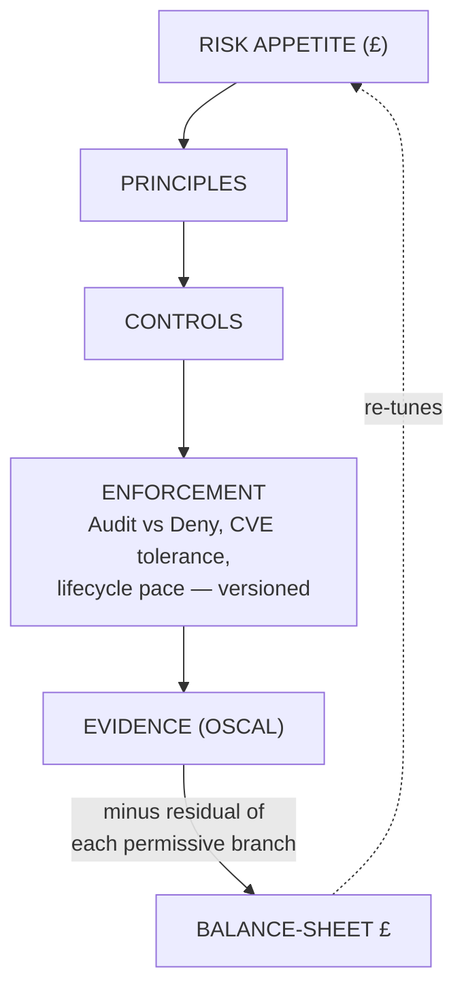

<!--
SPEAKER: this deck is authored AGAINST the built estate. Every slide tagged
[LIVE] runs a real command against the local KinD estate and is backed by a
verify-*.sh that exits 0 (estate/talk/verify-all.sh proves the whole set).
Slides tagged [NARRATED] are real + grounded but gestured, not stood up.
Full run order, reset, and audience-modular foregrounding: estate/talk/RUNBOOK.md.
The numbers on these slides are the real engine output, not illustrations.
-->

# Governance is not a checkbox

## It's a **priced, versioned, continuously re-tuned** judgement

Treat your whole governance chain — risk-appetite → controls → enforcement →
evidence — like a **software dependency**: semantically versioned, signed,
pinned, unit-tested, updated by reviewed PR. And **price every control in £.**

<!--
Cold open. The audience are principal engineers and risk/security leaders.
Promise: by the end, technological risk is a single £ line that MOVES when you'd
expect, every actor (human or AI) is cryptographically attestable, and nothing
here is a slide standing in for a thing that doesn't work.
-->

---

# Beat 1 — What does a breach actually **cost**?  [NARRATED]

Not "are we compliant?" (a binary). The only question the business can act on:
**what is this worth, in £?**

FAIR turns versioned `(min,mode,max)` triples into a loss distribution.
`driftwood`'s "unversioned image ships cart PII" scenario, priced right now:

| measure | £ |
|---|---|
| **ALE** (mean annual loss) | **£19,559** |
| **VaR₉₅** (bad-year) | £30,948 |
| **TVaR** (Solvency-II tail) | £34,087 |
| **£ carried** (TVaR + risk-load, *never* the mean) | **£34,958** |

```sh
python3 estate/platform/fair/fair.py summary \
  estate/platform/fair/scenarios/driftwood-cart-pii.json
```

<!--
Pure, deterministic, seeded Monte Carlo — same input, same £ on stage. The tail
(TVaR) exceeds the percentile exceeds the mean: we carry the tail, not the
average, because a board provisions capital against the bad year. This is the
number the rest of the talk keeps honest and keeps moving.
-->

---

# Beat 2 — Policy is a **versioned dependency**  [LIVE]

Three signed policy versions installed side by side. Each judges **only** the
workloads that claim it — `matchConditions` self-scoping on the version label,
*not* a shared webhook that last-write-wins.

```sh
estate/platform/distribution/verify-coexistence.sh   # two versions admit side-by-side
estate/platform/distribution/verify-orphan-guard.sh  # a version not in the array cannot run
estate/platform/distribution/verify-retirement.sh    # deleting one array element prunes it
```

A version is fanned out from **one version array** (Flux `ResourceSet`); the
orphan-guard's allow-list is rendered from that same array, so it **cannot
drift** from the installed set. Installing or retiring a version is one array
edit — not hand-maintained YAML.

<!--
This is the "lint-pack you already trust" framing. The array IS the supported-
versions contract; shift-left reads it directly, no new discovery endpoint.
Coexistence + orphan-guard + retirement each have a kyverno-test-backed script.
-->

---

# Beat 2b — the compliant path is the path of least resistance  [LIVE]

CI resolves the target's supported window and runs the **target version's real
admission action offline** (±1 version-skew). An Audit→Deny flip is caught
**before merge**, not at deploy.

```sh
estate/platform/shift-left/verify-shift-left.sh
```

And "you may do X **if** conditions C" is ordinary **versioned policy**, not a
personal favour — anyone who meets C gets the same treatment:

```sh
estate/platform/policy/verify-conditional.sh   # run root IF attested AND hardened
estate/platform/policy/verify-exemption.sh     # no ledger entry -> no exception (literal)
```

<!--
The one genuine one-off is a git ledger entry that RENDERS a PolicyException
(Flux prune + cleanup.kyverno.io/ttl backstop). That same ledger entry generates
the OSCAL risk object in Beat 5. Exemptions dissolve into policy.
-->

---

# Beat 3 — **Proportionality**, proven by comparison  [LIVE] ⭐

The money shot. **The same control. The same FAIR scenario. Opposite verdict** —
because the £ differs.

```sh
estate/verify/proportionality/verify-proportionality.sh
```

`encrypt-at-rest`, one shared policy body, evaluated against each institution's
risk-appetite band:

| institution | data | £ risk a Deny buys | verdict |
|---|---|---|---|
| **driftwood** (e-comm) | short-life cart data | ~£21k | **Audit** — under band |
| **ludlow** (US health) | decades-confidential PHI | ~£21k | **Deny** — over band |

The **band alone** flips the £-derived verdict. Proportionality is *demonstrated*,
not asserted — portability + proportionality proven by comparing institutions.

<!--
risk_bought is the same ~£21,107 in both — identical control, identical scenario.
What differs is ludlow's tolerance band (HIPAA, HNDL/PQ real, long-life data).
Escalation Audit->Deny is a NUMBER a reviewer reads in the PR, never a timer.
Backed also by verify-risk-tuned.sh: the £ picks Audit vs Deny.
-->

---

# Beat 3b — graded response: **caged, not denied**  [LIVE]

Deny is the *bottom* rung. A workload that falls behind **keeps running but caged
by degree** — Kyverno mutate+generate injects limits / NetworkPolicy / dropped
caps / read-only-fs / eviction priority. Tiers over dials; **the £ picks the tier**.

```sh
estate/platform/graded/verify-graded.sh   # tiers->dials deterministic; £ picks the tier
estate/platform/tcor/verify-tcor.sh        # the board line: Total Cost of Risk, and it MOVES
```

**Economics = Total Cost of Risk:** a cage is a *priced partial-reduce on a
retained risk*. TCoR = residual + cost-of-controls (incl. dynamic cages) +
transfer (premiums). The war-gamer picks **fix / cage / transfer / deny** by TCoR.

<!--
"Compliant = cheap" is a computed crossover, not a slogan. tcor.py shows the same
book cages HARDER under ludlow's stricter band (£500 -> £6,000 control-spend).
The four risk-financing moves (avoid/reduce/transfer/retain) are first-class.
-->

---

# Beat 4 — the **living loop**  [LIVE]

The estate war-games **itself** against five signed feeds (threat register · CVE
· EOL · regulator penalties · market-intel via AI-Wardley). On proportionality
drift it opens a **signed policy PR — proposing, never disposing.**

```sh
estate/platform/feeds/verify-feeds.sh      # a feed bump arrives as a reviewable diff that moves the £
estate/platform/wardley/verify-wardley.sh  # commoditisation MOVEMENT -> a forward signal, re-tune early
estate/platform/wargamer/verify-wargamer.sh # opens a SIGNED PR, never merges; carries the version gate
```

The AI is safe **because it rides the existing rails**: the version cross-check
gate + human review + gitsign→Rekor + versioned distribution. A human + the gate
dispose. **The £ moves. The number is alive.**

<!--
propose-never-dispose is demonstrable, not asserted: a PR is opened, it is never
auto-merged, and the gate is present on it — by construction (no merge() call).
EOL is a time-varying thread: past-EOL -> unpatched CVEs accumulate -> £ ramps.
Rejected proposals are logged as calibration evidence; proposer bounds learn.
-->

---

# Beat 4b — is the number **honest today**?  [LIVE]

The hardest question in the room. The honesty layer, end to end, offline:

```sh
estate/platform/honesty/verify-honesty.sh
```

- **Calibration** — real incidents/near-misses back-test the £ and
  Bühlmann-recalibrate it. The number stays **falsifiable**.
- **Feed-integrity** — every feed signed (verify + tamper-rejection), sourced,
  bounded.
- **Proposer-bounds** — the AI is confidence/rate-limited and learns from
  rejections; the PR gate is the **hard** backstop.
- **Reflexive** — the apparatus prices and governs **itself** under the same
  engine (Kyverno/Flux/platform in scope) — and passes its own test.

<!--
This is what makes the demo survive scrutiny: it doesn't exempt itself. The whole
thing has survived repeated adversarial multi-agent audits; the gates catch real
bugs — that IS the thesis in action.
-->

---

# Beat 5 — **Provenance**: verify, don't trust the AI  [LIVE]

Every actor — **commit · workload · human · device** — is attestable to **one
root** (SPIFFE + gitsign/Rekor). One walk from a signed feed to a signed release
to the runtime identities it resolves to.

```sh
estate/verify/provenance/verify-provenance.sh
```

**It's all the policy — one artifact, five projections.** "Which version do you
satisfy?" decides: **admission** · **runtime cage** · **identity** (posture in
your SVID path `spiffe://…/posture/vN/…`) · **reach** · **entitlement**.

```sh
estate/platform/identity/verify-identity.sh              # SPIRE is Istio's CA, mTLS STRICT
estate/platform/posture/verify-posture-projection.sh     # posture/vN in the SVID path; forging refused
estate/tuppence/reset/verify-reach-secrets.sh            # out-of-currency caller loses reach AND its secret
```

<!--
The chain CONVERGES on the exact version a running workload carries in its SVID.
A caller out of currency loses reach (Istio AuthorizationPolicy) AND its OpenBao
secret (bound_claims glob on the posture path) — live, in tuppence's flagship
customer-accounts-reset. Three actor classes, one attestation root.
-->

---

# Beat 5b — human & device on the **same root**  [LIVE / narrated-virtual]

```sh
estate/platform/access/verify-access.sh        # Pomerium OIDC + WebAuthn; device SVID on the same root
estate/platform/break-glass/verify-break-glass.sh # a risky op demands step-up — by the £
estate/platform/eud/verify-eud.sh              # tpm_devid device SVID, same acme.internal root
```

- **Human** — gitsign keyless for the supply chain; Pomerium Core (OIDC +
  phishing-resistant WebAuthn) for operational access, gated **proportionally**.
- **Device** — SPIRE `tpm_devid`. **Mac Secure-Enclave WebAuthn = the genuine
  live hardware root** (unclonable). Windows/Linux EUDs on **UTM vTPM VMs**,
  narrated as virtual — the point carries on real fleet hardware.

<!--
The war-gamer wargames human/device attack paths too (phishing / stolen laptop /
insider); TCoR absorbs their loss-frequency + controls. Break-glass demands a
WebAuthn login from an ATTESTED device — a stolen credential or unmanaged laptop
can't invoke it. Provenance for every actor is now literal.
-->

---

# Beat 6 — risk on the **balance sheet**  [NARRATED]

Technological risk as **one £ line**, framed as economic/risk-based capital
(Solvency-II style) — readable, defensible, actionable. Not a RAG chart.

The £ **moves when you'd expect** (all demonstrated live above):

- accept a condition → it **rises**
- tighten a control → it **falls**
- a cage kicks in → control-spend **rises**
- a new threat / EOL lands → it **jumps**

The residual £ is the input an **underwriter** prices a premium off — the same
controls carriers already price. The model is validated by the insurance
industry's own maths. **Lead insurance. Land on the board.**

<!--
Narrated close, but built real: economic capital, TVaR, a provisioning line. The
moving-£ loop was demonstrated LIVE; only the underwriting/board consumption is
gestured. Valuation/diligence = one line. This is the top of the hourglass the
whole estate feeds.
-->

---

# The whole model — one hourglass



- **Flux** = load-bearing distribution plane · **Kyverno CEL** = enforcement
- **FAIR engine** = versioned `(min,mode,max)` → moving £
- **War-gamer** = stress-tests, opens signed PRs (propose, never dispose)
- **gitsign→Rekor** = the whole feed→scenario→PR→review→merge→release chain verifies

---

# Every LIVE claim is backed by a passing check

```sh
estate/talk/verify-all.sh          # 25 offline beats — the whole deck's honesty gate
estate/talk/verify-all.sh --live   # + the 3 institution reconcile beats (needs cluster)
```

**Run it live. Nothing here is rounded up to 100%.** The parts that work, work
live; anything narrated is named and scoped.

- Idempotent, offline-safe, resettable, audience-modular bring-up:
  **`estate/talk/RUNBOOK.md`**
- Re-foreground the room in one command:
  `estate/talk/up.sh foreground {driftwood|tuppence|ludlow}`

<!--
Close the loop the talk opened: governance as a priced, versioned, attestable,
continuously re-tuned judgement — and here is the gate that proves I didn't lie
to you. Q&A.
-->
