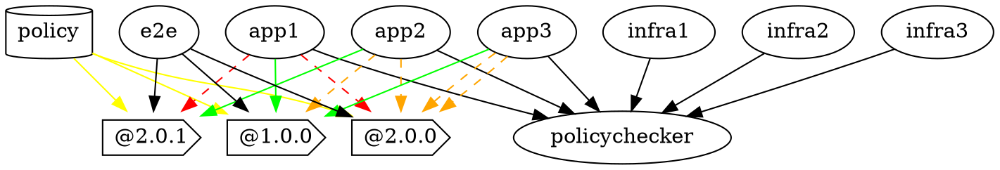

# Research 01 — Dissection of the `example-policy-org` reference implementation

Reference implementation of **"Policy as [Versioned] Code"** by Chris Nesbitt-Smith
(Appvia blog: <https://www.appvia.io/blog/policy-as-versioned-code>).

GitHub org: <https://github.com/example-policy-org> — all 11 repos are **public + archived**.
Cloned to `/tmp/pavc-eg/<name>` and read in full (every tracked file at HEAD, plus every
git tag and the relevant historical branches/commits). This document quotes real file
contents verbatim.

---

## 0. The big picture / core idea

The whole demo encodes one idea: **company policy is a versioned artifact**, published as
immutable git tags / OCI-style semver from a single `policy` repo. Every consuming
repository (apps in Kubernetes, infra in Terraform) **pins** a specific policy version via a
machine-readable marker in its own source. The marker is the *same string* in two roles:

1. A **selector** — Kyverno policies only `match` resources carrying the matching
   `mycompany.com/policy-version` label, so multiple policy versions can coexist on one
   cluster and each only governs the workloads that opted into it.
2. A **dependency pin** — Renovate watches `github-tags` of `example-policy-org/policy` and
   raises a PR when a newer policy version exists, exactly like bumping a library
   dependency.

A shared **`policy-checker`** Docker image (and an older deprecated reusable
**`policy-action`** workflow) reads the pinned version out of a repo, clones that exact tag
of `policy`, and runs Kyverno (k8s) and/or Checkov (Terraform) against the repo's manifests.
The `e2e` repo proves all three policy versions coexisting on one KiND cluster.

Repo list (from `gh repo list example-policy-org --limit 100`):

| Repo | Role | Description (from GitHub) |
|---|---|---|
| `policy` | The versioned policy source | "Policy codebase" |
| `policy-checker` | Docker tool (current) | run locally/CI to test an app |
| `policy-action` | Reusable GH workflow (deprecated) | superseded by policy-checker image |
| `app1` | k8s consumer | compliant with `1.0.0` only |
| `app2` | k8s consumer | compliant with `2.0.0`/`2.0.1` (on `2.0.1`) |
| `app3` | k8s consumer | compliant with `2.0.1` but using `1.0.0`, bumpable |
| `infra1` | Terraform consumer | compliant with `1.0.0` only |
| `infra2` | Terraform consumer | compliant with `2.0.1` |
| `infra3` | Terraform consumer | compliant with `2.0.1` but using `1.0.0`, bumpable |
| `e2e` | KiND end-to-end | everything on one cluster |
| `.github` | Org profile + renovate defaults | repo-relationship graphviz |

---

## 1. `policy` repo — the versioned policy source

### 1.1 Tags / versions that exist

`gh api repos/example-policy-org/policy/tags` (there are **no GitHub Releases objects**, only
git tags):

```
2.0.1 -> cfc623aa
2.0.0 -> a3fe46a0
1.0.0 -> 9240deab
```

Branches: `main` (canonical), `pre-tf` (historical, before Terraform/Checkov support was
added). Note: although the semver config and commit log reference a `1.1.0` (and the
`pre-tf` branch has `1.1.0`/`2.0.0` commits), **`1.1.0` was never tagged on `main`** — the
three published tags are exactly `1.0.0`, `2.0.0`, `2.0.1`.

### 1.2 Directory layout (at HEAD / `2.0.1`)

```
.github/semver.yaml
.github/workflows/ci.yml
.gitignore                       # report.xml
LICENSE                          # MIT, Copyright (c) 2022 Chris Nesbitt-Smith
README.md
renovate.json                   # { "extends": ["config:base"] }
infra/checkov/config.yaml
infra/checkov/require-department-label/{policy.yaml,pass0.tf,pass1.tf,fail0.tf,fail1.tf,fail2.tf}
infra/checkov/require-known-department-label/{policy.yaml,pass0.tf,pass1.tf,fail0.tf,fail1.tf,fail2.tf}
infra/checkov/test.bats
kubernetes/kyverno/kustomization.yaml
kubernetes/kyverno/require-department-label/{policy.yaml,test.yaml,pass0.yaml,fail0.yaml,skip0.yaml,skip1.yaml}
kubernetes/kyverno/require-known-department-label/{policy.yaml,test.yaml,pass0.yaml,fail0.yaml,skip0.yaml,skip1.yaml}
```

### 1.3 What changed per version

| Version | k8s policies present | Checkov policies present | `require-known-department-label` allowed values |
|---|---|---|---|
| **1.0.0** | `require-department-label` only | `require-department-label` only (no `require-known...`) | n/a (policy not present) |
| **2.0.0** | both | both | `tech\|accounts\|servicedesk\|hr` |
| **2.0.1** | both | both | `tech\|accounts\|servicedesk\|hr\|sales` (adds **sales**) |

- **1.0.0 → 2.0.0 (major):** adds the entire `require-known-department-label` policy (both
  the Kyverno `ClusterPolicy` and the Checkov `CUSTOM_AWS_2` YAML check) plus its fixtures.
  Adds the `infra/checkov/require-known-department-label/` directory and `renovate.json`.
  The `kustomization.yaml` gains the second resource. It is a **major** bump because
  workloads that only set a department label now must set a *known* value — a breaking
  tightening.
- **2.0.0 → 2.0.1 (patch):** adds the value `sales` to the known-department allow-list, in
  both the Kyverno pattern and the Checkov `or` block. Verbatim Kyverno diff:

```diff
-      message: "The label `mycompany.com/department` is required to be one of [tech|accounts|servicedesk|hr]"
+      message: "The label `mycompany.com/department` is required to be one of [tech|accounts|servicedesk|hr|sales]"
       pattern:
         metadata:
           labels:
-            "mycompany.com/department": "tech|accounts|servicedesk|hr"
+            "mycompany.com/department": "tech|accounts|servicedesk|hr|sales"
```

Across every version, the **`kustomization.yaml` and every fixture's
`mycompany.com/policy-version` label is rewritten to match the version string** (so
`1.0.0` fixtures carry `1.0.0`, etc).

### 1.4 The Kyverno policies (verbatim, at `2.0.1`)

`kubernetes/kyverno/kustomization.yaml`:

```yaml
apiVersion: kustomize.config.k8s.io/v1beta1
kind: Kustomization

nameSuffix: "-2.0.1"

commonLabels:
  mycompany.com/policy-version: "2.0.1"

resources:
  - require-department-label/policy.yaml
  - require-known-department-label/policy.yaml
```

Two mechanisms make versions coexist on one cluster:
1. **`nameSuffix: "-2.0.1"`** → the `ClusterPolicy` objects are renamed e.g.
   `require-department-label-2.0.1`, so applying `1.0.0`, `2.0.0` and `2.0.1` does not
   collide on object names.
2. **`commonLabels.mycompany.com/policy-version`** → stamped onto the policy AND used inside
   each policy's `match.selector.matchLabels` so it only governs workloads bearing the same
   version label.

`require-department-label/policy.yaml`:

```yaml
apiVersion: kyverno.io/v1
kind: ClusterPolicy
metadata:
  name: require-department-label
  annotations:
    policies.kyverno.io/title: Require Department Label
    policies.kyverno.io/category: Example Org Policy
    policies.kyverno.io/severity: medium
    policies.kyverno.io/subject: Label
    policies.kyverno.io/description: >-
      It is important we know the department that resources belong to, so you
      need to define a 'mycompany.com/department' label on all your resources.
    pod-policies.kyverno.io/autogen-controllers: none
spec:
  validationFailureAction: enforce
  background: false
  rules:
  - name: require-department-label
    exclude:
      any:
      - resources:
          namespaces:
          - kube-system
      - resources:
          namespaceSelector:
            matchLabels:
              "mycompany.com/require-department-label": exempt
      - resources:
          selector:
            matchLabels:
              "mycompany.com/require-department-label": exempt
    match:
      all:
      - resources:
          namespaces:
            - "*?"
          kinds:
            - "*"
          selector:
            matchLabels:
              mycompany.com/policy-version: "2.0.1"
    validate:
      message: "The label `mycompany.com/department` is required."
      pattern:
        metadata:
          labels:
            "mycompany.com/department": "?*"
```

Key design notes:
- `validationFailureAction: enforce`, `background: false`.
- The **opt-in via `match.selector.matchLabels.mycompany.com/policy-version`** is the heart of
  coexistence: the policy ignores any resource not labelled with this exact version.
- **Two exemption routes**: namespace label or resource label
  `mycompany.com/require-department-label: exempt`, plus a hard exclude of `kube-system`.
- `namespaces: ["*?"]` (a quirk — effectively "any non-empty namespace").

`require-known-department-label/policy.yaml` (at `2.0.1`) is identical in structure but its
`validate.pattern` enforces an enum: `"mycompany.com/department": "tech|accounts|servicedesk|hr|sales"`.

### 1.5 Kyverno test fixtures + how tests run

Each policy dir ships a `test.yaml` (Kyverno CLI test format) referencing fixtures that must
produce `pass` / `fail` / `skip`. E.g. `require-department-label/test.yaml`:

```yaml
name: tests
policies:
  - policy.yaml
resources:
  - fail0.yaml
  - pass0.yaml
  - skip0.yaml
  - skip1.yaml
results:
- {policy: require-department-label, rule: require-department-label, resource: require-department-label-fail0, kind: Pod, result: fail}
- {policy: require-department-label, rule: require-department-label, resource: require-department-label-pass0, kind: Pod, result: pass}
- {policy: require-department-label, rule: require-department-label, resource: require-department-label-skip0, kind: Pod, result: skip}
- {policy: require-department-label, rule: require-department-label, resource: require-department-label-skip1, kind: Pod, result: skip}
```

- `fail0` = Pod with version label but **no** department label → `fail`.
- `pass0` = Pod with `mycompany.com/department: finance` → `pass`.
- `skip0` = Pod carrying the `exempt` label → `skip`.
- `skip1` = Pod in `kube-system` → `skip`.

Run locally: `kyverno test .` (or `kyverno test kubernetes/kyverno` in CI).

### 1.6 Checkov policies + fixtures + how tests run

`infra/checkov/config.yaml`:

```yaml
framework:
  - terraform
external-checks-dir: ../policy/infra/checkov/
run-all-external-checks: true
check:
  - CUSTOM_*
```

`require-department-label/policy.yaml` (Checkov YAML custom policy, `CUSTOM_AWS_1`):

```yaml
metadata:
  name: "Check that all resources are tagged with the key - department"
  id: "CUSTOM_AWS_1"
  category: "CONVENTION"
scope:
  provider: aws
definition:
  and:
    - cond_type: "attribute"
      resource_types: "all"
      attribute: 'tags.mycompany.com.department'
      operator: "exists"
```

`require-known-department-label/policy.yaml` (`CUSTOM_AWS_2`, an `or` over allowed values;
at `2.0.1` the values are tech/hr/accounts/servicedesk/sales). Note the TF tag key uses dots
`tags.mycompany.com.department` (Checkov path syntax), whereas k8s uses the slash label
`mycompany.com/department`.

Fixtures are `.tf` files: `pass0.tf`/`pass1.tf` (tagged correctly), `fail0.tf`/`fail1.tf`
(no tag), `fail2.tf` (one resource tagged, a second `aws_ami` untagged → still fails).

Because Checkov has **no formal policy-testing harness**, tests are driven by **BATS**
(`infra/checkov/test.bats`) — and the README explicitly calls this out. The single `@test`
loops every dir, asserting `pass*.tf` pass and `! ...fail*.tf` (negated → must fail):

```bash
@test "checkov" {
for dir in infra/checkov/*/ ; do
  for passing in ${dir}pass*.tf ; do
      echo "Passing: ${passing}"
      checkov --config-file infra/checkov/config.yaml -f ${passing} --external-checks-dir ${dir}
  done
  for failing in ${dir}fail*.tf ; do
      echo "Failing: ${failing}"
      ! checkov --config-file infra/checkov/config.yaml -f ${failing} --external-checks-dir ${dir}
  done
done
}
```

The author's comment notes the BATS limitation: dynamic per-case `@test` definitions aren't
supported (bats-core issue #306), so everything is crammed into one test.

### 1.7 CI (`.github/workflows/ci.yml`)

Triggers: push to `main`, push of `*.*.*` tags, and PRs to `main`. Three active jobs:

- **`kyverno`**: checkout → fetch kyverno CLI **v1.5.4** by `wget | tar` into `/usr/local/bin`
  → `kyverno test kubernetes/kyverno`.
- **`checkov`**: checkout → `pip install checkov` → `mig4/setup-bats@v1` (bats 1.6.0) →
  `bats --report-formatter junit infra/checkov/test.bats` (**`continue-on-error: true`**) →
  `dorny/test-reporter` publishes `report.xml` (`fail-on-error: false`). So Checkov failures
  are reported but **do not fail CI** — a deliberate hack.
- **`semver`**: `lukaszraczylo/semver-generator@1.4.18` reads `.github/semver.yaml` to compute
  the next semantic version from commit-message keywords.
- **`release`**: **commented out** (`marvinpinto/action-automatic-releases`). So in this demo
  tags were pushed manually; there is no automated release pipeline and no GitHub Releases.

### 1.8 Signing

The `policy` repo itself is **not signed**. Signing exists only for the `policy-checker`
*image* (cosign keyless, see §2.4). Versioning integrity for policy relies on **immutable git
tags** (the README repeatedly stresses pinning external policies to a git-SHA for
determinism).

### 1.9 Semver automation config (`.github/semver.yaml`)

```yaml
version: 1
force:
  major: 1
  existing: true
wording:
  patch: [bump, update, initial, tweak]
  minor: [change, improve, implement, fix]
  major: [breaking]
  release: [release-candidate, add-rc]
```

Commit-message keywords drive the bump. (Note the unconventional mapping: `fix` → **minor**,
not patch.)

---

## 2. `policy-checker` — the Docker tool (current mechanism)

Tags: `1.0.0`, `2.0.0`, `2.0.1` (image versions, independent of policy content). Files:
`Dockerfile`, `run.sh`, `requirements.txt` (`checkov==2.0.1037`), `renovate.json`,
`.github/workflows/ci.yml`, `README.md`, `LICENSE`.

### 2.1 Dockerfile (verbatim, HEAD)

```dockerfile
FROM ghcr.io/kyverno/kyverno-cli:1.7-dev-latest as kyverno-cli

FROM alpine/k8s:1.22.6

RUN apk add --no-cache\ 
  yq \
  python3 \
  python3-dev \
  alpine-sdk \
  libffi-dev \
  py3-wheel \
  go

RUN GO11MODULE=on go get github.com/tmccombs/hcl2json

COPY requirements.txt ./
RUN pip install -r requirements.txt

COPY --from=kyverno-cli /kyverno /usr/local/bin/kyverno

COPY run.sh /usr/local/bin/run.sh

ENV POLICY_VERSION=0.0.0

CMD run.sh
```

Toolchain bundled: `kyverno` CLI (copied from kyverno-cli image), `kubectl`+`kustomize`
(from `alpine/k8s`), `yq`, `jq`, `checkov` (pip), and **`hcl2json`** (Go, by tmccombs) for
parsing Terraform. `ENV POLICY_VERSION=0.0.0` is the fallback default if discovery fails.

### 2.2 `run.sh` — discovery + fetch + run (verbatim, HEAD = 2.0.1)

```bash
#!/bin/bash

set -e

if test -f "kustomization.yaml"; then
  echo "Found kustomization.yaml"
  echo "Checking policy version..."
  FETCHED_POLICY_VERSION=$(yq eval '.commonLabels["mycompany.com/policy-version"]' kustomization.yaml)
  POLICY_VERSION="${FETCHED_POLICY_VERSION:=$POLICY_VERSION}"
  echo "Policy version: ${POLICY_VERSION}"
  echo "Fetching Policy..."
  git clone --quiet --depth 1 --branch ${POLICY_VERSION} https://github.com/example-policy-org/policy.git /policy
  echo "Policy fetched."
  echo "Running policy checker..."
  kubectl kustomize . | kyverno apply  /policy/kubernetes/kyverno/*/policy.yaml --resource -
fi


if compgen -G "./*.tf" > /dev/null; then
  echo "Found Terraform files"
  echo "Checking policy version..."
  mkdir /tmp/tf
  cp -r * /tmp/tf
  hcl2tojson -s /tmp/tf /tmp/hcl2tojson
  
  FETCHED_POLICY_VERSION=$(jq -n '[inputs]' /tmp/hcl2tojson/*.json | jq -r 'map(select(.variable))[].variable|map(select(.["mycompany.com/policy-version"]))[0]["mycompany.com/policy-version"].default[0]') 
  POLICY_VERSION="${FETCHED_POLICY_VERSION:=$POLICY_VERSION}"
  echo "Policy version: ${POLICY_VERSION}"
  echo "Fetching Policy..."
  git clone --quiet --depth 1 --branch ${POLICY_VERSION} https://github.com/example-policy-org/policy.git /policy
  echo "Policy fetched."
  echo "Running policy checker..."
  checkov \
    --external-checks-dir /policy/infra/checkov \
    --config-file /policy/infra/checkov/config.yaml \
    --directory .
fi
```

How it works:
1. **Discover version (k8s):** `yq eval '.commonLabels["mycompany.com/policy-version"]'`
   from `kustomization.yaml`.
2. **Discover version (TF):** convert all `.tf` → JSON with `hcl2json`, then a `jq` pipeline
   digs out the `default` of the variable named `mycompany.com/policy-version`.
3. **Fetch the exact policy:** `git clone --depth 1 --branch ${POLICY_VERSION}
   https://github.com/example-policy-org/policy.git /policy` — i.e. it clones the **git tag**
   equal to the pinned version.
4. **Run k8s:** `kubectl kustomize . | kyverno apply /policy/kubernetes/kyverno/*/policy.yaml
   --resource -` (renders the app's manifests, pipes into kyverno `apply`).
5. **Run TF:** `checkov --external-checks-dir /policy/infra/checkov --config-file ... --directory .`.

Both blocks run if both file types exist. `set -e` means the script exits non-zero if
kyverno/checkov reports failures, which is what fails the consuming repo's CI.

### 2.3 Version evolution of `run.sh`/Dockerfile

- **1.0.0:** k8s-only. `run.sh` had no `if`-guards, no Terraform path. Dockerfile only
  installed `yq` on `alpine/k8s:1.20.7` with `kyverno-cli:1.6-dev-latest`.
- **2.0.0:** added Terraform/Checkov support (the second `if compgen` block), `requirements.txt`
  (`checkov==2.0.1020`), `hcl2json`, Python toolchain; bumped to `alpine/k8s:1.21.5` +
  `kyverno-cli:1.7-dev-latest`. (Early TF block had a buggy `--config-file ../policy/...`
  path and scanned `.` directly.)
- **2.0.1:** fixed the Terraform path. The diff was specifically to copy `.tf` files into
  `/tmp/tf` before running `hcl2json` (the commit is literally titled *"only run hcl2json over
  .tf files"*) to stop hcl2json choking on non-tf files:

```diff
   echo "Checking policy version..."
-  hcl2tojson -s . /tmp/hcl2tojson
+  mkdir /tmp/tf
+  cp -r * /tmp/tf
+  hcl2tojson -s /tmp/tf /tmp/hcl2tojson
```

### 2.4 CI: build + sign (`.github/workflows/ci.yml`)

- **`build`** job: `docker/login-action` → `docker/metadata-action` generating tags
  `type=sha,format=long`, `type=edge,branch=...`, `type=semver,pattern={{version}}`,
  `type=semver,pattern={{major}}.{{minor}}`, `flavor: latest=true` → `docker/build-push-action`
  (push only on non-PR). Image: `ghcr.io/example-policy-org/policy-checker`.
- **`sign`** job (non-PR only): `sigstore/cosign-installer@v2.1.0` then
  `cosign sign ${TAGS}` with `COSIGN_EXPERIMENTAL: 1` and `id-token: write` → **keyless
  (Fulcio/Rekor) signing of the published image**. Per-job least-privilege permissions are
  set explicitly (e.g. `packages: write`, everything else `none`).

### 2.5 Hacks / limitations (explicit and observed)

The README has a loud disclaimer (verbatim):

> ## ⚠️⚠️ This is not intended for general use or to be immediately reusable ⚠️⚠️
> The location of the policy it retrieves is hardcoded to get from
> [example-policy-org/policy]... to make this more reusable it needs to handle authenticating
> to retrieve the policy where it's in a private repo, be a significantly smaller image, cache
> the policy so it doesn't need to be retrieved on every execution and find a better story than
> docker to be able to execute locally for the sake of speed.

Observed limitations:
- **Hardcoded** policy repo URL in `run.sh`.
- **No caching** — clones policy on every run.
- **Large image** (`alpine/k8s` + Go + Python + Checkov).
- Public-repo clone only (no auth).
- The README even contains a stray `asdasdaff` typo line.
- `hcl2json` binary is invoked as `hcl2tojson` in the script (relies on how `go get` named it
  / a wrapper); brittle.

### 2.6 Local usage

```bash
docker run --rm -v $(pwd):/apps ghcr.io/example-policy-org/policy-checker
```

(Consumer READMEs use `-ti` and mount to `/apps`.)

---

## 3. `policy-action` — the deprecated reusable workflow

**No `action.yml`.** This is *not* a composite/JS GitHub Action; it is a **reusable
workflow** (`on: workflow_call`) plus a README explaining it has been superseded. Files:
`.github/workflows/ci.yml`, `README.md`, `LICENSE`. No tags.

README (verbatim):

> # Reusable policy checker github workflow
> > Archived since have replaced for now with a single reusable docker image
> So instead you just need a file like this in the repo
> ```yaml
> name: Policy
> on: { push:, pull_request: }
> jobs:
>   policy:
>     runs-on: ubuntu-latest
>     steps:
>       - uses: actions/checkout@v2.4.0
>       - uses: docker://ghcr.io/example-policy-org/policy-checker:latest
> ```

The workflow itself (`workflow_call`):

```yaml
name: Policy
on:
  workflow_call:
jobs:
  kyverno:
    runs-on: ubuntu-latest
    steps:
      - uses: actions/checkout@v2.4.0
        with: { path: app }
      - uses: engineerd/setup-kind@v0.5.0
        with: { skipClusterCreation: true }
      - name: Find policy version
        id: policy_version
        run: echo "::set-output name=policy_version=$(yq eval '.commonLabels["mycompany.com/policy-version"]' app/kustomization.yaml)"
      - name: Download Policy pack
        uses: actions/checkout@v2.4.0
        with:
          path: policy
          repository: example-policy-org/policy
          ref: ${{ steps.policy_version.outputs.policy_version }}
      - name: Get kyverno
        run: wget -q -O - https://github.com/kyverno/kyverno/releases/download/v1.5.4/kyverno-cli_v1.5.4_linux_x86_64.tar.gz | tar -C /usr/local/bin -xzf - kyverno
      - name: Kyverno tests
        run: kubectl kustomize app | kyverno apply  policy/kubernetes/kyverno/*/policy.yaml  --resource -
```

### How it differs from `policy-checker`

| Aspect | `policy-action` (old) | `policy-checker` (current) |
|---|---|---|
| Form | Reusable GH **workflow** (`workflow_call`) | Reusable **Docker image** (`docker://...`) |
| Version discovery | `yq` on `app/kustomization.yaml` | `yq` (k8s) **or** `hcl2json`+`jq` (TF) |
| Fetch policy | `actions/checkout` with `ref:` = version | `git clone --branch <version>` |
| Coverage | **Kyverno only** | **Kyverno + Checkov** |
| Run locally? | No (CI-only, uses `::set-output`) | Yes (`docker run`) |
| Runner deps | Installs kyverno via wget at runtime | All baked into image |
| Status | **Deprecated / archived** | Active |

It uses the now-deprecated `::set-output` syntax and installs kyverno v1.5.4 at runtime; the
Docker approach replaced it to get one artifact usable identically in CI and on a laptop, and
to add Terraform support.

---

## 4. Consumers — apps (Kubernetes) and infra (Terraform)

All six consumer repos have the **same CI** (`name: Policy`, on push+PR): checkout then
`uses: docker://ghcr.io/example-policy-org/policy-checker:latest`. The checkout SHA differs
(`v3.0.0` for app1/app3/infra*, `v2.4.0` for app2).

### 4.1 Pinning mechanism — Kubernetes apps

Pin lives in `kustomization.yaml` under `commonLabels`. Example `app1/kustomization.yaml`:

```yaml
apiVersion: kustomize.config.k8s.io/v1beta1
kind: Kustomization
commonLabels:
  mycompany.com/policy-version: "1.0.0"
resources:
  - deployment.yaml
```

`commonLabels` stamps `mycompany.com/policy-version` onto every rendered resource (the
`deployment.yaml` pods), which is precisely what the version-selecting Kyverno policy
matches on. The same string is what `policy-checker` reads. `deployment.yaml` carries the
real compliance payload, e.g. `mycompany.com/department: finance` (app1) / `hr` (app2, app3).

Renovate config — `app1/.github/renovate.json5` (identical for app2/app3):

```json5
{
  "$schema": "https://docs.renovatebot.com/renovate-schema.json",
  "dependencyDashboard": false,
  "automerge": false,
  "pinDigests": true,
  "regexManagers": [
    {
      "fileMatch": ["kustomization.yaml"],
      "matchStrings": ["mycompany.com/policy-version: \"(?<currentValue>.*)\"\\s+"],
      "datasourceTemplate": "github-tags",
      "depNameTemplate": "policy",
      "lookupNameTemplate": "example-policy-org/policy",
      "versioningTemplate": "semver"
    }
  ]
}
```

A **regexManager** treats the label value as a dependency: datasource `github-tags` on
`example-policy-org/policy`, semver versioning. So Renovate raises a PR editing the label
when a newer tag appears.

### 4.2 Pinning mechanism — Terraform infra

Pin lives in `variable.tf` as a variable **named** `mycompany.com/policy-version` with a
`default`, marked by a `# renovate: policy` comment. `infra1/variable.tf`:

```hcl
variable "mycompany.com/policy-version" {
  type    = string
# renovate: policy
  default = "1.0.0"
}
```

`infra1/main.tf` is the compliance payload:

```hcl
resource "aws_s3_bucket" "b" {
  bucket = "my-tf-test-bucket"
  tags = {
    mycompany.com.department = "finance"
  }
}
```

Renovate — `infra1/.github/renovate.json5` (identical for infra2/infra3). Note it adds
`separateMajorMinor`/`separateMinorPatch`/`separateMultipleMajor` (so major vs minor vs patch
bumps get separate PRs) and a different regex keyed off the `# renovate: policy` comment:

```json5
{
  "$schema": "https://docs.renovatebot.com/renovate-schema.json",
  "dependencyDashboard": false,
  "automerge": false,
  "pinDigests": true,
  "separateMajorMinor": true,
  "separateMinorPatch": true,
  "separateMultipleMajor": true,
  "regexManagers": [
    {
      "fileMatch": [".*tf$"],
      "matchStrings": ["#\\s*renovate:\\s*policy?\\s*default = \"(?<currentValue>.*)\"\\s"],
      "datasourceTemplate": "github-tags",
      "depNameTemplate": "policy",
      "lookupNameTemplate": "example-policy-org/policy",
      "versioningTemplate": "semver"
    }
  ]
}
```

### 4.3 The compliance/version matrix

| Repo | Type | Pinned version | Latest available | Compliant with latest? | Demonstrated state |
|---|---|---|---|---|---|
| app1 | k8s | `1.0.0` | `2.0.1` | **No** (only 1.0.0) | "compliant with 1.0.0 **only**" — bumping to 2.x would fail (department label `finance` is not in the known list) |
| app2 | k8s | `2.0.1` | `2.0.1` | **Yes** | up to date (`hr`); history shows Renovate already bumped 1.1.0→2.0.0→2.0.1 |
| app3 | k8s | `1.0.0` | `2.0.1` | **Yes** (`hr` is a known dept) | "using 1.0.0 and can be updated with a pull-request" — the bump-ready case |
| infra1 | TF | `1.0.0` | `2.0.1` | **No** (`finance`) | "compliant with 1.0.0 **only**" |
| infra2 | TF | `2.0.1` | `2.0.1` | **Yes** (`hr`) | up to date; history shows Renovate bumped policy→v2 |
| infra3 | TF | `1.0.0` | `2.0.1` | **Yes** (`hr`) | "using 1.0.0 and can be updated with a pull-request" — bump-ready |

**Open Renovate PRs now:** none — all repos are archived, so live PRs are closed. But the
git history proves the flow worked: `app2` has the renovate-bot commit
`Update dependency policy to v2.0.1 (#3)` (changing the label `2.0.0`→`2.0.1`, actually from
`1.1.0`→`2.0.0` earlier), and `infra2` has `Update dependency policy to v2 (#2)`. app3/infra3
are the deliberately-left-behind, "a PR would cleanly bump them because `hr` is valid in 2.x"
demonstration; app1/infra1 are the "stuck on 1.0.0 because their `finance` department isn't a
known value and a bump would *break* them" demonstration.

Consumer READMEs include the expected `policy-checker` output, e.g. app2 shows
`Applying 2 policies to 1 resource... pass: 2`, app1 shows `Applying 1 policy... pass: 1`,
and infra READMEs show the Checkov ASCII banner with `Passed checks: 2/3`.

---

## 5. `e2e` — everything on one KiND cluster

Files: `.github/workflows/ci.yaml`, `LICENSE`. (A `kustomization.yaml` was deleted; HEAD
commit is "Delete kustomization.yaml". A `renovate/configure` branch adds a `renovate.json`.)
No KiND config *file* — the cluster is created by the `container-tools/kind-action` with
defaults. CI (verbatim core):

```yaml
name: CI
on: { push:, pull_request: }
jobs:
  deploy:
    runs-on: ubuntu-latest
    steps:
      - uses: actions/checkout@v2.4.0
      - uses: container-tools/kind-action@fdfd7e7ffb39e532f9de844dba8f1a29ae7e0f75 # renovate: tag=v1.7.0
        timeout-minutes: 5
        with:
          kubectl_version: v1.22.2
          registry: false
      - name: Install kyverno
        run: |
          kubectl apply --wait -k github.com/kyverno/kyverno/config
          sleep 5
          kubectl wait --for=condition=available --timeout=600s -n kyverno deployment/kyverno
      - name: Test
        run: |
          kubectl apply -k "github.com/example-policy-org/policy/kubernetes/kyverno?ref=1.0.0"
          kubectl apply -k "github.com/example-policy-org/policy/kubernetes/kyverno?ref=2.0.0"
          kubectl apply -k "github.com/example-policy-org/policy/kubernetes/kyverno?ref=2.0.1"
          while [[ $(kubectl get -k "...kyverno?ref=1.0.0" -o 'jsonpath={..status.ready}') != "true" ]]; do sleep 1; done
          while [[ $(kubectl get -k "...kyverno?ref=2.0.0" -o 'jsonpath={..status.ready}') != "true true" ]]; do sleep 1; done
          while [[ $(kubectl get -k "...kyverno?ref=2.0.1" -o 'jsonpath={..status.ready}') != "true true" ]]; do sleep 1; done
          kubectl apply -k github.com/example-policy-org/app1
          kubectl apply -k github.com/example-policy-org/app2
          kubectl apply -k github.com/example-policy-org/app3
          kubectl wait --for=condition=available --timeout=600s deployment/app1 deployment/app2 deployment/app3
```

How multiple versions coexist on one cluster:
- It applies the **same kustomize base at three different git refs** (`?ref=1.0.0`, `2.0.0`,
  `2.0.1`) directly from GitHub. Thanks to the per-version `nameSuffix` + version label
  (§1.4), the three sets of ClusterPolicies live side by side without name clashes.
- The `jsonpath={..status.ready}` readiness gate differs by version: `1.0.0` has **one**
  policy (`"true"`), while `2.0.0`/`2.0.1` have **two** (`"true true"`).
- Then it applies the three apps straight from their repos (`kubectl apply -k
  github.com/example-policy-org/app1` ...). Each app's version label routes it to the matching
  policy set; all three Deployments becoming Available proves each app passes the policy
  version it pinned. Commented-out `strategy.matrix` (dev/preprod/prod) hints at multi-env.

KiND specifics: `container-tools/kind-action@...v1.7.0`, `kubectl_version: v1.22.2`,
`registry: false`, 5-min timeout. Kyverno installed from `-k github.com/kyverno/kyverno/config`
with a `sleep 5` + `kubectl wait` (the commit log shows a "use a different kind action" and
"add a small sleep to ci" — flakiness workarounds).

---

## 6. `.github` — org profile + relationship graph

Files: `profile/README.md`, `repos.dot`. A `renovate/configure` branch adds an org-default
`renovate.json` (`{ "extends": ["config:recommended"] }`) — the org-wide Renovate preset.
(Same default appears on `e2e`'s `renovate/configure` branch.) Note individual repos pin to
`config:base` rather than this `config:recommended`.

`profile/README.md` links the Appvia blog and renders `repos.dot` via gravizo. `repos.dot`
(graphviz) is the canonical relationship map:



Legend: green = compliant-with, red = not-compliant-with, orange dashed = (compatible but not
pinned), yellow = child-of (a tag of policy), plain = depends-on. This graph confirms app1 is
green only on 1.0.0 and red on 2.x (the "stuck/would-break" case), while app2/app3 are green
on their target with orange (could-move) edges to the others.

---

## 7. Cross-cutting mechanics summary

1. **One label string, two jobs.** `mycompany.com/policy-version` is simultaneously (a) the
   Renovate dependency pin and (b) the Kyverno `match` selector. That single fact is the
   entire trick.
2. **Immutable versioned policy.** Policy is published as git tags (`1.0.0`, `2.0.0`,
   `2.0.1`); consumers `git clone --branch <tag>` / kustomize `?ref=<tag>`. SemVer semantics:
   major = breaking tightening (1→2 added the known-value enum), patch = additive widening
   (2.0.0→2.0.1 added `sales`).
3. **Coexistence via `nameSuffix` + version selector.** Multiple policy versions install on
   one cluster without collision and each only governs opted-in workloads.
4. **Two enforcement planes share the version pin:** Kyverno for k8s (label-based) and Checkov
   for Terraform (variable-default-based), unified behind the `policy-checker` image.
5. **Renovate as the upgrade engine.** regexManagers turn an in-file string into a tracked
   dependency, so policy upgrades arrive as ordinary PRs; CI (the checker) is the gate that
   says whether the bump is safe.
6. **Evolution:** reusable *workflow* (`policy-action`, k8s-only, deprecated) → reusable
   *Docker image* (`policy-checker`, k8s+TF, runs locally and in CI).
7. **Known sharp edges:** policy-checker hardcodes the policy repo + no caching + heavy image;
   Checkov has no native test framework so BATS is bolted on and CI is `continue-on-error`;
   `::set-output` and other 2022-era patterns; no GitHub Releases (tags only); `release` job
   commented out; image (not policy) is cosign-keyless-signed.

---

## Appendix — provenance

- Author: Chris Nesbitt-Smith (LICENSE: MIT, Copyright (c) 2022). Org archived 2025-10-21.
- Local clones: `/tmp/pavc-eg/{policy,policy-checker,policy-action,app1,app2,app3,infra1,infra2,infra3,e2e,.github}`.
- Tags confirmed via `gh api repos/example-policy-org/<repo>/tags`: only `policy` and
  `policy-checker` carry `1.0.0/2.0.0/2.0.1`; **no GitHub Releases objects exist** on any repo.
- Historical branches inspected: `policy@origin/pre-tf` (pre-Terraform era),
  `.github`/`e2e` `renovate/configure`.
