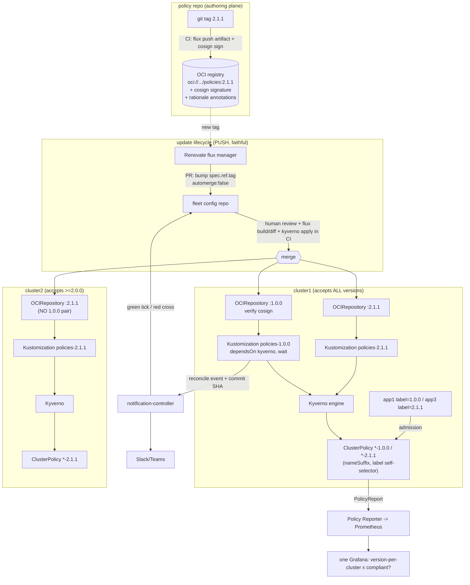

# 20 — Synthesis: A Faithful Flux Mapping of "Policy as Versioned Code"

> **Purpose & posture.** This document is **Phase 1 — faithful expansion only**. The brief is
> to be *faithful to the original thesis first* — to expand CNS's "Policy as [Versioned] Code"
> onto Flux primitives **1:1**, NOT to redesign it. Where the original made a choice, we find the
> Flux primitive that makes the *same* choice. Where Flux removes a hack the original was forced
> into, we note it as a "magic removed" — but we do **not** invent new pillars, retire the
> Kyverno-label trick, or impose the mea-culpa's lane-keeping/gate split as a redesign. Those
> belong to a later phase. Open design decisions that would *change* the thesis are deferred to
> the **OPEN QUESTIONS FOR CNS** list at the end, which feeds the grilling session.
>
> Sources: research dossiers 01–03 (the original work + thesis) and 10–17 (the Flux primitives),
> all on disk in this folder and read in full.

---

## 0. The original, in one paragraph (so we map the real thing)

Company policy is published from one `policy` repo as **immutable git tags** (`1.0.0`, `2.0.0`,
`2.1.0`/`2.0.1`, `2.1.1`). One string — `mycompany.com/policy-version` — does **two jobs at once**:
it is the **Renovate dependency pin** in each consumer, and it is the **Kyverno `match.selector`**
that scopes which workloads a policy version judges. Multiple versions coexist on one cluster via
kustomize **`nameSuffix: "-<v>"`** (collision-free `ClusterPolicy` objects) + **`commonLabels`**
(stamps the version label) + the in-policy **self-selector** on that same label. A workload opts
in by carrying the label; a cluster narrows its accepted versions simply by installing fewer
remote bases (`cluster1` = all four; `cluster2` = `>=2.0.0`). A `policy-checker` Docker/bash tool
reads the pin, `git clone --branch <tag>`s the policy, and runs `kyverno apply` (k8s) / `checkov`
(Terraform) — locally and as the single CI gate. Renovate watches `github-tags` and PRs the
one-line bump (`automerge:false` → human review). The image, not the policy, is cosign-signed.

Everything below maps **that**.

---

## 1. Section-by-section mapping table

### 1.1 Pillar: Policy stored & versioned (git tags / signed releases)

| Original mechanic | Faithful Flux equivalent | Notes |
|---|---|---|
| `policy` repo, immutable **git tags** `1.0.0 … 2.1.1`; `?ref=<tag>` / `git clone --branch <tag>` | **`GitRepository`** with `spec.ref.tag: "2.1.1"` (faithful, like-for-like) **or** **`OCIRepository`** pulling a `flux push artifact`-published bundle pinned by `spec.ref.tag`/`digest` | Git path is the *most* faithful (policy stays as files, tag = version). OCI path is the faithful *upgrade* the thesis invites ("multi-version runtime", "supply chain not a new problem") but never named — see Q1. |
| Tags only, `release` job commented out, **no GitHub Releases**, **policy unsigned** (only the *image* was cosign-keyless-signed) | Either keep unsigned `GitRepository` (faithful to what shipped) **or** restore the author's *intent* with **`OCIRepository` + `spec.verify` cosign keyless** (`matchOIDCIdentity` on the publishing CI's OIDC) | The original *signed the wrong artifact*. Flux can sign+verify the policy artifact itself, natively, at the source — this is a hack the original couldn't close cheaply. See "magic removed" §4. |
| SemVer semantics: major = breaking tightening (1→2 added the enum), patch/minor = additive widening (added `sales`) | Unchanged — semver lives in the tag string; Flux `Masterminds/semver` honours it identically in `spec.ref.semver` ranges | Faithful 1:1. The version *meaning* is untouched; Flux just resolves the same strings. |

### 1.2 Pillar: The seven "-able" properties — which Flux primitive delivers each

These are from **the talk** (slide "(easily:)"), not the Medium post. Faithful mapping:

| "-able" | Original delivery | Faithful Flux primitive |
|---|---|---|
| **visible** | Policy in a public Git repo | `GitRepository`/`OCIRepository` source object on every cluster makes "what policy, what version, where" a `flux get sources` / `gotk_resource_info{revision=...}` query. Capacitor / FluxReport render it. (15) |
| **communicable** | Semver + (intended) release notes | Semver `tag`/`ref.semver` + OCI `--annotations` / `--source` / `--revision` provenance annotations carried on the artifact; notification-controller **Alert** broadcasts version changes. (11,12,15) |
| **consumable** | One label string; `?ref=<tag>` kustomize base | A consumer adds **one** `OCIRepository`/`GitRepository` + `Kustomization`. The pin is `spec.ref`. (13) |
| **testable** | `kyverno test`, Checkov BATS fixtures | Unchanged shift-left: `kyverno apply`/`kyverno test` in CI on `flux build kustomization … --dry-run` output. (13,14) |
| **usable** | `policy-checker` locally + in CI | `flux build` + `flux diff` + `kyverno apply` — same binary local and in CI, *no Docker image to ship*. (13) |
| **updatable** | Renovate auto-PR on `github-tags` | Renovate **native `flux` manager** bumps `OCIRepository/GitRepository spec.ref.tag` (PUSH); or live `ref.semver` range (PULL). (16) — see Q2. |
| **measurable** | "a GitHub PR search away" (blog) | `gotk_resource_info{revision=...}` per cluster = which version is where; Kyverno **PolicyReports** via Policy Reporter = is it actually compliant; one Grafana joins them. Git **commit status** = compliance at change-time. (15) |

### 1.3 Pillar: Consumer pins a version (kustomization annotation / tf comment)

| Original mechanic | Faithful Flux equivalent | Notes |
|---|---|---|
| k8s: `kustomization.yaml` `commonLabels."mycompany.com/policy-version": "1.0.0"` | The **pin moves to `OCIRepository/GitRepository.spec.ref`** (`tag: "1.0.0"` exact, or `semver: "1.x"` range). The **workload-selector label is still emitted** by the policy bundle's own kustomize `commonLabels`, exactly as before. | Subtle but important: in the original, ONE string was pin *and* selector. In Flux the **pin** is `spec.ref` and the **selector** is the label the bundle stamps. They can still be made the same value (postBuild `${policy_version}`), preserving the "one string, two jobs" elegance — see Q3. |
| tf: `variable "mycompany.com/policy-version" { default = "1.0.0" }` + `# renovate: policy` | tofu-controller `Terraform` CR sourced from a pinned `GitRepository/OCIRepository`, **or** keep Checkov-in-CI (faithful to what shipped). The pin becomes `spec.ref`. | The TF runtime gap is real (14 §6). Faithful = keep CI Checkov; honest upgrade = tofu-controller. See Q6. |
| Exact tag vs range | `spec.ref.tag` (exact pin, faithful to the original's exact-version pinning) vs `spec.ref.semver` (range — new capability) | The original ALWAYS pinned exact. A range is a *new* behaviour; flag before adopting. See Q2. |

### 1.4 Pillar: Renovate auto-PR on new version (the PUSH/PULL tension)

| Option | Faithful? | Trade-off |
|---|---|---|
| **Renovate native `flux` manager → PR rewrites `spec.ref.tag`** | **Most faithful.** Same tool, same `automerge:false` human-review ethos, same "policy bump is a PR" lifecycle. Renovate operates on the *pinned* tag form. | Requires an external bot/SaaS; commits stay exact + revertible. **Recommended faithful default.** (16 §5,6) |
| **Flux image-automation** (`ImageRepository`+`ImagePolicy`+`ImageUpdateAutomation`, `$imagepolicy` marker) | Partially faithful — preserves PUSH/commit-back inside the cluster trust boundary, but **commit-first, bespoke PR wiring**, and is awkward for OCI policy artifacts (you'd run two controllers to rewrite a tag Flux could follow itself). | Weaker PR story than Renovate; earns its keep only if you want no external bot. (16 §1,3) |
| **Live `ref.semver` range** (PULL, no commit-back) | **NOT faithful** — surrenders the per-version human review gate the original deliberately kept (`automerge:false`). A bad bump hits admission cluster-wide on next reconcile. | Lightest, most GitOps-pure, but the original's entire point was *reviewed* upgrades. Reserve for low-risk non-policy sources. (16 §4,6) |

**The tension, stated plainly (faithful framing):** the original chose **control over liveness**
(pinned + reviewed PR). The faithful Flux mapping therefore keeps **pinned `ref.tag` + Renovate
PR**. Live semver is the seductive Flux-native option that *quietly changes the thesis* — flag it,
don't default to it. See **Q2**.

### 1.5 Pillar: `policy-checker` (bash/Docker, local + CI shift-left)

| Original mechanic | Faithful Flux equivalent | Notes |
|---|---|---|
| Docker image: discover pin (`yq`/`hcl2json`+`jq`) → `git clone --branch <tag>` → `kyverno apply` / `checkov` | **CI:** `flux build kustomization … --dry-run` (renders exactly what the controller applies, incl. postBuild substitution) → pipe to `kyverno apply` / `kyverno test` / `kubeconform` / Checkov. **Cluster:** SSA dry-run exercises the Kyverno admission webhook on every apply. | Two layers replace one bash tool: CI shift-left (`flux build`) + in-cluster admission (SSA dry-run). (13 §9, 14 §4) |
| Discovers version by parsing the consumer file | Version is `spec.ref` on the source object — no parsing/`yq`/`hcl2json` brittleness | "magic removed": the binary-name `hcl2tojson` bug, no-caching, hardcoded URL, heavy image all vanish. §4. |
| `set -e` non-zero fails consumer CI | `flux diff` non-zero / `kyverno apply` failure fails the PR check; commit status goes red | Same gate semantics, native tooling. |

### 1.6 Pillar: Multi-version coexistence on one cluster (cluster1 / cluster2)

This is **the crux** of the original (dossier 02 §1). Faithful Flux design:

| Original mechanic | Faithful Flux equivalent |
|---|---|
| Install N versions via `kubectl apply -k ".../kyverno?ref=<tag>"` once per version | **N source objects** (`OCIRepository`/`GitRepository`), each pinned to a different `ref.tag`, each feeding **its own `Kustomization`**. (11 §7 "many source objects, each its own range") |
| `nameSuffix: "-<v>"` keeps `ClusterPolicy` objects collision-free | **Kept verbatim** — the policy bundle's kustomize still applies `nameSuffix`. Flux applies it unchanged via the `Kustomization` `path`. |
| `commonLabels.mycompany.com/policy-version: "<v>"` stamps the label | **Kept verbatim** in the bundle; OR injected via `Kustomization.spec.commonMetadata` / `postBuild.substitute` so the source `ref` and the stamped label stay equal (Q3). |
| In-policy `match.selector.matchLabels.mycompany.com/policy-version: "<v>"` self-scopes | **Kept verbatim.** This is the heart of coexistence and Flux does not touch it. (14 §3 confirms: distinct names + disjoint label scopes = clean coexistence.) |
| `cluster1` installs all 4; `cluster2` installs `>=2.0.0` | **Per-cluster subscription**: each cluster's `clusters/<name>/` entrypoint lists the source+Kustomization pairs it wants. `cluster2` simply omits the `1.0.0` pair. (17 §1.2) Or a `ResourceSet` over a versions matrix (`<< inputs.policyTag >>`) generates them. (17 §2.2) |
| Dropping a version silently un-guards apps still pinned to it (the cluster2 lifecycle risk) | **Same risk persists** — Flux pruning the old source/Kustomization removes the policy, and a workload still carrying the orphaned label is matched by nothing. The original flagged this as a gap; Flux does not auto-solve it. See Q5 (orphaned-label guard). |

Faithful realisation in one cluster (the multiplexing pattern, 11 §7.3): `policies-1.0.0`,
`policies-2.0.0`, `policies-2.1.0`, `policies-2.1.1` as four `Kustomization`s, each `dependsOn`
the `kyverno` engine Kustomization, each pointing at a source pinned to its tag. **No Helm,
no namespace-per-version** — exactly as the original (02 §1.6): collision avoidance is entirely
`nameSuffix`, scoping entirely the workload label.

### 1.7 Pillar: Admission/runtime lifecycle — Kyverno via Flux + the half-deploy problem

| Original concern | Faithful Flux treatment |
|---|---|
| Install Kyverno, then policies, then apps | `kyverno` Kustomization (HelmRelease inside) → `policies` Kustomization `dependsOn: [kyverno]` + `wait: true` → `apps` Kustomization `dependsOn: [policies]`. `wait: true` means "Ready" = webhook pods actually healthy, not just applied. (13 §2, 14 §1.1) |
| The "✅❌✅✅✅ = ❌" half-deploy (talk) | **Sharper than the talk thought** (14 §0,§2): kustomize-controller applies in **three SSA stages**, dry-running each whole stage first — so an Enforce rejection aborts that stage *before* applying anything → **all-or-nothing at the gate within a stage**. The half-deploy survives only (a) at stage seams (namespaces/CRDs persist) and (b) **across** Kustomizations/reconciliations, where Flux has **no transactional rollback**. |
| How Flux *addresses* it | Health-gating (`wait`+`healthChecks`/CEL `healthCheckExprs`), `dependsOn` webhook readiness, keep a logical unit in one Kustomization/stage, and server-side dry-run in CI. Flux is **eventually-consistent, not transactional** — design for re-reconcile to heal, surface partial state via health + PolicyReports. (13 §3-4, 14 §2.3) |
| Audit vs Enforce (warn vs error) | `validationFailureAction: Audit\|Enforce` (legacy) → `validationActions: [Audit\|Deny\|Warn]` (CEL). Keep older versions on **Audit** during overlap, newest on **Enforce**; only one Enforce per resource. (14 §3.4) — engine-version choice is Q4. |

### 1.8 Pillar: "Policy carries its why/risk rationale"

The thesis ("Purposeless policy is potentially practically pointless policy"; policy must carry
its risk/why so debate happens in PRs, not exemptions). In the original this lived only in the
Kyverno `metadata.annotations` (`policies.kyverno.io/description`, `.../severity`, `.../category`).

| Where the "why" can live in Flux/OCI | Faithful? |
|---|---|
| **Kyverno annotations** (`description`/`severity`/`category`) — already present | **Faithful, kept.** This is where it lives today. |
| **OCI artifact annotations** (`flux push artifact --annotations`, `--source`, `--revision`) + a bundle `README.md`/`rationale.md` in the artifact | Faithful upgrade — the rationale travels *with* the versioned artifact and surfaces in `OCIRepository.status`. (12 §2) |
| **Cosign attestations** (`cosign attest --type` custom predicate) carrying a risk/threat-model predicate keyed to the digest | New capability the thesis invites ("supply chain not a new problem") — but Flux verifies *signatures*, not attestations; gating on the predicate needs Kyverno `verifyImages`. (12 §6) See Q7. |

---

## 2. Proposed faithful reference architecture

### 2.1 Repo layout (borrowing the d2-fleet / canonical Flux shape, 17 §5)

```
policy-as-versioned-flux/
├── policy/                              # THE versioned policy source (== original `policy` repo)
│   ├── kubernetes/kyverno/
│   │   ├── kustomization.yaml           #   nameSuffix: "-<v>" + commonLabels version stamp  (KEPT)
│   │   ├── require-department-label/policy.yaml        # match.selector self-scopes on label (KEPT)
│   │   └── require-known-department-label/policy.yaml
│   ├── infra/checkov/...                # TF policies (faithful) — or migrate to CRs later (Q6)
│   ├── rationale.md                     # the "why"/risk — travels in the artifact
│   └── .github/workflows/release.yaml   # tag -> flux push artifact + cosign sign (RESTORED, see §4)
│
├── clusters/                           # per-cluster Flux entrypoints (== cluster1 / cluster2)
│   ├── cluster1/flux-system/            #   subscribes to ALL versions: 1.0.0,2.0.0,2.1.0,2.1.1
│   │   ├── flux-instance.yaml           #   (Flux Operator) pins distribution + sync path
│   │   ├── kyverno.yaml                 #   engine Kustomization (HelmRelease)
│   │   └── policies.yaml                #   the N source+Kustomization pairs (or one ResourceSet)
│   └── cluster2/flux-system/            #   subscribes to >=2.0.0 only (omits the 1.0.0 pair)
│       └── ...
│
├── infrastructure/
│   └── kyverno/                         # the engine HelmRelease + HelmRepository
│
└── apps/                               # consumers (== app1/2/3) — each pins its policy version
    ├── app1/  (label policy-version 1.0.0, dept finance — stuck-on-1.0.0 case)
    ├── app2/  (2.0.0, hr)
    └── app3/  (2.1.1, sales)
```

`infra/`-style ordering: every `policies-*` Kustomization `dependsOn` the `kyverno` Kustomization;
`apps` `dependsOn` `policies`. (13 §2, 17 §1.2)

### 2.2 CRDs in play

| CRD | Role in the faithful design |
|---|---|
| `OCIRepository` **or** `GitRepository` (`source.toolkit.fluxcd.io/v1`) | The versioned policy dependency; one per pinned version; `spec.ref.tag`; optional `spec.verify` cosign |
| `Kustomization` (`kustomize.toolkit.fluxcd.io/v1`) | Applies each version's bundle; `dependsOn` engine; `wait:true`; `prune:true` |
| `HelmRelease` (`helm.toolkit.fluxcd.io/v2`) | Installs the Kyverno engine |
| Kyverno `ClusterPolicy` (legacy) **or** `ValidatingPolicy` (CEL, 1.17+) | The policy bodies — `nameSuffix` + label self-selector (Q4) |
| `Provider`/`Alert`/`Receiver` (notification) | Commit-status compliance feedback, fleet alerts, instant reconcile |
| (optional) `FluxInstance`/`ResourceSet`/`ResourceSetInputProvider` (`fluxcd.controlplane.io/v1`) | Fleet templating: one matrix entry per cluster→version (17 §2) |
| (optional) `Terraform` (tofu-controller) | Runtime lifecycle for the IaC side (Q6) |

### 2.3 Data flow (mermaid)



---

## 3. Multi-version coexistence — the concrete faithful design (worked)

Restating the crux mechanism exactly, in Flux terms, with nothing redesigned:

1. **Versioned dependency** = `OCIRepository`/`GitRepository` objects, one per version, distinct
   names (`policies-1-0-0`, … `policies-2-1-1`), each `spec.ref.tag` = the policy tag.
2. **Collision-free objects** = the policy bundle's own `nameSuffix: "-<v>"` is untouched; four
   `ClusterPolicy` sets land as distinct cluster-scoped objects. (Flux just applies the kustomize.)
3. **Version self-scoping** = the in-policy `match.selector.matchLabels.mycompany.com/policy-version`
   is untouched. v2.1.1 judges only `policy-version: "2.1.1"` workloads.
4. **Workload opt-in** = an app's kustomize `commonLabels` stamps the version label onto its pods —
   unchanged from the original.
5. **Cluster narrows the set** = `cluster2/flux-system/policies.yaml` simply lists fewer
   source+Kustomization pairs (no `1.0.0`). Retiring 1.0.0 fleet-wide = delete that pair → Flux
   prunes the `ClusterPolicy-1.0.0` objects.
6. **Engine ordering** = every `policies-*` Kustomization `dependsOn: [{name: kyverno}]` with
   `wait: true`, so policies apply only once the admission webhook is healthy.

This is a literal, faithful re-expression of dossier 02 §1 with kustomize `?ref=<tag>` swapped for
Flux source objects + Kustomizations — the *only* substitution, and it is the substitution that
makes it GitOps.

---

## 4. Where the original had "magic"/hacks that Flux removes natively

| Original hack / magic (dossier 01–02) | What Flux gives natively |
|---|---|
| `policy-checker` **hardcodes** the policy repo URL in `run.sh` | `spec.url` on a declarative source object — no hardcoding, per-consumer. |
| `policy-checker` **clones policy on every run, no caching**, heavy `alpine/k8s`+Go+Python image | source-controller fetches once into a content-addressed Artifact, caches, serves in-cluster; no image to build/ship. |
| Brittle version discovery: `yq` / `hcl2json`+`jq`, and the **`hcl2tojson` binary-name bug** that broke the TF path | Version is `spec.ref` — declarative data, no parsing. |
| **Checkov version drift** (image `2.1.242` vs policy `3.2.485`) | The toolchain version is pinned in the source artifact / CI image you control; no two-image drift. |
| **Policy unsigned**; only the *image* was cosign-signed (signed the wrong thing) | `OCIRepository.spec.verify` cosign keyless verifies the **policy artifact itself** at the source; `SourceVerified` blocks unsigned. (12 §5) |
| `release` job **commented out**, **no GitHub Releases**, manual tag pushes | CI `flux push artifact` + `cosign sign` + channel tags (`latest`/`stable`) on every release. (12 §2-3) |
| Checkov has **no test framework** → BATS hack, CI `continue-on-error` (failures don't fail CI) | `kyverno test` is a real assertion harness; CI gates on `flux build`+`kyverno apply` exit code — no continue-on-error fudge needed for the k8s side. |
| **`status.ready` jsonpath polling** loops in KiND CI to know when policies reconciled | `dependsOn` + `wait:true` + kstatus health is the native readiness gate; `flux get`/commit-status reports it. |
| Coexistence proven only on **KiND in CI**; no real fleet story | Per-cluster subscription / `ResourceSet` matrix is a real fleet primitive (17). |
| Compliance was "**a GitHub PR search away**" (manual) | `gotk_resource_info{revision}` + PolicyReports + commit status = automated, pushed, dashboarded. (15) |
| `e2e` applied bases straight from `github.com/...` at HEAD-ish refs (mutable risk) | Content-addressed Artifacts + digest pinning + signature verification = tamper-evident. |

**Net:** Flux removes the *distribution/checker* hacks wholesale. It does **not** remove (and must
not) the `nameSuffix` + label-selector coexistence mechanism — that is the thesis, not a hack.

---

## 5. OPEN QUESTIONS FOR CNS

- **Q1 — Git tags vs OCI artifacts as the distribution plane.** The original shipped policy as
  *git tags only*. The faithful-purest mapping is `GitRepository + ref.tag`. The faithful-*intent*
  upgrade (multi-version runtime, "supply chain not a new problem", signing the policy not the
  image) points to `OCIRepository` + `flux push artifact` + cosign. **Do we keep Git tags (maximal
  fidelity) or move to OCI artifacts (fidelity to intent)?** Or both — Git as authoring plane, OCI
  as distribution plane?
- **Q2 — Pinned `ref.tag` + Renovate PR vs live `ref.semver` range.** The original *always* pinned
  exact and *always* required human review (`automerge:false`). Live semver ranges are the
  Flux-native temptation but **quietly drop the review gate** the thesis depended on. Confirm we
  keep **pinned + Renovate PR (PUSH)** as the faithful default, and that live `ref.semver` is
  *out* for policy (allowed only for low-risk non-policy sources)?
- **Q3 — One string or two?** The original's signature elegance was ONE string doing both jobs
  (Renovate pin = Kyverno selector). In Flux the **pin** naturally lives on `spec.ref` and the
  **selector** on the stamped label. Do we (a) force them equal via `postBuild.substitute
  ${policy_version}` to preserve the one-string magic, or (b) accept two coupled values (cleaner,
  but loses the party trick)?
- **Q4 — Kyverno engine version / API.** Kyverno 1.17 **deprecates `ClusterPolicy`** (removal
  ~v1.20, Oct 2026) in favour of CEL `ValidatingPolicy` + `validationActions`. The original is
  entirely `ClusterPolicy`/`validationFailureAction`. **Do we stay faithful to legacy
  `ClusterPolicy` (matches the original verbatim) or build on the CEL types (future-proof, but a
  rewrite of the policy bodies)?** This affects how the version self-selector is expressed.
- **Q5 — The orphaned-version-label risk.** When a cluster retires a version (cluster2 dropped
  1.0.0), any workload still pinned to it is matched by *no* policy and silently un-guarded — the
  original explicitly flagged this and did **not** solve it. **Do we add a Flux/Kyverno guard
  (e.g. a catch-all policy that denies/audits any `policy-version` label not currently installed),
  and is that faithful expansion or already a redesign?**
- **Q6 — The Terraform / IaC side.** The original ran Checkov in CI only — **no runtime
  lifecycle**, and the shipped TF path was even *broken* (the `hcl2tojson` bug). Faithful options:
  (a) keep Checkov-in-CI (matches what shipped, accepts no runtime loop); (b) adopt
  **tofu-controller** to give IaC a real Flux reconciliation loop; (c) model cloud intent as
  Crossplane CRs so the *same* Kyverno engine governs it. **How far do we go on the IaC side in
  the faithful phase?**
- **Q7 — Where exactly does the "why"/risk rationale live, and is it *gated*?** Today it's Kyverno
  annotations. Options add OCI artifact annotations + a `rationale.md`, and/or a **cosign
  attestation** carrying a threat-model predicate. But Flux verifies signatures, not attestations —
  gating on the rationale needs Kyverno `verifyImages`. **Is carrying the rationale enough
  (faithful), or do we want it *enforced* (a step beyond the original)?**
- **Q8 — Standalone vs hub-and-spoke vs Flux-Operator/ResourceSet for the fleet.** The original had
  two literal repos (`cluster1`, `cluster2`). Faithful = two per-cluster `clusters/<name>/` paths
  (standalone). The scalable option is a `ResourceSet` over a `cluster→policyTag` matrix. **Two
  hand-written cluster dirs (maximal fidelity to the cluster1/cluster2 demo) or a ResourceSet
  matrix (the real fleet primitive)?**
- **Q9 — ControlPlane Enterprise / Flux Operator dependency.** The fleet templating
  (`ResourceSet`, `FluxInstance`, OCI sync, FIPS distroless, MCP) is **ControlPlane Flux Operator**,
  not upstream Flux. **Is taking that dependency in-scope, or must the faithful reference stay on
  vanilla upstream Flux + `flux bootstrap`?** (Relevant given CNS's UK public-sector / G-Cloud
  context.)
- **Q10 — Engine choice lock-in.** Kyverno is the reference engine in both eras, so faithful = Kyverno.
  Gatekeeper/Kubewarden map identically onto the Flux shape (14 §5). **Confirm we stay Kyverno-only
  for the faithful phase and treat engine-agnosticism as a later concern?**

---

Path: `/Users/cns/httpdocs/controlplane/policy-as-versioned-flux/research/20-synthesis-faithful-flux-mapping.md`
