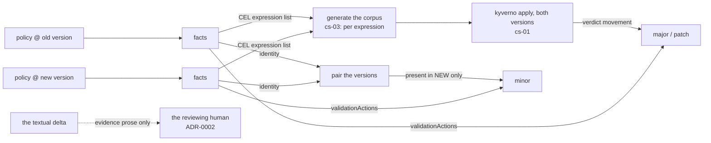

# Spike: does the rule-set delta need `extends` to be readable?

> **Scope note.** This spike answers the NARROW question: does a policy version need to extend **its
> own predecessor**? That is intra-policy DRY, and the answer below stands. It is **not** the question
> cs-06 meant. The intent was cross-party composition, where a party inherits from **other parties**.
> That is [`spikes/cs-06b-cross-party-composition/`](../cs-06b-cross-party-composition/), and its
> answer is different: composition does **not** leave the map.

**Question ([cs-06](/.scratch/computed-semver/issues/06-does-inheritance-earn-its-place.md)).**
Computing a policy bump means comparing a candidate version against its predecessor. The estate
duplicates instead of inheriting: `distribution/policies/v2.0.0/require-nonroot.yaml` copies `v1.0.0`'s
CEL byte for byte, hand-edits the version string in four places, and appends one rule. Does the gate
need source-level inheritance to read that delta, or is a diff of the rendered artefacts enough?

**Verdict: a rendered-artefact diff is ENOUGH. Inheritance leaves this map.**

The reason is not that the diff is clean. The gate never classifies from the delta.

## Run it

```sh
./run.sh
```

No arguments and no setup. Section 4 reads the live estate through `.estate-clone/`. It SKIPs if you
have not run `../../clone-estate.sh`. Everything else runs on the fixed material in `material/`.

## What the two paths are

| | Path A | Path B |
|---|---|---|
| Source | today's flat per-version files | one file per policy, each version declares its delta |
| Delta | recovered by diffing two rendered bodies | read straight off the source |
| Files | `material/flat/` | `material/extends/require-nonroot.yaml` + `render()` |

`material/flat/` is fixed input, copied verbatim: the `require-nonroot` pair from the `platform` repo,
and the `department-label` / `known-department-label` / `owner-annotation` line from
[cs-01](/.scratch/computed-semver/issues/01-rederive-the-known-good-bumps.md)'s own corpus, which is
the release line a human already got right and live-proved.

## What it shows

**Both paths return the same delta** for the pair cs-06 names. Path B renders down to the committed
flat files, parsed-equal, so the hard constraint holds: each version still self-scopes through
`matchConditions`, and multi-version coexistence is untouched.

**The gate does not consume the delta.** It consumes four things, and only one of them is a
comparison:



- **major** and **patch** come from verdict movement on the corpus, not from the delta.
- **minor** comes from presence plus `validationActions`, which cs-01 proved is the only way to see
  it. That is a set difference over identities, not a delta.
- The **corpus generator** wants the list of CEL expressions on each side. A list, not a delta.
- The delta is evidence prose for the reviewer. Imprecision there costs a noisy evidence line, not a
  wrong bump.

## Findings the release gate has to carry

1. **Parse the YAML. Never text-diff.** A raw text diff of the `require-nonroot` pair changes 30
   lines. 19 of them are comment prose. Parsing removes all of it at no cost.
2. **The identity label is a family name, not a unique key.** Section 4 reads the live estate:
   `graded-enforcement` and `posture` each group several different policies that carry no version
   label. The pairing key must be `(identity, name-with-version-stripped)`, and an unversioned member
   must fail the gate rather than pair by accident. This sharpens cs-03's "five live policies carry no
   version" finding: they do carry the identity label, which is exactly what makes a naive pairing
   silently wrong.
3. **Compare rules as a set.** Adversarial case 2 swaps two rules and changes nothing else. A
   positional compare reports 2 added and 2 removed. A set compare reports nothing.
4. **A version-literal difference is UNPROVEN, not a change.** Adversarial case 1 is a policy whose
   approved image tag happens to be `1.0.0` at both policy versions. Normalising the version string
   turns that unchanged rule into a false positive. Path A cannot tell "the version" from "a value
   equal to the version".

## If inheritance ships anyway

It is a real DRY win and it is a separate effort. This spike leaves it two things:

- **The minimum shape is three ops**: `actions`, `addValidations`, `replaceValidations`. That covers
  the estate's entire real release line, including the Audit to Deny promotion and the enum widening.
- **Source level only, and it renders.** `render()` proves the flattening to today's per-version
  `matchConditions` self-scoping. Runtime inheritance stays ruled out, because `objectSelector` is
  flattened into one shared webhook and breaks multi-version coexistence.

Path B is also immune to findings 3 and 4, because rules carry an `id` and the version is a
`{{version}}` placeholder rather than a literal to guess at. That is an argument for inheritance. It
is not an argument that the gate needs it.
