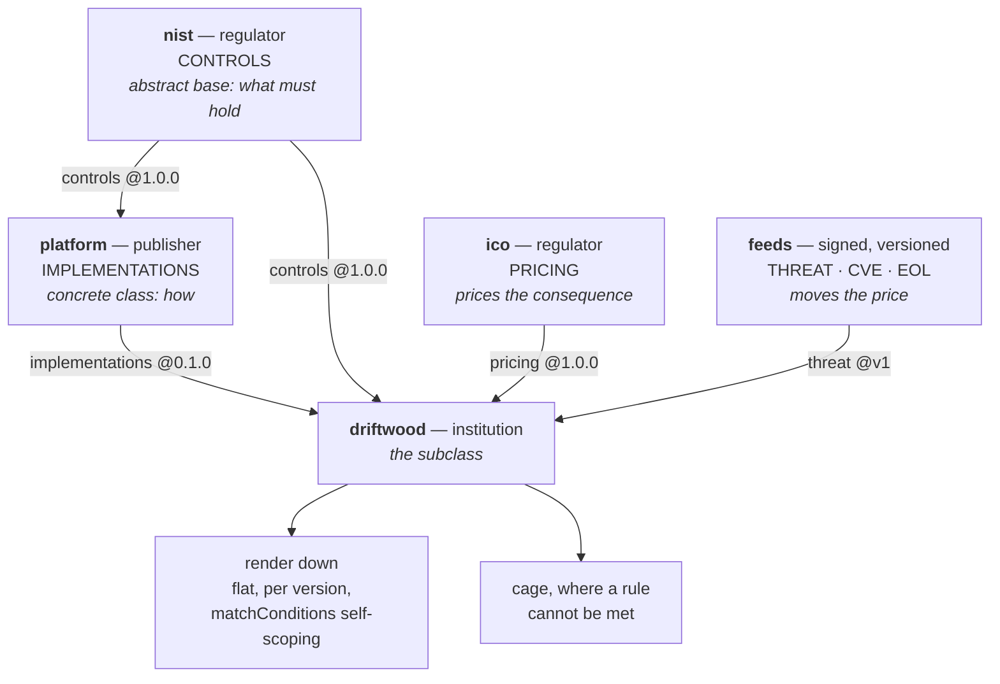

# Spike: cross-party policy composition

**Question.** Can a party's effective policy set be **inherited from other parties**, the way a class
inherits, so policy is a dependency you extend and mash up rather than only pin? And does the result
still render down to what Kyverno runs today?

Ticket: [`policy-composition/01`](/.scratch/policy-composition/issues/01-does-composition-hold-up.md).

This replaces the question [`cs-06`](/.scratch/computed-semver/issues/06-does-inheritance-earn-its-place.md)
originally wrote down. That ticket asked whether a policy version needs to extend **its own
predecessor**. That is intra-policy DRY, and
[`spikes/cs-06-inheritance-vs-diff/`](../cs-06-inheritance-vs-diff/) answers it. The intent was always
cross-party.

**Verdict: composition is a real and missing layer.** It changes what "the candidate version" is, so
the gate computes the bump **after** composition. That single fact stays on the `computed-semver` map.
Everything else here is its own effort.

> This write-up was rewritten after an adversarial review. Where an earlier draft overclaimed, the
> claim is withdrawn in place rather than quietly deleted. Look for the paragraphs beginning "An
> earlier draft".

## Run it

```sh
./run.sh
```

It reads what `platform` really publishes from `.estate-clone/platform`. Run `../../clone-estate.sh`
first. It SKIPs with exit 0 if the clone is absent. It self-checks, so it fails if the logic breaks.

## The model

The class analogy maps onto the estate as it already is. Only the inheritance **edges** are new.



Parents are of **different kinds**, and that is the part a flat pin model cannot express. `ico` and
the feeds contribute no rules at all. One contributes the price of a consequence. The other moves that
price.

Both `nist` edges are real today. `platform/oscal/component-definition.json` cites the `nist`
catalogue. `driftwood/gitops/flux-system/gotk-sync-nist.yaml` pins it directly. **That is the diamond,
live, not hypothetical.**

Three things the analogy gets right and a flat pin model does not:

- A **control** is an abstract method. It says what must hold and never how.
- An **implementation** satisfies it. A composition can then be checked for unimplemented controls.
- Parents are **not all the same kind**. Forcing every parent into one rule hierarchy cannot hold the
  pricing or the threat feeds.

And one place the analogy **breaks, correctly**: there is no override. See the caging section below.

## What it found in the estate as committed

These four fell out before any scenario ran. Composing is what makes them visible.

| # | Gap | Needs composition? |
|---|---|---|
| 1 | `cm-6`'s only claimed evidence is `require-policy-version`. **No `ValidatingPolicy` of that name exists.** The real guard is `policy-version-orphan-guard`. The name appears only in `oscal/component-definition.json` and in a hand-authored fixture `PolicyReport`, which is why the up-flow passes. | **No.** A lint finds it. |
| 2 | `ac-6` claims `may-run-root-if-attested`. It is real, but it lives in `policy/policies/` and `versions.yaml` only reconciles `./distribution/policies/v<version>`. **Flux never installs it.** | **No.** A lint finds it. |
| 3 | The component definition writes `nist-800-53:AC-6`. The catalogue writes `ac-6`: different case **and** no prefix. Exact matching resolves nothing. **Latent**, not live: nothing in the estate resolves one against the other today. | It breaks the resolver this spike proposes. |
| 4 | **Nothing declares a baseline.** `nist` ships 1196 controls. The estate implements two. Nothing says which are claimed. | **Yes.** This is the one that needs it. |

Be exact about what composition adds. Gaps 1 and 2 are dangling references that a plain lint of the
component definition against the policy trees would also find. **Only gap 4 needs composition**: a
baseline is what catches a *required* control that nothing claims at all, which is the `ac-6.10` case
in the scenarios below.

Gap 3 comes with a caveat against this spike's own work. `compose.py` folds case to proceed, but it
folds it against **its own** baseline in `material/parties/nist.yaml`, which was hand-authored in the
prefixed form. The cure is untested against the real catalogue.

Gap 2 is reported as **OVERCLAIMED**, not uncovered. `ac-6` is still covered by `require-nonroot`. The
claim is wider than the reality. It becomes uncovered the moment `require-nonroot` moves trees.

Composition also surfaces the map's own open question. Version `1.0.0` is declared by **two trees**,
`distribution` and `policy`. Both self-scope on `policy-version: 1.0.0`, so both would judge the same
pod. Only one installs.

## Scenarios

| Scenario | Result |
|---|---|
| `nist` bumps, `platform` does not | Refused twice. The diamond splits, **and** the new `ac-6.10` has no implementation. Upstream this bump only adds a control. Downstream it breaks the build. |
| Both parents move together | The diamond closes. The uncovered control does not. Aligning pins was never the fix. |
| `platform` retires version `1.0.0` | `driftwood`'s workload pins `1.0.0` and becomes an orphan. **No policy body changed.** No diff of any rule shows it. For `platform` it is one array element. For `driftwood` it is a major. |
| A subclass cannot meet an inherited rule | It is **caged**, priced against its own band. See below. |
| A pricing or threat parent is bumped | The price moves. The decision does not. See below. |
| The component ages past its EOL date | A **proposed** tighter tier. Applying it would break `ADR-0006`. |

## What this prototype does not do

Named here so nobody reads more into it than it earns.

- ~~**The composed set is 3 policies, not the 8 live ones.**~~ **Closed by ticket `06`.** Section 11
  composes the whole live set. See *Section 11* below.
- ~~**The orphan refusal is simulated.**~~ **Closed by ticket `06`.** Section 11 composes the real
  guard, rendered from the array by the estate's own `render-orphan-guard.py`. Section 7's scenario
  still uses the list-membership check.
- **The rule-conflict refusal is untested across parties.** One implementations publisher exists.
- **There is no proposer.** Section 9b prints a proposed tier. Nothing raises the PR.
- **Nothing is signed.** Each party signs its own artefact. A composed set is a new artefact, and the
  render must be reproducible from signed parent digests or a verifier loses the chain. Not addressed.

## Section 11 — the whole live set (ticket `06`)

Added when [`policy-composition/06`](/.scratch/policy-composition/issues/06-composing-the-remaining-policies.md)
was resolved. The estate had moved since the first pass, so the spike is re-run against it as it is
now, not as it was.

**The ticket's premise is out of date, and the estate closed it.** `cs-03` counted five unversioned
live policies. `cs-12`'s `render-version-tree.py` now emits four of them — `cage-tier`, `cage-netpol`,
`stamp-posture`, `posture-trust-boundary` — into every version tree, self-scoped on the claim. They
compose exactly as `require-nonroot` does and render back down byte-identical.

**The fifth cannot be versioned, and that is correct.** The orphan guard is the aggregate over the
version array, so it cannot self-scope to one claim. `cs-22` gave it the `platform-machinery`
identity: numbered by the platform tag. Composition carries a second numbering axis rather than
forcing it onto the first.

| member | family | kind | declares |
|---|---|---|---|
| `require-nonroot` | `require-nonroot` | ValidatingPolicy | `3.0.0` |
| `posture-trust-boundary` | `posture` | ValidatingPolicy | `3.0.0` |
| `stamp-posture` | `posture` | MutatingPolicy | `3.0.0` |
| `cage-tier` | `graded-enforcement` | MutatingPolicy | `3.0.0` |
| `cage-netpol` | `graded-enforcement` | GeneratingPolicy | `3.0.0` |
| `policy-version-orphan-guard` | `platform-machinery` | ValidatingPolicy | — (platform tag) |

All six render back down faithfully. Three findings came out of composing them.

1. **An action is a `ValidatingPolicy` concept.** `render()` wrote `spec.validationActions`
   unconditionally, which invents a field on a mutate and a generate. Fixed. The consequence is
   larger than the fix: the `Audit < Deny` ladder that `overlay.restate` compares on has no meaning
   for three of the six members. A subclass cannot tighten a mutate.
2. **The identity label is a family, not a key.** `graded-enforcement` covers five objects and
   `posture` covers two. `load_publications` keys on `(label, version)`, so a second member of one
   family overwrites the first in silence. It has not fired only because one `ValidatingPolicy` per
   family per version exists. `cs-22` settled the cure for the gate; the resolver needs the same key.
3. **Two of the members mutate, so ordering is now observable.** `stamp-posture` writes the label
   `posture-trust-boundary` validates. `cage-tier` writes the label `cage-netpol` generates from. A
   flat per-version render does not express that. Kyverno's webhook ordering is what makes it work.

Two other things the re-run found, both facts about the estate rather than about composition.

- **Gap 2 changed shape.** `cs-16` deleted `policy/policies/` and folded `may-run-root-if-attested`'s
  widening into `require-nonroot@2.0.1`. `ac-6` still claims `may-run-root-if-attested`, which now
  exists nowhere. The gap moved from OVERCLAIMED-because-uninstalled to the same shape as gap 1.
- **The same-version-two-trees question is closed.** The collision is gone because the tree is gone.
  `cs-22` kept the gate rule that refuses it, so a reappearance still fails.

One honest limit. Five of the six compare against a committed file. The orphan guard has no committed
rendered form, so its row compares against the estate's own twin's output. That proves composition
carries it unchanged. It does not prove the twin matches what flux-operator renders in-cluster.

### One finding outside the four, and it is the largest

`CONTEXT.md:129` defines the orphan guard as denying any workload whose `policy-version` label is
"**missing or not in**" the installed version set, and says that is what "closes the original's
silent-ungovernance gap".

The committed guard does not do the first half. Its `matchConditions` in `distribution/versions.yaml`
require the label to be **non-empty** for the policy to match at all. An **unlabelled** pod is
therefore unmatched, and admitted. I grepped the whole platform repo: nothing else denies an
unlabelled pod, and `require-policy-version` — the policy `CM-6` names for exactly this — is gap 1,
the one that does not exist.

So the ubiquitous language and the committed code disagree, and the gap the design exists to close is
open. I am not asserting which side is wrong. `cs-02` and `cs-03` both recorded that
COTS/unversioned workloads are a permanent population needing their own effort, so the exclusion may
be deliberate and `CONTEXT.md` stale. Either way it needs a decision, and it is not this spike's to
take.

## What this does to the bump

- The bump is a property of a **composition**, not of a file.
- `cs-01`'s method is **extended, not unchanged**. Its verdict-movement half works as-is on the
  composed old and new sets, because composition is rendering. But a composition also refuses on
  **coverage** — an uncovered control, a split diamond — with zero verdict movement. That is a second
  structural axis, exactly as `cs-01`'s minor finding was a first.
- The publisher still tags **one** bump, computed at the strictest band, with the per-institution
  matrix as evidence. `cs-02` settled that and it is not reopened. What composition adds is the
  mechanism **behind** that matrix: the per-adopter computation the matrix reports.

## A subclass never overrides. It gets an informed cage.

This is where the class analogy stops, and it stops in the estate's favour. There is no
most-derived-wins branch and no exemption. A subclass that cannot meet an inherited rule **declares the
inability**. It does not edit the rule, and it does not ask a favour.

The prototype then calls the estate's own `graded/cage.py`. That engine prices the residual against
**that party's** appetite band from `risk/appetite.json`, and picks the loosest cage whose residual
fits. Deny is the bottom rung, reached by the money.

Same rule, same declared inability, three parties, priced from the estate's own
`policy/scenarios/driftwood-root-residual.json`:

| party | band £/yr | tier | residual | + controls | = TCoR |
|---|---:|---|---:|---:|---:|
| `driftwood` | 40,000 | `baseline` | 14,952 | 500 | 15,452 |
| `tuppence` | 15,000 | `baseline` | 14,952 | 500 | 15,452 |
| `ludlow` | 5,000 | `quarantine` | 1,709 | 6,000 | 7,709 |

The band is compared against the **residual**, not the TCoR. The cage's own run-cost is a booked cost,
not retained risk.

That is proportionality. Nobody asked, and nobody was granted anything.

Two things that table does **not** prove. `tuppence` fits `baseline` by about £48 on a Monte-Carlo
output, so one knob twitch flips it. And the rule it cannot meet is `may-run-root-if-attested`, which
gap 2 proves the version array never installs. The mechanism is sound. This particular subject is not
yet real.

### This settles one case, not the general one

Caging settles a **child that cannot meet a parent**. It says nothing about **two parents whose rules
disagree**, which is the case override semantics exist for. An earlier draft of this spike claimed
"the diamond needs no override rule: divergence is priced, not merged". That sentence fused two
different mechanisms and is withdrawn. The conflict is **refused**; what is priced is not the conflict.

`compose.py` now detects a rule supplied by two sources with different content and refuses rather than
taking the last one silently. It is **untested across parties**, because the estate has exactly one
implementations publisher. It fires today only on the two trees inside `platform`, which is the same
disagreement one level down.

### Informed means the price has parents too

A penalty schema, a threat register, a CVE feed and an EOL feed are parents of their own kinds:
signed, versioned, pinned, and none of them ships a rule.

Section 9 proves the wiring by bumping `ico`'s penalty schema through **`ico`'s own converter**, on the
`uk-gdpr lower-tier` entry that `v2` actually changed:

| source | uncaged exposure | decision |
|---|---:|---|
| `ico` penalty-schema `v1` | £16,901,472 | Deny |
| `ico` penalty-schema `v2` | £9,039,791 | Deny |
| `threat-register v1` (tuppence) | £222,574 | Deny |
| `threat-register v2` (tuppence) | £326,139 | Deny |

**The price moves. The decision does not.** Every subject sits far over every band in the estate. So on
the estate's real feeds and real bands, no feed bump changes a cage decision. The wiring is proved. The
outcome claim is not.

### The line this model must not cross

The EOL feed is time-varying, so the same `python-3.9` workload prices `baseline → restricted →
quarantine` as it ages, with nothing edited at all.

An earlier draft called that "the cage tightens on its own" and treated it as a feature. **That would
violate a decided ADR.** `ADR-0006`'s later extension allows timed nudges only "as long as nothing
timed ever changes an admission verdict on its own, and every resulting change still lands via a
reviewed, human-merged PR". `ADR-0010` is named for the same rule: sunset is scheduled **proposals**,
not application. And `cs-02` settled that the cage **spec is** the verdict.

So a self-tightening cage is a timed verdict change, and it is forbidden. Each row is a **proposed**
tier for the agent governance layer to raise as a reviewed PR. It prompts editorial review. It never
edits enforcement. This spike does not implement the proposer.
