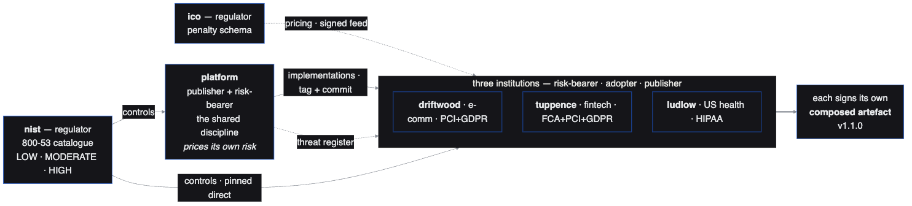
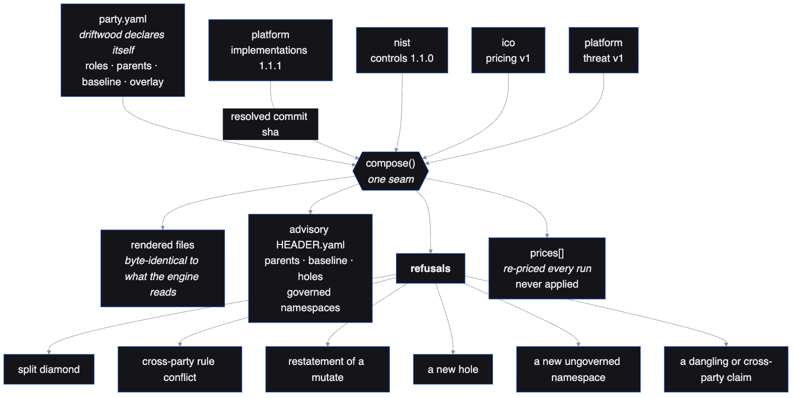
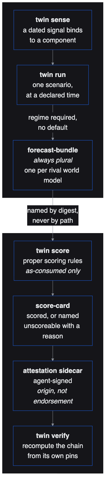

<!-- GENERATED FILE. Do not hand edit: talk/build_deck.py overwrites it from
     talk/captures/ and talk/narration.json, and talk/verify-demo.sh grades the
     deck it rebuilds, not the file you edited. Prose: talk/narration.json. -->

# The eco-system, read from its own truth surface

### Seven steps, each carrying the grade its own check gave, in the check's own words.

built 2026-08-29T05:14Z during run **local** (a local run, not the scheduled one) · hub `00ecffc`. Each beat quotes the capture on disk for its own check, and carries the grade that capture gave.

`talk/truth.log` records no run of the truth surface at this commit, so this deck quotes no headline number. The beats below carry their own grades, each read out of the capture named on the slide. An earlier run's line describes an earlier set of checks and is not comparable, so it is not shown.

<!--
Everything on the slides that follow was read out of one run of one command. Not a screenshot I took on a good day, not a diagram of how it ought to work: the actual output of the checks, quoted, with the verdict the run gave. Where a step could not be looked at, the slide says so and prints the reason the check itself gave. I would rather show you a red cell than a green one I cannot stand behind.
-->

---

## How to read this deck

Every figure on a numbered slide is read out of `talk/captures/`, one file per check, written by the truth surface on the run this deck names. Nothing is retyped, and a slide that is not a numbered step carries no figure at all — there would be no capture behind it.

Three outcomes, and only three: **observed true**, **could not look**, **observed false**. A check that could not look prints its own reason, in its own words — never a reason the deck made up on its behalf.

A step with no capture in the run renders as **no check yet, owned by ticket NN**, and only where the check has genuinely not been written. A check that exists and produced no output is a missing observation, and the deck is refused.

`talk/build_deck.py` writes this file. `talk/verify-demo.sh` runs those refusals over the **committed** file as well as over a fresh rebuild: a status that disagrees with the run, a cited capture that is missing, a headline quoted from another commit, or a figure that is not a figure in the capture behind it, and the deck does not ship.

<!--
One habit runs through the whole deck. I never type a number onto a slide. The generator reads it out of the capture the check wrote, and a second script refuses the deck if a figure appears that the capture does not contain. That is not a discipline anyone can keep by hand, which is exactly why it is a script.
-->

---

## Who publishes what, to whom



Pre-rendered from `talk/diagrams/estate.mmd`, drawn on the twenty-fifth of August. Two parties have joined the eco-system since it was drawn and are not on it: the intelligence publisher and the insurer. It is a picture of the dependency direction, not a read of the truth surface.

<!--
Regulators publish controls and penalties. A platform publishes implementations. Adopter organisations compose what they inherit into their own signed artefact. Nothing here is a tenant of anything else: each party lives in its own organisation, ships on its own cadence, and is consumed only through a pinned, signed dependency. Two more parties have joined since this was drawn, so treat it as the shape, not the census.
-->

---

<!-- beat step=1 status=SKIP cited=yes script=verify/e2e/verify-e2e-step1-regulator-publishes.sh capture=talk/captures/verify_e2e_verify-e2e-step1-regulator-publishes.out -->

## 1 · A regulator publishes a new penalty schema version

**could not look** — ico/penalty-schema@3.0.0: waiting for tag v3.0.0 on ico (cut by cut-release.yml after merge)

```text
$ bash verify/e2e/verify-e2e-step1-regulator-publishes.sh
E2E step 1 regulator publishes
PASS: ico/penalty-schema/v3/feed.json: envelope valid (feed/penalty-schema 3.0.0)
PASS: ico/penalty-schema/v3/feed.json: payload vs penalty-schema/payload.schema.json
PASS: ico/penalty-schema/v3/feed.json: bump.yaml bump=major
```

<!--
The regulator publishes a machine-readable penalty schema, under the same feed envelope everything else in the eco-system publishes under. The envelope validates, the payload validates against its own schema, and the version bump was computed rather than declared. The signature is the honest half: a signed tag can only be cut by the release workflow on the real remote, after a human merges. Until that happens this step says it is waiting, and names the tag it is waiting for.
-->

---

<!-- beat step=2 status=PASS cited=yes script=verify/e2e/verify-e2e-step2-renovate-pins-and-reprices.sh capture=talk/captures/verify_e2e_verify-e2e-step2-renovate-pins-and-reprices.out -->

## 2 · Renovate raises the pin; the composition re-prices

**observed true** — a merged pin bump (threat-register v1 -> v2) re-prices tuppence's prices[] through composition (222,574.31 -> 326,139.13), offline, with no repo touched

```text
$ bash verify/e2e/verify-e2e-step2-renovate-pins-and-reprices.sh
    driftwood pins feeds/threat-register at v1; v2 is on disk
    threat-register v1 -> v2: 19,558.55 -> 19,558.55 (tier baseline -> baseline, changed=False)
    note: v2's payload prices driftwood exactly as v1 did; what moved is the recorded pin, not the
      number — not a re-price, looking on
    ludlow pins feeds/threat-register at v1; v2 is on disk
    threat-register v1 -> v2: 318,229.78 -> 318,229.78 (tier isolated -> isolated, changed=False)
    note: v2's payload prices ludlow exactly as v1 did; what moved is the recorded pin, not the number —
      not a re-price, looking on
    tuppence pins feeds/threat-register at v1; v2 is on disk
    threat-register v1 -> v2: 222,574.31 -> 326,139.13 (tier isolated -> isolated, changed=False)
```

<!--
A bot raises the pin in one adopter and a human merges it. What happens next is the point: the adopter's own composition re-prices its exposure against its own size, its own customers, its own regulators. Three adopters take the same feed and get three different answers, and for two of them the new payload prices them exactly as the old one did. The slide says so, in the check's own words, rather than pretending every bump moves money.
-->

---

## What did the re-pricing



Pre-rendered from `talk/diagrams/compose.mmd`, drawn on the twenty-fifth of August. The refusals shown are the ones composition implemented then.

<!--
One seam. The adopter's declaration goes in, its parents go in at resolved commits, and out come the rendered files, an advisory header, the prices, and a short list of refusals. The prices are recomputed every run and never applied by the machine: they are an input to a reviewed pull request.
-->

---

<!-- beat step=3 status=PASS cited=yes script=verify/e2e/verify-e2e-step3-price-crosses-band-pr-opens.sh capture=talk/captures/verify_e2e_verify-e2e-step3-price-crosses-band-pr-opens.out -->

## 3 · The price crosses a band, the cage tier moves, a proposal opens

**observed true** — a SYNTHETIC residual placed either side of driftwood's own signed appetite band of 40,000 GBP (20,000.00 -> 58,269.23 GBP, not driftwood's real priced position) selects baseline -> restricted through driftwood's own selection-policy package 1.0.0 (which platform/graded/cage.py agrees with), and the proposer would open a pull request editing posture.acme.io/tier on gitops/apps/namespace.yaml, driftwood's governed Namespace declaration -- the pod label is that declaration's output and is left alone (python half; the tier landing in force is step 4)

```text
$ bash verify/e2e/verify-e2e-step3-price-crosses-band-pr-opens.sh
E2E step 3 price crosses band and PR opens
    driftwood band 40,000 GBP (its own party.yaml), selection policy 1.0.0
      (driftwood/selection-policy/VERSION)
    residual 20,000.00 -> tier baseline; 58,269.23 (crosses the band) -> tier restricted
    proposal: branch wargamer/retune-tier-driftwood-cage-tier-ico-feed, pull_request, landed=dry-run
    would declare posture.acme.io/tier: restricted on gitops/apps/namespace.yaml (the governed
      Namespace); the pod manifest is untouched; nothing opened, nothing written
```

<!--
The adopter published an appetite band. A residual crosses it, and the tier the workload runs under moves up a rung, through the adopter's own versioned selection policy. Then the machine stops. It opens a pull request against the governed namespace declaration and waits for a human. Nothing timed ever changes a verdict on its own, and the pod is not touched: the label on the pod is an output of the namespace declaration, not a thing anyone edits.
-->

---

<!-- beat step=4 status=SKIP cited=yes script=verify/e2e/verify-e2e-step4-flux-reconciles-cage.sh capture=talk/captures/verify_e2e_verify-e2e-step4-flux-reconciles-cage.out -->

## 4 · Flux reconciles the new cage spec onto the cluster

**could not look** — Flux reconciles driftwood at its pinned revision, but the cage is not in force: driftwood's own workload checkout-svc is not Running in governed Namespace driftwood (phase='absent'), so no pod this step owns carries the cage [ticket 26]; source is http://git-server.flux-system.svc.cluster.local/cgi-bin/git/driftwood.git, not the adopter's signed tag on the real remote [ticket 40]

```text
$ bash verify/e2e/verify-e2e-step4-flux-reconciles-cage.sh
E2E step 4 flux reconciles the new cage spec onto the cluster
  ok  source Ready at the pinned commit: tag=v1.0.0 sha1:babab55cebc92d942bfaf0e9d3373ada932741a5
  ok  Kustomization Ready, lastAppliedRevision == the source revision
  ok  governed Namespace driftwood is in the Kustomization's inventory
  ok  served cage policy in force live: cage-tier-4-0-0
  ok  governed Namespace driftwood declares tier 'isolated'
```

<!--
This is the step where the price becomes a constraint on a running workload, and it is the step whose green I will not read to you off my own laptop: a number produced on the presenter's machine is a second clock, and a second clock is how a demo drifts away from the thing it claims to describe. So a pass here is filled in by the scheduled run and by nothing else. What you are reading is not that rule biting, though. It is the check's own verdict, in its own words: Flux really does reconcile driftwood at its pinned revision, and two named things are still missing before the cage can be called in force. The slide prints both, because they are the honest state of it.
-->

---

## The twin's loop



Pre-rendered from `talk/diagrams/twin-loop.mmd`, drawn on the twenty-fifth of August.

<!--
A dated signal binds to a component. One scenario runs, at a declared time, under a regime that has to be named because there is no default. Out comes a bundle of forecasts, always plural, one per rival world model. They are scored under proper scoring rules against what actually happened, and the score card is signed by an agent identity that attests the absence of a human.
-->

---

<!-- beat step=5 status=PASS cited=yes script=verify/e2e/verify-e2e-step5-twin-forecasts.sh capture=talk/captures/verify_e2e_verify-e2e-step5-twin-forecasts.out -->

## 5 · The twin plays a dated signal forward and is scored

**observed true** — the twin's overlay, feed, 6 scenarios and signal lookup are all present, and its own evals scored them: PASS: 7 skill metrics, exactly the set twin/skill-thresholds.yaml declares, at their thresholds and none fallen, three real-firm beats, identical bytes on this architecture, and every published feed envelope binding to one dated signal

```text
$ bash verify/e2e/verify-e2e-step5-twin-forecasts.sh
E2E step 5 twin forecasts
  ok  driftwood/twin/orgs/driftwood/meta.yaml (the adopter's own overlay)
  ok  driftwood/twin/world/ (the world layer, vendored)
  ok  driftwood/twin/forward-intel/v1/feed.json (the feed the estate consumes)
  ok  6 standing scenarios in driftwood/twin/orgs/driftwood/scenarios
  ok  driftwood/twin/signals.yaml (the pin -> standing-scenario table)
  ok  twin/feed_signal.py (the pinned-feed-version -> dated-signal lookup)
  ok  verify/twin-evals/verify-twin-evals.sh (the twin's evals graded by the gate)
```

<!--
The twin sits above the adopter, not inside the platform. It has the adopter's own overlay, a set of standing scenarios, and a lookup from a pinned feed version to the dated signal that justifies it. It publishes forward intelligence as a feed the platform consumes, on the same envelope as everything else. And its own skill is graded by the truth surface, which is the part that matters: a forecaster that is never scored is decoration.
-->

---

<!-- beat step=6 status=PASS cited=yes script=verify/e2e/verify-e2e-step6-provenance.sh capture=talk/captures/verify_e2e_verify-e2e-step6-provenance.out -->

## 6 · Provenance: every step verifiable in the transparency log

**observed true** — every artefact the slice publishes reaches a signed tag or is honestly queued, and 6 of 8 anchored identity regexps matched a real Fulcio cert subject with its Rekor entry validated, and feeds insurer have no signed tag yet

```text
$ bash verify/e2e/verify-e2e-step6-provenance.sh
E2E step 6 provenance
  ok   73 published artefacts resolve to a tag on the publisher's real remote; 7 honestly queued for
    cut-release.yml
  ok   8 release workflows pin an anchored, own-repo identity regexp at the Actions OIDC issuer
  ok   driftwood v1.1.0: real cert subject matches the anchored regexp, Rekor entry validated
  ok   ico v1.0.0: real cert subject matches the anchored regexp, Rekor entry validated
  ok   ludlow v1.1.0: real cert subject matches the anchored regexp, Rekor entry validated
  ok   nist v1.1.0: real cert subject matches the anchored regexp, Rekor entry validated
  ok   platform v1.1.1: real cert subject matches the anchored regexp, Rekor entry validated
  ok   tuppence v1.1.0: real cert subject matches the anchored regexp, Rekor entry validated
  ok   no signed tag yet, honestly queued for cut-release.yml: feeds insurer
```

<!--
Every artefact the slice publishes reaches a signed tag, or is honestly queued for the workflow that will cut one. Each release workflow pins an anchored identity regular expression at the Actions issuer, so a signature from the wrong repository does not satisfy it. And where a tag exists, the certificate subject was matched against that regular expression and the transparency log entry validated, live. The units with no tag yet are named, not omitted.
-->

---

<!-- beat step=7 status=PASS cited=yes script=verify/e2e/verify-e2e-step7-honesty.sh capture=talk/captures/verify_e2e_verify-e2e-step7-honesty.out -->

## 7 · Honesty: one command reports pass, fail or could-not-look

**observed true** — steps 1-6 each report one honest verdict (verdicts: SKIP PASS PASS SKIP PASS PASS PASS)

```text
$ bash verify/e2e/verify-e2e-step7-honesty.sh
E2E step 7 honesty
  #   step (NORTH-STAR 4)        verdict   why
  --- -------------------------- --------- ---
  1   regulator publishes        SKIP      ico/penalty-schema@3.0.0: waiting for tag v3.0.0 on ico (cut
    by cut-release.yml after merge)
  2   renovate pins and reprices PASS      a merged pin bump (threat-register v1 -> v2) re-prices
    tuppence's prices[] through compositio...
  3   price crosses band pr open PASS      a SYNTHETIC residual placed either side of driftwood's own
    signed appetite band of 40,000 GBP...
  4   flux reconciles cage       SKIP      Flux reconciles driftwood at its pinned revision, but the
    cage is not in force: driftwood's o...
  5   twin forecasts             PASS      the twin's overlay, feed, 6 scenarios and signal lookup are
    all present, and its own evals sc...
  6   provenance                 PASS      every artefact the slice publishes reaches a signed tag or is
    honestly queued, and 6 of 8 anc...
  7   honesty                    PASS      steps 1-6 each report one honest verdict
```

<!--
This is the whole demonstration in one table, written by a different script from the ones it reads. Every step reports one verdict. Where a step could not be looked at, the reason travels with it. This slide is also what refuses this deck: if a beat's status ever disagreed with this table, the check would fail, and the deck would not be shown.
-->

---

## Honesty over green

A check that passes because it could not look is worse than one that fails.

The red and amber cells in this deck are the roadmap. They are generated, they move when the eco-system moves, and no one can quietly retype them.

What the headline counts, and what it does not: the truth surface grades the estate's own verify scripts. It does not run the twin's python test suite, which carries one standing red of its own — the drift window is open and its newest sample is weeks old, a recorded gap, not a surprise. A count is only honest with its scope beside it.

The recording of this talk is a by-product. The deliverable is the run.

<!--
If you take one thing away, take this. A green result that could not look at the thing it grades is the most expensive kind of lie a governance programme can tell itself, because it survives audit. Everything here is built to make that particular lie hard to tell: three outcomes rather than two, the reason travelling with the refusal, and the slides generated from the run rather than from my memory of it. And one caveat I will say out loud rather than bury: the number counts the estate's verify scripts, not the twin's own test suite, which has a standing red about a drift window nobody has sampled recently. It is recorded, it is not fixed, and it is not inside the headline.
-->
