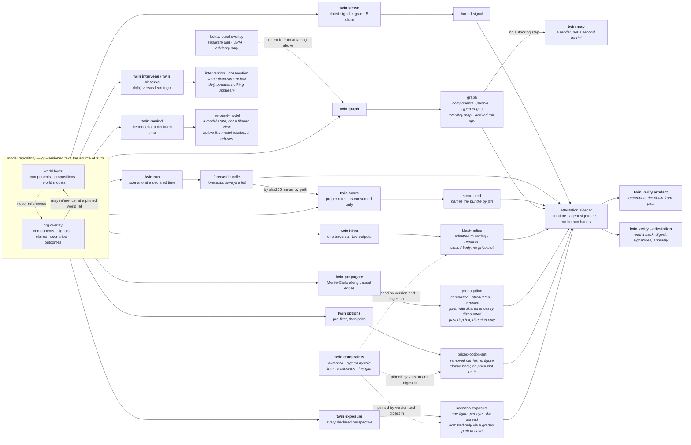

# `twin`

Build tickets 01–08, 10–15, 17–22, 26–29, 35 and 36 of `.scratch/twin/`, plus 23 at `partial` and 64
instrumented and measuring. One dated signal binds to a
component; one scenario execution emits forecasts — plural; one recorded outcome scores them under
proper scoring rules; any artefact recomputes from its own pins. Scoring is in the first slice
rather than retrofitted, because without it we cannot tell whether any later capability helped, and
because scoring dictates what every other component must record.

**This is 26 of 77 build tickets closed, one part-built, and one measuring against a clock that runs
to 2026-11-06.** What is not built is listed below and, more usefully, is named
inside every artefact the tool emits.

## Run it

```sh
bash twin/demo.sh                          # the whole loop, from a clean checkout
./bin/twin verify                          # the invariant suite
./bin/twin verify <artefact> --repo R      # recompute that artefact from its own pins
./bin/twin verify <artefact> --attestation # check its sidecar: digest, signatures, the anomaly
./bin/twin validate --repo R               # every object against its closed schema
./bin/twin graph --repo R --org netflix    # the typed knowledge graph
./bin/twin map --repo R --org netflix      # the Wardley map, rendered from that graph
./bin/twin blast --repo R --origin C       # what is downstream, and which of it may be priced
./bin/twin propagate --repo R --origin C   # compose a shock along causal edges, with attenuation
./bin/twin intervene --repo R --component C # do(x): cut the incoming edges, propagate downstream
./bin/twin observe --repo R --component C  # observe(x): belief updates about the causes too
./bin/twin rewind --repo R --at T          # the model state at a declared time (abduction)
./bin/twin run --repo R --scenario S --regime as-consumed   # the gate is required, with no default
./bin/twin regimes --repo R --scenario S   # the same scenario under all three, with the gaps
./bin/twin drift                           # the Flux drift measurement: coverage, events, no verdict
./bin/twin options --repo R --perspective P # the choice set after the pre-filter, survivors costed
./bin/twin exposure --repo R --scenario S  # one scenario, valued under every declared perspective
./bin/twin constraints --out F             # the published constraint set, floor and exclusions
./bin/twin worksheet --repo P              # the pocket org against its hand-computed worksheet
./bin/twin sign <artefact> --role R        # accountability for an authored artefact
./bin/twin grade                           # computed depth grades, with evidence
```

The tool itself needs only python3, PyYAML and git — all already used by `estate/`. The checks want a
venv, pinned to the same versions CI uses:

```sh
python3 -m venv .venv
.venv/bin/pip install 'pyyaml==6.0.3' 'pytest==9.0.0' 'mypy==1.14.1' 'types-PyYAML==6.0.12.20250516'
.venv/bin/python -m pytest -q
.venv/bin/mypy twin tests conftest.py --ignore-missing-imports --warn-unused-ignores
```

## The loop



Every artefact carries its pins, an authored/derived mark, and the computed depth grade of every
capability that produced it. Machine-varying facts — wall clock, host, interpreter — are absent
from the artefact and live in the sidecar, which is what lets identical pins give identical bytes
across architectures. The signature lives there too, for the same reason: a keyed value in the
envelope would break identical bytes on the first machine holding a different key.

## Two kinds of signature

A **human** signature asserts accountability for a judgement and binds to a **role** from the
versioned register in `twin/roles.yaml`, never to a named individual. An **agent** signature asserts
reproducible origin — runtime and tool version — and states in the artefact what it does *not*
assert: correctness, accountability, human review. The two are refused as a type error before their
values are even checked, so one can never stand in for the other.

The consequence is the interesting half. A derived artefact may carry the second and may **never**
carry the first, so a signature attests the *absence* of human involvement, CI-style. A derived
artefact with human fingerprints on it is a **detectable anomaly** rather than a breach of
convention: `twin verify <artefact> --attestation` reports it, on evidence.

`ponytail:` the mechanism is HMAC-SHA256 keyed from `TWIN_SIGNING_KEY`, and the ceiling is named in
`twin/sign.py` — **a shared key proves possession, not identity**, so anybody holding it can produce
any role's signature. The upgrade is sigstore/gitsign with in-toto subject digests. With no key
present nothing is signed and the sidecar says which variable is missing, rather than carrying a
placeholder that reads as signed.

## Two things the £ rests on, before there is a £

**The evidence ladder** (`twin/evidence-ladder.yaml`) is five typed grades, strongest first, each
with a written admission criterion: dated natural experiment, repeated historical co-movement,
literature or domain theory, calibrated expert judgement, model assertion. The grade travels *with*
the claim, and **only grades 1–2 may price a scored forecast** — grade 5 is exactly where
parametric contamination hides, because an edge a model asserted from training data looks identical
to a well-evidenced one unless something forces the distinction.

A grade is immutable without a **regrade event** recording who moved it and why. Two guards: at
load, the recorded chain must be contiguous and end at the grade the file declares; at `twin
validate`, the file's **git history** is read and every observed change must be covered by a
regrade. Direction is derived and named — `strengthened` (to a lower number) or `weakened` — because
"up" is ambiguous on this ladder, and strengthening is the direction to be suspicious of.

**The constraint set** (`twin/constraints.yaml`, published by `twin constraints`) is the universal
floor, the scope exclusions and the stated positions. The floor is not the operator's to move; a
perspective adds red lines beside it, and one that reuses a floor id does not load. Scope exclusions
name what the twin was *not* asked to model, which does not stop strategic non-modelling but does
remove its deniability. Three positions are required by name — no power layer (stated), exit-cost
asymmetry (unsolved), reflexivity and Goodhart-on-the-twin (deferred) — and covert sensing is
recorded as `permanently-excluded`, which the loader checks is not the deferral beside it.

The pricing threshold ships in the same artefact, because changing what may be priced is the same
kind of act as changing what may be chosen. A **second** threshold ships beside it —
`path_admission_threshold`, the grade a causal path to cash flow must hold before an impact enters
the £ at all. Two numbers rather than one reused, so widening the currency is an act somebody has
to perform and not a side effect of widening the use-gate.

## The pre-filter, and why it is not a very large price

`twin options` reads the candidate responses in an overlay, removes the ones that cross a
constraint in force for the named perspective, and only then costs what is left. The ordering is
the whole point: a price can be outbid, so with enough upside an optimiser finds the number that
buys a monstrous option, and a very large penalty still asserts that a number exists.

The ordering is **structural, not a convention**. Pricing is a method on the pre-filter's own
product, so the module exports no function that would take an unfiltered option and return a
number; and before it prices anything, that product **re-derives the filter** from the constraint
set it carries and refuses if the answer disagrees. The re-derivation is the lock that holds: the
construction sentinel alone was carried straight through `dataclasses.replace`, which is the
ordinary way to copy a frozen dataclass and therefore exactly the innocent refactor it claimed to
stop. A removed option is absent from the priced list and its record is closed to nine string
fields, so it has nowhere to put a figure — as a number or in words.

The pre-filter never reads a cost. That is why no input magnitude brings an excluded option back —
the magnitude is not an input to the decision — and the fixtures price both excluded options at
almost nothing so the property is demonstrable rather than asserted.

Ruin is perspective-relative. `stake-the-quarter-on-one-title` crosses the operator's declared
insolvency boundary and is removed under that eye; the staff council declares a different boundary
and the same option survives under theirs. The universal floor binds both.

## Propagation, and the three numbers it reports

`twin propagate` composes a shock along `influences` edges by Monte-Carlo. Every path reports
three things, side by side and never one instead of another:

- the **composed** triple — the point-wise product of the authored elasticities. Exact arithmetic,
  hand-checkable, and un-attenuated.
- the **attenuated** triple — the composed one scaled by the published depth schedule
  (`twin/attenuation.yaml`, versioned and pinned in the artefact).
- the **sampled** spread — PERT draws through the graph, so uncertainty compounds honestly instead
  of being averaged away. A product of modes is not the mode of a product.

Both the composed and the attenuated numbers stay in the output, because an attenuated figure whose
un-attenuated form was never shown makes the attenuation unfalsifiable.

Past depth 4 a path carries a **direction and no magnitude**. Not a small number — none, and no
`composed`, `attenuated` or `sampled` key to put one in. The path is still named, graded and dated,
because a direction a reader cannot locate in the graph is not a direction. A five-hop elasticity
chain is not a number.

The walk stops one depth past the schedule and reports at most 32 paths per component, ranked
best-evidenced first and truncated second. Simple-path enumeration is exponential in branching
factor: before the cap, a dense eleven-component graph produced a 331 MB artefact from 464 KB of
YAML, and 97% of it was paths carrying no magnitude. Every kind of pruning — depth, path count,
cycle — is disclosed in `traversal`, because an artefact that pruned silently is claiming a
completeness it has not got.

**Structural edges do not propagate.** A `needs` edge claims no mechanism, so nothing composes
along it; that exposure is the blast radius and it stays unpriced.

**Several paths out of one shock are reported separately and never summed** — they share
ancestry, so adding them double-counts. They are **combined**, which is a different operation
(build ticket 21). Each reached component with at least one path inside the attenuation boundary carries a `joint`
figure combined by **noisy-OR**,
`1 - prod(1 - influence)`, with the dependence carried **structurally**: a shared edge is drawn
once per Monte-Carlo trial, so two paths agree exactly to the extent that they share edges. The
stated assumption is that, conditional on the shared edges, the disjoint remainders are
independent; the stated limit is that a common cause the graph does not contain is not modelled
at all. Beside it sits `if_independent` — the same marginals under an independence assumption —
so the discount is a subtraction a reader can take rather than a correction they must accept. A
Gaussian copula on the path outputs was rejected: it needs a correlation matrix nobody in this
system authors, and it would impose a second dependence structure alongside the graph's own.

**`do()` and `observe()` are separate operations with separate types** (build ticket 22).
Observation propagates bidirectionally — learning a fact is evidence about what produced it.
Intervention propagates downstream only and **reports** the target's incoming edges as cut,
because doing a thing does not rewrite its own causes. Nothing is removed from the graph and
nothing needs to be: the walk runs forward from the target, so an incoming edge is never traversed
under either operation. The two downstream halves are byte-identical, and that is asserted rather
than assumed. `twin/primitives.py` gives each its own type, so a swap is
a `mypy` error rather than a runtime surprise, and the emitted intervention is refused if it
carries any upstream belief update at all. An updated ancestor is named, graded and located in the
graph and carries **no magnitude**: inverting an authored elasticity into a diagnostic number
needs a prior over the causes that nothing in this model authors.

**`twin rewind` is Pearl's abduction** (build ticket 35). The repository is the model and git
dates every version of it, so the past is a commit rather than a projection: rewind opens the
repository at the last commit on or before the declared time, and everything downstream reads it
unchanged. That is why `do()` at a past time needs no special case. A filtered view would fail on
the case that matters — it can hide rows added since, and it cannot restore an elasticity that was
later recalibrated, so a backtest through one would score the past with today's numbers.
Rewinding to before the model existed **refuses**, because an empty model is a claim about the
organisation rather than an answer about the model. So does a time that is not ISO 8601: git reads
a date it cannot parse as `now` and hands back the newest commit, so an unvalidated timestamp
would answer a question about the past with today's model and say nothing about having done so.

## The three information regimes, and why the gaps are the point

**`twin run` takes a regime and has no default** (build ticket 36). The regime a default would
pick is the one whose forecasts score, so an omitted flag would be a silent claim to have run
under the honest gate. A scenario cannot declare one either: an authored regime is a default
wearing a different hat, and the schema has no slot for it.

* **`as-consumed`** — only what the twin had ingested by T. Two filters, because there are two
  ways a post-T fact can arrive: the repository is reopened **as it stood at T**, and any fact
  that survives that but is *dated* after T is withheld.
* **`as-knowable`** — everything dated on or before T, whenever it was ingested.
* **`with-hindsight`** — unrestricted.

The differences are the diagnostic, and `twin regimes` computes them rather than leaving three
artefacts side by side for a reader to subtract. `as-consumed` versus `as-knowable` localises to
**sensing** — it was there to be found and we did not have it. `as-knowable` versus
`with-hindsight` localises to **interpretation** — nothing dated by T said it, so reading the
outcome as foreseeable from those facts is hindsight. Wrong under all three localises to the
**model**, and that third figure is reported as **not computed**, with the reason: a forecast here
reads a world model's declared belief and nothing infers it from a signal, so the three
probabilities are identical by construction and a residual of zero would read as "the model is
fine" rather than as "nothing consumes a signal".

**The gate is absence, not screening.** The model is *loaded through* the regime, so a withheld
fact is missing from the overlay the execution reads — there is no post-T fact available to
reference, and referencing one is not a mistake the code could make. A claim goes with the signal
it binds, because a reading of a document the twin did not have is not a claim the twin held.

**A withheld fact that the execution could still have reached is a refusal.** A post-T fact bound
by a claim to a component the scenario forecasts stops the run rather than being redacted from it,
because running a scenario whose subject matter has been redacted answers a different question —
under the one regime whose forecasts score. The answer key is the deliberate exception: it is
dated after T by definition and nothing forecasts it, so it is withheld quietly. Refusing on its
presence would make a backtest impossible in every repository that holds the key it will be scored
against.

Two limits are named in `twin/regimes.py` rather than implied. **The rewind leg needs a repository
that existed at T** — the Netflix subject is dated 2011 and its model repository was built this
year, so `as-consumed` there rests on fact dates alone and the artefact records
`ingestion_history.available: false` with the consequence. Only the regime fixture's commit
history straddles T, which is why the sensing gap needs it. And **a regrade is not date-gated**:
`schema.DATED_FACTS` covers facts about the world, and a regrade is the twin's own record of how
strong a claim is.

## Flux drift: instrumented, and waiting

Build ticket 64 started a clock rather than closing. The spec claims policy-as-code needs
*continuous* proof-of-force; drift between deploys is the candidate justification and it has to be
demonstrated. `estate/driftwood/drift/` is the instrument — a pre-registered window, a probe that
samples the real KinD cluster, and open preconditions with named owners. `twin/drift.py` reduces
the log; `twin drift` prints it. **The verdict is build ticket 65 and this reaches none**: writing
the conclusion into the instrument is how a measurement becomes a demonstration.

Two properties carry the honesty. The window's first commit must predate every sample, checked by
the harness guard `drift_window_was_declared_before_it_was_measured` reading git history — so
"stated up front" is not a claim a reader takes on trust, and a window retuned after the data
looked inconvenient fails the suite. And a probe that cannot reach the cluster **still writes a
sample**, so an outage is a coverage hole rather than a quiet stretch of no drift. `twin drift`
reports coverage before events, because "no drift in 91 days" and "no drift in the hours we were
looking" are different claims and only one is falsifiable.

`twin/calibration.md` is the authoring discipline a triple is *supposed* to come from: a 90%
credible interval with a most-likely value, five steps required by name. Every artefact that
samples pins it by digest, so a step that disappears from the document fails on read rather than
lapsing quietly. **No triple in this repository has been through it** — nothing records an
estimator, a date or a reference class against a triple, so the discipline is enforced as a
document and not as an authoring workflow. That is why build ticket 23 is `partial`.

## Whose £

The £ is perspectival: it belongs to whoever pays to run the twin. A perspective declares who pays,
what they value and their red lines, as an ordinary file in the model repository. `twin exposure`
reports a scenario under **every** declared perspective — naming none does not default to the
employer's, because that would be exactly the unstated firm's-£ the design refuses — and the
per-component spread between them is in the artefact rather than left to whoever runs the diff.

**The use-gate reaches here too — one rule, three jobs.** A valuation carries its own evidence
grade, and only a valuation inside the published threshold carries a figure at all. Anything weaker
is a **register entry**: named beside the number, with no amount, because the schema refuses one at
that grade. That is what stops a perspective declaring "reputation damage = £X", which is the
shadow price decision ticket 09 explicitly rejected. The gate lives at the source rather than in the
output: a grade-5 valuation carrying an amount does not load.

**And a second gate, derived rather than declared.** A well-graded valuation still enters the
figure only when a causal path runs from the component to a cash flow that perspective declared,
with every hop inside the published admission threshold. A perspective says **where its money is**;
nobody says **what is priceable**. So the £ is only ever as wide as the causal layer can justify,
and the answer to "why isn't morale in the £?" is never *"we decided it doesn't count"* but *"no
evidenced causal path yet"* — a falsifiable claim somebody can go and fix. A refused impact comes
back carrying the unpriced structural blast radius, because "connected and unpriceable" is the
answer rather than a gap.

The pocket org demonstrates both gates disagreeing on purpose. `identity-store` carries a grade-2
valuation that the use-gate admits, and no causal edge leaves it, so nothing reaches the operator's
declared cash flow and the figure stays out of the currency. Two different questions, two different
answers, in one artefact.

**The named limit.** A component the perspective declares *as* its cash flow is admitted with no
path and no grade, because it is the ledger rather than a claim about the ledger — and that is the
one route by which an author reaches the £ without evidence. Name `brand-goodwill` a cash flow and
a reputational figure enters with nothing behind it. So every admitted figure carries
`admitted_because`, and `exposure_by_basis` subtotals the declared and the derived halves
separately: a figure resting on somebody's word and a figure resting on a graded path are never
summed into one indistinguishable number. Constraining what may be *called* a cash flow is a
modelling question this code does not answer, and `twin/admission.py` says so.

The admitted figures are **declared valuations, not modelled prices**, and the artefact says so:
the causal layer composes in `twin propagate` and is not joined to the £ until build ticket 30, and
no severity is sampled. `prefilter.applied` is `false` in an exposure rather than implied — there
is no choice set there to filter, because these are valuations of components rather than candidate
responses, and the pre-filter runs in `twin options`.

## The pocket org

Five components, eight edges, named elasticities, two perspectives, three candidate responses, and a
committed worksheet (`twin/pocket-org-worksheet.md`) with every number worked out **by hand** and
the arithmetic shown. `twin worksheet --repo <pocket repo>` checks the emitted graph, blast radius,
exposure, propagation, priced option set, intervention and observation against all sixty-seven lines.

This exists because a refusal test catches a reintroduced **absence** and nothing else. It is
satisfied by a degenerate system: a PERT triple that is present but garbage, a score tagged with the
wrong regime, an elasticity that stops being recalibrated three tickets later. All of those stay
green under every refusal test, and all of them fail here.

Fifty-one lines are computable today and match. Three carry their arithmetic already and name the
build ticket that must make them computable — price at 30. **A pending line whose build ticket has
closed is a failure**, the same shape as an invariant still pending after its activating ticket.
Every subsequent derivation-path ticket adds its own line: that contract is written into the
worksheet, because a ticket that lands without a line here has no yardstick. Build tickets 20, 23,
28 and 29 added fourteen between them — the two PERT means, the attenuation factors and the
attenuated triple at depth 2, the three option counts and the survivor's mean cost, and the three
admission verdicts including the one that is refused.

The un-attenuated propagation lines (24–26) stay in the table beside the attenuated ones (43–47)
rather than being replaced by them, because both must be visible or the attenuation is
unfalsifiable.

The worksheet is `authored` and signed as such. Everywhere else in this system a hand-typed number is
refused; this is the one place a human number is the authority, and the mark is what says so.

## What is honestly built

Depth grades are computed from the acceptance criteria of the owning **decision** ticket. Nothing
reaches `full`, and nothing can be typed as `full`.

| capability | decision ticket | grade | ticked |
|---|---|---|---|
| `domain-model` | 07 | partial | 1 / 7 |
| `causal-layer` | 08 | partial | 1 / 5 |
| `currency-regimes` | 09 | partial | 3 / 6 |
| `provenance` | 14 | partial | 2 / 4 |
| `honest-build` | 20 | partial | 1 / 4 |
| `sense-move` | 11 | partial | 1 / 8 |
| `scenario-engine` | 13 | partial | 1 / 7 |

**10 of 41**, and every artefact carries an overall depth of `partial`, which is the *worst* of the
capabilities that produced it. **Read `partial` as "at least one of N", not as "most of the way
there"** — the strongest capability here stands at three ticks, and five of the seven stand at one.
`./bin/twin grade` prints the denominators.

`currency-regimes` is the one that moved: build ticket 29 made the comparable-remainder boundary
real, and it is ticked because the boundary is now **computed** — an impact enters the £ only
through a graded causal path to a declared cash flow, and there is no field anywhere by which an
author could declare something priceable.

**One** criterion was ticked this round. Four build tickets landed and three of them tick nothing,
which is the honest arithmetic rather than a disappointing one. Several criteria were considered
and left unticked, on the same ground five were withdrawn on in earlier rounds — each rested on
**one clause of a multi-clause criterion**, or on machinery that does not exist:

- **decision ticket 08 AC 2** (intervention **and** counterfactual semantics, incl. structural-only
  paths) — two of its three legs are now built. `do()` and `observe()` have distinct semantics and
  distinct types (build ticket 22), and a structural-only path still composes nothing. The
  **counterfactual** is abduction → action → prediction: abduction landed at build ticket 35 and
  prediction (fast-forward) is build ticket 37, so this stays unchecked and `causal-layer` stands
  at 1/5. Two thirds of a composition is not the composition.
- **decision ticket 08 AC 4** (identification and confounding discipline) — shared ancestry is now
  detected and discounted (build ticket 21), which is the free structural half of decision ticket
  08's Q5: shared ancestors of two paths surface automatically. The authored half — a mandatory
  alternative-explanation field on every grade-1/2 edge — does not exist, so the criterion stays
  unchecked.
- **decision ticket 09 AC 4** (each named incommensurable, incl. where we refuse to price) — the
  register entry now has two distinct reasons rather than one, but existential and tail risk are
  build ticket 24 and the affected-parties register is 61, so "each" is not yet true.
- **decision ticket 09 ACs 5–6** — the objective function and the rival-model spread need a
  trade-off curve across the ensemble, which is build ticket 33.
- **decision ticket 15** has **no capability file at all.** Build ticket 27 published the scope
  exclusions, the power-layer disclaimer, exit-cost asymmetry and the permanent covert-sensing
  exclusion — all from that ticket's *resolution*, none of them one of its five acceptance
  criteria. So none is ticked, and a capability file at 0/5 would be a slot claiming a capability
  existed.
- **decision ticket 07 AC 5** (representation/format reuse-vs-custom **and** authored-vs-derived) —
  the authored/derived split is now structural in four places, but the format decision is recorded
  nowhere in code.
- **decision ticket 07 AC 6** (where £, risk, people, **assets** and signals attach) — people,
  signals and now a declared valuation attach; assets have no schema.
- **decision ticket 14 AC 2's third clause** — an agent signature carries runtime and tool version but
  no model version and no config digest, because nothing here is produced by a model yet.

`./bin/twin grade` prints every unticked criterion by name, and each surviving tick names its evidence
and the build ticket that earned it.

**Scoring and calibration are still outside this ledger.** No capability file is owned by a decision
ticket that governs scoring, so build ticket 08's work does not appear in the 41. That is a hole in the
honesty instrument itself, not a claim that the work is done.

## The invariants

`./bin/twin verify` — 23 pass, 0 fail, 2 pending, 1 skipped and not faked. `pytest -q` — 523 tests
across seams 1 and 2.

| live | pending, with the ticket that activates it |
|---|---|
| `store_rebuildable_from_git` | `price_levels_never_probabilities` (59) |
| `identical_pins_identical_bytes` | `standing_library_covers_committed_classes` (69) |
| `every_artefact_marked` | |
| `every_capability_depth_graded` | |
| `world_never_references_overlay` | |
| `no_collapse_mechanism` | |
| `no_recommended_action_field` | |
| `derived_never_human_signed` (cryptographic) | |
| `only_as_consumed_scores` | |
| `no_special_category_slot` | |
| `grade_5_only_path_never_prices` | |
| `ruin_class_absent_not_priced` | |
| `prefilter_precedes_pricing` | |
| `as_consumed_admits_no_post_T_fact` | |

**The constitution names sixteen invariants and the manifest may not grow a seventeenth without the
constitution changing first.** So build tickets 13, 14 and 11 each *extended* an existing check rather
than adding one — roll-ups with no authored and no stored form onto `store_rebuildable_from_git`, the
refusal to inherit arckit's action bands onto `no_recommended_action_field`, and detection of a planted
human signature onto `derived_never_human_signed`. Each body change cites its authorising decision
ticket in the manifest, which is what `hash_changes_are_authorised` checks.

`grade_5_only_path_never_prices` went live at build ticket 19. It asserts at four depths — the
ladder, the traversal, the **scenario exposure** and the closed bodies — and the scenario leg is the
one that matters: a traversal emits no money, so a gate asserted only there would be asserted only
where nothing could go wrong. It also asserts the **positive** leg as hard as the negative one: a
fully-graded path is admitted. A gate that admits nothing passes every refusal test in the check
while making the system useless, so "is it a gate or a wall" is asked explicitly.

`ruin_class_absent_not_priced` and `prefilter_precedes_pricing` went live at build ticket 28, and
both assert the positive leg as hard as the negative one. The first re-runs the pre-filter with the
excluded option's cost driven to zero and to an absurd number and demands the same verdict, then
checks that the ruin-class option **still survives** the perspective that declares no such
boundary — a filter that removed everything would pass every refusal in the check while making the
tool useless. The second asserts the ordering out of two structural locks rather than a convention:
no free pricing function exists in the module, and a hand-built `Admitted` set is refused. Those
locks are locks and not proofs — Python has no private constructor, so somebody reaching for the
module's underscore-prefixed sentinel can still build one by hand. They stop the innocent refactor
and the accidental reordering, and they make a deliberate bypass something an author has to write
down. The ceiling is named in `twin/options.py` rather than implied.

The first lock is asserted as an **allow-list** on the module's public surface, not as a screen for
price-shaped names. A free function that prices an unfiltered option reopens the ordering whatever
it is called, and a keyword match on `price`, `cost` and `value` would wave through one named
`tally`. So the check names the three functions the module may export and fails on a fourth.

`as_consumed_admits_no_post_T_fact` went live at build ticket 36, and it asserts the
**construction** rather than the outcome: the regime is a parameter with no default and the
scenario schema has no slot for one, so the gate cannot be bypassed by omission; withheld facts
are absent from the overlay the execution reads rather than screened out of it; and a fact dated
after T but committed before it — the one shape the rewind cannot remove — refuses the run when a
claim binds it to a component the scenario forecasts. The positive leg is asserted as hard as the
negative one: the same fixture still forecasts under `as-consumed`, because a gate that refused
everything would pass every refusal in the check while making the regime useless.

Three guards were added to the **harness** instead, because each guards a yardstick rather than the
system: `worksheet_matches_the_pocket_org` (the hand-computed numbers still hold),
`graded_edge_fixture_holds_its_contract` (the generated causal-edge fixture still carries what the £
and skills tracks depend on) and `drift_window_was_declared_before_it_was_measured` (build ticket
64's pre-registration predates its own data, read out of git history rather than promised).

A live invariant that skips counts as a failure, and so does a harness guard that skips without
declaring itself skippable. Pending is the only honest way to not assert something, and it is declared
in `invariants/manifest.yaml` where it can be seen. Two guards may skip, and both say why:
`cross_architecture_determinism` needs the CI matrix, and `hash_changes_are_authorised` needs two
committed versions of the manifest to compare.

The manifest also declares, per invariant, the **field names it refuses** — read from there rather than
from the code, because a check that derives its expectation from the thing it is checking is a tautology
and deleting a refusal would silently shrink it.

One invariant is narrower than its name suggests, and says so in the manifest.
`no_special_category_slot` guarantees there is **no field** for Article 9 data: the schemas are closed,
so compliance is an impossibility of representation. Values are additionally screened against a named
list — but `cohort` and `metric` are free identifiers, so a protected group can still be described in
words nobody listed. That screen is a net, not a proof.

## What a hostile model repository cannot do

The YAML in a model repository is authored by users and may arrive from another tenant, so the reader
treats it as untrusted. It cannot execute code through repository-local git config (`core.fsmonitor`,
hooks), smuggle a git option through a ref or a `world_ref`, expand a YAML alias bomb into the artefact,
pin the world layer to a ref that moves, hide a file from the listing through `core.quotePath`, or hide
a subtree behind a submodule. Each is refused with a sentence, and each has a test. The one thing it
*can* still do is describe a protected group in free text — a cohort or a metric identifier is not an
enumerable space — and put whatever it likes into a signal's own fields, which flow into the artefact
verbatim. An artefact is exactly as sensitive as the model repository it came from.

## What is not built

Named here so the skeleton cannot quietly become the definition of done.

- **Shared ancestry is corrected only where the graph can see it.** The `joint` figure discounts a
  common cause that appears as a shared edge, exactly (build ticket 21). A common cause **outside**
  the graph — two edges independently authored from the same underlying driver nobody modelled —
  is not corrected and cannot be, and the artefact states that limit in `joint.assumption` rather
  than implying the correction is complete. The exact form also stops at ten paths per component;
  past that the figure is sampled only, and the artefact says where it stopped.
- **The counterfactual is two thirds built.** Rewind (abduction) and `do()` (action) exist and
  compose; fast-forward (prediction) does not, so `rewind → play → fast-forward` cannot yet be run
  end to end. (Build ticket 37.) Decision ticket 13's other half — the **information regime** as
  part of rewind — landed at build ticket 36, so `run` now reads the model through the gate. The
  `rewound-model` artefact `twin rewind` emits still records no regime, because a rewind on its
  own is a model state rather than an execution; the regime belongs to the run that reads it.
- **An observation reports no diagnostic magnitude.** `observe(x)` names the ancestors whose belief
  it updates and refuses to put a number on the update, because inverting an elasticity needs a
  prior over the causes that nothing authors. That is a refusal rather than a gap, and it is the
  honest state until somebody authors priors. (Build ticket 22.)
- **Propagation is not joined to the £.** The engine composes elasticities and the currency
  reports declared valuations, and no code path multiplies a severity by a propagated influence.
  The pocket-org worksheet carries the three price lines hand-computed as the yardstick build
  ticket 30 must match, and they are the only pending lines left.
- **No heavy tails, no TVaR, no empirical severity anchor, no trade-off curve.** PERT sampling
  exists and everything above it does not. (24, 25, 31–33.)
- **No triple in this repository has been through the calibration procedure.** `twin/calibration.md`
  is documented, required by name on read, and pinned by digest into every artefact that samples —
  but the elasticities and costs in the fixtures are invented numbers exercising the shape. The
  discipline is enforced as a document, not as an authoring workflow, and nothing checks that a
  human followed it.
- **The use-gate and the admission gate decide admission, not magnitude.** A path is admitted to
  pricing or reported as an unpriced blast radius; a valuation is admitted, held for its grade, or
  held for having no path to cash flow — but no path is ever *priced*, because there is no pricing
  engine. The blast-radius body is closed with no price slot and a register entry carries no
  figure, so both stay true by construction. (30.)
- **The pre-filter reads an authored `crosses` list.** An option declares which red line it
  crosses; nothing infers it. The constraint **set** is the authority on what exists — an id no
  perspective and no floor declares refuses to load — but an option that quietly omits the
  constraint it really crosses survives, and no code can currently tell. The *magnitude* leg is
  airtight, because a cost is not an input to the decision; the *identification* leg is
  self-reported. The artefact says so in `prefilter.known_limit` rather than implying otherwise.
- **A perspective can reach the £ by naming a cash flow.** Admission is derived for everything
  else, but a component named as the ledger itself needs no path and no grade. `admitted_because`
  and `exposure_by_basis` make the two halves separable in every artefact; nothing constrains what
  may be called a cash flow.
- **The Monte-Carlo is reproducible within one interpreter version, not across all of them.** The
  Beta variate is the standard library's, so a different Python may draw a different stream from
  the same seed. The composed and attenuated triples are exact arithmetic and are unaffected. The
  artefact states the condition in `sampler.reproducible_within` rather than claiming more.
- **The evidence-grade history check runs at `twin validate`, not at load.** It costs a git process
  per commit per graded file, so `graph`, `blast` and `exposure` will emit from a repository whose
  grade moved unrecorded. `twin validate` is the gate an author or CI runs, and it exits non-zero;
  nothing stops somebody skipping it.
- **The evidence-grade history check does not follow renames.** Moving a file and changing its
  grade in the same commit reads as a new file at its original grade. Named in
  `twin/evidence.py`; `git log --follow` per file is the upgrade if it matters.
- **The misuse catalogue, the affected-parties register and the disparate-impact audit channel
  are not built.** Build ticket 27 published the scope exclusion that says the system cannot
  currently be checked for disparate impact. Saying so is not fixing it. (61, 62.)
- **The pocket org's severity has no empirical anchor.** The £1,000,000 in the worksheet is a
  fixture number, stated as such. Build ticket 25 replaces it with an anchored one.
- **The regime gate is only as strong as the repository's own history.** The date filter always
  runs; the ingestion-history filter needs a commit at or before T, and a retrospective subject
  dated 2011 in a repository built this year has none. `as-consumed` there rests on fact dates
  alone, which is genuinely weaker, and the artefact records `ingestion_history.available: false`
  with the consequence rather than looking stronger than it was. A regrade is not date-gated at
  all: it is the twin's own record of a claim's strength, not a fact about the world. (36.)
- **The three-way gap localises two failures, not three.** Sensing and interpretation are computed
  from the fact sets each regime admits. The **model** residual needs a forecast that moves when
  the fact base moves, and nothing here infers a probability from a signal — so it is reported as
  *not computed*, never as zero. That is the honest state until the sense→move loop closes.
- **No fast-forward, and therefore no backtest.** Rewind (abduction), `do()` (action) and the
  information gate on rewind all exist; projection with no intervention does not, so
  `rewind → play → fast-forward` cannot be run end to end. (37.)
- **Forecast probabilities are read from a world model's declared belief.** Nothing infers them.
  This is the honest stub: the plumbing is real, the judgement is authored.
- **Calibration is one score card, not a record.** Brier and log loss are proper and regime-tagged,
  but there are no reliability diagrams over volume (09), no contamination discount (40) and no
  hindsight-resistance inversion (41). The answer-key format carries the `contamination` slot the
  discount will read; nothing computes it.
- **Signing proves possession, not identity.** HMAC with a shared key: anybody holding the key can
  produce any role's signature, so it detects tampering and does not attribute it. The upgrade is
  sigstore/gitsign, named in `twin/sign.py`.
- **No skills, and therefore no seam 3.** The six skills are non-deterministic by construction and
  need their own eval harness; none exists, so skill regression would currently go silent. (42.)
- **No substrate.** The content-hash reference form round-trips against nothing. (48–51.)
- **The two-architecture determinism check has never run.** The CI matrix is declared and the
  golden digests are committed; the claim is wired, not proven.
- **The subjects are fixtures.** Netflix and Intel here are toy value chains with invented
  numbers, exercising the shape and nothing else. The real flagship work is tickets 71–77.
- **Sensing is a dead end.** Nothing consumes a bound signal: a signal cannot move an inferred
  position and cannot change a forecast. The spec's skeleton is "signal → binds to a component →
  **an inferred position moves** → execution"; the middle step is missing, so `sense` and `run`
  are two verbs over one repository rather than one loop.
- **Nothing verifies a signature in CI.** `TWIN_SIGNING_KEY` is unset there, so the suite exercises
  the signing path with its own key and the emitted artefacts stay unsigned. Signing the real
  pipeline needs a key in CI and an owner for it, and neither exists.
- **Overlay-to-overlay isolation has tests but no invariant.** The constitution's sixteen cover
  the world→overlay direction, not tenant→tenant reads, and the manifest may not grow a
  seventeenth without the constitution changing first.
- **Cross-machine verification has never run.** The `reproduce-elsewhere` CI job emits a score card
  on x86_64 Linux and recomputes it on arm64 macOS. Declared and wired; unproven. This and the
  two-architecture leg are the two acceptance criteria left unticked across tickets 01–12.
- **One named entity type is still missing.** Decision ticket 07 names `Asset`/`DataAsset` and
  `Response`/`Control` in the core ontology. Build ticket 28 gave `Response` a schema — id, name,
  the component it addresses, a cost triple and the red lines it crosses — and `Asset` has none,
  which is why domain-model's first criterion stays unticked.
- **The Wardley positions are authored, and nothing judges them.** `evolution` and
  `evolution_position` are whatever the model repository says. Which position a component actually
  holds is a judgement, and the judge — with human override and pushback — is build ticket 44.
- **The causal edges in the fixtures are toys.** Sign, lag and elasticity are invented numbers
  exercising the shape. Decision ticket 08 asks for a real claim from each co-flagship, and neither
  exists, which is why the causal layer's fifth criterion stays unticked.
- **No reliability diagram and no scheduled emission.** Calibration is measured over volume and
  there is no volume: emission is still hand-initiated, so the record can be selected. (09.)

## Layout

```
twin/
  cli.py          seam 1 — the artefact CLI, the primary boundary
  verbs.py        sense / run / score / graph / blast / propagate / intervene / observe /
                  rewind / options / exposure
  schema.py       the closed typed schema; Article 9 has no slot because there is no slot
  blast.py        the reverse-dependency traversal, and the closed body with no price slot
  propagate.py    Monte-Carlo along causal edges, the depth schedule that stops it, and the
                  shared-ancestry discount that stops a common cause counting twice
  primitives.py   the two composable primitives — do()/observe(), and rewind as abduction
  regimes.py      the three information regimes, the gate the model is loaded through, and the
                  two gaps that localise a failure to sensing or to interpretation
  drift.py        the Flux drift reduction — events, and the coverage that says what they are
                  worth. No verdict: that is build ticket 65
  attenuation.yaml          the versioned depth factors, and where a number stops existing
  pert.py         calibrated triples, their analytic moments, and seeded sampling
  calibration.md  the authoring discipline behind a triple — pinned by every artefact that samples
  options.py      the constraint pre-filter, and the only door to pricing behind it
  admission.py    the £ boundary, derived from a graded causal path to a declared cash flow
  evidence.py     the evidence ladder, the use-gate, and the regrade record
  evidence-ladder.yaml      five typed grades, the pricing gate and the admission threshold
  constraints.py  the universal floor, the scope exclusions, the stated positions
  constraints.yaml          the constraint set itself — authored, versioned, signed on publish
  scoring.py      Brier and log loss, and the declared quantisation
  wardley.py      evolution positions and D/K/R, inherited from arckit with its caveats
  reproduce.py    recompute an artefact, and its chain, from its own pins
  repo.py         the pinned model repository; reads go through a git tree, never the worktree
  model.py        world layer, org overlays, the typed graph, derived roll-ups, the gated unit
  artefact.py     the envelope; forbidden field names refused at emission
  attest.py       attestation sidecars — written, and read back
  sign.py         two signature types that never substitute for each other
  roles.yaml      the versioned role register a signature binds to
  grades.py       depth grades as computed checklists
  worksheet.py    the pocket-org worksheet, parsed and checked
  pocket-org-worksheet.md   the hand-computed yardstick — authored, and the authority
  blob.py         content-hash references for bulk substrate
  index.py        the derived index — a store, and therefore never authoritative
  canon.py        canonical serialisation
  fixtures.py     the deterministic fixture repositories — flagship and pocket org
  capabilities/   one checklist per decision ticket that has code
  invariants/     manifest, harness, checks, golden digests
  demo.sh         the end-to-end
```

Code here is **disposable by default**. The durable artefacts are the versioned model repository
and the decision record under `.scratch/twin/`; replacing this code is normal, and the tests
assert on emitted artefacts rather than internals so that they do not become the sunk cost that
resists the rewrite.
