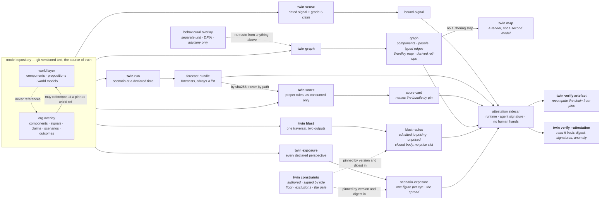

# `twin`

Build tickets 01–08, 10–15, 17–19 and 26–27 of `.scratch/twin/`. One dated signal binds to a
component; one scenario execution emits forecasts — plural; one recorded outcome scores them under
proper scoring rules; any artefact recomputes from its own pins. Scoring is in the first slice
rather than retrofitted, because without it we cannot tell whether any later capability helped, and
because scoring dictates what every other component must record.

**This is 19 of 77 build tickets.** What is not built is listed below and, more usefully, is named
inside every artefact the tool emits.

## Run it

```sh
bash twin/demo.sh                          # the whole loop, from a clean checkout
./bin/twin verify                          # the invariant suite
./bin/twin verify <artefact> --repo R      # recompute that artefact from its own pins
./bin/twin verify <artefact> --attestation # check its sidecar: digest, signatures, the anomaly
./bin/twin validate --repo R               # every object against its closed schema
./bin/twin graph --repo R --org netflix    # the typed knowledge graph
./bin/twin map --repo R --org netflix      # the Wardley map, rendered from that graph
./bin/twin blast --repo R --origin C       # what is downstream, and which of it may be priced
./bin/twin exposure --repo R --scenario S  # one scenario, valued under every declared perspective
./bin/twin constraints --out F             # the published constraint set, floor and exclusions
./bin/twin worksheet --repo P              # the pocket org against its hand-computed worksheet
./bin/twin sign <artefact> --role R        # accountability for an authored artefact
./bin/twin grade                           # computed depth grades, with evidence
```

The tool itself needs only python3, PyYAML and git — all already used by `estate/`. The checks want a
venv, pinned to the same versions CI uses:

```sh
python3 -m venv .venv
.venv/bin/pip install 'pyyaml==6.0.3' 'pytest==9.0.0' 'mypy==1.14.1' 'types-PyYAML==6.0.12.20250516'
.venv/bin/python -m pytest -q
.venv/bin/mypy twin tests conftest.py --ignore-missing-imports --warn-unused-ignores
```

## The loop



Every artefact carries its pins, an authored/derived mark, and the computed depth grade of every
capability that produced it. Machine-varying facts — wall clock, host, interpreter — are absent
from the artefact and live in the sidecar, which is what lets identical pins give identical bytes
across architectures. The signature lives there too, for the same reason: a keyed value in the
envelope would break identical bytes on the first machine holding a different key.

## Two kinds of signature

A **human** signature asserts accountability for a judgement and binds to a **role** from the
versioned register in `twin/roles.yaml`, never to a named individual. An **agent** signature asserts
reproducible origin — runtime and tool version — and states in the artefact what it does *not*
assert: correctness, accountability, human review. The two are refused as a type error before their
values are even checked, so one can never stand in for the other.

The consequence is the interesting half. A derived artefact may carry the second and may **never**
carry the first, so a signature attests the *absence* of human involvement, CI-style. A derived
artefact with human fingerprints on it is a **detectable anomaly** rather than a breach of
convention: `twin verify <artefact> --attestation` reports it, on evidence.

`ponytail:` the mechanism is HMAC-SHA256 keyed from `TWIN_SIGNING_KEY`, and the ceiling is named in
`twin/sign.py` — **a shared key proves possession, not identity**, so anybody holding it can produce
any role's signature. The upgrade is sigstore/gitsign with in-toto subject digests. With no key
present nothing is signed and the sidecar says which variable is missing, rather than carrying a
placeholder that reads as signed.

## Two things the £ rests on, before there is a £

**The evidence ladder** (`twin/evidence-ladder.yaml`) is five typed grades, strongest first, each
with a written admission criterion: dated natural experiment, repeated historical co-movement,
literature or domain theory, calibrated expert judgement, model assertion. The grade travels *with*
the claim, and **only grades 1–2 may price a scored forecast** — grade 5 is exactly where
parametric contamination hides, because an edge a model asserted from training data looks identical
to a well-evidenced one unless something forces the distinction.

A grade is immutable without a **regrade event** recording who moved it and why. Two guards: at
load, the recorded chain must be contiguous and end at the grade the file declares; at `twin
validate`, the file's **git history** is read and every observed change must be covered by a
regrade. Direction is derived and named — `strengthened` (to a lower number) or `weakened` — because
"up" is ambiguous on this ladder, and strengthening is the direction to be suspicious of.

**The constraint set** (`twin/constraints.yaml`, published by `twin constraints`) is the universal
floor, the scope exclusions and the stated positions. The floor is not the operator's to move; a
perspective adds red lines beside it, and one that reuses a floor id does not load. Scope exclusions
name what the twin was *not* asked to model, which does not stop strategic non-modelling but does
remove its deniability. Three positions are required by name — no power layer (stated), exit-cost
asymmetry (unsolved), reflexivity and Goodhart-on-the-twin (deferred) — and covert sensing is
recorded as `permanently-excluded`, which the loader checks is not the deferral beside it.

The pricing threshold ships in the same artefact, because changing what may be priced is the same
kind of act as changing what may be chosen.

## Whose £

The £ is perspectival: it belongs to whoever pays to run the twin. A perspective declares who pays,
what they value and their red lines, as an ordinary file in the model repository. `twin exposure`
reports a scenario under **every** declared perspective — naming none does not default to the
employer's, because that would be exactly the unstated firm's-£ the design refuses — and the
per-component spread between them is in the artefact rather than left to whoever runs the diff.

**The use-gate reaches here too — one rule, three jobs.** A valuation carries its own evidence
grade, and only a valuation inside the published threshold carries a figure at all. Anything weaker
is a **register entry**: named beside the number, with no amount, because the schema refuses one at
that grade. That is what stops a perspective declaring "reputation damage = £X", which is the
shadow price decision ticket 09 explicitly rejected. The gate lives at the source rather than in the
output: a grade-5 valuation carrying an amount does not load.

The admitted figures are **declared valuations, not modelled prices**, and the artefact says so:
nothing propagates yet, no severity is sampled, and the constraint pre-filter that must run before
any pricing is build ticket 28. `prefilter.applied` is `false` in the output rather than implied.

## The pocket org

Five components, six edges, named elasticities, two perspectives, and a committed worksheet
(`twin/pocket-org-worksheet.md`) with every number worked out **by hand** and the arithmetic shown.
`twin worksheet --repo <pocket repo>` checks the emitted graph, blast radius and exposure against
all forty lines.

This exists because a refusal test catches a reintroduced **absence** and nothing else. It is
satisfied by a degenerate system: a PERT triple that is present but garbage, a score tagged with the
wrong regime, an elasticity that stops being recalibrated three tickets later. All of those stay
green under every refusal test, and all of them fail here.

Thirty-four lines are computable today and match. Six carry their arithmetic already and name the
build ticket that must make them computable — propagation at 20, price at 30. **A pending line whose
build ticket has closed is a failure**, the same shape as an invariant still pending after its
activating ticket. Every subsequent derivation-path ticket adds its own line: that contract is
written into the worksheet, because a ticket that lands without a line here has no yardstick. Build
tickets 18, 19 and 26 added eleven between them — the two evidence grades, the admissible-edge
count, the blast radius from the shared database, and both perspectives' exposures with the spread
attributed component by component.

The worksheet is `authored` and signed as such. Everywhere else in this system a hand-typed number is
refused; this is the one place a human number is the authority, and the mark is what says so.

## What is honestly built

Depth grades are computed from the acceptance criteria of the owning **decision** ticket. Nothing
reaches `full`, and nothing can be typed as `full`.

| capability | decision ticket | grade | ticked |
|---|---|---|---|
| `domain-model` | 07 | partial | 1 / 7 |
| `causal-layer` | 08 | partial | 1 / 5 |
| `currency-regimes` | 09 | partial | 2 / 6 |
| `provenance` | 14 | partial | 2 / 4 |
| `honest-build` | 20 | partial | 1 / 4 |
| `sense-move` | 11 | partial | 1 / 8 |
| `scenario-engine` | 13 | partial | 1 / 7 |

**9 of 41**, and every artefact carries an overall depth of `partial`, which is the *worst* of the
capabilities that produced it. **Read `partial` as "at least one of N", not as "most of the way
there"** — the strongest capabilities here stand at two ticks, and four of the seven stand at one.
`./bin/twin grade` prints the denominators.

`currency-regimes` is new: it was added at build ticket 26, when the £ first had code to measure — a
perspective that declares who pays, and a constraint set it may add to and may never override.
Before that, a capability file with nothing behind it would have been a slot claiming a capability
existed, which is the same reason `causal-layer` waited until build ticket 17.

Two criteria were ticked this round and both survived. Several others were considered and left
unticked, on the same ground five were withdrawn on in earlier rounds — each rested on **one clause
of a multi-clause criterion**, or on machinery that does not exist:

- **decision ticket 08 AC 2** (intervention **and** counterfactual semantics, incl. structural-only
  paths) — build ticket 19 delivered the structural-only half and neither of the other two, so
  `causal-layer` gains nothing this round and stands at 1/5.
- **decision ticket 09 ACs 3–6** — the comparable remainder, the incommensurables, the objective
  function and the rival-model spread all need a pricing engine that is not here.
- **decision ticket 15** has **no capability file at all.** Build ticket 27 published the scope
  exclusions, the power-layer disclaimer, exit-cost asymmetry and the permanent covert-sensing
  exclusion — all from that ticket's *resolution*, none of them one of its five acceptance
  criteria. So none is ticked, and a capability file at 0/5 would be a slot claiming a capability
  existed.
- **decision ticket 07 AC 5** (representation/format reuse-vs-custom **and** authored-vs-derived) —
  the authored/derived split is now structural in four places, but the format decision is recorded
  nowhere in code.
- **decision ticket 07 AC 6** (where £, risk, people, **assets** and signals attach) — people,
  signals and now a declared valuation attach; assets have no schema.
- **decision ticket 14 AC 2's third clause** — an agent signature carries runtime and tool version but
  no model version and no config digest, because nothing here is produced by a model yet.

`./bin/twin grade` prints every unticked criterion by name, and each surviving tick names its evidence
and the build ticket that earned it.

**Scoring and calibration are still outside this ledger.** No capability file is owned by a decision
ticket that governs scoring, so build ticket 08's work does not appear in the 41. That is a hole in the
honesty instrument itself, not a claim that the work is done.

## The invariants

`./bin/twin verify` — 18 pass, 0 fail, 5 pending, 1 skipped and not faked. `pytest -q` — 357 tests
across seams 1 and 2.

| live | pending, with the ticket that activates it |
|---|---|
| `store_rebuildable_from_git` | `ruin_class_absent_not_priced` (28) |
| `identical_pins_identical_bytes` | `prefilter_precedes_pricing` (28) |
| `every_artefact_marked` | `as_consumed_admits_no_post_T_fact` (36) |
| `every_capability_depth_graded` | `price_levels_never_probabilities` (59) |
| `world_never_references_overlay` | `standing_library_covers_committed_classes` (69) |
| `no_collapse_mechanism` | |
| `no_recommended_action_field` | |
| `derived_never_human_signed` (cryptographic) | |
| `only_as_consumed_scores` | |
| `no_special_category_slot` | |
| `grade_5_only_path_never_prices` | |

**The constitution names sixteen invariants and the manifest may not grow a seventeenth without the
constitution changing first.** So build tickets 13, 14 and 11 each *extended* an existing check rather
than adding one — roll-ups with no authored and no stored form onto `store_rebuildable_from_git`, the
refusal to inherit arckit's action bands onto `no_recommended_action_field`, and detection of a planted
human signature onto `derived_never_human_signed`. Each body change cites its authorising decision
ticket in the manifest, which is what `hash_changes_are_authorised` checks.

`grade_5_only_path_never_prices` went live at build ticket 19. It asserts at four depths — the
ladder, the traversal, the **scenario exposure** and the closed bodies — and the scenario leg is the
one that matters: a traversal emits no money, so a gate asserted only there would be asserted only
where nothing could go wrong. It also asserts the **positive** leg as hard as the negative one: a
fully-graded path is admitted. A gate that admits nothing passes every refusal test in the check
while making the system useless, so "is it a gate or a wall" is asked explicitly.

Two guards were added to the **harness** instead, because each guards a yardstick rather than the
system: `worksheet_matches_the_pocket_org` (the hand-computed numbers still hold) and
`graded_edge_fixture_holds_its_contract` (the generated causal-edge fixture still carries what the £
and skills tracks depend on).

A live invariant that skips counts as a failure, and so does a harness guard that skips without
declaring itself skippable. Pending is the only honest way to not assert something, and it is declared
in `invariants/manifest.yaml` where it can be seen. Two guards may skip, and both say why:
`cross_architecture_determinism` needs the CI matrix, and `hash_changes_are_authorised` needs two
committed versions of the manifest to compare.

The manifest also declares, per invariant, the **field names it refuses** — read from there rather than
from the code, because a check that derives its expectation from the thing it is checking is a tautology
and deleting a refusal would silently shrink it.

One invariant is narrower than its name suggests, and says so in the manifest.
`no_special_category_slot` guarantees there is **no field** for Article 9 data: the schemas are closed,
so compliance is an impossibility of representation. Values are additionally screened against a named
list — but `cohort` and `metric` are free identifiers, so a protected group can still be described in
words nobody listed. That screen is a net, not a proof.

## What a hostile model repository cannot do

The YAML in a model repository is authored by users and may arrive from another tenant, so the reader
treats it as untrusted. It cannot execute code through repository-local git config (`core.fsmonitor`,
hooks), smuggle a git option through a ref or a `world_ref`, expand a YAML alias bomb into the artefact,
pin the world layer to a ref that moves, hide a file from the listing through `core.quotePath`, or hide
a subtree behind a submodule. Each is refused with a sentence, and each has a test. The one thing it
*can* still do is describe a protected group in free text — a cohort or a metric identifier is not an
enumerable space — and put whatever it likes into a signal's own fields, which flow into the artefact
verbatim. An artefact is exactly as sensitive as the model repository it came from.

## What is not built

Named here so the skeleton cannot quietly become the definition of done.

- **Nothing propagates.** Causal edges now carry sign, lag and a calibrated elasticity, and are
  validated on write — but no Monte-Carlo reads them, there is no depth attenuation, no shared-
  ancestry handling and no intervention-versus-observation distinction. (Build tickets 20–22.)
- **No £ engine.** No FAIR engine, no PERT sampling, no TVaR, no trade-off curve. `twin exposure`
  reports what each perspective *declared* a component is worth, which is not a modelled price and
  says so in `basis`. The pocket-org worksheet already carries the price line, hand-computed, as
  the yardstick those tickets must match. (23–25, 29–33.)
- **Nothing enforces the constraint set.** It is published, versioned and signed, and the
  pre-filter that removes a ruin-class or forbidden option from a choice set *before* pricing is
  build ticket 28. `ruin_class_absent_not_priced` and `prefilter_precedes_pricing` stay pending,
  and every exposure artefact records `prefilter.applied: false` rather than implying otherwise.
- **The use-gate decides admission, not magnitude.** A path is admitted to pricing or reported as
  an unpriced blast radius, and a valuation is admitted or held in the register — but no path is
  ever *priced*, because there is no pricing engine. The blast-radius body is closed with no price
  slot and a register entry carries no figure, so both stay true by construction. (30.)
- **The evidence-grade history check runs at `twin validate`, not at load.** It costs a git process
  per commit per graded file, so `graph`, `blast` and `exposure` will emit from a repository whose
  grade moved unrecorded. `twin validate` is the gate an author or CI runs, and it exits non-zero;
  nothing stops somebody skipping it.
- **The evidence-grade history check does not follow renames.** Moving a file and changing its
  grade in the same commit reads as a new file at its original grade. Named in
  `twin/evidence.py`; `git log --follow` per file is the upgrade if it matters.
- **The misuse catalogue, the affected-parties register and the disparate-impact audit channel
  are not built.** Build ticket 27 published the scope exclusion that says the system cannot
  currently be checked for disparate impact. Saying so is not fixing it. (61, 62.)
- **The pocket org's severity has no empirical anchor.** The £1,000,000 in the worksheet is a
  fixture number, stated as such. Build ticket 25 replaces it with an anchored one.
- **The information regime is a tag, not a gate.** Every forecast declares its regime and only
  `as-consumed` scores — but nothing refuses a fact dated after T, so `as-consumed` is currently a
  claim the model repository makes rather than a property the engine enforces. The artefact says
  so, in `regime.gated`. (36.)
- **No rewind, no intervention, no backtest.** The two primitives the engine composes from are
  absent; `run` is time-forward with an authored belief and no inference. (35, 37.)
- **Forecast probabilities are read from a world model's declared belief.** Nothing infers them.
  This is the honest stub: the plumbing is real, the judgement is authored.
- **Calibration is one score card, not a record.** Brier and log loss are proper and regime-tagged,
  but there are no reliability diagrams over volume (09), no contamination discount (40) and no
  hindsight-resistance inversion (41). The answer-key format carries the `contamination` slot the
  discount will read; nothing computes it.
- **Signing proves possession, not identity.** HMAC with a shared key: anybody holding the key can
  produce any role's signature, so it detects tampering and does not attribute it. The upgrade is
  sigstore/gitsign, named in `twin/sign.py`.
- **No skills, and therefore no seam 3.** The six skills are non-deterministic by construction and
  need their own eval harness; none exists, so skill regression would currently go silent. (42.)
- **No substrate.** The content-hash reference form round-trips against nothing. (48–51.)
- **The two-architecture determinism check has never run.** The CI matrix is declared and the
  golden digests are committed; the claim is wired, not proven.
- **The subjects are fixtures.** Netflix and Intel here are toy value chains with invented
  numbers, exercising the shape and nothing else. The real flagship work is tickets 71–77.
- **Sensing is a dead end.** Nothing consumes a bound signal: a signal cannot move an inferred
  position and cannot change a forecast. The spec's skeleton is "signal → binds to a component →
  **an inferred position moves** → execution"; the middle step is missing, so `sense` and `run`
  are two verbs over one repository rather than one loop.
- **Nothing verifies a signature in CI.** `TWIN_SIGNING_KEY` is unset there, so the suite exercises
  the signing path with its own key and the emitted artefacts stay unsigned. Signing the real
  pipeline needs a key in CI and an owner for it, and neither exists.
- **Overlay-to-overlay isolation has tests but no invariant.** The constitution's sixteen cover
  the world→overlay direction, not tenant→tenant reads, and the manifest may not grow a
  seventeenth without the constitution changing first.
- **Cross-machine verification has never run.** The `reproduce-elsewhere` CI job emits a score card
  on x86_64 Linux and recomputes it on arm64 macOS. Declared and wired; unproven. This and the
  two-architecture leg are the two acceptance criteria left unticked across tickets 01–12.
- **Two named entity types are missing.** Decision ticket 07 names `Asset`/`DataAsset` and
  `Response`/`Control` in the core ontology; neither has a schema, which is why domain-model's
  first criterion stays unticked.
- **The Wardley positions are authored, and nothing judges them.** `evolution` and
  `evolution_position` are whatever the model repository says. Which position a component actually
  holds is a judgement, and the judge — with human override and pushback — is build ticket 44.
- **The causal edges in the fixtures are toys.** Sign, lag and elasticity are invented numbers
  exercising the shape. Decision ticket 08 asks for a real claim from each co-flagship, and neither
  exists, which is why the causal layer's fifth criterion stays unticked.
- **No reliability diagram and no scheduled emission.** Calibration is measured over volume and
  there is no volume: emission is still hand-initiated, so the record can be selected. (09.)

## Layout

```
twin/
  cli.py          seam 1 — the artefact CLI, the primary boundary
  verbs.py        sense / run / score / graph / blast / exposure
  schema.py       the closed typed schema; Article 9 has no slot because there is no slot
  blast.py        the reverse-dependency traversal, and the closed body with no price slot
  evidence.py     the evidence ladder, the use-gate, and the regrade record
  evidence-ladder.yaml      five typed grades and the published pricing threshold
  constraints.py  the universal floor, the scope exclusions, the stated positions
  constraints.yaml          the constraint set itself — authored, versioned, signed on publish
  scoring.py      Brier and log loss, and the declared quantisation
  wardley.py      evolution positions and D/K/R, inherited from arckit with its caveats
  reproduce.py    recompute an artefact, and its chain, from its own pins
  repo.py         the pinned model repository; reads go through a git tree, never the worktree
  model.py        world layer, org overlays, the typed graph, derived roll-ups, the gated unit
  artefact.py     the envelope; forbidden field names refused at emission
  attest.py       attestation sidecars — written, and read back
  sign.py         two signature types that never substitute for each other
  roles.yaml      the versioned role register a signature binds to
  grades.py       depth grades as computed checklists
  worksheet.py    the pocket-org worksheet, parsed and checked
  pocket-org-worksheet.md   the hand-computed yardstick — authored, and the authority
  blob.py         content-hash references for bulk substrate
  index.py        the derived index — a store, and therefore never authoritative
  canon.py        canonical serialisation
  fixtures.py     the deterministic fixture repositories — flagship and pocket org
  capabilities/   one checklist per decision ticket that has code
  invariants/     manifest, harness, checks, golden digests
  demo.sh         the end-to-end
```

Code here is **disposable by default**. The durable artefacts are the versioned model repository
and the decision record under `.scratch/twin/`; replacing this code is normal, and the tests
assert on emitted artefacts rather than internals so that they do not become the sunk cost that
resists the rewrite.
