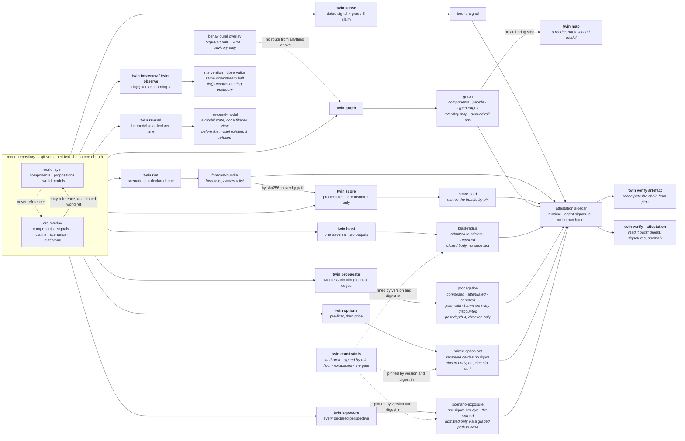

# `twin`

Most build tickets under `.scratch/twin/` are closed; 64 is instrumented and
measuring, not closed. One dated signal binds to a
component; one scenario execution emits forecasts — plural; one recorded outcome scores them under
proper scoring rules; any artefact recomputes from its own pins. Scoring is in the first slice
rather than retrofitted, because without it we cannot tell whether any later capability helped, and
because scoring dictates what every other component must record.

**This is 60 of 77 build tickets closed, and one measuring against a clock that runs
to 2026-11-06.** Ticket 23's own checklist is closed, but the calibration discipline it
established (`twin/calibration.md`) sees no adoption yet — no committed triple in this repository
has been authored through it (see "Flux drift", below). What is not built is listed below and,
more usefully, is named inside every artefact the tool emits.

## Run it

```sh
bash twin/demo.sh                          # the whole loop, from a clean checkout
./bin/twin verify                          # the invariant suite
./bin/twin verify <artefact> --repo R      # recompute that artefact from its own pins
./bin/twin verify <artefact> --attestation # check its sidecar: digest, signatures, the anomaly
./bin/twin validate --repo R               # every object against its closed schema
./bin/twin graph --repo R --org netflix    # the typed knowledge graph
./bin/twin map --repo R --org netflix      # the Wardley map, rendered from that graph
./bin/twin blast --repo R --origin C       # what is downstream, and which of it may be priced
./bin/twin propagate --repo R --origin C   # compose a shock along causal edges, with attenuation
./bin/twin intervene --repo R --component C # do(x): cut the incoming edges, propagate downstream
./bin/twin observe --repo R --component C  # observe(x): belief updates about the causes too
./bin/twin rewind --repo R --at T          # the model state at a declared time (abduction)
./bin/twin backtest --repo R --org O --scenario S --regime as-consumed --at T # rewind, then run — one composition
./bin/twin run --repo R --scenario S --regime as-consumed   # the gate is required, with no default
./bin/twin regimes --repo R --scenario S   # the same scenario under all three, with the gaps
./bin/twin positions --repo R --org O --scenario S  # believed, rival, revealed — and the deltas between them
./bin/twin causal-accounts --repo R --org O --origin X --account A1 --account A2 # rival causal accounts, spread not privilege
./bin/twin trade-off --repo R --org O --origin X --perspective P --account A1 --account A2 # net cost of risk per response, across the account ensemble, marked default
./bin/twin sweep --repo R [--repo R2 ...]  # every scenario, every org, unconditionally — no --scenario
./bin/twin gameplay-sweep --repo R [--repo R2 ...] # every org, scanned for gameplay preconditions — opportunity candidates, unconditionally
./bin/twin reliability --score-card C1 --score-card C2 # bins over a pooled population, empty bins shown
./bin/twin severity --mu M --sigma S --threshold U --xi X --beta B --alpha A # loss-exceedance: VaR beside TVaR
./bin/twin severity-anchor --subject data-breach-loss --alpha A # the same curve, fit from cited public quantiles
./bin/twin drift                           # the Flux drift measurement: coverage, events, no verdict
./bin/twin options --repo R --perspective P # the choice set after the pre-filter, survivors costed
./bin/twin exposure --repo R --scenario S  # one scenario, valued under every declared perspective
./bin/twin price --repo R --origin C       # a shock priced under every eye, responses beside it
./bin/twin constraints --out F             # the published constraint set, floor and exclusions
./bin/twin affected-parties --repo R --org O --out F  # who bears a modelled consequence with no perspective, alongside the constraint set
./bin/twin disparate-impact-audit --finding F --source S --out O      # raise a finding — sealed, never names the protected characteristic
./bin/twin disparate-impact-respond --audit A --response R --out O    # only the registered respondent role may close it
./bin/twin credibility --repo R --org O --subject S  # the world prior blended with an org's own sparse data
./bin/twin worksheet --repo P              # the pocket org against its hand-computed worksheet
./bin/twin sign <artefact> --role R        # accountability for an authored artefact
./bin/twin challenge --artefact A --claim-path P --reason R --out O   # dispute one claim in one artefact
./bin/twin resolve-challenge --challenge C --response R --out O       # names only what the challenge named
./bin/twin verify <artefact> --repo R --challenge C1 [--challenge C2 ...]  # shows open/resolved challenges too
./bin/twin grade                           # computed depth grades, with evidence
```

The tool itself needs only python3, PyYAML and git — all already used by `estate/`. The checks want a
venv, pinned to the same versions CI uses:

```sh
python3 -m venv .venv
.venv/bin/pip install 'pyyaml==6.0.3' 'pytest==9.0.0' 'mypy==1.14.1' 'types-PyYAML==6.0.12.20250516'
.venv/bin/python -m pytest -q
.venv/bin/mypy twin tests conftest.py --ignore-missing-imports --warn-unused-ignores
```

## The loop



Every artefact carries its pins, an authored/derived mark, and the computed depth grade of every
capability that produced it. Machine-varying facts — wall clock, host, interpreter — are absent
from the artefact and live in the sidecar, which is what lets identical pins give identical bytes
across architectures. The signature lives there too, for the same reason: a keyed value in the
envelope would break identical bytes on the first machine holding a different key.

## Two kinds of signature

A **human** signature asserts accountability for a judgement and binds to a **role** from the
versioned register in `twin/roles.yaml`, never to a named individual. An **agent** signature asserts
reproducible origin — runtime and tool version — and states in the artefact what it does *not*
assert: correctness, accountability, human review. The two are refused as a type error before their
values are even checked, so one can never stand in for the other.

The consequence is the interesting half. A derived artefact may carry the second and may **never**
carry the first, so a signature attests the *absence* of human involvement, CI-style. A derived
artefact with human fingerprints on it is a **detectable anomaly** rather than a breach of
convention: `twin verify <artefact> --attestation` reports it, on evidence.

`ponytail:` the mechanism is HMAC-SHA256 keyed from `TWIN_SIGNING_KEY`, and the ceiling is named in
`twin/sign.py` — **a shared key proves possession, not identity**, so anybody holding it can produce
any role's signature. The upgrade is sigstore/gitsign with in-toto subject digests. With no key
present nothing is signed and the sidecar says which variable is missing, rather than carrying a
placeholder that reads as signed.

## Two things the £ rests on, before there is a £

**The evidence ladder** (`twin/evidence-ladder.yaml`) is five typed grades, strongest first, each
with a written admission criterion: dated natural experiment, repeated historical co-movement,
literature or domain theory, calibrated expert judgement, model assertion. The grade travels *with*
the claim, and **only grades 1–2 may price a scored forecast** — grade 5 is exactly where
parametric contamination hides, because an edge a model asserted from training data looks identical
to a well-evidenced one unless something forces the distinction.

A grade is immutable without a **regrade event** recording who moved it and why. Two guards: at
load, the recorded chain must be contiguous and end at the grade the file declares; at `twin
validate`, the file's **git history** is read and every observed change must be covered by a
regrade. Direction is derived and named — `strengthened` (to a lower number) or `weakened` — because
"up" is ambiguous on this ladder, and strengthening is the direction to be suspicious of.

**The constraint set** (`twin/constraints.yaml`, published by `twin constraints`) is the universal
floor, the scope exclusions and the stated positions. The floor is not the operator's to move; a
perspective adds red lines beside it, and one that reuses a floor id does not load. Scope exclusions
name what the twin was *not* asked to model, which does not stop strategic non-modelling but does
remove its deniability. Three positions are required by name — no power layer (stated), exit-cost
asymmetry (unsolved), reflexivity and Goodhart-on-the-twin (deferred) — and covert sensing is
recorded as `permanently-excluded`, which the loader checks is not the deferral beside it.

The pricing threshold ships in the same artefact, because changing what may be priced is the same
kind of act as changing what may be chosen. A **second** threshold ships beside it —
`path_admission_threshold`, the grade a causal path to cash flow must hold before an impact enters
the £ at all. Two numbers rather than one reused, so widening the currency is an act somebody has
to perform and not a side effect of widening the use-gate.

## The pre-filter, and why it is not a very large price

`twin options` reads the candidate responses in an overlay, removes the ones that cross a
constraint in force for the named perspective, and only then costs what is left. The ordering is
the whole point: a price can be outbid, so with enough upside an optimiser finds the number that
buys a monstrous option, and a very large penalty still asserts that a number exists.

The ordering is **structural, not a convention**. Pricing is a method on the pre-filter's own
product, so the module exports no function that would take an unfiltered option and return a
number; and before it prices anything, that product **re-derives the filter** from the constraint
set it carries and refuses if the answer disagrees. The re-derivation is the lock that holds: the
construction sentinel alone was carried straight through `dataclasses.replace`, which is the
ordinary way to copy a frozen dataclass and therefore exactly the innocent refactor it claimed to
stop. A removed option is absent from the priced list and its record is closed to nine string
fields, so it has nowhere to put a figure — as a number or in words.

The pre-filter never reads a cost. That is why no input magnitude brings an excluded option back —
the magnitude is not an input to the decision — and the fixtures price both excluded options at
almost nothing so the property is demonstrable rather than asserted.

Ruin is perspective-relative. `stake-the-quarter-on-one-title` crosses the operator's declared
insolvency boundary and is removed under that eye; the staff council declares a different boundary
and the same option survives under theirs. The universal floor binds both.

## Propagation, and the three numbers it reports

`twin propagate` composes a shock along `influences` edges by Monte-Carlo. Every path reports
three things, side by side and never one instead of another:

- the **composed** triple — the point-wise product of the authored elasticities. Exact arithmetic,
  hand-checkable, and un-attenuated.
- the **attenuated** triple — the composed one scaled by the published depth schedule
  (`twin/attenuation.yaml`, versioned and pinned in the artefact).
- the **sampled** spread — PERT draws through the graph, so uncertainty compounds honestly instead
  of being averaged away. A product of modes is not the mode of a product.

Both the composed and the attenuated numbers stay in the output, because an attenuated figure whose
un-attenuated form was never shown makes the attenuation unfalsifiable.

Past depth 4 a path carries a **direction and no magnitude**. Not a small number — none, and no
`composed`, `attenuated` or `sampled` key to put one in. The path is still named, graded and dated,
because a direction a reader cannot locate in the graph is not a direction. A five-hop elasticity
chain is not a number.

The walk stops one depth past the schedule and reports at most 32 paths per component, ranked
best-evidenced first and truncated second. Simple-path enumeration is exponential in branching
factor: before the cap, a dense eleven-component graph produced a 331 MB artefact from 464 KB of
YAML, and 97% of it was paths carrying no magnitude. Every kind of pruning — depth, path count,
cycle — is disclosed in `traversal`, because an artefact that pruned silently is claiming a
completeness it has not got.

**Structural edges do not propagate.** A `needs` edge claims no mechanism, so nothing composes
along it; that exposure is the blast radius and it stays unpriced.

**Several paths out of one shock are reported separately and never summed** — they share
ancestry, so adding them double-counts. They are **combined**, which is a different operation
(build ticket 21). Each reached component with at least one path inside the attenuation boundary carries a `joint`
figure combined by **noisy-OR**,
`1 - prod(1 - influence)`, with the dependence carried **structurally**: a shared edge is drawn
once per Monte-Carlo trial, so two paths agree exactly to the extent that they share edges. The
stated assumption is that, conditional on the shared edges, the disjoint remainders are
independent; the stated limit is that a common cause the graph does not contain is not modelled
at all. Beside it sits `if_independent` — the same marginals under an independence assumption —
so the discount is a subtraction a reader can take rather than a correction they must accept. A
Gaussian copula on the path outputs was rejected: it needs a correlation matrix nobody in this
system authors, and it would impose a second dependence structure alongside the graph's own.

**`do()` and `observe()` are separate operations with separate types** (build ticket 22).
Observation propagates bidirectionally — learning a fact is evidence about what produced it.
Intervention propagates downstream only and **reports** the target's incoming edges as cut,
because doing a thing does not rewrite its own causes. Nothing is removed from the graph and
nothing needs to be: the walk runs forward from the target, so an incoming edge is never traversed
under either operation. The two downstream halves are byte-identical, and that is asserted rather
than assumed. `twin/primitives.py` gives each its own type, so a swap is
a `mypy` error rather than a runtime surprise, and the emitted intervention is refused if it
carries any upstream belief update at all. An updated ancestor is named, graded and located in the
graph and carries **no magnitude**: inverting an authored elasticity into a diagnostic number
needs a prior over the causes that nothing in this model authors.

**`twin rewind` is Pearl's abduction** (build ticket 35). The repository is the model and git
dates every version of it, so the past is a commit rather than a projection: rewind opens the
repository at the last commit on or before the declared time, and everything downstream reads it
unchanged. That is why `do()` at a past time needs no special case. A filtered view would fail on
the case that matters — it can hide rows added since, and it cannot restore an elasticity that was
later recalibrated, so a backtest through one would score the past with today's numbers.
Rewinding to before the model existed **refuses**, because an empty model is a claim about the
organisation rather than an answer about the model. So does a time that is not ISO 8601: git reads
a date it cannot parse as `now` and hands back the newest commit, so an unvalidated timestamp
would answer a question about the past with today's model and say nothing about having done so.

## The three information regimes, and why the gaps are the point

**`twin run` takes a regime and has no default** (build ticket 36). The regime a default would
pick is the one whose forecasts score, so an omitted flag would be a silent claim to have run
under the honest gate. A scenario cannot declare one either: an authored regime is a default
wearing a different hat, and the schema has no slot for it.

* **`as-consumed`** — only what the twin had ingested by T. Two filters, because there are two
  ways a post-T fact can arrive: the repository is reopened **as it stood at T**, and any fact
  that survives that but is *dated* after T is withheld.
* **`as-knowable`** — everything dated on or before T, whenever it was ingested.
* **`with-hindsight`** — unrestricted.

The differences are the diagnostic, and `twin regimes` computes them rather than leaving three
artefacts side by side for a reader to subtract. `as-consumed` versus `as-knowable` localises to
**sensing** — it was there to be found and we did not have it. `as-knowable` versus
`with-hindsight` localises to **interpretation** — nothing dated by T said it, so reading the
outcome as foreseeable from those facts is hindsight. Wrong under all three localises to the
**model**, and that third figure is reported as **not computed**, with the reason: a forecast here
reads a world model's declared belief and nothing infers it from a signal, so the three
probabilities are identical by construction and a residual of zero would read as "the model is
fine" rather than as "nothing consumes a signal".

**The gate is absence, not screening.** The model is *loaded through* the regime, so a withheld
fact is missing from the overlay the execution reads — there is no post-T fact available to
reference, and referencing one is not a mistake the code could make. A claim goes with the signal
it binds, because a reading of a document the twin did not have is not a claim the twin held.

**A withheld fact that the execution could still have reached is a refusal.** A post-T fact bound
by a claim to a component the scenario forecasts stops the run rather than being redacted from it,
because running a scenario whose subject matter has been redacted answers a different question —
under the one regime whose forecasts score. The answer key is the deliberate exception: it is
dated after T by definition and nothing forecasts it, so it is withheld quietly. Refusing on its
presence would make a backtest impossible in every repository that holds the key it will be scored
against.

Two limits are named in `twin/regimes.py` rather than implied. **The rewind leg needs a repository
that existed at T** — the Netflix subject is dated 2011 and its model repository was built this
year, so `as-consumed` there rests on fact dates alone and the artefact records
`ingestion_history.available: false` with the consequence. Only the regime fixture's commit
history straddles T, which is why the sensing gap needs it. And **a regrade is not date-gated**:
`schema.DATED_FACTS` covers facts about the world, and a regrade is the twin's own record of how
strong a claim is.

## `twin backtest`, and all four operations from two primitives

Decision ticket 13 Q2's claim is that the whole product surface is compositions of exactly two
primitives — time (`rewind`) and intervention (`do`/`observe`) — and that claim was untested until
build ticket 37 demonstrated all four: **projection** (fast-forward) is `twin run` with no
intervention; **act-now** is `twin intervene` with no rewind; the **counterfactual** is
`primitives.rewind()` followed by `twin intervene`; the **backtest** is `primitives.rewind()`
followed by `twin run` — literally, not by convention. `cmd_backtest` calls exactly
`primitives.rewind` and `verbs.run` and nothing else, checked against its own source by harness
guard `backtest_is_a_pure_composition` rather than trusted from its docstring — the same discipline
`prefilter_precedes_pricing` applies to `twin/options.py`'s public surface.

**The composition computes what `run()` already computes, not a second implementation of it.**
`run()`'s own `as-consumed` regime already rewinds internally through `regimes.read_at()`; calling
`primitives.rewind()` explicitly first and then `run()` at the same time produces a
byte-identical forecast to calling `run()` alone, save for which command is recorded as having
produced it (`tests/test_four_verbs.py::test_backtest_and_run_compute_the_identical_forecast`).
That redundancy is the point: it proves the explicit two-primitive composition and `run()`'s own
internal machinery are the same mechanism, not two mechanisms that happen to agree today.

`twin backtest`'s own subject-matter limit is the one `twin/regimes.py` already names: the netflix
fixture's git history begins 2026-01-01, so a rewind to the `dvd-decline-2011` scenario's own
declared 2011 date refuses honestly (`PrimitiveError`) rather than answering with today's model
wearing 2011's date. `tests/test_four_verbs.py` backtests at `2026-01-01` instead — the one date
this synthetic fixture's own history can actually support — to demonstrate the mechanism rather
than a historically faithful Netflix backtest, which decision ticket 22's demo-slice work (co-
flagship scoring) is where that belongs.

Scoring is not folded into `backtest` — it emits a `forecast-bundle`, the identical artefact kind
`run()` emits, and the existing `twin score` runs on it exactly as it would on `run()`'s output
(`tests/test_four_verbs.py::test_a_backtest_scores_against_the_record`). `reproduce.py`'s `VERBS`
now names `backtest` too, reusing `run()`'s own replay branch rather than a second one: a
backtest's pins are the rewound commit `primitives.rewind` already resolved to, so replaying it is
replaying `run()` against a repository already opened at that pin.

## The Carillion answer key: the primary backtest, and a repository that actually has history

`fixtures.build_carillion_org()` (build ticket 38) is the primary backtest key research chose
(`.scratch/twin/research/opportunity-cases.md`, `.scratch/twin/research/flagship-osint-scoping-wave2.md`) for **low notoriety
over fame**: a model that flags Carillion is not distinguishable from one that has memorised Enron
unless the key itself is obscure enough that reciting it is not an option. Carillion is unusually
well-instrumented for this — a free, dated, statutory FCA short-position disclosure regime and a
joint parliamentary inquiry (HC 769) give contemporaneous, adversarial ground truth rather than a
cooperative survivor narrative.

Eight signals, each a real, dated, publicly documented fact, cited by URL: three RNS trading
updates (7 Dec 2016, 1 Mar 2017, 3 May 2017) the FCA's 2022 decision notices later ruled
"recklessly ... misleading" for not disclosing the UK construction business's true deterioration;
three profit warnings (10 Jul, 29 Sep, 17 Nov 2017); a reported short-interest position (30 Sep
2017); and the compulsory liquidation itself (15 Jan 2018). **HC 769 is cited only on the outcome,
published 16 May 2018** — never on a signal, because it postdates every one of them and using it to
date a signal would let hindsight into ground truth that is supposed to be contemporaneous. The
outcome declares `contamination: low`, the same field build ticket 40's discount reads.

**This repository's own commits are dated to match, in order (2016-11-01 through 2018-05-17) —
the discipline `build_regime_org` established — so `twin backtest --at 2017-08-01` reads a
repository that genuinely existed then.** That is the one thing the main netflix/intel fixture
cannot do: netflix's `dvd-decline-2011` scenario is dated 2011 but its repository was built this
year, so `regimes.ingestion_history` there reports `available: false` and `as-consumed` rests on
fact dates alone. Carillion's does not — `ingestion_history.available` is `true` at every date
`tests/test_carillion.py` tries, because a real commit exists to resolve to.

The world layer's proposition is deliberately generic (`contractor-enters-insolvency-by-2018`),
the same way netflix's own proposition never says "Netflix": `world_never_references_overlay`
refuses a component or world model that names the tenant, so Carillion's name lives only in the
`carillion` overlay, where a tenant is expected to appear.

## Two further keys, and one honest notoriety finding

`fixtures.build_nmc_health_org()` and `fixtures.build_wirecard_org()` (build ticket 39) add two
more real, dated, publicly documented backtest keys, to the same contract Carillion's does, so
Carillion alone does not carry the falsifiability claim. Ticket 39's own AC asked for the
low-notoriety claim to be **evidenced, not asserted** — and evidencing it produced a finding
rather than a rubber stamp. NMC Health earns `contamination: low` on Carillion's footing:
specialist financial-press coverage only, no book, no documentary. Wirecard does not — a
bestselling book, a Netflix documentary and mainstream coverage the size of Enron's earn it
`contamination: high` instead of spec story 45's shorthand grouping of all three as
"low-notoriety". `CONTAMINATION` (`twin/schema.py`) already reserved that value; build ticket 40's
Enron-versus-obscure gap should draw its "obscure" leg from Carillion or NMC Health, not Wirecard.

Sourcing NMC Health's key cost more than the diff shows: most real, on-topic citations for it —
including the FCA's own Final Notice — name the company with the hyphenated slug `nmc-health`,
which `no_special_category_slot` refuses everywhere a string is scanned, deliberately and by
design (the word "health" is an Article 9 category, context-free — "a false positive costs an
author one rename"). The org id became `nmc`; two citations were swapped for real alternative
coverage of the identical facts. No signal was weakened or dropped to work around it.

## Enron as contamination control, and the hindsight-resistance pair

`fixtures.build_enron_org()` (build ticket 40) is not a fourth low-notoriety key — the opposite.
An LLM asked about Enron has read the ending, so "flagging" it in 2001 is indistinguishable from
reciting it in 2026. It is carried deliberately as a **control**, to the same dated-and-cited
contract Carillion/NMC/Wirecard hold: four real signals (the CEO's sudden resignation, 14 Aug
2001; the Q3 loss and equity writedown, 16 Oct 2001; the 1997-2000 restatement, 8 Nov 2001; the
Chapter 11 filing, 2 Dec 2001), the Powers Report cited only on the outcome (published just over
two months after resolution, 1 Feb 2002), and `contamination: control` — the value
`CONTAMINATION` (`twin/schema.py`) reserved for exactly this fixture rather than `"low"`.

`scoring.measure_discount()` turns the contamination threat into a number: the mean-loss gap
between an obscure key's score population (Carillion or NMC — never Wirecard, per ticket 39's own
finding) and Enron's, quantised, never a literal — a harness guard recomputes it against two
different synthetic populations at CI time and refuses if they match, and two pure-function tests
assert it moves when the underlying scores do. `twin score --discount-enron <card>...
--discount-obscure <card>...` folds a measured discount into any score card: raw `brier`/
`log_loss` stay untouched, `discount` and `adjusted_<rule>` sit beside them, and
`contamination_discount` on the card body is `None` — never a fabricated zero — when no discount
was supplied. The discount is pinned by digest, never by path, the same reason `--forecast` is
recorded as `forecast_sha256`; a discount-carrying score card honestly refuses to replay from its
pins alone, the identical limit `twin reliability`'s own pooled score-card inputs already carry.

`fixtures.build_astrazeneca_org()` and `build_sanofi_org()` (build ticket 41) are an inverse pair
of **hindsight-resistance controls**: cases where the contemporaneous record contradicts the
canonical story, so confident agreement with the canonical story is evidence of memorisation, not
skill. AstraZeneca rejected Pfizer's bid in May 2014 and was punished for it — shares fell 11-13%,
a named ~2% holder (Schroders) was publicly critical — and is now retold as visionary, as recently
as a 2 Aug 2026 piece framing a prospective Bristol Myers Squibb megadeal as "twelve years after
spurning" Pfizer. Sanofi exited diabetes/cardiovascular for GLP-1 obesity in December 2019 and was
approved for it (+5% on the day, no contemporaneous criticism), and is now retold as a strategic
miss once a rival's obesity drug became a blockbuster from 2022. Each fixture carries **two world
models** on one scenario — `contemporaneous-consensus` reasons from what was knowable at the time,
`canonical-hindsight-consensus` reports the belief a system reciting the now-common story would
hold — so `no_collapse_mechanism` already forbids collapsing the two forecasts one execution
emits, and scoring both against the *contemporaneous* outcome is the inversion: no special-cased
scoring code, just a canonical story that disagrees with the recorded ground truth.
`hindsight_trap: true` on the outcome (`twin/schema.py`) makes that explicit in the score card.
Both cases demonstrate the point through the real CLI: `canonical-hindsight-consensus` scores
markedly worse (higher brier and log-loss) than `contemporaneous-consensus`, and their own gap
folds into the identical `measure_discount()` rather than sitting beside it as a second number.

## The co-registered forecast book: selection and quarantine

`twin/benchmark.py` (build ticket 57) is the first half of decision ticket 21's external gate —
the one mechanism the memorisation problem cannot reach, because a forward-dated question cannot
be in any training corpus. Two mechanisms, both decided at ticket 21 Q1/Q2 and neither built
before this ticket.

**The selection rule is mechanical, versioned and pre-registered, not a per-run judgement call.**
`twin/benchmark-selection-rule.yaml` states everything in resolvable terms — a liquidity
threshold, a resolution-horizon window, a category list — the same discipline
`twin/evidence-ladder.yaml`'s thresholds carry, and a change to it is a dated diff in this file's
own git history rather than invisible drift. `select_questions()` applies it and nothing else
decides which questions are drawn: candidates are sorted by id before anything touches them, so
arrival order cannot bias what a volume cap keeps, and the one place chance enters is decision
ticket 21 Q2's own named exception — "(c) random sampling as a volume valve if the rule selects
too many" — drawn from the rule's own committed seed, so a re-run against the identical pool
selects the identical subset. **The full confidence range is demonstrated, not claimed:**
`BenchmarkSet.spans_full_confidence_range()` is true only once every declared bin holds at least
one selected question, checked against the emitted `distribution` rather than asserted in prose.

**The quarantine is a scan across ingestion provenance, never a single named field.**
`audit_quarantine()` serialises each ingestion-provenance record whole and checks it for a
substring match against every quarantined question id, so a breach hiding in a nested field — a
recipe id, a source string, a claim's own text — is caught rather than only a field a caller
happened to check. Nothing here reads a timestamp, which is what makes the quarantine hold "at
any lag": an old record and one audited long afterward are scanned identically, and
`tests/test_benchmark.py` plants a breach at both.

**The residual limit is stated, not papered over (decision ticket 21 Q1).** A clean audit proves
*no direct ingestion* of a quarantined id. It says nothing about whether the twin's priors were
shaped by market-adjacent information arriving some other way — narrowing that gap is temporal
separation's job (build ticket 58), not this ticket's. `twin/capabilities/forecast-book.yaml`
records the honest state: one of decision ticket 21's six acceptance criteria is checked by this
ticket's code, the other five (venue, blind emission, claim scope, the rest of circularity,
proportionality) are build tickets 58 and 59's, so the capability grades `partial`, never `full`.

## Blind pinned emission, resolution scoring, and the narrow claim

`twin/forecast_book.py` (build ticket 58) builds decision ticket 21's second mechanism —
**temporal separation** — on the *same* questions build ticket 57 selects: a forecast pinned and
signed **before** its question's resolution window opens, so *"we forecast before we looked"* is
provable rather than assured, and a resolution scored against that exact pinned emission once the
question resolves.

**Blind by construction, not by review.** `emit()` refuses to build a `forecast-emission` artefact
timed at or after its question's own declared `resolution_window_opens_at` — checked at the
boundary itself and past it, the same "gate, not an assurance" discipline
`as_consumed_admits_no_post_T_fact` (`twin/regimes.py`) uses for a different post-T leak.
`is_blind()` is the *same* function that refusal calls internally, so an auditor holding nothing
but the artefact's own recorded body — not the code that built it — can recompute the identical
check later rather than trust that it fired. Timestamps are fixed-width `YYYY-MM-DDTHH:MM:SSZ`,
validated by regex and compared as plain strings, the identical discipline `twin/regimes.py`'s
`cutoff()` already uses for its own dated cutoff, so blindness is a string comparison someone can
redo by eye rather than a parser someone has to trust.

**Signed and pinned through the existing machinery, reused rather than reinvented.** `emit()`
returns a `derived` `Artefact` — precisely the shape `twin/attest.py`'s `build()` already
agent-signs and refuses a human signature on (`derived_never_human_signed`, unchanged): a forecast
computed entirely from its own pins is not a judgement anybody signs off on.
`tests/test_forecast_book.py` exercises this directly against the real `twin/sign.py`/
`twin/attest.py` code, not a stand-in: a genuine agent-signed sidecar round-trips clean through
`attest.check()`, and a hand-built human signature on an emission is refused.

**Resolution scoring is co-registered, not merely same-named.** `score_resolution()` takes no
question id or timestamp as a fresh parameter — both travel from the pinned emission's own pins
and body, so a resolution can only ever be scored against the exact question and the exact
emission it was pinned to, never a same-id stand-in supplied out of step. A doctored emission
whose body no longer attests blindness against its own recorded timestamps is refused rather than
scored — a defence against a forged or hand-edited artefact, not only against the honest path
`emit()` already gates. Scoring itself calls `twin/scoring.py`'s `score()` directly; both the test
suite and the harness guard assert the output reproduces `brier`/`log_loss` bit for bit, so a
second scoring implementation cannot quietly drift from the first.

**Observe-only is structural (decision ticket 21 Q4).** `twin/forecast_book.py` exposes exactly
three functions — `emit`, `score_resolution`, `is_blind` — asserted as an **allow-list**, the same
discipline `prefilter_precedes_pricing` uses on `twin/options.py`: a differently-named
position-placing function would still be caught, not only one matching an obvious keyword. There
is no function here that takes a stake, a side or an order, and every emission's body also records
`observe_only: true, position_placed: false` directly.

**The narrow claim scope travels with every result (decision ticket 21 Q5).** `CLAIM_SCOPE` is
carried in the body of both the `forecast-emission` and the `resolution-score` artefacts, not
stated once in prose: `evidences` names non-overconfidence in general world-forecasting on a
pre-registered, blind, co-registered question set; `does_not_evidence` names Wardley propagation,
the causal elasticities, £ pricing and the org-specific overlay explicitly; `residual_limit`
restates decision ticket 21 Q1's own honesty condition — the quarantine (build ticket 57) proves
no *direct* ingestion, never that the twin's priors were unshaped by market-adjacent information
arriving some other way.

**Three more of decision ticket 21's six acceptance criteria are honestly ticked** — venue +
observe-vs-participate, the blind-emission protocol, the claim-scope statement — moving
`forecast-book` from build ticket 57's 1/6 to **4/6**, still `partial`. What stays unticked:
circularity's remaining half (wiring the quarantine onto a *live* ingestion path is build ticket
59's, once price moves actually enter as signals) and the proportionality verdict, which is a
judgement already recorded in decision ticket 21's own resolution text rather than a code artefact
any build ticket computes.

## Believed, rival, revealed — and no privileged map

`twin positions` (build ticket 16) is the other half of "no code path collapses an ensemble": once
several positions exist, the *deltas between them* are the point, not merely their separate
display. A believed map and a rival forecast are typed identically — both are ordinary
`world-model` objects, distinguished only by the name their author gave them — and revealed truth
is not even a world model: it is derived from a resolved `outcome`, so there is no schema slot
anywhere a privileged "actual" map could occupy.

Every unordered pair of named positions gets a plain delta, `|a - b|`, because there is no ground
truth between two forecasts to score against. Every position with a resolved outcome to compare
against also gets the same proper score (`twin/scoring.py`'s Brier and log loss) any forecast
gets — the twin's own default reference travels through the identical call as a rival's id, with
no branch anywhere that treats one specially.

**Dropping any one position changes nothing about the rest.** Removing the org's own believed map,
or the twin's own default reference, from the set still computes, and the survivors' own figures
do not move — demonstrated on the netflix fixture in `tests/test_positions.py` and asserted at the
suite level by harness guard `position_deltas_have_no_privileged_default`. Nothing here classifies
which id is "believed" versus "rival": that would itself be the schema-level privilege the ticket
refuses, so the module treats a scenario's whole `world_models` list identically and lets each
world model's own `name` field carry whatever role its author gave it.

## Rival causal accounts, and the ensemble spread they carry

`twin causal-accounts` (build ticket 32) gives the causal layer the same treatment `twin
positions` gives belief: `positions.py` already lets rival **world models** — belief
probabilities — coexist with no privilege between them, but two evidenced people can also
disagree about *how, mechanically, a shock actually propagates*, and until this ticket nothing
represented that. A `causal-account` (`twin/schema.py`) is a named, **sparse** set of overrides on
specific causal edge ids — most of a graph is never in dispute, so an account exists to say where
it differs, not to re-author everything — and `Overlay.causal_graph(account_id)` reads it beside
the overlay's own `edges` collection, which is itself just another nameable account with no code
path privileging it.

`twin/causal_accounts.py`'s `ensemble_spread` propagates each named account's own graph
independently (`twin/propagate.py`, unmodified) and compares the primary path's attenuated mean at
every reached component — the **spread between accounts, not either account's figure alone, is
the reported uncertainty**. On the netflix fixture, `netflix-base-case` restates the overlay's own
`streaming-displaces-dvd` edge, and `rival-aggressive-cannibalisation` / `rival-conservative-view`
each claim a materially different magnitude and lag for the same edge — three genuinely rival
accounts of the same causal claim, exercised in `tests/test_causal_accounts.py`.

**Adjudication is by calibration, never by authorship or recency — structurally, not by
convention.** The `causal-account` schema is closed to `id`/`name`/`edges`/`note`: there is no
field for an author or a date, so nothing could rank one account above another by either even if a
caller wanted to. Harness guard `causal_accounts_have_no_privileged_default` asserts three things
at once: dropping any one of the three named accounts changes nothing about the others' own
figures; propagating a named account's graph and propagating `overlay.graph()` directly reach the
same components (there is no special "primary" code path); and a `causal-account` document
carrying a planted `author`/`created_at`/`priority` field does not load. This module builds no
calibration mechanism of its own — rival causal accounts do not themselves emit the scoreable
forecasts `twin/scoring.py` grades, a world model still does that via `twin run`/`twin score` — so
"adjudicated by calibration over time" is a property this ticket makes representable, not a
scoring loop it closes.

## Contestability: arguing with the artefact is the workflow

`twin challenge` / `twin resolve-challenge` (build ticket 60) make good on the unifying principle
the constitution states outright: **a single number ends a conversation; a map sustains one.**
A challenge is a versioned, signed, authored artefact (the same shape `twin constraints` is)
naming exactly one claim in exactly one artefact — a dotted key-path, the same format
`canon.walk_values` already produces — and freezing the value it disputed at the moment it was
raised, so a later edit to the challenged artefact cannot retroactively change what was contested.

**No hiding behind aggregation, structurally rather than by review.** `challenges.resolve()` takes
no `claim_path` parameter: the path a resolution addresses is read out of the challenge it
resolves, so there is no argument through which a resolution could talk about a roll-up instead of
the constituent that was actually disputed. `refuse_answering_a_different_claim` is the second
lock, for a resolution ever built by a path other than `resolve()` itself — the same double-lock
`primitives.refuse_upstream_under_intervention` is for an intervention's body. Harness guard
`a_challenge_to_a_constituent_survives_an_unrelated_resolution` demonstrates the failure mode
directly: a resolution exists on the same artefact, for a *different* claim, and the original
challenge still reports open.

**Visible wherever the challenged artefact is visible, not a hidden queue.** `twin verify
<artefact> --challenge C1 --challenge C2` prints every open and resolved challenge against that
artefact before reproducing it — `challenges.for_artefact()` is the one function that decides what
counts as open, so a reader of any tool built on it sees the same state rather than each caller
inventing its own notion of "resolved". Two roles (`challenger`, `challenge-resolver`) join the
register signatures already bind to, never a named individual.

## The affected-parties register and the disparate-impact channel

Decision ticket 15's Q4 named two mechanisms nothing yet delivered: "an affected-parties
register — outsiders bearing modelled costs are named, though outside the currency" and "a
sealed audit channel for disparate impact, or an explicit admission the system cannot be checked
for it." Build ticket 61 closes both. Neither constrains power — the spec is explicit about
that, and `twin/constraints.yaml`'s own `power-asymmetry` scope exclusion says so — but
invisibility is a separate harm from powerlessness, and this one is addressable.

**The register is authored per scenario, not bolted on afterwards.** `twin/schema.py`'s
`scenario` schema carries a required `affected_parties` field, and `list_of` is already
non-empty-only — the same rule `components`/`world_models` already carry — so a scenario cannot
satisfy "populated" with an empty list either. `twin/affected_parties.py` does no authoring of
its own: `register()` flattens every scenario's own declarations in an overlay, and
`twin affected-parties --repo R --org O --out F` emits it as a derived artefact carrying
`constraints.pin()` — the identical version and digest `twin constraints` itself reports, which
is what "published alongside the constraint set" means structurally rather than by convention.

**Sealed, the same way the model itself is sealed.** A disparate-impact finding is necessarily
made *outside* the twin — the model cannot represent a protected characteristic anywhere
(`no-special-category-representation`, the universal floor) — so `twin/disparate_impact.py`'s
`twin disparate-impact-audit --finding F --source S --out O` runs the identical
`refuse_special_category` refusal the model repository runs on every field it validates. An
auditor reports what differs and where it was checked; the channel that reports what the twin
cannot see is bound by the same refusal, not exempted from it.

**A defined respondent role, structurally rather than by convention.** `twin
disparate-impact-respond --audit A --response R --role disparate-impact-respondent --out O`
refuses a response naming any role but that one — a new entry in `twin/roles.yaml` — even when
the role supplied is itself registered for something else. A route anybody could answer has no
defined respondent.

## The misuse catalogue, and logging a constraint removal with what it was worth

`twin/misuse-catalogue.yaml` (build ticket 62) closes decision ticket 15's carried-forward item:
seven entries, each naming a **mechanism**, not just a risk — a risk is a sentence anyone could
write, a mechanism is the code a reader can go and check (`prefilter_precedes_pricing`,
`derived_never_human_signed`, the regime gate, this ticket's own removal log, build ticket 60's
`refuse_answering_a_different_claim`). Six of the seven point at mechanisms that already existed
before this ticket; the catalogue is what makes them legible as a *set*.

**Attractiveness is computed, never stated — a property of the code, not a habit of whoever calls
it.** `misuse.log_removal()` carries no float parameter anywhere in its signature (harness guard
`a_constraint_removal_with_no_computed_attractiveness_is_rejected` checks the signature itself,
not just correct usage of it): the only way to produce a figure is to name a perspective, an
option and the constraint being removed, and `compute_attractiveness()` re-runs
`twin/options.py`'s own `prefilter()` with that one constraint stripped from the perspective's own
declarations. On the netflix fixture, `the-operator` declares `insolvency` itself and
`stake-the-quarter-on-one-title` crosses it — removing it re-prices that option at its real,
authored cost rather than a number typed into a log.

**Only a perspective's own declared constraint can be removed this way.** The universal floor is
not a perspective's to remove — `refuse_floor_override` already forbids a perspective from even
shadowing a floor id — so `compute_attractiveness` refuses when the named constraint is not one
`the-operator` (or whichever perspective) declares itself. Removing a floor constraint is a
governance-document edit, a larger and separate act this module does not cover.

**A removal with no attractiveness record is rejected.** `verify_removals()` compares a
perspective's declared constraint ids before and after and demands a matching log entry for every
one that disappeared — logged per perspective, so a removal recorded against one perspective does
not silently cover the same constraint id removed from another.

## The admission ladder, DPIA triage, gameability and the fast-improvement backstop

`twin/ethics_gate.py` (build ticket 47) is `ethics-gate`, the sixth and last of the six skills seam
3 (build ticket 42) exists to evaluate, and the first build ticket to give decision ticket 15's own
resolution a mechanism rather than only a paragraph — the reconciling doctrine "model the mechanism
universally, sense sparingly" now has code that a sensor proposal actually has to pass.

**The ladder stops, structurally.** `walk_ladder()` walks purpose, then necessity, then
proportionality, in that order, and a failing rung ends the loop before the next rung's check
function is even called — the harness guard proves it by handing the necessity and proportionality
rungs a payload that would raise if either were ever read, sitting behind a purpose rung that
fails first, and `walk_ladder()` does not raise. Purpose asks whether a named scenario will act on
this sensor at all — a sensor feeding nothing is surveillance for its own sake. Necessity is a
computed intrusiveness ranking, not a hand-wave: structural outranks behavioural, aggregate
outranks cohort, cohort outranks individual, decision ticket 15 Q1's own words, and the rung fails
the moment any considered alternative is less intrusive than the one chosen. Proportionality
compares an illuminated value against an intrusion cost directly — "computable, not a hand-wave" —
and every evaluated rung carries a non-empty `justification`, on a pass as much as a fail.

**The DPIA gate and the ladder are two distinct checks, exercised as two.** `dpia_triage()` names
the ICO's own 2023 monitoring-guidance triggers (research 05 Part B.2): email or message
monitoring, keystroke monitoring, biometric data, profiling, or a risk of financial loss to the
worker. `admit()` combines the two: a sensor is admitted only when the ladder passes **and**, where
a DPIA is mandatory, the payload records it complete — so a proposal can fail for either reason, and
`tests/test_ethics_gate.py::test_admit_refuses_when_dpia_mandatory_and_not_complete_even_though_ladder_passes`
demonstrates the ladder passing while the DPIA gate alone still blocks admission. Together with
build ticket 07's pre-existing, unchanged detachment of the behavioural overlay as a separately-
gated store, this is decision ticket 15's own resolution of its operational-gate criterion,
verbatim: "admission requires passing the ladder + a DPIA."

**Gameability is a first-class, recorded attribute, not vigilance.** `classify_gameability()`
marks a sensor `goodhart-proof` only on positive evidence that gaming its metric requires doing the
genuinely desired thing (decision ticket 15's own worked example: a bus-factor score gamed by
actually spreading knowledge); everything else — decision ticket 15's own named examples, commit
counts, message sentiment, hours-online — falls to the safe default, `marked`. `prefer()` is the
preference rule itself, applied to a set of candidates and recording which it chose and why, rather
than a stated intention nothing reads.

**Fast improvement is a flag, never a verdict — checked the same way `no_recommended_action_field`
is.** `flag_fast_improvement()`'s own output has nowhere to put an adverse finding: its keys and
prose are scanned against the identical banned-word/phrase lists that invariant runs
(`trade_off_curve_reports_disagreement_never_a_scalar` and
`gameplay_lens_is_grade_5_and_reports_no_recommendation` are the two prior re-assertions), so
"suspicion, never a verdict" is a property of the code rather than a habit of whoever reads it. The
only way a flag becomes an actual finding is `adjudicate_fast_improvement()` — refuses to run
against a flag that was never raised, and refuses a role the register (`twin/roles.yaml`) does not
carry — the same "inferred/flagged first, human second, and the human is scored too" shape
`twin/evolution_judge.py` established for evolution positions.

**`twin/capabilities/ethics-gate.yaml` exists for the first time, and ticks three of decision
ticket 15's five criteria.** AC 1 (the admission rule) and AC 3 (the Goodhart position) and AC 5
(the operational gate mechanism) move to checked, each citing this ticket; AC 2 (the sensor set
itself) stays open because decision ticket 15's own resolution carries it forward as a build-time
artefact, not a decision this ticket makes; AC 4 (a named misuse catalogue) also stays open —
`twin/misuse-catalogue.yaml` (build ticket 62) is a real, tested artefact, but it names misuses of
the twin's own governance machinery, not the behavioural-sensing misuse catalogue (suppressing pay,
justifying layoffs, surveillance creep, ...) decision ticket 15's own Q3/Q3b table names, and a tick
here would need code realising *that* catalogue, which does not exist yet. `ethics-gate` grades
`partial` at 3/5 — never `full`, and never asserted as such. The same code also ticks
`twin/capabilities/sense-move.yaml` AC 6 (decision ticket 11, "a stated position on sensor
gameability") — one module, two capabilities, because gameability is genuinely where sensing and
its ethics gate overlap; `sense-move` moves from 4/8 to 5/8.

## The credibility prior: the world/overlay split earning its keep

`twin credibility` (build ticket 31) is the blend the world/overlay split existed to enable but had
not yet delivered: an **industry prior**, authored once in the world layer as a money-shaped PERT
triple, blended with an org's own **sparse own-data**, authored in its overlay as a plain list of
past observations. Bühlmann–Straub credibility weighting decides how much of each:

    estimate = Z x (own-data mean) + (1 - Z) x (industry prior mode),   Z = n / (n + K)

`Z` rises with the volume of own-data and falls with its variance — `twin/credibility.py` sets `K`
from the ratio of the org's own-data variance to the industry prior's own variance, the honest
single-org substitute for a portfolio-estimated between-risk variance research 02 describes; the
`ponytail:` comment in the module names the upgrade path if the world layer ever carries more than
one org's worth of hypothetical means.

**An org with no own-data prices from the world prior alone, and says so.** The pocket-org fixture
carries two subjects on purpose: `identity-store-incident-cost` has three own-data observations
and blends off the prior, and `payment-fraud-loss` has none and blends to exactly its industry
prior, with `own_data.n: 0` and a stated note rather than a silent default. Harness guard
`credibility_blend_falls_back_to_the_world_prior_alone` asserts both directions on the fixture, and
`twin/pocket-org-worksheet.md` lines 77–82 hand-check every figure of the priced subject.

The blend never narrows the industry prior's own width from a handful of own-data points — the
whole triple translates by the credibility-weighted shift in its mode, so a handful of
observations moves the centre without manufacturing a narrower band than the evidence supports.
`ponytail:` nothing clips the translated bounds, so an own-mean far below a wide prior's mode can
in principle carry the low end negative; the ceiling is named in `twin/credibility.py` rather than
guarded against, because clipping would be its own, quieter form of false precision.

## Flux drift: instrumented, and waiting

Build ticket 64 started a clock rather than closing. The spec claims policy-as-code needs
*continuous* proof-of-force; drift between deploys is the candidate justification and it has to be
demonstrated. `estate/driftwood/drift/` is the instrument — a pre-registered window, a probe that
samples the real KinD cluster, and open preconditions with named owners. `twin/drift.py` reduces
the log; `twin drift` prints it. **The verdict is build ticket 65 and this reaches none**: writing
the conclusion into the instrument is how a measurement becomes a demonstration.

Two properties carry the honesty. The window's first commit must predate every sample, checked by
the harness guard `drift_window_was_declared_before_it_was_measured` reading git history — so
"stated up front" is not a claim a reader takes on trust, and a window retuned after the data
looked inconvenient fails the suite. And a probe that cannot reach the cluster **still writes a
sample**, so an outage is a coverage hole rather than a quiet stretch of no drift. `twin drift`
reports coverage before events, because "no drift in 91 days" and "no drift in the hours we were
looking" are different claims and only one is falsifiable.

`twin/calibration.md` is the authoring discipline a triple is *supposed* to come from: a 90%
credible interval with a most-likely value, five steps required by name. Every artefact that
samples pins it by digest, so a step that disappears from the document fails on read rather than
lapsing quietly. **No triple in this repository has been through it** — nothing records an
estimator, a date or a reference class against a triple, so the discipline is enforced as a
document and not as an authoring workflow. That is why build ticket 23 is `partial`.

## Whose £

The £ is perspectival: it belongs to whoever pays to run the twin. A perspective declares who pays,
what they value and their red lines, as an ordinary file in the model repository. `twin exposure`
reports a scenario under **every** declared perspective — naming none does not default to the
employer's, because that would be exactly the unstated firm's-£ the design refuses — and the
per-component spread between them is in the artefact rather than left to whoever runs the diff.

**The use-gate reaches here too — one rule, three jobs.** A valuation carries its own evidence
grade, and only a valuation inside the published threshold carries a figure at all. Anything weaker
is a **register entry**: named beside the number, with no amount, because the schema refuses one at
that grade. That is what stops a perspective declaring "reputation damage = £X", which is the
shadow price decision ticket 09 explicitly rejected. The gate lives at the source rather than in the
output: a grade-5 valuation carrying an amount does not load.

**And a second gate, derived rather than declared.** A well-graded valuation still enters the
figure only when a causal path runs from the component to a cash flow that perspective declared,
with every hop inside the published admission threshold. A perspective says **where its money is**;
nobody says **what is priceable**. So the £ is only ever as wide as the causal layer can justify,
and the answer to "why isn't morale in the £?" is never *"we decided it doesn't count"* but *"no
evidenced causal path yet"* — a falsifiable claim somebody can go and fix. A refused impact comes
back carrying the unpriced structural blast radius, because "connected and unpriceable" is the
answer rather than a gap.

The pocket org demonstrates both gates disagreeing on purpose. `identity-store` carries a grade-2
valuation that the use-gate admits, and no causal edge leaves it, so nothing reaches the operator's
declared cash flow and the figure stays out of the currency. Two different questions, two different
answers, in one artefact.

**The named limit.** A component the perspective declares *as* its cash flow is admitted with no
path and no grade, because it is the ledger rather than a claim about the ledger — and that is the
one route by which an author reaches the £ without evidence. Name `brand-goodwill` a cash flow and
a reputational figure enters with nothing behind it. So every admitted figure carries
`admitted_because`, and `exposure_by_basis` subtotals the declared and the derived halves
separately: a figure resting on somebody's word and a figure resting on a graded path are never
summed into one indistinguishable number. Constraining what may be *called* a cash flow is a
modelling question this code does not answer, and `twin/admission.py` says so.

The admitted figures in an **exposure** are declared valuations rather than modelled prices, and
the artefact says so. `twin price` below is what multiplies one of them by a propagated influence,
and it answers a different question: an exposure says what a scenario's components are worth to
each eye, and a price says what one shock costs them. `prefilter.applied` is `false` in an
exposure rather than implied — there is no choice set there to filter, because these are
valuations of components rather than candidate responses, and the pre-filter runs in `twin
options` and in `twin price`.

## The price, and why there is no severity

`twin price` is where the causal layer meets the £ (build ticket 30). Until it landed, the two
halves did not touch: `twin propagate` composed elasticities and emitted no money, and `twin
exposure` reported declared valuations and propagated nothing.

    price at C = the perspective's declared valuation of C  x  the propagated influence at C

**There is no severity slot anywhere, and that is a decision rather than an omission.** A separate
authored severity would put two magnitudes on one component under one eye, with nothing
reconciling them and an author free to move the price through whichever is watched less. The
declared valuation is the magnitude. One authored figure per component per eye, already
evidence-graded, and the £ stays perspectival right down into the price: in the pocket org the
operator prices the same shock at `160000` and the staff council at `20000`, and the spread of
`140000` is in the artefact rather than left to whoever runs the diff.

Three gates, asking different questions. The **path** must be graded inside the pricing threshold.
The **valuation** must be too, which the schema already guarantees at the source. And **admission**
must hold — a graded causal path has to reach a cash flow the perspective declared. Anything that
fails one of them is a register entry with a falsifiable reason and **no figure at all**. Not a
zero: zero is a price, and "we cannot price this" is not.

The pocket org demonstrates the gate in both directions on purpose. A shock at `order-service`
prices, because `orders-slow-the-portal` is grade 2. The same shock at `shared-database` prices
**nothing** under either eye, because every route out of it crosses `database-slows-orders` at
grade 3. Both are worksheet lines, because a gate asserted only where it passes is asserted only
where nothing could go wrong.

**Mitigation credit is a causal claim, and is gated like one.** A response may declare what it
removes from an impact, and that claim carries a grade. This closes the classic unfalsifiability
loophole: "the incident did not happen *because* of our control" asserts a counterfactual, and
asserting it is free unless the evidence has to travel with it. An unevidenced claim earns
**nothing rather than a discount**, and a response that claims nothing earns nothing, because
silence is not an average reduction.

The worked cross-domain comparison is the point of one unit. `retrain-the-on-call-rota` is not a
technical control, costs a mean of `6000`, and earns `40000` of credit on a grade-2 claim.
`add-a-read-replica` costs `30000`, claims a **larger** reduction, and earns nothing because it
claims it at grade 3. The cheaper lever is the non-technical one and the more confident claim is
the one the gate refuses. Nothing in the artefact says which to choose; the trade-off curve with a
marked default is build ticket 33.

`ponytail:` the pocket org's only legal price is a **point**, and that is a finding rather than a
simplification. `orders-slow-the-portal` is degenerate on purpose and it is also the only edge the
gate admits, so the edge that carries a real range is the one that may not price. Worksheet lines
68-69 pin both ends at `160000` and say why.

## The trade-off curve across the ensemble

`twin trade-off` (build ticket 33) is where the two previous sections meet. `twin price` reports
what a response costs and what it earns in mitigation credit, under one causal account's own
propagation; `twin causal-accounts` lets rival accounts disagree about how a shock propagates, with
no privileged account. Until this ticket the two never touched — cost and credit sat in one
artefact with nothing computing the net between them, and an account's disagreement never reached a
response's own figure. `twin/tradeoff.py` runs `pricing.price` once per named account, unmodified,
and reports `net_cost_of_risk = cost.mode - credit.mode` **per account, side by side** rather than
averaged into one line — decision ticket 09 Q3's objective function, minimise-total-net-cost-of-
risk, marked as a default point across the ensemble rather than asserted as an answer.

**Two accounts had to be picked with care, because most of the fixture's disagreement never reaches
a priceable figure.** Build ticket 32's three causal accounts (`netflix-base-case`,
`rival-aggressive-cannibalisation`, `rival-conservative-view`) all override `streaming-displaces-dvd`,
graded 3 — outside the published pricing threshold (2) under every one of them, so a curve built
only from those has nowhere for a response's own net figure to move, however much the accounts
disagree about the elasticity. `rival-cdn-headwind` (build ticket 33) instead overrides
`cdn-capacity-lifts-streaming`, grade 2, the one edge the fixture prices directly — and
`expand-the-delivery-network` now carries a `mitigates` claim against `streaming-experience`, the
component that edge reaches, so the disagreement has a response to move.
`tests/test_tradeoff.py::test_a_credited_responses_own_net_cost_moves_across_the_ensemble`
demonstrates the property directly; the same file's
`test_the_three_streaming_displaces_dvd_accounts_never_move_a_net_figure` demonstrates the negative
case, so the reason the new account exists is asserted, not just narrated here.

**The default is computed, never declared, and names its own basis.** The option whose *mean* net
cost of risk across the named accounts is lowest — mean rather than any one account's own figure,
because no account is privileged — with the artefact's `default.basis` saying so in words. **When
the accounts disagree about which option is cheapest, `agreement.cheapest_by_account` and
`agreement.unanimous` say so explicitly**, ahead of the default, rather than folding it into a
single figure a reader would have to reconstruct by subtracting rows themselves. On the netflix
fixture under `the-staff-council` two responses are admitted at once
(`expand-the-delivery-network` and `stake-the-quarter-on-one-title`, the second surviving only
because the council declares a different ruin boundary than the operator) and the choice stays
unanimous — the honest result of a five-pound response sitting beside a forty-five-million-pound
one, not a sign the ensemble comparison was never exercised on more than one option.

**`no_recommended_action_field` is re-asserted against this richer output, and re-registered under
its own name rather than folded into the constitution's fixed sixteen.** Harness guard
`trade_off_curve_reports_disagreement_never_a_scalar` runs the identical banned-word scan
`no_recommended_action_field` runs against the Wardley map — no key or prose value naming an
action, a verdict or advice — against the trade-off curve, and additionally asserts the positive
leg: the credited response's own net figure differs by account with a strictly positive `range`,
so "no verdict" cannot be satisfied by "no comparison" either. The same guard is what caught the
first draft of this artefact: a field literally named `not_a_verdict`, meant as the human-readable
disclaimer every other artefact in this system carries, tripped the very scan it was trying to
pass, because the banned-word list matches substrings in field *names*, not just prose. It is
`reading_note` in the shipped artefact for exactly that reason.

## Heavy-tailed severity, TVaR, and the loss-exceedance curve

`twin severity` (build ticket 24) is the FAIR engine's tail model: a lognormal body spliced to a
Generalised Pareto tail at an authored peaks-over-threshold cut, reporting VaR beside TVaR — never
VaR alone — at every declared confidence level. It is standalone, the same shape `twin
reliability` already is: no organisation, no component, no `ModelRepo`, because `twin price`
prices a component from the perspective's declared valuation and deliberately carries no severity
slot (see above).

**Anchored, not just illustrative (build ticket 25).** `twin severity-anchor --subject
data-breach-loss` fits the same curve from `twin/severity-anchors.yaml`'s cited public quantiles
rather than command-line floats. Three of the five parameters are defensible: `mu` and `sigma` are
an exact closed-form two-point calibration against Cyentia IRIS 2025's median ($600K) and 95th
percentile ($32M) loss figures for the 2015-2024 incident dataset, and `threshold` is set to that
same 95th-percentile amount, so `tail_probability` derives to 0.05 by construction rather than
being a second authored number. `xi` and `beta` are **marked unanchored, with a reason, rather
than quietly assumed**: no public source in the reading list reports a fitted GPD shape for
cyber-loss severity, only the qualitative finding (Eling & Wirfs 2019) that real fits on
operational-risk cyber-loss data can be heavy enough to be infinite-mean — motivating an
illustrative `xi` in that neighbourhood rather than a false anchor. `--sensitivity-xi` sweeps that
unanchored parameter and reports how far the headline TVaR moves, so the honesty about what is not
pinned is visible in the artefact, not only in the YAML.

**TVaR, not VaR, is the point.** VaR names a threshold and says nothing about what lies beyond it.
Two severities can share an identical VaR — at the tail threshold's own exceedance probability,
sharing a body, a threshold and a GPD scale but differing in shape gives *exactly* the same VaR,
because the tail's inverse is zero at its own boundary regardless of shape — and diverge sharply
in TVaR once the tail's heaviness differs. `test_a_var_shaped_summary_hides_what_tvar_surfaces`
demonstrates it directly, and `a_var_shaped_summary_hides_what_tvar_surfaces` carries the same
property into the permanent suite as a harness guard, the same shape build tickets 16 and 31 left
behind rather than a seventeenth invariant — the constitution's sixteen are fixed.

**The shape-parameter boundary refuses rather than lies.** A GPD's mean is `beta / (1 - xi)`,
which stops existing at `xi >= 1`. `tvar()` refuses there by name, rather than returning whatever
a division by zero or a negative denominator produces — the same discipline `pert.quantise`
applies to an overflowing triple.

`ponytail:` TVaR here is **tail-only**. A confidence level whose VaR lands inside the lognormal
body — below the declared threshold — is refused rather than answered, because reaching it needs
the body's own partial-mean formula (`∫ x f(x) dx` up to the threshold), a second closed form this
module does not carry. Every call this system makes today asks for TVaR at a confidence high
enough that the declared tail already covers it; add the body-region formula if a caller ever
needs otherwise.

## The pocket org

Five components, eight edges, named elasticities, two perspectives, four candidate responses, two
world-layer priors, and a committed worksheet (`twin/pocket-org-worksheet.md`) with every number
worked out **by hand** and the arithmetic shown. `twin worksheet --repo <pocket repo>` checks the
emitted graph, blast radius, exposure, propagation, priced option set, intervention, observation,
**two priced shocks** and the **credibility blend** of `identity-store-incident-cost` (build
ticket 31) against all eighty-two lines.

This exists because a refusal test catches a reintroduced **absence** and nothing else. It is
satisfied by a degenerate system: a PERT triple that is present but garbage, a score tagged with the
wrong regime, an elasticity that stops being recalibrated three tickets later. All of those stay
green under every refusal test, and all of them fail here.

**All eighty-two lines are computable and match. Nothing is pending.** A pending line whose build
ticket has closed is a failure, the same shape as an invariant still pending after its activating
ticket, and build ticket 31 was the last one to add lines (77-82).

Every derivation-path ticket adds its own line: that contract is written into the worksheet,
because a ticket that lands without a line here has no yardstick.

**Build ticket 30 is also the only ticket so far to have changed a line rather than added one, and
that needed a human's authorisation.** Lines 27-29 asked for `1000000 x [0.12, 0.20, 0.28]` — an
authored severity scaled by the propagation out of `shared-database`. They were authored at build
ticket 15, and the use-gate landed at 19 and causally-gated admission at 29. By the time anything
could compute them, line 34 of the same worksheet said `blast.shared-database.admitted_to_pricing =
0`: every route out of that component crosses a grade-3 edge, so the lines asked for a number the
rest of the table already said could not exist. The `1000000` had no home in the model either.
Correcting the one authored authority in this system is not the code's decision to take, so both
options were put to its author and the change was authorised on 2026-08-07. The refused shock stays
in the table as lines 70-71, so the correction did not quietly remove the demonstration.

The un-attenuated propagation lines (24–26) stay in the table beside the attenuated ones (43–47)
rather than being replaced by them, because both must be visible or the attenuation is
unfalsifiable.

The worksheet is `authored` and signed as such. Everywhere else in this system a hand-typed number is
refused; this is the one place a human number is the authority, and the mark is what says so.

## The substrate recipe format, seeded regeneration, and the authored-or-derived spike

`twin/substrate.py` (build ticket 48) is the substrate track's first ticket: the synthetic
behavioural world (decision ticket 12) has to be **regenerable, not merely stored** — a small,
versioned **recipe** (prompts, seed, model version, planted-signal schedule) reproduces it, and the
bulk output lives outside git, addressed by content hash (`twin/blob.py`, build ticket 01's
exception, exercised here for real for the first time — ticket 01's own test round-tripped the
reference form against nothing; this one round-trips it against actual, non-empty generated bytes,
carried through the exact `twin sense` pipeline ticket 01 built the hook for).

**The spike.** `substrate-generator` (build ticket 49) will be a grade-5, non-deterministic skill —
an LLM generating a coherent corpus — and decision ticket 14 requires derivation to be
**deterministic given the pins** or the attestation is a claim, not a proof. A live model call
cannot promise that: no provider guarantees byte-identical output for an identical prompt and seed,
this call or the next. Two toy generators demonstrate the tension rather than arguing it:
`generate_deterministic` (pure `random.Random(seed)`, no external entropy) reproduces byte-for-byte
from an identical recipe, every time — what "derived" would require. `generate_non_reproducible` (a
stand-in for a live call, drawing on `os.urandom` — entropy no recipe can pin) does not reproduce
from the identical recipe, on two calls in a row.

**The answer: regenerated substrate is `authored`, not derived.** Content-hashed and captured once,
the same shape a world-model or the constraint set already is, never re-derived from the recipe on
demand. Two consequences, both realised rather than left as prose. First, pin capture: a substrate
blob is pinned by its own content hash, never by the recipe, because the recipe describes a
*request* and the hash names the *response actually received*. The "twin verify attempt" the ticket
asks for is `tests/test_substrate.py`'s
`test_twin_verify_reproduces_a_substrate_referencing_artefact_without_regenerating_the_substrate`:
a `sense` artefact referencing real, non-empty substrate reproduces cleanly from its pins, and does
so **without the substrate bytes ever being written anywhere `twin` can read them** — `reproduce.py`'s
`sense` branch only re-reads the committed reference string, so the reference participates in
derivation and the bytes behind it never do. Second, anomaly detection: `derived_never_human_signed`
(build ticket 11) is exercised against this new boundary directly — an artefact carrying the
substrate content itself, marked `authored`, accepts a human signature, and an artefact that only
*references* the substrate by content hash stays `derived` and refuses one, unchanged from build
ticket 01. Harness guard `substrate_regeneration_is_not_deterministic_so_it_is_authored` carries all
four legs into the permanent suite.

Not built here: the real generator (49), spine anchoring and free-running (50), and the fidelity
eval suite (51) — this ticket is the recipe format, real regeneration mechanics and the spike only,
deliberately cheap, per the ticket's own brief ("for pennies, rather than architecturally later").

## The substrate generator: multi-channel, mundane by default, measurability recorded

`twin/substrate_generator.py` (build ticket 49) is the fifth of the six skills seam 3 exists to
evaluate: one pinned `SubstrateRecipe` (ticket 48, unmodified) in, a coherent **multi-modal**
substrate out — org events, communications, HR records and telemetry, decision ticket 12's own
four examples of the medium a signal is later sensed inside.

**Seeded and regenerable via ticket 48's mechanics, literally rather than by analogy.** Each
channel's own lines are produced by calling `substrate.generate_deterministic` itself — the recipe's
templates round-robin across the four channels, each channel getting its own derived (still pure
`random.Random`, still reproducible) recipe — so two calls against the identical recipe reproduce
byte-for-byte, on any machine, the same guarantee ticket 48 demonstrated for its own toy generator.
This is the deterministic reference implementation `signal-classify` through `gameplay-lens` are
already this shape of: not a live model call (none is reachable from this suite), and not a claim
about what one would produce.

**Coherent**, in the one sense a heuristic generator can actually check: every batch draws one
shared "focus" entity from the recipe's own seed, and every line in every channel carries it — a
batch is not four unrelated lists of sentences.

**Mundane by default, structurally rather than by convention.** `generate()` caps planted signals
at one per channel — `SubstrateGeneratorError` if a recipe schedules more than the four channels
can each carry one of, rather than silently dropping the overflow — so even a batch at the ceiling
(one plant in every channel at once) stays mostly ordinary content, checked against
`MIN_MUNDANE_FRACTION` by both the labelled corpus and the harness guard below.

**Where believability and measurability conflict, the resolution is recorded, and measurability
wins — as data, not only as a decided question in `.scratch/twin/issues/12-synthetic-substrate.md`.**
The concrete conflict: a believable substrate would scatter each planted signal at an unpredictable
position among the mundane lines, and vary how many plants land in a channel, for verisimilitude.
Doing that would make hit rate and burial depth unmeasurable against a known ground truth, so
`generate()` always inserts a channel's plant at the fixed midpoint index of that channel's line
list instead, and every emitted batch carries that trade-off in its own `resolution` field —
`tests/test_substrate_generator.py::test_the_resolution_names_measurability_winning_over_believability`
checks the field on real output, not the prose describing it.

**Registered into the seam-3 harness the same way as the other four.** `skill-thresholds.yaml`
gains one entry (`substrate-generator`, threshold 0.8, same round bar `signal-classify` and
`causal-claims` use); `labelled_corpus()` gives three recipes spanning zero, sparse and
one-per-channel plant schedules, evaluated through `generate_from_recipe_yaml` — a thin wrapper
reusing `SubstrateRecipe`'s own versioned YAML round-trip (ticket 48) rather than inventing a
second serialisation just so a `SubstrateRecipe` object is digestible by `evaluate()`'s corpus
hash. Harness guard `substrate_generator_is_mundane_by_default_and_records_measurability_winning`
carries reproducibility, the mundane-fraction floor at the plant-count ceiling, the recorded
resolution and the real corpus passing (with a silent generator failing it) into the permanent
suite, the same four-leg shape the other three skill guards already take.

**Does not move the `synthetic-substrate` capability grade.** Decision ticket 12's AC 3 (the
planting protocol) asks for the full bundle — strength, lead time, burial *and* difficulty
distribution — and this ticket builds burial (the one-per-channel cap) only; a distribution of
difficulty is the fidelity eval suite's own job (51). AC 3 stays unticked on the same "one clause
of a multi-clause criterion" ground several earlier tickets already left criteria on, rather than
ticked for building real code that happens to be adjacent to it. `synthetic-substrate` stays at
1/7, `partial` — unchanged from build ticket 48, and re-asserted rather than silently left to
drift (`tests/test_substrate_generator.py::test_the_synthetic_substrate_capability_grade_stays_partial`).

## The spine: anchored where dated, free-running where silent

`twin/spine.py` (build ticket 50, decision ticket 12 Q3) is the seam AC 1 asks to be defined: "the
spine is authoritative and immutable; the substrate may never contradict a dated public fact, but
is free wherever the record is silent — which is almost everywhere." Two failure modes named
there, both real. **Over-anchoring** — generating the whole substrate from the spine — is
"actively dangerous": if nothing but the plants were left un-derived from the public record,
diffing the substrate against the spine would recover the plants directly, a rigged test dressed
as a rigorous one. **Silent drift** — never checking at all — lets an authored substrate quietly
say something the record contradicts.

**The spine is not a new authored format.** `Spine.from_overlay()` reads an org's own real, dated
`signal` documents directly — the Carillion/NMC/Wirecard/Enron answer keys (build tickets 38-41)
already carry them. `DATED_FACTS["signals"] == "date"` (`twin/schema.py`) is already the field
`twin/regimes.py` gates `as-consumed`/`as-knowable` on, so a spine fact's knowability date is the
identical field the regime gate already understands — `Spine.at()` calls `regimes.cutoff()`
itself, so a malformed checkpoint fails with `regimes.RegimeError`, proving reuse rather than a
parallel parser that happens to agree with it today.

**Reconciliation is checked, not assumed.** `anchor()` inserts every spine fact knowable by a
checkpoint, verbatim, into a generated substrate batch (`twin/substrate_generator.py`'s own output
shape) — additive only, so free-running content already there is untouched. `reconcile()` refuses,
naming what is missing, if the batch does not carry a fact it should; `reconcile_at_every_checkpoint()`
runs that check once per distinct spine date — AC 1's "at every dated checkpoint", not only the
last one.

**The diff attack, demonstrated both ways.** `diff_against_spine()` splits every substrate line
into `anchored` (matches a spine fact verbatim) and `free_running` (everything else) — exactly the
split an adversary computing "the substrate minus the spine" would see. On the real Carillion
fixture, a batch carrying one planted signal leaves the plant beside dozens of non-plant mundane
decoys in `free_running`, so the diff alone does not single it out
(`tests/test_spine.py::test_the_diff_attack_does_not_locate_plants`, and the identical property
carried into the permanent suite by harness guard
`substrate_reconciles_with_the_spine_and_the_diff_attack_finds_no_plants`). The negative control
proves the guard is measuring something real rather than passing on every input: a batch built the
forbidden way — nothing free-running but the plant, decision ticket 12 Q3's own
"generate-everything-from-the-spine" case — does expose the plant as the diff's sole residual
(`tests/test_spine.py::test_over_anchoring_would_have_made_the_plant_the_unique_residual`).

**Ticks `synthetic-substrate` AC 1.** The real/synthetic seam is now defined and enforced, not
only decided — `synthetic-substrate` moves from 1/7 to 2/7, still `partial`. AC 3's lead time and
difficulty-distribution clauses remain the fidelity eval suite's own job (51).

## The decaying unbound-signal pool

`twin/unbound_pool.py` (build ticket 54, decision ticket 11 Q3) is the retention half of "weak
signal handling": a signal `signal_classify` cannot yet bind to any component is not the same as a
signal that does not matter — Q3's own words, "by construction the earliest, weakest signals are
exactly the ones that bind to nothing *yet* — discarding deletes what the system exists to catch."
Plain decay to nothing was rejected too: it would preferentially delete the longest-lead-time
signals, the most valuable ones, which is what makes the promotion/rescue half (a model change
triggering a retrospective sweep) build ticket 55's necessary next step rather than optional
polish. This ticket builds only retention; nothing here rebinds a signal.

**Retained, structurally rather than by discipline.** `unbound_ids()` reads every signal in an
org's overlay carrying no `binding` claim — the exact complement of what `twin/verbs.py`'s
`sense()` already refuses to emit a bound-signal for — and nothing in this module, or anywhere
else in the codebase, deletes a committed signal file. `pool()` computes an age and a decay weight
for each and reports every one, decayed or not.

**The decay function is a published parameter**, `twin/decay.yaml`
(`half_life_days`, `decayed_out_threshold`), validated on read the way `twin/attenuation.yaml` and
`twin/evidence-ladder.yaml` are — a reader who does not write Python can see how fast a signal
decays, and retuning the half-life against real lead-time-to-recognition data (Q3's own
"calibratable knob") is a diff against a version number, not a code change.

**A decayed-out signal is recorded, never dropped.** `twin unbound-pool --repo R --org O --at T`
emits an `unbound-signal-pool` artefact whose `signals` list carries every unbound signal
regardless of decay state — `decayed: true` and a computed `decayed_on` date beside the ones past
the threshold, so "when does this leave the live pool" is always answerable even before it has.
Only the two **observable** figures the ticket asks for, `pool_size` and `age_distribution` (a
histogram binned by half-life multiple, the same empty-bins-included discipline
`twin/benchmark.py`'s `confidence_distribution` uses against its own rule), exclude a decayed
entry — demonstrated on the suite's own fixture by harness guard
`unbound_pool_retains_a_decayed_signal_rather_than_dropping_it`, which plants a ten-thousand-day-old
signal and checks it stays listed while dropping out of the live count.

**Ticks nothing.** `unbound_pool_artefact()` reuses `sense-move`'s existing depth grade
(`CAPS_UNBOUND_POOL = verbs.CAPS_SENSE`) rather than a capability of its own, the same choice build
ticket 53's `ingest.py` made. AC 5 ("Weak-signal retention + promotion rule") is conjunctive and
this ticket builds only its first half, so it stays unticked on purpose — ticking it now would be
exactly the premature-done the computed-checklist discipline exists to catch. `sense-move` stays at
5/8; build ticket 55's retrospective sweep is expected to complete the pair.

## What is honestly built

Depth grades are computed from the acceptance criteria of the owning **decision** ticket. Nothing
reaches `full`, and nothing can be typed as `full`.

| capability | decision ticket | grade | ticked |
|---|---|---|---|
| `domain-model` | 07 | partial | 1 / 7 |
| `causal-layer` | 08 | partial | 2 / 5 |
| `currency-regimes` | 09 | partial | 5 / 6 |
| `provenance` | 14 | partial | 2 / 4 |
| `honest-build` | 20 | partial | 1 / 4 |
| `sense-move` | 11 | partial | 5 / 8 |
| `scenario-engine` | 13 | partial | 4 / 7 |
| `synthetic-substrate` | 12 | partial | 2 / 7 |
| `forecast-book` | 21 | partial | 4 / 6 |
| `twin-inside-twin` | 10 | partial | 2 / 5 |
| `ethics-gate` | 15 | partial | 3 / 5 |

**31 of 64**, and every artefact carries an overall depth of `partial`, which is the *worst* of the
capabilities that produced it. **Read `partial` as "at least one of N", not as "most of the way
there"** — the strongest capability here stands at five ticks, and two of the eleven still stand
at one. `./bin/twin grade` prints the denominators, and this table is its output, not a hand-kept
count. `forecast-book` moved from 1/6 to 4/6 at build ticket 58 (venue + observe-only, the
blind-emission protocol, the claim-scope statement — narrated above).

**Re-deriving this round found the table three capabilities and two ticks stale, the same shape of
drift build ticket 48 caught once before and build ticket 34's coherence audit caught at scale.**
`forecast-book` (build ticket 57, AC 1 ticked) and `twin-inside-twin` (build ticket 63, ACs 1 and 3
ticked) were built and narrated in their own sections above but never folded into this table or its
total; `scenario-engine` was carrying build ticket 69's own AC 5 tick (the standing-library
admissibility rule) without it ever reaching this row, so its own two entries below undercounted it
at 2/7 rather than the real 4/7. All three are corrected here, from `./bin/twin grade`'s own output
rather than by re-deriving each ticket's history by hand. `scenario-engine` moved to its now-stale
2/7 across build tickets 37 (AC 2, fast-forward/rewind/play distinguished) and 46 (AC 4,
opportunity/gameplay moves, narrated below), and `sense-move` moved to 4/8 across build tickets 43
and 44 — none of those three moves narrated in its own round here. `synthetic-substrate` moved to
2/7 at build ticket 50 (AC 1, narrated just above).

**`ethics-gate` is a new row (build ticket 47) against a decision ticket — 15 — that had no
capability file at all before this ticket**, the same gap build ticket 61 found and declined to
fill with an empty one; see "The admission ladder, DPIA triage, gameability and the
fast-improvement backstop" above for what ticks and what stays open. The same ticket's code also
ticks `sense-move` AC 6 ("a stated position on sensor gameability", decision ticket 11) — moving
that row from 4/8 to 5/8 — because sensor gameability is the genuine overlap between sensing and
its ethics gate, and one module answers both capabilities' own criteria rather than two separate
ones happening to agree. `twin-inside-twin` (decision ticket 10) is a separate capability from
`ethics-gate`: its own AC 4 ("a stated position on Goodhart/reflexivity, incl. which sensors are
most gameable") is about the twin's reflexive effect on *itself*, explicitly deferred at decision
ticket 10 Q4 and carried to a workstream this ticket is not — decision ticket 15's Q2 Goodhart
position, about gaming *employee-facing* sensors, is a
different question, and build ticket 47 answers only that one. Nothing here moves
`twin-inside-twin`'s own unticked AC 4.

**Nothing was ticked in the round before this one, and the arithmetic did not move at all.** Three
build tickets landed — the information gate (36), the drift instrument (64) and the join of the
causal layer to the £ (30) — and none of them completed a criterion. That was the honest number
rather than a disappointing one, and build ticket 30 was the clearest case: it is the largest
capability in the system by code and it ticked nothing, because decision ticket 09's remaining
criteria each wanted something it did not build.

**Build ticket 09 ticks one criterion, and it is the only one this round.** `sense-move` AC 7 —
"the loop's cadence + re-price triggers, sufficient to generate forecast volume" — moves from
unchecked to checked: `twin sweep` is the scheduled half, `twin run --scenario` (unchanged since
build ticket 06) is the event-driven half, and the pair now satisfy the criterion together.
`scenario-engine` AC 6 — the selection/prioritisation rule — stays unticked on purpose: decision
ticket 13's resolution wants **four** admission routes (standing library, precondition-triggered,
event-triggered, ad-hoc), this ticket builds only the first, and a criterion asking for four routes
is not satisfied by one of them, however central. Precondition-triggered sweeps are build ticket 46
and library curation is build ticket 69.

**Build tickets 16 and 31 landed this round and ticked nothing, and that is the honest number
again.** Both build real, tested mechanisms — the believed/rival/revealed deltas and the
Bühlmann–Straub blend — against capability checklists that already exist (`domain-model`,
`provenance`, `scenario-engine`, `sense-move`, `currency-regimes`); neither ticket's work is
precisely what any of those capabilities' remaining acceptance criteria ask for, so ticking one to
mark the ticket "worth something" would be exactly the self-declared grading `twin/grades.py`
exists to refuse. The arithmetic stayed at **11 of 41** two rounds running, at the time this
paragraph was written.

**Build ticket 33 ticks two criteria at once, `currency-regimes` ACs 5 and 6, and moves the
capability further in one round than any before it (3/6 to 5/6).** `twin/tradeoff.py`'s trade-off
curve is decision ticket 09's stated objective function (AC 5) — minimise-total-net-cost-of-risk,
computed across the named causal-account ensemble and marked as a default rather than declared as
an answer — and its `curve[].net_cost_of_risk.by_account` is how rival-model £ spread is reported
(AC 6), the causal-account half of the spread ticket 16 already gave rival world models. The two
were ticked together because build ticket 33 is the one ticket satisfying both, not because ticking
in pairs is the norm: every other round in this log ticked at most one criterion, or none.
`currency-regimes` now has one criterion left, AC 4 (each named incommensurable, treated), which
this ticket does not touch. The table above also folds in build ticket 37's untold tick
(`scenario-engine` AC 2) — found while re-deriving this section's numbers from `./bin/twin grade`
rather than hand-editing them forward, which is the more honest way to have done this from the
start.

**Build ticket 34's coherence audit found that seven build tickets (25, 32, 37, 38, 42, 60 and 62)
had real, tested, committed code and no closed ticket file.** The commit that built them (`ace64f8`)
never came back to set their `Status:` line to `done` or check off their acceptance criteria, so
`.scratch/twin/build/` disagreed with what `twin/`, `tests/` and this file already said was true —
and this file's own opening banner ("30 of 77 build tickets closed") was stale for the same reason,
missing tickets 24, 25, 32, 33, 37, 38, 42, 60 and 62 entirely — and separately undercounting
ticket 23, whose own checklist was already closed but which the old banner carved out as "at
`partial`" rather than counting. Both are fixed here: the seven ticket files are closed against
the evidence that already existed for them (none tick a new capability criterion — `./bin/twin
grade`'s arithmetic does not move), and the banner now reads 41 of 77 — the old 30, plus the nine
tickets named above, plus ticket 23's correction, plus ticket 34 itself, closing. Named as the
finding it is rather than silently corrected, per this ticket's own brief:
"if integration problems are found here rather than confirmed absent, the plan has failed its own
early-detection brief."

**Build ticket 48 adds an eighth capability, `synthetic-substrate` (decision ticket 12), at 1/7,
and re-deriving this section's numbers from `./bin/twin grade` found `sense-move` two ticks stale.**
`synthetic-substrate` AC 5 — "generation method + reproducibility/versioning decision" — is ticked:
a versioned recipe format plus a seed regenerates a toy substrate byte-for-byte, the content-hash
reference form is exercised for real for the first time, and the authored-or-derived spike is
answered and recorded (see "The substrate recipe format", above). Separately, `sense-move` had
already moved from 2/8 to 4/8 across build tickets 43 and 44 (signal-classify's automated binding
decision, evolution-judge's inferred-then-corrected position) without either round updating this
table — the same shape of drift build ticket 34's coherence audit found and fixed, caught here the
same way: by re-deriving from `./bin/twin grade` rather than trusting the last hand-kept number.

Several criteria were considered and left unticked, on the same ground five were withdrawn on in
earlier rounds — each rested on **one clause of a multi-clause criterion**, or on machinery that
does not exist:

- **decision ticket 08 AC 2** (intervention **and** counterfactual semantics, incl. structural-only
  paths) — two of its three legs are now built. `do()` and `observe()` have distinct semantics and
  distinct types (build ticket 22), and a structural-only path still composes nothing. The
  **counterfactual** is abduction → action → prediction: abduction landed at build ticket 35 and
  prediction (fast-forward) is build ticket 37, so this stays unchecked. Two thirds of a
  composition is not the composition.
- **decision ticket 08 AC 4 is now ticked (build ticket 45), and this corrects an earlier
  mischaracterization here.** This file previously credited build ticket 21's shared-ancestry
  correction (`propagate.py`'s `shares_ancestry`) with "the free structural half" of Q5's
  confounder discipline. Ticket 21's own file disclaimed that directly: what it built is
  shared-**edge** detection among the several *paths* already drawn from one origin — a
  path-dependence correction — and "nothing in `twin/` computes common ancestors of an edge's two
  **endpoints**", which is what Q5 actually asks for. `twin/causal_claims.py`'s
  `shared_ancestors()` is that detector, built fresh at ticket 45: a component adjacent to both of
  a proposed edge's endpoints surfaces as a candidate confounder, demonstrated on real fixture
  structure (`content-delivery-network` for both ends of `streaming-displaces-dvd`,
  `foundry-services` for both ends of `euv-delay-slips-the-node`). The mandatory
  alternative-explanation field exists too (`propose()`'s `alternatives`, never empty). Formal
  identification (do-calculus, back-door analysis) stays out of scope, per Q5's own text rejecting
  it as a blanket requirement — the honest limit is stated in the module docstring: one hop, not
  the full transitive closure. `causal-layer` moves to 2/5.
- **decision ticket 09 AC 4** (each named incommensurable, incl. where we refuse to price) — the
  register now carries **five** distinct refusal reasons rather than two (build ticket 30), plus
  three more for a mitigation claim that earns nothing, so reputation and morale have a real
  treatment: they price through a modelled path or they stay in the register with a falsifiable
  reason. Existential and tail risk now have one too (build ticket 24): `twin severity` reports a
  loss-exceedance curve — VaR beside TVaR, never VaR alone — rather than collapsing the tail into
  a priced point, and refusing to reduce ruin-adjacent risk to a single figure is itself the
  treatment. Nothing in the pocket org or the fixtures calls it yet; anchoring it to a real
  component is build ticket 25. Ethical harms still wait on the affected-parties register at 61.
  Five of six named incommensurables is not each of them. It is also, as of build ticket 33, the
  **only** criterion `currency-regimes` still has open — ACs 5 and 6 are ticked; see above.
- **decision ticket 15** now has a capability file (`ethics-gate`, build ticket 47, 3/5) — see "The
  admission ladder, DPIA triage, gameability and the fast-improvement backstop", above. Before that
  ticket it had none: build ticket 27 published the scope exclusions, the power-layer disclaimer,
  exit-cost asymmetry and the permanent covert-sensing exclusion — all from that ticket's
  *resolution*, none of them one of its five acceptance criteria — so nothing was ticked, and a
  capability file at 0/5 would have been a slot claiming a capability existed with nothing behind
  it.
- **decision ticket 07 AC 5** (representation/format reuse-vs-custom **and** authored-vs-derived) —
  the authored/derived split is now structural in four places, but the format decision is recorded
  nowhere in code.
- **decision ticket 07 AC 6** (where £, risk, people, **assets** and signals attach) — people,
  signals and now a declared valuation attach; assets have no schema.
- **decision ticket 14 AC 2's third clause** — an agent signature carries runtime and tool version but
  no model version and no config digest, because nothing here is produced by a model yet.

`./bin/twin grade` prints every unticked criterion by name, and each surviving tick names its evidence
and the build ticket that earned it.

**Scoring and calibration are still outside this ledger.** No capability file is owned by a decision
ticket that governs scoring, so build ticket 08's work does not appear in the 64. That is a hole in the
honesty instrument itself, not a claim that the work is done.

## The invariants

`./bin/twin verify` — 52 pass, 1 pending, 1 skipped and not faked (the CI-only cross-architecture
leg). `pytest -q` — 1101 tests across seams 1 and 2.

| live | pending, with the ticket that activates it |
|---|---|
| `store_rebuildable_from_git` | `price_levels_never_probabilities` (59) |
| `identical_pins_identical_bytes` | `standing_library_covers_committed_classes` (69) |
| `every_artefact_marked` | |
| `every_capability_depth_graded` | |
| `world_never_references_overlay` | |
| `no_collapse_mechanism` | |
| `no_recommended_action_field` | |
| `derived_never_human_signed` (cryptographic) | |
| `only_as_consumed_scores` | |
| `no_special_category_slot` | |
| `grade_5_only_path_never_prices` | |
| `ruin_class_absent_not_priced` | |
| `prefilter_precedes_pricing` | |
| `as_consumed_admits_no_post_T_fact` | |

**The constitution names sixteen invariants and the manifest may not grow a seventeenth without the
constitution changing first.** So build tickets 13, 14 and 11 each *extended* an existing check rather
than adding one — roll-ups with no authored and no stored form onto `store_rebuildable_from_git`, the
refusal to inherit arckit's action bands onto `no_recommended_action_field`, and detection of a planted
human signature onto `derived_never_human_signed`. Each body change cites its authorising decision
ticket in the manifest, which is what `hash_changes_are_authorised` checks.

`grade_5_only_path_never_prices` went live at build ticket 19. It asserts at four depths — the
ladder, the traversal, the **scenario exposure** and the closed bodies — and the scenario leg is the
one that matters: a traversal emits no money, so a gate asserted only there would be asserted only
where nothing could go wrong. It also asserts the **positive** leg as hard as the negative one: a
fully-graded path is admitted. A gate that admits nothing passes every refusal test in the check
while making the system useless, so "is it a gate or a wall" is asked explicitly.

Build ticket 30 extended two of them rather than adding a seventeenth.
`grade_5_only_path_never_prices` gained a **priced-impact** leg, because the largest figures in the
system now appear there and a gate asserted only on the scenario exposure would be asserted only
where the smaller numbers are. It also asserts that mitigation credit is gated on the same rule: an
unevidenced counterfactual earns nothing rather than a discount. `prefilter_precedes_pricing`
extended its allow-list to `twin/pricing.py` and asserts that `price` reaches the choice set only
through `options.prefilter` — a lock on one module while a sibling prices freely is not a lock.

`ruin_class_absent_not_priced` and `prefilter_precedes_pricing` went live at build ticket 28, and
both assert the positive leg as hard as the negative one. The first re-runs the pre-filter with the
excluded option's cost driven to zero and to an absurd number and demands the same verdict, then
checks that the ruin-class option **still survives** the perspective that declares no such
boundary — a filter that removed everything would pass every refusal in the check while making the
tool useless. The second asserts the ordering out of two structural locks rather than a convention:
no free pricing function exists in the module, and a hand-built `Admitted` set is refused. Those
locks are locks and not proofs — Python has no private constructor, so somebody reaching for the
module's underscore-prefixed sentinel can still build one by hand. They stop the innocent refactor
and the accidental reordering, and they make a deliberate bypass something an author has to write
down. The ceiling is named in `twin/options.py` rather than implied.

The first lock is asserted as an **allow-list** on the module's public surface, not as a screen for
price-shaped names. A free function that prices an unfiltered option reopens the ordering whatever
it is called, and a keyword match on `price`, `cost` and `value` would wave through one named
`tally`. So the check names the three functions the module may export and fails on a fourth.

`as_consumed_admits_no_post_T_fact` went live at build ticket 36, and it asserts the
**construction** rather than the outcome: the regime is a parameter with no default and the
scenario schema has no slot for one, so the gate cannot be bypassed by omission; withheld facts
are absent from the overlay the execution reads rather than screened out of it; and a fact dated
after T but committed before it — the one shape the rewind cannot remove — refuses the run when a
claim binds it to a component the scenario forecasts. The positive leg is asserted as hard as the
negative one: the same fixture still forecasts under `as-consumed`, because a gate that refused
everything would pass every refusal in the check while making the regime useless.

Nine checks were added to the **harness** instead, because each guards a yardstick or a semantic
property rather than a named absence the constitution enumerates: `worksheet_matches_the_pocket_org`
(the hand-computed numbers still hold), `graded_edge_fixture_holds_its_contract` (the generated
causal-edge fixture still carries what the £ and skills tracks depend on),
`an_intervention_never_reaches_upstream` (`do()` stays downstream-only; build ticket 22),
`drift_window_was_declared_before_it_was_measured` (build ticket 64's pre-registration predates its
own data, read out of git history rather than promised), `drift_window_is_actually_being_sampled`
(the window is receiving samples, not merely declared — added after a probe went silent for three
days and nothing noticed), `scheduled_emission_ignores_signal_presence` (two sweeps over an
unchanged repository emit the same forecast count, not a shrinking one; build ticket 09),
`position_deltas_have_no_privileged_default` (dropping any one position, including the org's own
believed map, changes nothing about the rest; build ticket 16),
`credibility_blend_falls_back_to_the_world_prior_alone` (a subject with no own-data blends to
exactly its industry prior; one with own-data moves off it; build ticket 31) and
`a_var_shaped_summary_hides_what_tvar_surfaces` (two severities sharing a body and threshold carry
an identical VaR and a divergent TVaR once their tail shape differs, and the shape-parameter
boundary refuses rather than dividing by zero; build ticket 24).

A live invariant that skips counts as a failure, and so does a harness guard that skips without
declaring itself skippable. Pending is the only honest way to not assert something, and it is declared
in `invariants/manifest.yaml` where it can be seen. Two guards may skip, and both say why:
`cross_architecture_determinism` needs the CI matrix, and `hash_changes_are_authorised` needs two
committed versions of the manifest to compare.

The manifest also declares, per invariant, the **field names it refuses** — read from there rather than
from the code, because a check that derives its expectation from the thing it is checking is a tautology
and deleting a refusal would silently shrink it.

One invariant is narrower than its name suggests, and says so in the manifest.
`no_special_category_slot` guarantees there is **no field** for Article 9 data: the schemas are closed,
so compliance is an impossibility of representation. Values are additionally screened against a named
list — but `cohort` and `metric` are free identifiers, so a protected group can still be described in
words nobody listed. That screen is a net, not a proof.

## What a hostile model repository cannot do

The YAML in a model repository is authored by users and may arrive from another tenant, so the reader
treats it as untrusted. It cannot execute code through repository-local git config (`core.fsmonitor`,
hooks), smuggle a git option through a ref or a `world_ref`, expand a YAML alias bomb into the artefact,
pin the world layer to a ref that moves, hide a file from the listing through `core.quotePath`, or hide
a subtree behind a submodule. Each is refused with a sentence, and each has a test. The one thing it
*can* still do is describe a protected group in free text — a cohort or a metric identifier is not an
enumerable space — and put whatever it likes into a signal's own fields, which flow into the artefact
verbatim. An artefact is exactly as sensitive as the model repository it came from.

## What is not built

Named here so the skeleton cannot quietly become the definition of done.

- **Shared ancestry is corrected only where the graph can see it.** The `joint` figure discounts a
  common cause that appears as a shared edge, exactly (build ticket 21). A common cause **outside**
  the graph — two edges independently authored from the same underlying driver nobody modelled —
  is not corrected and cannot be, and the artefact states that limit in `joint.assumption` rather
  than implying the correction is complete. The exact form also stops at ten paths per component;
  past that the figure is sampled only, and the artefact says where it stopped.
- **The counterfactual is two thirds built.** Rewind (abduction) and `do()` (action) exist and
  compose; fast-forward (prediction) does not, so `rewind → play → fast-forward` cannot yet be run
  end to end. (Build ticket 37.) Decision ticket 13's other half — the **information regime** as
  part of rewind — landed at build ticket 36, so `run` now reads the model through the gate. The
  `rewound-model` artefact `twin rewind` emits still records no regime, because a rewind on its
  own is a model state rather than an execution; the regime belongs to the run that reads it.
- **An observation reports no diagnostic magnitude.** `observe(x)` names the ancestors whose belief
  it updates and refuses to put a number on the update, because inverting an elasticity needs a
  prior over the causes that nothing authors. That is a refusal rather than a gap, and it is the
  honest state until somebody authors priors. (Build ticket 22.)
- **The £ is as narrow as the causal layer, and in the pocket org that is one edge.** Propagation
  is joined to the currency now (30), and the join inherits the gate: exactly one causal edge in
  that organisation is graded well enough to price, so exactly one shock produces a figure. That
  is the design working, and it is also a very thin demonstration — the flagship subjects at
  71–77 are where a real evidence base has to carry it.
- **Heavy tails and TVaR exist now, anchored but still standalone; no trade-off curve.** Build
  ticket 24 built `twin/severity.py` — a lognormal body spliced to a GPD tail, TVaR in closed
  form, a loss-exceedance curve. Build ticket 25 anchored three of its five parameters to named,
  dated public sources (`twin/severity-anchors.yaml`, `twin severity-anchor`) and marked the
  other two — the GPD shape and scale — as honestly unanchored rather than falsely pinned, no
  public source in the reading list fitting them for cyber loss. It is still standalone, though:
  nothing in `twin price` or the pocket org calls it, because a price is still a declared
  valuation scaled point-wise by a propagated influence, on purpose (`twin/pricing.py`'s
  no-severity-slot decision). Its own TVaR is tail-only too — a confidence level whose VaR lands
  inside the lognormal body is refused rather than answered, because that needs the body's own
  partial-mean formula, which this module does not carry (`ponytail:` note in
  `twin/severity.py`). (25, 32–33.) **A note this file carried from build ticket 30 said ticket
  25's subject would change to anchoring the pocket org's own perspective **valuations** instead
  of severity, since nothing consumes severity's parameters — that pivot did not happen.** The
  build ticket's own acceptance criteria (`.scratch/twin/build/25-*.md`) are about the severity
  distribution, unchanged, and this build satisfies them directly; anchoring the pocket org's
  `400000`/`50000` fixture valuations would also mean hand-recomputing roughly fifteen
  interlocking worksheet lines (27-28, 36-40, 68-69, and the credibility lines they feed) for a
  synthetic hand-computable fixture that has no real-world counterpart to cite anyway, which is a
  substantially larger and separately-scoped change than this ticket's text asks for. Recorded
  here rather than silently picked either way — see the next bullet. The credibility-weighted
  blend a real valuation would eventually be estimated *through* is build ticket 31, and it is
  built — but nothing yet calls it from `twin exposure` or `twin price`, because wiring a specific
  valuation through the blend is a modelling decision for whichever ticket anchors that
  valuation, not a decision the blend mechanism itself makes.
- **The trade-off curve (33) compares causal accounts, not rival world models or perspectives.**
  `twin trade-off` names one perspective and a causal-account ensemble; it does not also sweep
  every perspective (26) or every world model (16) in the same call, so a reader wanting all three
  axes at once still has to run several commands and read them side by side rather than one
  artefact. Build ticket 33's own scope is decision tickets 09 and 13, blocked by 30 and 32 only.
- **The trade-off curve's default breaks ties by mean net cost, and nothing has stress-tested that
  choice against a case where the mean itself misleads** — a heavy-tailed disagreement where one
  account is a wild outlier could pull the mean past what most named accounts would pick. The
  artefact states the basis in words so the choice is visible and inspectable, but no alternative
  (median, a named reference account) was built or rejected in writing.
- **No triple in this repository has been through the calibration procedure.** `twin/calibration.md`
  is documented, required by name on read, and pinned by digest into every artefact that samples —
  but the elasticities and costs in the fixtures are invented numbers exercising the shape. The
  discipline is enforced as a document, not as an authoring workflow, and nothing checks that a
  human followed it.
- **The pocket org's own valuations still have no empirical anchor.** The operator's `400000` and
  the staff council's `50000` are fixture numbers, stated as such — `twin/severity.py`'s standalone
  parameters are anchored now (build ticket 25), the pocket org's declared valuations are not, and
  the two remain separate the way `twin/pricing.py`'s no-severity-slot decision keeps them.
- **The pre-filter reads an authored `crosses` list.** An option declares which red line it
  crosses; nothing infers it. The constraint **set** is the authority on what exists — an id no
  perspective and no floor declares refuses to load — but an option that quietly omits the
  constraint it really crosses survives, and no code can currently tell. The *magnitude* leg is
  airtight, because a cost is not an input to the decision; the *identification* leg is
  self-reported. The artefact says so in `prefilter.known_limit` rather than implying otherwise.
- **A perspective can reach the £ by naming a cash flow.** Admission is derived for everything
  else, but a component named as the ledger itself needs no path and no grade. `admitted_because`
  and `exposure_by_basis` make the two halves separable in every artefact; nothing constrains what
  may be called a cash flow.
- **The Monte-Carlo is reproducible within one interpreter version, not across all of them.** The
  Beta variate is the standard library's, so a different Python may draw a different stream from
  the same seed. The composed and attenuated triples are exact arithmetic and are unaffected. The
  artefact states the condition in `sampler.reproducible_within` rather than claiming more.
- **The evidence-grade history check runs at `twin validate`, not at load.** It costs a git process
  per commit per graded file, so `graph`, `blast` and `exposure` will emit from a repository whose
  grade moved unrecorded. `twin validate` is the gate an author or CI runs, and it exits non-zero;
  nothing stops somebody skipping it.
- **The evidence-grade history check does not follow renames.** Moving a file and changing its
  grade in the same commit reads as a new file at its original grade. Named in
  `twin/evidence.py`; `git log --follow` per file is the upgrade if it matters.
- **The misuse catalogue, the affected-parties register and the disparate-impact audit channel
  are not built.** Build ticket 27 published the scope exclusion that says the system cannot
  currently be checked for disparate impact. Saying so is not fixing it. (61, 62.)
- **The regime gate is only as strong as the repository's own history.** The date filter always
  runs; the ingestion-history filter needs a commit at or before T, and a retrospective subject
  dated 2011 in a repository built this year has none. `as-consumed` there rests on fact dates
  alone, which is genuinely weaker, and the artefact records `ingestion_history.available: false`
  with the consequence rather than looking stronger than it was. A regrade is not date-gated at
  all: it is the twin's own record of a claim's strength, not a fact about the world. (36.)
- **The three-way gap localises two failures, not three.** Sensing and interpretation are computed
  from the fact sets each regime admits. The **model** residual needs a forecast that moves when
  the fact base moves, and nothing here infers a probability from a signal — so it is reported as
  *not computed*, never as zero. That is the honest state until the sense→move loop closes.
- **Fast-forward and backtest now exist, composed from the same two primitives, and inherit the
  next bullet's stub too.** `rewind → play → fast-forward` runs end to end (`twin backtest`,
  build ticket 37) — but "fast-forward" here is still `run()` reading a world model's *declared*
  belief, the honest stub the next bullet names, not a causal simulation forward in time. What
  build ticket 37 adds is the composition and the proof it is not a second implementation, not a
  richer projection than `run()` already had.
- **Forecast probabilities are read from a world model's declared belief.** Nothing infers them.
  This is the honest stub: the plumbing is real, the judgement is authored.
- **Calibration is diagrams over what has actually been emitted, not a growing record.** Brier and
  log loss are proper and regime-tagged, and `twin reliability` now bins a population of score
  cards with empty bins shown rather than hidden (09). The contamination discount (40) and the
  hindsight-resistance inversion (41) are built and measured, not merely a schema slot — but
  nothing yet accumulates score cards over time on a schedule of its own: `twin sweep` produces the
  forecast volume, a human still runs `twin score` and `twin reliability` by hand once outcomes
  resolve, and the discount is folded in explicitly per score card (`--discount-enron`/
  `--discount-obscure`) rather than applied automatically to every one that could use it.
- **Signing proves possession, not identity.** HMAC with a shared key: anybody holding the key can
  produce any role's signature, so it detects tampering and does not attribute it. The upgrade is
  sigstore/gitsign, named in `twin/sign.py`.
- **Seam 3 exists; five of six skills do now, and each is a heuristic stand-in.** `twin/skills.py`
  (build ticket 42) is the eval harness: run a skill against a fixture corpus, score it against a
  versioned threshold, record score-over-time per model version, and surface a model upgrade that
  degrades judgement as a regression rather than letting it go silent. It is skill-agnostic by
  construction — `evaluate()` takes a bare callable and a corpus, and no harness function names one
  of the six real skills. `signal-classify` (`twin/signal_classify.py`, build ticket 43) is the
  first real skill through it: a keyword and word-overlap heuristic, not a model call, evaluated
  against the pooled Carillion/NMC/Wirecard/Enron labelled corpus — proven only against `political`
  and `economic` signals, since every committed fixture signal is one of the two, so it makes no
  claim about `social`, `technological` or `environmental`. `evolution-judge`
  (`twin/evolution_judge.py`, build ticket 44) is the second, inferring a component's evolution
  position from accumulated evidence and pushing back on a human override. `causal-claims`
  (build ticket 45) is the third and the first whose own grade genuinely varies with its input
  rather than being fixed — which is why it is scored on grade accuracy as a separate,
  asymmetrically-penalised metric from claim accuracy, registered as a second entry on the same
  skill (`causal-claims-grade-accuracy`) rather than a bespoke mechanism; its four-item corpus spans
  grades 2 through 5 but never exercises grade 1. `gameplay-lens` (`twin/gameplay_lens.py`, build
  ticket 46) is the fourth: a two-play catalogue (`land-grab`, `exploit-commoditisation`) checked
  against evolution position, dependency structure and ownership, swept unconditionally across
  every org by `gameplay_lens.sweep()` rather than waiting for a signal to push a candidate forward
  — the structural counterweight decision ticket 13 Q3 names, with the opportunity count reported
  beside each org's signal count so the counterweight is measurable rather than only claimed.
  `substrate-generator` (`twin/substrate_generator.py`, build ticket 49) is the fifth: a coherent
  multi-channel (events, communications, HR, telemetry) reference generator built from one pinned
  recipe, reusing ticket 48's own `generate_deterministic` per channel so regeneration reproduces
  byte-for-byte, capped at one planted signal per channel so the output stays mundane by
  construction, and recording — in the artefact, not only in prose — the concrete point where
  believability and measurability conflict (a realistic scatter of plants would be unmeasurable; a
  fixed, recorded position wins). None of the five is a model call. One of the six (`ethics-gate`)
  still does not exist, so the harness has proven itself against five real subjects and nothing yet
  for the last one.
- **Substrate generation is a real, tested reference implementation; it is not a live model call.**
  Build ticket 48 built the recipe format (versioned, seeded) and the authored-or-derived spike:
  regenerated substrate is classified `authored`, because a real generator will be an LLM call and
  nothing here can promise it reproduces given the same pins. Build ticket 49 built the generator
  itself — multi-channel, mundane by default, seeded and regenerable — but as a heuristic stand-in,
  the same limit `signal-classify` through `gameplay-lens` already carry, not an actual call to a
  model provider (none is reachable from this suite). Build ticket 50 anchored the substrate
  against the public record (decision ticket 12 Q3's consistency rule, enforced by `twin/spine.py`
  rather than only decided) — but the fidelity eval suite that tunes signal-to-noise, plant
  difficulty and reporting asymmetry against a target (51) does not exist yet, so Q3c's
  negativity-bias resolution is still not realised in code.
- **The two-architecture determinism check has never run.** The CI matrix is declared and the
  golden digests are committed; the claim is wired, not proven.
- **The subjects are fixtures.** Netflix and Intel here are toy value chains with invented
  numbers, exercising the shape and nothing else. The real flagship work is tickets 71–77.
- **Sensing is a dead end.** Nothing consumes a bound signal: a signal cannot move an inferred
  position and cannot change a forecast. The spec's skeleton is "signal → binds to a component →
  **an inferred position moves** → execution"; the middle step is missing, so `sense` and `run`
  are two verbs over one repository rather than one loop.
- **Nothing verifies a signature in CI.** `TWIN_SIGNING_KEY` is unset there, so the suite exercises
  the signing path with its own key and the emitted artefacts stay unsigned. Signing the real
  pipeline needs a key in CI and an owner for it, and neither exists.
- **Overlay-to-overlay isolation has tests but no invariant.** The constitution's sixteen cover
  the world→overlay direction, not tenant→tenant reads, and the manifest may not grow a
  seventeenth without the constitution changing first.
- **Cross-machine verification has never run.** The `reproduce-elsewhere` CI job emits a score card
  on x86_64 Linux and recomputes it on arm64 macOS. Declared and wired; unproven. This and the
  two-architecture leg are the two acceptance criteria left unticked across tickets 01–12.
- **One named entity type is still missing.** Decision ticket 07 names `Asset`/`DataAsset` and
  `Response`/`Control` in the core ontology. Build ticket 28 gave `Response` a schema — id, name,
  the component it addresses, a cost triple and the red lines it crosses — and `Asset` has none,
  which is why domain-model's first criterion stays unticked.
- **The Wardley positions in a committed model repository are still authored, and the judge is not
  wired to them.** `evolution` and `evolution_position` are whatever the model repository says.
  Which position a component actually holds is a judgement, and the judge — with human override
  and pushback — exists now as a skill (`twin/evolution_judge.py`, build ticket 44), evaluated in
  isolation at seam 3; nothing in the live `sense`/`run` pipeline calls it yet, the same gap the
  "sensing is a dead end" bullet above names.
- **The causal edges in the fixtures are toys.** Sign, lag and elasticity are invented numbers
  exercising the shape. Decision ticket 08 asks for a real claim from each co-flagship, and neither
  exists, which is why the causal layer's fifth criterion stays unticked.
- **`twin sweep` and `twin gameplay-sweep` both exist; nothing calls either on a clock.**
  Unconditional, cross-repository, no `--scenario` or `--component` flag on either — but a
  scheduler still has to invoke them. The same gap build ticket 64 left for `estate/driftwood/` to
  own: the instrument is built, the cron/CI cadence around it is not. (09, 46.)
- **The standing scenario set is unfiltered, because there is no library yet.** `sweep()` runs every
  scenario in every overlay it is pointed at; the admissibility rule and event-triggered re-runs
  decision ticket 13 names are build ticket 69, not this one. Build ticket 46 built the
  precondition-triggered half — `gameplay_lens.sweep()` — as its own scan rather than folding it
  into `schedule.sweep()`'s scenario loop, because a precondition match is not a scenario execution
  and has no forecast to emit.
- **The affected-parties register and disparate-impact channel are both purely additive, exercised
  only on fixture data.** Build ticket 61's register aggregates what scenario authoring already
  declares; the disparate-impact channel is sealed and role-gated. Neither reaches a live pipeline
  and neither has run against a real, non-fixture finding.
- **The co-registered forecast book has a selection rule and a quarantine; it has no market
  connection at all.** Build ticket 57 built the mechanical selection rule and the ingestion
  quarantine/audit against a caller-supplied candidate pool; nothing yet fetches real questions
  from Kalshi, Polymarket or Metaculus, nothing emits a blind, pinned-and-signed forecast before a
  resolution window (58), and nothing ingests a price *move* as a world-layer signal (59) — so the
  claim this gate can make today is that the mechanism is honest, not that it has been run.

## Layout

```
twin/
  cli.py          seam 1 — the artefact CLI, the primary boundary
  verbs.py        sense / run / score / reliability / severity / graph / blast / propagate /
                  intervene / observe / rewind / options / exposure / positions / credibility
  positions.py    believed map, rival forecasts, revealed truth — no schema-level privilege
                  between them, and the pairwise deltas computed and scored, not just displayed
  credibility.py  Bühlmann–Straub: the world-layer industry prior blended with an org's own
                  sparse overlay data, visible in the artefact and never narrowed by a handful
                  of points
  schedule.py     the scheduled sweep — every scenario, every org, an org of repositories,
                  unconditionally, with no staleness skip
  schema.py       the closed typed schema; Article 9 has no slot because there is no slot
  blast.py        the reverse-dependency traversal, and the closed body with no price slot
  propagate.py    Monte-Carlo along causal edges, the depth schedule that stops it, and the
                  shared-ancestry discount that stops a common cause counting twice
  primitives.py   the two composable primitives — do()/observe(), and rewind as abduction
  regimes.py      the three information regimes, the gate the model is loaded through, and the
                  two gaps that localise a failure to sensing or to interpretation
  drift.py        the Flux drift reduction — events, and the coverage that says what they are
                  worth. No verdict: that is build ticket 65
  attenuation.yaml          the versioned depth factors, and where a number stops existing
  pert.py         calibrated triples, their analytic moments, and seeded sampling
  calibration.md  the authoring discipline behind a triple — pinned by every artefact that samples
  severity.py     lognormal body + GPD tail, TVaR in closed form, the loss-exceedance curve —
                  standalone, no severity slot on any component
  options.py      the constraint pre-filter, and the only door to pricing behind it
  admission.py    the £ boundary, derived from a graded causal path to a declared cash flow
  pricing.py      the join — a declared valuation scaled by a propagated influence, and
                  mitigation credit gated as the causal claim it is
  tradeoff.py     the trade-off curve across the causal-account ensemble — net cost of risk per
                  account, side by side, and a computed default that names its own basis
  evidence.py     the evidence ladder, the use-gate, and the regrade record
  evidence-ladder.yaml      five typed grades, the pricing gate and the admission threshold
  constraints.py  the universal floor, the scope exclusions, the stated positions
  constraints.yaml          the constraint set itself — authored, versioned, signed on publish
  scoring.py      Brier and log loss, the declared quantisation, and the reliability diagram
                  over a pooled population of score cards
  wardley.py      evolution positions and D/K/R, inherited from arckit with its caveats
  reproduce.py    recompute an artefact, and its chain, from its own pins
  repo.py         the pinned model repository; reads go through a git tree, never the worktree
  model.py        world layer, org overlays, the typed graph, derived roll-ups, the gated unit
  artefact.py     the envelope; forbidden field names refused at emission
  attest.py       attestation sidecars — written, and read back
  sign.py         two signature types that never substitute for each other
  roles.yaml      the versioned role register a signature binds to
  grades.py       depth grades as computed checklists
  worksheet.py    the pocket-org worksheet, parsed and checked
  pocket-org-worksheet.md   the hand-computed yardstick — authored, and the authority
  blob.py         content-hash references for bulk substrate
  index.py        the derived index — a store, and therefore never authoritative
  canon.py        canonical serialisation
  fixtures.py     the deterministic fixture repositories — flagship and pocket org
  capabilities/   one checklist per decision ticket that has code
  invariants/     manifest, harness, checks, golden digests
  demo.sh         the end-to-end
```

Code here is **disposable by default**. The durable artefacts are the versioned model repository
and the decision record under `.scratch/twin/`; replacing this code is normal, and the tests
assert on emitted artefacts rather than internals so that they do not become the sunk cost that
resists the rewrite.
