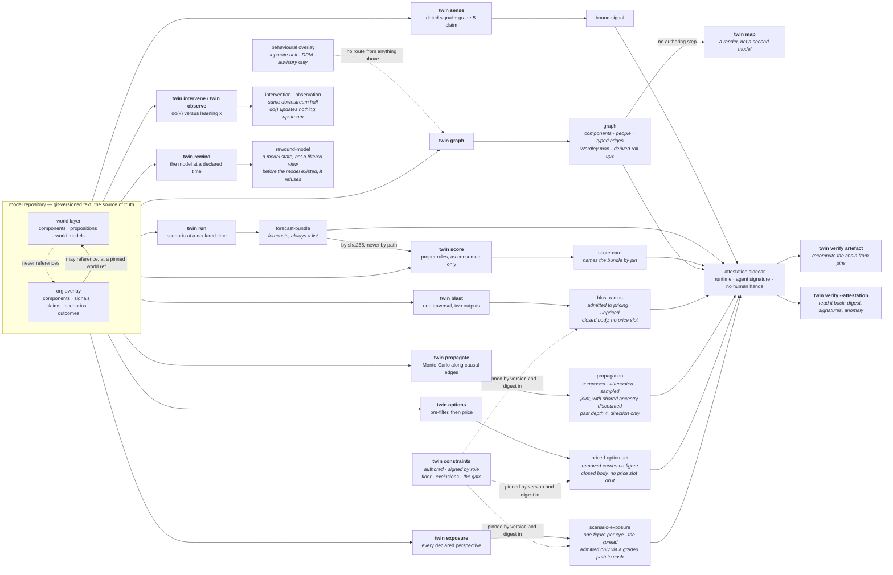

# `twin`

Most build tickets under `.scratch/twin/` are closed; 64 is instrumented and
measuring, not closed. One dated signal binds to a
component; one scenario execution emits forecasts — plural; one recorded outcome scores them under
proper scoring rules; any artefact recomputes from its own pins. Scoring is in the first slice
rather than retrofitted, because without it we cannot tell whether any later capability helped, and
because scoring dictates what every other component must record.

**This is 75 of 78 build tickets closed, and one measuring against a clock that runs
to 2026-11-06 and will not reach its own pre-registered coverage floor. See "The confirmatory audit
was not confirmatory", below.** (Recounted directly from `grep -l '\*\*Status:\*\* done' .scratch/twin/build/*.md`
rather than carried forward by hand — the previous banner, 73, was already one behind the live
count when build ticket 77's own recount found it. That is the same drift this file's own "What is
honestly built" section repeatedly finds and corrects, and the reason the count is a grep rather
than a number somebody remembers to increment.)
**Build ticket 66 built its refusal and did not close**, because criterion 1 is conjunctive and only
its second half exists: no merge capability, at two layers, and no pull request opened. It was
briefly marked done and then unmarked — see "Propose only, in two layers", below, for what is built
and what the numerator is still waiting on. Ticket 23's own checklist is closed, but the calibration
discipline it established (`twin/calibration.md`) sees no adoption yet — no committed triple in this repository
has been authored through it (see "Flux drift", below). What is not built is listed below and,
more usefully, is named inside every artefact the tool emits.

## Run it

```sh
bash twin/demo.sh                          # the whole loop, from a clean checkout
bash twin/beat-sequence.sh                 # the demo, in its declared order: b -> b -> c -> a
bash twin/beat-royal-mail.sh               # the falsifiability beat: rewind, project, score, red
bash twin/beat-intel.sh                    # the live beat: pinned, signed, unscoreable, says so
bash twin/beat-netflix.sh                  # the whole-engine beat: fear, seize, propose, price, curve
./bin/twin verify                          # the invariant suite
./bin/twin verify <artefact> --repo R      # recompute that artefact from its own pins
./bin/twin verify <artefact> --attestation # check its sidecar: digest, signatures, the anomaly
./bin/twin validate --repo R               # every object against its closed schema
./bin/twin graph --repo R --org netflix    # the typed knowledge graph
./bin/twin map --repo R --org netflix      # the Wardley map, rendered from that graph
./bin/twin blast --repo R --origin C       # what is downstream, and which of it may be priced
./bin/twin propagate --repo R --origin C   # compose a shock along causal edges, with attenuation
./bin/twin intervene --repo R --component C # do(x): cut the incoming edges, propagate downstream
./bin/twin observe --repo R --component C  # observe(x): belief updates about the causes too
./bin/twin rewind --repo R --at T          # the model state at a declared time (abduction)
./bin/twin backtest --repo R --org O --scenario S --regime as-consumed --at T # rewind, then run — one composition
./bin/twin run --repo R --scenario S --regime as-consumed   # the gate is required, with no default
./bin/twin regimes --repo R --scenario S   # the same scenario under all three, with the gaps
./bin/twin positions --repo R --org O --scenario S  # believed, rival, revealed — and the deltas between them
./bin/twin causal-accounts --repo R --org O --origin X --account A1 --account A2 # rival causal accounts, spread not privilege
./bin/twin trade-off --repo R --org O --origin X --perspective P --account A1 --account A2 # net cost of risk per response, across the account ensemble, marked default
./bin/twin sweep --repo R [--repo R2 ...]  # every scenario, every org, unconditionally — no --scenario
./bin/twin gameplay-sweep --repo R [--repo R2 ...] # every org, scanned for gameplay preconditions — opportunity candidates, unconditionally
./bin/twin reliability --score-card C1 --score-card C2 # bins over a pooled population, empty bins shown
./bin/twin severity --mu M --sigma S --threshold U --xi X --beta B --alpha A # loss-exceedance: VaR beside TVaR
./bin/twin severity-anchor --subject data-breach-loss --alpha A # the same curve, fit from cited public quantiles
./bin/twin substrate --repo R --org O --recipe F --checkpoint D # seven fidelity bands, and every plant scored against its own horizon
./bin/twin drift                           # the Flux drift measurement: coverage, events, no verdict
./bin/twin options --repo R --perspective P # the choice set after the pre-filter, survivors costed
./bin/twin exposure --repo R --scenario S  # one scenario, valued under every declared perspective
./bin/twin price --repo R --origin C       # a shock priced under every eye, responses beside it
./bin/twin constraints --out F             # the published constraint set, floor and exclusions
./bin/twin ontology --out F                # the named core ontology, generated from schema.py's own vocabulary
./bin/twin affected-parties --repo R --org O --out F  # who bears a modelled consequence with no perspective, alongside the constraint set
./bin/twin propose --repo R --org O --response X --channel policy|record --out F  # propose enacting a response; there is no verb that disposes
./bin/twin disparate-impact-audit --finding F --source S --out O      # raise a finding — sealed, never names the protected characteristic
./bin/twin disparate-impact-respond --audit A --response R --out O    # only the registered respondent role may close it
./bin/twin credibility --repo R --org O --subject S  # the world prior blended with an org's own sparse data
./bin/twin worksheet --repo P              # the pocket org against its hand-computed worksheet
./bin/twin sign <artefact> --role R        # accountability for an authored artefact
./bin/twin challenge --artefact A --claim-path P --reason R --out O   # dispute one claim in one artefact
./bin/twin resolve-challenge --challenge C --response R --out O       # names only what the challenge named
./bin/twin verify <artefact> --repo R --challenge C1 [--challenge C2 ...]  # shows open/resolved challenges too
./bin/twin grade                           # computed depth grades, with evidence
```

The tool itself needs only python3, PyYAML and git — all already used by `estate/`. The checks want a
venv, pinned to the same versions CI uses:

```sh
python3 -m venv .venv
.venv/bin/pip install 'pyyaml==6.0.3' 'pytest==9.0.0' 'mypy==1.14.1' 'types-PyYAML==6.0.12.20250516'
.venv/bin/python -m pytest -q
.venv/bin/mypy twin tests conftest.py --ignore-missing-imports --warn-unused-ignores
```

## The loop



Every artefact carries its pins, an authored/derived mark, and the computed depth grade of every
capability that produced it. Machine-varying facts — wall clock, host, interpreter — are absent
from the artefact and live in the sidecar, which is what lets identical pins give identical bytes
across architectures. The signature lives there too, for the same reason: a keyed value in the
envelope would break identical bytes on the first machine holding a different key.

## Two kinds of signature

A **human** signature asserts accountability for a judgement and binds to a **role** from the
versioned register in `twin/roles.yaml`, never to a named individual. An **agent** signature asserts
reproducible origin — runtime and tool version — and states in the artefact what it does *not*
assert: correctness, accountability, human review. The two are refused as a type error before their
values are even checked, so one can never stand in for the other.

The consequence is the interesting half. A derived artefact may carry the second and may **never**
carry the first, so a signature attests the *absence* of human involvement, CI-style. A derived
artefact with human fingerprints on it is a **detectable anomaly** rather than a breach of
convention: `twin verify <artefact> --attestation` reports it, on evidence.

`ponytail:` the mechanism is HMAC-SHA256 keyed from `TWIN_SIGNING_KEY`, and the ceiling is named in
`twin/sign.py` — **a shared key proves possession, not identity**, so anybody holding it can produce
any role's signature. The upgrade is sigstore/gitsign with in-toto subject digests. With no key
present nothing is signed and the sidecar says which variable is missing, rather than carrying a
placeholder that reads as signed.

## Two things the £ rests on, before there is a £

**The evidence ladder** (`twin/evidence-ladder.yaml`) is five typed grades, strongest first, each
with a written admission criterion: dated natural experiment, repeated historical co-movement,
literature or domain theory, calibrated expert judgement, model assertion. The grade travels *with*
the claim, and **only grades 1–2 may price a scored forecast** — grade 5 is exactly where
parametric contamination hides, because an edge a model asserted from training data looks identical
to a well-evidenced one unless something forces the distinction.

A grade is immutable without a **regrade event** recording who moved it and why. Two guards: at
load, the recorded chain must be contiguous and end at the grade the file declares; at `twin
validate`, the file's **git history** is read and every observed change must be covered by a
regrade. Direction is derived and named — `strengthened` (to a lower number) or `weakened` — because
"up" is ambiguous on this ladder, and strengthening is the direction to be suspicious of.

**The constraint set** (`twin/constraints.yaml`, published by `twin constraints`) is the universal
floor, the scope exclusions and the stated positions. The floor is not the operator's to move; a
perspective adds red lines beside it, and one that reuses a floor id does not load. Scope exclusions
name what the twin was *not* asked to model, which does not stop strategic non-modelling but does
remove its deniability. Three positions are required by name — no power layer (stated), exit-cost
asymmetry (unsolved), reflexivity and Goodhart-on-the-twin (deferred) — and covert sensing is
recorded as `permanently-excluded`, which the loader checks is not the deferral beside it.

The pricing threshold ships in the same artefact, because changing what may be priced is the same
kind of act as changing what may be chosen. A **second** threshold ships beside it —
`path_admission_threshold`, the grade a causal path to cash flow must hold before an impact enters
the £ at all. Two numbers rather than one reused, so widening the currency is an act somebody has
to perform and not a side effect of widening the use-gate.

## The pre-filter, and why it is not a very large price

`twin options` reads the candidate responses in an overlay, removes the ones that cross a
constraint in force for the named perspective, and only then costs what is left. The ordering is
the whole point: a price can be outbid, so with enough upside an optimiser finds the number that
buys a monstrous option, and a very large penalty still asserts that a number exists.

The ordering is **structural, not a convention**. Pricing is a method on the pre-filter's own
product, so the module exports no function that would take an unfiltered option and return a
number; and before it prices anything, that product **re-derives the filter** from the constraint
set it carries and refuses if the answer disagrees. The re-derivation is the lock that holds: the
construction sentinel alone was carried straight through `dataclasses.replace`, which is the
ordinary way to copy a frozen dataclass and therefore exactly the innocent refactor it claimed to
stop. A removed option is absent from the priced list and its record is closed to nine string
fields, so it has nowhere to put a figure — as a number or in words.

The pre-filter never reads a cost. That is why no input magnitude brings an excluded option back —
the magnitude is not an input to the decision — and the fixtures price both excluded options at
almost nothing so the property is demonstrable rather than asserted.

Ruin is perspective-relative. `stake-the-quarter-on-one-title` crosses the operator's declared
insolvency boundary and is removed under that eye; the staff council declares a different boundary
and the same option survives under theirs. The universal floor binds both.

## Propagation, and the three numbers it reports

`twin propagate` composes a shock along `influences` edges by Monte-Carlo. Every path reports
three things, side by side and never one instead of another:

- the **composed** triple — the point-wise product of the authored elasticities. Exact arithmetic,
  hand-checkable, and un-attenuated.
- the **attenuated** triple — the composed one scaled by the published depth schedule
  (`twin/attenuation.yaml`, versioned and pinned in the artefact).
- the **sampled** spread — PERT draws through the graph, so uncertainty compounds honestly instead
  of being averaged away. A product of modes is not the mode of a product.

Both the composed and the attenuated numbers stay in the output, because an attenuated figure whose
un-attenuated form was never shown makes the attenuation unfalsifiable.

Past depth 4 a path carries a **direction and no magnitude**. Not a small number — none, and no
`composed`, `attenuated` or `sampled` key to put one in. The path is still named, graded and dated,
because a direction a reader cannot locate in the graph is not a direction. A five-hop elasticity
chain is not a number.

The walk stops one depth past the schedule and reports at most 32 paths per component, ranked
best-evidenced first and truncated second. Simple-path enumeration is exponential in branching
factor: before the cap, a dense eleven-component graph produced a 331 MB artefact from 464 KB of
YAML, and 97% of it was paths carrying no magnitude. Every kind of pruning — depth, path count,
cycle — is disclosed in `traversal`, because an artefact that pruned silently is claiming a
completeness it has not got.

**Structural edges do not propagate.** A `needs` edge claims no mechanism, so nothing composes
along it; that exposure is the blast radius and it stays unpriced.

**Several paths out of one shock are reported separately and never summed** — they share
ancestry, so adding them double-counts. They are **combined**, which is a different operation
(build ticket 21). Each reached component with at least one path inside the attenuation boundary carries a `joint`
figure combined by **noisy-OR**,
`1 - prod(1 - influence)`, with the dependence carried **structurally**: a shared edge is drawn
once per Monte-Carlo trial, so two paths agree exactly to the extent that they share edges. The
stated assumption is that, conditional on the shared edges, the disjoint remainders are
independent; the stated limit is that a common cause the graph does not contain is not modelled
at all. Beside it sits `if_independent` — the same marginals under an independence assumption —
so the discount is a subtraction a reader can take rather than a correction they must accept. A
Gaussian copula on the path outputs was rejected: it needs a correlation matrix nobody in this
system authors, and it would impose a second dependence structure alongside the graph's own.

**`do()` and `observe()` are separate operations with separate types** (build ticket 22).
Observation propagates bidirectionally — learning a fact is evidence about what produced it.
Intervention propagates downstream only and **reports** the target's incoming edges as cut,
because doing a thing does not rewrite its own causes. Nothing is removed from the graph and
nothing needs to be: the walk runs forward from the target, so an incoming edge is never traversed
under either operation. The two downstream halves are byte-identical, and that is asserted rather
than assumed. `twin/primitives.py` gives each its own type, so a swap is
a `mypy` error rather than a runtime surprise, and the emitted intervention is refused if it
carries any upstream belief update at all. An updated ancestor is named, graded and located in the
graph and carries **no magnitude**: inverting an authored elasticity into a diagnostic number
needs a prior over the causes that nothing in this model authors.

**`twin rewind` is Pearl's abduction** (build ticket 35). The repository is the model and git
dates every version of it, so the past is a commit rather than a projection: rewind opens the
repository at the last commit on or before the declared time, and everything downstream reads it
unchanged. That is why `do()` at a past time needs no special case. A filtered view would fail on
the case that matters — it can hide rows added since, and it cannot restore an elasticity that was
later recalibrated, so a backtest through one would score the past with today's numbers.
Rewinding to before the model existed **refuses**, because an empty model is a claim about the
organisation rather than an answer about the model. So does a time that is not ISO 8601: git reads
a date it cannot parse as `now` and hands back the newest commit, so an unvalidated timestamp
would answer a question about the past with today's model and say nothing about having done so.

## The three information regimes, and why the gaps are the point

**`twin run` takes a regime and has no default** (build ticket 36). The regime a default would
pick is the one whose forecasts score, so an omitted flag would be a silent claim to have run
under the honest gate. A scenario cannot declare one either: an authored regime is a default
wearing a different hat, and the schema has no slot for it.

* **`as-consumed`** — only what the twin had ingested by T. Two filters, because there are two
  ways a post-T fact can arrive: the repository is reopened **as it stood at T**, and any fact
  that survives that but is *dated* after T is withheld.
* **`as-knowable`** — everything dated on or before T, whenever it was ingested.
* **`with-hindsight`** — unrestricted.

The differences are the diagnostic, and `twin regimes` computes them rather than leaving three
artefacts side by side for a reader to subtract. `as-consumed` versus `as-knowable` localises to
**sensing** — it was there to be found and we did not have it. `as-knowable` versus
`with-hindsight` localises to **interpretation** — nothing dated by T said it, so reading the
outcome as foreseeable from those facts is hindsight. Wrong under all three localises to the
**model**, and that third figure is reported as **not computed**, with the reason: a forecast here
reads a world model's declared belief and nothing infers it from a signal, so the three
probabilities are identical by construction and a residual of zero would read as "the model is
fine" rather than as "nothing consumes a signal".

**The gate is absence, not screening.** The model is *loaded through* the regime, so a withheld
fact is missing from the overlay the execution reads — there is no post-T fact available to
reference, and referencing one is not a mistake the code could make. A claim goes with the signal
it binds, because a reading of a document the twin did not have is not a claim the twin held.

**A withheld fact that the execution could still have reached is a refusal.** A post-T fact bound
by a claim to a component the scenario forecasts stops the run rather than being redacted from it,
because running a scenario whose subject matter has been redacted answers a different question —
under the one regime whose forecasts score. The answer key is the deliberate exception: it is
dated after T by definition and nothing forecasts it, so it is withheld quietly. Refusing on its
presence would make a backtest impossible in every repository that holds the key it will be scored
against.

Two limits are named in `twin/regimes.py` rather than implied. **The rewind leg needs a repository
that existed at T** — the Netflix subject is dated 2011 and its model repository was built this
year, so `as-consumed` there rests on fact dates alone and the artefact records
`ingestion_history.available: false` with the consequence. Only the regime fixture's commit
history straddles T, which is why the sensing gap needs it. And **a regrade is not date-gated**:
`schema.DATED_FACTS` covers facts about the world, and a regrade is the twin's own record of how
strong a claim is.

## `twin backtest`, and all four operations from two primitives

Decision ticket 13 Q2's claim is that the whole product surface is compositions of exactly two
primitives — time (`rewind`) and intervention (`do`/`observe`) — and that claim was untested until
build ticket 37 demonstrated all four: **projection** (fast-forward) is `twin run` with no
intervention; **act-now** is `twin intervene` with no rewind; the **counterfactual** is
`primitives.rewind()` followed by `twin intervene`; the **backtest** is `primitives.rewind()`
followed by `twin run` — literally, not by convention. `cmd_backtest` calls exactly
`primitives.rewind` and `verbs.run` and nothing else, checked against its own source by harness
guard `backtest_is_a_pure_composition` rather than trusted from its docstring — the same discipline
`prefilter_precedes_pricing` applies to `twin/options.py`'s public surface.

**The composition computes what `run()` already computes, not a second implementation of it.**
`run()`'s own `as-consumed` regime already rewinds internally through `regimes.read_at()`; calling
`primitives.rewind()` explicitly first and then `run()` at the same time produces a
byte-identical forecast to calling `run()` alone, save for which command is recorded as having
produced it (`tests/test_four_verbs.py::test_backtest_and_run_compute_the_identical_forecast`).
That redundancy is the point: it proves the explicit two-primitive composition and `run()`'s own
internal machinery are the same mechanism, not two mechanisms that happen to agree today.

`twin backtest`'s own subject-matter limit is the one `twin/regimes.py` already names: the netflix
fixture's git history begins 2026-01-01, so a rewind to the `dvd-decline-2011` scenario's own
declared 2011 date refuses honestly (`PrimitiveError`) rather than answering with today's model
wearing 2011's date. `tests/test_four_verbs.py` backtests at `2026-01-01` instead — the one date
this synthetic fixture's own history can actually support — to demonstrate the mechanism rather
than a historically faithful Netflix backtest, which decision ticket 22's demo-slice work (co-
flagship scoring) is where that belongs.

Scoring is not folded into `backtest` — it emits a `forecast-bundle`, the identical artefact kind
`run()` emits, and the existing `twin score` runs on it exactly as it would on `run()`'s output
(`tests/test_four_verbs.py::test_a_backtest_scores_against_the_record`). `reproduce.py`'s `VERBS`
now names `backtest` too, reusing `run()`'s own replay branch rather than a second one: a
backtest's pins are the rewound commit `primitives.rewind` already resolved to, so replaying it is
replaying `run()` against a repository already opened at that pin.

## The Carillion answer key: the primary backtest, and a repository that actually has history

`fixtures.build_carillion_org()` (build ticket 38) is the primary backtest key research chose
(`.scratch/twin/research/opportunity-cases.md`, `.scratch/twin/research/flagship-osint-scoping-wave2.md`) for **low notoriety
over fame**: a model that flags Carillion is not distinguishable from one that has memorised Enron
unless the key itself is obscure enough that reciting it is not an option. Carillion is unusually
well-instrumented for this — a free, dated, statutory FCA short-position disclosure regime and a
joint parliamentary inquiry (HC 769) give contemporaneous, adversarial ground truth rather than a
cooperative survivor narrative.

Eight signals, each a real, dated, publicly documented fact, cited by URL: three RNS trading
updates (7 Dec 2016, 1 Mar 2017, 3 May 2017) the FCA's 2022 decision notices later ruled
"recklessly ... misleading" for not disclosing the UK construction business's true deterioration;
three profit warnings (10 Jul, 29 Sep, 17 Nov 2017); a reported short-interest position (30 Sep
2017); and the compulsory liquidation itself (15 Jan 2018). **HC 769 is cited only on the outcome,
published 16 May 2018** — never on a signal, because it postdates every one of them and using it to
date a signal would let hindsight into ground truth that is supposed to be contemporaneous. The
outcome declares `contamination: low`, the same field build ticket 40's discount reads.

**This repository's own commits are dated to match, in order (2016-11-01 through 2018-05-17) —
the discipline `build_regime_org` established — so `twin backtest --at 2017-08-01` reads a
repository that genuinely existed then.** That is the one thing the main netflix/intel fixture
cannot do: netflix's `dvd-decline-2011` scenario is dated 2011 but its repository was built this
year, so `regimes.ingestion_history` there reports `available: false` and `as-consumed` rests on
fact dates alone. Carillion's does not — `ingestion_history.available` is `true` at every date
`tests/test_carillion.py` tries, because a real commit exists to resolve to.

The world layer's proposition is deliberately generic (`contractor-enters-insolvency-by-2018`),
the same way netflix's own proposition never says "Netflix": `world_never_references_overlay`
refuses a component or world model that names the tenant, so Carillion's name lives only in the
`carillion` overlay, where a tenant is expected to appear.

## Two further keys, and one honest notoriety finding

`fixtures.build_nmc_health_org()` and `fixtures.build_wirecard_org()` (build ticket 39) add two
more real, dated, publicly documented backtest keys, to the same contract Carillion's does, so
Carillion alone does not carry the falsifiability claim. Ticket 39's own AC asked for the
low-notoriety claim to be **evidenced, not asserted** — and evidencing it produced a finding
rather than a rubber stamp. NMC Health earns `contamination: low` on Carillion's footing:
specialist financial-press coverage only, no book, no documentary. Wirecard does not — a
bestselling book, a Netflix documentary and mainstream coverage the size of Enron's earn it
`contamination: high` instead of spec story 45's shorthand grouping of all three as
"low-notoriety". `CONTAMINATION` (`twin/schema.py`) already reserved that value; build ticket 40's
Enron-versus-obscure gap should draw its "obscure" leg from Carillion or NMC Health, not Wirecard.

Sourcing NMC Health's key cost more than the diff shows: most real, on-topic citations for it —
including the FCA's own Final Notice — name the company with the hyphenated slug `nmc-health`,
which `no_special_category_slot` refuses everywhere a string is scanned, deliberately and by
design (the word "health" is an Article 9 category, context-free — "a false positive costs an
author one rename"). The org id became `nmc`; two citations were swapped for real alternative
coverage of the identical facts. No signal was weakened or dropped to work around it.

## Enron as contamination control, and the hindsight-resistance pair

`fixtures.build_enron_org()` (build ticket 40) is not a fourth low-notoriety key — the opposite.
An LLM asked about Enron has read the ending, so "flagging" it in 2001 is indistinguishable from
reciting it in 2026. It is carried deliberately as a **control**, to the same dated-and-cited
contract Carillion/NMC/Wirecard hold: four real signals (the CEO's sudden resignation, 14 Aug
2001; the Q3 loss and equity writedown, 16 Oct 2001; the 1997-2000 restatement, 8 Nov 2001; the
Chapter 11 filing, 2 Dec 2001), the Powers Report cited only on the outcome (published just over
two months after resolution, 1 Feb 2002), and `contamination: control` — the value
`CONTAMINATION` (`twin/schema.py`) reserved for exactly this fixture rather than `"low"`.

`scoring.measure_discount()` turns the contamination threat into a number: the mean-loss gap
between an obscure key's score population (Carillion or NMC — never Wirecard, per ticket 39's own
finding) and Enron's, quantised, never a literal — a harness guard recomputes it against two
different synthetic populations at CI time and refuses if they match, and two pure-function tests
assert it moves when the underlying scores do. `twin score --discount-enron <card>...
--discount-obscure <card>...` folds a measured discount into any score card: raw `brier`/
`log_loss` stay untouched, `discount` and `adjusted_<rule>` sit beside them, and
`contamination_discount` on the card body is `None` — never a fabricated zero — when no discount
was supplied. The discount is pinned by digest, never by path, the same reason `--forecast` is
recorded as `forecast_sha256`; a discount-carrying score card honestly refuses to replay from its
pins alone, the identical limit `twin reliability`'s own pooled score-card inputs already carry.

`fixtures.build_astrazeneca_org()` and `build_sanofi_org()` (build ticket 41) are an inverse pair
of **hindsight-resistance controls**: cases where the contemporaneous record contradicts the
canonical story, so confident agreement with the canonical story is evidence of memorisation, not
skill. AstraZeneca rejected Pfizer's bid in May 2014 and was punished for it — shares fell 11-13%,
a named ~2% holder (Schroders) was publicly critical — and is now retold as visionary, as recently
as a 2 Aug 2026 piece framing a prospective Bristol Myers Squibb megadeal as "twelve years after
spurning" Pfizer. Sanofi exited diabetes/cardiovascular for GLP-1 obesity in December 2019 and was
approved for it (+5% on the day, no contemporaneous criticism), and is now retold as a strategic
miss once a rival's obesity drug became a blockbuster from 2022. Each fixture carries **two world
models** on one scenario — `contemporaneous-consensus` reasons from what was knowable at the time,
`canonical-hindsight-consensus` reports the belief a system reciting the now-common story would
hold — so `no_collapse_mechanism` already forbids collapsing the two forecasts one execution
emits, and scoring both against the *contemporaneous* outcome is the inversion: no special-cased
scoring code, just a canonical story that disagrees with the recorded ground truth.
`hindsight_trap: true` on the outcome (`twin/schema.py`) makes that explicit in the score card.
Both cases demonstrate the point through the real CLI: `canonical-hindsight-consensus` scores
markedly worse (higher brier and log-loss) than `contemporaneous-consensus`, and their own gap
folds into the identical `measure_discount()` rather than sitting beside it as a second number.

## The co-registered forecast book: selection and quarantine

`twin/benchmark.py` (build ticket 57) is the first half of decision ticket 21's external gate —
the one mechanism the memorisation problem cannot reach, because a forward-dated question cannot
be in any training corpus. Two mechanisms, both decided at ticket 21 Q1/Q2 and neither built
before this ticket.

**The selection rule is mechanical, versioned and pre-registered, not a per-run judgement call.**
`twin/benchmark-selection-rule.yaml` states everything in resolvable terms — a liquidity
threshold, a resolution-horizon window, a category list — the same discipline
`twin/evidence-ladder.yaml`'s thresholds carry, and a change to it is a dated diff in this file's
own git history rather than invisible drift. `select_questions()` applies it and nothing else
decides which questions are drawn: candidates are sorted by id before anything touches them, so
arrival order cannot bias what a volume cap keeps, and the one place chance enters is decision
ticket 21 Q2's own named exception — "(c) random sampling as a volume valve if the rule selects
too many" — drawn from the rule's own committed seed, so a re-run against the identical pool
selects the identical subset. **The full confidence range is demonstrated, not claimed:**
`BenchmarkSet.spans_full_confidence_range()` is true only once every declared bin holds at least
one selected question, checked against the emitted `distribution` rather than asserted in prose.

**The quarantine is a scan across ingestion provenance, never a single named field.**
`audit_quarantine()` serialises each ingestion-provenance record whole and checks it for a
substring match against every quarantined question id, so a breach hiding in a nested field — a
recipe id, a source string, a claim's own text — is caught rather than only a field a caller
happened to check. Nothing here reads a timestamp, which is what makes the quarantine hold "at
any lag": an old record and one audited long afterward are scanned identically, and
`tests/test_benchmark.py` plants a breach at both.

**The residual limit is stated, not papered over (decision ticket 21 Q1).** A clean audit proves
*no direct ingestion* of a quarantined id. It says nothing about whether the twin's priors were
shaped by market-adjacent information arriving some other way — narrowing that gap is temporal
separation's job (build ticket 58), not this ticket's. `twin/capabilities/forecast-book.yaml`
records the honest state: one of decision ticket 21's six acceptance criteria is checked by this
ticket's code, the other five (venue, blind emission, claim scope, the rest of circularity,
proportionality) are build tickets 58 and 59's, so the capability grades `partial`, never `full`.

## Blind pinned emission, resolution scoring, and the narrow claim

`twin/forecast_book.py` (build ticket 58) builds decision ticket 21's second mechanism —
**temporal separation** — on the *same* questions build ticket 57 selects: a forecast pinned and
signed **before** its question's resolution window opens, so *"we forecast before we looked"* is
provable rather than assured, and a resolution scored against that exact pinned emission once the
question resolves.

**Blind by construction, not by review.** `emit()` refuses to build a `forecast-emission` artefact
timed at or after its question's own declared `resolution_window_opens_at` — checked at the
boundary itself and past it, the same "gate, not an assurance" discipline
`as_consumed_admits_no_post_T_fact` (`twin/regimes.py`) uses for a different post-T leak.
`is_blind()` is the *same* function that refusal calls internally, so an auditor holding nothing
but the artefact's own recorded body — not the code that built it — can recompute the identical
check later rather than trust that it fired. Timestamps are fixed-width `YYYY-MM-DDTHH:MM:SSZ`,
validated by regex and compared as plain strings, the identical discipline `twin/regimes.py`'s
`cutoff()` already uses for its own dated cutoff, so blindness is a string comparison someone can
redo by eye rather than a parser someone has to trust.

**Signed and pinned through the existing machinery, reused rather than reinvented.** `emit()`
returns a `derived` `Artefact` — precisely the shape `twin/attest.py`'s `build()` already
agent-signs and refuses a human signature on (`derived_never_human_signed`, unchanged): a forecast
computed entirely from its own pins is not a judgement anybody signs off on.
`tests/test_forecast_book.py` exercises this directly against the real `twin/sign.py`/
`twin/attest.py` code, not a stand-in: a genuine agent-signed sidecar round-trips clean through
`attest.check()`, and a hand-built human signature on an emission is refused.

**Resolution scoring is co-registered, not merely same-named.** `score_resolution()` takes no
question id or timestamp as a fresh parameter — both travel from the pinned emission's own pins
and body, so a resolution can only ever be scored against the exact question and the exact
emission it was pinned to, never a same-id stand-in supplied out of step. A doctored emission
whose body no longer attests blindness against its own recorded timestamps is refused rather than
scored — a defence against a forged or hand-edited artefact, not only against the honest path
`emit()` already gates. Scoring itself calls `twin/scoring.py`'s `score()` directly; both the test
suite and the harness guard assert the output reproduces `brier`/`log_loss` bit for bit, so a
second scoring implementation cannot quietly drift from the first.

**Observe-only is structural (decision ticket 21 Q4).** `twin/forecast_book.py` exposes exactly
three functions — `emit`, `score_resolution`, `is_blind` — asserted as an **allow-list**, the same
discipline `prefilter_precedes_pricing` uses on `twin/options.py`: a differently-named
position-placing function would still be caught, not only one matching an obvious keyword. There
is no function here that takes a stake, a side or an order, and every emission's body also records
`observe_only: true, position_placed: false` directly.

**The narrow claim scope travels with every result (decision ticket 21 Q5).** `CLAIM_SCOPE` is
carried in the body of both the `forecast-emission` and the `resolution-score` artefacts, not
stated once in prose: `evidences` names non-overconfidence in general world-forecasting on a
pre-registered, blind, co-registered question set; `does_not_evidence` names Wardley propagation,
the causal elasticities, £ pricing and the org-specific overlay explicitly; `residual_limit`
restates decision ticket 21 Q1's own honesty condition — the quarantine (build ticket 57) proves
no *direct* ingestion, never that the twin's priors were unshaped by market-adjacent information
arriving some other way.

**Three more of decision ticket 21's six acceptance criteria are honestly ticked** — venue +
observe-vs-participate, the blind-emission protocol, the claim-scope statement — moving
`forecast-book` from build ticket 57's 1/6 to **4/6**, still `partial`. What stays unticked:
circularity's remaining half (wiring the quarantine onto a *live* ingestion path is build ticket
59's, once price moves actually enter as signals) and the proportionality verdict, which is a
judgement already recorded in decision ticket 21's own resolution text rather than a code artefact
any build ticket computes.

## Price moves as world-layer signals, never price levels as probabilities

`twin/market_signals.py` (build ticket 59) is the "signal source" half decision ticket 21 Q1(b)
names, beside build ticket 57's "benchmark" half. Research 17's load-bearing finding is specific
rather than fastidious: Mincer–Zarnowitz regressions reject unbiasedness **in every subsample
tested** (Bürgi, Deng & Whelan 2026), worst in the **low-price tail** — exactly the region this
system exists to price. "Use only liquid markets" does not fix it: the null is rejected in every
liquidity quintile and every trade-size quintile. So a price *level* never enters this system as a
probability; a price *move* — the derivative, a dated externally-authored event — does, through
the normal sensing path.

**The refusal is a mechanism, not a comment.** `as_probability()` exists for exactly one reason: to
be the function a future caller reaches for when tempted to turn a price into a belief, and it
raises `PriceLevelAsProbabilityError` unconditionally, citing the bias evidence in its own message,
with no warning path a caller could silence. `price_moves()` computes the derivative between
consecutive dated observations of the same question and nothing here has a field named
`probability` or `implied_probability` — the two levels a move was computed from survive only as
`from_level`/`to_level`, explicitly labelled.

**Price moves ingest through the identical mechanism build ticket 53 already proved at volume.**
`market_signal_run()` turns each move into a dated statement ("kalshi price for 'X' moved from
0.08 to 0.19 between ... and ...") and runs it through `signal_classify.classify()` unattended, the
same no-human-gate pipeline `twin/ingest.py` exercises over synthetic substrate — automated output
stays grade 5 by construction, trusted downstream rather than gated at entry, exactly as decision
ticket 11 Q2 already decided for every other signal this system senses. Every emitted artefact
cites the bias evidence verbatim in its own body, so a reader never has to go find the finding to
understand why a level is missing where a probability might be expected.

**Decision ticket 21 Q1(b)'s "signal source vs benchmark" split now holds end to end, not just on
paper.** A quarantined question id (`twin/benchmark.py`, build ticket 57) is excluded **before**
`signal-classify` ever runs — proactive, not only auditable after the fact — and the harness guard
`price_levels_never_probabilities` runs build ticket 57's own `audit_quarantine()` over this
pipeline's live ingestion-provenance output and requires it clean, so the two mechanisms are
asserted together rather than trusted to agree. `twin/capabilities/forecast-book.yaml` AC5 ("the
circularity question resolved — signal source vs benchmark") ticks on that evidence, moving
`forecast-book` to 2/6. The other four criteria — the venue/observe-only decision in code, the
blind pinned-emission protocol, the published claim-scope statement, and the proportionality
verdict — stay open for build ticket 58, whose own job is the benchmark's blind-emission half, not
this ticket's live signal-source half.

**This is also the sixteenth and last invariant the constitution names activating** —
`twin/invariants/manifest.yaml` now carries zero `pending` entries. That retired an unstated
assumption two suite-guard tests carried (`tests/test_invariant_suite.py`): both fished "any
pending entry" out of the real, committed manifest as their own test subject, which is exactly the
kind of thing that stops existing once every invariant has activated. Fixed by decoupling each
test's subject from the manifest's live state — a synthetic pending entry for one, `may_skip`'s own
rule checked against a name provably absent from the live set for the other — never by weakening
either check itself.

## The proportionality verdict

`twin/benchmark.py`'s `proportionality_verdict()` (build ticket 84) closes decision ticket 21's
last acceptance criterion — "is it worth building at this coverage?" — the one build tickets
57-59 left as a judgement in the decision ticket's own prose rather than a code artefact. It lives
beside `SelectionRule`/`BenchmarkSet` rather than in `twin/forecast_book.py`, because that module's
own public surface is a deliberately closed allow-list (`forecast_book_is_blind_by_construction_and_observe_only`)
and a fourth function there would need a harness-guard change this ticket found no genuine reason
to make.

**A derived verdict, not a fresh opinion.** Every number the verdict is checked against is read
off what is actually delivered: `question_count` and `spans_full_confidence_range` come from the
real `BenchmarkSet` `select_questions()` draws against the live, committed
`twin/benchmark-selection-rule.yaml` — never a target this function invents — and
`capability_share` is computed from `len(list(caps))`, the live count of
`twin/capabilities/*.yaml`, rather than the "~10%" figure decision ticket 21 cites from research.
`resolution_cadence` states a real measured figure when resolutions are supplied and honestly
states "not yet a measured one" against the pre-registered horizon window when none are — this
suite reaches no live venue, `twin/market_signals.py`'s own admission, so an empty list here
states the gap rather than inventing a cadence.

**The verdict is exactly one of three words, each earned by a structural fact, the same shape
`twin/verdict.py`'s `decide()` uses for the Flux falsification question.** `no` when the delivered
set is empty — no coverage exists to weigh a cost against. `conditional` when the set is
non-empty but fails the rule's own `spans_full_confidence_range()` bar — the machinery holds, the
coverage the verdict would be proportionate to has not yet been delivered. `yes` only when both
hold, and only then does decision ticket 21 Q3's own resolved cost/benefit framing get cited into
the artefact verbatim: a low marginal cost (`MARGINAL_COST` — three already-built components,
tickets 57-59, layered on the scoring harness ticket 20 put in the first slice) against a value
disproportionate to a thin coverage slice (`DISPROPORTIONATE_VALUE` — the only falsification
mechanism in this project that cannot be contaminated by construction).

**Where this stops.** The cost/value framing is decision ticket 21 Q3's own resolved reasoning,
cited rather than re-derived from first principles — this artefact makes that reasoning checkable
against live delivered numbers; it does not re-litigate whether the reasoning itself is correct.
Against the committed rule and a pool shaped to satisfy it (`tests/test_benchmark.py::test_the_committed_rule_yields_a_yes_verdict_against_a_spanning_pool`),
the verdict reads `yes`.

## Believed, rival, revealed — and no privileged map

`twin positions` (build ticket 16) is the other half of "no code path collapses an ensemble": once
several positions exist, the *deltas between them* are the point, not merely their separate
display. A believed map and a rival forecast are typed identically — both are ordinary
`world-model` objects, distinguished only by the name their author gave them — and revealed truth
is not even a world model: it is derived from a resolved `outcome`, so there is no schema slot
anywhere a privileged "actual" map could occupy.

Every unordered pair of named positions gets a plain delta, `|a - b|`, because there is no ground
truth between two forecasts to score against. Every position with a resolved outcome to compare
against also gets the same proper score (`twin/scoring.py`'s Brier and log loss) any forecast
gets — the twin's own default reference travels through the identical call as a rival's id, with
no branch anywhere that treats one specially.

**Dropping any one position changes nothing about the rest.** Removing the org's own believed map,
or the twin's own default reference, from the set still computes, and the survivors' own figures
do not move — demonstrated on the netflix fixture in `tests/test_positions.py` and asserted at the
suite level by harness guard `position_deltas_have_no_privileged_default`. Nothing here classifies
which id is "believed" versus "rival": that would itself be the schema-level privilege the ticket
refuses, so the module treats a scenario's whole `world_models` list identically and lets each
world model's own `name` field carry whatever role its author gave it.

## Rival causal accounts, and the ensemble spread they carry

`twin causal-accounts` (build ticket 32) gives the causal layer the same treatment `twin
positions` gives belief: `positions.py` already lets rival **world models** — belief
probabilities — coexist with no privilege between them, but two evidenced people can also
disagree about *how, mechanically, a shock actually propagates*, and until this ticket nothing
represented that. A `causal-account` (`twin/schema.py`) is a named, **sparse** set of overrides on
specific causal edge ids — most of a graph is never in dispute, so an account exists to say where
it differs, not to re-author everything — and `Overlay.causal_graph(account_id)` reads it beside
the overlay's own `edges` collection, which is itself just another nameable account with no code
path privileging it.

`twin/causal_accounts.py`'s `ensemble_spread` propagates each named account's own graph
independently (`twin/propagate.py`, unmodified) and compares the primary path's attenuated mean at
every reached component — the **spread between accounts, not either account's figure alone, is
the reported uncertainty**. On the netflix fixture, `netflix-base-case` restates the overlay's own
`streaming-displaces-dvd` edge, and `rival-aggressive-cannibalisation` / `rival-conservative-view`
each claim a materially different magnitude and lag for the same edge — three genuinely rival
accounts of the same causal claim, exercised in `tests/test_causal_accounts.py`.

**Adjudication is by calibration, never by authorship or recency — structurally, not by
convention.** The `causal-account` schema is closed to `id`/`name`/`edges`/`note`: there is no
field for an author or a date, so nothing could rank one account above another by either even if a
caller wanted to. Harness guard `causal_accounts_have_no_privileged_default` asserts three things
at once: dropping any one of the three named accounts changes nothing about the others' own
figures; propagating a named account's graph and propagating `overlay.graph()` directly reach the
same components (there is no special "primary" code path); and a `causal-account` document
carrying a planted `author`/`created_at`/`priority` field does not load. This module builds no
calibration mechanism of its own — rival causal accounts do not themselves emit the scoreable
forecasts `twin/scoring.py` grades, a world model still does that via `twin run`/`twin score` — so
"adjudicated by calibration over time" is a property this ticket makes representable, not a
scoring loop it closes.

## Contestability: arguing with the artefact is the workflow

`twin challenge` / `twin resolve-challenge` (build ticket 60) make good on the unifying principle
the constitution states outright: **a single number ends a conversation; a map sustains one.**
A challenge is a versioned, signed, authored artefact (the same shape `twin constraints` is)
naming exactly one claim in exactly one artefact — a dotted key-path, the same format
`canon.walk_values` already produces — and freezing the value it disputed at the moment it was
raised, so a later edit to the challenged artefact cannot retroactively change what was contested.

**No hiding behind aggregation, structurally rather than by review.** `challenges.resolve()` takes
no `claim_path` parameter: the path a resolution addresses is read out of the challenge it
resolves, so there is no argument through which a resolution could talk about a roll-up instead of
the constituent that was actually disputed. `refuse_answering_a_different_claim` is the second
lock, for a resolution ever built by a path other than `resolve()` itself — the same double-lock
`primitives.refuse_upstream_under_intervention` is for an intervention's body. Harness guard
`a_challenge_to_a_constituent_survives_an_unrelated_resolution` demonstrates the failure mode
directly: a resolution exists on the same artefact, for a *different* claim, and the original
challenge still reports open.

**Visible wherever the challenged artefact is visible, not a hidden queue.** `twin verify
<artefact> --challenge C1 --challenge C2` prints every open and resolved challenge against that
artefact before reproducing it — `challenges.for_artefact()` is the one function that decides what
counts as open, so a reader of any tool built on it sees the same state rather than each caller
inventing its own notion of "resolved". Two roles (`challenger`, `challenge-resolver`) join the
register signatures already bind to, never a named individual.

## The affected-parties register and the disparate-impact channel

Decision ticket 15's Q4 named two mechanisms nothing yet delivered: "an affected-parties
register — outsiders bearing modelled costs are named, though outside the currency" and "a
sealed audit channel for disparate impact, or an explicit admission the system cannot be checked
for it." Build ticket 61 closes both. Neither constrains power — the spec is explicit about
that, and `twin/constraints.yaml`'s own `power-asymmetry` scope exclusion says so — but
invisibility is a separate harm from powerlessness, and this one is addressable.

**The register is authored per scenario, not bolted on afterwards.** `twin/schema.py`'s
`scenario` schema carries a required `affected_parties` field, and `list_of` is already
non-empty-only — the same rule `components`/`world_models` already carry — so a scenario cannot
satisfy "populated" with an empty list either. `twin/affected_parties.py` does no authoring of
its own: `register()` flattens every scenario's own declarations in an overlay, and
`twin affected-parties --repo R --org O --out F` emits it as a derived artefact carrying
`constraints.pin()` — the identical version and digest `twin constraints` itself reports, which
is what "published alongside the constraint set" means structurally rather than by convention.

**Sealed, the same way the model itself is sealed.** A disparate-impact finding is necessarily
made *outside* the twin — the model cannot represent a protected characteristic anywhere
(`no-special-category-representation`, the universal floor) — so `twin/disparate_impact.py`'s
`twin disparate-impact-audit --finding F --source S --out O` runs the identical
`refuse_special_category` refusal the model repository runs on every field it validates. An
auditor reports what differs and where it was checked; the channel that reports what the twin
cannot see is bound by the same refusal, not exempted from it.

**A defined respondent role, structurally rather than by convention.** `twin
disparate-impact-respond --audit A --response R --role disparate-impact-respondent --out O`
refuses a response naming any role but that one — a new entry in `twin/roles.yaml` — even when
the role supplied is itself registered for something else. A route anybody could answer has no
defined respondent.

## The misuse catalogue, and logging a constraint removal with what it was worth

`twin/misuse-catalogue.yaml` (build ticket 62) closes decision ticket 15's carried-forward item:
seven entries, each naming a **mechanism**, not just a risk — a risk is a sentence anyone could
write, a mechanism is the code a reader can go and check (`prefilter_precedes_pricing`,
`derived_never_human_signed`, the regime gate, this ticket's own removal log, build ticket 60's
`refuse_answering_a_different_claim`). Six of the seven point at mechanisms that already existed
before this ticket; the catalogue is what makes them legible as a *set*.

**Attractiveness is computed, never stated — a property of the code, not a habit of whoever calls
it.** `misuse.log_removal()` carries no float parameter anywhere in its signature (harness guard
`a_constraint_removal_with_no_computed_attractiveness_is_rejected` checks the signature itself,
not just correct usage of it): the only way to produce a figure is to name a perspective, an
option and the constraint being removed, and `compute_attractiveness()` re-runs
`twin/options.py`'s own `prefilter()` with that one constraint stripped from the perspective's own
declarations. On the netflix fixture, `the-operator` declares `insolvency` itself and
`stake-the-quarter-on-one-title` crosses it — removing it re-prices that option at its real,
authored cost rather than a number typed into a log.

**Only a perspective's own declared constraint can be removed this way.** The universal floor is
not a perspective's to remove — `refuse_floor_override` already forbids a perspective from even
shadowing a floor id — so `compute_attractiveness` refuses when the named constraint is not one
`the-operator` (or whichever perspective) declares itself. Removing a floor constraint is a
governance-document edit, a larger and separate act this module does not cover.

**A removal with no attractiveness record is rejected.** `verify_removals()` compares a
perspective's declared constraint ids before and after and demands a matching log entry for every
one that disappeared — logged per perspective, so a removal recorded against one perspective does
not silently cover the same constraint id removed from another.

## The admission ladder, DPIA triage, gameability and the fast-improvement backstop

`twin/ethics_gate.py` (build ticket 47) is `ethics-gate`, the sixth and last of the six skills seam
3 (build ticket 42) exists to evaluate, and the first build ticket to give decision ticket 15's own
resolution a mechanism rather than only a paragraph — the reconciling doctrine "model the mechanism
universally, sense sparingly" now has code that a sensor proposal actually has to pass.

**The ladder stops, structurally.** `walk_ladder()` walks purpose, then necessity, then
proportionality, in that order, and a failing rung ends the loop before the next rung's check
function is even called — the harness guard proves it by handing the necessity and proportionality
rungs a payload that would raise if either were ever read, sitting behind a purpose rung that
fails first, and `walk_ladder()` does not raise. Purpose asks whether a named scenario will act on
this sensor at all — a sensor feeding nothing is surveillance for its own sake. Necessity is a
computed intrusiveness ranking, not a hand-wave: structural outranks behavioural, aggregate
outranks cohort, cohort outranks individual, decision ticket 15 Q1's own words, and the rung fails
the moment any considered alternative is less intrusive than the one chosen. Proportionality
compares an illuminated value against an intrusion cost directly — "computable, not a hand-wave" —
and every evaluated rung carries a non-empty `justification`, on a pass as much as a fail.

**The DPIA gate and the ladder are two distinct checks, exercised as two.** `dpia_triage()` names
the ICO's own 2023 monitoring-guidance triggers (research 05 Part B.2): email or message
monitoring, keystroke monitoring, biometric data, profiling, or a risk of financial loss to the
worker. `admit()` combines the two: a sensor is admitted only when the ladder passes **and**, where
a DPIA is mandatory, the payload records it complete — so a proposal can fail for either reason, and
`tests/test_ethics_gate.py::test_admit_refuses_when_dpia_mandatory_and_not_complete_even_though_ladder_passes`
demonstrates the ladder passing while the DPIA gate alone still blocks admission. Together with
build ticket 07's pre-existing, unchanged detachment of the behavioural overlay as a separately-
gated store, this is decision ticket 15's own resolution of its operational-gate criterion,
verbatim: "admission requires passing the ladder + a DPIA."

**Gameability is a first-class, recorded attribute, not vigilance.** `classify_gameability()`
marks a sensor `goodhart-proof` only on positive evidence that gaming its metric requires doing the
genuinely desired thing (decision ticket 15's own worked example: a bus-factor score gamed by
actually spreading knowledge); everything else — decision ticket 15's own named examples, commit
counts, message sentiment, hours-online — falls to the safe default, `marked`. `prefer()` is the
preference rule itself, applied to a set of candidates and recording which it chose and why, rather
than a stated intention nothing reads.

**Fast improvement is a flag, never a verdict — checked the same way `no_recommended_action_field`
is.** `flag_fast_improvement()`'s own output has nowhere to put an adverse finding: its keys and
prose are scanned against the identical banned-word/phrase lists that invariant runs
(`trade_off_curve_reports_disagreement_never_a_scalar` and
`gameplay_lens_is_grade_5_and_reports_no_recommendation` are the two prior re-assertions), so
"suspicion, never a verdict" is a property of the code rather than a habit of whoever reads it. The
only way a flag becomes an actual finding is `adjudicate_fast_improvement()` — refuses to run
against a flag that was never raised, and refuses a role the register (`twin/roles.yaml`) does not
carry — the same "inferred/flagged first, human second, and the human is scored too" shape
`twin/evolution_judge.py` established for evolution positions.

**`twin/capabilities/ethics-gate.yaml` exists for the first time, and ticks three of decision
ticket 15's five criteria.** AC 1 (the admission rule) and AC 3 (the Goodhart position) and AC 5
(the operational gate mechanism) move to checked, each citing this ticket; AC 2 (the sensor set
itself) stays open because decision ticket 15's own resolution carries it forward as a build-time
artefact, not a decision this ticket makes; AC 4 (a named misuse catalogue) also stays open —
`twin/misuse-catalogue.yaml` (build ticket 62) is a real, tested artefact, but it names misuses of
the twin's own governance machinery, not the behavioural-sensing misuse catalogue (suppressing pay,
justifying layoffs, surveillance creep, ...) decision ticket 15's own Q3/Q3b table names, and a tick
here would need code realising *that* catalogue, which does not exist yet. `ethics-gate` grades
`partial` at 3/5 — never `full`, and never asserted as such. The same code also ticks
`twin/capabilities/sense-move.yaml` AC 6 (decision ticket 11, "a stated position on sensor
gameability") — one module, two capabilities, because gameability is genuinely where sensing and
its ethics gate overlap; `sense-move` moves from 4/8 to 5/8.

## The named sensor set, and the behavioural-sensing misuse catalogue

Build ticket 82 closes the two criteria build ticket 47 left open, and `ethics-gate` reaches
`full` at 5/5.

**AC 2 — `twin/sensors.yaml`, mirroring `enactment-channels.yaml`'s shape.** A versioned, closed
table naming six sensors — the five `ethics_gate.labelled_corpus()` already evaluates against,
plus `payroll-record`, the one enactment channel that observes people at all — each with what it
observes and its coarsest-safe `granularity` (`aggregate`/`cohort`/`individual`) and `kind`
(`structural`/`behavioural`), reusing `_KIND_RANK`/`_LEVEL_RANK`'s own vocabulary rather than a
second one. `load_sensors()` refuses a row missing a declared `kind` or `granularity`, the same
discipline `corroboration.table()` applies to enactment channels. `admit()` now refuses a payload
whose `sensor.id` is not a row in that table, before the ladder is even walked — closing the exact
hole the AC named: a sensor id used to be any string a caller happened to pass.

**AC 4 — `twin/behavioural-misuse-catalogue.yaml`, loaded through `twin/misuse.py`'s own
`load_catalogue()`, not a second loader.** Eight named misuses from decision ticket 15's own Q3
table — suppressing pay, justifying layoffs, surveillance creep, performance management by proxy,
blame attribution after an incident, detecting union organising, decision laundering, weaponising
another org's twin — each entry naming a **mechanism**: a `twin/constraints.yaml` universal-floor
id, an `ethics_gate.py` ladder rung, or a named module/invariant a reader can go and check, not a
sentence of risk prose. Distinct in scope from build ticket 62's `twin/misuse-catalogue.yaml`
(misuse of the twin's own governance/pricing/scoring machinery) — no id or subject overlaps
between the two, checked directly rather than merely asserted
(`tests/test_misuse.py::test_the_two_catalogues_do_not_conflate_their_scopes`). Decision ticket
15's own Q3b adversarial-pass findings are not repeated here: they were already encoded in
`twin/constraints.yaml`'s `scope_exclusions`/`positions` sections before this ticket, sourced to
"decision ticket 15, Q3b finding N" — this file is Q3's table only.

**A judgement call this ticket left alone, and build ticket 83 confirms it correctly.** Decision
ticket 10's own resolution carried its identically-worded criterion ("named misuse cases with the
constraint that blocks each") forward "to the ethics/reflexive-governance workstream", and its
Question text names the same three worked examples this catalogue covers — a real case could have
been made that this artefact closes it too. Build ticket 83 (blocked by this one) reads that AC as
scoped narrower and differently — misuse *of the twin itself by its own operator* (gaming a
sensor's metric, selectively citing forecasts), extending build ticket 62's governance catalogue
rather than this one — and ticks it there, on its own three new entries, not on the eight above.
See "The threat model, the Goodhart classification, and misuse of the twin itself", below.

## The threat model, the Goodhart classification, and misuse of the twin itself

`twin-inside-twin` moves from `partial` (2/5) to `full` (5/5) at build ticket 83, closing the three
criteria decision ticket 10 either deferred to a build task or carried forward to this ethics
workstream — all three built by reusing existing general-purpose machinery, no new subsystem.

**AC 2 — a threat model, in the twin's own £ currency.** Decision ticket 10's own "as a target"
question names three attack modes: exfiltration, model extraction, sensor poisoning.
`twin/fixtures.py`'s `TWIN_SELF_ORG` overlay gets a third component,
`the-twin-analytical-surface` (the graph data, evidence claims, pricing rules and sensor inputs
this instrument holds and reads from), carrying all three rather than one component per mode — the
depth-1 bound this ticket inherits is about self-reference, not about how finely one asset's own
attack surface is sliced. The impact edge is graded honestly: Tramér et al. (2016, USENIX
Security), "Stealing Machine Learning Models via Prediction APIs", and Biggio & Roli (2018,
*Pattern Recognition* 84), "Wild Patterns", are real, cited literature establishing that these
mechanisms are effective against learning/decision systems in general — but neither paper measured
this instrument, so the edge is grade 3 (literature/domain theory, `evidence-ladder.yaml`), and the
shock itself stays an honest, unpriced register entry rather than a fabricated number. The two
controls it names — restricting and logging query access (aimed at the extraction mechanism Tramér
et al. demonstrate), and attesting provenance on every signal before admission (aimed at the
poisoning mechanisms Biggio & Roli survey) — still price in the ordinary £ PERT currency every
other response in this system costs through, via the unmodified `twin/pricing.py` +
`twin/options.py` path, because a response's own cost is sampled independent of whether the shock
it addresses ever prices. "Gaming the scores" — decision ticket 10's fourth named threat — is left
to AC 4, below, where it has a real table to be concrete against.

**AC 4 — the Goodhart/reflexivity position, made concrete.** Decision ticket 10 Q4 already stated
the position in prose ("accepted as noise for now", a deliberate scope limit): Goodhart on every
sensor, self-attribution, sensor-disclosure effects, named as known and accepted, covert sensing
ruled out permanently. What the checklist was missing was a concrete answer to "which sensors are
most gameable" against a real, named table — which did not exist until build ticket 82's
`twin/sensors.yaml`, the AC 4 dependency this ticket names as its blocker. `twin/ethics_gate.py`
gets one new function, `classify_named_sensors()`, that runs the module's own existing
`classify_gameability()` against every row of that table — no twin-specific classifier, the exact
reuse decision ticket 10's own resolution called for. Only `bus-factor-structural-aggregate`
(structural, aggregate) classifies `goodhart-proof`; the other five — every behavioural or
individual-level sensor in the table — classify `marked`, the safe default, and are therefore the
most gameable of the named set. A different question from `ethics-gate` AC 3 (decision ticket 15
Q2's own Goodhart position, about sensors read on *employees*): this one is the twin's own
reflexive position on sensing *itself*, and nothing here moves `ethics-gate`'s own already-`full`
grade.

**AC 5 — named misuse of the twin itself, three entries added to the existing catalogue.**
`twin/misuse-catalogue.yaml` moves from v1 to v2: three entries, scoped — per the judgement call
above — to misuse of the twin *by its own operator*, decision ticket 10's own worked examples,
each naming the mechanism that blocks it rather than only the risk:
`selectively-cites-the-twins-own-forecast-to-win-an-argument-about-it` (blocked by
`twin/positions.py`'s no-privileged-position deltas, exposing every rival forecast and the
calibration record together, plus `twin/challenges.py`'s contestability);
`games-a-sensor-about-the-twins-own-operation-to-look-healthier-than-it-is` (blocked by
`ethics_gate.py`'s marked-by-default classification above and the fast-improvement backstop, which
never emits an automatic finding); `treats-the-twins-own-priced-figure-as-a-binding-instruction`
(blocked by invariant `no_recommended_action_field` and `twin/tradeoff.py`'s marked,
never-a-verdict default). No id or subject overlaps build ticket 62's original six entries (misuse
of the twin's machinery against *some other* subject) or build ticket 82's
`behavioural-misuse-catalogue.yaml` (misuse of sensing against the people an org's twin models) —
this is the twin as the subject of its own catalogue, closing the last gap decision ticket 10 left
open.

## The credibility prior: the world/overlay split earning its keep

`twin credibility` (build ticket 31) is the blend the world/overlay split existed to enable but had
not yet delivered: an **industry prior**, authored once in the world layer as a money-shaped PERT
triple, blended with an org's own **sparse own-data**, authored in its overlay as a plain list of
past observations. Bühlmann–Straub credibility weighting decides how much of each:

    estimate = Z x (own-data mean) + (1 - Z) x (industry prior mode),   Z = n / (n + K)

`Z` rises with the volume of own-data and falls with its variance — `twin/credibility.py` sets `K`
from the ratio of the org's own-data variance to the industry prior's own variance, the honest
single-org substitute for a portfolio-estimated between-risk variance research 02 describes; the
`ponytail:` comment in the module names the upgrade path if the world layer ever carries more than
one org's worth of hypothetical means.

**An org with no own-data prices from the world prior alone, and says so.** The pocket-org fixture
carries two subjects on purpose: `identity-store-incident-cost` has three own-data observations
and blends off the prior, and `payment-fraud-loss` has none and blends to exactly its industry
prior, with `own_data.n: 0` and a stated note rather than a silent default. Harness guard
`credibility_blend_falls_back_to_the_world_prior_alone` asserts both directions on the fixture, and
`twin/pocket-org-worksheet.md` lines 77–82 hand-check every figure of the priced subject.

The blend never narrows the industry prior's own width from a handful of own-data points — the
whole triple translates by the credibility-weighted shift in its mode, so a handful of
observations moves the centre without manufacturing a narrower band than the evidence supports.
`ponytail:` nothing clips the translated bounds, so an own-mean far below a wide prior's mode can
in principle carry the low end negative; the ceiling is named in `twin/credibility.py` rather than
guarded against, because clipping would be its own, quieter form of false precision.

## Flux drift: instrumented, and waiting

Build ticket 64 started a clock rather than closing. The spec claims policy-as-code needs
*continuous* proof-of-force; drift between deploys is the candidate justification and it has to be
demonstrated. `estate/driftwood/drift/` is the instrument — a pre-registered window, a probe that
samples the real KinD cluster, and open preconditions with named owners. `twin/drift.py` reduces
the log; `twin drift` prints it. **The verdict is build ticket 65 and this reaches none**: writing
the conclusion into the instrument is how a measurement becomes a demonstration.

Two properties carry the honesty. The window's first commit must predate every sample, checked by
the harness guard `drift_window_was_declared_before_it_was_measured` reading git history — so
"stated up front" is not a claim a reader takes on trust, and a window retuned after the data
looked inconvenient fails the suite. And a probe that cannot reach the cluster **still writes a
sample**, so an outage is a coverage hole rather than a quiet stretch of no drift. `twin drift`
reports coverage before events, because "no drift in 91 days" and "no drift in the hours we were
looking" are different claims and only one is falsifiable.

**Read the rest of this section knowing the instrument failed.** The declared hourly crontab was
never installed, the log holds 3 samples against 211 owed, and from 2026-08-16T05:00Z the 90%
coverage floor build ticket 65 pre-registered is permanently out of reach. Build ticket 70's audit
found it and the owner decided to record it rather than restart the probe. `twin drift` now prints
the deadline and `flux_coverage_floor_is_still_reachable` fails once it passes. Full account in
"The confirmatory audit was not confirmatory", below. Both properties above held throughout, which
is the point: they are the guards that were built, and neither was watching this.

`twin/calibration.md` is the authoring discipline a triple is *supposed* to come from: a 90%
credible interval with a most-likely value, five steps required by name. Every artefact that
samples pins it by digest, so a step that disappears from the document fails on read rather than
lapsing quietly. **No triple in this repository has been through it** — nothing records an
estimator, a date or a reference class against a triple, so the discipline is enforced as a
document and not as an authoring workflow. That is why build ticket 23 is `partial`.

## The falsifiability beat, and the score is red

Build ticket 72. `bash twin/beat-royal-mail.sh` rewinds Royal Mail to 2018-06-01 under
`as-consumed`, projects, and scores against the answer key build ticket 71 authored. **The result
is bad: brier 0.9025, worse than a coin flip.** The one world model this key carries is the market
consensus at flotation, which put the automation shortfall at 0.05, and it happened.

That is the beat, not a defect in it. The thesis it exists to carry is *"we can prove when we're
wrong"*, and a demo of that thesis which only ever shows good scores has demonstrated nothing.
Netflix cannot carry this beat for the same reason: its story is famous, so anticipating it is
indistinguishable from reciting it.

**So the guarding is all on the ways a red result could quietly stop being visible**, and none of
it is on the size of the number. Between the bundle and the card, every emitted forecast is either
scored or named in `unscoreable` with a reason — a poor forecast cannot leave by the door an
unresolvable one uses. Between the card and the screen, `twin score` prints every world model the
card scored, descending, so on a `lower-is-better` rule **the bad news is the first row rather than
the last**. And the harness guard `a_scored_forecast_is_never_silently_dropped` asserts the *worst*
score stays worse than a flat 0.5 — a threshold that passes when an ensemble member gets it right,
and fails when somebody re-authors the losing belief.

The score printing lives in `cmd_score`, not in the beat. `twin/demo.sh` had been reading a score
card back with its own inline reader; a second beat doing the same would have made the beat the
first place a score could go missing.

What the beat does **not** show is the ensemble. This key carries one world model, so the execution
emits one forecast, plurality is satisfied trivially rather than demonstrated, and the three
regimes produce identical probabilities — which is why `twin regimes` **declines to compute a model
residual** here and says why, rather than reporting a zero that would read as "the model is fine".
The ensemble is the next section's beat.

## The whole-engine beat: fear and seize from one dated state, then the curve

Build ticket 74. `bash twin/beat-netflix.sh` runs the engine on the Netflix spine build ticket 73
assembled. **No score, deliberately**: this org carries no answer key, because Netflix's fame makes
anticipation indistinguishable from recital. The beat asserts that absence rather than working
round it — `tests/test_netflix_beat.py::test_this_subject_carries_no_answer_key_and_the_engine_says_so`
checks the overlay has no outcome at all and that `twin score` refuses and names what exists.

**Both paths run from one commit, not from one date string.** `twin rewind --at 2011-08-01`
resolves the date to a commit; the threat path projects from it (`twin backtest`, three rival world
models, probabilities 0.05 / 0.15 / 0.55 and nothing merging them), and the opportunity path sweeps
**that same commit** (`twin gameplay-sweep --ref`, a `land-grab` on `streaming-service` because the
org holds the adjacent `personalisation-technology`). Two different answers to "what did the model
look like on the day" would make fear and seize incomparable, which is the whole reason to run them
at one date, and only the pins catch it. The sweep reports 1 opportunity pulled beside 3 signals
pushed, so decision ticket 13 Q3's counterweight is a measured ratio on a real subject.

**The dated cut is mechanical.** `fixtures.build_netflix_org` commits each layer on the date its own
evidence lands: the value chain on 2011-04-26 (the Q1 letter names personalisation technology), the
rival world models on 2011-07-26 (the Q2 letter frames the separation as a strength), and the whole
causal-and-pricing layer on 2012-01-26 — because the Q4 2011 letter is the first to report domestic
streaming and domestic DVD as separate segments, which is what supplies both a valuation and the
after-side of a grade-1 claim. At 2011-08-01 the overlay therefore carries **no causal edge and no
perspective**, and back-dating that commit fails the harness guard however the prose reads.

**The cross-domain comparison, and its honest asymmetry.** One shock at `dvd-by-mail`, priced under
`the-operator`, puts a non-technical lever (`hold-the-bundled-price-for-one-quarter` — a price held
and a letter, costed from the subject's own published $5.99 monthly uplift against the roughly
800,000 domestic members its Q3 letter reports leaving) beside a technical control
(`ship-one-bill-and-one-sign-in-across-the-two-plans`) in the same unit. **The lever is the one with
the evidence.** Its mitigation claim rests on two dated price changes in this same business and
prices; the control's rests on domain theory nobody measured here, is graded 3, and is **refused a
figure with the reason attached** rather than given a zero. A governance tool showing the
engineering control winning here would be showing a number nothing behind it supports. A third
option, `rank-domestic-members-by-cancellation-risk`, is the cheapest of the three and is removed by
the universal floor before anything prices it.

**The curve is the output, and the accounts disagree.** Three rival causal accounts read the same
two filings and disagree about how much of the separation crossed to the streaming side — 0.10,
0.35 and 0.05 on the same grade-1 edge. Believe `the-shock-crossed-to-the-streaming-side` and the
price hold is cheapest; believe either of the other two and the billing rebuild is.
`agreement.unanimous` is `false` and `cheapest_by_account` says which is which, ahead of the
computed default. The refused response's own net cost of risk carries `range: 0` across all
three — nothing here ever credits it, so it cannot move regardless of which account is asked, and
that absence is asserted directly rather than inferred from the refusal alone. **This is the first
fixture in this repository where a real ranking disagreement happens on real content**: build
ticket 33 recorded that no real fixture made two accounts disagree about the cheapest response and
called its unit test the honest substitute until one existed. This is it.

**Versioned enactment, in the narrowed form that makes the same argument.** `twin propose
--response hold-the-bundled-price-for-one-quarter --channel record`, not `--channel policy` — the
price hold is the lever that is not code, so it carries a versioned signed record that it was
enacted, without a policy enforcing it. (An early draft of this beat proposed the *billing rebuild*
through this channel, which is code with a real enforcement point — the textbook `policy` case,
printed under a `means` line that said the opposite. Both `twin/beat-netflix.sh` and the harness
guard now name the response id, so that mistake fails rather than only reading wrong on screen.)
The proposal's own `narrowed_claim` reads *policy-as-code is AN enactment arm, not THE definition
of governance; most levers are not code, so if versioned policy were the shape of governance the
cross-domain comparison the £ engine exists for could not exist* — the sentence the paragraph above
is a worked example of. The proposal's own `dependency.limits` also names whose estate the
cross-repository pins beside it belong to (this tool's own, never the subject's) — the caveat
travels in the artefact, not only in the beat script's terminal output.

The harness guard `netflix_runs_both_paths_and_the_curve_keeps_the_disagreement` drives `twin`
through `cli.main` end to end — backtest, rewind, gameplay-sweep, options, price, trade-off,
propose, substrate — the same seam the beat script itself uses, rather than calling the verb
functions directly; the one exception is the no-account-privileged leg, asserted straight against
`tradeoff.curve()`'s own arithmetic, because that property is about propagation maths and never
about CLI wiring. It was probed rather than only reasoned about: making the accounts agree,
back-dating the pricing layer, regrading the refused claim so it prices, swapping the lever's and
control's evidence grades, and widening a capability list to falsely claim `synthetic-substrate`
each fail it, and `tests/test_enact.py` carries the committed negative case for the pre-filter
bypass below.

**A gap this ticket found and closed: `twin propose` read the overlay directly, past the
constraint pre-filter.** `twin options`/`twin price` remove an excluded response — one that
crosses the universal floor — before anything prices it. Nothing stopped `twin propose` reading
`overlay.responses` on its own and emitting a signed, derived proposal for that same response with
a cost beside it: a second door past a filter the first one closes. `twin/enact.py`'s `propose()`
now refuses a response whose `crosses` names a universal floor id, before it reads a channel or
builds a body — mirroring the existing `channel not in CHANNELS` refusal in shape and in message.
It checks the floor only: this verb carries no `--perspective`, so a perspective's own declared red
lines stay out of scope, and the refusal says so rather than reading as broader than it is.
`tests/test_enact.py::test_a_response_that_crosses_the_universal_floor_is_refused_not_priced`
asserts the message names the crossed constraint, not merely that some exception was raised.

**One asymmetry this beat found and did not close.** A perspective's valuation is evidence-graded
and a mitigation claim is evidence-graded; **a response's `cost` is not**, because the schema has no
slot for it. So the two levers' cost ranges are authored, and the fixture writes out the arithmetic
in the response's own `note` instead of claiming a grade it cannot carry. Naming it here rather than
adding a slot: widening the schema needs an authorising decision ticket, and this ticket has none.

## Propose only, in two layers

Build ticket 66. The twin opens pull requests and never merges them. That is **derived rather than
inherited**: the prior estate asserted "propose, never dispose", and decision ticket 18 Q1 re-derived
it from three places, any one of which would be enough. Article 22 admits no solely-automated
significant decision. A trade-off curve has nothing to auto-execute, so choosing a point on it is
inherently the human's act. An agent signature asserts reproducible origin rather than endorsement,
so an agent-initiated change has nobody accountable behind it. Graduated autonomy — auto-apply the
cheap reversible things — was rejected because cheapness is computed by the twin's own £ model,
which is explicitly never authoritative: **the twin would be deciding its own leash length.**

**The interesting part is that one layer is not enough, and this repository's own code said so
first.** `twin/options.py` already carried `ponytail: a lock, not a proof`. The original criterion
made propose-only a structural absence — no merge code path exists — and that is weaker than it
reads. "No merge code path" is a property of `twin/` **as it is today**, and the twin is an agent:
the day it gains a shell tool, an MCP GitHub server or a subagent with `gh`, the absence still
holds and the guarantee is gone, **with no diff to `twin/` at all**. The constitution says code is
disposable by default, so an absence has a scheduled expiry.

So there are two layers, and the point of stating them as layers is that they fail in **opposite
directions**:

| | layer 1 — `twin/enact.py` | layer 2 — `twin/enact_guard.py` |
|---|---|---|
| what it is | a structural absence: no merge code path | a constraint at the tool-call boundary |
| how it is asserted | an allow-list on the module's public surface, not a name screen — `land` or `ship` gives nothing away to a keyword match | a `PreToolUse` hook refusing a disposing call before it runs, a subagent's included |
| how it fails | **composition** — new capability, no diff here | **a forgotten call site** — a policy check is a call site, and a deleted hook fails open in silence |
| what it cannot fail by | being forgotten; an absence has no call site | composition; every added capability still ends in a tool call |

Each layer's failure mode is covered by what the other layer is made of, which is why keeping both
is not belt-and-braces. `enactment_is_propose_only_at_both_layers` asserts layer 1's surface, drives
layer 2 through the disposition shapes that defeat layer 1, and — the half that will actually rot —
reads the registration back out of `.claude/settings.json`. The positive leg is asserted with them:
opening a pull request is admitted, so this is a gate and not a wall.

**The registration check is the interesting one, because a first draft of this ticket got it
wrong.** The hook was registered with the matcher `Bash|.*[Mm]erge.*`, and the suite only asserted
that *some* hook mentioned `enact_guard.py`. `decide` can only refuse a call the runtime routes to
it, so that matcher put layer 1's rejected technique — a merge-shaped name screen — one level
further out, where nothing else would catch it: a tool named `land_pull_request` would never reach
the guard, and every other assertion would still pass. The matcher is now `.*` and the suite asserts
that it routes tool names which reveal nothing about merging.

**One leg is honestly a keyword screen, and says so.** Layer 2 matches MCP tool *names* against a
verb list, because unlike layer 1's public surface the MCP namespace is unbounded and mostly not
ours — there is nothing to enumerate. `squash_pull_request` is caught because `squash` is listed;
a server that calls it `apply_changes` is caught by nothing here. The upgrade named in the module
removes the guessing: a GitHub App token with `pull_requests: write` and no `contents: write`, which
makes the refusal the server's rather than ours.

**A subagent is asserted nowhere.** Whether a runtime routes a subagent's tool calls through its
hooks is the runtime's property, not this repository's to claim, so neither the suite nor the tests
have a row for it.

**No endorsement, structurally rather than by convention.** A proposal is a **derived** artefact, so
`derived_never_human_signed` refuses a human signature on it: there is no field an endorsement could
be written into, and a hand-touched proposal becomes a detectable anomaly rather than a breach of
etiquette. `twin propose` therefore has no `--sign` and no `--role`.

**Policy as a signed, pinned dependency survives — narrowed, and the narrowing is the load-bearing
half.** Decision ticket 18 Q2 tested the prior estate's central thesis against the risk basis. What
survives is that a control modifying a named FAIR factor must be **provably in force**, and a signed
pinned version makes that verifiable rather than asserted. What does not survive is the claim that
versioned policy is *how governance works*: responses are priced by the FAIR factor they modify and
**most levers are not code** — a pay rise, a JIT access change, a supplier switch — so if versioned
policy were the shape of governance, the cross-domain comparison the whole £ engine exists for could
not exist. It narrows to exactly two roles, and `--channel` is required with no default so a
proposal cannot avoid saying which claim it is making: `policy` (the enactment channel for a
machine-enforceable control) or `record` (the verification substrate for a lever that is not code).

The pins are read, not described. `dependency_pins()` walks the estate's committed Flux sources and
finds **six cross-repository pins** across three separate consumer repositories — driftwood, ludlow
and tuppence each pinning `platform` and `nist` by signed tag. Three further pins are institutions
syncing themselves, which consume nobody's policy, so they are counted separately rather than
inflating the only number the claim rests on. Both are reported with the limit that decides what
they are worth: **every commit line in this estate is a commented-out placeholder**, so each pin is a
tag pin, and a tag can be moved. "Pinned" currently means "pinned to a movable name". The artefact
says so rather than letting the word carry weight the files do not support.

**Two words in that criterion are doing less work than they look like they are, and the artefact
says so rather than letting them pass.** *Signed* is the sources' own declaration, checked by
nothing here: no tag is verified, no Rekor entry is looked up, and
`estate/verify/provenance/verify-provenance.sh` records that this repository's own commits are not
keyless-signed either. So "signed" is a property of the design, not an observation. *Separate* is
true by URL and not yet by existence: `estate/README.md` describes a monorepo-style working tree
whose top-level directories become their own GitHub repositories **at split**, and each `up.sh`
rewrites the pinned URL to an in-cluster git server for the offline demo. The pins name real
separate repositories; whether those repositories are live is a question this code does not ask.
Both sit in the artefact's `limits`, not in its asserted half.

**This is why build ticket 66 built its refusal and did not close.** Criterion 1 wants the twin to
open pull requests *and* have no merge capability; the second half is built and asserted at two
layers, and the first half does not exist — nothing in `twin/` has touched a live repository.
Wiring it needs a reachable remote and an authorised push. The ticket records the split rather than
claiming the whole, which is the same shape build tickets 64 and 78 already carry.

## Graded enforcement, and posture-as-identity narrowed

Build ticket 67. The other two prior-estate hypotheses, tested on the risk basis rather than
inherited. Decision ticket 18 Q4: **graded enforcement survives, posture-as-identity survives
narrowed.** Both verdicts are realised here rather than restated.

**Consequence is a spectrum, and `block` is the bottom rung of it.**
`twin/enforcement-grades.yaml` is a versioned four-rung ladder — `observe`, `warn`, `constrain`,
`block` — and a control occupies exactly one rung. Two rungs change the outcome and two do not,
which is the property everything else is scoped by. The ladder is data rather than code for the
reason the evidence ladder is: a reader who does not write Python can see what each rung admits,
and changing a rung is a diff against a version number.

| rung | changes the outcome | realised by |
|---|---|---|
| `observe` | no | Kyverno `Audit` in `estate/driftwood` |
| `warn` | no | **nothing in this estate** — named because the ladder is the vocabulary |
| `constrain` | yes | `estate/platform/graded` — mutate + generate cages a workload by degree |
| `block` | yes | Kyverno `Enforce` in `estate/platform/posture` |

**The load-bearing half is that a rung carries no number.** Decision ticket 18 Q4 admitted graded
enforcement precisely because it needs **no special status**: it is a control that modifies a FAIR
factor by degree, and the £ engine already prices partial mitigation through the control's own
evidence-graded `mitigates` claim. A reduction per rung would quietly turn that into a **free
multiplier** — tighten the rung, earn more credit, evidence nothing — which is exactly the
unfalsifiable claim build ticket 30's grade exists to stop. So the loader refuses a number on a
rung, the response schema refuses one inside an `enforcement` block, and the suite asserts the
sharper thing: **the same control produces an identical `Option` at every rung.** `Option` is the
only object the pre-filter accepts and therefore the only thing that can reach a price, so the rung
is structurally invisible to the £. Moving a control up a rung earns nothing on its own; it earns
what somebody can evidence at the new rung, which is why the fixture's move record says the
re-measured reduction travelled with it.

**Posture-as-identity is computed, never declared.** The prior estate's version was a philosophy an
author could assert. Here a control qualifies on two declared facts and nothing else: its rung
**changes the outcome**, and its posture is **stamped by something that is not the subject**. There
is no field to declare it with — the schema refuses `posture_as_identity` as an unknown key, the
same move that makes a depth grade derived rather than typed. Five cases are named as excluded and
published in the artefact:

- **a lever that is not code** — no enforcement point to bind an identity to. A pay rise cannot be
  a path segment in an SVID, and most levers are this one.
- **a rung that does not change the outcome** — an identity stamped by an observing control attests
  that the control ran, never that anything was in force.
- **a posture the subject can write** — the identity then carries the subject's own claim. The
  estate's trust boundary exists for exactly this, and a control with no trusted stamper is
  excluded by rule.
- **posture-as-identity as a governance philosophy** — admitted as an implementation of "provably
  in force" for the machine-enforceable subset, refused as the shape of governance.
- **proof that a control is in force *now*** — the identity attests the posture at issue, not
  since. Whether continuous proof of force is required at all is build ticket 65's pre-registered
  question and is open.

Declaring a trusted stamper at a rung that changes nothing is **refused at load** rather than
computed to `false`, because the field would otherwise sit in the model looking like the claim
while meaning nothing — and a claim reading bigger than it is was the original defect.

**Moving a control between rungs is versioned like an evidence grade, and for the same reason.** A
rung travels with a control, so an edited rung is an edited control. `enforcement_moves` records
who moved it, when, from what, to what and why; the chain must be contiguous and end where the
control now stands; and `twin validate` reads the file's **git history**, which is the half that
catches the first unrecorded move, before any chain exists to be inconsistent with. The two records
are deliberately separate — a regrade moves what we *believe*, a move changes what a control
*does* — so neither is ever offered in place of the other, and the suite asserts that a regrade
does not cover a rung change.

**Deleting a control's `enforcement` block counts as a move, and adding one does not.** The
asymmetry is deliberate: a control that gains a rung has none to have moved from, while one that
loses its rung loses every consequence it carried — and a deletion is the shape a weakening takes
when nothing forces it to be recorded. The history check reads a missing block as `(no rung)`,
which is not a valid rung, so no move record can ever cover the removal and it is always reported.

**"Signed" is qualified in the artefact rather than left to read bigger than it is**, the same way
build ticket 66 qualified it on the dependency pins. The published posture is **authored** — which
rung a control occupies is a declaration — so `derived_never_human_signed`'s counterpart requires a
human signature on it, and every move names a registered role. What is *not* signed is the git
commit that carried the move: this repository's commits are not keyless-signed, which
`estate/verify/provenance/verify-provenance.sh` already records. So "signed" attaches to the
artefact and to the role binding, never to the commit.

```bash
twin enforcement --repo <model-repo> --org intel --out posture.json
```

## Enactment, sensed through channels

Build ticket 68, from decision ticket 18 Q3. The question ticket 08 leaves open is **was the
recommendation acted upon?**, and the answer is not a new record type. An enactment is an
observation, and it reaches the model through the sensing path that already exists.

**A declaration and a machine-verified fact are both sensor inputs.** Each is an ordinary `signal`
document bound by an ordinary `claim`. The only thing that changed is what a claim can bind *to*: a
`component`, as since build ticket 05, or a **response**, which is what an enactment observes. The
`claim` schema gained a fourth kind rather than a parallel record type, `twin sense` walks both
kinds through one loop, and both emit the same `bound-signal` artefact. There is no enactment
ingest, no enactment verb and no enactment collection anywhere, and the suite asserts that absence
rather than describing it.

**Corroboration sets the grade.** `twin/enactment-channels.yaml` is a versioned, closed table of
six channels. Each declares what it observes, whether the subject of the response is the one
declaring it, and the rung it holds **alone**:

| channel | alone | declared by the subject |
|---|---|---|
| `self-declaration` | 4 | yes |
| `merged-change` | 3 | no |
| `payroll-record` | 3 | no |
| `counter-signed-contract` | 3 | no |
| `pinned-policy-version` | 3 | no |
| `reconciliation-state` | 3 | no |

The grade is the strongest single-channel rung, **strengthened one rung per independent channel
beyond the first**, floored at rung 1. Two channels agreeing is the ladder's own grade 2 — the same
relationship observed across more than one instance — and three is grade 1. The rule is a reading
of the evidence ladder, not a second ladder beside it.

**No channel prices alone, and the loader refuses a table where one does.** Every channel observes
a *proxy* for the claim being graded. The claim is "this response was actually enacted"; the
proxies are a declaration, a merged change, a payroll line, a counter-signature, a moved pin, a
reconciler's report. The step from proxy to enactment is a mechanism nobody has evidenced in this
instance, which is grade 3's own distinction. The acceptance criterion asks only that an
uncorroborated *self-declaration* cannot price; making it a rule about every channel is stronger,
simpler, and removes the argument about which channel deserves the exemption.

**A subject cannot corroborate itself.** Every subject-declared channel counts as **one** between
them, so a set that is entirely self-declared never strengthens and never reaches a price-eligible
grade. Without that, the cheapest route to credit for acting would be to declare twice — which
inverts the incentive the whole mechanism exists to set. What survives is the one decision ticket
18 Q3 wanted: **be verifiable rather than be watched.** A declaration corroborated by a reconciler
grades higher than either alone, and nobody had to be monitored to get there.

**Reconciliation state is one row of six.** Build ticket 65 pre-registered whether the risk basis
requires *continuous* proof of force, and its verdict cannot be read until the window closes on
2026-11-06. A channel graded up ahead of that verdict would be this repository deciding the answer
by fiat; graded down is the same act in the other direction. So the suite swaps the reconciler for
every other machine channel and asserts the grade does not move — and the table is **closed**, which
is what makes "not privileged" structural: privileging a channel needs a field, and there is none.

**The surveillance guard is run, not restated.** Decision ticket 18 Q3 attaches one: multi-channel
sensing does not licence sensing people to verify enactment, which still passes decision ticket
15's ladder. `payroll-record` is the only channel that observes people at all — at cohort level,
never per person — so it carries an admission block, and the table is refused at load unless
`twin/ethics_gate.py` admits it. A channel that observes nobody and carries one is refused too: a
gate applied where it was not needed is how it stops being read where it is.

The fixture carries the three cases the rule exists to separate. `pin-the-tooling-image-set` is a
declaration corroborated by a reconciler — two independent channels, grade 2, and it prices.
`raise-the-tooling-team-retention-award` is a **lever that is not code**, occupying no enforcement
rung because there is no enforcement point to occupy, tracked to grade 2 by a declaration and a
payroll run: the verification-substrate half of decision ticket 18 Q2, with nothing enforcing it.
`report-node-schedule-variance` is the same party declaring twice, which stays at grade 4 and
prices nothing.

**The channel is declared, not verified — so it is attributable.** `channel` is a free identifier,
and nothing here checks that the merged change or the payroll run exists. The cheap route past "a
subject cannot corroborate itself" would therefore be to declare, then file your own
`merged-change` claim. What the schema can do it does: an enactment claim is attributable to a
**registered role**, the same discipline an `override` already carries. A mislabelled channel is
somebody's to answer for rather than anonymous, and the limit is stated rather than papered over.

**An enactment is evidence about no component, and one place says so.** `Overlay.forecast_subject`
is the single decision about what a claim is evidence *about* — the as-consumed refusal reads it
rather than reaching for `claim["component"]`. For an enactment it returns `None`: a response
`addresses` a component, but an execution reads components, world models and propositions and
never reads a response, so a dated enactment cannot change what an execution answers. Decision
ticket 18's AC 5 is what changes that, and the method records it.

**What this does not do.** It answers whether a lever was pulled and grades how well that is
evidenced. Nothing yet *consumes* the graded action state — no forecast branches on it, and
mitigation credit does not require it — which is decision ticket 18's AC 5 and stays unticked. See
"What is honestly built", below.

```bash
twin sense --repo <model-repo> --org intel --signal tooling-pins-declared-in-place
```

## Whose £

The £ is perspectival: it belongs to whoever pays to run the twin. A perspective declares who pays,
what they value and their red lines, as an ordinary file in the model repository. `twin exposure`
reports a scenario under **every** declared perspective — naming none does not default to the
employer's, because that would be exactly the unstated firm's-£ the design refuses — and the
per-component spread between them is in the artefact rather than left to whoever runs the diff.

**The use-gate reaches here too — one rule, three jobs.** A valuation carries its own evidence
grade, and only a valuation inside the published threshold carries a figure at all. Anything weaker
is a **register entry**: named beside the number, with no amount, because the schema refuses one at
that grade. That is what stops a perspective declaring "reputation damage = £X", which is the
shadow price decision ticket 09 explicitly rejected. The gate lives at the source rather than in the
output: a grade-5 valuation carrying an amount does not load.

**And a second gate, derived rather than declared.** A well-graded valuation still enters the
figure only when a causal path runs from the component to a cash flow that perspective declared,
with every hop inside the published admission threshold. A perspective says **where its money is**;
nobody says **what is priceable**. So the £ is only ever as wide as the causal layer can justify,
and the answer to "why isn't morale in the £?" is never *"we decided it doesn't count"* but *"no
evidenced causal path yet"* — a falsifiable claim somebody can go and fix. A refused impact comes
back carrying the unpriced structural blast radius, because "connected and unpriceable" is the
answer rather than a gap.

The pocket org demonstrates both gates disagreeing on purpose. `identity-store` carries a grade-2
valuation that the use-gate admits, and no causal edge leaves it, so nothing reaches the operator's
declared cash flow and the figure stays out of the currency. Two different questions, two different
answers, in one artefact.

**The named limit.** A component the perspective declares *as* its cash flow is admitted with no
path and no grade, because it is the ledger rather than a claim about the ledger — and that is the
one route by which an author reaches the £ without evidence. Name `brand-goodwill` a cash flow and
a reputational figure enters with nothing behind it. So every admitted figure carries
`admitted_because`, and `exposure_by_basis` subtotals the declared and the derived halves
separately: a figure resting on somebody's word and a figure resting on a graded path are never
summed into one indistinguishable number. Constraining what may be *called* a cash flow is a
modelling question this code does not answer, and `twin/admission.py` says so.

The admitted figures in an **exposure** are declared valuations rather than modelled prices, and
the artefact says so. `twin price` below is what multiplies one of them by a propagated influence,
and it answers a different question: an exposure says what a scenario's components are worth to
each eye, and a price says what one shock costs them. `prefilter.applied` is `false` in an
exposure rather than implied — there is no choice set there to filter, because these are
valuations of components rather than candidate responses, and the pre-filter runs in `twin
options` and in `twin price`.

## The price, and why there is no severity

`twin price` is where the causal layer meets the £ (build ticket 30). Until it landed, the two
halves did not touch: `twin propagate` composed elasticities and emitted no money, and `twin
exposure` reported declared valuations and propagated nothing.

    price at C = the perspective's declared valuation of C  x  the propagated influence at C

**There is no severity slot anywhere, and that is a decision rather than an omission.** A separate
authored severity would put two magnitudes on one component under one eye, with nothing
reconciling them and an author free to move the price through whichever is watched less. The
declared valuation is the magnitude. One authored figure per component per eye, already
evidence-graded, and the £ stays perspectival right down into the price: in the pocket org the
operator prices the same shock at `160000` and the staff council at `20000`, and the spread of
`140000` is in the artefact rather than left to whoever runs the diff.

Three gates, asking different questions. The **path** must be graded inside the pricing threshold.
The **valuation** must be too, which the schema already guarantees at the source. And **admission**
must hold — a graded causal path has to reach a cash flow the perspective declared. Anything that
fails one of them is a register entry with a falsifiable reason and **no figure at all**. Not a
zero: zero is a price, and "we cannot price this" is not.

The pocket org demonstrates the gate in both directions on purpose. A shock at `order-service`
prices, because `orders-slow-the-portal` is grade 2. The same shock at `shared-database` prices
**nothing** under either eye, because every route out of it crosses `database-slows-orders` at
grade 3. Both are worksheet lines, because a gate asserted only where it passes is asserted only
where nothing could go wrong.

**Mitigation credit is a causal claim, and is gated like one.** A response may declare what it
removes from an impact, and that claim carries a grade. This closes the classic unfalsifiability
loophole: "the incident did not happen *because* of our control" asserts a counterfactual, and
asserting it is free unless the evidence has to travel with it. An unevidenced claim earns
**nothing rather than a discount**, and a response that claims nothing earns nothing, because
silence is not an average reduction.

The worked cross-domain comparison is the point of one unit. `retrain-the-on-call-rota` is not a
technical control, costs a mean of `6000`, and earns `40000` of credit on a grade-2 claim.
`add-a-read-replica` costs `30000`, claims a **larger** reduction, and earns nothing because it
claims it at grade 3. The cheaper lever is the non-technical one and the more confident claim is
the one the gate refuses. Nothing in the artefact says which to choose; the trade-off curve with a
marked default is build ticket 33.

`ponytail:` the pocket org's only legal price is a **point**, and that is a finding rather than a
simplification. `orders-slow-the-portal` is degenerate on purpose and it is also the only edge the
gate admits, so the edge that carries a real range is the one that may not price. Worksheet lines
68-69 pin both ends at `160000` and say why.

## The trade-off curve across the ensemble

`twin trade-off` (build ticket 33) is where the two previous sections meet. `twin price` reports
what a response costs and what it earns in mitigation credit, under one causal account's own
propagation; `twin causal-accounts` lets rival accounts disagree about how a shock propagates, with
no privileged account. Until this ticket the two never touched — cost and credit sat in one
artefact with nothing computing the net between them, and an account's disagreement never reached a
response's own figure. `twin/tradeoff.py` runs `pricing.price` once per named account, unmodified,
and reports `net_cost_of_risk = cost.mode - credit.mode` **per account, side by side** rather than
averaged into one line — decision ticket 09 Q3's objective function, minimise-total-net-cost-of-
risk, marked as a default point across the ensemble rather than asserted as an answer.

**Two accounts had to be picked with care, because most of the fixture's disagreement never reaches
a priceable figure.** Build ticket 32's three causal accounts (`netflix-base-case`,
`rival-aggressive-cannibalisation`, `rival-conservative-view`) all override `streaming-displaces-dvd`,
graded 3 — outside the published pricing threshold (2) under every one of them, so a curve built
only from those has nowhere for a response's own net figure to move, however much the accounts
disagree about the elasticity. `rival-cdn-headwind` (build ticket 33) instead overrides
`cdn-capacity-lifts-streaming`, grade 2, the one edge the fixture prices directly — and
`expand-the-delivery-network` now carries a `mitigates` claim against `streaming-experience`, the
component that edge reaches, so the disagreement has a response to move.
`tests/test_tradeoff.py::test_a_credited_responses_own_net_cost_moves_across_the_ensemble`
demonstrates the property directly; the same file's
`test_the_three_streaming_displaces_dvd_accounts_never_move_a_net_figure` demonstrates the negative
case, so the reason the new account exists is asserted, not just narrated here.

**The default is computed, never declared, and names its own basis.** The option whose *mean* net
cost of risk across the named accounts is lowest — mean rather than any one account's own figure,
because no account is privileged — with the artefact's `default.basis` saying so in words. **When
the accounts disagree about which option is cheapest, `agreement.cheapest_by_account` and
`agreement.unanimous` say so explicitly**, ahead of the default, rather than folding it into a
single figure a reader would have to reconstruct by subtracting rows themselves. On the walking-
skeleton netflix fixture under `the-staff-council` two responses are admitted at once
(`expand-the-delivery-network` and `stake-the-quarter-on-one-title`, the second surviving only
because the council declares a different ruin boundary than the operator) and the choice stays
unanimous — the honest result of a five-pound response sitting beside a forty-five-million-pound
one, not a sign the ensemble comparison was never exercised on more than one option. **The
disagreement itself lands at build ticket 74**, on the real Netflix spine, where a price hold and a
billing rebuild swap places across three rival accounts: see "the whole-engine beat" above.

**`no_recommended_action_field` is re-asserted against this richer output, and re-registered under
its own name rather than folded into the constitution's fixed sixteen.** Harness guard
`trade_off_curve_reports_disagreement_never_a_scalar` runs the identical banned-word scan
`no_recommended_action_field` runs against the Wardley map — no key or prose value naming an
action, a verdict or advice — against the trade-off curve, and additionally asserts the positive
leg: the credited response's own net figure differs by account with a strictly positive `range`,
so "no verdict" cannot be satisfied by "no comparison" either. The same guard is what caught the
first draft of this artefact: a field literally named `not_a_verdict`, meant as the human-readable
disclaimer every other artefact in this system carries, tripped the very scan it was trying to
pass, because the banned-word list matches substrings in field *names*, not just prose. It is
`reading_note` in the shipped artefact for exactly that reason.

## Heavy-tailed severity, TVaR, and the loss-exceedance curve

`twin severity` (build ticket 24) is the FAIR engine's tail model: a lognormal body spliced to a
Generalised Pareto tail at an authored peaks-over-threshold cut, reporting VaR beside TVaR — never
VaR alone — at every declared confidence level. It is standalone, the same shape `twin
reliability` already is: no organisation, no component, no `ModelRepo`, because `twin price`
prices a component from the perspective's declared valuation and deliberately carries no severity
slot (see above).

**Anchored, not just illustrative (build ticket 25).** `twin severity-anchor --subject
data-breach-loss` fits the same curve from `twin/severity-anchors.yaml`'s cited public quantiles
rather than command-line floats. Three of the five parameters are defensible: `mu` and `sigma` are
an exact closed-form two-point calibration against Cyentia IRIS 2025's median ($600K) and 95th
percentile ($32M) loss figures for the 2015-2024 incident dataset, and `threshold` is set to that
same 95th-percentile amount, so `tail_probability` derives to 0.05 by construction rather than
being a second authored number. `xi` and `beta` are **marked unanchored, with a reason, rather
than quietly assumed**: no public source in the reading list reports a fitted GPD shape for
cyber-loss severity, only the qualitative finding (Eling & Wirfs 2019) that real fits on
operational-risk cyber-loss data can be heavy enough to be infinite-mean — motivating an
illustrative `xi` in that neighbourhood rather than a false anchor. `--sensitivity-xi` sweeps that
unanchored parameter and reports how far the headline TVaR moves, so the honesty about what is not
pinned is visible in the artefact, not only in the YAML.

**TVaR, not VaR, is the point.** VaR names a threshold and says nothing about what lies beyond it.
Two severities can share an identical VaR — at the tail threshold's own exceedance probability,
sharing a body, a threshold and a GPD scale but differing in shape gives *exactly* the same VaR,
because the tail's inverse is zero at its own boundary regardless of shape — and diverge sharply
in TVaR once the tail's heaviness differs. `test_a_var_shaped_summary_hides_what_tvar_surfaces`
demonstrates it directly, and `a_var_shaped_summary_hides_what_tvar_surfaces` carries the same
property into the permanent suite as a harness guard, the same shape build tickets 16 and 31 left
behind rather than a seventeenth invariant — the constitution's sixteen are fixed.

**The shape-parameter boundary refuses rather than lies.** A GPD's mean is `beta / (1 - xi)`,
which stops existing at `xi >= 1`. `tvar()` refuses there by name, rather than returning whatever
a division by zero or a negative denominator produces — the same discipline `pert.quantise`
applies to an overflowing triple.

`ponytail:` TVaR here is **tail-only**. A confidence level whose VaR lands inside the lognormal
body — below the declared threshold — is refused rather than answered, because reaching it needs
the body's own partial-mean formula (`∫ x f(x) dx` up to the threshold), a second closed form this
module does not carry. Every call this system makes today asks for TVaR at a confidence high
enough that the declared tail already covers it; add the body-region formula if a caller ever
needs otherwise.

## The pocket org

Five components, eight edges, named elasticities, two perspectives, four candidate responses, two
world-layer priors, and a committed worksheet (`twin/pocket-org-worksheet.md`) with every number
worked out **by hand** and the arithmetic shown. `twin worksheet --repo <pocket repo>` checks the
emitted graph, blast radius, exposure, propagation, priced option set, intervention, observation,
**two priced shocks** and the **credibility blend** of `identity-store-incident-cost` (build
ticket 31) against all eighty-two lines.

This exists because a refusal test catches a reintroduced **absence** and nothing else. It is
satisfied by a degenerate system: a PERT triple that is present but garbage, a score tagged with the
wrong regime, an elasticity that stops being recalibrated three tickets later. All of those stay
green under every refusal test, and all of them fail here.

**All eighty-two lines are computable and match. Nothing is pending.** A pending line whose build
ticket has closed is a failure, the same shape as an invariant still pending after its activating
ticket, and build ticket 31 was the last one to add lines (77-82).

Every derivation-path ticket adds its own line: that contract is written into the worksheet,
because a ticket that lands without a line here has no yardstick.

**Build ticket 30 is also the only ticket so far to have changed a line rather than added one, and
that needed a human's authorisation.** Lines 27-29 asked for `1000000 x [0.12, 0.20, 0.28]` — an
authored severity scaled by the propagation out of `shared-database`. They were authored at build
ticket 15, and the use-gate landed at 19 and causally-gated admission at 29. By the time anything
could compute them, line 34 of the same worksheet said `blast.shared-database.admitted_to_pricing =
0`: every route out of that component crosses a grade-3 edge, so the lines asked for a number the
rest of the table already said could not exist. The `1000000` had no home in the model either.
Correcting the one authored authority in this system is not the code's decision to take, so both
options were put to its author and the change was authorised on 2026-08-07. The refused shock stays
in the table as lines 70-71, so the correction did not quietly remove the demonstration.

The un-attenuated propagation lines (24–26) stay in the table beside the attenuated ones (43–47)
rather than being replaced by them, because both must be visible or the attenuation is
unfalsifiable.

The worksheet is `authored` and signed as such. Everywhere else in this system a hand-typed number is
refused; this is the one place a human number is the authority, and the mark is what says so.

## The substrate recipe format, seeded regeneration, and the authored-or-derived spike

`twin/substrate.py` (build ticket 48) is the substrate track's first ticket: the synthetic
behavioural world (decision ticket 12) has to be **regenerable, not merely stored** — a small,
versioned **recipe** (prompts, seed, model version, planted-signal schedule) reproduces it, and the
bulk output lives outside git, addressed by content hash (`twin/blob.py`, build ticket 01's
exception, exercised here for real for the first time — ticket 01's own test round-tripped the
reference form against nothing; this one round-trips it against actual, non-empty generated bytes,
carried through the exact `twin sense` pipeline ticket 01 built the hook for).

**The spike.** `substrate-generator` (build ticket 49) will be a grade-5, non-deterministic skill —
an LLM generating a coherent corpus — and decision ticket 14 requires derivation to be
**deterministic given the pins** or the attestation is a claim, not a proof. A live model call
cannot promise that: no provider guarantees byte-identical output for an identical prompt and seed,
this call or the next. Two toy generators demonstrate the tension rather than arguing it:
`generate_deterministic` (pure `random.Random(seed)`, no external entropy) reproduces byte-for-byte
from an identical recipe, every time — what "derived" would require. `generate_non_reproducible` (a
stand-in for a live call, drawing on `os.urandom` — entropy no recipe can pin) does not reproduce
from the identical recipe, on two calls in a row.

**The answer: regenerated substrate is `authored`, not derived.** Content-hashed and captured once,
the same shape a world-model or the constraint set already is, never re-derived from the recipe on
demand. Two consequences, both realised rather than left as prose. First, pin capture: a substrate
blob is pinned by its own content hash, never by the recipe, because the recipe describes a
*request* and the hash names the *response actually received*. The "twin verify attempt" the ticket
asks for is `tests/test_substrate.py`'s
`test_twin_verify_reproduces_a_substrate_referencing_artefact_without_regenerating_the_substrate`:
a `sense` artefact referencing real, non-empty substrate reproduces cleanly from its pins, and does
so **without the substrate bytes ever being written anywhere `twin` can read them** — `reproduce.py`'s
`sense` branch only re-reads the committed reference string, so the reference participates in
derivation and the bytes behind it never do. Second, anomaly detection: `derived_never_human_signed`
(build ticket 11) is exercised against this new boundary directly — an artefact carrying the
substrate content itself, marked `authored`, accepts a human signature, and an artefact that only
*references* the substrate by content hash stays `derived` and refuses one, unchanged from build
ticket 01. Harness guard `substrate_regeneration_is_not_deterministic_so_it_is_authored` carries all
four legs into the permanent suite.

Not built here: the real generator (49), spine anchoring and free-running (50), and the fidelity
eval suite (51) — this ticket is the recipe format, real regeneration mechanics and the spike only,
deliberately cheap, per the ticket's own brief ("for pennies, rather than architecturally later").

## The substrate generator: multi-channel, mundane by default, measurability recorded

`twin/substrate_generator.py` (build ticket 49) is the fifth of the six skills seam 3 exists to
evaluate: one pinned `SubstrateRecipe` (ticket 48, unmodified) in, a coherent **multi-modal**
substrate out — org events, communications, HR records and telemetry, decision ticket 12's own
four examples of the medium a signal is later sensed inside.

**Seeded and regenerable via ticket 48's mechanics, literally rather than by analogy.** Each
channel's own lines are produced by calling `substrate.generate_deterministic` itself — the recipe's
templates round-robin across the four channels, each channel getting its own derived (still pure
`random.Random`, still reproducible) recipe — so two calls against the identical recipe reproduce
byte-for-byte, on any machine, the same guarantee ticket 48 demonstrated for its own toy generator.
This is the deterministic reference implementation `signal-classify` through `gameplay-lens` are
already this shape of: not a live model call (none is reachable from this suite), and not a claim
about what one would produce.

**Coherent**, in the one sense a heuristic generator can actually check: every batch draws one
shared "focus" entity from the recipe's own seed, and every line in every channel carries it — a
batch is not four unrelated lists of sentences.

**Mundane by default, structurally rather than by convention.** `generate()` caps planted signals
at one per channel — `SubstrateGeneratorError` if a recipe schedules more than the four channels
can each carry one of, rather than silently dropping the overflow — so even a batch at the ceiling
(one plant in every channel at once) stays mostly ordinary content, checked against
`MIN_MUNDANE_FRACTION` by both the labelled corpus and the harness guard below.

**Where believability and measurability conflict, the resolution is recorded, and measurability
wins — as data, not only as a decided question in `.scratch/twin/issues/12-synthetic-substrate.md`.**
The concrete conflict: a believable substrate would scatter each planted signal at an unpredictable
position among the mundane lines, and vary how many plants land in a channel, for verisimilitude.
Doing that would make hit rate and burial depth unmeasurable against a known ground truth, so
`generate()` always inserts a channel's plant at the fixed midpoint index of that channel's line
list instead, and every emitted batch carries that trade-off in its own `resolution` field —
`tests/test_substrate_generator.py::test_the_resolution_names_measurability_winning_over_believability`
checks the field on real output, not the prose describing it.

**Registered into the seam-3 harness the same way as the other four.** `skill-thresholds.yaml`
gains one entry (`substrate-generator`, threshold 0.8, same round bar `signal-classify` and
`causal-claims` use); `labelled_corpus()` gives three recipes spanning zero, sparse and
one-per-channel plant schedules, evaluated through `generate_from_recipe_yaml` — a thin wrapper
reusing `SubstrateRecipe`'s own versioned YAML round-trip (ticket 48) rather than inventing a
second serialisation just so a `SubstrateRecipe` object is digestible by `evaluate()`'s corpus
hash. Harness guard `substrate_generator_is_mundane_by_default_and_records_measurability_winning`
carries reproducibility, the mundane-fraction floor at the plant-count ceiling, the recorded
resolution and the real corpus passing (with a silent generator failing it) into the permanent
suite, the same four-leg shape the other three skill guards already take.

**Does not move the `synthetic-substrate` capability grade.** Decision ticket 12's AC 3 (the
planting protocol) asks for the full bundle — strength, lead time, burial *and* difficulty
distribution — and this ticket builds burial (the one-per-channel cap) only; a distribution of
difficulty is the fidelity eval suite's own job (51). AC 3 stays unticked on the same "one clause
of a multi-clause criterion" ground several earlier tickets already left criteria on, rather than
ticked for building real code that happens to be adjacent to it. `synthetic-substrate` stays at
1/7, `partial` — unchanged from build ticket 48, and re-asserted rather than silently left to
drift (`tests/test_substrate_generator.py::test_the_synthetic_substrate_capability_grade_stays_partial`).

## The spine: anchored where dated, free-running where silent

`twin/spine.py` (build ticket 50, decision ticket 12 Q3) is the seam AC 1 asks to be defined: "the
spine is authoritative and immutable; the substrate may never contradict a dated public fact, but
is free wherever the record is silent — which is almost everywhere." Two failure modes named
there, both real. **Over-anchoring** — generating the whole substrate from the spine — is
"actively dangerous": if nothing but the plants were left un-derived from the public record,
diffing the substrate against the spine would recover the plants directly, a rigged test dressed
as a rigorous one. **Silent drift** — never checking at all — lets an authored substrate quietly
say something the record contradicts.

**The spine is not a new authored format.** `Spine.from_overlay()` reads an org's own real, dated
`signal` documents directly — the Carillion/NMC/Wirecard/Enron answer keys (build tickets 38-41)
already carry them. `DATED_FACTS["signals"] == "date"` (`twin/schema.py`) is already the field
`twin/regimes.py` gates `as-consumed`/`as-knowable` on, so a spine fact's knowability date is the
identical field the regime gate already understands — `Spine.at()` calls `regimes.cutoff()`
itself, so a malformed checkpoint fails with `regimes.RegimeError`, proving reuse rather than a
parallel parser that happens to agree with it today.

**Reconciliation is checked, not assumed.** `anchor()` inserts every spine fact knowable by a
checkpoint, verbatim, into a generated substrate batch (`twin/substrate_generator.py`'s own output
shape) — additive only, so free-running content already there is untouched. `reconcile()` refuses,
naming what is missing, if the batch does not carry a fact it should; `reconcile_at_every_checkpoint()`
runs that check once per distinct spine date — AC 1's "at every dated checkpoint", not only the
last one.

**The diff attack, demonstrated both ways.** `diff_against_spine()` splits every substrate line
into `anchored` (matches a spine fact verbatim) and `free_running` (everything else) — exactly the
split an adversary computing "the substrate minus the spine" would see. On the real Carillion
fixture, a batch carrying one planted signal leaves the plant beside dozens of non-plant mundane
decoys in `free_running`, so the diff alone does not single it out
(`tests/test_spine.py::test_the_diff_attack_does_not_locate_plants`, and the identical property
carried into the permanent suite by harness guard
`substrate_reconciles_with_the_spine_and_the_diff_attack_finds_no_plants`). The negative control
proves the guard is measuring something real rather than passing on every input: a batch built the
forbidden way — nothing free-running but the plant, decision ticket 12 Q3's own
"generate-everything-from-the-spine" case — does expose the plant as the diff's sole residual
(`tests/test_spine.py::test_over_anchoring_would_have_made_the_plant_the_unique_residual`).

**Ticks `synthetic-substrate` AC 1.** The real/synthetic seam is now defined and enforced, not
only decided — `synthetic-substrate` moves from 1/7 to 2/7, still `partial`. AC 3's lead time and
difficulty-distribution clauses remain the fidelity eval suite's own job (51).

## The substrate fidelity eval suite: fidelity measured, not asserted

`twin/substrate_eval.py` (build ticket 51, decision ticket 12) is the fourth and final ticket of
the substrate chain — 48 (recipe format), 49 (generator), 50 (spine) — and the one that answers
"what makes this substrate a fair test?" with a **measurement**, not a paragraph. Decision ticket
12's own resolution names the eval suite as the concrete form of Q1's "measurability wins ties":
five dimensions at this ticket, each a **declared target and a computed current value**:
signal-to-noise, plant difficulty, spine consistency, reporting asymmetry and mundanity (build
ticket 87 later adds two more — plant-difficulty spread and contamination — see "The planting
protocol's missing legs", below). None is a manual eyeball — `evaluate_fidelity()` reads a real
generated batch and returns a `FidelityMetric` per dimension, each carrying its own target band
and the value actually measured against it.

**Tuning is a real loop, not a call that happens to pass.** The generator's own committed mundane
templates (ticket 49) carry no polarity vocabulary at all, so a batch built from them alone
measures `reporting_asymmetry == 0.0` — a genuine, honest miss against any target above zero. This
module's own negative/positive template pools (`NEGATIVE_TEMPLATES` outnumbered 6:3 over
`POSITIVE_TEMPLATES` — ticket 49's own generator contract is untouched) are mixed at a tunable
ratio, and `tune()` raises that ratio step by step until every declared band is cleared at
once (five at this ticket, seven from build ticket 87 on). On the real Carillion spine, a balanced 50/50 starting mix measurably misses
`reporting_asymmetry` (0.586 against a 0.6 floor); the loop converges in two iterations to a batch
whose final `reporting_asymmetry` sits at 0.62 — above 0.5, matching the direction of the record's
real skew, not merely inside a band centred on balance.

**Negativity bias is the same property as reporting asymmetry, not a second one.** Decision ticket
12 Q3c: "reporting asymmetry as measured and negativity bias as produced are the same asymmetry" —
one metric, `reporting_asymmetry()`, covers both the ticket's own AC checklist items rather than
splitting them across two mechanisms that would have to agree with each other.

**The unfair-test list is stated and demonstrated, not only stated.** `UNFAIR_TEST_CONDITIONS`
names decision ticket 12's own five failure modes and the dimension (or, for over-anchoring, the
existing ticket-50 guard) that catches each — and `tests/test_substrate_eval.py` constructs a real
batch for every one: silent drift (an un-anchored batch) fails `spine_consistency`; the
pre-camouflage plant wording (`UNCAMOUFLAGED_PLANTED_SIGNALS`, sharing almost no vocabulary with
the generated pools) fails `plant_difficulty` at 0.0; a balanced 50/50 mix fails
`reporting_asymmetry`; and a batch at the structural minimum `lines_per_channel=1` fails
`mundanity`. Over-anchoring is named for completeness but is not a new dimension here — it is
build ticket 50's own `diff_against_spine` that catches it, and `spine_consistency` alone would
read an over-anchored batch as tautologically clean.

**The suite is the acceptance test for ticket 49's depth grade.** Harness guard
`substrate_fidelity_is_measured_and_tuning_closes_a_real_gap` runs `substrate_generator.generate()`
end to end through `evaluate_fidelity()`: a properly tuned recipe's real output clears every
declared band at once, and a degraded batch (balanced polarity, un-camouflaged wording) fails more than
one dimension simultaneously — a harness with no subject proves nothing.

**Ticks `synthetic-substrate` AC 2.** "A fidelity target + a stated list of what would make the
substrate an unfair test" is now the eval suite itself, not a claim about it —
`synthetic-substrate` moves from 2/7 to 3/7, still `partial`. AC 3's strength and lead-time clauses
(decision ticket 12's own planting protocol) are not this ticket's: "plant difficulty" (the
distribution-of-difficulty clause) is measured here, but strength and lead time are not, so AC 3
stays unticked on the same "one clause of a multi-clause criterion" ground build ticket 49 already
left it on.

## The planter/detector/scorer split, and actionability horizons

`twin/planter.py`, `twin/detector.py` and `twin/scorer.py` (build ticket 52, decision ticket 12
AC 4, Q2, Q3b) are the last piece of the substrate chain's own adversarial-separation acceptance
criterion: "a planter agent holds ground truth in a sealed artefact; a detector agent runs with no
access to it and no shared context; a scorer reads both." Three tickets (48, 49, 50) built *what*
the substrate is; this one builds *who is allowed to know what about a plant*, structurally rather
than by convention.

**The split is enforced, not promised.** `planter.plant()` is the only function in this codebase
that ever reads `substrate_generator.generate()`'s own `plants` field; it hands a detector only
`PlantedWorld.public` — the identical batch with that field stripped. `twin/detector.py` imports
nothing naming `planter` at all (an AST scan of its real source,
`tests/test_detector.py::test_detector_module_imports_nothing_naming_planter`), and `detect()` is
behaviourally blind, not merely unwired: called on the honest public view and on an identical dict
with a decoy `plants` key spliced back in, it returns byte-identical output either way — it does
not even look at the key (`test_detect_is_indifferent_to_a_spliced_in_ground_truth_key`). A
careless caller handing the detector the sealed ground truth by mistake still could not leak it
through. The scorer (`twin/scorer.py`) is the one module allowed to see both, and takes them as two
independent arguments — `score(ground_truth, detections, detected_at)` — never a merged object
either side wrote into.

**The limit decision ticket 12 Q2 names is recorded, not papered over.** Planter and detector are
the same model family and share priors here, same as they would in a live deployment before that
is deliberately varied — a synthetic result is never evidence the twin anticipates the world, only
that the detection machinery works. `planter.SHARED_PRIOR_LIMITATION` states this once and
`scorer.ScoreResult.limitation` carries it verbatim on every result this module returns — published
with the score itself, not left in a footnote a caller has to go find
(`tests/test_scorer.py::test_every_score_result_carries_the_shared_prior_limitation_verbatim`).

**Every plant carries an actionability horizon, and detection is scored against it (Q3b).**
`horizons` is supplied to `planter.plant()` alongside the recipe — not folded into
`SubstrateRecipe` itself, ticket 48's own closed, versioned schema describes what text to generate,
not the planter's own ground-truth metadata — and `plant()` refuses a recipe whose planted signals
are not every one covered by a horizon. `scorer.score()` compares its own `detected_at` argument
against each plant's `Plant.actionability_horizon` (day-string comparison, the same ordering
`regimes.cutoff` and `Spine.at` already use): a plant found on or before its horizon scores
`TIMELY_SCORE` (1.0); found after, `LATE_SCORE` (0.05) — near zero, not zero, because a late
detection is a post-mortem, not nothing — and the reason string names the horizon and says the
point of no return has passed. A plant never detected scores `MISSED_SCORE` (0.0) and names the
miss. "Finding it late is not finding it" is a scored property here, not only a stated one.

**Ticks `synthetic-substrate` AC 4.** "A blind/adversarial separation mechanism between planter and
detector" is now the planter/detector/scorer split itself — `synthetic-substrate` moves from 3/7 to
4/7, still `partial`. AC 3 (the planting protocol) stays unticked: the actionability horizon
supplies its lead-time clause, but "strength" is untouched, so it stays on the same "one clause of
a multi-clause criterion" ground build tickets 49 and 51 already left it on.

## Netflix: the subject the substrate chain shipped for, and the report that publishes its figures

Build tickets 48-52 built the substrate mechanism against recipes they wrote themselves. Build
ticket 73 is the mechanism pointed at a real subject, and it landed in two parts because two of its
four criteria were genuinely unmet when the first half was committed.

**The spine is six SEC filings, read from the filings.** `fixtures.build_netflix_org()`:
2011-01-26, 2011-04-25, 2011-07-25, 2011-09-15, 2011-10-24, 2012-01-25 — every one an EX-99.1
letter to shareholders, cited by accession number. The cadence is the subject's own quarterly
reporting, with the September interim guidance cut sitting between two quarters because that is
where the subject broke its own cadence to disclose. **No answer key, deliberately** (decision
ticket 22): the story is famous enough that anticipating it cannot be told apart from reciting it,
so Royal Mail carries the falsifiability beat and this subject carries the engine.

**The substrate is free-running, and that is checked rather than intended.**
`twin/netflix-substrate-recipe.yaml` is 24 templates and four planted signals of 2011 Los Gatos
operational chatter the public record is silent about. Not one line restates, contradicts or hints
at a spine fact — the subscriber numbers and the Qwikster reversal appear nowhere in it — because
generating the substrate from the spine is exactly what would let a reader recover the plants by
diffing against it (decision ticket 12 Q3). `diff_against_spine` on the raw batch returns an empty
`anchored` list and 28 free-running lines, so the five spine facts anchored in at evaluation leave
the plants inside a residual five times their own size.

**Every plant carries a horizon, and the horizons live on the planter's side of the seal.**
`twin/plant-horizons.yaml` is a versioned document keyed by recipe id, read only by
`twin/planter.py` — the module `twin/detector.py` imports nothing from. Each entry carries a
YYYY-MM-DD horizon **and a reason**, and `horizons_for()` refuses one with no reason, an unparseable
date, or a signal the recipe never plants. The dates are authored ground truth about a synthetic
substrate and say so in the file itself; what is real is the consequence, which is that
`scorer.score()` prices a late find near zero.

**`twin substrate` is the reported half.** One recipe against one org's spine at one checkpoint:
the five fidelity dimensions with their bands, the anchored/free-running split, and the
planter/detector/scorer walk over the plants that batch actually carries. Both readings sit in one
artefact because they are two readings of one generated batch — a reader comparing two files would
be comparing two different batches. On the real subject every dimension lands inside its band first
time (signal_to_noise 0.121, plant_difficulty 0.275, spine_consistency 1.000, reporting_asymmetry
0.667, mundanity 0.879), and the walk's number is worse: **a hit rate of 25%**, one plant of four.
That figure is reported at the top of the output rather than buried, and the report carries a row
for every plant including the three nothing found, because a hit rate over a quietly shrunk
denominator is the easiest number in this system to fake. The detector is build ticket 52's
lexical-outlier stand-in, so 25% is a fact about that heuristic and not about the subject — which
is why `SHARED_PRIOR_LIMITATION` prints beside it.

The report is `derived`: it carries no substrate content, only measurements over a batch
`substrate_generator.generate()` produces without external entropy, and two reports from identical
pins are byte-identical. Swap that generator for a live model call and the mark stops being
defensible, which is why the recipe's `model_version` is pinned in the envelope.

Harness guard `netflix_substrate_is_free_running_and_every_plant_carries_a_horizon` carries all of
it into the permanent suite, on the committed recipe and the committed spine rather than a
guard-local stand-in: a mechanism that works on its own fixtures and fails on the subject it
shipped for is what that guard exists to catch.

**Moves no capability grade.** `synthetic-substrate` stays at 4/7. AC 3 (the planting protocol)
now has its lead-time clause declared per plant and its burial clause measured, but "strength" is
unmodelled and there is no declared *distribution* of difficulty across plants — one plant per
channel at a fixed midpoint, each as hard to find as its wording happens to make it. Two of four
clauses is not a criterion.

## The planting protocol's missing legs, and the checks that did not exist yet

Build ticket 87 closes decision ticket 12's last three unticked acceptance criteria — AC 3 (the
planting protocol), AC 6 (anti-contamination) and AC 7 (ethics/non-identification) — moving
`synthetic-substrate` from 4/7 (`partial`) to **7/7, `full`**, the third capability to reach it.

**AC 3's own remaining clauses.** `twin/planter.py`'s `Plant` gains a `strength` field — a declared
unit-interval value read from `twin/plant-horizons.yaml` beside the horizon and reason it already
carries, enforced with the identical "every plant must carry one" discipline `plant()` already
applies to the horizon (`tests/test_planter.py::test_plant_refuses_a_planted_signal_with_no_declared_strength`).
The committed Netflix recipe's four plants now declare real, differentiated strengths (0.4-0.85).
"Distribution of difficulty" was the one clause with no check at all: `plant_difficulty` measured
only a *mean* landing in a band, so a batch where every plant sat at the identical difficulty
passed it. `twin/substrate_eval.py`'s new `plant_difficulty_spread()` — the max-minus-min across a
batch's own per-plant scores, sharing its computation with `plant_difficulty` via one new helper
— closes that gap as a sixth `TARGETS` dimension: a uniform-difficulty batch
(`UNCAMOUFLAGED_PLANTED_SIGNALS`, every plant at difficulty 0.0) now genuinely fails it, while the
camouflaged default and the real committed Netflix substrate both show a real spread (0.333 and
0.6 respectively).

**AC 6 and AC 7 share one scan, and do two different jobs.** `KNOWN_REAL_ENTITIES` is a small,
named blocklist — the org roster already committed across the backtest and flagship fixtures
(Carillion, Enron, Wirecard, NMC Health, Kodak, Netflix, Intel, Maersk, AstraZeneca, Sanofi, Royal
Mail) plus three real, publicly-named people tied to those same events — deliberately distinct
from `twin/scoring.py`'s Enron-as-control discount, which prices memorisation on the real-history
backtest suite and has no view of this module's synthetic output. `contamination_hits()` scans a
batch's *free-running* content only, skipping any line identical to one of `spine.anchor()`'s own
inserted facts: those legitimately name the real subject verbatim (Carillion's own spine facts say
"Carillion" — that is what anchoring is for), so scanning them would flag the consistency mechanism
decision ticket 12 Q3 requires, not a leak
(`tests/test_substrate_eval.py::test_contamination_ignores_the_anchored_spine_facts`, which confirms
a real anchored fact naming Carillion is present and still scores clean). AC 6's own dimension,
`contamination()`, is a seventh `TARGETS` entry with a zero-tolerance band `(0.0, 0.0)`. AC 7 is the
harder gate sharing that same scan: `refuse_if_contaminated()` raises rather than reports, wired
into `substrate_report.report()` before a batch's report is committed as an artefact — proven to
fire on a planted collision, not merely to run clean:
`test_refuse_if_contaminated_fires_on_a_planted_real_name_collision` plants "Markus Braun" (real,
publicly identifiable) into a constructed batch and asserts the raised error names it.

**The self-review found one stale fact in the ticket's own draft**: it named `twin/schema.py` as
`Plant`'s home; `Plant` has always lived in `twin/planter.py` (schema.py's `Schema`/`SCHEMAS`
machinery is the *model-repository* format and was never the substrate ground-truth type). The
field was added where the type actually is.

## Intel: the forecast nobody, including the twin, can check yet

Royal Mail proves the twin can be checked. Netflix shows the engine. **Intel shows the twin will
be checked next** (decision ticket 22's own slice summary) — build ticket 75, `twin/beat-intel.sh`,
four ordinary CLI verbs, no beat-specific code path.

**The spine is nine real, dated, cited signals**, `fixtures.build_intel_org()`: the 2024-08-01
crisis results, the 2024-12-02 and 2025-03-12 leadership transition, the 2025-01-31 AI-accelerator
cancellation, the 2025-08-22 US government equity stake, the 2025-09-18 Nvidia investment, the
2026-01-23 earnings call on which Intel's own CEO names the decision window this ticket's
proposition asks about, and the 2026-07-22/23 checkpoints that close the spine with the first
named foundry customer — on an older process, not the leading-edge one — and Q2 2026 results.
Three are Intel's own primary releases (grade 1); six are contemporaneous trade-press reporting of
Intel's own dated disclosures (grade 2, honestly one step removed from the primary document).

**No outcome is authored, and none ever will be by this fixture.** Unlike Netflix — no outcome
because the story is over and scoring it would be recital — Intel carries no outcome because the
proposition genuinely has not resolved: does a named external customer commit to Intel's
leading-edge foundry node inside the window Intel's own CEO named on the record, second half of
2026 into first half of 2027. `twin score` refuses identically to Netflix's own refusal, for the
opposite reason, and the scenario's own `question` says which reason applies here.

**Emitted through `twin sweep`, never `twin run --scenario` — the scheduled production line, not
hand-made.** The sweep's embedded forecast bundle is asserted byte-identical to an independently
run standalone `twin run` on the same scenario, so the number the demo shows is provably the one
the scheduler would have produced with nobody watching. Two rival world models genuinely disagree
(0.3 caution, 0.55 momentum), so the forecast is plural, not a single figure dressed as one.

**The unscoreable statement, the resolution date and the checking procedure travel in the emitted
artefact's own body**, not only in the fixture source or a script's prose — build ticket 74's own
review found exactly that gap once, in a different beat, and this ticket is tested against it
directly. Read back out of `body.scenario.question`, which flows into every forecast bundle
through `verbs.run`'s existing, unmodified field — deliberately not a new field on the shared
per-forecast dict, which would move every golden digest in the repository for one ticket's own
narrow claim.

One new harness guard, `intel_forecast_is_pinned_signed_and_names_its_own_unscoreability`, drives
`cli.main` throughout and is not a constitutional invariant — no manifest entry, no hash to move.
**Moves no capability grade to `full`.** `scenario-engine` gains a real fear scenario on Intel
(4/7, unchanged count — criterion 7 stays unchecked: no opportunity scenario exists on the real
spine) and `causal-layer` stays at its prior count too (criterion 5 stays unchecked: this ticket
authored a forecast, not a causal edge). Both capability files name exactly what is still missing
rather than describing a real Intel spine as future work now that one exists.

## The decaying unbound-signal pool

`twin/unbound_pool.py` (build ticket 54, decision ticket 11 Q3) is the retention half of "weak
signal handling": a signal `signal_classify` cannot yet bind to any component is not the same as a
signal that does not matter — Q3's own words, "by construction the earliest, weakest signals are
exactly the ones that bind to nothing *yet* — discarding deletes what the system exists to catch."
Plain decay to nothing was rejected too: it would preferentially delete the longest-lead-time
signals, the most valuable ones, which is what makes the promotion/rescue half (a model change
triggering a retrospective sweep) build ticket 55's necessary next step rather than optional
polish. This ticket builds only retention; nothing here rebinds a signal.

**Retained, structurally rather than by discipline.** `unbound_ids()` reads every signal in an
org's overlay carrying no `binding` claim — the exact complement of what `twin/verbs.py`'s
`sense()` already refuses to emit a bound-signal for — and nothing in this module, or anywhere
else in the codebase, deletes a committed signal file. `pool()` computes an age and a decay weight
for each and reports every one, decayed or not.

**The decay function is a published parameter**, `twin/decay.yaml`
(`half_life_days`, `decayed_out_threshold`), validated on read the way `twin/attenuation.yaml` and
`twin/evidence-ladder.yaml` are — a reader who does not write Python can see how fast a signal
decays, and retuning the half-life against real lead-time-to-recognition data (Q3's own
"calibratable knob") is a diff against a version number, not a code change.

**A decayed-out signal is recorded, never dropped.** `twin unbound-pool --repo R --org O --at T`
emits an `unbound-signal-pool` artefact whose `signals` list carries every unbound signal
regardless of decay state — `decayed: true` and a computed `decayed_on` date beside the ones past
the threshold, so "when does this leave the live pool" is always answerable even before it has.
Only the two **observable** figures the ticket asks for, `pool_size` and `age_distribution` (a
histogram binned by half-life multiple, the same empty-bins-included discipline
`twin/benchmark.py`'s `confidence_distribution` uses against its own rule), exclude a decayed
entry — demonstrated on the suite's own fixture by harness guard
`unbound_pool_retains_a_decayed_signal_rather_than_dropping_it`, which plants a ten-thousand-day-old
signal and checks it stays listed while dropping out of the live count.

**Ticks nothing.** `unbound_pool_artefact()` reuses `sense-move`'s existing depth grade
(`CAPS_UNBOUND_POOL = verbs.CAPS_SENSE`) rather than a capability of its own, the same choice build
ticket 53's `ingest.py` made. AC 5 ("Weak-signal retention + promotion rule") is conjunctive and
this ticket builds only its first half, so it stays unticked on purpose — ticking it now would be
exactly the premature-done the computed-checklist discipline exists to catch. `sense-move` stays at
5/8; build ticket 55's retrospective sweep is expected to complete the pair.

## Retrospective sweep and lead-time-to-recognition

`twin/retrospective_sweep.py` (build ticket 55, decision ticket 11 Q3) is the other half of "weak
signal handling": build ticket 54 built retention, and Q3's own resolution names what retention
alone cannot do — "a model change rescues: adding a component, dependency or causal edge triggers
a **retrospective sweep** of the unbound pool, and a signal the new structure binds is promoted out
and its decay reset." This is that sweep, and the mechanism it makes measurable — the number of
days between a signal entering the pool and the model finally catching up to it.

**No history is diffed.** "The new structure" is simply whatever `Overlay.load` reads once a model
change has been committed, so re-running `signal_classify` against the *current* candidate set —
`twin/ingest.py`'s own `candidates_of()` (build ticket 53), reused rather than re-derived — from
scratch already means "re-examined against the new structure." `sweep(overlay, at)` walks every
entry `unbound_pool.pool()` reports, decayed or not, and attempts a rebind against it.

**A rescue must be genuine, not a rubber stamp.** `signal_classify._bind` always returns *some*
candidate — `max` over zero token-overlap is still a choice — so this ticket adds
`signal_classify.best_match()`, exposing the score behind that choice: a signal whose best-scoring
candidate shares no vocabulary at all stays in `still_unbound` rather than getting silently bound
to whatever candidate happened to sort first.

**Decay never blocks rescue**, demonstrated rather than merely stated: harness guard
`retrospective_sweep_rescues_a_decayed_signal_when_a_model_change_binds_it` plants a signal 945
days old — comfortably past `twin/decay.yaml`'s own threshold — and shows it sweeps to
`still_unbound` with no matching component and to `rebound` the moment one exists, carrying
`had_decayed_before_rescue: true`. `tests/test_retrospective_sweep.py`'s own worked case makes the
same point on the standing library's `quantum-hndl` scenario class (build ticket 69): a
materials-science signal about a lattice-based cryptanalysis advance sits unbound and decays for
over two and a half years until a new component names exactly the cryptographic dependency it
bears on — decision ticket 11 Q3's own example ("our authentication depends on this cryptographic
primitive... surfacing a paper from three years ago that now clearly bears on you"), made real
rather than illustrative.

**Lead-time-to-recognition is reported as a first-class output**, not an internal statistic:
`twin retrospective-sweep --repo R --org O --at T` emits a `retrospective-sweep` artefact whose
body carries `lead_time_to_recognition` — per-signal days from `pool_entry_date` to
`binding_date`, plus `min_days`/`max_days`/`mean_days` — beside the `rebound` and `still_unbound`
lists themselves, so a reader never has to re-derive the metric this ticket exists to surface.

**Ticks `sense-move` AC 5.** The criterion ("weak-signal retention + promotion rule") is
conjunctive, and both halves now genuinely exist together — retention from build ticket 54,
promotion here — so `twin/capabilities/sense-move.yaml` moves from 5/8 to 6/8. Nothing else about
the criterion is stretched to make the tick: promotion is gated on a real, scored match, decay
state is carried through rather than hidden, and the metric Q3's own resolution names
("free measurement for the backtest") is the artefact's own first-class field.

## What is honestly built

Depth grades are computed from the acceptance criteria of the owning **decision** ticket. Seven
capabilities now reach `full` — computed, not typed, and reached the same way every other tick in
this table was: real code, cited live.

| capability | decision ticket | grade | ticked |
|---|---|---|---|
| `domain-model` | 07 | full | 7 / 7 |
| `causal-layer` | 08 | full | 5 / 5 |
| `currency-regimes` | 09 | full | 6 / 6 |
| `provenance` | 14 | partial | 2 / 4 |
| `honest-build` | 20 | partial | 1 / 4 |
| `sense-move` | 11 | full | 8 / 8 |
| `scenario-engine` | 13 | partial | 4 / 7 |
| `synthetic-substrate` | 12 | full | 7 / 7 |
| `forecast-book` | 21 | full | 6 / 6 |
| `twin-inside-twin` | 10 | full | 5 / 5 |
| `ethics-gate` | 15 | full | 5 / 5 |
| `enactment` | 18 | partial | 4 / 5 |
| `demo-slice` | 22 | stub | 0 / 4 |

**60 of 73**, across thirteen capabilities, eight of them `full`. An artefact's overall depth is
still the *worst* of the capabilities that produced it, so most artefacts stay `partial` even
where `domain-model`, `causal-layer`, `currency-regimes`, `forecast-book`, `synthetic-substrate`,
`ethics-gate`, `sense-move` or `twin-inside-twin` is one of the capabilities they cite. `./bin/twin grade` prints the
denominators, and this table is its output, not a hand-kept count — re-derived here
rather than trusting a stale total (the same provisional-total drift this file names repeatedly
below).

**`twin-inside-twin` moved from 2/5 to 5/5, `full`, at build ticket 83.** Three gaps closed
together, all reusing existing general-purpose machinery per the ticket's own instruction: a
threat model on `TWIN_SELF_ORG` priced through the unmodified `twin/pricing.py` path (AC 2), a
Goodhart position made concrete by classifying build ticket 82's real `twin/sensors.yaml` table
through `ethics_gate.py`'s existing `classify_gameability()` (AC 4), and three misuse-of-the-
twin-itself entries added to the existing `twin/misuse-catalogue.yaml` (AC 5). See "The threat
model, the Goodhart classification, and misuse of the twin itself", above, for the full account.

**`causal-layer` moved from 2/5 to 5/5, `full`, at build ticket 81.** Two gaps closed together.
AC 2 (intervention + counterfactual semantics, incl. structural-only paths) was two thirds
composed — abduction (rewind, build ticket 35) with action (`Do`, build ticket 22) tested
together, and abduction with prediction (`run`, build ticket 37) tested together — but never all
three off the identical abducted state, and the structural-only-path claim had never been stated
for the *composed* chain, only for `propagate()` at rest. `tests/test_four_verbs.py::test_the_full_counterfactual_composes_abduction_action_and_prediction`
closes both at once. AC 3 (intervention-aware scoring) was pure gap: several modules referenced
`mitigat...` but none tied an intervention to a scored outcome. `twin/schema.py`'s `outcome`
schema gained an optional `mitigation` field (reusing `response.mitigates`'s own validator) and
`verbs.score` now gates a non-event's calibration eligibility on it at the identical evidence
threshold `pricing.py`'s own mitigation credit uses — a worked example
(`tests/test_intervention_aware_scoring.py`) scores an evidenced mitigated non-event as
unscoreable, the identical claim with no mitigation as an ordinary scored miss, and a weakly-graded
mitigation claim (grade 4) byte-identical to the no-claim case. AC 5 added the Intel half of the
co-flagship pair: `euv-lithography` -> `leading-edge-foundry-node`, a real, dated, grade-2 causal
edge on the real spine (`fixtures.build_intel_org`), cited to the subject's own 2014 decision to
forgo EUV at 10nm and the multi-year node slip that followed, exercised live in
`twin/beat-intel.sh` and asserted in `tests/test_intel_beat.py`.

**`sense-move` moved from 6/8 to 8/8, `full`, at build ticket 80.** `sense()` never ran
`updated_beliefs()` on a bound signal — a bound signal stopped at the binding and never
propagated, and the only caller of `Observe` was the standalone `twin observe` verb, disconnected
from the sense loop decision ticket 11 is actually about (AC 4). Separately, no beat script ever
called `twin sense` at all (AC 8). Both are closed now: `sense()` runs the downstream causal
composition and `updated_beliefs()`'s upstream walk on every component binding and publishes both
under a `propagation` field; `beat-netflix.sh` and `beat-intel.sh` each gained a step that senses
a real signal and prints the reach live. Fixing AC 8 for real surfaced a genuine, narrow gap of
its own — the real Netflix and Intel fixtures' binding claims were graded at their *signal's own
sourcing grade* (1 or 2) rather than the grade 5 `sense()` requires of a binding claim by
construction, so `twin sense` had never actually run against either fixture before. One
checkpoint per co-flagship now overrides to grade 5 to unblock the demonstration; the rest stay
as they were, a named, out-of-scope residual (see the ticket file's "what still isn't true").

**`domain-model` moved from 1/7 to 7/7 at build ticket 79.** A prior research pass found five of
the six unchecked ACs already satisfied by code built since decision ticket 07 was resolved
(build tickets 04, 17, 36 and the co-flagship fixtures at 73/75) — the checklist was stale, not
the implementation, and ticket 79 verified each claim live before ticking it (see
`twin/capabilities/domain-model.yaml` for the citation on every line). The one genuine gap, AC 1's
named ontology, is now `twin/ontology.py` — entity types, relationship types and the Wardley
backbone read straight from `schema.py`'s own vocabulary rather than retyped, published via
`twin ontology`. AC 6 (where £/risk, people, assets and signals attach) folded into the same
artefact rather than becoming a second one.

**`demo-slice` is a new row (build ticket 72) against decision ticket 22, which had no capability
file before it** — the fourth time that gap has been found and filled rather than left empty
(build ticket 47 for decision ticket 15, 63 for 10, 66 for 18). It ticked nothing on the day it was
created, and `stub` is the honest reading: build ticket 72 runs the first of four demo beats, AC 2
needs all three subjects, and ACs 1, 3 and 4 are build ticket 77's own work. The denominator grew
by four and the numerator did not move. That is what filling this gap is *for* — the demo was the
one capability on screen carrying no grade at all, which is the skeleton-as-ceiling failure the
constitution names, in the one place a viewer would see it.

**The aggregate above is now printed by `./bin/twin grade` too, and it was not before build ticket
70.** That is finding 2 of the confirmatory audit, below. The rows were computed from the day build
ticket 03 built the checklists; the total under them was somebody re-adding twelve numbers, which is
why it went stale twice ("32", then "35/64") and was corrected by hand both times.
`tests/test_grades.py::test_the_published_aggregate_matches_the_computed_one` now reads this
paragraph's own figure back out of the file and fails if it drifts from `Capabilities.aggregate()`.

`forecast-book` moved
from 1/6 to 4/6 at build ticket 58 (venue + observe-only, the blind-emission protocol, the
claim-scope statement — narrated above).

**`forecast-book` reaches `full` at build ticket 84**, decision ticket 21's last acceptance
criterion (the proportionality verdict) closed by `twin/benchmark.py`'s
`proportionality_verdict()` — a derived artefact, not a fresh opinion, checked against what is
actually delivered rather than an aspiration: the real committed selection rule and an actually-
selected `BenchmarkSet` give it a live question count and confidence-bin spread, and
`len(list(caps))` gives it a live capability-share figure rather than a hardcoded fraction. The
verdict is exactly one of `yes`/`no`/`conditional`, each earned by a structural fact (empty set,
a set that fails the rule's own `spans_full_confidence_range()` bar, or a set that clears it) —
against the committed rule and a pool shaped to satisfy it, it reads `yes`, citing decision ticket
21 Q3's own resolved cost (three already-built components layered on ticket 20's scoring harness)
and value (the only contamination-proof falsification mechanism in the project) verbatim. See
"The co-registered forecast book" section, below, for the full account.

**`currency-regimes` reaches `full` at build ticket 85**, decision ticket 09's last acceptance
criterion (each named incommensurable, treated, incl. where we refuse to price). The sixth and
last of the six named incommensurables, ethical harms, was checked live rather than assumed still
open:
`twin/affected_parties.py` (build ticket 61, decision ticket 15's own Q4 mechanism list) already
existed and already refused to price a non-contracting party's harm — it had just never been
stated as decision ticket 09's own sixth incommensurable. This ticket makes that connection
explicit rather than building new machinery: `published()`'s `currency_note` now names "decision
ticket 09 AC 4's ethical-harms leg" directly, and
`tests/test_affected_parties.py::test_published_names_ethical_harms_as_the_incommensurable_it_treats`
exercises the ethical-harms case specifically, the same standard reputation, morale and
existential/tail risk already met. See "decision ticket 09 AC 4" below for what this corrects.

**`enactment` is a new row (build ticket 66) against a decision ticket — 18 — that had no
capability file at all before it**, the third time that gap has been found and filled rather than
left empty (build ticket 47 for decision ticket 15, build ticket 63 for decision ticket 10). It
ticked two of the five on the day it was created: AC 1 (act-vs-propose decided, with the boundary
stated) and AC 3 (the verdict on policy-as-versioned-dependency, realised in code rather than
restated — `--channel` admits exactly the two narrowed roles and has no default). The other three
were unticked and named work; build tickets 67 and 68 have since taken two of them, below. The denominator grew by
five and the numerator by two, so the fraction moved **down**, from 35/64 to 37/69. That is the
arithmetic behaving correctly: a new capability file admits its own unbuilt criteria into the count
on the day it is created.

**Build ticket 68 ticks AC 2**, the mechanism for non-IT enactment and tracking, moving the row to
4/5 and the table to 39/69. The criterion offers a mechanism *or* an admission of blindness, and
the mechanism is the one decision ticket 18 Q3 chose: enactment is sensed, through channels, with
corroboration setting the grade. **AC 5 stays unchecked on purpose.** The ticket built the *read*
side of the action-state path — `corroboration.state(overlay, response)` answers "was the
recommendation acted upon, and how well is that evidenced" — and what closes decision ticket 08's
loop is a *consumer*: mitigation credit that requires an evidenced enactment, so that "the incident
did not happen because of our control" needs both a graded reduction claim and a graded observation
that the control was ever put in place. `twin/pricing.py` gates only the first. Ticking AC 5 on the
read side alone is the constitution's own premature-done failure mode, named rather than committed.

**Build ticket 67 ticks AC 4**, the verdict on graded enforcement and posture-as-identity, moving
the row to 3/5 and the table to 38/69 at the time. Both halves are realised rather than restated: the rung
ladder carries no number and the same control is one `Option` at every rung, so graded enforcement
genuinely needs no special status; and posture-as-identity is computed from two declared facts with
no field to declare it, five unsupported cases named as excluded. Where that tick stops is written
into the checklist the same way AC 3's is: **signed** attaches to the authored posture artefact and
to each move's role binding, and not to the git commit that carried the move.

AC 3's tick was challenged in review and survives with its boundary written into the checklist. The
challenge is fair and worth repeating here: the verdict's own rationale is that a signed pinned
version makes "this control is actually running" *verifiable* rather than asserted, and this code
verifies neither the signature nor the force. The tick is for the **verdict** the criterion asks
for — survives-narrowed, made structural by a channel parameter with no default — and not for the
verification that verdict argues will one day be possible. The capability file says so in its own
evidence field, so a reader can disagree with the tick knowingly rather than discover the gap.

**Build ticket 52 ticks `synthetic-substrate` AC 4** (a blind/adversarial separation mechanism
between planter and detector, `twin/planter.py` + `twin/detector.py` + `twin/scorer.py`) — moving
the row from 3/7 to 4/7; see "The planter/detector/scorer split, and actionability horizons",
above.

**Build ticket 51 ticks `synthetic-substrate` AC 2** (a fidelity target + a stated unfair-test
list, `twin/substrate_eval.py`) — moving the row from 2/7 to 3/7; see "The substrate fidelity eval
suite", above.

**Build ticket 55 ticks `sense-move` AC 5** ("weak-signal retention + promotion rule"), moving the
row from 5/8 to 6/8. The criterion is conjunctive and build ticket 54 built only its retention
half on purpose (see "The decaying unbound-signal pool", above); `twin/retrospective_sweep.py`
built the promotion half — a model change rebinds a signal the pool has been carrying, decayed or
not — so both halves now genuinely exist together and the tick is earned rather than asserted; see
"Retrospective sweep and lead-time-to-recognition", below.

**Build ticket 59 ticks one criterion, `forecast-book` AC5** ("the circularity question resolved —
signal source vs benchmark"), moving the row from 1/6 to 2/6 and the total from 28/64 to 29/64 —
see "Price moves as world-layer signals, never price levels as probabilities", above.

**Re-deriving this round found the table three capabilities and two ticks stale, the same shape of
drift build ticket 48 caught once before and build ticket 34's coherence audit caught at scale.**
`forecast-book` (build ticket 57, AC 1 ticked) and `twin-inside-twin` (build ticket 63, ACs 1 and 3
ticked) were built and narrated in their own sections above but never folded into this table or its
total; `scenario-engine` was carrying build ticket 69's own AC 5 tick (the standing-library
admissibility rule) without it ever reaching this row, so its own two entries below undercounted it
at 2/7 rather than the real 4/7. All three are corrected here, from `./bin/twin grade`'s own output
rather than by re-deriving each ticket's history by hand. `scenario-engine` moved to its now-stale
2/7 across build tickets 37 (AC 2, fast-forward/rewind/play distinguished) and 46 (AC 4,
opportunity/gameplay moves, narrated below), and `sense-move` moved to 4/8 across build tickets 43
and 44 — none of those three moves narrated in its own round here. `synthetic-substrate` moved to
2/7 at build ticket 50 (AC 1, narrated just above).

**`ethics-gate` is a new row (build ticket 47) against a decision ticket — 15 — that had no
capability file at all before this ticket**, the same gap build ticket 61 found and declined to
fill with an empty one; see "The admission ladder, DPIA triage, gameability and the
fast-improvement backstop" above for what ticks and what stays open. The same ticket's code also
ticks `sense-move` AC 6 ("a stated position on sensor gameability", decision ticket 11) — moving
that row from 4/8 to 5/8 — because sensor gameability is the genuine overlap between sensing and
its ethics gate, and one module answers both capabilities' own criteria rather than two separate
ones happening to agree. `twin-inside-twin` (decision ticket 10) is a separate capability from
`ethics-gate`: its own AC 4 ("a stated position on Goodhart/reflexivity, incl. which sensors are
most gameable") is about the twin's reflexive effect on *itself*, explicitly deferred at decision
ticket 10 Q4 and carried to a workstream this ticket is not — decision ticket 15's Q2 Goodhart
position, about gaming *employee-facing* sensors, is a
different question, and build ticket 47 answers only that one. Nothing here moves
`twin-inside-twin`'s own unticked AC 4.

**Nothing was ticked in the round before this one, and the arithmetic did not move at all.** Three
build tickets landed — the information gate (36), the drift instrument (64) and the join of the
causal layer to the £ (30) — and none of them completed a criterion. That was the honest number
rather than a disappointing one, and build ticket 30 was the clearest case: it is the largest
capability in the system by code and it ticked nothing, because decision ticket 09's remaining
criteria each wanted something it did not build.

**Build ticket 09 ticks one criterion, and it is the only one this round.** `sense-move` AC 7 —
"the loop's cadence + re-price triggers, sufficient to generate forecast volume" — moves from
unchecked to checked: `twin sweep` is the scheduled half, `twin run --scenario` (unchanged since
build ticket 06) is the event-driven half, and the pair now satisfy the criterion together.
`scenario-engine` AC 6 — the selection/prioritisation rule — stays unticked on purpose: decision
ticket 13's resolution wants **four** admission routes (standing library, precondition-triggered,
event-triggered, ad-hoc), this ticket builds only the first, and a criterion asking for four routes
is not satisfied by one of them, however central. Precondition-triggered sweeps are build ticket 46
and library curation is build ticket 69.

**Build tickets 16 and 31 landed this round and ticked nothing, and that is the honest number
again.** Both build real, tested mechanisms — the believed/rival/revealed deltas and the
Bühlmann–Straub blend — against capability checklists that already exist (`domain-model`,
`provenance`, `scenario-engine`, `sense-move`, `currency-regimes`); neither ticket's work is
precisely what any of those capabilities' remaining acceptance criteria ask for, so ticking one to
mark the ticket "worth something" would be exactly the self-declared grading `twin/grades.py`
exists to refuse. The arithmetic stayed at **11 of 41** two rounds running, at the time this
paragraph was written.

**Build ticket 33 ticks two criteria at once, `currency-regimes` ACs 5 and 6, and moves the
capability further in one round than any before it (3/6 to 5/6).** `twin/tradeoff.py`'s trade-off
curve is decision ticket 09's stated objective function (AC 5) — minimise-total-net-cost-of-risk,
computed across the named causal-account ensemble and marked as a default rather than declared as
an answer — and its `curve[].net_cost_of_risk.by_account` is how rival-model £ spread is reported
(AC 6), the causal-account half of the spread ticket 16 already gave rival world models. The two
were ticked together because build ticket 33 is the one ticket satisfying both, not because ticking
in pairs is the norm: every other round in this log ticked at most one criterion, or none.
`currency-regimes` now has one criterion left, AC 4 (each named incommensurable, treated), which
this ticket does not touch. The table above also folds in build ticket 37's untold tick
(`scenario-engine` AC 2) — found while re-deriving this section's numbers from `./bin/twin grade`
rather than hand-editing them forward, which is the more honest way to have done this from the
start.

**Build ticket 34's coherence audit found that seven build tickets (25, 32, 37, 38, 42, 60 and 62)
had real, tested, committed code and no closed ticket file.** The commit that built them (`ace64f8`)
never came back to set their `Status:` line to `done` or check off their acceptance criteria, so
`.scratch/twin/build/` disagreed with what `twin/`, `tests/` and this file already said was true —
and this file's own opening banner ("30 of 77 build tickets closed") was stale for the same reason,
missing tickets 24, 25, 32, 33, 37, 38, 42, 60 and 62 entirely — and separately undercounting
ticket 23, whose own checklist was already closed but which the old banner carved out as "at
`partial`" rather than counting. Both are fixed here: the seven ticket files are closed against
the evidence that already existed for them (none tick a new capability criterion — `./bin/twin
grade`'s arithmetic does not move), and the banner now reads 41 of 77 — the old 30, plus the nine
tickets named above, plus ticket 23's correction, plus ticket 34 itself, closing. Named as the
finding it is rather than silently corrected, per this ticket's own brief:
"if integration problems are found here rather than confirmed absent, the plan has failed its own
early-detection brief."

**Build ticket 48 adds an eighth capability, `synthetic-substrate` (decision ticket 12), at 1/7,
and re-deriving this section's numbers from `./bin/twin grade` found `sense-move` two ticks stale.**
`synthetic-substrate` AC 5 — "generation method + reproducibility/versioning decision" — is ticked:
a versioned recipe format plus a seed regenerates a toy substrate byte-for-byte, the content-hash
reference form is exercised for real for the first time, and the authored-or-derived spike is
answered and recorded (see "The substrate recipe format", above). Separately, `sense-move` had
already moved from 2/8 to 4/8 across build tickets 43 and 44 (signal-classify's automated binding
decision, evolution-judge's inferred-then-corrected position) without either round updating this
table — the same shape of drift build ticket 34's coherence audit found and fixed, caught here the
same way: by re-deriving from `./bin/twin grade` rather than trusting the last hand-kept number.

Several criteria were considered and left unticked, on the same ground five were withdrawn on in
earlier rounds — each rested on **one clause of a multi-clause criterion**, or on machinery that
does not exist:

- **decision ticket 08 AC 2** (intervention **and** counterfactual semantics, incl. structural-only
  paths) — two of its three legs are now built. `do()` and `observe()` have distinct semantics and
  distinct types (build ticket 22), and a structural-only path still composes nothing. The
  **counterfactual** is abduction → action → prediction: abduction landed at build ticket 35 and
  prediction (fast-forward) is build ticket 37, so this stays unchecked. Two thirds of a
  composition is not the composition.
- **decision ticket 08 AC 4 is now ticked (build ticket 45), and this corrects an earlier
  mischaracterization here.** This file previously credited build ticket 21's shared-ancestry
  correction (`propagate.py`'s `shares_ancestry`) with "the free structural half" of Q5's
  confounder discipline. Ticket 21's own file disclaimed that directly: what it built is
  shared-**edge** detection among the several *paths* already drawn from one origin — a
  path-dependence correction — and "nothing in `twin/` computes common ancestors of an edge's two
  **endpoints**", which is what Q5 actually asks for. `twin/causal_claims.py`'s
  `shared_ancestors()` is that detector, built fresh at ticket 45: a component adjacent to both of
  a proposed edge's endpoints surfaces as a candidate confounder, demonstrated on real fixture
  structure (`content-delivery-network` for both ends of `streaming-displaces-dvd`,
  `foundry-services` for both ends of `euv-delay-slips-the-node`). The mandatory
  alternative-explanation field exists too (`propose()`'s `alternatives`, never empty). Formal
  identification (do-calculus, back-door analysis) stays out of scope, per Q5's own text rejecting
  it as a blanket requirement — the honest limit is stated in the module docstring: one hop, not
  the full transitive closure. `causal-layer` moves to 2/5.
- **decision ticket 09 AC 4 is now ticked (build ticket 85), and `currency-regimes` reaches
  `full`.** It stayed here, unticked, for a long time: the register carries **five** distinct
  refusal reasons rather than two (build ticket 30), plus three more for a mitigation claim that
  earns nothing, so reputation and morale have a real treatment — they price through a modelled
  path or they stay in the register with a falsifiable reason. Existential and tail risk have one
  too (build ticket 24): `twin severity` reports a loss-exceedance curve — VaR beside TVaR, never
  VaR alone — rather than collapsing the tail into a priced point, and refusing to reduce
  ruin-adjacent risk to a single figure is itself the treatment, anchored to named public sources
  at build ticket 25. That left ethical harms, and build ticket 85 found the checklist stale
  rather than the code: `twin/affected_parties.py` (build ticket 61) already named non-contracting
  parties' harm and already refused to price it, unconnected to decision ticket 09 only in name.
  See "`currency-regimes` reaches `full` at build ticket 85" above for what closed it.
- **decision ticket 15** now has a capability file (`ethics-gate`, build ticket 47, 3/5) — see "The
  admission ladder, DPIA triage, gameability and the fast-improvement backstop", above. Before that
  ticket it had none: build ticket 27 published the scope exclusions, the power-layer disclaimer,
  exit-cost asymmetry and the permanent covert-sensing exclusion — all from that ticket's
  *resolution*, none of them one of its five acceptance criteria — so nothing was ticked, and a
  capability file at 0/5 would have been a slot claiming a capability existed with nothing behind
  it. **Build ticket 82 closes the remaining two, moving `ethics-gate` to `full` at 5/5**:
  `twin/sensors.yaml` (AC 2, the sensor set + granularity decision, decision ticket 15's own
  build-time artefact) and `twin/behavioural-misuse-catalogue.yaml` (AC 4, decision ticket 15's Q3
  table — suppressing pay, justifying layoffs, surveillance creep and five more — loaded through
  `twin/misuse.py`'s existing loader rather than a second one). `twin-inside-twin` AC 5 reads as
  arguably the same carried-forward criterion, but is left unticked: build ticket 83 (blocked by
  this one) already scopes it differently — see "The named sensor set, and the behavioural-sensing
  misuse catalogue", above.
- **decision ticket 07 AC 5** (representation/format reuse-vs-custom **and** authored-vs-derived) —
  the authored/derived split is now structural in four places, but the format decision is recorded
  nowhere in code.
- **decision ticket 07 AC 6** (where £, risk, people, **assets** and signals attach) — people,
  signals and now a declared valuation attach; assets have no schema.
- **decision ticket 14 AC 2's third clause** — an agent signature carries runtime and tool version but
  no model version and no config digest, because nothing here is produced by a model yet.

`./bin/twin grade` prints every unticked criterion by name, and each surviving tick names its evidence
and the build ticket that earned it.

**Scoring and calibration are still outside this ledger.** No capability file is owned by a decision
ticket that governs scoring, so build ticket 08's work does not appear in the 64. That is a hole in the
honesty instrument itself, not a claim that the work is done.

## The confirmatory audit was not confirmatory

Build ticket 70 was the last audit before the subject beats and its own brief says it should be
boring. It was not. Its brief also says what to do about that: "if integration problems are
discovered here, the early-detection design has failed, and that finding is more important than the
fix."

**It found two problems, and both are the same shape.** Neither is a units defect, a derivation
defect or a bookkeeping defect, which is what the three earlier audits found. These are **horizon**
defects: a fact everybody had, and nobody had the consequence of.

Worth saying before the detail, because the first draft of this section got it wrong and the code
review caught it: **on finding 1 the early-detection design did not fail.** Build tickets 64 and 65
both recorded the shortfall on their own faces and neither was green. The audit discovered no hidden
defect. What it discovered is that every existing statement of the problem was a *rate* — "1%
coverage", "NOT MEASURING" — and a rate reads as recoverable when this one is not.

### Finding 1: the shortfall was known, its expiry date was not

The numbers first. `estate/driftwood/drift/window.yaml` opened a 91-day window on 2026-08-07 and
declares an hourly cadence. By 2026-08-15 the log held **3 reachable samples against the 211 that
cadence owed**, which is 1% coverage. The cause is that `window.yaml`'s `operation.crontab` is a
documented line that **nobody installed**. There is no crontab entry and no `probe.log`. Every
sample is a hand-run.

`estate/driftwood/drift/verdict.yaml` pre-registers a **90% coverage floor** and reads it only once
the window has closed. The window owes 2184 samples in total, so the floor needs 1966 of them, and
an unsampled hour cannot be sampled later. **From 2026-08-16T05:00Z no probing schedule can reach
the floor.** After that, `verdict.decide` returns `unmeasured` for `continuous-state` whatever
happens next, and `point-in-time` cannot be concluded either, because it is entailed only when both
continuous branches are falsified.

Neither ticket was green. Build ticket 64 reads `Status: instrumented, NOT MEASURING` with AC 2 open
and the missing crontab named in its own words; build ticket 65 reads `VERDICT PENDING` and records
"9% elapsed at 1% coverage". **Nothing was concealed and nothing needs correcting in either file.**
What neither carried is the deadline, because neither was positioned to: ticket 64's guard asks
whether a sample landed in the last day, which a daily hand-run satisfies at 4% coverage, and it
hands the rest on in its own docstring ("coverage is ticket 65's problem"); ticket 65 reads coverage
only once the window has closed, which is the first moment nothing can be done. **The finding
belongs to 65, which chose the floor — pre-registering a threshold against a sampled instrument
commits you to a deadline whether or not you compute it.** Both tickets are amended in place: 65
with the finding, 64 with a note recording that it was checked and cleared.

`twin/drift.py`'s `floor_reachable()` now computes whether a floor can still be reached at the
declared cadence, and the last moment a probe could start and still reach it. The harness guard
`flux_coverage_floor_is_still_reachable` runs it on the wall clock and fails once the floor is gone.
`./bin/twin drift` prints the deadline where the operator already looks.

**The probe itself was not fixed, by the owner's decision, taken during the audit.** So the honest
expected state is a red guard from 2026-08-16 until the window closes, a `continuous-state` branch
that closes `unmeasured` on 2026-11-06, and no verdict on the residual branch either. Three samples
show no drift and no deploy across eight days. **That is not a result at the pre-registered floor
and must not be read as one.** The elimination path staying closed on this outcome is build ticket
65's own protection working exactly as designed.

### Finding 2: the capability aggregate was the one figure nobody computed

Build ticket 03 made every depth grade a computed checklist and refused a typed one, **per
capability** — none of its acceptance criteria mentions an aggregate, so this belonged to no ticket
until build ticket 70's own AC 4 asked for it. The aggregate over the twelve was never computed
anywhere. `./bin/twin grade` printed twelve rows and no total, so the published figure in this file
was a human re-adding twelve numbers. It went stale twice — carried as "32", then as "35/64" — and
both corrections were made by the same hand method that had already failed.
`Capabilities.aggregate()` now computes it, `./bin/twin grade` prints it, and a test reads the
figure back out of this file. The number was correct today, so nothing is corrected. Only the
mechanism is.

The audit then made the identical mistake inside its own write-up, which is the most useful thing
either finding produced. The deadline above was hand-computed as **05:24Z** in five places while
`floor_reachable()` returned **05:00Z**, and the `twin grade` output was quoted from memory rather
than from the command. Both were caught by review, not by a person re-reading. A hand-carried number
is not a discipline problem.

## The invariants

`./bin/twin verify` — 68 pass, 2 fail (`drift_window_is_actually_being_sampled`, a live-cluster
probe-staleness check that fails whenever build ticket 64's probe has not sampled recently, so it
is expected to go red between samples and is not a coherence defect; and
`flux_coverage_floor_is_still_reachable`, red since 2026-08-16 and staying red until the window
closes — build ticket 70's finding 1, above, not a new defect), 2 skipped and not faked (the
CI-only cross-architecture leg), 0 pending. `pytest -q` — 1444 tests across seams 1 and 2, 1443 of
which pass; `test_the_suite_is_green` goes red with the same two failures above. (Build
ticket 56's coherence audit re-derived these counts from a live run rather than carrying the
previous round's numbers forward — see "What is honestly built", below, for the same discipline
applied to the capability table. Build tickets 78, 65, 66 and 77 re-derived them again the same way.)

Three checks read the actual wall clock rather than the model repository, and all three do it
because the property they guard is about *now*: `drift_window_is_actually_being_sampled` (is the
probe alive?), `flux_verdict_is_pre_registered_and_derived` (has the window closed, and was the
decision rule committed before it did?) and `flux_coverage_floor_is_still_reachable` (build ticket
70 — is there still time to reach the pre-registered floor?). A pinned clock would make all three
green forever at the moment they were written, which is how the gap the third one guards went
unseen.

| live |
|---|
| `store_rebuildable_from_git` |
| `identical_pins_identical_bytes` |
| `every_artefact_marked` |
| `every_capability_depth_graded` |
| `world_never_references_overlay` |
| `no_collapse_mechanism` |
| `no_recommended_action_field` |
| `derived_never_human_signed` (cryptographic) |
| `only_as_consumed_scores` |
| `no_special_category_slot` |
| `grade_5_only_path_never_prices` |
| `ruin_class_absent_not_priced` |
| `prefilter_precedes_pricing` |
| `as_consumed_admits_no_post_T_fact` |
| `price_levels_never_probabilities` |
| `standing_library_covers_committed_classes` |

**All sixteen invariants the constitution names are now live — the manifest's last `pending` entry
retired at build ticket 59** (`price_levels_never_probabilities`; `standing_library_covers_committed_classes`
had already gone live earlier in the merged history, at build ticket 69, despite its lower ticket
number — see "Price moves as world-layer signals", above). This table previously carried both as
still-pending long after they activated, the same shape of drift build ticket 34's coherence audit
found in the capability table once before; build ticket 56's own coherence audit found and fixed
it here. The constitution's own rule stands unchanged: the manifest may not grow a seventeenth
without the constitution changing first. So build tickets 13, 14 and 11 each *extended* an existing check rather
than adding one — roll-ups with no authored and no stored form onto `store_rebuildable_from_git`, the
refusal to inherit arckit's action bands onto `no_recommended_action_field`, and detection of a planted
human signature onto `derived_never_human_signed`. Each body change cites its authorising decision
ticket in the manifest, which is what `hash_changes_are_authorised` checks.

`grade_5_only_path_never_prices` went live at build ticket 19. It asserts at four depths — the
ladder, the traversal, the **scenario exposure** and the closed bodies — and the scenario leg is the
one that matters: a traversal emits no money, so a gate asserted only there would be asserted only
where nothing could go wrong. It also asserts the **positive** leg as hard as the negative one: a
fully-graded path is admitted. A gate that admits nothing passes every refusal test in the check
while making the system useless, so "is it a gate or a wall" is asked explicitly.

Build ticket 30 extended two of them rather than adding a seventeenth.
`grade_5_only_path_never_prices` gained a **priced-impact** leg, because the largest figures in the
system now appear there and a gate asserted only on the scenario exposure would be asserted only
where the smaller numbers are. It also asserts that mitigation credit is gated on the same rule: an
unevidenced counterfactual earns nothing rather than a discount. `prefilter_precedes_pricing`
extended its allow-list to `twin/pricing.py` and asserts that `price` reaches the choice set only
through `options.prefilter` — a lock on one module while a sibling prices freely is not a lock.

`ruin_class_absent_not_priced` and `prefilter_precedes_pricing` went live at build ticket 28, and
both assert the positive leg as hard as the negative one. The first re-runs the pre-filter with the
excluded option's cost driven to zero and to an absurd number and demands the same verdict, then
checks that the ruin-class option **still survives** the perspective that declares no such
boundary — a filter that removed everything would pass every refusal in the check while making the
tool useless. The second asserts the ordering out of two structural locks rather than a convention:
no free pricing function exists in the module, and a hand-built `Admitted` set is refused. Those
locks are locks and not proofs — Python has no private constructor, so somebody reaching for the
module's underscore-prefixed sentinel can still build one by hand. They stop the innocent refactor
and the accidental reordering, and they make a deliberate bypass something an author has to write
down. The ceiling is named in `twin/options.py` rather than implied.

The first lock is asserted as an **allow-list** on the module's public surface, not as a screen for
price-shaped names. A free function that prices an unfiltered option reopens the ordering whatever
it is called, and a keyword match on `price`, `cost` and `value` would wave through one named
`tally`. So the check names the three functions the module may export and fails on a fourth.

`as_consumed_admits_no_post_T_fact` went live at build ticket 36, and it asserts the
**construction** rather than the outcome: the regime is a parameter with no default and the
scenario schema has no slot for one, so the gate cannot be bypassed by omission; withheld facts
are absent from the overlay the execution reads rather than screened out of it; and a fact dated
after T but committed before it — the one shape the rewind cannot remove — refuses the run when a
claim binds it to a component the scenario forecasts. The positive leg is asserted as hard as the
negative one: the same fixture still forecasts under `as-consumed`, because a gate that refused
everything would pass every refusal in the check while making the regime useless.

Sixteen checks were added to the **harness** instead, because each guards a yardstick or a semantic
property rather than a named absence the constitution enumerates: `worksheet_matches_the_pocket_org`
(the hand-computed numbers still hold), `graded_edge_fixture_holds_its_contract` (the generated
causal-edge fixture still carries what the £ and skills tracks depend on),
`an_intervention_never_reaches_upstream` (`do()` stays downstream-only; build ticket 22),
`drift_window_was_declared_before_it_was_measured` (build ticket 64's pre-registration predates its
own data, read out of git history rather than promised), `drift_window_is_actually_being_sampled`
(the window is receiving samples, not merely declared — added after a probe went silent for three
days and nothing noticed), `scheduled_emission_ignores_signal_presence` (two sweeps over an
unchanged repository emit the same forecast count, not a shrinking one; build ticket 09),
`position_deltas_have_no_privileged_default` (dropping any one position, including the org's own
believed map, changes nothing about the rest; build ticket 16),
`credibility_blend_falls_back_to_the_world_prior_alone` (a subject with no own-data blends to
exactly its industry prior; one with own-data moves off it; build ticket 31) and
`a_var_shaped_summary_hides_what_tvar_surfaces` (two severities sharing a body and threshold carry
an identical VaR and a divergent TVaR once their tail shape differs, and the shape-parameter
boundary refuses rather than dividing by zero; build ticket 24) and
`forced_campaign_pre_registered_and_walled_off` (build ticket 78's forced-drift campaign predates
its own data the same way build ticket 64's window does, and its samples never appear in build
ticket 64's organic log — checked both by timestamp intersection and by scanning the organic log
for a marker only the campaign's own trial ever writes, so a misrouted sample that never reached
the campaign's own log is still caught) and `flux_verdict_is_pre_registered_and_derived` (build
ticket 65's decision rule predates its data, read out of git the same way, and the residual
`point-in-time` branch never resolves by elimination while the action-boundary branch is
unmeasured — the one guard here whose failure mode is a false inference rather than a wrong
number) and `enactment_is_propose_only_at_both_layers` (build ticket 66: layer 1's public surface
against an allow-list, layer 2 driven through the three composition paths that defeat layer 1 and
one proposing call it must still admit, and — the leg that will actually rot — layer 2's own
registration read back out of `.claude/settings.json`, because a forgotten call site is that
layer's named failure mode) and `enforcement_is_a_spectrum_and_never_prices_a_rung` (build ticket
67: every rung is occupiable, a priced rung and a priced enforcement block are both refused, and
the sharper leg — the same control produces an identical `Option` at the loosest and the tightest
rung, so a rung cannot reach the £ at all; posture-as-identity is asserted as computed rather than
declarable, with the fixture's controls landing on both sides of the line; and a rung tightened in
a commit with no move record is caught in git history, where the chain check cannot see it) and
`enactment_is_sensed_and_corroboration_sets_the_grade` (build ticket 68: no channel prices alone
and three mutations of the channel table are each refused; the leg that matters is
self-corroboration — three of the subject's own claims across two of its own channels stay at one
independent channel and never price; the reconciler is asserted interchangeable with every other
machine channel, because build ticket 65's verdict is not readable yet; and "no
enactment-specific pipeline" is asserted structurally rather than by a name screen — one verb, one
artefact kind, and the enactment living in the overlay's ordinary signals and claims) and
`does_not_do_register_is_generated_never_typed` (build ticket 77: decision ticket 15's
published-scope-exclusions device turned on the demo itself, checked by mutation — checking one
criterion off in a capability's own checklist removes exactly its entry from the does-not-do
register, proving a live read rather than a cache that happened to agree with the checklists once)
and `the_demo_sequence_earns_credibility_before_it_spends_it` (build ticket 77: decision ticket
22's resolved thesis order — falsifiability, then versioned governance, concluding in the
one-currency comparison — read off the beat scripts' own source, because CI's step order had
already drifted from it once: royal-mail, intel and netflix run in that declared order, neither
falsifiability beat calls a pricing verb, and inside netflix `propose` precedes `price`).

A live invariant that skips counts as a failure, and so does a harness guard that skips without
declaring itself skippable. Pending is the only honest way to not assert something, and it is declared
in `invariants/manifest.yaml` where it can be seen. Two guards may skip, and both say why:
`cross_architecture_determinism` needs the CI matrix, and `hash_changes_are_authorised` needs two
committed versions of the manifest to compare.

The manifest also declares, per invariant, the **field names it refuses** — read from there rather than
from the code, because a check that derives its expectation from the thing it is checking is a tautology
and deleting a refusal would silently shrink it.

One invariant is narrower than its name suggests, and says so in the manifest.
`no_special_category_slot` guarantees there is **no field** for Article 9 data: the schemas are closed,
so compliance is an impossibility of representation. Values are additionally screened against a named
list — but `cohort` and `metric` are free identifiers, so a protected group can still be described in
words nobody listed. That screen is a net, not a proof.

## What a hostile model repository cannot do

The YAML in a model repository is authored by users and may arrive from another tenant, so the reader
treats it as untrusted. It cannot execute code through repository-local git config (`core.fsmonitor`,
hooks), smuggle a git option through a ref or a `world_ref`, expand a YAML alias bomb into the artefact,
pin the world layer to a ref that moves, hide a file from the listing through `core.quotePath`, or hide
a subtree behind a submodule. Each is refused with a sentence, and each has a test. The one thing it
*can* still do is describe a protected group in free text — a cohort or a metric identifier is not an
enumerable space — and put whatever it likes into a signal's own fields, which flow into the artefact
verbatim. An artefact is exactly as sensitive as the model repository it came from.

## What is not built

Named here so the skeleton cannot quietly become the definition of done.

- **Shared ancestry is corrected only where the graph can see it.** The `joint` figure discounts a
  common cause that appears as a shared edge, exactly (build ticket 21). A common cause **outside**
  the graph — two edges independently authored from the same underlying driver nobody modelled —
  is not corrected and cannot be, and the artefact states that limit in `joint.assumption` rather
  than implying the correction is complete. The exact form also stops at ten paths per component;
  past that the figure is sampled only, and the artefact says where it stopped.
- **The counterfactual is two thirds built.** Rewind (abduction) and `do()` (action) exist and
  compose; fast-forward (prediction) does not, so `rewind → play → fast-forward` cannot yet be run
  end to end. (Build ticket 37.) Decision ticket 13's other half — the **information regime** as
  part of rewind — landed at build ticket 36, so `run` now reads the model through the gate. The
  `rewound-model` artefact `twin rewind` emits still records no regime, because a rewind on its
  own is a model state rather than an execution; the regime belongs to the run that reads it.
- **An observation reports no diagnostic magnitude.** `observe(x)` names the ancestors whose belief
  it updates and refuses to put a number on the update, because inverting an elasticity needs a
  prior over the causes that nothing authors. That is a refusal rather than a gap, and it is the
  honest state until somebody authors priors. (Build ticket 22.)
- **The £ is as narrow as the causal layer, and in the pocket org that is one edge.** Propagation
  is joined to the currency now (30), and the join inherits the gate: exactly one causal edge in
  that organisation is graded well enough to price, so exactly one shock produces a figure. That
  is the design working, and it is also a very thin demonstration — the flagship subjects at
  71–77 are where a real evidence base has to carry it.
- **Heavy tails and TVaR exist now, anchored but still standalone; no trade-off curve.** Build
  ticket 24 built `twin/severity.py` — a lognormal body spliced to a GPD tail, TVaR in closed
  form, a loss-exceedance curve. Build ticket 25 anchored three of its five parameters to named,
  dated public sources (`twin/severity-anchors.yaml`, `twin severity-anchor`) and marked the
  other two — the GPD shape and scale — as honestly unanchored rather than falsely pinned, no
  public source in the reading list fitting them for cyber loss. It is still standalone, though:
  nothing in `twin price` or the pocket org calls it, because a price is still a declared
  valuation scaled point-wise by a propagated influence, on purpose (`twin/pricing.py`'s
  no-severity-slot decision). Its own TVaR is tail-only too — a confidence level whose VaR lands
  inside the lognormal body is refused rather than answered, because that needs the body's own
  partial-mean formula, which this module does not carry (`ponytail:` note in
  `twin/severity.py`). (25, 32–33.) **A note this file carried from build ticket 30 said ticket
  25's subject would change to anchoring the pocket org's own perspective **valuations** instead
  of severity, since nothing consumes severity's parameters — that pivot did not happen.** The
  build ticket's own acceptance criteria (`.scratch/twin/build/25-*.md`) are about the severity
  distribution, unchanged, and this build satisfies them directly; anchoring the pocket org's
  `400000`/`50000` fixture valuations would also mean hand-recomputing roughly fifteen
  interlocking worksheet lines (27-28, 36-40, 68-69, and the credibility lines they feed) for a
  synthetic hand-computable fixture that has no real-world counterpart to cite anyway, which is a
  substantially larger and separately-scoped change than this ticket's text asks for. Recorded
  here rather than silently picked either way — see the next bullet. The credibility-weighted
  blend a real valuation would eventually be estimated *through* is build ticket 31, and it is
  built — but nothing yet calls it from `twin exposure` or `twin price`, because wiring a specific
  valuation through the blend is a modelling decision for whichever ticket anchors that
  valuation, not a decision the blend mechanism itself makes.
- **The trade-off curve (33) compares causal accounts, not rival world models or perspectives.**
  `twin trade-off` names one perspective and a causal-account ensemble; it does not also sweep
  every perspective (26) or every world model (16) in the same call, so a reader wanting all three
  axes at once still has to run several commands and read them side by side rather than one
  artefact. Build ticket 33's own scope is decision tickets 09 and 13, blocked by 30 and 32 only.
- **The trade-off curve's default breaks ties by mean net cost, and nothing has stress-tested that
  choice against a case where the mean itself misleads** — a heavy-tailed disagreement where one
  account is a wild outlier could pull the mean past what most named accounts would pick. The
  artefact states the basis in words so the choice is visible and inspectable, but no alternative
  (median, a named reference account) was built or rejected in writing.
- **No triple in this repository has been through the calibration procedure.** `twin/calibration.md`
  is documented, required by name on read, and pinned by digest into every artefact that samples —
  but the elasticities and costs in the fixtures are invented numbers exercising the shape. The
  discipline is enforced as a document, not as an authoring workflow, and nothing checks that a
  human followed it.
- **The pocket org's own valuations still have no empirical anchor.** The operator's `400000` and
  the staff council's `50000` are fixture numbers, stated as such — `twin/severity.py`'s standalone
  parameters are anchored now (build ticket 25), the pocket org's declared valuations are not, and
  the two remain separate the way `twin/pricing.py`'s no-severity-slot decision keeps them.
- **The pre-filter reads an authored `crosses` list.** An option declares which red line it
  crosses; nothing infers it. The constraint **set** is the authority on what exists — an id no
  perspective and no floor declares refuses to load — but an option that quietly omits the
  constraint it really crosses survives, and no code can currently tell. The *magnitude* leg is
  airtight, because a cost is not an input to the decision; the *identification* leg is
  self-reported. The artefact says so in `prefilter.known_limit` rather than implying otherwise.
- **A perspective can reach the £ by naming a cash flow.** Admission is derived for everything
  else, but a component named as the ledger itself needs no path and no grade. `admitted_because`
  and `exposure_by_basis` make the two halves separable in every artefact; nothing constrains what
  may be called a cash flow.
- **The Monte-Carlo is reproducible within one interpreter version, not across all of them.** The
  Beta variate is the standard library's, so a different Python may draw a different stream from
  the same seed. The composed and attenuated triples are exact arithmetic and are unaffected. The
  artefact states the condition in `sampler.reproducible_within` rather than claiming more.
- **The evidence-grade history check runs at `twin validate`, not at load.** It costs a git process
  per commit per graded file, so `graph`, `blast` and `exposure` will emit from a repository whose
  grade moved unrecorded. `twin validate` is the gate an author or CI runs, and it exits non-zero;
  nothing stops somebody skipping it.
- **The evidence-grade history check does not follow renames.** Moving a file and changing its
  grade in the same commit reads as a new file at its original grade. Named in
  `twin/evidence.py`; `git log --follow` per file is the upgrade if it matters.
- **The regime gate is only as strong as the repository's own history.** The date filter always
  runs; the ingestion-history filter needs a commit at or before T, and a retrospective subject
  dated 2011 in a repository built this year has none. `as-consumed` there rests on fact dates
  alone, which is genuinely weaker, and the artefact records `ingestion_history.available: false`
  with the consequence rather than looking stronger than it was. A regrade is not date-gated at
  all: it is the twin's own record of a claim's strength, not a fact about the world. (36.)
- **The three-way gap localises two failures, not three.** Sensing and interpretation are computed
  from the fact sets each regime admits. The **model** residual needs a forecast that moves when
  the fact base moves, and nothing here infers a probability from a signal — so it is reported as
  *not computed*, never as zero. That is the honest state until the sense→move loop closes.
- **Fast-forward and backtest now exist, composed from the same two primitives, and inherit the
  next bullet's stub too.** `rewind → play → fast-forward` runs end to end (`twin backtest`,
  build ticket 37) — but "fast-forward" here is still `run()` reading a world model's *declared*
  belief, the honest stub the next bullet names, not a causal simulation forward in time. What
  build ticket 37 adds is the composition and the proof it is not a second implementation, not a
  richer projection than `run()` already had.
- **Forecast probabilities are read from a world model's declared belief.** Nothing infers them.
  This is the honest stub: the plumbing is real, the judgement is authored.
- **Calibration is diagrams over what has actually been emitted, not a growing record.** Brier and
  log loss are proper and regime-tagged, and `twin reliability` now bins a population of score
  cards with empty bins shown rather than hidden (09). The contamination discount (40) and the
  hindsight-resistance inversion (41) are built and measured, not merely a schema slot — but
  nothing yet accumulates score cards over time on a schedule of its own: `twin sweep` produces the
  forecast volume, a human still runs `twin score` and `twin reliability` by hand once outcomes
  resolve, and the discount is folded in explicitly per score card (`--discount-enron`/
  `--discount-obscure`) rather than applied automatically to every one that could use it.
- **Signing proves possession, not identity.** HMAC with a shared key: anybody holding the key can
  produce any role's signature, so it detects tampering and does not attribute it. The upgrade is
  sigstore/gitsign, named in `twin/sign.py`.
- **`twin propose` emits a proposal; it does not open a pull request.** The artefact is the
  proposal, and the channel that would carry it to GitHub is the estate's existing
  `estate/platform/wargamer/propose-policy-pr.sh`, which build ticket 66 deliberately did not
  rewrite. Nothing in `twin/` has touched a live repository.
- **Layer 2 is a net over the shapes a merge takes here, not a proof.** `twin/enact_guard.py`
  matches `gh pr merge`, the REST form, a push to an enactment remote, and any tool whose *name*
  says merge. A differently-named wrapper, or a hand-rolled `curl` against the API with a token,
  is not matched — and a `cd elsewhere && git push` inside one command resolves the wrong
  repository. The upgrade named in the module is a credential that **cannot** merge: a GitHub App
  token with `pull_requests: write` and no `contents: write`, which moves the refusal to the
  server. Layer 1 is what stands behind the gaps, which is why both exist.
- **An enforcement rung is a declaration, checked against nothing running.** A control declaring
  `constrain` says where it is enforced; no cluster is asked whether it is. That is the same limit
  the dependency pins carry, and posture-as-identity's fifth named exclusion is exactly it: the
  identity attests the posture at issue, never since.
- **`warn` has no realisation in this estate.** The rung is named because the ladder is the
  vocabulary, and its own entry says so rather than implying a Kyverno mode that exists.
- **A move is versioned but its commit is not signed.** The move record names a registered role and
  the published posture is authored and human-signed; the git commit carrying the move is not
  keyless-signed, which `estate/verify/provenance/verify-provenance.sh` already records for this
  repository's commits generally. Same upgrade as the signing entry above.
- **The dependency pins are read from committed sources, not from a running cluster.** Six
  cross-repository pins across three consumer repositories evidence what those repositories
  *declare* they consume — three further pins are institutions syncing themselves and consume
  nobody's policy, so they are counted apart rather than folded into the total. None of them
  evidences that a control is in force right now, and every one pins a tag with its commit line
  commented out — so "pinned" currently means "pinned to a movable name".
- **Seam 3 exists; all six skills do now, and each is a heuristic stand-in.** `twin/skills.py`
  (build ticket 42) is the eval harness: run a skill against a fixture corpus, score it against a
  versioned threshold, record score-over-time per model version, and surface a model upgrade that
  degrades judgement as a regression rather than letting it go silent. It is skill-agnostic by
  construction — `evaluate()` takes a bare callable and a corpus, and no harness function names one
  of the six real skills. `signal-classify` (`twin/signal_classify.py`, build ticket 43) is the
  first real skill through it: a keyword and word-overlap heuristic, not a model call, evaluated
  against the pooled Carillion/NMC/Wirecard/Enron labelled corpus — proven only against `political`
  and `economic` signals, since every committed fixture signal is one of the two, so it makes no
  claim about `social`, `technological` or `environmental`. `evolution-judge`
  (`twin/evolution_judge.py`, build ticket 44) is the second, inferring a component's evolution
  position from accumulated evidence and pushing back on a human override. `causal-claims`
  (build ticket 45) is the third and the first whose own grade genuinely varies with its input
  rather than being fixed — which is why it is scored on grade accuracy as a separate,
  asymmetrically-penalised metric from claim accuracy, registered as a second entry on the same
  skill (`causal-claims-grade-accuracy`) rather than a bespoke mechanism; its four-item corpus spans
  grades 2 through 5 but never exercises grade 1. `gameplay-lens` (`twin/gameplay_lens.py`, build
  ticket 46) is the fourth: a two-play catalogue (`land-grab`, `exploit-commoditisation`) checked
  against evolution position, dependency structure and ownership, swept unconditionally across
  every org by `gameplay_lens.sweep()` rather than waiting for a signal to push a candidate forward
  — the structural counterweight decision ticket 13 Q3 names, with the opportunity count reported
  beside each org's signal count so the counterweight is measurable rather than only claimed.
  `substrate-generator` (`twin/substrate_generator.py`, build ticket 49) is the fifth: a coherent
  multi-channel (events, communications, HR, telemetry) reference generator built from one pinned
  recipe, reusing ticket 48's own `generate_deterministic` per channel so regeneration reproduces
  byte-for-byte, capped at one planted signal per channel so the output stays mundane by
  construction, and recording — in the artefact, not only in prose — the concrete point where
  believability and measurability conflict (a realistic scatter of plants would be unmeasurable; a
  fixed, recorded position wins). `ethics-gate` (`twin/ethics_gate.py`, build ticket 47) is the
  sixth and last — the admission ladder, DPIA triage, gameability and the fast-improvement
  backstop (see "The admission ladder", above). None of the six is a model call, each stays a
  heuristic stand-in, and the upgrade path for each is named in its own module docstring: swap the
  function body for a model call, and nothing in its test, its harness guard or `twin/skills.py`
  itself has to change. **`twin/skill-scores.jsonl` carries a real, dated score-over-time entry for
  all six** (plus `causal-claims`' separate grade-accuracy metric) as of build ticket 56's
  coherence audit — the harness had been exercised against every real corpus inside CI's own
  per-skill guards since each skill was built, but `record_score()` itself had never actually been
  called against the committed log for a real skill until this ticket ran
  `twin/record_skill_scores.py` and found the log missing entirely. That is now fixed and
  reproducible, not a one-off: re-run the same module after a real model swap and it appends a
  fresh entry `detect_regression()` can compare against this baseline.
- **Substrate generation is a real, tested reference implementation; it is not a live model call.**
  The recipe format (versioned, seeded, build ticket 48) and the generator (multi-channel, mundane
  by default, build ticket 49) are a heuristic stand-in, the same limit `signal-classify` through
  `gameplay-lens` already carry — no model provider is reachable from this suite. Everything else
  decision ticket 12 asked for is real code with a live citation (see "The substrate fidelity eval
  suite", "The planter/detector/scorer split" and "The planting protocol's missing legs", above):
  `synthetic-substrate` reaches `full`, 7/7, at build ticket 87, the third capability to.
- **The two-architecture determinism check has never run.** The CI matrix is declared and the
  golden digests are committed; the claim is wired, not proven.
- **The subjects are fixtures.** Netflix and Intel here are toy value chains with invented
  numbers, exercising the shape and nothing else. The real flagship work is tickets 71–77.
- **Sensing is a dead end.** Nothing consumes a bound signal: a signal cannot move an inferred
  position and cannot change a forecast. The spec's skeleton is "signal → binds to a component →
  **an inferred position moves** → execution"; the middle step is missing, so `sense` and `run`
  are two verbs over one repository rather than one loop.
- **Nothing verifies a signature in CI.** `TWIN_SIGNING_KEY` is unset there, so the suite exercises
  the signing path with its own key and the emitted artefacts stay unsigned. Signing the real
  pipeline needs a key in CI and an owner for it, and neither exists.
- **Overlay-to-overlay isolation has tests but no invariant.** The constitution's sixteen cover
  the world→overlay direction, not tenant→tenant reads, and the manifest may not grow a
  seventeenth without the constitution changing first.
- **Cross-machine verification has never run.** The `reproduce-elsewhere` CI job emits a score card
  on x86_64 Linux and recomputes it on arm64 macOS. Declared and wired; unproven. This and the
  two-architecture leg are the two acceptance criteria left unticked across tickets 01–12.
- **`Asset`/`DataAsset` has no schema of its own — deliberately.** Decision ticket 07 names
  `Asset`/`DataAsset` beside `Response`/`Control` in the core ontology's prose. Build ticket 28
  gave `Response` a schema; `Asset` never got one, because decision ticket 07's own Q1 resolution
  already says why: "not separate models" — a data asset is a `component` of kind `data`, same
  schema, same evolution axis, same edges as everything else on the spine. Build ticket 79's
  `twin/ontology.py` (AC 6's attachment table) states this explicitly rather than leaving it
  implicit, which is what let domain-model's first and sixth criteria tick without a second
  schema being invented to satisfy a reading of the prose the decision itself already ruled out.
- **The Wardley positions in a committed model repository are still authored, and the judge is not
  wired to them.** `evolution` and `evolution_position` are whatever the model repository says.
  Which position a component actually holds is a judgement, and the judge — with human override
  and pushback — exists now as a skill (`twin/evolution_judge.py`, build ticket 44), evaluated in
  isolation at seam 3; nothing in the live `sense`/`run` pipeline calls it yet, the same gap the
  "sensing is a dead end" bullet above names.
- **The causal edges in the fixtures are toys.** Sign, lag and elasticity are invented numbers
  exercising the shape. Decision ticket 08 asks for a real claim from each co-flagship, and neither
  exists, which is why the causal layer's fifth criterion stays unticked.
- **`twin sweep` and `twin gameplay-sweep` both exist; nothing calls either on a clock.**
  Unconditional, cross-repository, no `--scenario` or `--component` flag on either — but a
  scheduler still has to invoke them. The same gap build ticket 64 left for `estate/driftwood/` to
  own: the instrument is built, the cron/CI cadence around it is not. (09, 46.)
- **The standing scenario set has an admissibility rule now; it still has no selection or
  prioritisation rule.** Build ticket 69 gave "belongs to the standing library" a mechanical test
  — the closed `COMMITTED_SCENARIO_CLASSES` enum (see "Price moves as world-layer signals", above,
  for the invariant it completed) — but `sweep()` still runs every scenario in every overlay it is
  pointed at unconditionally rather than choosing among them: decision ticket 13's own
  selection/prioritisation criterion (`scenario-engine` AC 6) stays open, which is why the
  capability sits at 4/7 rather than higher. Build ticket 46 built the precondition-triggered half
  — `gameplay_lens.sweep()` — as its own scan rather than folding it into `schedule.sweep()`'s
  scenario loop, because a precondition match is not a scenario execution and has no forecast to
  emit.
- **The affected-parties register and disparate-impact channel are both purely additive, exercised
  only on fixture data.** Build ticket 61's register aggregates what scenario authoring already
  declares; the disparate-impact channel is sealed and role-gated. Neither reaches a live pipeline
  and neither has run against a real, non-fixture finding.
- **The co-registered forecast book is `full` (build ticket 84) on decision ticket 21's own six
  criteria; it still has no live venue connection.** Build ticket 57 built the mechanical
  selection rule and the ingestion quarantine/audit, build ticket 58 the blind pinned-emission and
  resolution-scoring protocol, build ticket 59 price moves as a quarantine-respecting world-layer
  signal source, and build ticket 84 the proportionality verdict — a derived artefact checked
  against the real committed rule and an actually-selected set rather than an aspiration (see
  "Blind pinned emission", "Price moves as world-layer signals" and "The proportionality verdict",
  above) — `forecast-book` moved from 1/6 at build ticket 57 to 6/6. `full` here is a grade on the
  decision ticket's own criteria, not a claim of completeness: what is still missing is the thing
  all four modules run against — every one of them reads a caller-supplied fixture price/question
  series, because no live venue connection to Kalshi, Polymarket or Metaculus is reachable from
  this offline suite. Decision ticket 21 itself already named that residual limit rather than this
  ticket discovering it: the claim scope every emitted artefact carries states plainly what a clean
  score does and does not prove, live venue or not.
- **The action-state loop has a read side and no consumer.** Build ticket 68 grades whether a
  response was actually enacted, from the channels that observed it. Nothing reads that grade to
  change a number: `twin/pricing.py` gates mitigation credit on the *reduction* claim's own
  evidence grade and never asks whether the control was ever put in place, so "the incident did not
  happen because of our control" still rests on one graded claim rather than two. That wiring is
  what closes decision ticket 08's conditional-forecast loop and is why decision ticket 18's AC 5
  is unticked. It is a larger change than it looks: every fixture response and the pocket-org
  worksheet would have to be re-derived, because a response with no enactment observation at all
  currently earns full credit.

## Layout

```
twin/
  cli.py          seam 1 — the artefact CLI, the primary boundary
  verbs.py        sense / run / score / reliability / severity / graph / blast / propagate /
                  intervene / observe / rewind / options / exposure / positions / credibility
  positions.py    believed map, rival forecasts, revealed truth — no schema-level privilege
                  between them, and the pairwise deltas computed and scored, not just displayed
  credibility.py  Bühlmann–Straub: the world-layer industry prior blended with an org's own
                  sparse overlay data, visible in the artefact and never narrowed by a handful
                  of points
  schedule.py     the scheduled sweep — every scenario, every org, an org of repositories,
                  unconditionally, with no staleness skip
  schema.py       the closed typed schema; Article 9 has no slot because there is no slot
  blast.py        the reverse-dependency traversal, and the closed body with no price slot
  propagate.py    Monte-Carlo along causal edges, the depth schedule that stops it, and the
                  shared-ancestry discount that stops a common cause counting twice
  primitives.py   the two composable primitives — do()/observe(), and rewind as abduction
  regimes.py      the three information regimes, the gate the model is loaded through, and the
                  two gaps that localise a failure to sensing or to interpretation
  drift.py        the Flux drift reduction — events, the coverage that says what they are worth,
                  and whether a pre-registered floor can still be reached at all. No verdict:
                  that is build ticket 65
  attenuation.yaml          the versioned depth factors, and where a number stops existing
  pert.py         calibrated triples, their analytic moments, and seeded sampling
  calibration.md  the authoring discipline behind a triple — pinned by every artefact that samples
  severity.py     lognormal body + GPD tail, TVaR in closed form, the loss-exceedance curve —
                  standalone, no severity slot on any component
  options.py      the constraint pre-filter, and the only door to pricing behind it
  admission.py    the £ boundary, derived from a graded causal path to a declared cash flow
  pricing.py      the join — a declared valuation scaled by a propagated influence, and
                  mitigation credit gated as the causal claim it is
  tradeoff.py     the trade-off curve across the causal-account ensemble — net cost of risk per
                  account, side by side, and a computed default that names its own basis
  evidence.py     the evidence ladder, the use-gate, and the regrade record
  evidence-ladder.yaml      five typed grades, the pricing gate and the admission threshold
  constraints.py  the universal floor, the scope exclusions, the stated positions
  constraints.yaml          the constraint set itself — authored, versioned, signed on publish
  scoring.py      Brier and log loss, the declared quantisation, and the reliability diagram
                  over a pooled population of score cards
  wardley.py      evolution positions and D/K/R, inherited from arckit with its caveats
  reproduce.py    recompute an artefact, and its chain, from its own pins
  repo.py         the pinned model repository; reads go through a git tree, never the worktree
  model.py        world layer, org overlays, the typed graph, derived roll-ups, the gated unit
  artefact.py     the envelope; forbidden field names refused at emission
  attest.py       attestation sidecars — written, and read back
  sign.py         two signature types that never substitute for each other
  roles.yaml      the versioned role register a signature binds to
  enact.py        propose-only, layer 1 — the absence, and the two narrowed channels policy
                  ships through. There is no sibling that disposes
  enact_guard.py  propose-only, layer 2 — the tool-call boundary, which is where the guarantee
                  survives the twin gaining a shell tool or a subagent with `gh`
  enforcement.py  the enforcement rungs, the move record, and posture-as-identity computed
                  from two declared facts rather than declared by anybody
  enforcement-grades.yaml   the versioned rung ladder — and no number anywhere on it
  corroboration.py the enactment sensor channels, and the grade computed across them — no
                  channel prices alone, and a subject cannot corroborate itself
  enactment-channels.yaml   the versioned, closed channel table — closed so that no channel can
                  be given a status the others have not got
  grades.py       depth grades as computed checklists
  worksheet.py    the pocket-org worksheet, parsed and checked
  pocket-org-worksheet.md   the hand-computed yardstick — authored, and the authority
  substrate_report.py  `twin substrate` — the fidelity bands and the planted-signal walk, in one
                  artefact, so the figures exist without a Python prompt
  plant-horizons.yaml   the actionability horizons, sealed on the planter's side of the split
  netflix-substrate-recipe.yaml  one real subject's substrate, free-running against its spine
  blob.py         content-hash references for bulk substrate
  index.py        the derived index — a store, and therefore never authoritative
  canon.py        canonical serialisation
  fixtures.py     the deterministic fixture repositories — flagship and pocket org
  capabilities/   one checklist per decision ticket that has code
  invariants/     manifest, harness, checks, golden digests
  demo.sh         the end-to-end
  beat-royal-mail.sh   the falsifiability beat — rewind, project, score, and the score is red
  beat-netflix.sh      the whole-engine beat — fear and seize on one dated state, then the curve
```

Code here is **disposable by default**. The durable artefacts are the versioned model repository
and the decision record under `.scratch/twin/`; replacing this code is normal, and the tests
assert on emitted artefacts rather than internals so that they do not become the sunk cost that
resists the rewrite.
