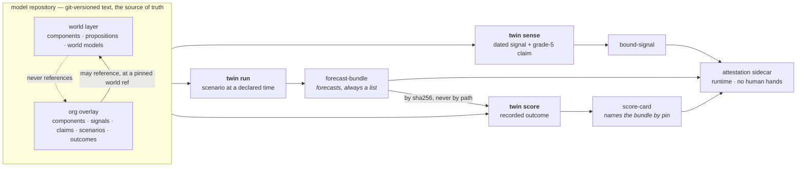

# `twin` — the walking skeleton

Build tickets 01–07 of `.scratch/twin/`. One dated signal binds to a component; one scenario
execution emits forecasts — plural; one recorded outcome scores them. Scoring is in the first
slice rather than retrofitted, because without it we cannot tell whether any later capability
helped, and because scoring dictates what every other component must record.

**This is 7 of 77 build tickets.** What is not built is listed below and, more usefully, is named
inside every artefact the tool emits.

## Run it

```sh
bash twin/demo.sh          # sense -> run -> score, from a clean checkout
./bin/twin verify          # the invariant suite
./bin/twin grade           # computed depth grades, with evidence
```

The tool itself needs only python3, PyYAML and git — all already used by `estate/`. The checks want a
venv, pinned to the same versions CI uses:

```sh
python3 -m venv .venv
.venv/bin/pip install 'pyyaml==6.0.3' 'pytest==9.0.0' 'mypy==1.14.1' 'types-PyYAML==6.0.12.20250516'
.venv/bin/python -m pytest -q
.venv/bin/mypy twin tests conftest.py --ignore-missing-imports --warn-unused-ignores
```

## The loop



Every artefact carries its pins, an authored/derived mark, and the computed depth grade of every
capability that produced it. Machine-varying facts — wall clock, host, interpreter — are absent
from the artefact and live in the sidecar, which is what lets identical pins give identical bytes
across architectures.

## What is honestly built

Depth grades are computed from the acceptance criteria of the owning **decision** ticket. Nothing
reaches `full`, and nothing can be typed as `full`.

| capability | decision ticket | grade | ticked |
|---|---|---|---|
| `domain-model` | 07 | stub | 0 / 7 |
| `provenance` | 14 | partial | 1 / 4 |
| `honest-build` | 20 | partial | 1 / 4 |
| `sense-move` | 11 | partial | 1 / 8 |
| `scenario-engine` | 13 | partial | 1 / 7 |

**4 of 30**, and every artefact therefore carries an overall depth of `stub`. Three of these were
ticked in the first pass and unticked after an adversarial review found each rested on one clause of a
multi-clause criterion. `./bin/twin grade` prints every unticked criterion by name.

## The invariants

`./bin/twin verify` — 12 pass, 0 fail, 8 pending, 2 skipped and not faked. `python3 -m pytest -q` — 95
tests across seams 1 and 2.

| live | pending, with the ticket that activates it |
|---|---|
| `store_rebuildable_from_git` | `only_as_consumed_scores` (08) |
| `identical_pins_identical_bytes` | `derived_never_human_signed` deepens at (11) |
| `every_artefact_marked` | `no_special_category_slot` (12) |
| `every_capability_depth_graded` | `grade_5_only_path_never_prices` (19) |
| `world_never_references_overlay` | `ruin_class_absent_not_priced` (28) |
| `no_collapse_mechanism` | `prefilter_precedes_pricing` (28) |
| `no_recommended_action_field` | `as_consumed_admits_no_post_T_fact` (36) |
| `derived_never_human_signed` (structural) | `price_levels_never_probabilities` (59) |
| | `standing_library_covers_committed_classes` (69) |

A live invariant that skips counts as a failure, and so does a harness guard that skips without
declaring itself skippable. Pending is the only honest way to not assert something, and it is declared
in `invariants/manifest.yaml` where it can be seen. Two guards may skip, and both say why:
`cross_architecture_determinism` needs the CI matrix, and `hash_changes_are_authorised` needs two
committed versions of the manifest to compare.

The manifest also declares, per invariant, the **field names it refuses** — read from there rather than
from the code, because a check that derives its expectation from the thing it is checking is a tautology
and deleting a refusal would silently shrink it.

## What a hostile model repository cannot do

The YAML in a model repository is authored by users and may arrive from another tenant, so the reader
treats it as untrusted. It cannot execute code through repository-local git config (`core.fsmonitor`,
hooks), smuggle a git option through a ref or a `world_ref`, expand a YAML alias bomb into the artefact,
pin the world layer to a ref that moves, hide a file from the listing through `core.quotePath`, or hide
a subtree behind a submodule. Each is refused with a sentence, and each has a test. The one thing it
*can* still do is put whatever it likes into a signal's own fields, which flow into the artefact
verbatim: an artefact is exactly as sensitive as the model repository it came from.

## What is not built

Named here so the skeleton cannot quietly become the definition of done.

- **No causal layer.** Structural dependencies only. Nothing propagates, nothing intervenes, there
  is no Monte-Carlo and no depth attenuation. (Build tickets 17, 20–22.)
- **No £.** No FAIR engine, no PERT sampling, no TVaR, no constraint pre-filter, no trade-off
  curve. The four pricing invariants are pending and there is nothing for them to guard yet.
  (23–33.)
- **No information regimes.** `twin run` takes a time but does not gate on what was knowable then,
  so **no forecast here is scoring-eligible** in the sense the spec means. (36, and
  `only_as_consumed_scores` stays pending until 08.)
- **No rewind, no intervention, no backtest.** The two primitives the engine composes from are
  absent; `run` is time-forward with an authored belief and no inference. (35, 37.)
- **Forecast probabilities are read from a world model's declared belief.** Nothing infers them.
  This is the honest stub: the plumbing is real, the judgement is authored.
- **Scoring is Brier and nothing else.** No proper scoring rules, no reliability diagrams, no
  regime tags, no contamination discount, no hindsight-resistance inversion. (08, 09, 40, 41.)
- **No signing.** `signature` is null and says so; the authored/derived split is enforced
  structurally but not cryptographically. (11.)
- **No skills, and therefore no seam 3.** The six skills are non-deterministic by construction and
  need their own eval harness; none exists, so skill regression would currently go silent. (42.)
- **No substrate.** The content-hash reference form round-trips against nothing. (48–51.)
- **The two-architecture determinism check has never run.** The CI matrix is declared and the
  golden digests are committed; the claim is wired, not proven. This is the one acceptance
  criterion left unticked in tickets 01–07.
- **The subjects are fixtures.** Netflix and Intel here are toy value chains with invented
  numbers, exercising the shape and nothing else. The real flagship work is tickets 71–77.
- **Sensing is a dead end.** Nothing consumes a bound signal: a signal cannot move an inferred
  position and cannot change a forecast. The spec's skeleton is "signal → binds to a component →
  **an inferred position moves** → execution"; the middle step is missing, so `sense` and `run`
  are two verbs over one repository rather than one loop.
- **Only signals have a schema.** A model object needs an `id`, a signal needs a date, a STEEP
  class, a source, a statement and provenance — everything else is whatever the author typed.
  (12.)
- **Attestations are write-only.** A sidecar is emitted and nothing ever reads one back or
  verifies it, so it provides no tamper-evidence even in principle yet. (11.)
- **Overlay-to-overlay isolation has tests but no invariant.** The constitution's sixteen cover
  the world→overlay direction, not tenant→tenant reads, and the manifest may not grow a
  seventeenth without the constitution changing first.
- **`hash_changes_are_authorised` has never run green.** It needs two committed versions of the
  manifest to compare; the first lands with this commit, so it skips until the second.

## Layout

```
twin/
  cli.py          seam 1 — the artefact CLI, the primary boundary
  verbs.py        sense / run / score
  repo.py         the pinned model repository; reads go through a git tree, never the worktree
  model.py        world layer, org overlays, the directional rule
  artefact.py     the envelope; forbidden field names refused at emission
  attest.py       attestation sidecars — where machine-varying facts go
  grades.py       depth grades as computed checklists
  blob.py         content-hash references for bulk substrate
  index.py        the derived index — a store, and therefore never authoritative
  canon.py        canonical serialisation
  fixtures.py     the deterministic fixture model repository
  capabilities/   one checklist per decision ticket that has code
  invariants/     manifest, harness, checks, golden digests
  demo.sh         the end-to-end
```

Code here is **disposable by default**. The durable artefacts are the versioned model repository
and the decision record under `.scratch/twin/`; replacing this code is normal, and the tests
assert on emitted artefacts rather than internals so that they do not become the sunk cost that
resists the rewrite.
