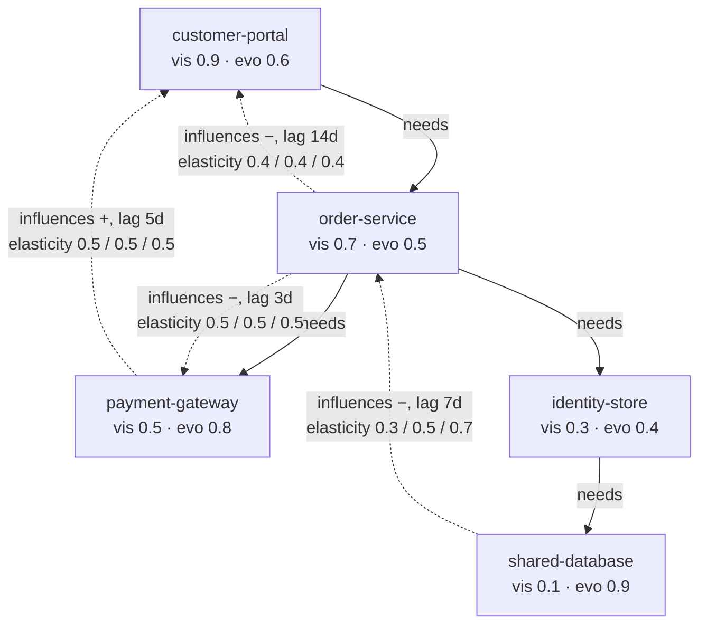

# The pocket-org worksheet

Authored-by-role: worksheet-author

**This file is human-authored, and it is the one place in this system where a human number is the
authority.** Everywhere else a number is derived and a hand-typed one is refused. Here the
arithmetic below is the yardstick, and the code is what has to match it.

It exists because a refusal test catches a *reintroduced absence* and nothing else. A PERT triple
that is present but garbage, a score tagged with the wrong regime, an elasticity that stops being
recalibrated three tickets later — all of those keep every refusal test green. This worksheet is
what they fail against.

`twin worksheet --repo <a pocket-org repository>` checks the emitted artefacts against every line
below — the **graph**, the **blast radius** from `shared-database`, the **exposure** of scenario
`portal-availability-2026` under both declared perspectives, the **propagation** of a shock at
`shared-database`, the **priced option set** under the operator, and the **intervention** and the
**observation** at `order-service`. Values are compared at **6 decimal places**, declared here
rather than hidden inside the comparison, because the expected column is decimal and the computed
one is binary floating point.

## The contract every later ticket inherits

**Every ticket on the derivation path adds its own line to this table.** A derivation-path ticket
that lands without a line here has no yardstick, and a line whose `asserted by` names a build
ticket that is already closed is a failure of this worksheet, not of the code.

## The organisation

Five components, eight edges. The world layer is deliberately empty of components, so every number
below comes from the overlay.

The last two causal edges close the **diamond** build ticket 21 needs: a shock at `shared-database`
reaches `customer-portal` two ways, and both cross `database-slows-orders`. That shared edge is
what a naive independence assumption counts twice.

**The signs are load-bearing.** A chain's sign is the product of its hops, so the long route needs
an even number of negatives to end up pointing the same way as the short one: `−` then `−` gives
`+`, and `−` then `−` then `+` gives `+` as well. Two routes that disagreed in direction would not
be combined at all — one raising the portal and one lowering it have no single magnitude between
them — and the diamond would have nothing left to demonstrate.

## The arithmetic, by hand

**Differentiation pressure**, `D = vis x (1 - evo)`:

- customer-portal: `0.9 x (1 - 0.6) = 0.9 x 0.4 = 0.36`
- order-service: `0.7 x (1 - 0.5) = 0.7 x 0.5 = 0.35`
- payment-gateway: `0.5 x (1 - 0.8) = 0.5 x 0.2 = 0.10`
- identity-store: `0.3 x (1 - 0.4) = 0.3 x 0.6 = 0.18`
- shared-database: `0.1 x (1 - 0.9) = 0.1 x 0.1 = 0.01`

**Commodity leverage**, `K = (1 - vis) x evo`:

- customer-portal: `(1 - 0.9) x 0.6 = 0.1 x 0.6 = 0.06`
- order-service: `(1 - 0.7) x 0.5 = 0.3 x 0.5 = 0.15`
- payment-gateway: `(1 - 0.5) x 0.8 = 0.5 x 0.8 = 0.40`
- identity-store: `(1 - 0.3) x 0.4 = 0.7 x 0.4 = 0.28`
- shared-database: `(1 - 0.1) x 0.9 = 0.9 x 0.9 = 0.81`

**Dependency risk**, `R(a, b) = vis(a) x (1 - evo(b))`, one per structural edge:

- customer-portal needs order-service: `0.9 x (1 - 0.5) = 0.45`
- order-service needs payment-gateway: `0.7 x (1 - 0.8) = 0.14`
- order-service needs identity-store: `0.7 x (1 - 0.4) = 0.42`
- identity-store needs shared-database: `0.3 x (1 - 0.9) = 0.03`

**Propagated influence** of a unit shock at `shared-database`, along the causal chain
`shared-database -> order-service -> customer-portal`, multiplying elasticities and applying no
depth attenuation:

- depth 1, at order-service: the edge triple itself, `[0.3, 0.5, 0.7]`
- depth 2, at customer-portal: `[0.3 x 0.4, 0.5 x 0.4, 0.7 x 0.4] = [0.12, 0.20, 0.28]`

Build ticket 20 introduced depth attenuation, and it **added its own lines** below rather than
changing these: these are the un-attenuated numbers, and both must be visible or the attenuation
is unfalsifiable.

**The attenuated influence**, from the published schedule: factor `1.0` at depth 1 and `0.8` at
depth 2. Both the composed and the attenuated numbers stay in the table, which is what makes the
attenuation falsifiable rather than merely applied.

- depth 1, at order-service: `[0.3, 0.5, 0.7] x 1.0 = [0.3, 0.5, 0.7]` — one hop is the authored
  claim itself and nothing has compounded yet
- depth 2, at customer-portal: `[0.12, 0.20, 0.28] x 0.8 = [0.096, 0.16, 0.224]`

**The diamond, and the common cause it does not count twice** (build ticket 21). Two paths run from
`shared-database` to `customer-portal`, and both start with `database-slows-orders`:

- through the order service: depth 2, attenuation `0.8`, remainder `0.4`, so `I1 = 0.32 x S`
- through the payment gateway: depth 3, attenuation `0.6`, remainder `0.5 x 0.5 = 0.25`, so
  `I2 = 0.15 x S`
- both are `+`, so they combine; the combined figure carries that sign

`S` is the shared triple `[0.3, 0.5, 0.7]`, whose PERT mean is `0.5` and whose PERT variance is
`(0.5 - 0.3) x (0.7 - 0.5) / 7 = 0.04 / 7`. Paths are combined by **noisy-OR**,
`1 - (1 - I1)(1 - I2)`, never added — two routes for one shock cannot total more than one certain
route. Expanding it:

- combined, with the dependence:
  `E[I1] + E[I2] - E[I1 x I2] = 0.32 x 0.5 + 0.15 x 0.5 - 0.32 x 0.15 x E[S²]`, and
  `E[S²] = 0.5² + 0.04 / 7 = 0.255714285714...`, giving `0.235 - 0.012274285714 = 0.222725714286`
- as if the two were independent: the same sum with `E[S]²` in place of `E[S²]`, giving
  `0.235 - 0.048 x 0.25 = 0.223`
- the difference is exactly `0.048 x 0.04 / 7 = 0.000274285714`, which is `0.048` **times** the
  variance of the common cause. That product is the double count avoided

Both figures are emitted, for the same reason the composed triple is emitted beside the attenuated
one: a dependence correction whose un-corrected form was never shown is unfalsifiable. The
remainders are degenerate on purpose, so the whole difference comes from one triple and a reviewer
can check it by hand.

**Doing versus learning**, at `order-service` (build ticket 22). The downstream halves are
identical, which is the point — the difference between `do()` and `observe()` lives entirely
upstream:

- both reach `customer-portal` and `payment-gateway`, so both report **2** components downstream
- `do(order-service)` severs its **1** incoming causal edge, `database-slows-orders`, and updates
  belief about **0** components upstream — doing a thing does not rewrite its own causes
- `observe(order-service)` severs **0** edges and updates belief about **1** component upstream,
  `shared-database`, because learning that orders moved is evidence about what moved them

**The PERT means** of the two elasticities that carry width. The other two are the diamond's
legs, both degenerate at `0.5`, so their means are their points. `(min + 4 x mode + max) / 6`:

- `database-slows-orders`: `(0.3 + 4 x 0.5 + 0.7) / 6 = 3.0 / 6 = 0.5`
- `orders-slow-the-portal`: `(0.4 + 4 x 0.4 + 0.4) / 6 = 2.4 / 6 = 0.4` — degenerate, so the mean
  is the point

**The choice set**, under the operator, after the constraint pre-filter runs. Three responses are
authored; two cross a red line in force for this perspective and are removed **before** anything
is priced, so neither carries a figure anywhere:

- `add-a-read-replica` crosses nothing and is priced. Its mean cost is
  `(10000 + 4 x 25000 + 70000) / 6 = 180000 / 6 = 30000`
- `watch-the-team-quietly` crosses `no-covert-sensing`, which is on the universal floor
- `bet-the-org-on-one-supplier` crosses `insolvency`, which the operator declares as ruin-class
- both removed options cost almost nothing, which is the point: the pre-filter never reads a cost,
  so no magnitude can bring either back

**Admission to the £**, under the operator, whose only declared cash flow is `customer-portal`.
The boundary is derived from the graph, so no author can mark an impact priceable:

- `customer-portal` is itself the declared cash flow, so it needs no path
- `order-service` reaches it along `orders-slow-the-portal`, whose grade is 2 and therefore inside
  the published admission threshold
- `identity-store` has no causal edge leaving it at all, so nothing reaches the cash flow and the
  impact is refused — and it is refused **while carrying a grade-2 valuation**, which is what
  makes the use-gate and the admission gate visibly two different questions

**The price** (build ticket 30), and the correction this worksheet needed before it could be one.

Lines 27-29 previously read `1000000 x [0.12, 0.20, 0.28]` — an authored severity scaled by the
propagation from `shared-database`. **Both halves of that were wrong, and they were wrong because
they were authored at build ticket 15 and three gates landed after them.**

1. *The path may not price.* Every route out of `shared-database` crosses `database-slows-orders`
   at grade 3, and the published threshold is 2. This same worksheet says so at line 34:
   `blast.shared-database.admitted_to_pricing = 0`. The old lines asked for a number the rest of
   the table already said could not exist.
2. *The severity had no home.* `1000000` lived in this prose and nowhere in the model. Giving it
   one would put **two** authored magnitudes on `customer-portal` under one eye — a severity and
   the operator's declared valuation of `400000` — with nothing reconciling them and an author
   free to move the price through whichever is watched less.

So the price is **the perspective's own declared valuation scaled by the propagated influence**,
and there is no severity anywhere. One authored magnitude per component per eye, already
evidence-graded, and the £ stays perspectival right down into the price.

The priced shock is at `order-service`, because `orders-slow-the-portal` is the only causal edge in
this organisation graded well enough to price. Depth 1, so the attenuation factor is `1.0` and the
composed and attenuated figures agree — which is why these lines are unambiguous.

- the operator: `400000 x 0.4 = 160000`, flat, because that edge is degenerate on purpose
- the staff council: `50000 x 0.4 = 20000`
- the spread between the two eyes: `160000 - 20000 = 140000`
- `payment-gateway` is reached from `order-service` along `orders-slow-payments` at grade 3, so it
  is **refused** and carries no figure
- the same shock at `shared-database` prices **nothing** under either eye, which is the gate
  working rather than the tool failing

**The flat price is a finding, not a simplification.** The pocket org's only legal price is a point
because its only admissible edge has no width, and the edge that carries a real range may not
price. That is the honest shape of a model whose best-evidenced claim is also its least uncertain.

**Response pricing and mitigation credit.** Four responses are authored now; two survive the
operator's pre-filter and are costed in the same unit as the impact:

- `retrain-the-on-call-rota` — not a technical control. Mean cost
  `(2000 + 4 x 5000 + 14000) / 6 = 36000 / 6 = 6000`. It claims a reduction of `[0.1, 0.25, 0.4]`
  at grade 2, so the claim may price: credit `160000 x [0.1, 0.25, 0.4] = [16000, 40000, 64000]`,
  whose PERT mean is `(16000 + 4 x 40000 + 64000) / 6 = 240000 / 6 = 40000`
- `add-a-read-replica` — a technical control. Mean cost `30000`, five times the rota. It claims a
  **larger** reduction of `[0.4, 0.5, 0.6]` and claims it at grade 3, so it earns **no credit at
  all**. Not a discounted one: an unevidenced counterfactual is free to assert, and "the incident
  did not happen because of our control" is a causal claim like any other

That comparison is the whole point of one unit. A rota change and a database change are priced on
the same scale, the cheaper one is the non-technical one, and the more confident claim is the one
the evidence gate refuses.

Under the **staff council** a third option survives, because that perspective declares
loss-of-livelihood rather than insolvency: `bet-the-org-on-one-supplier` is costed and claims no
mitigation at all, so it earns nothing. Silence is not an average reduction.

The constraint pre-filter (build ticket 28) runs **before** any of this, so none of these figures
is ever comparable against a red line.

**The use-gate**, by evidence grade. The published threshold is 2, so only an edge at grade 1 or 2
may carry a price:

- `database-slows-orders` is grade 3 — literature or domain theory, so it may not price
- `orders-slow-the-portal` is grade 2 — repeated historical co-movement, so it may
- one of the two causal edges is therefore admissible to pricing

**The blast radius** from a shock at `shared-database`, following causal edges forwards and
`needs` edges backwards to whoever depends on the node:

- `order-service` — reached causally at grade 3, and structurally as a dependent
- `customer-portal` — reached along `shared-database -> order-service -> customer-portal`, whose
  weakest hop is grade 3
- `payment-gateway` — reached causally along the diamond's first leg, also at grade 3
- `identity-store` — reached only structurally, so no mechanism is claimed at all
- four components reached, and **nothing** admitted to pricing: every path out of the database
  crosses the grade-3 edge, so the honest answer here is an unpriced structural blast radius

**The exposure** of scenario `portal-availability-2026`, whose components are `customer-portal`,
`order-service` and `identity-store`, under each declared perspective. The operator values all
three; the third is refused by the admission gate below and so never reaches the sum:

- the operator: `400000 + 250000 = 650000`, and **not** the `90000` on `identity-store`
- the staff council: `50000 + 120000 = 170000`, and it never valued `identity-store` at all
- the spread between the two eyes: `650000 - 170000 = 480000`
- attributable to `customer-portal`: `400000 - 50000 = 350000`
- attributable to `order-service`: `250000 - 120000 = 130000`
- attributable to `identity-store`: nothing, from either eye — `null`, never zero, because zero
  would say "worth nothing to them" and that is a different claim

These are **declared valuations**, not modelled prices: the causal layer composes in `twin
propagate` and is not joined to the £ until build ticket 30, and no severity is sampled. The
figures are what each perspective says a component is worth to it. The spread is the point — no
single number is the organisation's number, because there is no such thing.

## The table

Every line the code must match. `pending` lines carry the arithmetic already; the build ticket
named is the one that must make them computable.

| # | line | expected | arithmetic | asserted by |
|---|------|----------|------------|-------------|
| 1 | `rollups.components` | `5` | five component files | build ticket 15 |
| 2 | `rollups.edges` | `8` | four structural, four causal | build ticket 15 |
| 3 | `rollups.causal_edges` | `4` | database->orders, orders->portal, and the diamond's two legs | build ticket 15 |
| 4 | `rollups.causal_edges_with_degenerate_elasticity` | `3` | orders->portal and both diamond legs | build ticket 17 |
| 5 | `rollups.components_positioned_on_the_map` | `5` | every component declares both axes | build ticket 14 |
| 6 | `D(customer-portal)` | `0.36` | 0.9 x 0.4 | build ticket 14 |
| 7 | `D(order-service)` | `0.35` | 0.7 x 0.5 | build ticket 14 |
| 8 | `D(payment-gateway)` | `0.1` | 0.5 x 0.2 | build ticket 14 |
| 9 | `D(identity-store)` | `0.18` | 0.3 x 0.6 | build ticket 14 |
| 10 | `D(shared-database)` | `0.01` | 0.1 x 0.1 | build ticket 14 |
| 11 | `K(customer-portal)` | `0.06` | 0.1 x 0.6 | build ticket 14 |
| 12 | `K(order-service)` | `0.15` | 0.3 x 0.5 | build ticket 14 |
| 13 | `K(payment-gateway)` | `0.4` | 0.5 x 0.8 | build ticket 14 |
| 14 | `K(identity-store)` | `0.28` | 0.7 x 0.4 | build ticket 14 |
| 15 | `K(shared-database)` | `0.81` | 0.9 x 0.9 | build ticket 14 |
| 16 | `R(customer-portal -> order-service)` | `0.45` | 0.9 x 0.5 | build ticket 14 |
| 17 | `R(order-service -> payment-gateway)` | `0.14` | 0.7 x 0.2 | build ticket 14 |
| 18 | `R(order-service -> identity-store)` | `0.42` | 0.7 x 0.6 | build ticket 14 |
| 19 | `R(identity-store -> shared-database)` | `0.03` | 0.3 x 0.1 | build ticket 14 |
| 20 | `elasticity.database-slows-orders.min` | `0.3` | authored | build ticket 17 |
| 21 | `elasticity.database-slows-orders.mode` | `0.5` | authored | build ticket 17 |
| 22 | `elasticity.database-slows-orders.max` | `0.7` | authored | build ticket 17 |
| 23 | `elasticity.orders-slow-the-portal.mode` | `0.4` | authored, degenerate | build ticket 17 |
| 24 | `propagation.customer-portal.min` | `0.12` | 0.3 x 0.4 | build ticket 20 |
| 25 | `propagation.customer-portal.mode` | `0.2` | 0.5 x 0.4 | build ticket 20 |
| 26 | `propagation.customer-portal.max` | `0.28` | 0.7 x 0.4 | build ticket 20 |
| 27 | `price.order-service.the-operator.customer-portal.mode` | `160000` | 400000 x 0.4, the operator's own declared valuation | build ticket 30 |
| 28 | `price.order-service.the-staff-council.customer-portal.mode` | `20000` | 50000 x 0.4, the same shock under the other eye | build ticket 30 |
| 29 | `price.order-service.spread.customer-portal` | `140000` | 160000 - 20000; no single organisational price exists | build ticket 30 |
| 30 | `evidence_grade.database-slows-orders` | `3` | authored, literature or domain theory | build ticket 18 |
| 31 | `evidence_grade.orders-slow-the-portal` | `2` | authored, repeated co-movement | build ticket 18 |
| 32 | `rollups.causal_edges_admissible_to_pricing` | `1` | only orders->portal is at grade 2 or better | build ticket 19 |
| 33 | `blast.shared-database.reached` | `4` | order-service, customer-portal, payment-gateway, identity-store | build ticket 19 |
| 34 | `blast.shared-database.admitted_to_pricing` | `0` | every path out crosses the grade-3 edge | build ticket 19 |
| 35 | `blast.shared-database.unpriced` | `4` | 4 reached, 0 priced | build ticket 19 |
| 36 | `exposure.declared.the-operator` | `650000` | 400000 + 250000 | build ticket 26 |
| 37 | `exposure.declared.the-staff-council` | `170000` | 50000 + 120000 | build ticket 26 |
| 38 | `exposure.spread` | `480000` | 650000 - 170000 | build ticket 26 |
| 39 | `exposure.spread.customer-portal` | `350000` | 400000 - 50000 | build ticket 26 |
| 40 | `exposure.spread.order-service` | `130000` | 250000 - 120000 | build ticket 26 |
| 41 | `pert.database-slows-orders.mean` | `0.5` | (0.3 + 4 x 0.5 + 0.7) / 6 | build ticket 23 |
| 42 | `pert.orders-slow-the-portal.mean` | `0.4` | (0.4 + 4 x 0.4 + 0.4) / 6, degenerate | build ticket 23 |
| 43 | `propagation.attenuation.order-service` | `1` | depth 1, the authored claim itself | build ticket 20 |
| 44 | `propagation.attenuation.customer-portal` | `0.8` | depth 2 on the published schedule | build ticket 20 |
| 45 | `propagation.attenuated.customer-portal.min` | `0.096` | 0.12 x 0.8 | build ticket 20 |
| 46 | `propagation.attenuated.customer-portal.mode` | `0.16` | 0.2 x 0.8 | build ticket 20 |
| 47 | `propagation.attenuated.customer-portal.max` | `0.224` | 0.28 x 0.8 | build ticket 20 |
| 48 | `options.the-operator.considered` | `4` | four authored responses; build ticket 30 added the on-call rota | build ticket 28 |
| 49 | `options.the-operator.removed` | `2` | one record per crossed line: covert sensing, the ruin bet | build ticket 28 |
| 50 | `options.the-operator.priced` | `2` | the read replica and the rota both cross nothing | build ticket 28 |
| 51 | `option_price.add-a-read-replica.mean` | `30000` | (10000 + 4 x 25000 + 70000) / 6 | build ticket 28 |
| 52 | `admission.the-operator.customer-portal` | `1` | itself the declared cash flow | build ticket 29 |
| 53 | `admission.the-operator.order-service` | `1` | reaches it at grade 2 | build ticket 29 |
| 54 | `admission.the-operator.identity-store` | `0` | no causal edge leaves it | build ticket 29 |
| 55 | `joint.customer-portal.paths` | `2` | through the order service, and round through the gateway | build ticket 21 |
| 56 | `joint.customer-portal.shared_edges` | `1` | both routes cross database-slows-orders | build ticket 21 |
| 57 | `joint.customer-portal.exact` | `0.222726` | 0.235 - 0.048 x (0.25 + 0.04/7) | build ticket 21 |
| 58 | `joint.customer-portal.if_independent` | `0.223` | 0.235 - 0.048 x 0.25 | build ticket 21 |
| 59 | `joint.customer-portal.double_counting_avoided` | `0.000274` | 0.048 x the common cause's variance, 0.04/7 | build ticket 21 |
| 60 | `joint.payment-gateway.shared_edges` | `0` | one path only, so nothing is shared | build ticket 21 |
| 61 | `joint.payment-gateway.double_counting_avoided` | `0` | no shared ancestry, no correction | build ticket 21 |
| 62 | `intervene.order-service.severed` | `1` | do() cuts database-slows-orders | build ticket 22 |
| 63 | `intervene.order-service.upstream` | `0` | doing a thing does not rewrite its own causes | build ticket 22 |
| 64 | `observe.order-service.upstream` | `1` | learning it moved is evidence about shared-database | build ticket 22 |
| 65 | `observe.order-service.severed` | `0` | an observation severs nothing; nothing was done | build ticket 22 |
| 66 | `intervene.order-service.reached` | `2` | customer-portal and payment-gateway | build ticket 22 |
| 67 | `observe.order-service.reached` | `2` | the same two: the downstream halves are identical | build ticket 22 |
| 68 | `price.order-service.the-operator.customer-portal.min` | `160000` | 400000 x 0.4; flat, because that edge is degenerate | build ticket 30 |
| 69 | `price.order-service.the-operator.customer-portal.max` | `160000` | 400000 x 0.4; the only priceable edge carries no width | build ticket 30 |
| 70 | `price.order-service.the-operator.payment-gateway.priced` | `0` | reached at grade 3, so refused and carrying no figure | build ticket 30 |
| 71 | `price.shared-database.the-operator.customer-portal.priced` | `0` | every route out crosses the grade-3 edge | build ticket 30 |
| 72 | `option_price.retrain-the-on-call-rota.mean` | `6000` | (2000 + 4 x 5000 + 14000) / 6 | build ticket 30 |
| 73 | `credit.order-service.the-operator.retrain-the-on-call-rota.mean` | `40000` | (16000 + 4 x 40000 + 64000) / 6, from 160000 x [0.1, 0.25, 0.4] | build ticket 30 |
| 74 | `credit.order-service.the-operator.retrain-the-on-call-rota.mode` | `40000` | 160000 x 0.25 | build ticket 30 |
| 75 | `credit.order-service.the-operator.add-a-read-replica.credited` | `0` | a grade-3 mitigation claim earns nothing, not a discount | build ticket 30 |
| 76 | `credit.order-service.the-staff-council.bet-the-org-on-one-supplier.credited` | `0` | it claims no mitigation; silence is not an average reduction | build ticket 30 |
