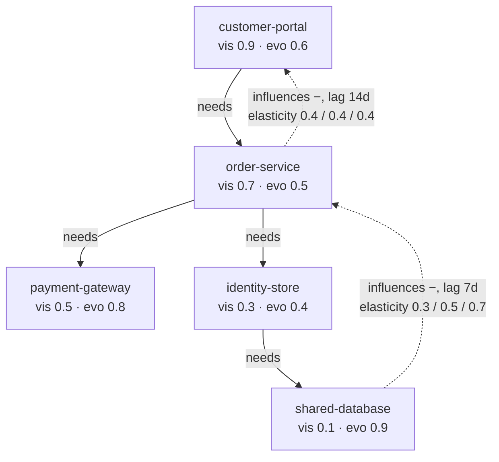

# The pocket-org worksheet

Authored-by-role: worksheet-author

**This file is human-authored, and it is the one place in this system where a human number is the
authority.** Everywhere else a number is derived and a hand-typed one is refused. Here the
arithmetic below is the yardstick, and the code is what has to match it.

It exists because a refusal test catches a *reintroduced absence* and nothing else. A PERT triple
that is present but garbage, a score tagged with the wrong regime, an elasticity that stops being
recalibrated three tickets later — all of those keep every refusal test green. This worksheet is
what they fail against.

`twin worksheet --repo <a pocket-org repository>` checks the emitted artefacts against every line
below — the **graph**, the **blast radius** from `shared-database`, and the **exposure** of
scenario `portal-availability-2026` under both declared perspectives. Values are compared at
**6 decimal places**, declared here rather than hidden inside the comparison, because the expected
column is decimal and the computed one is binary floating point.

## The contract every later ticket inherits

**Every ticket on the derivation path adds its own line to this table.** A derivation-path ticket
that lands without a line here has no yardstick, and a line whose `asserted by` names a build
ticket that is already closed is a failure of this worksheet, not of the code.

## The organisation

Five components, six edges. The world layer is deliberately empty of components, so every number
below comes from the overlay.

## The arithmetic, by hand

**Differentiation pressure**, `D = vis x (1 - evo)`:

- customer-portal: `0.9 x (1 - 0.6) = 0.9 x 0.4 = 0.36`
- order-service: `0.7 x (1 - 0.5) = 0.7 x 0.5 = 0.35`
- payment-gateway: `0.5 x (1 - 0.8) = 0.5 x 0.2 = 0.10`
- identity-store: `0.3 x (1 - 0.4) = 0.3 x 0.6 = 0.18`
- shared-database: `0.1 x (1 - 0.9) = 0.1 x 0.1 = 0.01`

**Commodity leverage**, `K = (1 - vis) x evo`:

- customer-portal: `(1 - 0.9) x 0.6 = 0.1 x 0.6 = 0.06`
- order-service: `(1 - 0.7) x 0.5 = 0.3 x 0.5 = 0.15`
- payment-gateway: `(1 - 0.5) x 0.8 = 0.5 x 0.8 = 0.40`
- identity-store: `(1 - 0.3) x 0.4 = 0.7 x 0.4 = 0.28`
- shared-database: `(1 - 0.1) x 0.9 = 0.9 x 0.9 = 0.81`

**Dependency risk**, `R(a, b) = vis(a) x (1 - evo(b))`, one per structural edge:

- customer-portal needs order-service: `0.9 x (1 - 0.5) = 0.45`
- order-service needs payment-gateway: `0.7 x (1 - 0.8) = 0.14`
- order-service needs identity-store: `0.7 x (1 - 0.4) = 0.42`
- identity-store needs shared-database: `0.3 x (1 - 0.9) = 0.03`

**Propagated influence** of a unit shock at `shared-database`, along the causal chain
`shared-database -> order-service -> customer-portal`, multiplying elasticities and applying no
depth attenuation:

- depth 1, at order-service: the edge triple itself, `[0.3, 0.5, 0.7]`
- depth 2, at customer-portal: `[0.3 x 0.4, 0.5 x 0.4, 0.7 x 0.4] = [0.12, 0.20, 0.28]`

Build ticket 20 introduces depth attenuation, and when it does it must **add its own lines**
here rather than change these: these are the un-attenuated numbers, and both must be visible or
the attenuation is unfalsifiable.

**Expected price** of a total `customer-portal` outage, at the mode of that propagation:

- authored severity, `S = 1000000` — a fixture number with **no empirical anchor**, which build
  ticket 25 replaces with one that has
- expected loss at the mode: `1000000 x 0.20 = 200000`
- expected loss across the range: `1000000 x [0.12, 0.28] = [120000, 280000]`

The constraint pre-filter (build ticket 28) runs **before** any of this, so none of these figures
is ever comparable against a red line. That ordering gets its own line when it lands.

**The use-gate**, by evidence grade. The published threshold is 2, so only an edge at grade 1 or 2
may carry a price:

- `database-slows-orders` is grade 3 — literature or domain theory, so it may not price
- `orders-slow-the-portal` is grade 2 — repeated historical co-movement, so it may
- one of the two causal edges is therefore admissible to pricing

**The blast radius** from a shock at `shared-database`, following causal edges forwards and
`needs` edges backwards to whoever depends on the node:

- `order-service` — reached causally at grade 3, and structurally as a dependent
- `customer-portal` — reached along `shared-database -> order-service -> customer-portal`, whose
  weakest hop is grade 3
- `identity-store` — reached only structurally, so no mechanism is claimed at all
- three components reached, and **nothing** admitted to pricing: every path out of the database
  crosses the grade-3 edge, so the honest answer here is an unpriced structural blast radius

**The exposure** of scenario `portal-availability-2026`, whose components are `customer-portal`
and `order-service`, under each declared perspective:

- the operator: `400000 + 250000 = 650000`
- the staff council: `50000 + 120000 = 170000`
- the spread between the two eyes: `650000 - 170000 = 480000`
- attributable to `customer-portal`: `400000 - 50000 = 350000`
- attributable to `order-service`: `250000 - 120000 = 130000`

These are **declared valuations**, not modelled prices: nothing propagates yet and no severity is
sampled, so the figures are what each perspective says a component is worth to it. The spread is
the point — no single number is the organisation's number, because there is no such thing.

## The table

Every line the code must match. `pending` lines carry the arithmetic already; the build ticket
named is the one that must make them computable.

| # | line | expected | arithmetic | asserted by |
|---|------|----------|------------|-------------|
| 1 | `rollups.components` | `5` | five component files | build ticket 15 |
| 2 | `rollups.edges` | `6` | four structural, two causal | build ticket 15 |
| 3 | `rollups.causal_edges` | `2` | database->orders, orders->portal | build ticket 15 |
| 4 | `rollups.causal_edges_with_degenerate_elasticity` | `1` | orders->portal is 0.4/0.4/0.4 | build ticket 17 |
| 5 | `rollups.components_positioned_on_the_map` | `5` | every component declares both axes | build ticket 14 |
| 6 | `D(customer-portal)` | `0.36` | 0.9 x 0.4 | build ticket 14 |
| 7 | `D(order-service)` | `0.35` | 0.7 x 0.5 | build ticket 14 |
| 8 | `D(payment-gateway)` | `0.1` | 0.5 x 0.2 | build ticket 14 |
| 9 | `D(identity-store)` | `0.18` | 0.3 x 0.6 | build ticket 14 |
| 10 | `D(shared-database)` | `0.01` | 0.1 x 0.1 | build ticket 14 |
| 11 | `K(customer-portal)` | `0.06` | 0.1 x 0.6 | build ticket 14 |
| 12 | `K(order-service)` | `0.15` | 0.3 x 0.5 | build ticket 14 |
| 13 | `K(payment-gateway)` | `0.4` | 0.5 x 0.8 | build ticket 14 |
| 14 | `K(identity-store)` | `0.28` | 0.7 x 0.4 | build ticket 14 |
| 15 | `K(shared-database)` | `0.81` | 0.9 x 0.9 | build ticket 14 |
| 16 | `R(customer-portal -> order-service)` | `0.45` | 0.9 x 0.5 | build ticket 14 |
| 17 | `R(order-service -> payment-gateway)` | `0.14` | 0.7 x 0.2 | build ticket 14 |
| 18 | `R(order-service -> identity-store)` | `0.42` | 0.7 x 0.6 | build ticket 14 |
| 19 | `R(identity-store -> shared-database)` | `0.03` | 0.3 x 0.1 | build ticket 14 |
| 20 | `elasticity.database-slows-orders.min` | `0.3` | authored | build ticket 17 |
| 21 | `elasticity.database-slows-orders.mode` | `0.5` | authored | build ticket 17 |
| 22 | `elasticity.database-slows-orders.max` | `0.7` | authored | build ticket 17 |
| 23 | `elasticity.orders-slow-the-portal.mode` | `0.4` | authored, degenerate | build ticket 17 |
| 24 | `propagation.customer-portal.min` | `0.12` | 0.3 x 0.4 | build ticket 20 |
| 25 | `propagation.customer-portal.mode` | `0.2` | 0.5 x 0.4 | build ticket 20 |
| 26 | `propagation.customer-portal.max` | `0.28` | 0.7 x 0.4 | build ticket 20 |
| 27 | `price.customer-portal.mode` | `200000` | 1000000 x 0.20 | build ticket 30 |
| 28 | `price.customer-portal.min` | `120000` | 1000000 x 0.12 | build ticket 30 |
| 29 | `price.customer-portal.max` | `280000` | 1000000 x 0.28 | build ticket 30 |
| 30 | `evidence_grade.database-slows-orders` | `3` | authored, literature or domain theory | build ticket 18 |
| 31 | `evidence_grade.orders-slow-the-portal` | `2` | authored, repeated co-movement | build ticket 18 |
| 32 | `rollups.causal_edges_admissible_to_pricing` | `1` | only orders->portal is at grade 2 or better | build ticket 19 |
| 33 | `blast.shared-database.reached` | `3` | order-service, customer-portal, identity-store | build ticket 19 |
| 34 | `blast.shared-database.admitted_to_pricing` | `0` | every path out crosses the grade-3 edge | build ticket 19 |
| 35 | `blast.shared-database.unpriced` | `3` | 3 reached, 0 priced | build ticket 19 |
| 36 | `exposure.declared.the-operator` | `650000` | 400000 + 250000 | build ticket 26 |
| 37 | `exposure.declared.the-staff-council` | `170000` | 50000 + 120000 | build ticket 26 |
| 38 | `exposure.spread` | `480000` | 650000 - 170000 | build ticket 26 |
| 39 | `exposure.spread.customer-portal` | `350000` | 400000 - 50000 | build ticket 26 |
| 40 | `exposure.spread.order-service` | `130000` | 250000 - 120000 | build ticket 26 |
